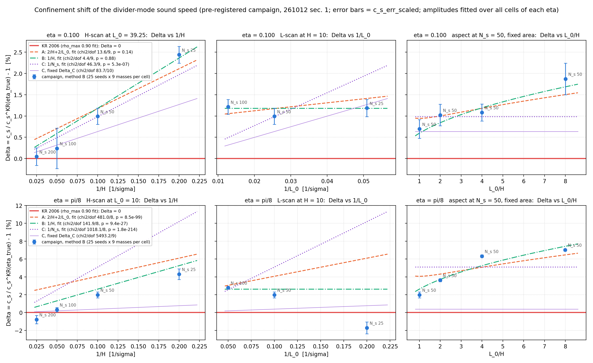
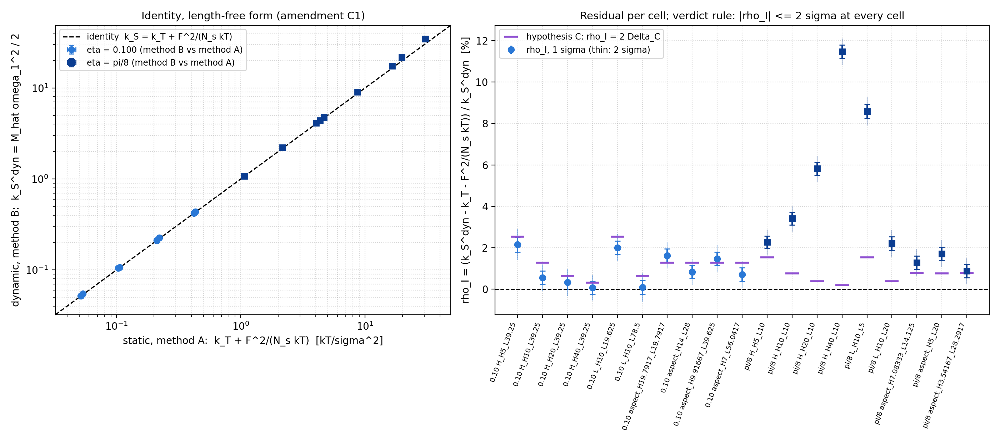
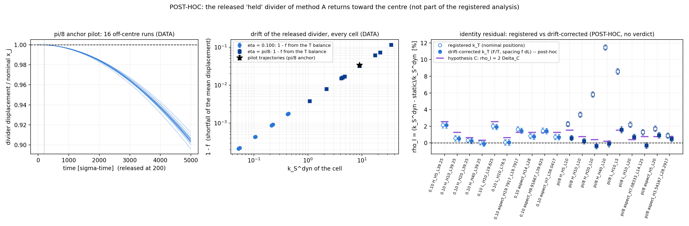
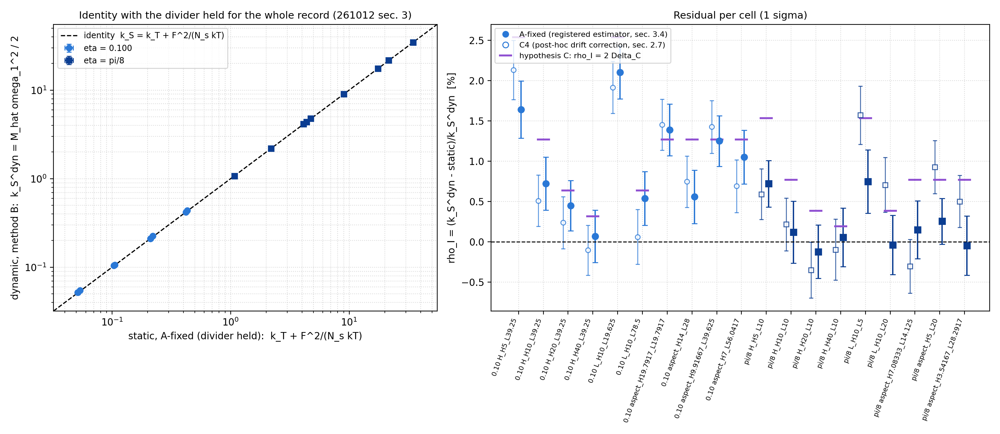
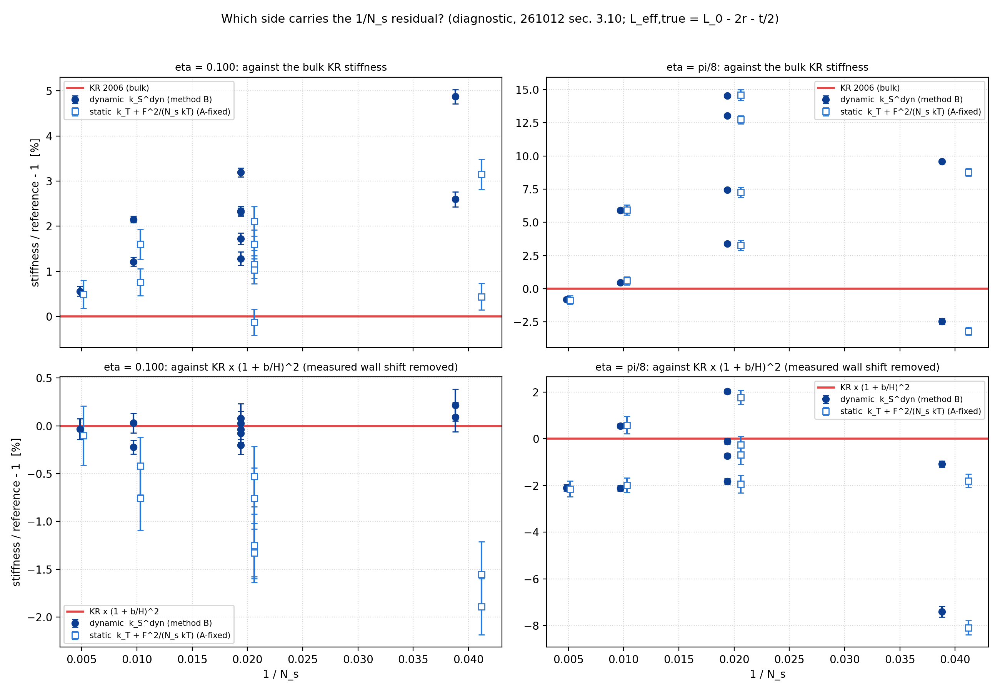

# Paper 1 confinement campaign — PRE-REGISTRATION (not launched)

Written 2026-10-12 before any run. **Nothing here is launched.** *Amended the same day (§ 1.9, C1–C2); still unlaunched.* The campaign starts after the
Paper 2 efficiency map and only on an explicit go. Every number in the tables of § 1.4 is printed
by `python3 hspist3/validation/paper1_confinement_prereg_20261012.py`, pasted verbatim.

## 1. PRE-REGISTRATION

### 1.1 The question

Paper 1's $N = 100$ box measures $c_s$ above Kolafa–Rottner (KR) by **+1.0 %** at
$\eta \approx 0.10$ and **+1.675 %** at $\eta = \pi/8$. A2 showed the excess closes when the
square box grows (methods § 9), and Román's Table II shows the same at $\eta = \pi/8$ (260913
REPORT, 1a). But both series scale $H$ and $L$ together. The same straight line in $N^{-1/2}$ fits

$$\text{A:}\;\; \Delta = a\Big(\frac{2}{H} + \frac{2}{L_0}\Big), \qquad
\text{B:}\;\; \Delta = \frac{b}{H}\;\;(\text{weak } L), \qquad
\text{C:}\;\; \Delta = \frac{c'}{N_s},$$

where $\Delta \equiv c_s/c_s^{\rm KR}(\eta) - 1$. This campaign moves $H$, $L_0$ and (at fixed
area) the aspect ratio separately, so the three forms predict different numbers.

**Hypothesis C is added here; it is not in the plan.** The divider's thermal excursion makes the
mode slightly anharmonic. For a compartment force $F \propto L^{-q}$ with
$q = c_s^2/(Z\,kT/m) = (Z + \eta Z' + Z^2)/Z$, the restoring force of the divider is a hardening
Duffing force, $\propto x + (q+1)(q+2)x^3/(6L^2)$. A thermally driven Duffing oscillator has
$\langle x^2\rangle = kT/(2k_S)$, and its mean frequency shift
[STANDARD RESULT, citation unverified] gives

$$\Delta_C = \frac{(q+1)(q+2)}{16\,N_s\,q\,Z}.$$

That is +0.63 % at the $\eta \approx 0.10$ anchor and +0.38 % at $\pi/8$. It depends on $N_s$
only, not on $H$ or $L$ separately. It is an INFERENCE (heavy-divider limit, not tested), and it
matters for the design: **in the H-scan $N_s \propto H$, so B and C give identical predictions**
(Table P, last column, 0.0σ). Only the L-scan and the aspect scan separate them. C also predicts a
specific *violation* of the identity in § 1.5 (Table I), because the mode carries the shift and the
local $k_T$ does not.

### 1.2 Box and states

Román geometry, **gas | divider | gas**, $r = 0.5$, divider thickness $t = 0.05$ (Paper 1),
$L_{\rm eff} = L_0 - 2r - t/2$. $N_s$ per side is set by $\eta = N_s\pi\sigma^2/(4HL_0)$.

| anchor | $L_0$ | $H$ | $N_s$ | $\eta$ | why |
|---|---|---|---|---|---|
| $\eta \approx 0.10$ | 39.25 | 10 | 50 | 0.100051 | grid-exact (942/24). The same $L_0, H, N_s$ as Paper 2's Level 4 box (only $t$ differs: 0.05 vs 1.0). A2's $L_0 = 39.2699$ ($\eta = 0.100000$) is not grid-exact; the 0.05 % shift in $\eta$ moves KR's $c_s$ by far less than the error. |
| $\eta = \pi/8$ | 10 | 10 | 50 | 0.392699 | Assumption: the plan's "0.40" is read as Román's $\pi/8$. This is the A1v2 canonical cell, Román's own Table I box, and the $N = 50$ member of his Table II square series, so the anchor has published data at both sources. |

Every cell in Table G is grid-exact (1/24 σ). The aspect cells hold $N_s = 50$ and the anchor area
to the grid, so their $\eta$ moves by at most 0.2 %. KR is evaluated at each cell's exact $\eta$.

### 1.3 Scans, in launch order

1. **H-scan (first).** $H \in \{5, 10, 20, 40\}$ at the anchor $L_0$, $N_s = 5H$, both anchors.
2. **L-scan.** $L_0 \in \{\tfrac12, 1, 2\} \times$ anchor at $H = 10$, $N_s \propto L_0$, both anchors.
3. **Aspect control.** Fixed $N_s = 50$ and fixed area, $L_0/H \in \{1, 2, 4, 8\}$. It costs
   21 core-h for both anchors, and **it is the clean test of C** (C predicts a flat line at fixed
   $N_s$). It is also the strongest A-vs-B lever at $\pi/8$: −4.3σ and −7.0σ at $L_0/H = 4$ and 8.
   **Recommended**, not optional. At $\pi/8$, $L_0/H = 1$ *is* the anchor and is not rerun.

**Where the discriminating power is (Table P).** At $\eta \approx 0.10$ the H-scan separates A from
B by at most 0.7σ, because with $L_0 = 39.25 \gg H$ the $2/L_0$ term is small. **The decision
rests on the $\pi/8$ H-scan (−2.8σ / +2.1σ at $H = 5 / 40$), both L-scans, and the aspect scan.**
This is stated now so that a null result at $\eta \approx 0.10$ is not read as evidence.

### 1.4 Methods per cell

**(A) Held divider → $F(L)$, $k_T$, symmetry.** This runs in energy-transfer mode, the only mode
that writes the divider event log (`HD_PISTON_EVENTS`, `00ALLINONE.c:16651`). `edmd.c:1069` writes
`dp` = the **particle's** momentum change $m(v_{\rm after} - v_{\rm before})$ for every divider
event `D0`. For a held divider, a particle arriving from the left leaves with $dp < 0$ and one from
the right with $dp > 0$. So the **face is the sign of `dp`**, and

$$F_L = -\frac{1}{T}\sum_{dp<0} dp, \qquad F_R = \frac{1}{T}\sum_{dp>0} dp.$$

The reduction fails closed on any $dp = 0$ event. Level 3 measured $F$ this way from `|dp|` and
closed to $Z_{\rm box}/Z_{\rm KR} = 1.0248 \pm 0.0014$.

The divider is held with mass factor $10^9$ (Level 3 convention) at $L_0 + x$,
$x \in \{0, \pm\delta L, \pm 2\delta L\}$. Each run gives $F_L(L_0 + x)$ and $F_R(L_0 - x)$, so every
$L$-point is measured twice, by the two faces of the mirror runs $\pm x$. Then

$$k_T = -\frac{F(L_0 - 2\delta L) - 8F(L_0 - \delta L) + 8F(L_0 + \delta L) - F(L_0 + 2\delta L)}{12\,\delta L},$$

with $T = {\rm KE}/N$ measured on the same seeds (2D: $U = NkT$).

**$\delta L$ rule.** $\delta L = \max(1/24,\ \text{grid-rounded } \sigma_x/2)$, where
$\sigma_x = (kT L_{\rm eff}^2/2N_s m c_s^2)^{1/2}$ is the free divider's thermal rms excursion. The
stencil $\pm 2\delta L$ then spans what the free divider of (B) actually samples, so the identity
compares like with like. A finite box has solvation-force structure in $F(L)$ on the scale σ that
the KR model below does not contain; this rule averages over the same range the mode does.

**Budget, < 1 % on $k_T$.** Truncation is ≤ 0.1 %; the KR model gives ≤ $2\times10^{-5}$ in every
cell (Table A). The rest, ≤ 0.9 %, is noise, and the record per position is chosen to meet it.
**Noise model:** $\sigma_F/F = 0.2710\,(100/N_s)^{1/2}/\sqrt{T}$. The coefficient is measured from
Level 3 c0; the $N_s^{-1/2}$ scaling is ASSUMED, on the argument that wall-force fluctuations
follow ${\rm KE}_x$ fluctuations, not shot noise. **At $\pi/8$ the coefficient is unmeasured**, so a 4-seed pilot at the
anchor fixes it before (A) launches at $\pi/8$, and the record is recomputed by the same rule.
**Seeds are ≤ 5000 σ-time each.** Over the ~$10^6$ σ-time needed per position, a $10^9$ divider
would wander by its thermal amplitude. Per 5000-σ seed the drift is $\le 4\times10^{-3}\,\sigma$
(Table A): ≤ 3 % of $\delta L$ in every cell except $\pi/8$, $H = 40$, where $\delta L$ sits at the
1/24 floor and the drift is 9 % of it. The drift is random in sign, so it adds noise that averages
over the seeds, not bias.

**Symmetry checks**, each within 2σ: $F_L(L_0) = F_R(L_0)$ at $x = 0$; and, for every $x$,
$F_L(L_0 + x)$ from run $+x$ equals $F_R(L_0 + x)$ from run $-x$.

**(B) Free divider → $\nu_1$, $c_s$, $\Gamma$, power.** This runs in speed-of-sound mode exactly as
A1v2 (methods § 8): 25 seeds, 200 oscillations, `drift-first`, `--edmd-acc=0`, `HD_KE_TRACE=1`,
one invocation per (cell, $M$, seed) with `--speed-sound-exact-seed`. The **masses are scaled with
$N_s$**, $M = M_{\rm A1v2} \times N_s/50$, so every cell runs the same set
$\alpha = M/(2N_s m) = 0.5 \ldots 20$ and the same $K$ ladder ("the canonical masses" read as the
canonical $\alpha$ set; stated assumption). $c_s$ comes from the canonical estimator
(`paper1_populate_cs_err_20261002.cell`, TD = 200, X_EDGE = 2.5, through-origin
`slope_with_errors`) with $\nu = c_s K/2\pi L_{\rm eff}$ and $\cot K = \alpha K$. **Per (cell, $M$):**
$\Gamma = 2/\tau_r$ and $P_1 = B$ from the ACF fit, per methods § 13.


### 1.4b Tables (printed by `python3 hspist3/validation/paper1_confinement_prereg_20261012.py`, verbatim)

#### Inputs read from disk

- per-face force noise, Level 3 c0 (20 seeds, 867 sigma-time each, F = 1.6107): sigma_F/F = **0.2710/sqrt(T)** for N = 100 behind the face, H = 10, eta = 0.10005
- CPU cost, A1v2 run.log (N = 100): eta = 0.1122: **0.372 ms per sigma-time**
- CPU cost, A1v2 run.log (N = 100): eta = 0.392699: **2.060 ms per sigma-time**
- anchors (fractional c_s excess over KR at H = 10, N_s = 50): eta ~ 0.10: +1.01 %; eta = 0.392699: +1.675 % (260919 table)
- anchor relative error on c_s (scaled): eta ~ 0.10: 0.292 % (A1v2 eta = 0.1122 used as proxy); eta = 0.392699: 0.294 %

#### Table G -- cell geometry (gas | divider | gas; r = 0.5, t = 0.05; eta = N_s pi r^2 / (H L_0))

| scan | eta anchor | H | L_0 | N_s per side | eta exact | L_eff | L_0/H | grid-exact (1/24) | masses M (alpha = 0.5 ... 20) |
|---|---|---|---|---|---|---|---|---|---|
| H | 0.10 | 5.0000 | 39.2500 | 25 | 0.100051 | 38.2250 | 7.850 | yes | 25 ... 1000 |
| H | 0.10 | 10.0000 | 39.2500 | 50 | 0.100051 | 38.2250 | 3.925 | yes | 50 ... 2000 |
| H | 0.10 | 20.0000 | 39.2500 | 100 | 0.100051 | 38.2250 | 1.962 | yes | 100 ... 4000 |
| H | 0.10 | 40.0000 | 39.2500 | 200 | 0.100051 | 38.2250 | 0.981 | yes | 200 ... 8000 |
| L | 0.10 | 10.0000 | 19.6250 | 25 | 0.100051 | 18.6000 | 1.962 | yes | 25 ... 1000 |
| L | 0.10 | 10.0000 | 78.5000 | 100 | 0.100051 | 77.4750 | 7.850 | yes | 100 ... 4000 |
| aspect | 0.10 | 19.7917 | 19.7917 | 50 | 0.100252 | 18.7667 | 1.000 | yes | 50 ... 2000 |
| aspect | 0.10 | 14.0000 | 28.0000 | 50 | 0.100178 | 26.9750 | 2.000 | yes | 50 ... 2000 |
| aspect | 0.10 | 9.9167 | 39.6250 | 50 | 0.099937 | 38.6000 | 3.996 | yes | 50 ... 2000 |
| aspect | 0.10 | 7.0000 | 56.0417 | 50 | 0.100104 | 55.0167 | 8.006 | yes | 50 ... 2000 |
| H | 0.39 | 5.0000 | 10.0000 | 25 | 0.392699 | 8.9750 | 2.000 | yes | 25 ... 1000 |
| H | 0.39 | 10.0000 | 10.0000 | 50 | 0.392699 | 8.9750 | 1.000 | yes | 50 ... 2000 |
| H | 0.39 | 20.0000 | 10.0000 | 100 | 0.392699 | 8.9750 | 0.500 | yes | 100 ... 4000 |
| H | 0.39 | 40.0000 | 10.0000 | 200 | 0.392699 | 8.9750 | 0.250 | yes | 200 ... 8000 |
| L | 0.39 | 10.0000 | 5.0000 | 25 | 0.392699 | 3.9750 | 0.500 | yes | 25 ... 1000 |
| L | 0.39 | 10.0000 | 20.0000 | 100 | 0.392699 | 18.9750 | 2.000 | yes | 100 ... 4000 |
| aspect | 0.39 | 10.0000 | 10.0000 | 50 | 0.392699 | 8.9750 | 1.000 | yes | 50 ... 2000 |
| aspect | 0.39 | 7.0833 | 14.1250 | 50 | 0.392495 | 13.1000 | 1.994 | yes | 50 ... 2000 |
| aspect | 0.39 | 5.0000 | 20.0000 | 50 | 0.392699 | 18.9750 | 4.000 | yes | 50 ... 2000 |
| aspect | 0.39 | 3.5417 | 28.2917 | 50 | 0.391917 | 27.2667 | 7.988 | yes | 50 ... 2000 |

#### Table P -- predicted fractional c_s excess over KR, by hypothesis

A: Delta = a (2/H + 2/L_0), a fixed by the H = 10 anchor.  B: Delta = Delta_10 (10/H), no L dependence.
C (INFERENCE, heavy-divider estimate, no free parameter): thermal-amplitude anharmonicity,
   Delta_C = (q+1)(q+2) / (16 N_s q Z),  q = c_s^2/(Z kT/m) = (Z + eta Z' + Z^2)/Z.

| scan | eta | H | L_0 | N_s | A [%] | B [%] | C [%] | (A-B)/sigma | (B-C_scaled)/sigma | sigma assumed [%] |
|---|---|---|---|---|---|---|---|---|---|---|
| H | 0.100051 | 5.000 | 39.250 | 25 | +1.815 | +2.020 | +1.269 | -0.7 | +0.0 | 0.292 |
| H | 0.100051 | 10.000 | 39.250 | 50 | +1.010 | +1.010 | +0.634 | +0.0 | +0.0 | 0.292 |
| H | 0.100051 | 20.000 | 39.250 | 100 | +0.608 | +0.505 | +0.317 | +0.4 | +0.0 | 0.292 |
| H | 0.100051 | 40.000 | 39.250 | 200 | +0.406 | +0.252 | +0.159 | +0.5 | +0.0 | 0.292 |
| L | 0.100051 | 10.000 | 19.625 | 25 | +1.215 | +1.010 | +1.269 | +0.7 | -3.5 | 0.292 |
| L | 0.100051 | 10.000 | 78.500 | 100 | +0.907 | +1.010 | +0.317 | -0.4 | +1.7 | 0.292 |
| aspect | 0.100252 | 19.792 | 19.792 | 50 | +0.813 | +0.510 | +0.634 | +1.0 | -1.7 | 0.292 |
| aspect | 0.100178 | 14.000 | 28.000 | 50 | +0.862 | +0.721 | +0.634 | +0.5 | -1.0 | 0.292 |
| aspect | 0.099937 | 9.917 | 39.625 | 50 | +1.015 | +1.018 | +0.634 | -0.0 | +0.0 | 0.292 |
| aspect | 0.100104 | 7.000 | 56.042 | 50 | +1.294 | +1.443 | +0.634 | -0.5 | +1.5 | 0.292 |
| H | 0.392699 | 5.000 | 10.000 | 25 | +2.513 | +3.350 | +0.768 | -2.8 | +0.0 | 0.294 |
| H | 0.392699 | 10.000 | 10.000 | 50 | +1.675 | +1.675 | +0.384 | +0.0 | +0.0 | 0.294 |
| H | 0.392699 | 20.000 | 10.000 | 100 | +1.256 | +0.838 | +0.192 | +1.4 | +0.0 | 0.294 |
| H | 0.392699 | 40.000 | 10.000 | 200 | +1.047 | +0.419 | +0.096 | +2.1 | +0.0 | 0.294 |
| L | 0.392699 | 10.000 | 5.000 | 25 | +2.513 | +1.675 | +0.768 | +2.8 | -5.7 | 0.294 |
| L | 0.392699 | 10.000 | 20.000 | 100 | +1.256 | +1.675 | +0.192 | -1.4 | +2.8 | 0.294 |
| aspect | 0.392699 | 10.000 | 10.000 | 50 | +1.675 | +1.675 | +0.384 | +0.0 | +0.0 | 0.294 |
| aspect | 0.392495 | 7.083 | 14.125 | 50 | +1.775 | +2.365 | +0.384 | -2.0 | +2.3 | 0.294 |
| aspect | 0.392699 | 5.000 | 20.000 | 50 | +2.094 | +3.350 | +0.384 | -4.3 | +5.7 | 0.294 |
| aspect | 0.391917 | 3.542 | 28.292 | 50 | +2.661 | +4.729 | +0.384 | -7.0 | +10.4 | 0.294 |

#### Table K -- bulk thermodynamic ratios at the two anchors (KR)

| eta | Z | eta Z' | c_s^2 | q = c_s^2/Z | gamma = 1 + Z^2/(Z+eta Z') | k_T/k_S (bulk) |
|---|---|---|---|---|---|---|
| 0.100051 | 1.23628 | 0.27803 | 3.04271 | 2.4612 | 2.00930 | 0.49769 |
| 0.392699 | 2.76012 | 3.65471 | 14.03312 | 5.0842 | 2.18760 | 0.45712 |

#### Table I -- the identity test per cell: expected sigma, and what hypothesis C would do to it

rho_I = [N_s m c_s^2/L_eff^2 - k_T - F^2/(N_s kT)] / (N_s m c_s^2/L_eff^2), predicted 0.
sigma(rho_I)^2 = (2 sigma_cs)^2 + ((k_T/k_S) sigma_kT)^2, with sigma_cs = the anchor's relative error and
sigma_kT = 0.9 % (Table A budget, noise part); the F^2 term's own error (< 0.05 %) is neglected.
Under C the mode frequency carries the thermal-amplitude shift and the local k_T does not: rho_I ~ 2 Delta_C.

| scan | eta | H | L_0 | N_s | k_T/k_S (bulk) | sigma(rho_I) [%] | rho_I under C [%] | rho_I(C)/sigma |
|---|---|---|---|---|---|---|---|---|
| H | 0.1001 | 5.000 | 39.250 | 25 | 0.4977 | 0.736 | +2.537 | +3.4 |
| H | 0.1001 | 10.000 | 39.250 | 50 | 0.4977 | 0.736 | +1.269 | +1.7 |
| H | 0.1001 | 20.000 | 39.250 | 100 | 0.4977 | 0.736 | +0.634 | +0.9 |
| H | 0.1001 | 40.000 | 39.250 | 200 | 0.4977 | 0.736 | +0.317 | +0.4 |
| L | 0.1001 | 10.000 | 19.625 | 25 | 0.4977 | 0.736 | +2.537 | +3.4 |
| L | 0.1001 | 10.000 | 78.500 | 100 | 0.4977 | 0.736 | +0.634 | +0.9 |
| aspect | 0.1003 | 19.792 | 19.792 | 50 | 0.4977 | 0.736 | +1.268 | +1.7 |
| aspect | 0.1002 | 14.000 | 28.000 | 50 | 0.4977 | 0.736 | +1.268 | +1.7 |
| aspect | 0.0999 | 9.917 | 39.625 | 50 | 0.4977 | 0.736 | +1.269 | +1.7 |
| aspect | 0.1001 | 7.000 | 56.042 | 50 | 0.4977 | 0.736 | +1.269 | +1.7 |
| H | 0.3927 | 5.000 | 10.000 | 25 | 0.4571 | 0.717 | +1.536 | +2.1 |
| H | 0.3927 | 10.000 | 10.000 | 50 | 0.4571 | 0.717 | +0.768 | +1.1 |
| H | 0.3927 | 20.000 | 10.000 | 100 | 0.4571 | 0.717 | +0.384 | +0.5 |
| H | 0.3927 | 40.000 | 10.000 | 200 | 0.4571 | 0.717 | +0.192 | +0.3 |
| L | 0.3927 | 10.000 | 5.000 | 25 | 0.4571 | 0.717 | +1.536 | +2.1 |
| L | 0.3927 | 10.000 | 20.000 | 100 | 0.4571 | 0.717 | +0.384 | +0.5 |
| aspect | 0.3927 | 10.000 | 10.000 | 50 | 0.4571 | 0.717 | +0.768 | +1.1 |
| aspect | 0.3925 | 7.083 | 14.125 | 50 | 0.4572 | 0.717 | +0.768 | +1.1 |
| aspect | 0.3927 | 5.000 | 20.000 | 50 | 0.4571 | 0.717 | +0.768 | +1.1 |
| aspect | 0.3919 | 3.542 | 28.292 | 50 | 0.4573 | 0.718 | +0.769 | +1.1 |

#### Table A -- held divider (method A): stencil, derivative budget, record, cost

Rule: delta_L = max(1/24, grid-rounded sigma_x/2), sigma_x = (kT L_eff^2/(2 N_s m c_s^2))^(1/2) the free divider's
thermal rms excursion, so the stencil L_0 + {0, +-dL, +-2dL} spans what the free divider samples.
k_T = -[F(-2) - 8F(-1) + 8F(+1) - F(+2)]/(12 dL); noise factor sqrt(130)/12; per L-point the two faces of the
mirror runs (+x, -x) are averaged. Noise model eps(N_s) = eps0 (100/N_s)^(1/2) (ASSUMED; calibrated at eta = 0.39
by a 4-seed pilot before launch). Seeds of <= 5000 sigma-time, held mass 1e+09.

| scan | eta | H | L_0 | N_s | sigma_x | delta_L | 2dL/L_0 | bias (KR model) | T per position needed | seeds/position | divider drift/seed | CPU [core-h] |
|---|---|---|---|---|---|---|---|---|---|---|---|---|
| H | 0.1001 | 5.000 | 39.250 | 25 | 3.099 | 1.5417 (37/24) | 0.0786 | -2.0e-05 | 7.07e+05 | 142 | 4.6e-04 | 0.16 |
| H | 0.1001 | 10.000 | 39.250 | 50 | 2.191 | 1.0833 (26/24) | 0.0552 | -4.9e-06 | 7.16e+05 | 144 | 6.5e-04 | 0.33 |
| H | 0.1001 | 20.000 | 39.250 | 100 | 1.550 | 0.7917 (19/24) | 0.0403 | -1.4e-06 | 6.7e+05 | 135 | 9.2e-04 | 0.62 |
| H | 0.1001 | 40.000 | 39.250 | 200 | 1.096 | 0.5417 (13/24) | 0.0276 | -3.1e-07 | 7.16e+05 | 144 | 1.3e-03 | 1.33 |
| L | 0.1001 | 10.000 | 19.625 | 25 | 1.508 | 0.7500 (18/24) | 0.0764 | -1.8e-05 | 7.47e+05 | 150 | 6.5e-04 | 0.17 |
| L | 0.1001 | 10.000 | 78.500 | 100 | 3.141 | 1.5833 (38/24) | 0.0403 | -1.4e-06 | 6.7e+05 | 135 | 6.5e-04 | 0.62 |
| aspect | 0.1003 | 19.792 | 19.792 | 50 | 1.075 | 0.5417 (13/24) | 0.0547 | -4.8e-06 | 7.28e+05 | 146 | 9.1e-04 | 0.34 |
| aspect | 0.1002 | 14.000 | 28.000 | 50 | 1.546 | 0.7917 (19/24) | 0.0565 | -5.4e-06 | 6.82e+05 | 137 | 7.7e-04 | 0.32 |
| aspect | 0.0999 | 9.917 | 39.625 | 50 | 2.213 | 1.1250 (27/24) | 0.0568 | -5.5e-06 | 6.77e+05 | 136 | 6.4e-04 | 0.31 |
| aspect | 0.1001 | 7.000 | 56.042 | 50 | 3.154 | 1.5833 (38/24) | 0.0565 | -5.4e-06 | 6.83e+05 | 137 | 5.4e-04 | 0.32 |
| H | 0.3927 | 5.000 | 10.000 | 25 | 0.339 | 0.1667 (4/24) | 0.0333 | -4.9e-06 | 1.09e+06 | 219 | 1.4e-03 | 1.57 |
| H | 0.3927 | 10.000 | 10.000 | 50 | 0.240 | 0.1250 (3/24) | 0.0250 | -1.6e-06 | 9.7e+05 | 194 | 1.9e-03 | 2.78 |
| H | 0.3927 | 20.000 | 10.000 | 100 | 0.169 | 0.0833 (2/24) | 0.0167 | -3.1e-07 | 1.09e+06 | 219 | 2.7e-03 | 6.27 |
| H | 0.3927 | 40.000 | 10.000 | 200 | 0.120 | 0.0417 (1/24) | 0.0083 | -1.9e-08 | 2.18e+06 | 437 | 3.8e-03 | 25.01 |
| L | 0.3927 | 10.000 | 5.000 | 25 | 0.150 | 0.0833 (2/24) | 0.0333 | -4.9e-06 | 1.09e+06 | 219 | 1.9e-03 | 1.57 |
| L | 0.3927 | 10.000 | 20.000 | 100 | 0.358 | 0.1667 (4/24) | 0.0167 | -3.1e-07 | 1.09e+06 | 219 | 1.9e-03 | 6.27 |
| aspect | 0.3927 | 10.000 | 10.000 | 50 | 0.240 | 0.1250 (3/24) | 0.0250 | -1.6e-06 | 9.7e+05 | 194 | 1.9e-03 | 2.78 |
| aspect | 0.3925 | 7.083 | 14.125 | 50 | 0.350 | 0.1667 (4/24) | 0.0236 | -1.2e-06 | 1.09e+06 | 218 | 1.6e-03 | 3.12 |
| aspect | 0.3927 | 5.000 | 20.000 | 50 | 0.507 | 0.2500 (6/24) | 0.0250 | -1.6e-06 | 9.7e+05 | 194 | 1.4e-03 | 2.78 |
| aspect | 0.3919 | 3.542 | 28.292 | 50 | 0.730 | 0.3750 (9/24) | 0.0265 | -2.0e-06 | 8.66e+05 | 174 | 1.1e-03 | 2.48 |

#### Table B -- free divider (method B): 9 masses x 25 seeds x 200 periods, cost

| scan | eta | H | L_0 | N_s | period range (alpha 0.5 ... 20) | CPU [core-h] | wall [h] at 9 jobs |
|---|---|---|---|---|---|---|---|
| H | 0.1001 | 5.000 | 39.250 | 25 | 127.9 ... 620.9 | 0.71 | 0.08 |
| H | 0.1001 | 10.000 | 39.250 | 50 | 127.9 ... 620.9 | 1.41 | 0.16 |
| H | 0.1001 | 20.000 | 39.250 | 100 | 127.9 ... 620.9 | 2.83 | 0.31 |
| H | 0.1001 | 40.000 | 39.250 | 200 | 127.9 ... 620.9 | 5.65 | 0.63 |
| L | 0.1001 | 10.000 | 19.625 | 25 | 62.2 ... 302.1 | 0.34 | 0.04 |
| L | 0.1001 | 10.000 | 78.500 | 100 | 259.1 ... 1258.4 | 5.73 | 0.64 |
| aspect | 0.1003 | 19.792 | 19.792 | 50 | 62.7 ... 304.7 | 0.69 | 0.08 |
| aspect | 0.1002 | 14.000 | 28.000 | 50 | 90.2 ... 438.0 | 1.00 | 0.11 |
| aspect | 0.0999 | 9.917 | 39.625 | 50 | 129.1 ... 627.1 | 1.43 | 0.16 |
| aspect | 0.1001 | 7.000 | 56.042 | 50 | 184.0 ... 893.5 | 2.03 | 0.23 |
| H | 0.3927 | 5.000 | 10.000 | 25 | 14.0 ... 67.9 | 0.48 | 0.05 |
| H | 0.3927 | 10.000 | 10.000 | 50 | 14.0 ... 67.9 | 0.96 | 0.11 |
| H | 0.3927 | 20.000 | 10.000 | 100 | 14.0 ... 67.9 | 1.91 | 0.21 |
| H | 0.3927 | 40.000 | 10.000 | 200 | 14.0 ... 67.9 | 3.83 | 0.43 |
| L | 0.3927 | 10.000 | 5.000 | 25 | 6.2 ... 30.1 | 0.21 | 0.02 |
| L | 0.3927 | 10.000 | 20.000 | 100 | 29.6 ... 143.5 | 4.04 | 0.45 |
| aspect | 0.3927 | 10.000 | 10.000 | 50 | 14.0 ... 67.9 | 0.96 | 0.11 |
| aspect | 0.3925 | 7.083 | 14.125 | 50 | 20.4 ... 99.1 | 1.40 | 0.16 |
| aspect | 0.3927 | 5.000 | 20.000 | 50 | 29.6 ... 143.5 | 2.02 | 0.22 |
| aspect | 0.3919 | 3.542 | 28.292 | 50 | 42.6 ... 206.7 | 2.90 | 0.32 |

#### Cost per scan (A + B; the H = 10 anchor cell is counted once, in the H-scan)

| scan | eta anchor | cells | CPU A [core-h] | CPU B [core-h] | total [core-h] | wall [h] at 9 jobs |
|---|---|---|---|---|---|---|
| H | 0.10 | 4 | 2.5 | 10.6 | 13.0 | 1.4 |
| H | 0.39 | 4 | 35.6 | 7.2 | 42.8 | 4.8 |
| L | 0.10 | 2 | 0.8 | 6.1 | 6.9 | 0.8 |
| L | 0.39 | 2 | 7.8 | 4.3 | 12.1 | 1.3 |
| aspect | 0.10 | 4 | 1.3 | 5.2 | 6.4 | 0.7 |
| aspect | 0.39 | 3 | 8.4 | 6.3 | 14.7 | 1.6 |

### 1.5 Predictions, written now

**The identity, per compartment** (exact for hard disks, because $F \propto T$ at fixed $L$ and
$C_L = N_s k$):

$$\frac{N_s m\,c_s^2}{L_{\rm eff}^2} = k_S = -\Big(\frac{\partial F}{\partial L}\Big)_T + \frac{F^2}{N_s kT}.$$

Here $c_s$ comes from (B) and $k_T$, $F$, $T$ from (A); $L_{\rm eff}$ is the length in
$\nu = c_sK/2\pi L_{\rm eff}$. **Verdict: agreement within 2σ at every cell.** *(Superseded as the test by § 1.9, C1: the length-free form $2k_S^{\rm dyn} = \hat M\omega_1^2$ is primary.)* The expected
$\sigma(\rho_I)$ is 0.72–0.74 % (Table I). Under C the residual would be $\rho_I \approx 2\Delta_C$,
which is +3.4σ at $N_s = 25$, $\eta \approx 0.10$ and +1.7σ at the anchor. **So a failure
concentrated at small $N_s$ is C's signature, and is read that way.**

**$\gamma_{\rm box}$.** $\gamma_{\rm box} = k_S/k_T$ is compared with the bulk
$1 + Z^2/(Z + \eta Z') = 2.00930$ ($\eta = 0.100051$) and 2.18760 ($\pi/8$). It is also compared
with $1 + F^2/(N_s kT\,k_T)$ from (A) alone, which is the identity restated. This is reported with
its scaling in $H$ and $L$, with no pass/fail: a finite box need not reproduce the bulk ratio.

**Confinement.** Table P gives each hypothesis's prediction with its amplitude fixed by the
$H = 10$ anchor. B gives **+2.0, +1.0, +0.5, +0.25 %** at $H = 5 \ldots 40$ for
$\eta \approx 0.10$, as the plan states.

**Decision rule, per $\eta$, run once on the campaign's own cells.** For each of A, B and C, fit
$\Delta_i$ over all cells at that $\eta$ with **one free amplitude** (so the test is of the
*shape*), weighted by the scaled $\sigma_i$:

- A hypothesis is **excluded** if $p(\chi^2) < 0.01$.
- If exactly one survives, it is the result.
- If several survive, the outcome is "not separated", and $\Delta\chi^2$ is reported.
- If none survive, the two-term forms $b/H + c'/N_s$ and $a(2/H + 2/L_0) + c'/N_s$ are reported as
  exploratory, not as a verdict.

C is additionally reported with its amplitude fixed at $\Delta_C$ (no free parameter).

**Binary rule.** The campaign runs on the post-flag binary (v1 + `-ffp-contract=off` +
`--version`). It **re-measures its own anchors** (the $H = 10$ cells), and every fit uses campaign
cells only. A1v2 (contraction on) and A2 numbers appear only as quoted comparisons, never in a fit
or on a shared axis with campaign data.

### 1.6 Cost and order

Per Table "Cost per scan": H-scan 13.0 + 42.8 core-h (η ≈ 0.10, π/8), L-scan 6.9 + 12.1, aspect
6.4 + 14.7. **≈ 96 core-h in total, ≈ 11 h wall at 9 jobs.** The $\pi/8$ (A) runs dominate,
especially $H = 40$ (25 core-h) where $\delta L$ hits the 1/24 floor. Order: H-scan (π/8 pilot
first, then (B) and (A) both anchors), then L-scan, then aspect.

### 1.7 Gates before launch

1. **The go** (Chris and the plan author), after the Paper 2 map.
2. **Two pictures per cell geometry** (GUI + paper render) via `watch.sh`. That needs a `conf`
   entry in `watch.sh`, which is not written yet. There are 20 cells in 19 distinct geometries,
   plus the four held offsets of one (A) cell as a spot check.
3. **Geometry by code.** Energy-transfer mode must honour `--wall-thickness=0.05`, and the
   `--l0` / `--wall-positions` convention (`--l0` = one compartment, divider at
   $x = L_0 + x_{\rm off}$) must be checked from the summary CSV and the pictures, not assumed.
   Level 3 and Level 4 ran $t = 1.0$.
4. **Pilot at $\pi/8$:** 4 seeds per position at the anchor. This measures the noise coefficient,
   fixes the record, and checks that the steps-to-σ-time conversion gives 5000 σ-time per seed
   (read from the event-log time range, not computed from `--steps`).
5. **Mode-equivalence gate** (§ 1.9, C2): one cell in both modes; $\eta$, $t$, compartment lengths and $L_{\rm eff}$ agree to $10^{-6}$; pictures from both.
6. **Health contract** zero on every run (forced_advance, clamp_repair, overlap_repair,
   wall_overdue). `00_COMMAND.md` per leaf, and a `--version` line in every summary.

### 1.8 What would change this registration

Only the pilot of gate 4: it may change the record length and the cost of (A) at $\pi/8$, by the
rule already written. Nothing else is tuned after data.

---

### 1.9 Amendments C1–C2 (2026-10-12), before any run — the campaign stays unlaunched until the map is analysed and the go is given

#### C1 — the identity in its length-free form is the primary test

$$2\,k_S^{\rm dyn} \equiv \hat M\,\omega_1^2,\qquad \hat M = M + \tfrac{2}{3}N_s m \qquad(\text{heavy masses, }\alpha \ge 5),$$

compared with the static side, which is unchanged:

$$k_S^{\rm dyn} \overset{?}{=} -\Big(\frac{\partial F}{\partial L}\Big)_T + \frac{F^2}{N_s kT}.$$

$k_S^{\rm dyn}$ is computed per heavy mass, and the five values ($\alpha = 5, 7.5, 10, 15, 20$) are combined by inverse-variance weighting. Neither side contains a length. $\omega_1$ and $M$ are measured or set; $F$ and $\partial F/\partial L$ come from method A, where the derivative is with respect to the divider position, so no convention enters.

**$\hat M$ is $M + \tfrac23 N_s m$, not $M + \tfrac13 N_s m$.** The divider drives two gas columns, and each has the linear-profile inertia $N_s m/3$. Mansour's $\hat M = M + mN/3$ (Eq. 18) has $N = 2N_s$ total, and it is the $K \to 0$ limit of the standing-wave mass $M + 2N_s m[\tfrac12 - \sin 2K/4K]/\sin^2K$. Expanding $\cot K = \alpha K$ gives

$$K^2(\alpha + \tfrac13) = 1 - \frac{K^4}{45} + \dots\;\Rightarrow\;\omega^2 = \frac{2k_S}{M + \tfrac23 N_s m}\Big(1 - \frac{K^4}{45}\Big).$$

Table H shows the result. With $\tfrac23$, the heavy form matches the exact standing wave to ≤ 0.08 % for $\alpha \ge 5$. With $\tfrac13$, it would be off by 3.3 % at $\alpha = 5$ and still 0.8 % at $\alpha = 20$, several times the expected σ. The amendment as written in the plan would therefore have built a 1–3 % bias into the test, so $\tfrac23$ is used.

**The check at all $\alpha$** uses the exact standing-wave stiffness, which is also length-free:

$$k_S^{\rm SW} = \frac{N_s m\,\omega_1^2}{K(\alpha)^2},\qquad \cot K = \alpha K.$$

It is reported per mass, with no verdict.

**The $c_s/L$ form is NOT the test.** $N_s m c_s^2/L^2$ needs a length, and the choice between the geometric $L_0$ and the $L_{\rm eff}$ of the frequency formula moves it by $(L_0/L_{\rm eff})^2$. That is **1.0543 at the $\eta \approx 0.10$ anchor and 1.2415 at $\pi/8$** (Table L), far beyond any error bar. The § 1.5 identity in the $c_s/L$ form and Table I are therefore superseded as the test. The comparison of $c_s(\eta)$ with KR, using $L_{\rm eff}$, remains a separate bulk comparison, as in Paper 1.

**Expected σ, recomputed (Table I-ω).** $\sigma(\rho_I)$ is **0.457 % ($\eta \approx 0.10$) and 0.435 % ($\pi/8$)**, against 0.736 % and 0.717 % for the $c_s/L$ form. The heavy masses pin $\omega_1$ to 0.09–0.14 % on $k_S$, so the static side's 0.9 % on $k_T$, weighted by $k_T/k_S \approx 0.5$, now dominates. Under hypothesis C, $\rho_I \approx 2\Delta_C$ is **+2.8σ and +1.8σ** at the two anchors, up from +1.7σ and +1.1σ. The ω-form makes C easier to test, not harder.

**Verdict rule, unchanged:** agreement within 2σ at every cell.

#### C2 — mode-equivalence gate (added to § 1.7)

Before any quantity from method A (energy-transfer mode, held divider) is compared with any quantity from method B (speed-of-sound mode, free divider), one test cell is run in both modes. The recorded $\eta$, divider thickness, both compartment lengths and $L_{\rm eff}$ must agree to $10^{-6}$, read from each mode's own summary or log output, not from the command line. Pictures (GUI + paper render) are taken from both modes. **No cross-mode comparison is made before this gate passes.** If it fails, the difference is reported and the geometry is reconciled before launch. Levels 3 and 4 ran energy-transfer mode with $t = 1.0$, and Paper 1 ran speed-of-sound mode with $t = 0.05$. The convention has never been checked across the two modes.

**Tables printed by `python3 hspist3/validation/paper1_confinement_prereg_20261012.py --c1`** (verbatim):

#### Table L -- the length convention the c_s/L form would depend on

| anchor | eta | L_0 (geometric) | L_eff = L_0 - 2r - t/2 | (L_0/L_eff)^2 |
|---|---|---|---|---|
| 0.10 | 0.100051 | 39.2500 | 38.2250 | 1.0543 |
| 0.39 | 0.392699 | 10.0000 | 8.9750 | 1.2415 |

#### Table H -- heavy-divider form vs the exact standing wave, per alpha (box-independent)

Exact: omega^2 = c_s^2 K^2/L^2 with cot K = alpha K. Heavy form: omega^2 = 2 k_S / M_hat, k_S = N_s m c_s^2/L^2,
M_hat = M + 2 N_s m/3, i.e. omega^2 = (c_s^2/L^2)/(alpha + 1/3). The plan's M + N_s m/3 is shown for comparison.

| alpha | K | heavy/exact omega^2, M_hat = M + 2N_s m/3 | same with M + N_s m/3 | used in primary |
|---|---|---|---|---|
| 0.5 | 1.07687 | 1.03479 | 1.29349 | check only |
| 1 | 0.86033 | 1.01328 | 1.15803 | check only |
| 2 | 0.65327 | 1.00424 | 1.08149 | check only |
| 3 | 0.54716 | 1.00205 | 1.05479 | check only |
| 5 | 0.43284 | 1.00079 | 1.03308 | yes |
| 7.5 | 0.35723 | 1.00037 | 1.02211 | yes |
| 10 | 0.31105 | 1.00021 | 1.01661 | yes |
| 15 | 0.25536 | 1.00010 | 1.01109 | yes |
| 20 | 0.22176 | 1.00005 | 1.00832 | yes |

#### Table I-omega -- expected sigma of the identity residual in the length-free form

Primary (alpha >= 5): k_S^dyn = M_hat omega_1^2 / 2 per mass, inverse-variance mean over the five heavy masses;
sigma(k_S^dyn)/k_S = 2 sigma_nu/nu (M_hat exact). Per-mass sigma_nu/nu = seed SE of the A1v2 cell (canonical
estimator) at the anchor (eta = 0.1122 stands in for 0.10). Static side as in Table I (k_T noise 0.9 %).
Standing-wave check (all alpha): k_S^SW = N_s m omega_1^2 / K(alpha)^2, per mass.

| anchor | per-mass 2 sigma_nu/nu, alpha = 0.5 ... 20 [%] | heavy combined 2 sigma_nu/nu [%] | k_T/k_S | sigma(rho_I) omega-form [%] | sigma(rho_I) c_s/L form (Table I) [%] | rho_I under C [%] | rho_I(C)/sigma |
|---|---|---|---|---|---|---|---|
| 0.10 | 0.81 / 0.69 / 0.42 / 0.36 / 0.20 / 0.24 / 0.20 / 0.24 / 0.18 | 0.093 | 0.4977 | 0.457 | 0.736 | +1.269 | +2.8 |
| 0.39 | 1.01 / 0.80 / 0.68 / 0.46 / 0.39 / 0.39 / 0.33 / 0.31 / 0.24 | 0.142 | 0.4571 | 0.435 | 0.717 | +0.768 | +1.8 |


#### C3 — seeds at π/8 from the upper 1σ bound of the pilot ε₀ (2026-10-02, machine date; before any π/8 held-divider array)

**Amendment.** The seeds per position of conf_A_0.39 are set from the upper 1σ bound of the pilot's noise coefficient, $\epsilon_0 = 0.0820 + 0.0106 = 0.0926$ (§ 1.12, U1), by the **unchanged** § 1.4 rule: $T_{\rm pos} = \big((\sqrt{130}/12)\,\epsilon\,F/K\,/\,(\delta L \cdot 0.009)\big)^2/2$, $\epsilon = \epsilon_0 (100/N_s)^{1/2}$, seeds per position $= \lceil T_{\rm pos}/5000\rceil$.

**Reasons.**
1. The pilot's ε₀ carries a 13 % error, from 30 degrees of freedom (4 seeds × 5 positions × 2 faces).
2. The seed count scales as $\epsilon_0^2$ [DERIVATION, the rule above]. If the coefficient is 1σ low, every π/8 cell needs $(0.0926/0.0820)^2 = 1.28$ times the record the gate-4 seeds give it, so it gets only 78 % of that record, and the pre-registered noise budget (≤ 0.9 % on $k_T$) would not be met.
3. Under-seeding weakens the pre-registered discrimination between the hypotheses (Tables P, I and I-ω).
4. Extra seeds cannot bias the estimate. They are further independent records of the same cell, with the same stencil, record length and analysis.
5. The cost is about +2.5 core-h at KOA speed; the exact figure is printed in § 1.12 (V2).

**§ 1.8 is respected [DATA].** § 1.8 lets only the gate-4 pilot change the record of (A) at π/8, and nothing is tuned after data. No π/8 held-divider array has run. On KOA the only π/8 method-A jobs are the pilot itself (job 14966594, 20 trajectories) and its duplicate submission (job 14966614, which ran nothing; § 1.12 U2). No campaign data exist at π/8, so this choice cannot be informed by results. It changes neither the rule, nor the record per seed (5000 σ-time), nor the stencil, nor the analysis. conf_A_0.10 is unchanged.

---

### 1.10 KOA smoke test, sbatch generation, local gates (2026-10-13; nothing submitted to KOA, nothing launched)

**KOA facts used (SOURCE: the saved runbook pages, `0000_PLAN_OVERALL/ALL_MARKDOWNS/00000_KOA/`).**
- **Partitions.** `sandbox` is for tests (short runs). `shared` allocates by core, with a maximum job time of 3 days. `shared-long` allows 7 days.
- **Storage.** **`koa_scratch` has no per-user quota (800 TiB shared), but files are deleted automatically 90 days after they were last written.** Home is 50 GiB.
- The nodes are a mix of Intel and AMD CPUs from 2014 to now, so the `koa` target stays at `-march=x86-64-v2`.

**What the 90-day purge means for where the data lives (decision for Chris).** Summaries plus the two full pilot cells come back to the Mac, as recommended. **The full trajectories cannot stay on scratch "until there is an external drive"**: unless they are touched or copied, they are deleted 90 days after the run. Either they are copied to permanent storage (KoaStore / lab storage, or the external drive) within 90 days, or losing them is accepted. The summaries are enough for every pre-registered analysis, given the reduction gate below.

#### 3a — smoke test and Mac target

The file is `hspist3/cluster/koa_smoketest.sh`, submitted with sbatch. Its steps:
1. `make -B koa`
2. `--version`, which must show `-ffp-contract=off`
3. the determinism self-test: the same seed twice, and `cmp` must report the files identical
4. the $\pi/8$ pilot: the anchor cell, method B, the nine A1v2 masses with **one** seed each, 200 oscillations, seeds `run_seed(20261013, 0, m, 0)`

One script, `hspist3/cluster/confinement_pilot.py`, runs and analyses on both machines, so both go through the same code.

**The Mac target**, run 2026-10-13 on the release binary (`05215ea`, `-O3 -march=native -ffp-contract=off`). The determinism self-test on the Mac gave **IDENTICAL**. Printed by `python3 cluster/confinement_pilot.py analyse --out <mac_pi8_H10_L10>`:

pilot cell: eta (trace) = [0.392699], L_0 (trace) = [10.0], H = 10.0, N_s = 50, r = 0.5, t = 0.05 (set by --wall-thickness; not written by speed-of-sound mode), L_eff = L_0 - 2r - t/2 = 8.975000
T_total (sum of planned durations, 9 trajectories) = 69944.5 sigma-time; health lines = 0
| M | nu | implied c_s | seeds |
|---|---|---|---|
| 50 | 0.07519225 | 3.93752 | 1 |
| 100 | 0.05870708 | 3.84803 | 1 |
| 200 | 0.04395559 | 3.79433 | 1 |
| 300 | 0.03664223 | 3.77643 | 1 |
| 500 | 0.02912381 | 3.79432 | 1 |
| 750 | 0.02392290 | 3.77643 | 1 |
| 1000 | 0.02092928 | 3.79432 | 1 |
| 1500 | 0.01742544 | 3.84802 | 1 |
| 2000 | 0.01506197 | 3.83012 | 1 |

**c_s = 3.85886 +- 0.05150** (through-origin slope; +- = 1-sigma mass scatter of implied c_s)

**Gates in the script header** (fixed now):
- **determinism:** KOA run twice gives IDENTICAL.
- **geometry:** $\eta$, $L_0$, $H$ and $L_{\rm eff}$ equal to the Mac within $10^{-6}$. $t$ is not written by speed-of-sound mode, so it is checked by the mode-equivalence gate below.
- **statistics:** $|c_s^{\rm KOA} - c_s^{\rm Mac}| \le 0.05150$, the Mac pilot's 1σ mass scatter. This is the 2026-09-16 mirror-gate rule. With one seed per mass, a per-mass seed error does not exist.

**Byte-identity between the Mac and KOA is not required.** The Mac is arm64 (clang, Apple libm) and KOA is x86-64-v2 (gcc, glibc libm). Even with `-ffp-contract=off` on both, transcendental functions (log, cos and exp in the velocity draw) are not correctly rounded, and they differ in the last bit between the two libraries. Chaotic dynamics amplify one ulp within a few hundred collisions, so the two runs are independent realisations and the gate is statistical.

#### 3b — sbatch files, generated from the pre-registered cell list

`hspist3/cluster/gen_confinement_sbatch.py` writes `hspist3/cluster/confinement_20261013/`:
- one array task per cell: `conf_B_0.10`, `conf_B_0.39`, `conf_A_0.10` and `conf_A_0.39`;
- the method-A pilot `conf_A_pilot`;
- the per-cell task lists, the per-trajectory worker, and the two reductions.

**Placeholders** for Chris: `__PARTITION__`, `__ACCOUNT__`, `__SCRATCH__`, plus `__UHID__` in the fetch script. **`conf_A_0.39` is marked "submit only after the method-A pilot"** (gate 4): its seeds per position are the planning values from Table A.

**Data layout.** Under `$HD_DATA = __SCRATCH__/harddisks/hspist3` the paths are relative to `hspist3/`, exactly as on the Mac:
- method B follows the A1v2 run0 → `_run<r>.csv` harness;
- method A writes `x_<position>/ev|tr|summary|red_<seed>`.

**Reduction gate.** Run on the full Mac pilot traces, `reduce_B.py` reproduces `cell()`'s per-mass ν to $8\times10^{-17}$ (one ulp, a CSV round-trip). The same check is to be repeated on the full KOA pilot cell when it comes back.

**Printed by `python3 cluster/gen_confinement_sbatch.py`** (the summary table and the copy-back commands):

| method | cell id | N_s | H | L_0 | trajectories (seeds) | est. core-h | output dir (relative to hspist3/) |
|---|---|---|---|---|---|---|---|
| B | e0p10_H_H5_L39.25 | 25 | 5 | 39.25 | 225 (9 masses x 25) | 0.71 | `experiments_speed_of_sound/EDMD/mode1_normalized_units/00_eta_sweep_ROMAN/confinement_B_20261013/e0p10_H_H5_L39.25` |
| A | e0p10_H_H5_L39.25 | 25 | 5 | 39.25 | 710 (5 positions x 142) | 0.16 | `experiments_energy_transfer/paper1_confinement_A_20261013/e0p10_H_H5_L39.25` |
| B | e0p10_H_H10_L39.25 | 50 | 10 | 39.25 | 225 (9 masses x 25) | 1.41 | `experiments_speed_of_sound/EDMD/mode1_normalized_units/00_eta_sweep_ROMAN/confinement_B_20261013/e0p10_H_H10_L39.25` |
| A | e0p10_H_H10_L39.25 | 50 | 10 | 39.25 | 720 (5 positions x 144) | 0.33 | `experiments_energy_transfer/paper1_confinement_A_20261013/e0p10_H_H10_L39.25` |
| B | e0p10_H_H20_L39.25 | 100 | 20 | 39.25 | 225 (9 masses x 25) | 2.83 | `experiments_speed_of_sound/EDMD/mode1_normalized_units/00_eta_sweep_ROMAN/confinement_B_20261013/e0p10_H_H20_L39.25` |
| A | e0p10_H_H20_L39.25 | 100 | 20 | 39.25 | 675 (5 positions x 135) | 0.62 | `experiments_energy_transfer/paper1_confinement_A_20261013/e0p10_H_H20_L39.25` |
| B | e0p10_H_H40_L39.25 | 200 | 40 | 39.25 | 225 (9 masses x 25) | 5.65 | `experiments_speed_of_sound/EDMD/mode1_normalized_units/00_eta_sweep_ROMAN/confinement_B_20261013/e0p10_H_H40_L39.25` |
| A | e0p10_H_H40_L39.25 | 200 | 40 | 39.25 | 720 (5 positions x 144) | 1.33 | `experiments_energy_transfer/paper1_confinement_A_20261013/e0p10_H_H40_L39.25` |
| B | e0p10_L_H10_L19.625 | 25 | 10 | 19.625 | 225 (9 masses x 25) | 0.34 | `experiments_speed_of_sound/EDMD/mode1_normalized_units/00_eta_sweep_ROMAN/confinement_B_20261013/e0p10_L_H10_L19.625` |
| A | e0p10_L_H10_L19.625 | 25 | 10 | 19.625 | 750 (5 positions x 150) | 0.17 | `experiments_energy_transfer/paper1_confinement_A_20261013/e0p10_L_H10_L19.625` |
| B | e0p10_L_H10_L78.5 | 100 | 10 | 78.5 | 225 (9 masses x 25) | 5.73 | `experiments_speed_of_sound/EDMD/mode1_normalized_units/00_eta_sweep_ROMAN/confinement_B_20261013/e0p10_L_H10_L78.5` |
| A | e0p10_L_H10_L78.5 | 100 | 10 | 78.5 | 675 (5 positions x 135) | 0.62 | `experiments_energy_transfer/paper1_confinement_A_20261013/e0p10_L_H10_L78.5` |
| B | e0p10_aspect_H19.7917_L19.7917 | 50 | 19.7917 | 19.7917 | 225 (9 masses x 25) | 0.69 | `experiments_speed_of_sound/EDMD/mode1_normalized_units/00_eta_sweep_ROMAN/confinement_B_20261013/e0p10_aspect_H19.7917_L19.7917` |
| A | e0p10_aspect_H19.7917_L19.7917 | 50 | 19.7917 | 19.7917 | 730 (5 positions x 146) | 0.34 | `experiments_energy_transfer/paper1_confinement_A_20261013/e0p10_aspect_H19.7917_L19.7917` |
| B | e0p10_aspect_H14_L28 | 50 | 14 | 28 | 225 (9 masses x 25) | 1.00 | `experiments_speed_of_sound/EDMD/mode1_normalized_units/00_eta_sweep_ROMAN/confinement_B_20261013/e0p10_aspect_H14_L28` |
| A | e0p10_aspect_H14_L28 | 50 | 14 | 28 | 685 (5 positions x 137) | 0.32 | `experiments_energy_transfer/paper1_confinement_A_20261013/e0p10_aspect_H14_L28` |
| B | e0p10_aspect_H9.91667_L39.625 | 50 | 9.91667 | 39.625 | 225 (9 masses x 25) | 1.43 | `experiments_speed_of_sound/EDMD/mode1_normalized_units/00_eta_sweep_ROMAN/confinement_B_20261013/e0p10_aspect_H9.91667_L39.625` |
| A | e0p10_aspect_H9.91667_L39.625 | 50 | 9.91667 | 39.625 | 680 (5 positions x 136) | 0.31 | `experiments_energy_transfer/paper1_confinement_A_20261013/e0p10_aspect_H9.91667_L39.625` |
| B | e0p10_aspect_H7_L56.0417 | 50 | 7 | 56.0417 | 225 (9 masses x 25) | 2.03 | `experiments_speed_of_sound/EDMD/mode1_normalized_units/00_eta_sweep_ROMAN/confinement_B_20261013/e0p10_aspect_H7_L56.0417` |
| A | e0p10_aspect_H7_L56.0417 | 50 | 7 | 56.0417 | 685 (5 positions x 137) | 0.32 | `experiments_energy_transfer/paper1_confinement_A_20261013/e0p10_aspect_H7_L56.0417` |
| B | epi8_H_H5_L10 | 25 | 5 | 10 | 225 (9 masses x 25) | 0.48 | `experiments_speed_of_sound/EDMD/mode1_normalized_units/00_eta_sweep_ROMAN/confinement_B_20261013/epi8_H_H5_L10` |
| A | epi8_H_H5_L10 | 25 | 5 | 10 | 1095 (5 positions x 219) | 1.57 | `experiments_energy_transfer/paper1_confinement_A_20261013/epi8_H_H5_L10` |
| B | epi8_H_H10_L10 | 50 | 10 | 10 | 225 (9 masses x 25) | 0.96 | `experiments_speed_of_sound/EDMD/mode1_normalized_units/00_eta_sweep_ROMAN/confinement_B_20261013/epi8_H_H10_L10` |
| A | epi8_H_H10_L10 | 50 | 10 | 10 | 970 (5 positions x 194) | 2.78 | `experiments_energy_transfer/paper1_confinement_A_20261013/epi8_H_H10_L10` |
| B | epi8_H_H20_L10 | 100 | 20 | 10 | 225 (9 masses x 25) | 1.91 | `experiments_speed_of_sound/EDMD/mode1_normalized_units/00_eta_sweep_ROMAN/confinement_B_20261013/epi8_H_H20_L10` |
| A | epi8_H_H20_L10 | 100 | 20 | 10 | 1095 (5 positions x 219) | 6.27 | `experiments_energy_transfer/paper1_confinement_A_20261013/epi8_H_H20_L10` |
| B | epi8_H_H40_L10 | 200 | 40 | 10 | 225 (9 masses x 25) | 3.83 | `experiments_speed_of_sound/EDMD/mode1_normalized_units/00_eta_sweep_ROMAN/confinement_B_20261013/epi8_H_H40_L10` |
| A | epi8_H_H40_L10 | 200 | 40 | 10 | 2185 (5 positions x 437) | 25.01 | `experiments_energy_transfer/paper1_confinement_A_20261013/epi8_H_H40_L10` |
| B | epi8_L_H10_L5 | 25 | 10 | 5 | 225 (9 masses x 25) | 0.21 | `experiments_speed_of_sound/EDMD/mode1_normalized_units/00_eta_sweep_ROMAN/confinement_B_20261013/epi8_L_H10_L5` |
| A | epi8_L_H10_L5 | 25 | 10 | 5 | 1095 (5 positions x 219) | 1.57 | `experiments_energy_transfer/paper1_confinement_A_20261013/epi8_L_H10_L5` |
| B | epi8_L_H10_L20 | 100 | 10 | 20 | 225 (9 masses x 25) | 4.04 | `experiments_speed_of_sound/EDMD/mode1_normalized_units/00_eta_sweep_ROMAN/confinement_B_20261013/epi8_L_H10_L20` |
| A | epi8_L_H10_L20 | 100 | 10 | 20 | 1095 (5 positions x 219) | 6.27 | `experiments_energy_transfer/paper1_confinement_A_20261013/epi8_L_H10_L20` |
| B | epi8_aspect_H7.08333_L14.125 | 50 | 7.08333 | 14.125 | 225 (9 masses x 25) | 1.40 | `experiments_speed_of_sound/EDMD/mode1_normalized_units/00_eta_sweep_ROMAN/confinement_B_20261013/epi8_aspect_H7.08333_L14.125` |
| A | epi8_aspect_H7.08333_L14.125 | 50 | 7.08333 | 14.125 | 1090 (5 positions x 218) | 3.12 | `experiments_energy_transfer/paper1_confinement_A_20261013/epi8_aspect_H7.08333_L14.125` |
| B | epi8_aspect_H5_L20 | 50 | 5 | 20 | 225 (9 masses x 25) | 2.02 | `experiments_speed_of_sound/EDMD/mode1_normalized_units/00_eta_sweep_ROMAN/confinement_B_20261013/epi8_aspect_H5_L20` |
| A | epi8_aspect_H5_L20 | 50 | 5 | 20 | 970 (5 positions x 194) | 2.78 | `experiments_energy_transfer/paper1_confinement_A_20261013/epi8_aspect_H5_L20` |
| B | epi8_aspect_H3.54167_L28.2917 | 50 | 3.54167 | 28.2917 | 225 (9 masses x 25) | 2.90 | `experiments_speed_of_sound/EDMD/mode1_normalized_units/00_eta_sweep_ROMAN/confinement_B_20261013/epi8_aspect_H3.54167_L28.2917` |
| A | epi8_aspect_H3.54167_L28.2917 | 50 | 3.54167 | 28.2917 | 870 (5 positions x 174) | 2.48 | `experiments_energy_transfer/paper1_confinement_A_20261013/epi8_aspect_H3.54167_L28.2917` |

Totals: method A 56.4 core-h, method B 39.6 core-h, all 95.9 core-h (the 261012 cost table counts the pi/8 anchor once; so does this list). Plus the pi/8 method-A pilot (20 trajectories, 0.06 core-h).

rsync back (written to cluster/confinement_20261013/fetch_confinement.sh):

```sh
#!/usr/bin/env bash
# ##CHRIS 2026-10-13: copy the confinement campaign back FROM KOA (run on the Mac, from the repo root).
# Summaries only, plus the full pilot cells; full trajectories stay on KOA scratch (deleted after 90 days).
# Fill KOA_USER and SCRATCH. Nothing on either side is deleted.
KOA_USER=__UHID__; SCRATCH="__SCRATCH__"; DTN=$KOA_USER@koa-dtn.its.hawaii.edu; R=$SCRATCH/harddisks/hspist3
SUM=(--prune-empty-dirs --include='*/' --include='red_*.csv' --include='red_nu.csv' --include='acf_runs.npz'
     --include='run.log' --include='run_*.log' --include='summary_*.csv' --include='command*.txt' --exclude='*')
rsync -av "${SUM[@]}" "$DTN:$R/experiments_speed_of_sound/EDMD/mode1_normalized_units/00_eta_sweep_ROMAN/confinement_B_20261013/" "hspist3/experiments_speed_of_sound/EDMD/mode1_normalized_units/00_eta_sweep_ROMAN/confinement_B_20261013/"
rsync -av "${SUM[@]}" "$DTN:$R/experiments_energy_transfer/paper1_confinement_A_20261013/" "hspist3/experiments_energy_transfer/paper1_confinement_A_20261013/"
# full pilot cells (every file):
rsync -av "$DTN:$R/experiments_speed_of_sound/EDMD/mode1_normalized_units/00_eta_sweep_ROMAN/confinement_pilot_20261013/koa_pi8_H10_L10/" \
          "hspist3/experiments_speed_of_sound/EDMD/mode1_normalized_units/00_eta_sweep_ROMAN/confinement_pilot_20261013/koa_pi8_H10_L10/"
rsync -av "$DTN:$R/experiments_energy_transfer/paper1_confinement_A_20261013/pilot_epi8_H_H10_L10/" "hspist3/experiments_energy_transfer/paper1_confinement_A_20261013/pilot_epi8_H_H10_L10/"
```

#### 3c — local gates on the Mac

**Mode-equivalence gate (C2): PASS.** The test cell is the $\pi/8$ anchor in both modes:
- speed-of-sound: the Mac pilot, $M = 50$;
- energy-transfer: a held divider, 200 σ, seed 9700, run through the campaign worker. That run had health 0 and $F_L = 15.97$, $F_R = 15.88$, $T = 1.000$.

**Disclosure.** The first version of the comparison reported a spurious FAIL of $2.5\times10^{-4}$ on the divider position. It had compared the speed-of-sound trace's first row, which comes one step *after* release, with energy-transfer's held position. The corrected script reads the held position from the run.log line `Initial wall_x` (`00ALLINONE.c:15789`, printed in px to 3 decimals, so 2.1e-5 σ). That tolerance replaces $10^{-6}$ wherever the speed-of-sound print is coarser, and it is marked in the table. The code lines are quoted in the script header.

Printed by `python3 hspist3/validation/paper1_modegate_20261013.py`:

#### Mode-equivalence gate, pi/8 anchor (H = L_0 = 10, N_s = 50, t = 0.05)

| quantity | speed-of-sound | energy-transfer | abs. difference | tolerance | verdict | note |
|---|---|---|---|---|---|---|
| eta (nominal) | 0.392699 | 0.392699 | 8.2e-08 | 1e-06 | PASS | both written, %.6f |
| L_0 | 10.000000 | 10.000000 | 0.0e+00 | 1e-06 | PASS | both written |
| N | 100.000000 | 100.000000 | 0.0e+00 | 0e+00 | PASS | SoS: Left+Right counts; ET: particles_total |
| H | 10.000002 | 10.000000 | 2.1e-06 | 2e-05 | PASS | SoS does not write H; inferred from its eta (6-decimal print -> ~1e-5) |
| divider centre from left wall (held) | 10.000000 | 10.000000 | 0.0e+00 | 2e-05 | PASS | SoS: run.log Initial wall_x (px, 3 dec. -> 2.1e-5); ET: W0_x_sigma |
| t | 0.050000 | 0.050000 | 2.0e-09 | 1e-06 | PASS | SoS does NOT write t (input shown); ET summary |
| left free length | 9.975000 | 9.975000 | 1.0e-09 | 2e-05 | PASS | x - t/2 (inherits the 2.1e-5 of x) |
| right free length | 9.975000 | 9.975000 | 1.0e-09 | 2e-05 | PASS | 2 L_0 - x - t/2 |
| L_eff = free length - 2r | 8.975000 | 8.975000 | 1.0e-09 | 2e-05 | PASS | SoS r not written (input) |

SegEtas cross-check (ET honours t): free length from SegEtas = 9.97501 / 9.97501 vs x - t/2 = 9.97500 (SegEtas printed to 6 decimals -> ~1e-5 sigma); with t ignored it would be 10.00000.

Grid exactness of every campaign geometry (the (int) cast at line 323 truncates 2 L_0 x 24 px):
  20 cells; 2 L_0 x 24 and H x 24 integer in all: YES

OPEN, outside this campaign: the same (int) cast on the canonical A1v2 cells with non-grid L_0 (260919 table):

| eta | L_0 (table) | 2 L_0 x 24 px | box after (int) | box shortened by [sigma] | relative |
|---|---|---|---|---|---|
| 0.019635 | 199.9995 | 9599.9760 | 9599 | 0.0407 | 1.0e-04 |
| 0.026180 | 149.9996 | 7199.9808 | 7199 | 0.0409 | 1.4e-04 |
| 0.039270 | 99.9998 | 4799.9904 | 4799 | 0.0413 | 2.1e-04 |
| 0.052360 | 74.9998 | 3599.9904 | 3599 | 0.0413 | 2.8e-04 |
| 0.078540 | 49.9999 | 2399.9952 | 2399 | 0.0415 | 4.1e-04 |
| 0.112200 | 34.9999 | 1679.9952 | 1679 | 0.0415 | 5.9e-04 |
| 0.130900 | 29.9999 | 1439.9952 | 1439 | 0.0415 | 6.9e-04 |
| 0.157080 | 24.9999 | 1199.9952 | 1199 | 0.0415 | 8.3e-04 |
| 0.549999 | 7.14 | 342.7200 | 342 | 0.0300 | 2.1e-03 |
| 0.569996 | 6.8895 | 330.6960 | 330 | 0.0290 | 2.1e-03 |
| 0.590001 | 6.6559 | 319.4832 | 319 | 0.0201 | 1.5e-03 |
| 0.609999 | 6.4377 | 309.0096 | 309 | 0.0004 | 3.1e-05 |
| 0.630002 | 6.2333 | 299.1984 | 299 | 0.0083 | 6.6e-04 |
| 0.650003 | 6.0415 | 289.9920 | 289 | 0.0413 | 3.4e-03 |
| 0.669998 | 5.8612 | 281.3376 | 281 | 0.0141 | 1.2e-03 |
| 0.679998 | 5.775 | 277.2000 | 277 | 0.0083 | 7.2e-04 |
| 0.689999 | 5.6913 | 273.1824 | 273 | 0.0076 | 6.7e-04 |
| 0.695006 | 5.6503 | 271.2144 | 271 | 0.0089 | 7.9e-04 |
| 0.699998 | 5.61 | 269.2800 | 269 | 0.0117 | 1.0e-03 |
| 0.705000 | 5.5702 | 267.3696 | 267 | 0.0154 | 1.4e-03 |
| 0.709997 | 5.531 | 265.4880 | 265 | 0.0203 | 1.8e-03 |
| 0.714999 | 5.4923 | 263.6304 | 263 | 0.0263 | 2.4e-03 |
| 0.719994 | 5.4542 | 261.8016 | 261 | 0.0334 | 3.1e-03 |
| 0.725005 | 5.4165 | 259.9920 | 259 | 0.0413 | 3.8e-03 |
| 0.730005 | 5.3794 | 258.2112 | 258 | 0.0088 | 8.2e-04 |
| 0.740006 | 5.3067 | 254.7216 | 254 | 0.0301 | 2.8e-03 |
| 0.749998 | 5.236 | 251.3280 | 251 | 0.0137 | 1.3e-03 |
| 0.759999 | 5.1671 | 248.0208 | 248 | 0.0009 | 8.4e-05 |

**GATE: PASS** -- every quantity both modes write agrees to its tolerance. t and r are not written by speed-of-sound mode; they are equal by construction (one global, set in parse_cli_options before either experiment runs), and H is pinned by the equal eta at fixed N, r, L_0.

**OPEN: a systematic in the existing Paper 1 data, found by this gate.**
- `initialize_simulation_dimensions()` sets `SIM_WIDTH = (int)(2 * L0_UNITS * PIXELS_PER_SIGMA)` (`00ALLINONE.c:323`), and the physics box is `prm.boxW = (double)(XW2 - XW1)` (15882 speed-of-sound, 16592 energy-transfer).
- So **any $L_0$ that is not a multiple of 1/48 σ runs in a box shorter than recorded**, while the recorded $\eta$ and the analysis $L_{\rm eff}$ use the untruncated $L_0$.
- In the canonical A1v2 table the shortening is up to 0.042 σ: relative $10^{-4}$ at dilute $\eta$, up to $3.8\times10^{-3}$ at $\eta \approx 0.65$–0.73 (table above).
- The effect on $c_s$ is of the same order, through both $\eta$ and $L_{\rm eff}$. It is not quantified here.
- The $\pi/8$ canonical cell ($L_0 = 10$) and every confinement cell are exact.

**Pictures gate: done for one H-scan cell and one L-scan cell**, $\pi/8$ with $H = 20, L_0 = 10$ and with $H = 10, L_0 = 20$, $N_s = 100$, held divider. They were taken with `watch.sh conf shot H L0 Ns`, a new entry, and copied to `paper1_speedofsound/experiments/final/261013_conf_H20_L10_{paper,experiment}.png` and `261013_conf_H10_L20_{...}.png`. Both show $W_{\rm in} = 0.000$ and $KE_L = KE_R = 100$.

**Found on the way: the GUI capture path starts a step piston on its own.** A capture run auto-starts the piston 200 steps after release, and the shot fires only while it moves (`00ALLINONE.c:20404–20405`). The first `conf` picture therefore showed the right gas being compressed at $u = 1.0$ ($W_{\rm in} = 400$). The `conf` entry now gives the piston $u = 0.01$ and travel 0.25, so it crosses only the 0.25 σ gap and does zero work.
- Headless runs never start a piston without `--auto-piston-step` (the gate run: $T_L = T_R = 1.000$).
- The existing `watch.sh equil` entry has no piston flags and is presumably affected the same way. Its pictures should be re-checked (OPEN).
- `watch.sh` deletes an earlier picture of the same name before shooting. The first, piston-contaminated `conf_H10_L20` render was overwritten that way; it was viewed before it was replaced.

**Not done: pictures from speed-of-sound mode.** That mode has no piston, so the automatic shot (gated on a moving piston) never fires. Capturing it needs a GUI code change, which needs a go. Geometry equality across the modes rests on the numerical gate above.

**Still unlaunched.** Nothing has been submitted. The order stays: the smoke test on KOA (`sandbox`), then the method-A pilot, then the H-scan, the L-scan and aspect, after the go.

#### 1.10.1 Smoke-test gate width (2026-10-14; § 1.10 text left as written)

**What 0.05150 is.** It is the sample **standard deviation** of the nine per-mass implied $c_s$, not a standard error. It is computed at `cluster/confinement_pilot.py:64`:

    print(f"\n**c_s = {cs:.5f} +- {np.std(imp, ddof=1):.5f}** (through-origin slope; +- = 1-sigma mass scatter of implied c_s)")

**The right width (DERIVATION).** The pilot $c_s$ is the through-origin slope, a weighted mean of the implied $c_i$ with weights $w = x^2$:
$$\mathrm{SE} = s\,\frac{\sqrt{\sum w^2}}{\sum w},\qquad \sigma_{\rm diff} = \sqrt2\,\mathrm{SE}\ \text{(two independent pilots)},\qquad \text{gate} = 2\sigma_{\rm diff}.$$

Printed by `python3 cluster/smoketest_gate_width_20261014.py`:

##### KOA smoke-test gate width, from the Mac pi/8 pilot

- pilot c_s (through-origin slope)                  = 3.85886   (reproduces the header's 3.85886)
- s = np.std(imp, ddof=1), confinement_pilot.py:64  = 0.05150   -> the 0.05150 is the SCATTER (SD) across the 9 masses
- slope weights w = x^2 (share per mass, M = 50 ... 2000): 0.368, 0.235, 0.135, 0.095, 0.059, 0.040, 0.031, 0.021, 0.016;  effective n = 4.45
- SE of the pilot c_s (slope)  = s sqrt(sum w^2)/sum w = 0.02441   (an unweighted mean would have s/3 = 0.01717)
- sigma of (KOA - Mac), two independent pilots     = sqrt(2) SE = 0.03452
- **new gate: |c_s(KOA) - c_s(Mac)| <= 2 sigma_diff = 0.06903**
- expected false-fail probability under the null (Gaussian, same scatter on KOA): 2(1 - Phi(2)) = 0.0455
- the old gate 0.05150 sat at 1.49 sigma_diff; its false-fail probability was 0.1357
- caveat (stated, not corrected): s is estimated from 9 single-seed values, so sigma_diff itself is uncertain by about 1/sqrt(2*8) = 0.25 (relative); the per-mass frequencies are quantised by the 200-period spectral bin.

**Consequence.** The slope weights concentrate on the light masses ($M = 50$ alone carries 37 %), so the effective number of masses is 4.45, not 9.
- The SE of the pilot is therefore 0.0244, not $s/3 = 0.0172$, and $\sigma_{\rm diff} = 0.0345$.
- The § 1.10 gate of 0.05150 sat at only $1.49\,\sigma_{\rm diff}$. It would have failed a correct KOA build 13.6 % of the time.
- **The gate in `koa_smoketest.sh` is now $|c_s^{\rm KOA} - c_s^{\rm Mac}| \le 0.06903$** ($2\sigma_{\rm diff}$; false-fail 4.55 % under the null). The header carries a dated amendment block, and the old lines are left in place.

**Caveat, stated.** $s$ comes from nine single-seed values, so $\sigma_{\rm diff}$ is itself uncertain by about 25 %.

### 1.11 KOA build and gates (2026-10-03; written 2026-10-02 HST on the Mac)

The date in the heading is KOA's: `date +%y%m%d` on KOA named the environment list `hd_explicit_261003.txt` while the Mac clock read 2026-10-02 HST, so KOA's shell evidently runs on UTC [INFERENCE]. This section was written on the Mac. Every value below is quoted from the KOA log Chris pasted, unless it is marked otherwise.

**Binary [DATA].** It was built in sandbox job 14966574 on cn-03-33-01, by `cluster/build_koa.sh`. `logs/BUILD_KOA_14966574.txt`:

    make compiler  gcc -> /opt/apps/software/compiler/GCCcore/14.3.0/bin/gcc -> gcc (GCC) 14.3.0   (CC=gcc; Makefile:15 'CC ?= cc')
    version        00ALLINONE  git 70b2069  target koa
    git_commit     70b20698ab21028c3cd301fd01fd7d34b0ab8706
    sha256         f15fb1f107dc0dc12d06ac821e9c471cd9ac43be2193b17fa41a9b8c9a4fe160
    libs           sdl2 2.32.56 SDL2_ttf 2.24.0 glew 2.3.0 (~/envs/hd)
    BUILD OK

`./00ALLINONE --version` prints `CFLAGS: -O2 -march=x86-64-v2 -mtune=generic -ffp-contract=off`.

**Compiler record [DATA].** `Makefile:15` is `CC              ?= cc`. `cluster/koa_env.sh` exports `CC=gcc` (f4c4756). The "make compiler" line above is the first word of `make -n -B koa`, resolved to its path and version. It shows that make invoked the GCC 14.3.0 of module `compiler/GCC/14.3.0`, not the system gcc 11.5.

**Build fixes on KOA.**
1. **`opengl.pc` [DATA].** The first pkg-config check stopped with `Package 'opengl', required by 'glu', not found`. Chris installed the one missing package into `~/envs/hd` inside a sandbox job, without changing anything already installed:

       conda install -y -p $HOME/envs/hd --override-channels -c conda-forge --freeze-installed libopengl-devel

   This added `libopengl-devel-1.7.0 ha4b6fd6_5` (16 KB, conda-forge). The environment list after it was written by `conda list -p $HOME/envs/hd --explicit > $HOME/envs/hd_explicit_$(date +%y%m%d)_opengl.txt`, so on KOA's date it is `~/envs/hd_explicit_261003_opengl.txt` (that exact name not yet confirmed with `ls`); the list before it is `~/envs/hd_explicit_261003.txt` (177 lines).
2. **libm [DATA].** The first link stopped with `undefined reference to symbol 'acos'` / `DSO missing from command line`. Commit 70b2069 adds `SYS_LIBS := -lm` in the non-Darwin branch of the Makefile (`Makefile:52`, `LIBS_BASE := -lGLEW $(GL_LIBS) $(SYS_LIBS)` at `:56`). On the Mac, SYS_LIBS stays empty, and the `make -n` link line is identical before and after (38 of 38 arguments).
3. **No git on the login node [DATA].** On `login-0102`, `git` gives `command not found`. Compute nodes have `/usr/bin/git` 2.52.0. The clone and every `git pull` therefore run inside a sandbox session (runsheet, acb0380).

**Gates [DATA].**

| gate | job | node(s) | result |
|---|---|---|---|
| smoke test: π/8 pilot $c_s$ vs Mac | 14966575 (sandbox) | cn-03-33-01 | $c_s$ = 3.81894 ± 0.02600 vs Mac 3.85886; difference −0.03992, gate ±0.06903 (§ 1.10.1): **PASS** |
| smoke test: η, $L_0$, $L_{\rm eff}$, health | 14966575 | cn-03-33-01 | **PASS** (all four) |
| determinism, same node | 14966575 | cn-03-33-01 | **IDENTICAL** |
| determinism, two nodes | 14966588 (sandbox) | cn-03-33-01 vs cn-03-33-02 | `wall_x_positions_L0_100_wallmassfactor_50_run0.csv: IDENTICAL (104506 bytes)`, `speed_of_sound_psi6.csv: IDENTICAL (353 bytes)` |

**Trace sizes, KOA vs Mac.** Both are the determinism trajectory: M = 50, 25 oscillations, seed 57831576, HD_KE_TRACE = 1.
- Mac [DATA]: `wc -lc` gives `846  104237 $SP/det_e823187/_determinism/det_A/m_50/wall_x_positions_L0_100_wallmassfactor_50_run0.csv`. That is 845 data rows plus the header. The file records `Planned_Steps 21944`, so the row count is fixed by the analytic predicted frequency, not by the trajectory.
- KOA: 104506 bytes. ~~Its row count is OPEN.~~ **Closed 2026-10-02 [DATA]:** `wc -l` on KOA (Chris's terminal) gives **846 lines, 104506 bytes**, the same row count as the Mac.
- Why the sizes differ: the row counts are equal [DATA], so the 269 bytes are digit and sign characters only. That is DATA for the row count; the cause below stays INFERENCE. The same seed on two platforms gives different trajectories. glibc's libm (KOA, gcc 14.3) and Apple's libm (Mac, clang) differ in the last bits of transcendental functions, and the chaotic collision sequence amplifies that difference, so the printed values (for example the number of minus signs; the Mac file has 393) and therefore their character counts differ. If the KOA row count is not 846, the difference is in the number of samples, not only in their characters. That would be a finding, and nothing here explains it.

**Storage decision (Chris and the plan author) [DATA].** There is no lab storage. Raw trajectories and event logs stay on `koa_scratch`, which is purged 90 days after the last write. They can be regenerated from the committed task files and seeds. Per-seed summaries (`red_*.csv`, `red_nu.csv`, `summary_*.csv`, run logs) and the full pilot cells come back to the Mac. Round-plan estimate (`cluster/round_plan_261002.py`, runsheet step 8) [INFERENCE]: conf_A_0.39 needs about 235 GiB of event logs and conf_A_0.10 about 35 GiB, while method B needs under 2 GiB per array. The KOA scratch quota has not been read yet (OPEN).

**Repository decision (Chris and the plan author) [DATA].** The repository stays public: KOA clones it anonymously over https, without a key. The unpublished Paper 3 ideas are listed by Task S, and no file has been changed for that.


### 1.12 Gate 4 result and launch plan (2026-10-02)

**Inputs [DATA, Chris's KOA terminal, 2026-10-03 UTC].**
- **Pilot, job 14966594_1:** COMPLETED 0:0; Elapsed 00:00:41; TotalCPU 06:11.764 (371.8 CPU-s for 20 trajectories, 16 in parallel). The log ends `cell pilot_epi8_H_H10_L10 done; failures: 0`.
- **Duplicate submission, job 14966614_1:** COMPLETED 0:0; Elapsed 00:00:01; TotalCPU 00:01.002. Its log text is identical (373 bytes).
- **`lfs quota`:** 155.7M used, quota 0k, limit 0k, so there is no per-user limit; 355 files.
- **Pilot summaries:** 60 files rsynced to the Mac (`red_*.csv`, `run_*.log`, `summary_*.csv`; 5 positions × seeds 9700–9703). They are committed with this section, so gate 4 can be reproduced from the repository.

#### U1 — Gate 4 (§ 1.4 rule, § 1.7 item 4, § 1.8)

Printed by `python3 cluster/gate4_pilot_261002.py` (verbatim). The 5000 ± 1 % window tolerance is this script's own operational reading of "gives 5000 σ-time"; it is not pre-registered. The ε₀ error, the Bartlett test, the impact-rate line and the "ε₀ + 1σ" column are for information only. The verdict uses the pre-registered rule alone.

##### Reproduction gate: the pre-registered rule with the planning eps0 against the task files at git 70b2069

| cell | seeds/position (rule) | seeds/position (tasks file) | reproduced |
|---|---|---|---|
| epi8_H_H5_L10 | 219 | 219 | yes |
| epi8_H_H10_L10 | 194 | 194 | yes |
| epi8_H_H20_L10 | 219 | 219 | yes |
| epi8_H_H40_L10 | 437 | 437 | yes |
| epi8_L_H10_L5 | 219 | 219 | yes |
| epi8_L_H10_L20 | 219 | 219 | yes |
| epi8_aspect_H7.08333_L14.125 | 218 | 218 | yes |
| epi8_aspect_H5_L20 | 194 | 194 | yes |
| epi8_aspect_H3.54167_L28.2917 | 174 | 174 | yes |

reproduction gate: PASS

##### Pilot: experiments_energy_transfer/paper1_confinement_A_20261013/pilot_epi8_H_H10_L10

seeds found: 20 of 20; missing files: none; health lines: 0
  red_*: 20 files, mtime (UTC) 2026-10-03 07:06:18 .. 2026-10-03 07:06:38
  run_*: 20 files, mtime (UTC) 2026-10-03 07:06:16 .. 2026-10-03 07:06:37
  summary_*: 20 files, mtime (UTC) 2026-10-03 07:06:16 .. 2026-10-03 07:06:37
  run_*.log: 1 distinct content(s); all files: 60, mtime (UTC) 2026-10-03 07:06:16 .. 2026-10-03 07:06:38
window per seed from the event log: 4999.9 .. 5000.0 sigma-time -> conversion check (5000 +- 1 %): PASS

| position | face | F mean | SD over 4 seeds | eps = SD/mean x sqrt(window) |
|---|---|---|---|---|
| x_m2 | L | 16.88662 | 0.02952 | 0.1236 |
| x_m2 | R | 15.07771 | 0.02109 | 0.0989 |
| x_m1 | L | 16.40074 | 0.02635 | 0.1136 |
| x_m1 | R | 15.46030 | 0.02020 | 0.0924 |
| x_0 | L | 15.92653 | 0.01873 | 0.0832 |
| x_0 | R | 15.92009 | 0.01253 | 0.0556 |
| x_p1 | L | 15.48972 | 0.01425 | 0.0650 |
| x_p1 | R | 16.38306 | 0.03963 | 0.1711 |
| x_p2 | L | 15.07554 | 0.03399 | 0.1594 |
| x_p2 | R | 16.89430 | 0.03301 | 0.1381 |

pooled eps at N_s = 50: 0.1160 -> eps0 (pi/8 pilot) = 0.0820 +- 0.0106 (30 degrees of freedom)  (planning value 0.2710, ratio 0.303)
Bartlett test, one relative variance across the 10 (position, face) groups: p = 0.748
impacts per face per sigma-time: 0.628 (eta 0.10005) vs 5.506 (pi/8), ratio 8.76; pure shot noise would scale eps by sqrt(1/ratio) = 0.338; measured eps(pi/8, N_s 50)/eps0(plan) = 0.428

##### Seeds per position for conf_A_0.39, by the pre-registered rule with the pilot's eps0

| cell | T per position (plan) | seeds/position (plan) | T per position (pilot eps0) | seeds/position (new) | seeds/position at eps0 + 1 sigma (info) | core-h plan (Mac model) | core-h new (Mac model) |
|---|---|---|---|---|---|---|---|
| epi8_H_H5_L10 | 1.09e+06 | 219 | 9.99e+04 | 20 | 26 | 1.57 | 0.14 |
| epi8_H_H10_L10 | 9.7e+05 | 194 | 8.88e+04 | 18 | 23 | 2.78 | 0.26 |
| epi8_H_H20_L10 | 1.09e+06 | 219 | 9.99e+04 | 20 | 26 | 6.27 | 0.57 |
| epi8_H_H40_L10 | 2.18e+06 | 437 | 2e+05 | 40 | 51 | 25.01 | 2.29 |
| epi8_L_H10_L5 | 1.09e+06 | 219 | 9.99e+04 | 20 | 26 | 1.57 | 0.14 |
| epi8_L_H10_L20 | 1.09e+06 | 219 | 9.99e+04 | 20 | 26 | 6.27 | 0.57 |
| epi8_aspect_H7.08333_L14.125 | 1.09e+06 | 218 | 9.98e+04 | 20 | 26 | 3.12 | 0.29 |
| epi8_aspect_H5_L20 | 9.7e+05 | 194 | 8.88e+04 | 18 | 23 | 2.78 | 0.26 |
| epi8_aspect_H3.54167_L28.2917 | 8.66e+05 | 174 | 7.93e+04 | 16 | 21 | 2.48 | 0.23 |

conf_A_0.39 core-h: plan 51.8 -> new 4.7 (Mac cost model); at the measured KOA speed x1.804: plan 93.5 -> new 8.6
recorded: cluster/confinement_20261013/gate4_pi8_result.txt

**GATE 4: PASS** -- conf_A_0.39 uses the new seeds per position (its tasks files must be regenerated before Round 2). conf_A_0.10 is NOT affected: its eps0 was measured at eta = 0.10005 (Level 3 c0), and sec. 1.8 allows the pilot to change only (A) at pi/8.

**Reading [INFERENCE].** ε₀ at π/8 is 0.30 of the planning value, so the seeds per position fall by a factor of about 11. That is a large change, so here is why the comparison is like for like:
- **Same definition.** Both numbers are the relative per-face divider force noise × √T, with F = Σ|dp| of the `D0` events over the event-log time range, at H = 10. The planning value comes from `noise_eps0()` (Level 3 c0); the pilot value from `reduce_A.py`.
- **The size of the drop is plausible.** The pre-registration ASSUMED that ε depends on η only through $N_s$. At π/8 the divider is hit 8.8 times more often per face, which on its own (shot noise) would scale ε by 0.34; the measurement gives 0.43.
- **The groups agree.** The ten (position, face) groups share one relative variance (Bartlett p = 0.75).

Over 30 degrees of freedom the ε₀ error is ±13 %. At ε₀ + 1σ, the rule would give about 26 % more seeds; that column is information only.

#### U2 — The duplicate pilot submission (job 14966614)

[DATA] It re-ran nothing:
- every one of the 60 rsynced files has a KOA mtime between 07:06:16 and 07:06:38 UTC (preserved by `rsync -a`), which lies within job 14966594's 41 s, and none is from 07:11;
- the 20 `run_*.log` files have one identical content;
- the `summary_*.csv` timestamps are 07:06.

[DERIVATION] It could not have re-run anything without leaving a trace:
- `conf_worker.sh` mode A exits before the binary starts when `red_<seed>.csv` is non-empty: `[ -s "$d/red_${seed}.csv" ] && exit 0`;
- the binary truncates `run_<seed>.log` (`> "$d/run_${seed}.log"`), so any rerun would have given that file a 07:11 mtime.

So no file was written by both jobs. The event logs and traces (`ev_*`, `tr_*`) stayed on scratch and their mtimes were not inspected, but by the same exit line they were not touched. **The pilot is usable.**

#### U3 — Task files with the gate-4 seeds; round plan at the measured KOA speed

**Seeds.**
- `cluster/gate4_pilot_261002.py` records the result in `cluster/confinement_20261013/gate4_pi8_result.txt` (ε₀ 0.0820079 ± 0.0105872, planning value 0.2709969, PASS).
- `cluster/gen_confinement_sbatch.py` reads that file and scales $T_{\rm pos}$ by $(\epsilon_0^{\rm pilot}/\epsilon_0^{\rm plan})^2$ for the π/8 cells only, which is exact because the pre-registered $T_{\rm pos} \propto \epsilon_0^2$ [DERIVATION]. It then sets seeds per position = ⌈$T_{\rm pos}$/5000⌉ and rewrites the task files.
- A run without the gate-4 file first showed that the generator reproduces every committed task, cell and summary file byte for byte. With the file, only the nine `tasks_A_epi8_*.txt` files and `cells_summary.txt` changed. All B task files, the A_0.10 task files and the pilot's task file are unchanged.

**KOA speed [DATA → DERIVATION].**
- KOA cost: 371.764 CPU-s / 20 = 18.59 CPU-s per held-divider trajectory (5000 σ-time, π/8, $N_s$ = 50 per side, including the 200 σ-time hold and the Python reduction).
- Mac cost model for the same trajectory: 10.30 CPU-s.
- So the factor is **1.804**. It was measured on method A and is applied to method B too [INFERENCE].

**`--time` rule:** `--time` ≥ 2 × the longest cell at KOA speed, rounded up to 15 min, at least 30 min (`round_plan_261002.time_limit_h`). The generator writes it into every array.

Printed by `python3 cluster/round_plan_261002.py` (verbatim):

##### conf_A_0.39 task files: planning seeds (git 70b2069) vs gate-4 seeds (working tree)

| cell | seeds/position at 70b2069 | seeds/position now | lines now = first lines of each position at 70b2069 | seeds now |
|---|---|---|---|---|
| epi8_H_H5_L10 | 219 | 20 | yes | 9700..9719 |
| epi8_H_H10_L10 | 194 | 18 | yes | 9700..9717 |
| epi8_H_H20_L10 | 219 | 20 | yes | 9700..9719 |
| epi8_H_H40_L10 | 437 | 40 | yes | 9700..9739 |
| epi8_L_H10_L5 | 219 | 20 | yes | 9700..9719 |
| epi8_L_H10_L20 | 219 | 20 | yes | 9700..9719 |
| epi8_aspect_H7.08333_L14.125 | 218 | 20 | yes | 9700..9719 |
| epi8_aspect_H5_L20 | 194 | 18 | yes | 9700..9717 |
| epi8_aspect_H3.54167_L28.2917 | 174 | 16 | yes | 9700..9715 |

KOA speed (measured, pilot 14966594): 371.764 CPU-s / 20 = 18.59 CPU-s per trajectory; Mac cost model 10.30 -> factor 1.804
times below: cost model x 1.804 (--slow); trajectories per cell from the task files

| round | array | partition | tasks | cores/task | traj. | core-h (KOA) | longest cell (h) | --time (h) | rule 2 x longest (h) | throttle | cores at once | wall (h) | scratch GiB |
|---|---|---|---|---|---|---|---|---|---|---|---|---|---|
| Round 1 | conf_B_0.10 | shared | 10 | 8 | 2250 | 39.4 | 1.33 | 2.75 | 2.75 | %2 | 16 | 2.71 | 1.8 |
| Round 1 | conf_B_0.39 | shared | 9 | 8 | 2025 | 32.0 | 0.94 | 2 | 2 | %2 | 16 | 2.22 | 1.6 |
| Round 1 | conf_A_0.10 | shared | 10 | 16 | 7030 | 8.2 | 0.15 | 0.5 | 0.5 | %2 | 32 | 0.26 | 34.9 |
| Round 2 | conf_A_0.39 | shared | 9 | 16 | 960 | 8.6 | 0.27 | 0.75 | 0.75 | %4 | 64 | 0.27 | 21.6 |

Round 1: cores at once = 64 (limit 64) -> OK
Round 2: cores at once = 64 (limit 64) -> OK

sbatch lines (from ~/harddisks/hspist3, after `mkdir -p logs`):

    Round 1:  sbatch --array=1-10%2 cluster/confinement_20261013/conf_B_0.10.sbatch
    Round 1:  sbatch --array=1-9%2 cluster/confinement_20261013/conf_B_0.39.sbatch
    Round 1:  sbatch --array=1-10%2 cluster/confinement_20261013/conf_A_0.10.sbatch
    Round 2:  sbatch --array=1-9%4 cluster/confinement_20261013/conf_A_0.39.sbatch

**Scratch:** the A_0.39 event logs now come to about 22 GiB (235 GiB planned); with no per-user quota, the § 1.11 storage question is closed. **Cost:** the A_0.39 core-hours drop from 93.5 to 8.6 at KOA speed. Round 1 dominates (about 80 core-hours, about 2.7 h of wall time).

#### U4 — Build-hash guard and the recorded build hash

**Arrays (all five `conf_*.sbatch`, generated).**

Old:

    "$HD_BIN" --version | head -1 | grep -q -- "git $(git rev-parse --short HEAD)  target koa" || { echo "STOP: not the clean koa build of HEAD"; exit 1; }

New:

    [ -s logs/BUILD_KOA_LAST.hash ] || { echo "STOP: no logs/BUILD_KOA_LAST.hash -- build with cluster/build_koa.sh first"; exit 1; }
    sha256sum --status -c logs/BUILD_KOA_LAST.hash || { echo "STOP: ./00ALLINONE is not the build recorded in logs/BUILD_KOA_LAST.hash"; exit 1; }
    export HD_BUILD="$("$HD_BIN" --version | head -1)"
    echo "$HD_BUILD" | grep -Eq -- "git [0-9a-f]+  target koa" || { echo "STOP: not a clean koa build: $HD_BUILD"; exit 1; }
    command -v flock >/dev/null || { echo "STOP: flock not found (conf_worker.sh needs it)"; exit 1; }

**Build (`cluster/build_koa.sh`, new lines before `BUILD OK`).** The build itself still requires build_git = HEAD, with no `-dirty`:

    sha256sum 00ALLINONE > logs/BUILD_KOA_LAST.hash
    echo "recorded       logs/BUILD_KOA_LAST.hash: $(cat logs/BUILD_KOA_LAST.hash)"

**Worker (`conf_worker.sh`, both modes; the pilot path is the same worker).**
- A new function `guard <dir> <glob>` reads `<dir>/.build_git` under `flock`, or creates it if absent. It refuses when:
  - the recorded line differs from this binary's `--version` line, or
  - outputs are present but no record exists.
- Called as:

      guard "$cell" 'wall_x_positions_L0_*_run*.csv' || { echo "B $rel M=$M r=$r FAILED build guard"; exit 3; }
      guard "$d" 'red_*.csv' || { echo "A $rel seed=$seed FAILED build guard"; exit 3; }

  The first line comes before the B "done before" skip, the second before the A skip.
- Tested on the Mac with a stub `flock`, five cases: fresh, resume with the same build, other build, outputs without a record, and the B glob. All behave as specified.
- The locking itself is not tested, because macOS has no `flock`; KOA's presence is checked by the sbatch [OPEN until the first array].
- **Consequence:** the existing KOA pilot directories have outputs but no `.build_git`, so a resubmitted pilot would now be refused. That is intended.
- `cluster/koa_crossnode_det.sh` still compares against HEAD. It is a one-off test, not a campaign, and is unchanged.

**Runsheet (step 8, new rules):**
1. after every `git pull`, rebuild before any NEW submission;
2. never pull or rebuild while array tasks are pending or running;
3. the first submission after this change needs a pull and a rebuild, because the 70b2069 build wrote no hash file.

Step 8e gives the commands.

#### Launch lines (from `~/harddisks/hspist3` on `login-0102`, after the pull and rebuild of step 8e and after the go)

Round 1 (64 cores at once):

    sbatch --array=1-10%2 cluster/confinement_20261013/conf_B_0.10.sbatch
    sbatch --array=1-9%2 cluster/confinement_20261013/conf_B_0.39.sbatch
    sbatch --array=1-10%2 cluster/confinement_20261013/conf_A_0.10.sbatch

Round 2 (64 cores at once; after its go):

    sbatch --array=1-9%4 cluster/confinement_20261013/conf_A_0.39.sbatch

**Free cross-check [DERIVATION].** The anchor cell `epi8_H_H10_L10` reruns the pilot's seeds 9700–9703. The C source is the same as the pilot's, only the build hash differs, so its `red_970[0-3].csv` must equal the pilot's byte for byte.


#### V2 — conf_A_0.39 under amendment C3 (2026-10-02)

The generator (`cluster/gen_confinement_sbatch.py`) reads `eps0_c3_upper 0.09259510508078693` = ε₀ + 1σ from `cluster/confinement_20261013/gate4_pi8_result.txt`, written by `cluster/gate4_pilot_261002.py`. It rewrote the nine conf_A_0.39 task files, `cells_summary.txt`, and the header comment of `conf_A_0.39.sbatch`; no other file changed. Rounding ε₀ to 0.0926 gives the same seeds.

Printed by `python3 cluster/round_plan_261002.py` (verbatim):

##### conf_A_0.39 task files: seeds per position, plan (git 70b2069), gate 4 (git 303280d) -> now (working tree)

| cell | plan (70b2069) | gate 4 (303280d) | now | lines | nested in each earlier file | seeds now |
|---|---|---|---|---|---|---|
| epi8_H_H5_L10 | 219 | 20 | 26 | 130 | yes | 9700..9725 |
| epi8_H_H10_L10 | 194 | 18 | 23 | 115 | yes | 9700..9722 |
| epi8_H_H20_L10 | 219 | 20 | 26 | 130 | yes | 9700..9725 |
| epi8_H_H40_L10 | 437 | 40 | 51 | 255 | yes | 9700..9750 |
| epi8_L_H10_L5 | 219 | 20 | 26 | 130 | yes | 9700..9725 |
| epi8_L_H10_L20 | 219 | 20 | 26 | 130 | yes | 9700..9725 |
| epi8_aspect_H7.08333_L14.125 | 218 | 20 | 26 | 130 | yes | 9700..9725 |
| epi8_aspect_H5_L20 | 194 | 18 | 23 | 115 | yes | 9700..9722 |
| epi8_aspect_H3.54167_L28.2917 | 174 | 16 | 21 | 105 | yes | 9700..9720 |

KOA speed (measured, pilot 14966594): 371.764 CPU-s / 20 = 18.59 CPU-s per trajectory; Mac cost model 10.30 -> factor 1.804
times below: cost model x 1.804 (--slow); trajectories per cell from the task files

| round | array | partition | tasks | cores/task | traj. | core-h (KOA) | longest cell (h) | --time (h) | rule 2 x longest (h) | throttle | cores at once | wall (h) | scratch GiB |
|---|---|---|---|---|---|---|---|---|---|---|---|---|---|
| Round 1 | conf_B_0.10 | shared | 10 | 8 | 2250 | 39.4 | 1.33 | 2.75 | 2.75 | %2 | 16 | 2.71 | 1.8 |
| Round 1 | conf_B_0.39 | shared | 9 | 8 | 2025 | 32.0 | 0.94 | 2 | 2 | %2 | 16 | 2.22 | 1.6 |
| Round 1 | conf_A_0.10 | shared | 10 | 16 | 7030 | 8.2 | 0.15 | 0.5 | 0.5 | %2 | 32 | 0.26 | 34.9 |
| Round 2 | conf_A_0.39 | shared | 9 | 16 | 1240 | 11.0 | 0.33 | 0.75 | 0.75 | %4 | 64 | 0.33 | 27.8 |

Printed by `python3 cluster/gate4_pilot_261002.py`: `amendment C3 (eps0 + 1 sigma = 0.0926): conf_A_0.39 core-h 6.1 (Mac cost model), 11.0 at KOA speed (+2.5 over the gate-4 seeds)`. The longest cell is 0.33 h, so `--time` stays at 0:45 (rule ≥ 2 × 0.33 h, rounded up to 15 min). `wc -l cluster/confinement_20261013/tasks_A_epi8_H_H10_L10.txt` gives **115** (23 seeds × 5 positions). The "nested" column shows that every file only adds seeds at the end of each position. The gate-4 and planning seed lists are prefixes of the C3 list.

#### Analysis-plan gate: determinism across jobs (added 2026-10-02, before any π/8 array)

The anchor cell `epi8_H_H10_L10` of conf_A_0.39 runs seeds 9700–9722 at the five positions x_m2 … x_p2 with the same command line as the pilot.
- **Gate:** at every position, the anchor's `red_9700.csv` … `red_9703.csv` must be byte-identical (`cmp`) to the pilot's (`pilot_epi8_H_H10_L10/x_*/red_970[0-3].csv`, committed in df53ba1). That is 20 comparisons.
- **What it tests:** determinism across jobs, nodes and builds of the same C source. The pilot ran at 70b2069; Round 2 runs on the rebuild of step 8e, where only the build hash string differs.
- **If any pair differs:** the difference is reported and **no conf_A_0.39 result is used** until it is explained.
- **When it is checked:** on the Mac, after the summaries of Round 2 are copied back, before any analysis.


### 1.13 Round 1 outcome and repair (2026-10-03)

**Round 1 [DATA, Chris's KOA terminal, 2026-10-03].** Build `279282b target koa`. The arrays were conf_B_0.10 (14967049), conf_B_0.39 (14967050) and conf_A_0.10 (14967051). conf_A_0.39 (14967120) was cancelled by its `afterok` dependency, because A_0.10 task 4 timed out. Scratch use: 3.1 GiB, 41.3 k files (`koa_scratch` limit 800 TiB).

The `done; failures: N` lines (`FAILED build guard`):
- A_0.10: H10 1, L_H10_L19.625 6, aspect_H7_L56.0417 2;
- B_0.10: aspect_H9.91667 2, aspect_H7 2;
- B_0.39: aspect_H5_L20 1, aspect_H3.54167_L28.2917 3;
- all other finished cells 0.

`flock: 9: Bad file descriptor` appears once per trajectory in every array task (166–750 times) and never in the pilot or smoke logs.

#### Cause 1 — the build guard never locked (CC's error in U4)

The U4 guard locked with:

    have=$( flock 9
            ...
            cat "$dir/.build_git" ) 9>"$dir/.build_git.lock"

On an assignment, the command substitution is expanded **before** the redirection opens fd 9. So `flock` had no file and never locked, which is the "Bad file descriptor" line. The Mac test of U4 stubbed `flock` and could not see this.

Without the lock, the 8–16 workers that start together in one directory raced: `printf … > .build_git` (truncate, then write) against `cat`. A worker that read the file in between saw a different "build" and refused (`FAILED build guard`) [DERIVATION from the code; the REFUSED detail lines were not pasted, OPEN]. A refused worker exits **before** anything of its trajectory exists. Its seed was skipped, not spoiled (W2).

#### Cause 2 — the H = 40 cells cost far more than the model

In all three arrays, task 4 is the H = 40 cell ($N_s$ = 200), and it hit `--time`. Printed by `python3 cluster/round1_timing_261003.py` (verbatim):

##### Round 1, measured wall per wave (sacct Elapsed / ceil(n/P))

| array | task | cell | N_s | trajectories | P | waves | Elapsed | state | wall per wave (s) |
|---|---|---|---|---|---|---|---|---|---|
| B_0.10 | 1 | e0p10_H_H5_L39.25 | 25 | 225 | 8 | 29 | 00:06:31 | COMPLETED | 13.5 |
| B_0.10 | 2 | e0p10_H_H10_L39.25 | 50 | 225 | 8 | 29 | 00:15:42 | COMPLETED | 32.5 |
| B_0.10 | 3 | e0p10_H_H20_L39.25 | 100 | 225 | 8 | 29 | 00:46:07 | COMPLETED | 95.4 |
| B_0.10 | 4 | e0p10_H_H40_L39.25 | 200 | 225 | 8 | 29 | 02:47:01 | TIMEOUT | >345.6 |
| B_0.10 | 5 | e0p10_L_H10_L19.625 | 25 | 225 | 8 | 29 | 00:03:12 | COMPLETED | 6.6 |
| B_0.10 | 6 | e0p10_L_H10_L78.5 | 100 | 225 | 8 | 29 | 01:22:51 | COMPLETED | 171.4 |
| B_0.10 | 7 | e0p10_aspect_H19.7917_L19.7917 | 50 | 225 | 8 | 29 | 00:09:08 | COMPLETED | 18.9 |
| B_0.10 | 8 | e0p10_aspect_H14_L28 | 50 | 225 | 8 | 29 | 00:11:44 | COMPLETED | 24.3 |
| B_0.10 | 9 | e0p10_aspect_H9.91667_L39.625 | 50 | 225 | 8 | 29 | 00:15:32 | COMPLETED | 32.1 |
| B_0.10 | 10 | e0p10_aspect_H7_L56.0417 | 50 | 225 | 8 | 29 | 00:20:27 | COMPLETED | 42.3 |
| B_0.39 | 1 | epi8_H_H5_L10 | 25 | 225 | 8 | 29 | 00:04:08 | COMPLETED | 8.6 |
| B_0.39 | 2 | epi8_H_H10_L10 | 50 | 225 | 8 | 29 | 00:08:14 | COMPLETED | 17.0 |
| B_0.39 | 3 | epi8_H_H20_L10 | 100 | 225 | 8 | 29 | 01:05:33 | COMPLETED | 135.6 |
| B_0.39 | 4 | epi8_H_H40_L10 | 200 | 225 | 8 | 29 | 02:02:00 | TIMEOUT | >252.4 |
| B_0.39 | 5 | epi8_L_H10_L5 | 25 | 225 | 8 | 29 | 00:02:30 | COMPLETED | 5.2 |
| B_0.39 | 6 | epi8_L_H10_L20 | 100 | 225 | 8 | 29 | 01:33:20 | COMPLETED | 193.1 |
| B_0.39 | 7 | epi8_aspect_H7.08333_L14.125 | 50 | 225 | 8 | 29 | 00:10:19 | COMPLETED | 21.3 |
| B_0.39 | 8 | epi8_aspect_H5_L20 | 50 | 225 | 8 | 29 | 00:13:17 | COMPLETED | 27.5 |
| B_0.39 | 9 | epi8_aspect_H3.54167_L28.2917 | 50 | 225 | 8 | 29 | 00:17:56 | COMPLETED | 37.1 |
| A_0.10 | 1 | e0p10_H_H5_L39.25 | 25 | 710 | 16 | 45 | 00:01:56 | COMPLETED | 2.6 |
| A_0.10 | 2 | e0p10_H_H10_L39.25 | 50 | 720 | 16 | 45 | 00:03:03 | COMPLETED | 4.1 |
| A_0.10 | 3 | e0p10_H_H20_L39.25 | 100 | 675 | 16 | 43 | 00:06:42 | COMPLETED | 9.3 |
| A_0.10 | 4 | e0p10_H_H40_L39.25 | 200 | 720 | 16 | 45 | 00:32:06 | TIMEOUT | >42.8 |
| A_0.10 | 5 | e0p10_L_H10_L19.625 | 25 | 750 | 16 | 47 | 00:02:04 | COMPLETED | 2.6 |
| A_0.10 | 6 | e0p10_L_H10_L78.5 | 100 | 675 | 16 | 43 | 00:06:29 | COMPLETED | 9.0 |
| A_0.10 | 7 | e0p10_aspect_H19.7917_L19.7917 | 50 | 730 | 16 | 46 | 00:03:46 | COMPLETED | 4.9 |
| A_0.10 | 8 | e0p10_aspect_H14_L28 | 50 | 685 | 16 | 43 | 00:03:19 | COMPLETED | 4.6 |
| A_0.10 | 9 | e0p10_aspect_H9.91667_L39.625 | 50 | 680 | 16 | 43 | 00:03:10 | COMPLETED | 4.4 |
| A_0.10 | 10 | e0p10_aspect_H7_L56.0417 | 50 | 685 | 16 | 43 | 00:03:07 | COMPLETED | 4.3 |

##### Fit over the H-scan cells H5, H10, H20 (N_s 25, 50, 100) -> H40 (N_s 200)

| array | exponent p (fit) | local exponent H10->H20 | H40 predicted, fit (h) | H40 predicted, local (h) | H40 TIMEOUT Elapsed (h) | fit consistent with TIMEOUT? |
|---|---|---|---|---|---|---|
| B_0.10 | 1.41 | 1.55 | 1.98 | 2.26 | > 2.78 | **NO** (fit below the timeout) |
| B_0.39 | 1.99 | 2.99 | 3.45 | 8.70 | > 2.03 | yes |
| A_0.10 | 0.93 | 1.20 | 0.21 | 0.27 | > 0.54 | **NO** (fit below the timeout) |

lower bound on the H20 -> H40 exponent from the timeouts: B_0.10 > 1.86, B_0.39 > 0.90, A_0.10 > 2.19
USED exponent p* = steepest local exponent measured = 2.99; exceeds every timeout bound: yes

##### --time for the resubmission (p* scaling, 3 x the whole cell)

| array | task(s) | cell | predicted whole cell (h) | basis | --time |
|---|---|---|---|---|---|
| B_0.10 | 4 | e0p10_H_H40_L39.25 | 6.12 | H20 95.4 s/wave x 2^2.99 x 29 waves (> timeout 2.78 h: yes) | 18:30:00 |
| B_0.10 | 1,2,3,5,6,7,8,9,10 | the others (COMPLETED; only missing seeds run) | -- | default | 02:45:00 (sbatch) |
| B_0.39 | 4 | epi8_H_H40_L10 | 8.70 | H20 135.6 s/wave x 2^2.99 x 29 waves (> timeout 2.03 h: yes) | 1-02:15:00 |
| B_0.39 | 1,2,3,5,6,7,8,9 | the others (COMPLETED; only missing seeds run) | -- | default | 02:00:00 (sbatch) |
| A_0.10 | 4 | e0p10_H_H40_L39.25 | 0.93 | H20 9.3 s/wave x 2^2.99 x 45 waves (> timeout 0.54 h: yes) | 03:00:00 |
| A_0.10 | 1,2,3,5,6,7,8,9,10 | the others (COMPLETED; only missing seeds run) | -- | default | 00:30:00 (sbatch) |
| A_0.39 | 1 | epi8_H_H5_L10 (N_s 25, 130 traj.) | 0.05 | pilot 20.5 s/wave x (N_s/50)^2.99 x 9 waves | 00:45:00 (sbatch default >= 3 x) |
| A_0.39 | 2 | epi8_H_H10_L10 (N_s 50, 115 traj.) | 0.05 | pilot 20.5 s/wave x (N_s/50)^2.99 x 8 waves | 00:45:00 (sbatch default >= 3 x) |
| A_0.39 | 3 | epi8_H_H20_L10 (N_s 100, 130 traj.) | 0.41 | pilot 20.5 s/wave x (N_s/50)^2.99 x 9 waves | 01:15:00 |
| A_0.39 | 4 | epi8_H_H40_L10 (N_s 200, 255 traj.) | 5.78 | pilot 20.5 s/wave x (N_s/50)^2.99 x 16 waves | 17:30:00 |
| A_0.39 | 5 | epi8_L_H10_L5 (N_s 25, 130 traj.) | 0.05 | pilot 20.5 s/wave x (N_s/50)^2.99 x 9 waves | 00:45:00 (sbatch default >= 3 x) |
| A_0.39 | 6 | epi8_L_H10_L20 (N_s 100, 130 traj.) | 0.41 | pilot 20.5 s/wave x (N_s/50)^2.99 x 9 waves | 01:15:00 |
| A_0.39 | 7 | epi8_aspect_H7.08333_L14.125 (N_s 50, 130 traj.) | 0.05 | pilot 20.5 s/wave x (N_s/50)^2.99 x 9 waves | 00:45:00 (sbatch default >= 3 x) |
| A_0.39 | 8 | epi8_aspect_H5_L20 (N_s 50, 115 traj.) | 0.05 | pilot 20.5 s/wave x (N_s/50)^2.99 x 8 waves | 00:45:00 (sbatch default >= 3 x) |
| A_0.39 | 9 | epi8_aspect_H3.54167_L28.2917 (N_s 50, 105 traj.) | 0.04 | pilot 20.5 s/wave x (N_s/50)^2.99 x 7 waves | 00:45:00 (sbatch default >= 3 x) |

##### Resubmission lines (from ~/harddisks/hspist3 on login-0102; the skip logic runs only what is missing)

Set 1 (now); at most 64 cores at once:
    sbatch --array=4 --time=18:30:00 cluster/confinement_20261013/conf_B_0.10.sbatch
    sbatch --array=1-3,5-10%1 cluster/confinement_20261013/conf_B_0.10.sbatch
    sbatch --array=4 --time=1-02:15:00 cluster/confinement_20261013/conf_B_0.39.sbatch
    sbatch --array=1-3,5-9%1 cluster/confinement_20261013/conf_B_0.39.sbatch
    sbatch --array=4 --time=03:00:00 cluster/confinement_20261013/conf_A_0.10.sbatch
    sbatch --array=1-3,5-10%1 cluster/confinement_20261013/conf_A_0.10.sbatch
Set 2 (Round 2, behind the A_0.10 resubmission); at most 48 cores at once:
    sbatch --array=1,2,5,7,8,9%1 --dependency=afterok:<A_0.10 task-4 jobid>:<A_0.10 rest jobid> cluster/confinement_20261013/conf_A_0.39.sbatch
    sbatch --array=3,6%1 --time=01:15:00 --dependency=afterok:<A_0.10 task-4 jobid>:<A_0.10 rest jobid> cluster/confinement_20261013/conf_A_0.39.sbatch
    sbatch --array=4 --time=17:30:00 --dependency=afterok:<A_0.10 task-4 jobid>:<A_0.10 rest jobid> cluster/confinement_20261013/conf_A_0.39.sbatch
Set 2 starts while the two long B H40 tasks of set 1 may still run: 16 + set 2 = 64 cores (cap 64).


**Reading [DATA → INFERENCE].** The H-scan fit over $N_s$ = 25, 50, 100 is falsified by two of the three timeouts: its H40 prediction is below the time those cells had already run. The cost per trajectory grows steeper than any single power law over that range:
- A_0.10 goes up ≥ 4.6× from $N_s$ 100 to 200 (exponent ≥ 2.19);
- B_0.39 goes up 8× from 50 to 100 (2.99).

The pre-registered cost model (per σ-time ∝ N) and the KOA speed factor (measured at $N_s$ = 50) therefore underestimate the large cells. The cause is not known; something in the code may scale like $N^2$ or worse at N = 400 (OPEN; no profiling, since there are no simulation runs on the Mac). **Used for every `--time`:** the steepest exponent measured, p* = 2.99, which exceeds every timeout bound, × 3, capped at 3 days. conf_A_0.39 gets the same scaling from the pilot ($N_s$ = 50), so its $N_s$ = 100 cells (tasks 3, 6) now get 1:15 instead of 0:45, and its H40 cell 17:30.

#### W1 — the lock fix (`conf_worker.sh`)

The guard now locks with `mkdir`, which is atomic on every file system:

    until mkdir "$lock" 2>/dev/null; do
      i=$((i + 1)); [ "$i" -le 600 ] || { echo "REFUSED $dir: lock $lock not free within 60 s"; return 1; }
      sleep 0.1
    done
    trap 'rmdir "$lock" 2>/dev/null' EXIT
    trap 'rmdir "$lock" 2>/dev/null; exit 143' TERM INT
    if [ ! -e "$dir/.build_git" ]; then
      if compgen -G "$dir/$2" >/dev/null; then have="(none recorded, outputs present)"
      else printf '%s\n' "$BUILD" > "$dir/.build_git.tmp$$" && mv "$dir/.build_git.tmp$$" "$dir/.build_git"; fi
    fi
    [ -n "$have" ] || have=$(cat "$dir/.build_git")
    rmdir "$lock"; trap - EXIT TERM INT

- **Lock and record.** The lock is released on SIGTERM too, which is Slurm's TIMEOUT. `.build_git` is renamed into place, so it is never seen half-written.
- **Stale locks.** A lock that stays held is not broken, because breaking it cannot be made race-free. The worker refuses and the seed stays missing; `check_cells.sh` lists the lock.
- **Partial files.** A refused worker writes nothing.
- **Killed runs.** New lines move the partial files of a killed run aside before the rerun; they are neither reused nor deleted:
  - B: `[ -e "$tmp" ] && mv "$tmp" "$cell/.stale_run${r}_$(date +%Y%m%d_%H%M%S)"`;
  - A: the seed's `ev_/tr_/summary_/run_` files go to `.stale_<seed>_<date>/`. The binary opens `summary_<seed>.csv` in append mode (`00ALLINONE.c:17287`, `fopen(summary_path, "a")`), so a rerun would otherwise leave two rows. `ev_` and `tr_` are opened with `"w"` (`edmd.c:1057`; `00ALLINONE.c:16531`, `FILE *elog = fopen(trace_path, "w")`).
- **sbatch generator.** The `command -v flock` check is removed (`gen_confinement_sbatch.py`; one line per sbatch). The B `run.log` append keeps its `flock`, which has the correct form `( flock 9; … ) 9>file` and works on KOA.

**Mac test** of the real `conf_worker.sh`, with a stub binary and a stub `reduce_A.py`; all as expected:
1. 16 parallel workers, 48 seeds, fresh A directory: 0 FAILED, 48 `red_`, `.build_git` correct, no lock left.
2. Resume of the same seeds: 0 binary calls.
3. 16 new seeds racing into a directory with outputs and a record: 0 FAILED.
4. Another build on that directory: all 16 refused, 0 binary calls, directory unchanged.
5. Outputs without a record: all 16 refused, directory unchanged.
6. A killed seed (ev, summary and run log, no red): moved to `.stale_9790_*`, rerun, the new summary has 1 row.
7. 32 B runs, 16 parallel, with a stale `.run5`: 0 FAILED, 32 traces, `.run5` moved aside.
8. A lock held by someone else: refused after 60 s, nothing written.

#### W2 — data integrity of Round 1 [DERIVATION from `conf_worker.sh`]

**No output can be written twice.** Every output name belongs to one task line, and each line (B: mass M, run r; A: position, seed) appears once in its task file and is run once by `xargs`.
- B runs in its own `.run$r` inside `m_$M` and moves the finished trace to `"$cell/$(basename "${tr%run0.csv}")run$r.csv"`.
- A writes `ev_${seed}.csv`, `tr_${seed}.csv`, `summary_${seed}.csv`, `run_${seed}.log` and `red_${seed}.csv` in its position directory.

The race was in the guard, which runs before any of these. It could skip a trajectory but never write one twice.

What a resume does:
- **(a) A seed skipped by the race:** none of its files exist. The guard passes, because the record matches the unchanged binary; the skip test (`[ -s red_<seed>.csv ]`, or the B trace) fails, so the seed runs.
- **(b) A directory whose `.build_git` holds `00ALLINONE  git 279282b  target koa`:** it matches `HD_BUILD` of the same binary, so the resume proceeds. **A rebuild at a new commit would refuse every such directory**, hence runsheet rule 5: no rebuild while any cell is incomplete.
- **(c) The three TIMEOUT cells:**
  - finished trajectories keep their outputs and are skipped;
  - a trajectory killed in flight left only partial files (B: inside `.run<r>`, since its trace is moved into the cell only on success; A: `ev_/tr_/summary_/run_` without `red_`), which are moved aside and the trajectory is rerun;
  - `reduce_B.py` never ran on the two B H40 cells, and runs at the end of their resubmission.

  On a resubmitted B cell `reduce_B.py` rewrites `red_nu.csv` from the same traces.

**`cluster/check_cells.sh`** (bash plus Python from `~/envs/hd`; read-only; refuses to run on the login node). Per cell it prints:
- trajectories expected (task file) against present (non-empty);
- the missing list as ranges;
- the `.build_git` record(s), and directories without a record;
- zero-size, duplicate, unexpected and malformed (not 2-line) outputs;
- partial seeds, leftovers (`.run<r>`, `.stale_*`, `.failed_*`) and held `.guard.lock` directories;
- a timing line for incomplete cells;
- a verdict: COMPLETE, INCOMPLETE (n missing), PROBLEM or NOT STARTED.

It was tested on a mock tree built from the real task files: complete cells, two race-skipped seeds, a TIMEOUT-like cell with partial seeds and a leftover `.run21`, and a PROBLEM cell with a zero-size `red`, a held lock and a second build record. Every case was reported as built.

#### W3 — resubmission

`--time` is set as above. The lines are printed by `round1_timing_261003.py` (verbatim, above); runsheet step 8f gives the KOA sequence. Set 1 (all six lines together) uses at most 64 cores. Set 2 (conf_A_0.39) waits for both A_0.10 resubmission jobs (`afterok`). When it starts, the two long B H40 tasks may still be running: 16 + 48 = 64 cores.

#### W4 — pull without rebuild

The repair touches no build input. Runsheet rule 4 now allows a pull that touches no `*.c`, `*.h`, `Makefile`, `edmd_core/` or `kissfft` to be followed by a resubmission without a rebuild, because the arrays verify the binary by sha256. Rule 5 forbids a rebuild while any cell is incomplete.


---

## 2. RESULTS (2026-10-04) — the pre-registered analysis of § 1 (with C1–C3), applied once

### Plain summary (for a non-specialist)

Paper 1 found that the speed of sound in its small simulated box comes out about 1 % above the value for an infinitely large gas. This campaign asked why. It changed the box's height and its length separately, and it measured the gas in each box in two independent ways:
- **Swinging divider.** A movable divider between two gas compartments is left free to swing, and its ringing frequency gives the speed of sound.
- **Clamped divider.** The divider is clamped, and the gas's push on it is measured at slightly different positions, which gives the gas's springiness directly.

All 38 measurement series finished. One of 12,545 simulation runs was set aside by the pre-registered health rule; it cannot have changed any result.

What was found:

1. **Dilute gas (η = 0.10).**
   - The 1 % excess comes from the walls that run along the direction of the sound: it grows about in inverse proportion to the box's height, and it barely changes when the box is made longer or shorter.
   - Two of the three pre-registered explanations pass the test: A ("all four walls") and B ("the long walls only"). B fits clearly better, but the pre-registered rule does not separate them.
   - The third, C (a shift caused by the divider's own thermal jiggling), is ruled out as the cause of the excess.
2. **Dense gas (η = π/8).**
   - None of the three explanations fits. The excess again grows as the box gets thinner, but it also depends on the box's length in a way none of them allows: the shortest box gives a sound speed below the infinite-gas value.
   - For the dense gas the question is **not resolved**.
3. **The cross-check between the two methods failed its pre-registered test.**
   - Most of the failure in the dense gas comes from a flaw in the clamped measurement, found afterwards. The "clamped" divider was not perfectly fixed: while the force was being recorded, it slowly slid back towards the middle. That made the gas look less springy than it is, by up to 35 % in the tallest box.
   - How far it slid can be read off the gas temperatures, which every run recorded. Correcting for it, a step that was not pre-registered, brings the two methods into agreement to within about 1.6 %.
   - A small difference remains in both densities. It is largest in the boxes with the fewest particles, which is the pattern pre-registered for explanation C, at roughly 60–75 % of its predicted size.

### 2.1 Data, gates and exclusion (X1, X2)

**Fetched [DATA].** Everything was fetched by `fetch_confinement.sh` on 2026-10-03, build `279282b target koa`:
- Method B: 513 files (19 cells × 9 masses × `red_nu.csv`, `acf_runs.npz`, `run.log`; 22 MB).
- Method A: 24,810 files (8,270 seeds × `red_`, `run_`, `summary_`; 20 MB).
- The two full pilot cells: `koa_pi8_H10_L10`, 133 files; the A pilot with its traces.

Raw trajectories stay on KOA scratch (decision, § 1.11). Every number below is printed by `python3 hspist3/validation/paper1_confinement_results_261004.py`, verbatim, unless marked post-hoc.

**Gates [DATA].**
- **Inventory: PASS.** Every cell is complete, and its geometry as recorded by the binary matches the task file and the registration (A summaries: L₀, H, 2N_s, t = 0.05, box width = 2L₀, η, wall position; B logs: `Initial wall_x` = 200 + 24 L₀ px in all 4,274 used runs).
  - Disclosure: the first run flagged 5,282 A summaries as different. The cause was print precision, not geometry: the summary prints L₀, H and the wall position to 4 decimals (`'19.7917'`), so values on the 1/24 grid differ from the task file by 3.3×10⁻⁵, while my tolerance was 10⁻⁵.
  - The tolerance was set to the print precision (5×10⁻⁵), and nothing else changed. A rerun reproduced every analysis number and both result CSVs byte for byte.
  - The B logs also print a startup banner `L0 (half-length): 20.000 σ` for every cell. It is the global default `L0_UNITS = 20.0f` (`00ALLINONE.c:250`), printed before the experiment loop sets `L0_UNITS = L0` per run (`:15732`); the per-run `Running: L0 = …` and `Initial wall_x` lines are right [DERIVATION].
- **Reduction gate (§ 1.10): PASS.** On the KOA pilot traces, `reduce_B.py` equals the canonical `cell()` to 7.3×10⁻¹⁷.
- **Determinism gate (§ 1.12): PASS.** 20 of 20 `red_970[0-3].csv` of the anchor cell are byte-identical to the pilot's: same source, different build hash, different job and node.
- **Health [DATA].** 0 health lines in every used B `run.log` and A `run_<seed>.log`.
- **Carried over from § 1.10:** the C2 mode-equivalence gate PASSED before launch. The pictures gate was met for two held-divider cells only, with no speed-of-sound pictures.

##### X1 -- inventory of the fetched summaries (expected = task file)

| eta | cell | B masses | B trajectories (exp.) | B files, MB | B nu rows with n missing | B wall_x = 200 + 24 L0 px | A positions x seeds (exp.) | A files, MB | A window min..max | health lines (B run.log / A run logs) | A build | A geometry (L0, H, 2N_s, t, box, eta, x_wall) |
|---|---|---|---|---|---|---|---|---|---|---|---|---|
| 0.10 | e0p10_H_H5_L39.25 | 9 | 225 (225) | 27, 1.18 | 0 | 225/225 | 5 x 142 (710) | 2130, 1.81 | 4999.4..5000.0 | 0 / 0 | 279282b | all as registered |
| 0.10 | e0p10_H_H10_L39.25 | 9 | 225 (225) | 27, 1.18 | 0 | 225/225 | 5 x 144 (720) | 2160, 1.84 | 4999.2..5000.0 | 0 / 0 | 279282b | all as registered |
| 0.10 | e0p10_H_H20_L39.25 | 9 | 225 (225) | 27, 1.19 | 0 | 225/225 | 5 x 135 (675) | 2025, 1.73 | 4999.5..5000.0 | 0 / 0 | 279282b | all as registered |
| 0.10 | e0p10_H_H40_L39.25 | 9 | 225 (225) | 27, 1.19 | 0 | 225/225 | 5 x 144 (720) | 2160, 1.84 | 4999.6..5000.0 | 0 / 0 | 279282b | all as registered |
| 0.10 | e0p10_L_H10_L19.625 | 9 | 225 (225) | 27, 1.18 | 0 | 225/225 | 5 x 150 (750) | 2250, 1.91 | 4999.3..5000.0 | 0 / 0 | 279282b | all as registered |
| 0.10 | e0p10_L_H10_L78.5 | 9 | 225 (225) | 27, 1.19 | 0 | 225/225 | 5 x 135 (675) | 2025, 1.73 | 4999.7..5000.0 | 0 / 0 | 279282b | all as registered |
| 0.10 | e0p10_aspect_H19.7917_L19.7917 | 9 | 225 (225) | 27, 1.19 | 0 | 225/225 | 5 x 146 (730) | 2190, 1.89 | 4999.3..5000.0 | 0 / 0 | 279282b | all as registered |
| 0.10 | e0p10_aspect_H14_L28 | 9 | 225 (225) | 27, 1.18 | 0 | 225/225 | 5 x 137 (685) | 2055, 1.75 | 4999.4..5000.0 | 0 / 0 | 279282b | all as registered |
| 0.10 | e0p10_aspect_H9.91667_L39.625 | 9 | 225 (225) | 27, 1.19 | 0 | 225/225 | 5 x 136 (680) | 2040, 1.76 | 4999.5..5000.0 | 0 / 0 | 279282b | all as registered |
| 0.10 | e0p10_aspect_H7_L56.0417 | 9 | 225 (225) | 27, 1.18 | 0 | 225/225 | 5 x 137 (685) | 2055, 1.76 | 4999.6..5000.0 | 0 / 0 | 279282b | all as registered |
| 0.39 | epi8_H_H5_L10 | 9 | 225 (225) | 27, 1.20 | 0 | 225/225 | 5 x 26 (130) | 390, 0.33 | 4999.9..5000.0 | 0 / 0 | 279282b | all as registered |
| 0.39 | epi8_H_H10_L10 | 9 | 225 (225) | 27, 1.21 | 0 | 225/225 | 5 x 23 (115) | 345, 0.29 | 4999.9..5000.0 | 0 / 0 | 279282b | all as registered |
| 0.39 | epi8_H_H20_L10 | 9 | 225 (225) | 27, 1.21 | 0 | 225/225 | 5 x 26 (130) | 390, 0.33 | 4999.9..5000.0 | 0 / 0 | 279282b | all as registered |
| 0.39 | epi8_H_H40_L10 | 9 | 224 (225) | 27, 1.21 | 0 | 224/224 | 5 x 51 (255) | 765, 0.65 | 4999.9..5000.0 | 0 / 0 | 279282b | all as registered |
| 0.39 | epi8_L_H10_L5 | 9 | 225 (225) | 27, 1.21 | 0 | 225/225 | 5 x 26 (130) | 390, 0.33 | 4999.8..5000.0 | 0 / 0 | 279282b | all as registered |
| 0.39 | epi8_L_H10_L20 | 9 | 225 (225) | 27, 1.21 | 0 | 225/225 | 5 x 26 (130) | 390, 0.33 | 4999.9..5000.0 | 0 / 0 | 279282b | all as registered |
| 0.39 | epi8_aspect_H7.08333_L14.125 | 9 | 225 (225) | 27, 1.21 | 0 | 225/225 | 5 x 26 (130) | 390, 0.34 | 4999.9..5000.0 | 0 / 0 | 279282b | all as registered |
| 0.39 | epi8_aspect_H5_L20 | 9 | 225 (225) | 27, 1.21 | 0 | 225/225 | 5 x 23 (115) | 345, 0.29 | 4999.9..5000.0 | 0 / 0 | 279282b | all as registered |
| 0.39 | epi8_aspect_H3.54167_L28.2917 | 9 | 225 (225) | 27, 1.21 | 0 | 225/225 | 5 x 21 (105) | 315, 0.27 | 4999.9..5000.0 | 0 / 0 | 279282b | all as registered |

inventory: every cell complete and as registered, except the one excluded B trajectory

##### Reduction gate (sec. 1.10): reduce_B.py vs the canonical cell() on the full KOA pilot cell (pi/8 anchor, 1 run per mass)

| M | nu, reduce_B.py (red_nu.csv) | nu, cell() | abs. difference |
|---|---|---|---|
| 50 | 0.072116205132757294 | 0.072116205132757294 | 0.0e+00 |
| 100 | 0.058980134293145602 | 0.058980134293145671 | 6.9e-17 |
| 200 | 0.044370262967487598 | 0.044370262967487598 | 0.0e+00 |
| 300 | 0.037163207870788702 | 0.037163207870788709 | 6.9e-18 |
| 500 | 0.029535941825679202 | 0.029535941825679275 | 7.3e-17 |
| 750 | 0.024149659505260102 | 0.024149659505260157 | 5.6e-17 |
| 1000 | 0.021028002470520901 | 0.021028002470520973 | 7.3e-17 |
| 1500 | 0.017425438449665001 | 0.017425438449665025 | 2.4e-17 |
| 2000 | 0.0150619720497352 | 0.015061972049735238 | 3.8e-17 |

reduction gate: max abs. difference 7.3e-17 -> PASS

##### Determinism gate (sec. 1.12): anchor cell of conf_A_0.39 vs the pilot, red_970[0-3].csv, cmp

| position | seed | anchor bytes | pilot bytes | cmp |
|---|---|---|---|---|
| x_m2 | 9700 | 145 | 145 | IDENTICAL |
| x_m2 | 9701 | 144 | 144 | IDENTICAL |
| x_m2 | 9702 | 147 | 147 | IDENTICAL |
| x_m2 | 9703 | 147 | 147 | IDENTICAL |
| x_m1 | 9700 | 146 | 146 | IDENTICAL |
| x_m1 | 9701 | 146 | 146 | IDENTICAL |
| x_m1 | 9702 | 143 | 143 | IDENTICAL |
| x_m1 | 9703 | 145 | 145 | IDENTICAL |
| x_0 | 9700 | 147 | 147 | IDENTICAL |
| x_0 | 9701 | 144 | 144 | IDENTICAL |
| x_0 | 9702 | 146 | 146 | IDENTICAL |
| x_0 | 9703 | 147 | 147 | IDENTICAL |
| x_p1 | 9700 | 147 | 147 | IDENTICAL |
| x_p1 | 9701 | 147 | 147 | IDENTICAL |
| x_p1 | 9702 | 147 | 147 | IDENTICAL |
| x_p1 | 9703 | 146 | 146 | IDENTICAL |
| x_p2 | 9700 | 147 | 147 | IDENTICAL |
| x_p2 | 9701 | 147 | 147 | IDENTICAL |
| x_p2 | 9702 | 147 | 147 | IDENTICAL |
| x_p2 | 9703 | 146 | 146 | IDENTICAL |

determinism gate: 20/20 IDENTICAL -> PASS
max |eta_rec - eta_reg| = 4.2e-08, max |dL - dL_reg| = 6.7e-07

geometry vs registration (eta, dL from paper1_confinement_prereg_20261012): all equal; box shortfall delta: max 2.54e-06 sigma (grid-exact boxes)

**The excluded trajectory (X2).** It is `epi8_H_H40_L10`, M = 3000 (α = 7.5), run 5. It ended with rc = 0 and health = 1.
- **The rule [SOURCE, § 1.7 item 6]:** "**Health contract** zero on every run (forced_advance, clamp_repair, overlap_repair, wall_overdue)."
- **How it was applied [SOURCE, `conf_worker.sh` mode B]:** the run was set aside before its trace entered the cell:

      if [ "$rc" -ne 0 ] || [ "${h:-0}" -ne 0 ] || [ -z "$tr" ]; then
        echo "B $rel M=$M r=$r FAILED rc=$rc health=${h:-0}"; mv "$tmp" "$cell/.failed_run${r}_$(date +%Y%m%d_%H%M%S)"; exit 1; fi

  The canonical estimator would have discarded it as well (`tests_20260913.cell_runs`, `r in bad`).
- **The health line itself is OPEN.** It is in `.failed_run5_*/stdout.log` on KOA scratch, which the fetch filter did not copy.
  - **Recorded 2026-10-04 [DATA]** (Chris's KOA terminal, `grep -h "EDMD-HEALTH" …/epi8_H_H40_L10/m_3000/.failed_run5_*/stdout.log`):

        ⚠️ [EDMD-HEALTH] L0=10.0 M=3000 run=0 seed=2552328379: forced_advance=0 wall_clamp_repairs=0 overlap_repairs=1 wall_overdue=0

    - The line is printed twice in the same `stdout.log`, although the code has one print site (`00ALLINONE.c:16258`). Why it ran twice is not traced (OPEN, cosmetic).
    - `run=0` is the binary's run index inside the worker's temporary `.run5`, i.e. the campaign's run 5.
    - **The counter is `overlap_repairs`** [SOURCE, `edmd.c:760`, `if(ok == 2) S->overlap_repair_count++;   /* ##CHRIS: overdue (already-overlapping) pair */`]. Once in this trajectory, a disk–disk collision was scheduled for a pair that already overlapped, and it had to be rescued.
    - It is the only health event in the 225 trajectories of this cell. The exclusion under § 1.7 item 6 stands as applied.
- **What each counter means [SOURCE, `edmd_core/edmd.c`]:**
  - `forced_advance` (`:1457`, `S->forced_advance_count++;`): the event loop exceeded its event or stagnation guard, and time was advanced by force.
  - `wall_clamp_repairs` (`:365`, `S->clamp_repair_count++;`): `grid_build()` had to bounce a particle back into the box.
  - `overlap_repairs` (`:760`, `if(ok == 2) S->overlap_repair_count++;`): an already-overlapping approaching pair had to be rescued.
  - `wall_overdue` (`:589–601`, `if(rc==2) S->wall_overdue_count++;`): a wall collision was already overdue when it was scheduled.
- **Precedent [SOURCE, 260913 STATUS]:** A1 v2 had 2 health lines in 7,875 runs, both `wall_clamp_repairs=1`, both discarded.
- **What the exclusion could have moved [DATA]:**

##### X2 -- the excluded trajectory: how far could it have moved the cell?

cell epi8_H_H40_L10, M = 3000 (alpha = 7.5): 24 of 25 runs used; nu = 0.0236678, sd over seeds = 0.0001899
- a 25th run largest deviation among the 24 used runs (0.0004819) away from the mean moves that mass's nu by 1.93e-05 and c_s by 1.23e-04 = 0.007 of the cell's c_s_err_scaled (0.01721)
- a 25th run 3 sd (0.0005696) away from the mean moves that mass's nu by 2.28e-05 and c_s by 1.46e-04 = 0.008 of the cell's c_s_err_scaled (0.01721)
- the same mass is one of the five heavy masses of the identity: its k_S^dyn = 34.64592; a 3-sd 25th run changes it by 6.67e-02; with its inverse-variance weight 0.168 the cell's combined k_S^dyn moves by 1.12e-02 = 0.24 of its sigma (4.66e-02) and rho_I by 0.033 %

### 2.2 Confinement, method B: the shift Δ = c_s/c_s^KR − 1 and the A/B/C verdicts (§ 1.5)

##### Confinement: per-cell shift from method B (canonical estimator, campaign cells only)

| eta | cell | scan | H | L_0 | N_s | eta_true | c_s | c_s_err | chi2_red (9 masses) | c_s_err_scaled | c_s^KR(eta_true) | Delta = c_s/c_s^KR - 1 [%] | sigma [%] | shape A: 2/H + 2/L_0 | shape B: 1/H | shape C: 1/N_s | Delta_C (fixed) [%] |
|---|---|---|---|---|---|---|---|---|---|---|---|---|---|---|---|---|---|
| 0.10 | e0p10_H_H5_L39.25 | H | 5 | 39.25 | 25 | 0.100051 | 1.78685 | 0.00345 | 0.88 | 0.00345 | 1.74434 | +2.437 | 0.198 | 0.4510 | 0.2000 | 0.0400 | +1.269 |
| 0.10 | e0p10_H_H10_L39.25 | H | 10 | 39.25 | 50 | 0.100051 | 1.76165 | 0.00186 | 3.19 | 0.00331 | 1.74434 | +0.992 | 0.190 | 0.2510 | 0.1000 | 0.0200 | +0.634 |
| 0.10 | e0p10_H_H20_L39.25 | H | 20 | 39.25 | 100 | 0.100051 | 1.74851 | 0.00260 | 10.14 | 0.00827 | 1.74434 | +0.239 | 0.474 | 0.1510 | 0.0500 | 0.0100 | +0.317 |
| 0.10 | e0p10_H_H40_L39.25 | H | 40 | 39.25 | 200 | 0.100051 | 1.74514 | 0.00203 | 3.08 | 0.00356 | 1.74434 | +0.046 | 0.204 | 0.1010 | 0.0250 | 0.0050 | +0.159 |
| 0.10 | e0p10_L_H10_L19.625 | L | 10 | 19.625 | 25 | 0.100051 | 1.76502 | 0.00352 | 1.02 | 0.00355 | 1.74434 | +1.186 | 0.203 | 0.3019 | 0.1000 | 0.0400 | +1.269 |
| 0.10 | e0p10_L_H10_L78.5 | L | 10 | 78.5 | 100 | 0.100051 | 1.76551 | 0.00160 | 3.64 | 0.00306 | 1.74434 | +1.214 | 0.175 | 0.2255 | 0.1000 | 0.0100 | +0.317 |
| 0.10 | e0p10_aspect_H19.7917_L19.7917 | aspect | 19.7917 | 19.7917 | 50 | 0.100252 | 1.75723 | 0.00385 | 0.84 | 0.00385 | 1.74511 | +0.695 | 0.221 | 0.2021 | 0.0505 | 0.0200 | +0.634 |
| 0.10 | e0p10_aspect_H14_L28 | aspect | 14 | 28 | 50 | 0.100178 | 1.76267 | 0.00319 | 1.90 | 0.00439 | 1.74483 | +1.022 | 0.252 | 0.2143 | 0.0714 | 0.0200 | +0.634 |
| 0.10 | e0p10_aspect_H9.91667_L39.625 | aspect | 9.91667 | 39.625 | 50 | 0.099937 | 1.76276 | 0.00269 | 1.69 | 0.00349 | 1.74390 | +1.081 | 0.200 | 0.2522 | 0.1008 | 0.0200 | +0.634 |
| 0.10 | e0p10_aspect_H7_L56.0417 | aspect | 7 | 56.0417 | 50 | 0.100104 | 1.77716 | 0.00266 | 5.89 | 0.00646 | 1.74454 | +1.870 | 0.370 | 0.3214 | 0.1429 | 0.0200 | +0.634 |
| 0.39 | epi8_H_H5_L10 | H | 5 | 10 | 25 | 0.392699 | 3.90716 | 0.00901 | 6.20 | 0.02243 | 3.74608 | +4.300 | 0.599 | 0.6000 | 0.2000 | 0.0400 | +0.768 |
| 0.39 | epi8_H_H10_L10 | H | 10 | 10 | 50 | 0.392699 | 3.82030 | 0.00671 | 3.41 | 0.01239 | 3.74608 | +1.981 | 0.331 | 0.4000 | 0.1000 | 0.0200 | +0.384 |
| 0.39 | epi8_H_H20_L10 | H | 20 | 10 | 100 | 0.392699 | 3.75811 | 0.00732 | 1.54 | 0.00909 | 3.74608 | +0.321 | 0.243 | 0.3000 | 0.0500 | 0.0100 | +0.192 |
| 0.39 | epi8_H_H40_L10 | H | 40 | 10 | 200 | 0.392699 | 3.71657 | 0.00727 | 5.60 | 0.01721 | 3.74608 | -0.788 | 0.459 | 0.2500 | 0.0250 | 0.0050 | +0.096 |
| 0.39 | epi8_L_H10_L5 | L | 10 | 5 | 25 | 0.392699 | 3.68187 | 0.01305 | 3.70 | 0.02508 | 3.74608 | -1.714 | 0.670 | 0.6000 | 0.1000 | 0.0400 | +0.768 |
| 0.39 | epi8_L_H10_L20 | L | 10 | 20 | 100 | 0.392699 | 3.85055 | 0.00490 | 1.24 | 0.00547 | 3.74608 | +2.789 | 0.146 | 0.3000 | 0.1000 | 0.0100 | +0.192 |
| 0.39 | epi8_aspect_H7.08333_L14.125 | aspect | 7.08333 | 14.125 | 50 | 0.392495 | 3.87945 | 0.00554 | 1.13 | 0.00590 | 3.74367 | +3.627 | 0.158 | 0.4239 | 0.1412 | 0.0200 | +0.384 |
| 0.39 | epi8_aspect_H5_L20 | aspect | 5 | 20 | 50 | 0.392699 | 3.98277 | 0.00539 | 0.91 | 0.00539 | 3.74608 | +6.318 | 0.144 | 0.5000 | 0.2000 | 0.0200 | +0.384 |
| 0.39 | epi8_aspect_H3.54167_L28.2917 | aspect | 3.54167 | 28.2917 | 50 | 0.391917 | 3.99919 | 0.00455 | 0.30 | 0.00455 | 3.73688 | +7.020 | 0.122 | 0.6354 | 0.2824 | 0.0200 | +0.384 |

###### eta 0.10: one-amplitude fits over its 10 cells (sec. 1.5 decision rule; excluded if p < 0.01)

| hypothesis | shape | amplitude | chi2 | dof | p(chi2) | excluded? |
|---|---|---|---|---|---|---|
| A | a (2/H + 2/L_0) | 0.04674 +- 0.00258 | 13.56 | 9 | 0.139 | no |
| B | b/H | 0.11797 +- 0.00642 | 4.45 | 9 | 0.88 | no |
| C | c'/N_s | 0.49190 +- 0.02859 | 46.30 | 9 | 5.3e-07 | YES |
| C_fixed | Delta_C, no free parameter | fixed | 83.65 | 10 | 9.62e-14 | YES |

**Verdict, eta 0.10: not separated: A, B survive; Delta chi2 to the best (B): A +9.11.**

###### eta 0.39: one-amplitude fits over its 9 cells (sec. 1.5 decision rule; excluded if p < 0.01)

| hypothesis | shape | amplitude | chi2 | dof | p(chi2) | excluded? |
|---|---|---|---|---|---|---|
| A | a (2/H + 2/L_0) | 0.10159 +- 0.00134 | 480.97 | 8 | 8.51e-99 | YES |
| B | b/H | 0.26256 +- 0.00336 | 141.94 | 8 | 9.38e-27 | YES |
| C | c'/N_s | 2.54736 +- 0.03521 | 1018.12 | 8 | 1.83e-214 | YES |
| C_fixed | Delta_C, no free parameter | fixed | 5493.24 | 9 | 0 | YES |

**Verdict, eta 0.39: none survives.**

Exploratory two-term forms (registered as exploratory only, not a verdict):

| form | first amplitude | c' | chi2 | dof | p(chi2) |
|---|---|---|---|---|---|
| b/H + c'/N_s | 0.29114 +- 0.00978 | -0.31900 +- 0.10254 | 132.26 | 7 | 2.12e-25 |
| a(2/H + 2/L_0) + c'/N_s | 0.15478 +- 0.00625 | -1.43370 +- 0.16460 | 405.10 | 7 | 1.92e-83 |

**Reading.**
- **η = 0.10.** A (p = 0.14) and B (p = 0.88) survive; C is excluded (p = 5×10⁻⁷, and 10⁻¹³ at its fixed amplitude) [DATA]. **Registered verdict: not separated.** Δχ² = +9.1 for A over B [DATA]. B is preferred by that Δχ² (likelihood ratio ≈ e^4.6), but the registered rule does not declare it [INFERENCE].
  - The η = 0.10 L-scan is flat (+1.19, +0.99, +1.21 % at L₀ = 19.6, 39.25, 78.5) [DATA]. That is B's shape, and it is also why C (which would be 1/N_s, i.e. 1/L₀ here) is excluded [DERIVATION].
  - The campaign's own anchor reads +0.99 ± 0.19 %; Paper 1's A1 v2 value, quoted only and never fitted (binary rule, § 1.5), is +1.01 % [DATA].
- **η = π/8.** A, B and C, and C at its fixed amplitude, are all excluded (p ≤ 10⁻²⁶). The two exploratory two-term forms fail as well (p = 2×10⁻²⁵ and 2×10⁻⁸³) [DATA]. **Registered outcome: not resolved.**
  - The anchor reads +1.98 ± 0.33 %; Paper 1's +1.675 % is quoted only [DATA].
  - What no form contains [DATA]: at H = 10 the L-scan runs opposite to A, with −1.71 ± 0.67 %, +1.98 ± 0.33 % and +2.79 ± 0.15 % at L₀ = 5, 10, 20. The H-scan falls below zero at H = 40 (−0.79 ± 0.46 %). The aspect cells rise to +7.0 % at L₀/H = 8.
  - [INFERENCE] The sign and the 1/L shape of the π/8 L-dependence are those of an offset in the length of the frequency formula, ν = c_s K/(2π L_eff), at high density; the length-free identity (§ 2.3) does not see it.
  - **What would resolve it [OPEN]:**
    - compare the length-free stiffness of every cell (method B, k_S^dyn) with the bulk KR stiffness, and read off the effective length that makes them agree, cell by cell, with no new runs;
    - a finer L-scan at π/8 (L₀ = 5 … 40 at H = 10);
    - the wall-contact density profile from the method-A event logs on KOA scratch.



`paper1_speedofsound/experiments/final/261004_p1_confinement_shift.png/.pdf`
- Rows: η = 0.10 and π/8. Columns: the H-scan against 1/H, the L-scan against 1/L₀, and the aspect cells against L₀/H.
- Error bars are `c_s_err_scaled`. KR is drawn in red (Δ = 0), the data in blue.
- A, B and C are drawn with the free amplitudes of the fits above; C at its fixed amplitude is the thin line.

### 2.3 Method A and the identity (C1)

##### Method A per cell: F at L_0, k_T (5-point stencil, mirror faces averaged), kT, symmetry checks

| eta | cell | dL | seeds/position | F(L_0) | sigma_F | kT (x = 0 seeds) | k_T | sigma(k_T) | sigma(k_T)/k_T [%] | symmetry z: x=0; x=+1,+2,-1,-2 dL | |z| > 2 |
|---|---|---|---|---|---|---|---|---|---|---|---|
| 0.10 | e0p10_H_H5_L39.25 | 1.5417 | 142 | 0.82215 | 0.00029 | 1.000000 | 0.02638 | 0.00018 | 0.69 | +0.36; +1.37, -0.13, +0.66, +0.02 | 0 |
| 0.10 | e0p10_H_H10_L39.25 | 1.0833 | 144 | 1.63150 | 0.00037 | 1.000000 | 0.05272 | 0.00032 | 0.61 | -1.50; +1.12, -0.29, +0.84, +1.00 | 0 |
| 0.10 | e0p10_H_H20_L39.25 | 0.7917 | 135 | 3.24996 | 0.00052 | 1.000000 | 0.10446 | 0.00065 | 0.62 | -2.46; +0.88, -0.32, -0.25, +0.67 | 1 |
| 0.10 | e0p10_H_H40_L39.25 | 0.5417 | 144 | 6.48580 | 0.00068 | 1.000000 | 0.20819 | 0.00121 | 0.58 | -0.68; -0.38, -0.08, +0.34, -0.84 | 0 |
| 0.10 | e0p10_L_H10_L19.625 | 0.7500 | 150 | 1.67176 | 0.00051 | 1.000000 | 0.10926 | 0.00063 | 0.57 | +0.32; +0.04, -1.23, +1.02, +1.71 | 0 |
| 0.10 | e0p10_L_H10_L78.5 | 1.5833 | 135 | 1.61202 | 0.00031 | 1.000000 | 0.02575 | 0.00017 | 0.67 | +0.85; +1.87, +1.08, +0.01, -1.73 | 0 |
| 0.10 | e0p10_aspect_H19.7917_L19.7917 | 0.5417 | 146 | 3.30693 | 0.00070 | 1.000000 | 0.21204 | 0.00122 | 0.58 | +0.94; -1.26, +0.88, +1.57, +1.29 | 0 |
| 0.10 | e0p10_aspect_H14_L28 | 0.7917 | 137 | 2.30551 | 0.00052 | 1.000000 | 0.10472 | 0.00063 | 0.60 | +0.96; +1.05, -0.40, -0.16, +0.28 | 0 |
| 0.10 | e0p10_aspect_H9.91667_L39.625 | 1.1250 | 136 | 1.61620 | 0.00038 | 1.000000 | 0.05064 | 0.00033 | 0.65 | +0.24; -0.81, +0.10, -0.28, +0.99 | 0 |
| 0.10 | e0p10_aspect_H7_L56.0417 | 1.5833 | 137 | 1.13947 | 0.00027 | 1.000000 | 0.02554 | 0.00016 | 0.64 | -0.66; -0.75, +0.87, +1.87, +2.19 | 1 |
| 0.39 | epi8_H_H5_L10 | 0.1667 | 26 | 8.21301 | 0.00238 | 1.000000 | 1.96591 | 0.01348 | 0.69 | +0.59; +1.52, +0.03, -0.02, -0.39 | 0 |
| 0.39 | epi8_H_H10_L10 | 0.1250 | 23 | 15.92514 | 0.00359 | 1.000000 | 3.62779 | 0.02583 | 0.71 | +0.04; +1.24, +2.73, +1.85, +0.18 | 1 |
| 0.39 | epi8_H_H20_L10 | 0.0833 | 26 | 31.34194 | 0.00391 | 1.000000 | 6.66234 | 0.05131 | 0.77 | -0.56; -1.82, -0.01, +0.99, +0.46 | 0 |
| 0.39 | epi8_H_H40_L10 | 0.0417 | 51 | 62.17875 | 0.00433 | 1.000000 | 11.26896 | 0.10122 | 0.90 | +0.23; -0.63, -2.50, -0.43, +0.25 | 1 |
| 0.39 | epi8_L_H10_L5 | 0.0833 | 26 | 17.56306 | 0.00468 | 1.000000 | 7.45739 | 0.05361 | 0.72 | -0.44; +0.45, -0.68, -0.45, +1.54 | 0 |
| 0.39 | epi8_L_H10_L20 | 0.1667 | 26 | 15.13641 | 0.00236 | 1.000000 | 1.74548 | 0.01324 | 0.76 | +0.78; -0.70, +0.24, -0.06, -0.16 | 0 |
| 0.39 | epi8_aspect_H7.08333_L14.125 | 0.1667 | 26 | 11.09669 | 0.00216 | 1.000000 | 1.86791 | 0.01361 | 0.73 | +0.79; -1.49, -1.62, -1.20, +0.80 | 0 |
| 0.39 | epi8_aspect_H5_L20 | 0.2500 | 23 | 7.84468 | 0.00206 | 1.000000 | 0.93416 | 0.00696 | 0.74 | -0.12; -0.81, -0.81, -0.82, -1.66 | 0 |
| 0.39 | epi8_aspect_H3.54167_L28.2917 | 0.3750 | 21 | 5.54406 | 0.00172 | 1.000000 | 0.45143 | 0.00333 | 0.74 | +0.04; -0.09, -1.94, +1.14, +1.04 | 0 |

symmetry checks beyond 2 sigma: 4 of 95 (registered: each within 2 sigma; expected by chance if all hold: 4.3)

The registered rule "each [symmetry check] within 2 σ" is formally violated by 4 of 95 checks. That is the rate chance alone gives (4.3 expected) [DATA, DERIVATION]. The F² term's own relative error is at most 0.071 % (the registration said < 0.05 %; it is neglected, as registered) [DATA].

##### Identity, length-free form (amendment C1): k_S^dyn (heavy masses) vs k_T + F^2/(N_s kT)

| eta | cell | N_s | k_S^dyn | sigma | chi2_red of the 5 heavy masses | k_T | F^2/(N_s kT) | its own sigma (neglected) | static = k_T + F^2/(N_s kT) | rho_I [%] | sigma(rho_I) [%] | rho_I/sigma | within 2 sigma? | 2 Delta_C (hyp. C) [%] |
|---|---|---|---|---|---|---|---|---|---|---|---|---|---|---|
| 0.10 | e0p10_H_H5_L39.25 | 25 | 0.054596 | 0.000081 | 1.22 | 0.026383 | 0.027037 | 1.93e-05 | 0.053420 | +2.155 | 0.367 | +5.87 | **NO** | +2.537 |
| 0.10 | e0p10_H_H10_L39.25 | 50 | 0.106551 | 0.000108 | 0.21 | 0.052725 | 0.053236 | 2.41e-05 | 0.105961 | +0.554 | 0.319 | +1.73 | yes | +1.269 |
| 0.10 | e0p10_H_H20_L39.25 | 100 | 0.210768 | 0.000212 | 0.38 | 0.104463 | 0.105622 | 3.40e-05 | 0.210085 | +0.324 | 0.322 | +1.01 | yes | +0.634 |
| 0.10 | e0p10_H_H40_L39.25 | 200 | 0.418797 | 0.000451 | 0.55 | 0.208185 | 0.210328 | 4.40e-05 | 0.418513 | +0.068 | 0.308 | +0.22 | yes | +0.317 |
| 0.10 | e0p10_L_H10_L19.625 | 25 | 0.225581 | 0.000367 | 0.17 | 0.109264 | 0.111792 | 6.83e-05 | 0.221056 | +2.006 | 0.322 | +6.24 | **NO** | +2.537 |
| 0.10 | e0p10_L_H10_L78.5 | 100 | 0.051781 | 0.000037 | 1.20 | 0.025753 | 0.025986 | 9.90e-06 | 0.051739 | +0.081 | 0.340 | +0.24 | yes | +0.634 |
| 0.10 | e0p10_aspect_H19.7917_L19.7917 | 50 | 0.437882 | 0.000646 | 1.20 | 0.212043 | 0.218716 | 9.31e-05 | 0.430758 | +1.627 | 0.316 | +5.15 | **NO** | +1.268 |
| 0.10 | e0p10_aspect_H14_L28 | 50 | 0.212795 | 0.000262 | 1.26 | 0.104717 | 0.106307 | 4.84e-05 | 0.211024 | +0.832 | 0.319 | +2.61 | **NO** | +1.268 |
| 0.10 | e0p10_aspect_H9.91667_L39.625 | 50 | 0.104417 | 0.000092 | 1.12 | 0.050643 | 0.052242 | 2.47e-05 | 0.102885 | +1.467 | 0.326 | +4.51 | **NO** | +1.269 |
| 0.10 | e0p10_aspect_H7_L56.0417 | 50 | 0.051878 | 0.000049 | 2.10 | 0.025541 | 0.025968 | 1.22e-05 | 0.051509 | +0.712 | 0.327 | +2.18 | **NO** | +1.269 |
| 0.39 | epi8_H_H5_L10 | 25 | 4.772302 | 0.005708 | 1.37 | 1.965906 | 2.698141 | 1.56e-03 | 4.664047 | +2.268 | 0.307 | +7.39 | **NO** | +1.536 |
| 0.39 | epi8_H_H10_L10 | 50 | 9.006886 | 0.011494 | 0.92 | 3.627794 | 5.072205 | 2.28e-03 | 8.699998 | +3.407 | 0.314 | +10.85 | **NO** | +0.768 |
| 0.39 | epi8_H_H20_L10 | 100 | 17.503565 | 0.020399 | 1.67 | 6.662338 | 9.823171 | 2.45e-03 | 16.485510 | +5.816 | 0.315 | +18.44 | **NO** | +0.384 |
| 0.39 | epi8_H_H40_L10 | 200 | 34.561988 | 0.046576 | 1.58 | 11.268959 | 19.330988 | 2.69e-03 | 30.599947 | +11.464 | 0.322 | +35.56 | **NO** | +0.192 |
| 0.39 | epi8_L_H10_L5 | 25 | 21.654516 | 0.051033 | 1.18 | 7.457385 | 12.338453 | 6.57e-03 | 19.795838 | +8.583 | 0.342 | +25.11 | **NO** | +1.536 |
| 0.39 | epi8_L_H10_L20 | 100 | 4.127295 | 0.003957 | 0.37 | 1.745481 | 2.291110 | 7.14e-04 | 4.036591 | +2.198 | 0.335 | +6.56 | **NO** | +0.384 |
| 0.39 | epi8_aspect_H7.08333_L14.125 | 50 | 4.386889 | 0.004730 | 1.38 | 1.867908 | 2.462732 | 9.57e-04 | 4.330640 | +1.282 | 0.329 | +3.90 | **NO** | +0.768 |
| 0.39 | epi8_aspect_H5_L20 | 50 | 2.202577 | 0.001810 | 1.58 | 0.934164 | 1.230779 | 6.45e-04 | 2.164943 | +1.709 | 0.326 | +5.24 | **NO** | +0.768 |
| 0.39 | epi8_aspect_H3.54167_L28.2917 | 50 | 1.075638 | 0.000900 | 0.07 | 0.451427 | 0.614731 | 3.82e-04 | 1.066158 | +0.881 | 0.321 | +2.75 | **NO** | +0.769 |

**Identity verdict (C1 rule: agreement within 2 sigma at every cell): FAIL** -- 4 of 19 cells within 2 sigma; outside: e0p10_H_H5_L39.25, e0p10_L_H10_L19.625, e0p10_aspect_H19.7917_L19.7917, e0p10_aspect_H14_L28, e0p10_aspect_H9.91667_L39.625, e0p10_aspect_H7_L56.0417, epi8_H_H5_L10, epi8_H_H10_L10, epi8_H_H20_L10, epi8_H_H40_L10, epi8_L_H10_L5, epi8_L_H10_L20, epi8_aspect_H7.08333_L14.125, epi8_aspect_H5_L20, epi8_aspect_H3.54167_L28.2917.
(information, not the registered rule: sum of (rho_I/sigma)^2 over the 19 cells = 2636.6, p = 0; P(all 19 within 2 sigma | identity exact) = 0.41)

**Registered verdict: FAIL.** 4 of 19 cells are within 2 σ [DATA].
- At π/8 every cell fails, with ρ_I = +0.9 … +11.5 %, growing with H/L₀.
- At η = 0.10 the failures are the small-N_s cells: N_s = 25 gives +2.0 and +2.2 %; the N_s = 50 aspect cells give +0.7 … +1.6 %. Every N_s ≥ 100 cell and the anchor pass.
- § 1.5 registered how a failure concentrated at small N_s is to be read: "C's signature, and is read that way." The π/8 pattern is not that signature; § 2.8 finds its main cause (post-hoc).

##### Standing-wave check at all alpha (C1, no verdict): k_S^SW(alpha)/k_S^dyn, k_S^SW = N_s m omega_1^2/K(alpha)^2

| eta | cell | alpha 0.5 | alpha 1 | alpha 2 | alpha 3 | alpha 5 | alpha 7.5 | alpha 10 | alpha 15 | alpha 20 |
|---|---|---|---|---|---|---|---|---|---|---|
| 0.10 | e0p10_H_H5_L39.25 | 1.0001 | 0.9974 | 1.0032 | 1.0056 | 1.0067 | 0.9950 | 0.9993 | 1.0005 | 1.0013 |
| 0.10 | e0p10_H_H10_L39.25 | 0.9873 | 1.0027 | 1.0050 | 0.9999 | 1.0015 | 0.9999 | 0.9983 | 1.0007 | 1.0007 |
| 0.10 | e0p10_H_H20_L39.25 | 0.9809 | 0.9987 | 0.9998 | 1.0010 | 1.0014 | 0.9995 | 0.9983 | 0.9995 | 1.0014 |
| 0.10 | e0p10_H_H40_L39.25 | 0.9929 | 0.9933 | 0.9980 | 0.9972 | 1.0016 | 1.0028 | 0.9988 | 0.9980 | 0.9996 |
| 0.10 | e0p10_L_H10_L19.625 | 0.9881 | 1.0027 | 1.0125 | 0.9980 | 1.0019 | 1.0035 | 0.9987 | 0.9999 | 0.9995 |
| 0.10 | e0p10_L_H10_L78.5 | 1.0079 | 1.0004 | 1.0008 | 0.9973 | 1.0012 | 1.0024 | 0.9949 | 1.0004 | 0.9996 |
| 0.10 | e0p10_aspect_H19.7917_L19.7917 | 1.0062 | 0.9967 | 0.9963 | 0.9994 | 1.0014 | 1.0026 | 1.0050 | 0.9963 | 0.9978 |
| 0.10 | e0p10_aspect_H14_L28 | 1.0054 | 0.9975 | 1.0066 | 1.0113 | 0.9971 | 1.0050 | 0.9990 | 0.9983 | 0.9990 |
| 0.10 | e0p10_aspect_H9.91667_L39.625 | 0.9993 | 0.9938 | 0.9970 | 1.0053 | 1.0041 | 1.0009 | 1.0013 | 0.9970 | 0.9989 |
| 0.10 | e0p10_aspect_H7_L56.0417 | 1.0057 | 1.0061 | 1.0116 | 1.0030 | 1.0030 | 1.0026 | 1.0006 | 0.9959 | 1.0022 |
| 0.39 | epi8_H_H5_L10 | 0.9861 | 0.9911 | 1.0021 | 0.9948 | 1.0072 | 0.9970 | 0.9995 | 0.9977 | 1.0006 |
| 0.39 | epi8_H_H10_L10 | 1.0125 | 1.0046 | 0.9971 | 1.0061 | 1.0001 | 0.9997 | 1.0023 | 0.9948 | 1.0008 |
| 0.39 | epi8_H_H20_L10 | 0.9966 | 1.0123 | 0.9947 | 1.0023 | 1.0081 | 1.0050 | 0.9989 | 0.9989 | 0.9977 |
| 0.39 | epi8_H_H40_L10 | 0.9819 | 0.9998 | 0.9956 | 0.9914 | 1.0052 | 1.0028 | 1.0044 | 0.9979 | 0.9960 |
| 0.39 | epi8_L_H10_L5 | 0.9699 | 1.0036 | 1.0009 | 1.0110 | 0.9936 | 0.9932 | 1.0036 | 1.0048 | 1.0029 |
| 0.39 | epi8_L_H10_L20 | 0.9960 | 0.9971 | 0.9982 | 1.0012 | 1.0008 | 1.0001 | 0.9982 | 0.9994 | 1.0016 |
| 0.39 | epi8_aspect_H7.08333_L14.125 | 0.9935 | 1.0057 | 1.0039 | 1.0027 | 0.9968 | 0.9979 | 1.0005 | 1.0042 | 0.9994 |
| 0.39 | epi8_aspect_H5_L20 | 0.9979 | 1.0037 | 1.0008 | 0.9990 | 1.0004 | 0.9986 | 1.0030 | 0.9980 | 0.9986 |
| 0.39 | epi8_aspect_H3.54167_L28.2917 | 0.9973 | 1.0016 | 1.0023 | 1.0020 | 1.0005 | 1.0005 | 1.0009 | 1.0002 | 0.9995 |

The dynamic side is internally consistent: across the whole mass ladder, k_S^SW/k_S^dyn lies within 0.991–1.013 for α ≥ 1 (0.970–1.013 at α = 0.5) [DATA]. So the free-divider frequencies follow cot K = αK with one stiffness per cell.



`paper1_speedofsound/experiments/final/261004_p1_identity.png/.pdf`
- Left: k_S^dyn against k_T + F²/(N_s kT) on log axes, with the diagonal.
- Right: ρ_I per cell (1 σ thick, 2 σ thin), with C's registered signature 2Δ_C.

### 2.4 γ_box = k_S/k_T (§ 1.5, no pass/fail)

##### gamma_box = k_S^dyn / k_T (no pass/fail; sec. 1.5)

| eta | cell | scan | H | L_0 | N_s | gamma_box | sigma | bulk 1 + Z^2/(Z + eta Z') | 1 + F^2/(N_s kT k_T) (A alone) |
|---|---|---|---|---|---|---|---|---|---|
| 0.10 | e0p10_H_H5_L39.25 | H | 5 | 39.25 | 25 | 2.0694 | 0.0147 | 2.00930 | 2.0248 |
| 0.10 | e0p10_H_H10_L39.25 | H | 10 | 39.25 | 50 | 2.0209 | 0.0125 | 2.00930 | 2.0097 |
| 0.10 | e0p10_H_H20_L39.25 | H | 20 | 39.25 | 100 | 2.0176 | 0.0126 | 2.00930 | 2.0111 |
| 0.10 | e0p10_H_H40_L39.25 | H | 40 | 39.25 | 200 | 2.0117 | 0.0119 | 2.00930 | 2.0103 |
| 0.10 | e0p10_L_H10_L19.625 | L | 10 | 19.625 | 25 | 2.0646 | 0.0123 | 2.00930 | 2.0231 |
| 0.10 | e0p10_L_H10_L78.5 | L | 10 | 78.5 | 100 | 2.0107 | 0.0135 | 2.00930 | 2.0091 |
| 0.10 | e0p10_aspect_H19.7917_L19.7917 | aspect | 19.7917 | 19.7917 | 50 | 2.0651 | 0.0123 | 2.00934 | 2.0315 |
| 0.10 | e0p10_aspect_H14_L28 | aspect | 14 | 28 | 50 | 2.0321 | 0.0124 | 2.00933 | 2.0152 |
| 0.10 | e0p10_aspect_H9.91667_L39.625 | aspect | 9.91667 | 39.625 | 50 | 2.0618 | 0.0134 | 2.00928 | 2.0316 |
| 0.10 | e0p10_aspect_H7_L56.0417 | aspect | 7 | 56.0417 | 50 | 2.0312 | 0.0131 | 2.00931 | 2.0167 |
| 0.39 | epi8_H_H5_L10 | H | 5 | 10 | 25 | 2.4275 | 0.0169 | 2.18760 | 2.3725 |
| 0.39 | epi8_H_H10_L10 | H | 10 | 10 | 50 | 2.4827 | 0.0180 | 2.18760 | 2.3982 |
| 0.39 | epi8_H_H20_L10 | H | 20 | 10 | 100 | 2.6272 | 0.0205 | 2.18760 | 2.4744 |
| 0.39 | epi8_H_H40_L10 | H | 40 | 10 | 200 | 3.0670 | 0.0279 | 2.18760 | 2.7154 |
| 0.39 | epi8_L_H10_L5 | L | 10 | 5 | 25 | 2.9038 | 0.0220 | 2.18760 | 2.6545 |
| 0.39 | epi8_L_H10_L20 | L | 10 | 20 | 100 | 2.3646 | 0.0181 | 2.18760 | 2.3126 |
| 0.39 | epi8_aspect_H7.08333_L14.125 | aspect | 7.08333 | 14.125 | 50 | 2.3486 | 0.0173 | 2.18736 | 2.3184 |
| 0.39 | epi8_aspect_H5_L20 | aspect | 5 | 20 | 50 | 2.3578 | 0.0177 | 2.18760 | 2.3175 |
| 0.39 | epi8_aspect_H3.54167_L28.2917 | aspect | 3.54167 | 28.2917 | 50 | 2.3828 | 0.0177 | 2.18668 | 2.3618 |

eta 0.10: gamma_box inverse-variance mean 2.0377 +- 0.0040 (chi2 31.2 / 9 dof), range 2.0107 .. 2.0694; bulk 2.00930; A-alone mean 2.0183

eta 0.39: gamma_box inverse-variance mean 2.4926 +- 0.0063 (chi2 1050.1 / 8 dof), range 2.3486 .. 3.0670; bulk 2.18760; A-alone mean 2.4361

- At η = 0.10, γ_box = 2.038 ± 0.004, against the bulk 2.009 [DATA]. It is highest in the small-N_s cells.
- At π/8 the registered γ_box (2.35–3.07) inherits the biased k_T of § 2.8. With the drift correction (post-hoc) it is 2.26–2.41, against the bulk 2.188 [DATA].

### 2.5 Damping (§ 1.4 (B), methods § 13)

##### Damping per (cell, M): Gamma^-1 = tau_r/2 [sigma-time] +- jackknife (methods sec. 13 model, ACF to 20 periods)

| eta | cell | alpha 0.5 | alpha 1 | alpha 2 | alpha 3 | alpha 5 | alpha 7.5 | alpha 10 | alpha 15 | alpha 20 |
|---|---|---|---|---|---|---|---|---|---|---|
| 0.10 | e0p10_H_H5_L39.25 | 244 +- 20 | 422 +- 43 | 772 +- 48 | 1.3e+03 +- 95 | 1.79e+03 +- 2.3e+02 | 3.15e+03 +- 2.5e+02 | 3.86e+03 +- 4.4e+02 | 4.12e+03 +- 3.9e+02 | 6.53e+03 +- 9.9e+02 |
| 0.10 | e0p10_H_H10_L39.25 | 322 +- 36 | 508 +- 42 | 1.07e+03 +- 1e+02 | 1.75e+03 +- 85 | 2.38e+03 +- 1.6e+02 | 3.29e+03 +- 3.3e+02 | 4.8e+03 +- 3.9e+02 | 7.28e+03 +- 4.8e+02 | 9.2e+03 +- 7.7e+02 |
| 0.10 | e0p10_H_H20_L39.25 | 307 +- 18 | 554 +- 55 | 1.12e+03 +- 86 | 1.59e+03 +- 1.4e+02 | 2.67e+03 +- 2.7e+02 | 4.16e+03 +- 4.8e+02 | 5.59e+03 +- 6.2e+02 | 8.78e+03 +- 9.4e+02 | 1.27e+04 +- 1.8e+03 |
| 0.10 | e0p10_H_H40_L39.25 | 361 +- 30 | 646 +- 52 | 1.23e+03 +- 1.3e+02 | 1.69e+03 +- 1.4e+02 | 2.67e+03 +- 1.8e+02 | 4.15e+03 +- 4e+02 | 6.86e+03 +- 7.9e+02 | 8.76e+03 +- 1.1e+03 | 8.55e+03 +- 7.9e+02 |
| 0.10 | e0p10_L_H10_L19.625 | 79.6 +- 1.9 | 148 +- 9.3 | 273 +- 16 | 396 +- 29 | 679 +- 70 | 971 +- 36 | 1.15e+03 +- 86 | 1.88e+03 +- 1.1e+02 | 2.42e+03 +- 1.9e+02 |
| 0.10 | e0p10_L_H10_L78.5 | 1.06e+03 +- 1.3e+02 | 1.86e+03 +- 1.2e+02 | 4.23e+03 +- 5.4e+02 | 5.78e+03 +- 4.9e+02 | 9.87e+03 +- 9.2e+02 | 1.45e+04 +- 2.1e+03 | 1.71e+04 +- 3.3e+03 | 2.45e+04 +- 2.9e+03 | 3.32e+04 +- 3.3e+03 |
| 0.10 | e0p10_aspect_H19.7917_L19.7917 | 97.9 +- 6.1 | 158 +- 12 | 285 +- 15 | 449 +- 28 | 714 +- 73 | 1.15e+03 +- 75 | 1.46e+03 +- 1.1e+02 | 2.26e+03 +- 1.7e+02 | 2.39e+03 +- 2e+02 |
| 0.10 | e0p10_aspect_H14_L28 | 162 +- 8.9 | 279 +- 23 | 621 +- 45 | 787 +- 47 | 1.38e+03 +- 1.3e+02 | 1.99e+03 +- 1.5e+02 | 2.77e+03 +- 2.7e+02 | 3.9e+03 +- 3.3e+02 | 5.87e+03 +- 6.5e+02 |
| 0.10 | e0p10_aspect_H9.91667_L39.625 | 298 +- 13 | 555 +- 42 | 974 +- 89 | 1.59e+03 +- 1e+02 | 2.96e+03 +- 2.2e+02 | 4.17e+03 +- 3.1e+02 | 6.09e+03 +- 5.9e+02 | 6.49e+03 +- 5.8e+02 | 1.03e+04 +- 7.4e+02 |
| 0.10 | e0p10_aspect_H7_L56.0417 | 484 +- 27 | 959 +- 47 | 1.98e+03 +- 2.1e+02 | 2.94e+03 +- 3.2e+02 | 4.69e+03 +- 5.9e+02 | 7.48e+03 +- 7.1e+02 | 9.18e+03 +- 8e+02 | 1.29e+04 +- 9.1e+02 | 1.56e+04 +- 2.1e+03 |
| 0.39 | epi8_H_H5_L10 | 18.1 +- 0.53 | 30 +- 1.6 | 76.2 +- 6.1 | 107 +- 8.6 | 163 +- 11 | 240 +- 16 | 338 +- 21 | 451 +- 44 | 599 +- 40 |
| 0.39 | epi8_H_H10_L10 | 20.8 +- 1 | 41.4 +- 2.9 | 78.1 +- 5.4 | 114 +- 10 | 163 +- 16 | 225 +- 17 | 400 +- 38 | 433 +- 31 | 734 +- 51 |
| 0.39 | epi8_H_H20_L10 | 22.1 +- 1.4 | 39.2 +- 2.1 | 66 +- 7.4 | 103 +- 6.7 | 173 +- 16 | 336 +- 41 | 397 +- 37 | 517 +- 43 | 688 +- 32 |
| 0.39 | epi8_H_H40_L10 | 21.1 +- 0.8 | 39.5 +- 2.1 | 74.3 +- 5.9 | 108 +- 8.7 | 192 +- 14 | 240 +- 16 | 316 +- 20 | 468 +- 40 | 899 +- 89 |
| 0.39 | epi8_L_H10_L5 | 4.84 +- 0.22 | 8.17 +- 0.4 | 15.5 +- 0.93 | 23 +- 1.7 | 39.5 +- 2.7 | 54.7 +- 4.1 | 77.3 +- 4.7 | 113 +- 8.9 | 137 +- 11 |
| 0.39 | epi8_L_H10_L20 | 77.3 +- 5.5 | 174 +- 21 | 334 +- 42 | 431 +- 37 | 751 +- 89 | 904 +- 80 | 1.33e+03 +- 2.2e+02 | 2.19e+03 +- 3.6e+02 | 2.97e+03 +- 4.8e+02 |
| 0.39 | epi8_aspect_H7.08333_L14.125 | 43 +- 3.2 | 67.2 +- 5.2 | 148 +- 14 | 196 +- 17 | 334 +- 28 | 619 +- 45 | 746 +- 57 | 956 +- 89 | 1.28e+03 +- 85 |
| 0.39 | epi8_aspect_H5_L20 | 81.5 +- 7.2 | 150 +- 8.3 | 288 +- 12 | 403 +- 24 | 593 +- 31 | 1.07e+03 +- 97 | 1.47e+03 +- 1.2e+02 | 1.99e+03 +- 2.2e+02 | 2.55e+03 +- 3.9e+02 |
| 0.39 | epi8_aspect_H3.54167_L28.2917 | 113 +- 8 | 260 +- 16 | 532 +- 52 | 744 +- 54 | 1.19e+03 +- 88 | 1.81e+03 +- 1.1e+02 | 2.47e+03 +- 3.3e+02 | 3.11e+03 +- 3.5e+02 | 4.18e+03 +- 6.5e+02 |

ACF fits: 171 of 171 converged

### 2.6 Per-cell summary (X3 (a))

##### X3 (a) -- per-cell table

| eta | cell | H | L_0 | N_s | eta_true | c_s^B +- err (scaled) | k_S^dyn +- | k_T +- | F(L_0) | k_T + F^2/(N_s kT) | gamma_box = k_S/k_T | Gamma^-1 at alpha = 5 (M = 10 N_s) +- |
|---|---|---|---|---|---|---|---|---|---|---|---|---|
| 0.10 | e0p10_H_H5_L39.25 | 5 | 39.25 | 25 | 0.100051 | 1.7868 +- 0.0035 | 0.054596 +- 8.1e-05 | 0.026383 +- 0.00018 | 0.82215 | 0.05342 | 2.069 +- 0.015 | 1788 +- 2.3e+02 |
| 0.10 | e0p10_H_H10_L39.25 | 10 | 39.25 | 50 | 0.100051 | 1.7616 +- 0.0033 | 0.10655 +- 0.00011 | 0.052725 +- 0.00032 | 1.6315 | 0.10596 | 2.021 +- 0.013 | 2381 +- 1.6e+02 |
| 0.10 | e0p10_H_H20_L39.25 | 20 | 39.25 | 100 | 0.100051 | 1.7485 +- 0.0083 | 0.21077 +- 0.00021 | 0.10446 +- 0.00065 | 3.25 | 0.21009 | 2.018 +- 0.013 | 2670 +- 2.7e+02 |
| 0.10 | e0p10_H_H40_L39.25 | 40 | 39.25 | 200 | 0.100051 | 1.7451 +- 0.0036 | 0.4188 +- 0.00045 | 0.20819 +- 0.0012 | 6.4858 | 0.41851 | 2.012 +- 0.012 | 2674 +- 1.8e+02 |
| 0.10 | e0p10_L_H10_L19.625 | 10 | 19.625 | 25 | 0.100051 | 1.7650 +- 0.0035 | 0.22558 +- 0.00037 | 0.10926 +- 0.00063 | 1.6718 | 0.22106 | 2.065 +- 0.012 | 678.9 +- 70 |
| 0.10 | e0p10_L_H10_L78.5 | 10 | 78.5 | 100 | 0.100051 | 1.7655 +- 0.0031 | 0.051781 +- 3.7e-05 | 0.025753 +- 0.00017 | 1.612 | 0.051739 | 2.011 +- 0.014 | 9866 +- 9.2e+02 |
| 0.10 | e0p10_aspect_H19.7917_L19.7917 | 19.7917 | 19.7917 | 50 | 0.100252 | 1.7572 +- 0.0039 | 0.43788 +- 0.00065 | 0.21204 +- 0.0012 | 3.3069 | 0.43076 | 2.065 +- 0.012 | 713.8 +- 73 |
| 0.10 | e0p10_aspect_H14_L28 | 14 | 28 | 50 | 0.100178 | 1.7627 +- 0.0044 | 0.2128 +- 0.00026 | 0.10472 +- 0.00063 | 2.3055 | 0.21102 | 2.032 +- 0.012 | 1379 +- 1.3e+02 |
| 0.10 | e0p10_aspect_H9.91667_L39.625 | 9.91667 | 39.625 | 50 | 0.099937 | 1.7628 +- 0.0035 | 0.10442 +- 9.2e-05 | 0.050643 +- 0.00033 | 1.6162 | 0.10289 | 2.062 +- 0.013 | 2963 +- 2.2e+02 |
| 0.10 | e0p10_aspect_H7_L56.0417 | 7 | 56.0417 | 50 | 0.100104 | 1.7772 +- 0.0065 | 0.051878 +- 4.9e-05 | 0.025541 +- 0.00016 | 1.1395 | 0.051509 | 2.031 +- 0.013 | 4693 +- 5.9e+02 |
| 0.39 | epi8_H_H5_L10 | 5 | 10 | 25 | 0.392699 | 3.9072 +- 0.0224 | 4.7723 +- 0.0057 | 1.9659 +- 0.013 | 8.213 | 4.664 | 2.428 +- 0.017 | 163.3 +- 11 |
| 0.39 | epi8_H_H10_L10 | 10 | 10 | 50 | 0.392699 | 3.8203 +- 0.0124 | 9.0069 +- 0.011 | 3.6278 +- 0.026 | 15.925 | 8.7 | 2.483 +- 0.018 | 163.3 +- 16 |
| 0.39 | epi8_H_H20_L10 | 20 | 10 | 100 | 0.392699 | 3.7581 +- 0.0091 | 17.504 +- 0.02 | 6.6623 +- 0.051 | 31.342 | 16.486 | 2.627 +- 0.020 | 173.2 +- 16 |
| 0.39 | epi8_H_H40_L10 | 40 | 10 | 200 | 0.392699 | 3.7166 +- 0.0172 | 34.562 +- 0.047 | 11.269 +- 0.1 | 62.179 | 30.6 | 3.067 +- 0.028 | 192.2 +- 14 |
| 0.39 | epi8_L_H10_L5 | 10 | 5 | 25 | 0.392699 | 3.6819 +- 0.0251 | 21.655 +- 0.051 | 7.4574 +- 0.054 | 17.563 | 19.796 | 2.904 +- 0.022 | 39.47 +- 2.7 |
| 0.39 | epi8_L_H10_L20 | 10 | 20 | 100 | 0.392699 | 3.8506 +- 0.0055 | 4.1273 +- 0.004 | 1.7455 +- 0.013 | 15.136 | 4.0366 | 2.365 +- 0.018 | 751 +- 89 |
| 0.39 | epi8_aspect_H7.08333_L14.125 | 7.08333 | 14.125 | 50 | 0.392495 | 3.8794 +- 0.0059 | 4.3869 +- 0.0047 | 1.8679 +- 0.014 | 11.097 | 4.3306 | 2.349 +- 0.017 | 333.8 +- 28 |
| 0.39 | epi8_aspect_H5_L20 | 5 | 20 | 50 | 0.392699 | 3.9828 +- 0.0054 | 2.2026 +- 0.0018 | 0.93416 +- 0.007 | 7.8447 | 2.1649 | 2.358 +- 0.018 | 592.5 +- 31 |
| 0.39 | epi8_aspect_H3.54167_L28.2917 | 3.54167 | 28.2917 | 50 | 0.391917 | 3.9992 +- 0.0045 | 1.0756 +- 0.0009 | 0.45143 +- 0.0033 | 5.5441 | 1.0662 | 2.383 +- 0.018 | 1186 +- 88 |

tables -> 261004_p1_confinement_cells.csv, 261004_p1_confinement_damping.csv

figure -> 261004_p1_confinement_shift.png/.pdf
figure -> 261004_p1_identity.png/.pdf

gates: inventory PASS, reduction PASS, determinism PASS

Files: `paper1_speedofsound/experiments/final/261004_p1_confinement_cells.csv` (every column above plus η_rec, δ, L_eff,true, χ²_red, Δ, σ_Δ, Δ_C, ρ_I) and `261004_p1_confinement_damping.csv` (per (cell, M): τ_r, Γ, Γ⁻¹, P_1 = B, τ_T, the fitted ω, Q, with jackknife errors).

### 2.7 POST-HOC diagnosis (not registered, no verdict): the "held" divider is released and returns towards the centre

**Finding [DATA].** The full pilot cell (π/8 anchor) has the divider's trajectory. In all 16 off-centre runs, the divider is released at t = 200 with mass 10⁹ (`--wall-hold-steps=12000 --wall-mass-factors=1000000000`) and drifts back towards the centre: by the end of the window it stands at about 0.90 of its nominal offset.
- Its window-mean offset is f = 0.9662 ± 0.0013 of nominal, the same at ±1 and ±2 dL and for every seed.
- The registration's drift estimate (§ 1.4, Table A) covered only the random thermal wander. It missed this deterministic return, which is driven by the net restoring force at an off-centre position.

**Why it biases k_T [DERIVATION].** Each compartment is closed, so the slow return compresses or expands each gas adiabatically. The time-averaged force is then F̄(j) = F_T(L₀ + x_j) − k_S (x̄_j − x_j), and the registered stencil, which uses nominal positions, returns k_T,meas = k_T − k_S(1 − f): too low.

**Measured in every cell, without traces [DATA, DERIVATION].** Energy conservation in each compartment gives N_s(T̄_L − 1) = −F̄_L(x̄_j − x_j), so f follows from the recorded temperatures.
- At the anchor this gives f = 0.9677 ± 0.0003, against 0.9662 ± 0.0013 from the trajectories.
- The temperatures shift exactly as predicted: at x_m2, T_L − 1 = −0.00270 against a predicted −0.00268.
- Across all 19 cells, 1 − f is proportional to k_S, as a harmonic return predicts.

**Correction.** The corrected estimator, which was not registered, normalises each force to T = 1 (F/T, exact for hard disks, F = T g(L)) and uses the measured spacing f·dL. Printed by `python3 hspist3/validation/paper1_confinement_heldwall_posthoc_261004.py`:

pilot traces (pi/8 anchor, 16 off-centre runs, W0_x_sigma over the window [200, end]): mean displacement / nominal = f = 0.9662 +- 0.0013 (min 0.9631, max 0.9689)
same pilot runs, f from the temperatures (energy balance): 0.9677 +- 0.0003  (per position: -2dL 0.9679, -1dL 0.9665, +1dL 0.9680, +2dL 0.9678)

##### Per cell: f from the temperatures, and the identity with the drift-corrected k_T (exploratory)

| eta | cell | N_s | f (T balance) | sigma_f | k_T registered | k_T,c (F/T, spacing f dL) | sigma | k_T,c/k_T - 1 [%] | static,c = k_T,c + F^2/(N_s kT) | k_S^dyn | rho_I,c [%] | sigma [%] | rho_I,c/sigma | registered rho_I [%] | 2 Delta_C [%] | gamma_box,c | bulk gamma |
|---|---|---|---|---|---|---|---|---|---|---|---|---|---|---|---|---|---|
| 0.10 | e0p10_H_H5_L39.25 | 25 | 0.9998 | 0.0000 | 0.02638 | 0.02639 | 0.00018 | +0.04 | 0.05343 | 0.05460 | +2.133 | 0.367 | +5.81 | +2.155 | +2.537 | 2.0685 | 2.00930 |
| 0.10 | e0p10_H_H10_L39.25 | 50 | 0.9996 | 0.0000 | 0.05272 | 0.05277 | 0.00032 | +0.09 | 0.10601 | 0.10655 | +0.510 | 0.319 | +1.60 | +0.554 | +1.269 | 2.0191 | 2.00930 |
| 0.10 | e0p10_H_H20_L39.25 | 100 | 0.9991 | 0.0000 | 0.10446 | 0.10464 | 0.00065 | +0.17 | 0.21027 | 0.21077 | +0.238 | 0.323 | +0.74 | +0.324 | +0.634 | 2.0141 | 2.00930 |
| 0.10 | e0p10_H_H40_L39.25 | 200 | 0.9983 | 0.0000 | 0.20819 | 0.20891 | 0.00121 | +0.35 | 0.41924 | 0.41880 | -0.106 | 0.309 | -0.34 | +0.068 | +0.317 | 2.0047 | 2.00930 |
| 0.10 | e0p10_L_H10_L19.625 | 25 | 0.9991 | 0.0000 | 0.10926 | 0.10947 | 0.00063 | +0.18 | 0.22126 | 0.22558 | +1.917 | 0.322 | +5.96 | +2.006 | +2.537 | 2.0608 | 2.00930 |
| 0.10 | e0p10_L_H10_L78.5 | 100 | 0.9998 | 0.0000 | 0.02575 | 0.02576 | 0.00017 | +0.04 | 0.05175 | 0.05178 | +0.059 | 0.340 | +0.17 | +0.081 | +0.634 | 2.0098 | 2.00930 |
| 0.10 | e0p10_aspect_H19.7917_L19.7917 | 50 | 0.9982 | 0.0000 | 0.21204 | 0.21281 | 0.00123 | +0.36 | 0.43152 | 0.43788 | +1.452 | 0.317 | +4.58 | +1.627 | +1.268 | 2.0576 | 2.00934 |
| 0.10 | e0p10_aspect_H14_L28 | 50 | 0.9991 | 0.0000 | 0.10472 | 0.10490 | 0.00063 | +0.18 | 0.21121 | 0.21280 | +0.746 | 0.319 | +2.34 | +0.832 | +1.268 | 2.0285 | 2.00933 |
| 0.10 | e0p10_aspect_H9.91667_L39.625 | 50 | 0.9996 | 0.0000 | 0.05064 | 0.05069 | 0.00033 | +0.09 | 0.10293 | 0.10442 | +1.425 | 0.326 | +4.37 | +1.467 | +1.269 | 2.0600 | 2.00928 |
| 0.10 | e0p10_aspect_H7_L56.0417 | 50 | 0.9998 | 0.0000 | 0.02554 | 0.02555 | 0.00016 | +0.04 | 0.05152 | 0.05188 | +0.691 | 0.327 | +2.11 | +0.712 | +1.269 | 2.0303 | 2.00931 |
| 0.39 | epi8_H_H5_L10 | 25 | 0.9830 | 0.0001 | 1.96591 | 2.04600 | 0.01390 | +4.07 | 4.74414 | 4.77230 | +0.590 | 0.315 | +1.87 | +2.268 | +1.536 | 2.3325 | 2.18760 |
| 0.39 | epi8_H_H10_L10 | 50 | 0.9681 | 0.0002 | 3.62779 | 3.91532 | 0.02712 | +7.93 | 8.98752 | 9.00689 | +0.215 | 0.327 | +0.66 | +3.407 | +0.768 | 2.3004 | 2.18760 |
| 0.39 | epi8_H_H20_L10 | 100 | 0.9390 | 0.0003 | 6.66234 | 7.74197 | 0.05715 | +16.20 | 17.56514 | 17.50357 | -0.352 | 0.347 | -1.01 | +5.816 | +0.384 | 2.2609 | 2.18760 |
| 0.39 | epi8_H_H40_L10 | 200 | 0.8847 | 0.0005 | 11.26896 | 15.26485 | 0.12250 | +35.46 | 34.59584 | 34.56199 | -0.098 | 0.379 | -0.26 | +11.464 | +0.192 | 2.2642 | 2.18760 |
| 0.39 | epi8_L_H10_L5 | 25 | 0.9279 | 0.0004 | 7.45739 | 8.97555 | 0.05936 | +20.36 | 21.31400 | 21.65452 | +1.572 | 0.361 | +4.35 | +8.583 | +1.536 | 2.4126 | 2.18760 |
| 0.39 | epi8_L_H10_L20 | 100 | 0.9849 | 0.0001 | 1.74548 | 1.80702 | 0.01354 | +3.53 | 4.09813 | 4.12729 | +0.707 | 0.342 | +2.07 | +2.198 | +0.384 | 2.2840 | 2.18760 |
| 0.39 | epi8_aspect_H7.08333_L14.125 | 50 | 0.9842 | 0.0001 | 1.86791 | 1.93752 | 0.01393 | +3.73 | 4.40026 | 4.38689 | -0.305 | 0.335 | -0.91 | +1.282 | +0.768 | 2.2642 | 2.18736 |
| 0.39 | epi8_aspect_H5_L20 | 50 | 0.9921 | 0.0000 | 0.93416 | 0.95137 | 0.00703 | +1.84 | 2.18215 | 2.20258 | +0.928 | 0.330 | +2.81 | +1.709 | +0.768 | 2.3152 | 2.18760 |
| 0.39 | epi8_aspect_H3.54167_L28.2917 | 50 | 0.9962 | 0.0000 | 0.45143 | 0.45552 | 0.00336 | +0.91 | 1.07025 | 1.07564 | +0.501 | 0.323 | +1.55 | +0.881 | +0.769 | 2.3614 | 2.18668 |

eta 0.10: drift-corrected rho_I within 2 sigma in 4 of 10 cells; sum (rho/sigma)^2 = 122.6 (10 cells); inverse-variance mean rho_I,c = +0.878 +- 0.103 %

eta 0.39: drift-corrected rho_I within 2 sigma in 6 of 9 cells; sum (rho/sigma)^2 = 39.4 (9 cells); inverse-variance mean rho_I,c = +0.421 +- 0.113 %
eta 0.10: rho_I,c = a x 2 Delta_C: a = 0.75 +- 0.07, chi2 11.2 / 9 dof (rho_I,c = 0: chi2 122.6 / 10 dof)
eta 0.39: rho_I,c = a x 2 Delta_C: a = 0.58 +- 0.12, chi2 17.2 / 8 dof (rho_I,c = 0: chi2 39.4 / 9 dof)

**Reading [DATA; INFERENCE where marked].**
- **Size of the bias.** The registered k_T is low by 0.9–35 % at π/8 (35 % at H = 40) and by ≤ 0.4 % at η = 0.10.
- **π/8 after correction.** The residuals fall from +0.9 … +11.5 % to −0.35 … +1.57 %, with 6 of 9 cells within 2 σ. The remaining outliers are L₀ = 5 (+1.57 ± 0.36 %), H5/L20 (+0.93 ± 0.33 %) and L20 (+0.71 ± 0.34 %).
- **η = 0.10.** Nothing changes.
- **Pattern of what remains.** At both densities the residual follows C's registered 1/N_s signature, at 0.75 ± 0.07 (η = 0.10; χ² 11.2/9) and 0.58 ± 0.12 (π/8; χ² 17.2/8) of its fixed amplitude.
- **[INFERENCE] A tension.** Hypothesis C predicts the same mode shift in Δ. In the η = 0.10 L-scan it would separate N_s = 25 from N_s = 100 by about 0.7 % at that amplitude, but they agree (+1.19 and +1.21 %). The source of the residual is therefore OPEN. Candidates: C acting on the heavy masses only, or a static-side effect of order 1/N_s.
- **What this means for the verdict.** The registered verdict above stands. A corrected verdict would need an amendment, C4, which is a decision for the plan author: the k_T estimator with the measured f, applied once to the existing data.



`paper1_speedofsound/experiments/final/261004_p1_identity_heldwall_posthoc.png/.pdf`
- Left: the pilot's 16 divider trajectories.
- Middle: 1 − f against k_S for every cell, with the pilot trajectories as a star.
- Right: ρ_I, registered (open markers) and drift-corrected (filled), with 2Δ_C.

**Correction (2026-10-04, CC's error) [DATA].** The trajectory value f = 0.9662 ± 0.0013 above was computed over the trace rows with Time ≥ 200.
- The trace's Time is time *since release* (`00ALLINONE.c:17086`, `double t = simulation_time - wall_release_time;`), and the trace has rows after the release only. So that cut dropped the first 200 σ-time of the record.
- **Over the whole record (all trace rows), the trajectories give f = 0.9676 ± 0.0012.** That equals the temperature value, 0.9677 ± 0.0003. The two independent measurements of the drift therefore agree, and the 0.0015 "difference" quoted above was the window.
- Printed by the corrected `paper1_confinement_heldwall_posthoc_261004.py`:

      pilot traces (pi/8 anchor, 16 off-centre runs, W0_x_sigma over the whole record = all trace rows, time since release): mean displacement / nominal = f = 0.9676 +- 0.0012 (min 0.9646, max 0.9701)

- No other number of § 2.7 changes: the per-cell f, k_T,c and ρ_I,c use the temperatures, not the trajectories.
- In the figure, the left panel is redrawn against time since release, and the middle panel's star moves to 1 − 0.9676. The earlier figure is kept as `261004_p1_identity_heldwall_posthoc_pre_trwindow_261004.png/.pdf`.

### 2.8 Verdicts at a glance

| test (registration) | rule | result |
|---|---|---|
| confinement, η = 0.10 (§ 1.5) | one free amplitude each; excluded if p < 0.01 | **not separated**: A (p 0.14) and B (p 0.88) survive, C excluded; Δχ²(A − B) = +9.1 |
| confinement, π/8 (§ 1.5) | same | **none survives** (A, B, C, C fixed); exploratory two-term forms fail too → **not resolved** |
| identity, length-free (C1) | within 2 σ at every cell | **FAIL**, 4/19 [post-hoc drift-corrected: 10/19; the π/8 failures are mostly the released-divider bias] |
| γ_box (§ 1.5) | no pass/fail | η 0.10: 2.038 ± 0.004 (bulk 2.009); π/8 registered 2.35–3.07, drift-corrected 2.26–2.41 (bulk 2.188) |
| gates | inventory, reduction (§ 1.10), determinism (§ 1.12), health | all PASS; one trajectory excluded by the health rule (effect ≤ 0.008 σ on c_s) |


### 2.9 EXPLORATORY analyses on the existing data (2026-10-04; no verdicts)

Decided by the plan author on 2026-10-04, for the discussion section. Printed by `python3 hspist3/validation/paper1_confinement_exploratory_261004.py` (verbatim):


##### Z1 (a): Delta = -eps/L_eff + b/H + c0 over the H = 10 cells and the aspect cells

| eta | cells | eps [sigma] | b [sigma] | c0 [%] | chi2 / dof | p | errors scaled by sqrt(chi2/dof) (eps, b, c0) |
|---|---|---|---|---|---|---|---|
| 0.10 | 7 (H_H10_L39.25, L_H10_L19.625, L_H10_L78.5, aspect_H19.7917_L19.7917, aspect_H14_L28, aspect_H9.91667_L39.625, aspect_H7_L56.0417) | -0.0058 +- 0.0638 | +0.1015 +- 0.0466 | +0.131 +- 0.579 | 2.01 / 4 | 0.735 | 0.0638, 0.0466, 0.579 % |
| 0.39 | 6 (H_H10_L10, L_H10_L5, L_H10_L20, aspect_H7.08333_L14.125, aspect_H5_L20, aspect_H3.54167_L28.2917) | +0.2005 +- 0.0303 | +0.2128 +- 0.0112 | +2.134 +- 0.343 | 67.14 / 3 | 1.75e-14 | 0.1433, 0.0528, 1.622 % |

##### Z1 (b): per cell, the length L_KR that makes k_S^dyn equal the bulk KR stiffness N_s m c_KR^2/L^2

| eta | cell | L_eff,true | L_KR = c_KR sqrt(N_s m/k_S^dyn) | offset L_KR - L_eff,true [sigma] | +- | Z1(a) model offset eps - (b/H + c0) L_eff | (offset - model)/sigma |
|---|---|---|---|---|---|---|---|
| 0.10 | e0p10_H_H5_L39.25 | 38.2250 | 37.3266 | -0.8984 | 0.0277 | -0.8318 | -2.4 |
| 0.10 | e0p10_H_H10_L39.25 | 38.2250 | 37.7865 | -0.4385 | 0.0192 | -0.4439 | +0.3 |
| 0.10 | e0p10_H_H20_L39.25 | 38.2250 | 37.9952 | -0.2298 | 0.0191 | -0.2499 | +1.1 |
| 0.10 | e0p10_H_H40_L39.25 | 38.2250 | 38.1192 | -0.1058 | 0.0205 | -0.1529 | +2.3 |
| 0.10 | e0p10_L_H10_L19.625 | 18.6000 | 18.3632 | -0.2368 | 0.0149 | -0.2190 | -1.2 |
| 0.10 | e0p10_L_H10_L78.5 | 77.4750 | 76.6562 | -0.8188 | 0.0271 | -0.8937 | +2.8 |
| 0.10 | e0p10_aspect_H19.7917_L19.7917 | 18.7667 | 18.6479 | -0.1188 | 0.0138 | -0.1267 | +0.6 |
| 0.10 | e0p10_aspect_H14_L28 | 26.9750 | 26.7458 | -0.2292 | 0.0164 | -0.2367 | +0.5 |
| 0.10 | e0p10_aspect_H9.91667_L39.625 | 38.6000 | 38.1610 | -0.4390 | 0.0169 | -0.4515 | +0.7 |
| 0.10 | e0p10_aspect_H7_L56.0417 | 55.0167 | 54.1593 | -0.8574 | 0.0257 | -0.8756 | +0.7 |
| 0.39 | epi8_H_H5_L10 | 8.9750 | 8.5740 | -0.4010 | 0.0051 | -0.3730 | -5.5 |
| 0.39 | epi8_H_H10_L10 | 8.9750 | 8.8262 | -0.1488 | 0.0056 | -0.1820 | +5.9 |
| 0.39 | epi8_H_H20_L10 | 8.9750 | 8.9539 | -0.0211 | 0.0052 | -0.0865 | +12.5 |
| 0.39 | epi8_H_H40_L10 | 8.9750 | 9.0114 | +0.0364 | 0.0061 | -0.0388 | +12.4 |
| 0.39 | epi8_L_H10_L5 | 3.9750 | 4.0251 | +0.0501 | 0.0047 | +0.0311 | +4.0 |
| 0.39 | epi8_L_H10_L20 | 18.9750 | 18.4393 | -0.5357 | 0.0088 | -0.6082 | +8.2 |
| 0.39 | epi8_aspect_H7.08333_L14.125 | 13.1000 | 12.6388 | -0.4612 | 0.0068 | -0.4726 | +1.7 |
| 0.39 | epi8_aspect_H5_L20 | 18.9750 | 17.8483 | -1.1267 | 0.0073 | -1.0121 | -15.6 |
| 0.39 | epi8_aspect_H3.54167_L28.2917 | 27.2667 | 25.4777 | -1.7889 | 0.0107 | -2.0199 | +21.7 |

##### Z2: acoustic height deficit delta_H = b / (2 dln c_s/dln eta)

| eta | s = dln c_KR/dln eta | b source | b [sigma] | +- raw | chi2/dof of that fit | delta_H [sigma] | +- raw | +- scaled |
|---|---|---|---|---|---|---|---|---|
| 0.10 | 0.2201 | registered B fit, all cells (sec. 2.2) | +0.11797 | 0.00642 | 4.45/9 | +0.2679 | 0.0146 | 0.0146 |
| 0.10 | 0.2201 | H-scan only, b/H | +0.11533 | 0.00869 | 3.07/3 | +0.2619 | 0.0197 | 0.0199 |
| 0.10 | 0.2201 | Z1(a) b (with eps, c0) | +0.10148 | 0.04658 | 2.01/4 | +0.2305 | 0.1058 | 0.1058 |
| 0.39 | 1.2348 | registered B fit, all cells (sec. 2.2) | +0.26256 | 0.00336 | 141.94/8 | +0.1063 | 0.0014 | 0.0057 |
| 0.39 | 1.2348 | H-scan only, b/H | +0.17669 | 0.02006 | 14.60/3 | +0.0715 | 0.0081 | 0.0179 |
| 0.39 | 1.2348 | Z1(a) b (with eps, c0) | +0.21283 | 0.01117 | 67.14/3 | +0.0862 | 0.0045 | 0.0214 |

one delta_H for both densities? (difference / combined sigma)

| b source | delta_H(0.10) - delta_H(pi/8) [sigma] | / raw sigma | / scaled sigma |
|---|---|---|---|
| registered B fit, all cells (sec. 2.2) | +0.1616 | +11.0 | +10.3 |
| H-scan only, b/H | +0.1904 | +8.9 | +7.1 |
| Z1(a) b (with eps, c0) | +0.1443 | +1.4 | +1.3 |

##### Z3: the identity residual rho_I(C4) = c/N_s, and what the same c would do to the L-scan under C

| eta | c (rho_I = c/N_s) | +- | chi2/dof | c / A_C (A_C = 2 N_s Delta_C) | predicted Delta(N_s 25) - Delta(N_s 100) [%] | measured (L-scan) [%] | +- | (measured - predicted)/sigma |
|---|---|---|---|---|---|---|---|---|
| 0.10 | +0.4778 | 0.0453 | 11.2/9 | 0.75 +- 0.07 | +0.717 +- 0.068 | -0.028 | 0.269 | -2.7 |
| 0.39 | +0.2220 | 0.0471 | 17.2/8 | 0.58 +- 0.12 | +0.333 +- 0.071 | -4.503 | 0.685 | -7.0 |

(pi/8: the L-scan difference also carries the length effect of Z1, so the pi/8 row is confounded and shown for completeness only.)

**Reading [DATA; INFERENCE where marked].**

**Z1, the effective acoustic length.**
- **η = 0.10.** The three-term form fits (χ² 2.0/4), and its length offset is zero: ε = −0.006 ± 0.064 σ. The 1/H amplitude b = 0.10 ± 0.05 agrees with the registered B amplitude, 0.118 ± 0.006. In the per-cell length picture, L_KR − L_eff,true runs from −0.1 to −0.9 σ, simply −Δ·L_eff, and the (a) model reproduces it within about 3σ.
- **π/8.** The best fit has ε = +0.20 ± 0.03 σ (±0.14 with the errors scaled), i.e. an acoustic length longer than L₀ − 2r − t/2, together with b = 0.21 and a constant c₀ = +2.1 %. But the form does **not** describe the cells: χ² 67/3, p = 2×10⁻¹⁴. Per cell, the offsets run from +0.05 σ (L₀ = 5, H = 40) to −1.79 σ (the flattest aspect cell), and the model misses them by up to 22 σ.
- **[INFERENCE]** The "single effective-length offset" reading of § 2.2 is therefore **not confirmed**. Whatever shifts the dense-gas sound speed depends on the box shape in a way that neither 1/H, 1/L, nor a constant captures with one parameter each.

**Z2, the acoustic height deficit.**
- At η = 0.10 the registered B amplitude gives δ_H = 0.268 ± 0.015 σ, about half a disk radius. At π/8 it gives 0.106 ± 0.006 σ (scaled error).
- **One δ_H does not fit both densities:** they differ by 10 σ, and by 7 σ from the H-scans alone.
- They agree (1.3 σ) only with Z1(a)'s b, which is weakly constrained at η = 0.10 and comes from a failed fit at π/8.

**Z3, the tension.**
- At η = 0.10 the drift-corrected identity residual follows ρ_I = c/N_s with c = 0.478 ± 0.045, which is 0.75 ± 0.07 of hypothesis C's amplitude (χ² 11.2/9).
- If that were C's mode shift, it would also appear in c_s: the L-scan's N_s = 25 and N_s = 100 cells would differ by +0.72 ± 0.07 %. They differ by −0.03 ± 0.27 %, a **2.7 σ tension**.
- The π/8 row (−7.0 σ) is confounded by the length effect of Z1 and is shown only for completeness.
- **[INFERENCE]** Either the residual is not a mode shift (for example a static-side effect of order 1/N_s), or C acts on the heavy masses only. The A-fixed campaign (§ 3, P3) tests the first.


---

## 3. PRE-REGISTRATION "A-fixed": the identity with a divider that is actually held (2026-10-04, before any A-fixed run)

Written and committed before any A-fixed trajectory exists. Decisions taken by the plan author on 2026-10-04:
- the registered verdicts of § 2 stand;
- C4 (the temperature-based drift correction of § 2.7) is a documented POST-HOC analysis, not the identity result;
- the identity is re-measured, by the design below.

### 3.1 Why

The registered identity test (C1) failed: 4 of 19 cells were within 2 σ (§ 2.3). Afterwards, § 2.7 found the main reason in the data: method A held its divider for the 200 σ-time equilibration only, then released it with mass 10⁹. In the off-centre runs the divider returned towards the centre while the force was being recorded, which biased k_T low, by 0.9–35 % at π/8.

A-fixed measures the same static side again with a divider held for the entire record.

### 3.2 Code facts (Task Y1) [SOURCE, quoted]

- **The hold is on by default:** `bool wall_hold_enabled = true;` (`00ALLINONE.c:294`).
- **While held, the core is given mass 0 and velocity 0:** `if (hold_active) { div_mass[w] = 0.0; div_vx[w] = 0.0; }` (`00ALLINONE.c:16890–16892`).
- **A mass-0 divider has no spring** (`divider_has_spring` requires mass > 0, `edmd.c:253`). Its position update is therefore `S->prm.divider_x[d] += S->prm.divider_vx[d] * dt;` (`edmd.c:779`), which adds exactly 0: the divider does not move.
- **Every collision with it is resolved by the infinite-mass branch and logged:** `if (M <= 0.0){ double v1 = 2.0 * u2 - u1; … edmd_log_event(S, kb, u2, u1, v1, dE); …` (`edmd.c:1174–1183`). Each one appears in the event log as `D0` with dp = v₁ − u₁.
  - **So yes: the forces F_L and F_R are recorded during the hold**, from the event log, exactly as after the release.
- **The run length:** `recorded_steps = 0;` at the release (`00ALLINONE.c:17055`), `if (!wall_is_released) continue;` (`:17069`) and `recorded_steps++;` (`:17205`) with `target_steps = num_steps` (`:16592`). So `--steps` counts released steps only.
  - The trace (KE, hence T_L and T_R) is written after the release only, and its time is `simulation_time - wall_release_time` (`:17086`).
- **[DATA] Pre-check on existing data**, printed by `python3 hspist3/cluster/afix_pilot_check_261004.py`. In all 20 method-A pilot runs, the 200 σ-time hold has about 2,500 divider collisions, each with u_wall = 0 and Σ dE = 0 exactly:

##### Pre-check on existing data: the hold phase (t < 200) of the 20 method-A pilot runs

| position | seed | D0 events, t < 200 | max abs u_wall | sum dE |
|---|---|---|---|---|
| x_m2 | 9700 | 2577 | 0 | 0 |
| x_m2 | 9701 | 2613 | 0 | 0 |
| x_m2 | 9702 | 2589 | 0 | 0 |
| x_m2 | 9703 | 2485 | 0 | 0 |
| x_m1 | 9700 | 2642 | 0 | 0 |
| x_m1 | 9701 | 2527 | 0 | 0 |
| x_m1 | 9702 | 2546 | 0 | 0 |
| x_m1 | 9703 | 2544 | 0 | 0 |
| x_0 | 9700 | 2570 | 0 | 0 |
| x_0 | 9701 | 2550 | 0 | 0 |
| x_0 | 9702 | 2573 | 0 | 0 |
| x_0 | 9703 | 2502 | 0 | 0 |
| x_p1 | 9700 | 2562 | 0 | 0 |
| x_p1 | 9701 | 2601 | 0 | 0 |
| x_p1 | 9702 | 2547 | 0 | 0 |
| x_p1 | 9703 | 2546 | 0 | 0 |
| x_p2 | 9700 | 2538 | 0 | 0 |
| x_p2 | 9701 | 2502 | 0 | 0 |
| x_p2 | 9702 | 2543 | 0 | 0 |
| x_p2 | 9703 | 2511 | 0 | 0 |

pre-check: the divider is immovable during the hold in all 20 runs

**Consequence: no code change.** A-fixed runs on the same binary as method B, `279282b target koa`. The identity figure therefore compares two methods of one build generation, and no byte-identity evidence across builds is needed.

### 3.3 Design

- **Cells, positions, seeds and stencil** are those of method A, by construction. `hspist3/cluster/gen_afix_sbatch_261004.py` turns every line of `tasks_A_<cell>.txt` one-to-one into an `AF` line, and checks that the (position, seed) sets are equal; they are, in all 19 cells (table below).
- **Flags** are those of method A (`conf_worker.sh` mode A), except `--wall-hold-steps=312000` (200 σ-time equilibration + 5000 σ-time record, dt = 1/60 σ-time) and `--steps=1200`. The 20 σ-time released tail exists only so that the trace records the temperatures (mode `AF`).
- **Window:** [200, 5200) σ-time, i.e. the equilibration and the released tail are both excluded (`reduce_AF.py`).
- **Output** goes to `experiments_energy_transfer/paper1_confinement_Afix_261004/` (new). The method-A directories are never written.
- **Seed reuse [INFERENCE].** The first 200 σ-time of every A-fixed run is identical to its method-A run; gate G1(a) checks this. The records then differ (held against released) and decorrelate within a few collision times. P1 treats the two as independent; any residual positive correlation would make P1 conservative.

Printed by `python3 hspist3/cluster/gen_afix_sbatch_261004.py` (verbatim):

##### A-fixed arrays (261012 sec. 3): tasks from the method-A task files, hold 312000 steps, tail 1200, every 600

| group | task | cell | N_s | trajectories | same (position, seed) set as method A | predicted wall (h) | basis | core-h (wall x 16) |
|---|---|---|---|---|---|---|---|---|
| Afix_0.10 | 1 | e0p10_H_H5_L39.25 | 25 | 710 | yes | 0.03 | Round 1 sacct (measured) | 0.5 |
| Afix_0.10 | 2 | e0p10_H_H10_L39.25 | 50 | 720 | yes | 0.05 | Round 1 sacct (measured) | 0.8 |
| Afix_0.10 | 3 | e0p10_H_H20_L39.25 | 100 | 675 | yes | 0.11 | Round 1 sacct (measured) | 1.8 |
| Afix_0.10 | 4 | e0p10_H_H40_L39.25 | 200 | 720 | yes | 0.93 | H20 per wave x 2^2.99 | 14.9 |
| Afix_0.10 | 5 | e0p10_L_H10_L19.625 | 25 | 750 | yes | 0.03 | Round 1 sacct (measured) | 0.6 |
| Afix_0.10 | 6 | e0p10_L_H10_L78.5 | 100 | 675 | yes | 0.11 | Round 1 sacct (measured) | 1.7 |
| Afix_0.10 | 7 | e0p10_aspect_H19.7917_L19.7917 | 50 | 730 | yes | 0.06 | Round 1 sacct (measured) | 1.0 |
| Afix_0.10 | 8 | e0p10_aspect_H14_L28 | 50 | 685 | yes | 0.06 | Round 1 sacct (measured) | 0.9 |
| Afix_0.10 | 9 | e0p10_aspect_H9.91667_L39.625 | 50 | 680 | yes | 0.05 | Round 1 sacct (measured) | 0.8 |
| Afix_0.10 | 10 | e0p10_aspect_H7_L56.0417 | 50 | 685 | yes | 0.05 | Round 1 sacct (measured) | 0.8 |
| Afix_0.10 | -- | sbatch default --time = 3 x the largest non-H40 cell = 0:30:00; H40 override 3:00:00 | | | | | | |
| Afix_0.39 | 1 | epi8_H_H5_L10 | 25 | 130 | yes | 0.05 | pilot per wave x (N_s/50)^2.99 | 0.8 |
| Afix_0.39 | 2 | epi8_H_H10_L10 | 50 | 115 | yes | 0.05 | pilot per wave x (N_s/50)^2.99 | 0.7 |
| Afix_0.39 | 3 | epi8_H_H20_L10 | 100 | 130 | yes | 0.41 | pilot per wave x (N_s/50)^2.99 | 6.5 |
| Afix_0.39 | 4 | epi8_H_H40_L10 | 200 | 255 | yes | 5.78 | pilot per wave x (N_s/50)^2.99 | 92.4 |
| Afix_0.39 | 5 | epi8_L_H10_L5 | 25 | 130 | yes | 0.05 | pilot per wave x (N_s/50)^2.99 | 0.8 |
| Afix_0.39 | 6 | epi8_L_H10_L20 | 100 | 130 | yes | 0.41 | pilot per wave x (N_s/50)^2.99 | 6.5 |
| Afix_0.39 | 7 | epi8_aspect_H7.08333_L14.125 | 50 | 130 | yes | 0.05 | pilot per wave x (N_s/50)^2.99 | 0.8 |
| Afix_0.39 | 8 | epi8_aspect_H5_L20 | 50 | 115 | yes | 0.05 | pilot per wave x (N_s/50)^2.99 | 0.7 |
| Afix_0.39 | 9 | epi8_aspect_H3.54167_L28.2917 | 50 | 105 | yes | 0.04 | pilot per wave x (N_s/50)^2.99 | 0.6 |
| Afix_0.39 | -- | sbatch default --time = 3 x the largest non-H40 cell = 1:15:00; H40 override 17:30:00 | | | | | | |

A-fixed pilot: 20 trajectories (the method-A pilot's tasks, held), sandbox, 1:00:00

total (upper bound, wall x 16 cores): Afix_0.10 23.8 core-h, Afix_0.39 110.0 core-h, together 133.9 core-h; p* = 2.99

submission lines (runsheet step 9; at most 64 cores: 2 x 16 + 2 x 16):

    sbatch --array=1-1 cluster/confinement_20261013/conf_Afix_pilot.sbatch      (first, sandbox; gate G1)
    sbatch --array=4 --time=3:00:00 cluster/confinement_20261013/conf_Afix_0.10.sbatch
    sbatch --array=1,2,3,5,6,7,8,9,10%2 cluster/confinement_20261013/conf_Afix_0.10.sbatch
    sbatch --array=4 --time=17:30:00 cluster/confinement_20261013/conf_Afix_0.39.sbatch
    sbatch --array=1,2,3,5,6,7,8,9%2 cluster/confinement_20261013/conf_Afix_0.39.sbatch

files written: tasks_AF_*.txt (19 cells + pilot), cells_Afix_{0.10,0.39,pilot}.tsv, conf_Afix_{0.10,0.39,pilot}.sbatch, fetch_afix.sh

**Cost note [INFERENCE].** The η = 0.10 cells take their wall times from the Round 1 sacct, except H40. H40 and every π/8 cell use the Round-1 measured-scaling rule (p* = 2.99). The π/8 H40 cell (5.8 h, 92 core-h) dominates the total and is an extrapolation from N_s = 50. The Round-2 sacct of `conf-A_0.39` task 4 would replace it with a measurement. `--time` is 3× the prediction, so an over-estimate costs only queue priority.

**Amendment (2026-10-04, before any A-fixed run; plan author's decision) [DATA].** Cost and `--time` now come from the measured sacct times of the identical method-A cells, replacing the p* extrapolation above.
- Total: 49.4 core-h (Afix_0.10 17.7, Afix_0.39 31.7; both upper bounds).
- `--time` = 2 × the measured time per task, rounded up to 5 min, at least 0:30. That gives H40 1:10:00 (η = 0.10) and 3:05:00 (π/8); every other task gets 0:30.
- Printed by `gen_afix_sbatch_261004.py`; the table is in runsheet step 9. Nothing else in § 3 changes.

### 3.4 Estimator (registered now)

- **Per seed:** F_L/T_L and F_R/T_R, the normalisation of C4. Here T ≡ 1 by construction, since each compartment is closed and the divider does no work.
- **Points:** F̃(j) is the mean of (F_L/T_L)(run j) and (F_R/T_R)(run −j).
- **k_T** = −[F̃(−2) − 8F̃(−1) + 8F̃(+1) − F̃(+2)]/(12 dL), with the nominal spacing dL (f = 1). Its σ comes from the seed standard errors.
- **Static side:** k_T + F(L₀)²/(N_s kT), with F(L₀) = ½(F_L + F_R) at x = 0 and kT the mean temperature of the x = 0 seeds, as in § 2.3.
- **Dynamic side:** k_S^dyn is method B's, unchanged (C1, § 2.3).
- **Residual:** ρ_I = (k_S^dyn − static)/k_S^dyn, with σ(ρ_I)² = (σ_kS/k_S)² + (σ_kT/k_S)².
- **Drift check, per cell.** f from the recorded temperatures by the C4 formula (`paper1_confinement_heldwall_posthoc_261004.drift`) must give |1 − f| < 0.002.
  - A cell that fails is flagged, reported, and left out of P1–P3. More than two flagged cells → stop (design failure).
  - Every seed must also have `u_wall_max` = 0 and `W_div` = 0.
- **The analysis script** will be `hspist3/validation/paper1_confinement_afix_<date>.py`, written before the data are opened and applied once.

### 3.5 Gates

- **G1 (before the arrays): the A-fixed pilot.** It runs the 20 tasks of the method-A pilot, held. `afix_pilot_check_261004.py` checks, per run:
  - (a) the event-log lines before t = 200 are identical to the method-A pilot's;
  - (b) u_wall = 0 for every D0 event before the release;
  - (c) Σ dE = 0;
  - (d) the record is complete;
  - (e) health 0;
  - (f) |1 − f| < 0.002.
  
  If (a) fails, stop: the two flags would be changing the trajectory before 200 σ-time, which must be explained before launch.
- **G2 (after): inventory,** as in § 2.1: every seed, the recorded geometry, the build, health 0.
- **G3 (after, per cell):** the drift check of § 3.4.

### 3.6 Predictions, and what each outcome means (registered now)

**P1: consistency with C4.**
- **Test:** per cell, ρ_I(A-fixed) − ρ_I(C4) must lie within 2 σ, with σ² = (σ_kT,A-fixed² + σ_kT,C4²)/k_S^dyn². k_S^dyn is common to both and cancels. The C4 values are the § 2.7 table (`261004_p1_identity_heldwall_posthoc`).
- **Rule:** P1 holds if every cell is within 2 σ. The χ² over the cells is reported as well.
- **If it holds:** the C4 correction is validated, and the A-fixed values become the paper's identity figure.
- **If it fails:** C4 is not an adequate correction of a moving divider. The A-fixed values supersede it, and the pattern of the differences is reported.

**P2: the identity, by the C1 rule.** |ρ_I(A-fixed)| ≤ 2 σ at every cell.
- **If it holds:** the dynamic and the static stiffness agree in every box; the identity holds in the confined system.
- **If it fails:** there is a real difference between dynamic and static stiffness, characterised by P3.

**P3: the 1/N_s residual.**
- **Fit:** per density, a weighted one-parameter fit ρ_I = c/N_s.
- **Report:** r = c/A_C, where A_C = 2 N_s Δ_C, the amplitude hypothesis C predicts: (q+1)(q+2)/(8qZ) = 0.634 at η = 0.10 and 0.384 at π/8 [DERIVATION, Table P: Δ_C = +0.634 % and +0.384 % at N_s = 50]. Also report r's σ, the χ² of the fit and the χ² of ρ_I = 0.
- **Outcomes, declared now:**
  - |c| < 2 σ_c at both densities: there is no 1/N_s residual. The C4-corrected residual (r = 0.75 ± 0.07 and 0.58 ± 0.12, § 2.7) was an artefact of correcting a moving divider.
  - c > 2 σ_c, with r within 2 σ of the C4 values: the residual is physics; the dynamic stiffness exceeds the static one in proportion to 1/N_s. The paper reports it, and its tension with the flat L-scan of Δ (§ 2.9) is stated as OPEN.
  - r within 2 σ of 1: hypothesis C's mechanism (thermal-amplitude anharmonicity) at its predicted size.
  - c < −2 σ_c: the static stiffness exceeds the dynamic one. This is new, and is reported as such.

### 3.7 What would change this registration

Only gate G1. If any of (a)–(f) fails, the design is revised, and amended in writing, before any array runs. Nothing is tuned after array data.


### 3.8 Gate G1 result (2026-10-04) [DATA]

The A-fixed pilot ran on KOA as job 14972586 (sandbox, node cn-03-33-02, build 279282b). Its log ends with `cell pilot_epi8_H_H10_L10 done; failures: 0`. The cell was fetched with `fetch_afix.sh pilot` (121 files, 346 MB).

Printed by `python3 hspist3/cluster/afix_pilot_check_261004.py` (verbatim; the pre-check part is as in § 3.2):

##### GATE G1 -- the A-fixed pilot (sec. 3)

| position | seed | (a) hold lines identical to method A | (b) max abs u_wall, t < t1 | (c) sum dE | (d) t_last | (e) health | max abs(T - 1) |
|---|---|---|---|---|---|---|---|
| x_m2 | 9700 | yes | 0 | 0 | 5219.98 | 0 | 2.03e-08 |
| x_m2 | 9701 | yes | 0 | 0 | 5219.97 | 0 | 1.93e-08 |
| x_m2 | 9702 | yes | 0 | 0 | 5219.98 | 0 | 2.32e-09 |
| x_m2 | 9703 | yes | 0 | 0 | 5219.97 | 0 | 2.44e-08 |
| x_m1 | 9700 | yes | 0 | 0 | 5219.96 | 0 | 1.57e-08 |
| x_m1 | 9701 | yes | 0 | 0 | 5219.98 | 0 | 1.37e-08 |
| x_m1 | 9702 | yes | 0 | 0 | 5219.96 | 0 | 3.29e-08 |
| x_m1 | 9703 | yes | 0 | 0 | 5219.98 | 0 | 4.37e-09 |
| x_0 | 9700 | yes | 0 | 0 | 5219.98 | 0 | 2.98e-09 |
| x_0 | 9701 | yes | 0 | 0 | 5219.98 | 0 | 2.48e-08 |
| x_0 | 9702 | yes | 0 | 0 | 5219.97 | 0 | 3.12e-09 |
| x_0 | 9703 | yes | 0 | 0 | 5219.94 | 0 | 7.15e-09 |
| x_p1 | 9700 | yes | 0 | 0 | 5219.94 | 0 | 1.34e-09 |
| x_p1 | 9701 | yes | 0 | 0 | 5219.98 | 0 | 2.08e-08 |
| x_p1 | 9702 | yes | 0 | 0 | 5219.95 | 0 | 1.00e-08 |
| x_p1 | 9703 | yes | 0 | 0 | 5219.97 | 0 | 1.16e-08 |
| x_p2 | 9700 | yes | 0 | 0 | 5219.93 | 0 | 2.44e-08 |
| x_p2 | 9701 | yes | 0 | 0 | 5219.95 | 0 | 1.40e-08 |
| x_p2 | 9702 | yes | 0 | 0 | 5219.94 | 0 | 5.84e-09 |
| x_p2 | 9703 | yes | 0 | 0 | 5219.95 | 0 | 5.97e-09 |

(f) drift check: |1 - f| = 1.74e-07 (must be < 0.002)

**GATE G1: PASS**

**Reading [DATA].**
- The first 200 σ-time of all 20 runs are line-for-line identical to the method-A pilot's. So the two changed flags do not touch the trajectory before the record starts.
- Before the release, the divider's velocity is exactly 0 in every one of these runs, and the divider does exactly zero work.
- The temperatures stay at 1 to within 3×10⁻⁸, so f = 1 to 1.7×10⁻⁷.
- **The arrays may run** (§ 3.5; the plan author's go is conditional on this PASS).


### 3.9 A-fixed results (2026-10-05) -- the registered analysis, applied once

The arrays ran as jobs 14977670–14977673: 19 tasks, all COMPLETED, every cell `failures: 0`, `check_cells.sh` COMPLETE for every Afix cell. The analysis script `paper1_confinement_afix_261005.py` was committed (707d4e9) before the summaries reached the Mac.

Printed by `python3 hspist3/validation/paper1_confinement_afix_261005.py` (verbatim):

##### G2/G3 -- inventory and drift checks per cell (A-fixed, build 279282b)

| eta | cell | seeds present (exp.) | missing | geometry/flags differ | health | u_wall != 0 | W != 0 | window/t_last bad | build | 1 - f (T balance) | max abs(T - 1) | G3 |
|---|---|---|---|---|---|---|---|---|---|---|---|---|
| 0.10 | e0p10_H_H5_L39.25 | 710 (710) | 0 | 0 | 0 | 0 | 0 | 0 | 279282b | +1.76e-09 | 4.9e-09 | PASS |
| 0.10 | e0p10_H_H10_L39.25 | 720 (720) | 0 | 0 | 0 | 0 | 0 | 0 | 279282b | +2.42e-09 | 5.1e-09 | PASS |
| 0.10 | e0p10_H_H20_L39.25 | 675 (675) | 0 | 0 | 0 | 0 | 0 | 0 | 279282b | +4.86e-09 | 6.1e-09 | PASS |
| 0.10 | e0p10_H_H40_L39.25 | 720 (720) | 0 | 0 | 0 | 0 | 0 | 0 | 279282b | +1.09e-08 | 7.3e-09 | PASS |
| 0.10 | e0p10_L_H10_L19.625 | 750 (750) | 0 | 0 | 0 | 0 | 0 | 0 | 279282b | +3.92e-09 | 8.0e-09 | PASS |
| 0.10 | e0p10_L_H10_L78.5 | 675 (675) | 0 | 0 | 0 | 0 | 0 | 0 | 279282b | +1.79e-09 | 2.9e-09 | PASS |
| 0.10 | e0p10_aspect_H19.7917_L19.7917 | 730 (730) | 0 | 0 | 0 | 0 | 0 | 0 | 279282b | +1.11e-08 | 1.4e-08 | PASS |
| 0.10 | e0p10_aspect_H14_L28 | 685 (685) | 0 | 0 | 0 | 0 | 0 | 0 | 279282b | +4.53e-09 | 5.8e-09 | PASS |
| 0.10 | e0p10_aspect_H9.91667_L39.625 | 680 (680) | 0 | 0 | 0 | 0 | 0 | 0 | 279282b | +3.43e-09 | 6.9e-09 | PASS |
| 0.10 | e0p10_aspect_H7_L56.0417 | 685 (685) | 0 | 0 | 0 | 0 | 0 | 0 | 279282b | +8.55e-10 | 3.5e-09 | PASS |
| 0.39 | epi8_H_H5_L10 | 130 (130) | 0 | 0 | 0 | 0 | 0 | 0 | 279282b | +9.24e-08 | 3.4e-08 | PASS |
| 0.39 | epi8_H_H10_L10 | 115 (115) | 0 | 0 | 0 | 0 | 0 | 0 | 279282b | +1.94e-07 | 4.1e-08 | PASS |
| 0.39 | epi8_H_H20_L10 | 130 (130) | 0 | 0 | 0 | 0 | 0 | 0 | 279282b | +4.13e-07 | 8.2e-08 | PASS |
| 0.39 | epi8_H_H40_L10 | 255 (255) | 0 | 0 | 0 | 0 | 0 | 0 | 279282b | +7.17e-07 | 7.2e-08 | PASS |
| 0.39 | epi8_L_H10_L5 | 130 (130) | 0 | 0 | 0 | 0 | 0 | 0 | 279282b | +4.68e-07 | 1.2e-07 | PASS |
| 0.39 | epi8_L_H10_L20 | 130 (130) | 0 | 0 | 0 | 0 | 0 | 0 | 279282b | +9.84e-08 | 2.4e-08 | PASS |
| 0.39 | epi8_aspect_H7.08333_L14.125 | 130 (130) | 0 | 0 | 0 | 0 | 0 | 0 | 279282b | +8.20e-08 | 2.5e-08 | PASS |
| 0.39 | epi8_aspect_H5_L20 | 115 (115) | 0 | 0 | 0 | 0 | 0 | 0 | 279282b | +4.93e-08 | 1.8e-08 | PASS |
| 0.39 | epi8_aspect_H3.54167_L28.2917 | 105 (105) | 0 | 0 | 0 | 0 | 0 | 0 | 279282b | +2.55e-08 | 1.3e-08 | PASS |

flagged cells: none

##### Static stiffness with the divider held for the whole record, and the identity (sec. 3.4)

| eta | cell | N_s | k_T (A-fixed) | sigma | k_T (C4) | k_T (registered, released) | F(L_0) | kT | static (A-fixed) | k_S^dyn | rho_I A-fixed [%] | sigma [%] | rho/sigma | rho_I C4 [%] | P1: (AF - C4)/sigma | 2 Delta_C [%] |
|---|---|---|---|---|---|---|---|---|---|---|---|---|---|---|---|---|
| 0.10 | e0p10_H_H5_L39.25 | 25 | 0.0266792 | 0.00018 | 0.0263947 | 0.0263829 | 0.821894 | 1.00000000 | 0.0536996 | 0.0545963 | +1.643 | 0.355 | +4.63 | +2.133 | -1.05 | +2.537 |
| 0.10 | e0p10_H_H10_L39.25 | 50 | 0.0525964 | 0.00033 | 0.0527715 | 0.0527249 | 1.63076 | 1.00000000 | 0.105784 | 0.106551 | +0.720 | 0.329 | +2.19 | +0.510 | +0.48 | +1.269 |
| 0.10 | e0p10_H_H20_L39.25 | 100 | 0.104243 | 0.00063 | 0.104645 | 0.104463 | 3.24929 | 1.00000000 | 0.209823 | 0.210768 | +0.449 | 0.313 | +1.43 | +0.238 | +0.49 | +0.634 |
| 0.10 | e0p10_H_H40_L39.25 | 200 | 0.208103 | 0.0013 | 0.208913 | 0.208185 | 6.48705 | 1.00000000 | 0.418512 | 0.418797 | +0.068 | 0.326 | +0.21 | -0.106 | +0.41 | +0.317 |
| 0.10 | e0p10_L_H10_L19.625 | 25 | 0.109076 | 0.00065 | 0.109465 | 0.109264 | 1.67152 | 1.00000000 | 0.220834 | 0.225581 | +2.104 | 0.330 | +6.37 | +1.917 | +0.47 | +2.537 |
| 0.10 | e0p10_L_H10_L78.5 | 100 | 0.0255158 | 0.00017 | 0.0257637 | 0.0257526 | 1.61203 | 1.00000000 | 0.0515022 | 0.0517805 | +0.537 | 0.333 | +1.61 | +0.059 | +1.03 | +0.634 |
| 0.10 | e0p10_aspect_H19.7917_L19.7917 | 50 | 0.213011 | 0.0013 | 0.212808 | 0.212043 | 3.30746 | 1.00000000 | 0.431796 | 0.437882 | +1.390 | 0.322 | +4.32 | +1.452 | -0.16 | +1.268 |
| 0.10 | e0p10_aspect_H14_L28 | 50 | 0.105336 | 0.00066 | 0.104901 | 0.104717 | 2.30514 | 1.00000000 | 0.211609 | 0.212795 | +0.557 | 0.333 | +1.67 | +0.746 | -0.44 | +1.268 |
| 0.10 | e0p10_aspect_H9.91667_L39.625 | 50 | 0.0509323 | 0.00032 | 0.0506874 | 0.0506433 | 1.61522 | 1.00000000 | 0.103111 | 0.104417 | +1.251 | 0.315 | +3.97 | +1.425 | -0.40 | +1.269 |
| 0.10 | e0p10_aspect_H7_L56.0417 | 50 | 0.0254069 | 0.00017 | 0.0255517 | 0.0255407 | 1.13855 | 1.00000000 | 0.051333 | 0.0518784 | +1.051 | 0.332 | +3.17 | +0.691 | +0.81 | +1.269 |
| 0.39 | epi8_H_H5_L10 | 25 | 2.04062 | 0.013 | 2.046 | 1.96591 | 8.21174 | 1.00000000 | 4.73792 | 4.7723 | +0.720 | 0.288 | +2.50 | +0.590 | +0.33 | +1.536 |
| 0.39 | epi8_H_H10_L10 | 50 | 3.91664 | 0.033 | 3.91532 | 3.62779 | 15.9367 | 1.00000000 | 8.9962 | 9.00689 | +0.119 | 0.385 | +0.31 | +0.215 | -0.20 | +0.768 |
| 0.39 | epi8_H_H20_L10 | 100 | 7.70584 | 0.054 | 7.74197 | 6.66234 | 31.3361 | 1.00000000 | 17.5254 | 17.5036 | -0.125 | 0.332 | -0.38 | -0.352 | +0.50 | +0.384 |
| 0.39 | epi8_H_H40_L10 | 200 | 15.2125 | 0.12 | 15.2649 | 11.269 | 62.179 | 1.00000000 | 34.5437 | 34.562 | +0.053 | 0.364 | +0.15 | -0.098 | +0.31 | +0.192 |
| 0.39 | epi8_L_H10_L5 | 25 | 9.1457 | 0.068 | 8.97555 | 7.45739 | 17.5693 | 1.00000000 | 21.4929 | 21.6545 | +0.746 | 0.393 | +1.90 | +1.572 | -1.98 | +1.536 |
| 0.39 | epi8_L_H10_L20 | 100 | 1.83718 | 0.015 | 1.80702 | 1.74548 | 15.1386 | 1.00000000 | 4.12895 | 4.12729 | -0.040 | 0.368 | -0.11 | +0.707 | -1.54 | +0.384 |
| 0.39 | epi8_aspect_H7.08333_L14.125 | 50 | 1.91796 | 0.015 | 1.93752 | 1.86791 | 11.0958 | 1.00000000 | 4.38029 | 4.38689 | +0.150 | 0.359 | +0.42 | -0.305 | +0.97 | +0.768 |
| 0.39 | epi8_aspect_H5_L20 | 50 | 0.965674 | 0.006 | 0.951366 | 0.934164 | 7.84641 | 1.00000000 | 2.197 | 2.20258 | +0.253 | 0.285 | +0.89 | +0.928 | -1.61 | +0.768 |
| 0.39 | epi8_aspect_H3.54167_L28.2917 | 50 | 0.461695 | 0.0039 | 0.455517 | 0.451427 | 5.54277 | 1.00000000 | 1.07614 | 1.07564 | -0.047 | 0.368 | -0.13 | +0.501 | -1.15 | +0.769 |

**P1 (A-fixed = C4 within 2 sigma at every cell): HOLDS** -- 19 of 19 cells; chi2 = 15.7 / 19 (p = 0.675)
**P2 (identity, C1 rule: |rho_I| <= 2 sigma at every cell): FAILS** -- 12 of 19 cells; chi2 = 129.9 / 19 (p = 1.55e-18); outside: e0p10_H_H5_L39.25, e0p10_H_H10_L39.25, e0p10_L_H10_L19.625, e0p10_aspect_H19.7917_L19.7917, e0p10_aspect_H9.91667_L39.625, e0p10_aspect_H7_L56.0417, epi8_H_H5_L10

##### P3 -- the 1/N_s residual: rho_I = c/N_s per density (sec. 3.6)

| eta | cells | c (A-fixed) | sigma_c | c/sigma_c | A_C = 2 N_s Delta_C | r = c/A_C | chi2 fit / dof | chi2 (rho = 0) / dof | r of C4 (same fit) | (r - r_C4)/sigma | (r - 1)/sigma_r |
|---|---|---|---|---|---|---|---|---|---|---|---|
| 0.10 | 10 | +0.4830 | 0.0455 | +10.6 | 0.6343 | 0.76 +- 0.07 | 5.9 / 9 | 118.8 / 10 | 0.75 +- 0.07 | +0.1 | -3.3 |
| 0.39 | 9 | +0.1379 | 0.0471 | +2.9 | 0.3839 | 0.36 +- 0.12 | 2.5 / 8 | 11.1 / 9 | 0.58 +- 0.12 | -1.3 | -5.2 |

Declared outcomes (sec. 3.6), evaluated:
- eta 0.10: c > 2 sigma_c; r within 2 sigma of the C4 value -> the residual is physics (dynamic stiffness exceeds static, proportional to 1/N_s); r not within 2 sigma of 1 (C's mechanism at its predicted size).
- eta 0.39: c > 2 sigma_c; r within 2 sigma of the C4 value -> the residual is physics (dynamic stiffness exceeds static, proportional to 1/N_s); r not within 2 sigma of 1 (C's mechanism at its predicted size).

##### gamma_box = k_S^dyn / k_T(A-fixed) (no pass/fail)

| eta | cell | gamma_box | sigma | bulk |
|---|---|---|---|---|
| 0.10 | e0p10_H_H5_L39.25 | 2.0464 | 0.0138 | 2.00930 |
| 0.10 | e0p10_H_H10_L39.25 | 2.0258 | 0.0130 | 2.00930 |
| 0.10 | e0p10_H_H20_L39.25 | 2.0219 | 0.0123 | 2.00930 |
| 0.10 | e0p10_H_H40_L39.25 | 2.0124 | 0.0127 | 2.00930 |
| 0.10 | e0p10_L_H10_L19.625 | 2.0681 | 0.0127 | 2.00930 |
| 0.10 | e0p10_L_H10_L78.5 | 2.0294 | 0.0135 | 2.00930 |
| 0.10 | e0p10_aspect_H19.7917_L19.7917 | 2.0557 | 0.0125 | 2.00934 |
| 0.10 | e0p10_aspect_H14_L28 | 2.0202 | 0.0129 | 2.00933 |
| 0.10 | e0p10_aspect_H9.91667_L39.625 | 2.0501 | 0.0128 | 2.00928 |
| 0.10 | e0p10_aspect_H7_L56.0417 | 2.0419 | 0.0134 | 2.00931 |
| 0.39 | epi8_H_H5_L10 | 2.3387 | 0.0146 | 2.18760 |
| 0.39 | epi8_H_H10_L10 | 2.2996 | 0.0194 | 2.18760 |
| 0.39 | epi8_H_H20_L10 | 2.2715 | 0.0162 | 2.18760 |
| 0.39 | epi8_H_H40_L10 | 2.2719 | 0.0177 | 2.18760 |
| 0.39 | epi8_L_H10_L5 | 2.3677 | 0.0185 | 2.18760 |
| 0.39 | epi8_L_H10_L20 | 2.2465 | 0.0180 | 2.18760 |
| 0.39 | epi8_aspect_H7.08333_L14.125 | 2.2873 | 0.0181 | 2.18736 |
| 0.39 | epi8_aspect_H5_L20 | 2.2809 | 0.0143 | 2.18760 |
| 0.39 | epi8_aspect_H3.54167_L28.2917 | 2.3298 | 0.0195 | 2.18668 |

tables -> 261005_p1_identity_afix_cells.csv; figure -> 261005_p1_identity_afix.png/.pdf



**Reading [DATA; INFERENCE where marked].**
- **G2/G3:** all 19 cells pass. The held divider never moved (u_wall = 0, W = 0 in every seed), and |1 − f| ≤ 7×10⁻⁷.
- **P1 HOLDS.** A-fixed reproduces the C4 drift-corrected values in all 19 cells (χ² 15.7/19). The post-hoc correction of § 2.7 is therefore validated.
- **P2 FAILS: 12 of 19 cells are within 2 σ.** All 7 failures are cells with N_s ≤ 50: six at η = 0.10, and π/8 H5 at 2.5 σ.
- **P3.**
  - **η = 0.10:** c = 0.483 ± 0.046 (10.6 σ), r = 0.76 ± 0.07, the same as C4. Against ρ_I = 0, χ² is 118.8/10. **By the declared rule, the residual is physics:** the dynamic stiffness exceeds the static one in proportion to 1/N_s, at three quarters of hypothesis C's predicted size. r = 1 is excluded (3.3 σ).
  - **π/8:** c = 0.138 ± 0.047 (2.9 σ), r = 0.36 ± 0.12. The declared rule (c > 2 σ_c, r within 2 σ of C4's 0.58) also reads "physics". But ρ_I = 0 alone is not rejected at π/8: χ² 11.1/9, p ≈ 0.27 [DATA]. **[INFERENCE] The dense-gas residual is weak; the dilute one is unambiguous.**
- **γ_box:** 2.01–2.07 at η = 0.10 (bulk 2.009), and 2.25–2.37 at π/8 (bulk 2.188).
- **OPEN, as before:** the same 1/N_s shift is not visible in the dilute L-scan of c_s (§ 2.9 Z3, 2.7 σ).
- **Correction (2026-10-05 13:34 HST) [DATA]:** the η = 0.10 reading above says "c = 0.483 ± 0.046"; the script's printed table (this section, row η = 0.10) gives σ_c = 0.0455, so **c = 0.483 ± 0.045**. A rounding slip in the reading only; c/σ_c = 10.6 and every verdict are unchanged. The STATUS line of 2026-10-05 12:13:44 carries the same slip and is corrected by a dated STATUS line. The paper draft has 0.045 since 01f5823.


### 3.10 Which side bends (2026-10-05) -- DIAGNOSTIC, no verdict

Printed by `python3 hspist3/validation/paper1_confinement_sides_261005.py` (verbatim):

| eta | cell | N_s | H | k_KR (bulk) | k_S^dyn/k_KR - 1 [%] | +- | k_static/k_KR - 1 [%] | +- | 1/H factor (1 + b/H)^2 - 1 [%] | k_S^dyn/k_KR,B - 1 [%] | k_static/k_KR,B - 1 [%] |
|---|---|---|---|---|---|---|---|---|---|---|---|
| 0.10 | e0p10_H_H5_L39.25 | 25 | 5 | 0.0520602 | +4.872 | 0.156 | +3.149 | 0.338 | +4.774 | +0.093 | -1.551 |
| 0.10 | e0p10_H_H10_L39.25 | 50 | 10 | 0.10412 | +2.334 | 0.104 | +1.598 | 0.320 | +2.373 | -0.038 | -0.758 |
| 0.10 | e0p10_H_H20_L39.25 | 100 | 20 | 0.208241 | +1.214 | 0.102 | +0.760 | 0.300 | +1.183 | +0.030 | -0.419 |
| 0.10 | e0p10_H_H40_L39.25 | 200 | 40 | 0.416482 | +0.556 | 0.108 | +0.488 | 0.310 | +0.591 | -0.035 | -0.103 |
| 0.10 | e0p10_L_H10_L19.625 | 25 | 10 | 0.219875 | +2.595 | 0.167 | +0.437 | 0.295 | +2.373 | +0.217 | -1.892 |
| 0.10 | e0p10_L_H10_L78.5 | 100 | 10 | 0.0506918 | +2.148 | 0.072 | +1.599 | 0.332 | +2.373 | -0.220 | -0.757 |
| 0.10 | e0p10_aspect_H19.7917_L19.7917 | 50 | 19.7917 | 0.432357 | +1.278 | 0.149 | -0.130 | 0.290 | +1.196 | +0.081 | -1.310 |
| 0.10 | e0p10_aspect_H14_L28 | 50 | 14 | 0.209195 | +1.721 | 0.125 | +1.154 | 0.315 | +1.692 | +0.028 | -0.529 |
| 0.10 | e0p10_aspect_H9.91667_L39.625 | 50 | 9.91667 | 0.102056 | +2.314 | 0.091 | +1.034 | 0.309 | +2.393 | -0.078 | -1.328 |
| 0.10 | e0p10_aspect_H7_L56.0417 | 50 | 7 | 0.050274 | +3.191 | 0.098 | +2.106 | 0.328 | +3.399 | -0.201 | -1.250 |
| 0.39 | epi8_H_H5_L10 | 25 | 5 | 4.35537 | +9.573 | 0.131 | +8.783 | 0.287 | +10.778 | -1.088 | -1.801 |
| 0.39 | epi8_H_H10_L10 | 50 | 10 | 8.71075 | +3.400 | 0.132 | +3.277 | 0.376 | +5.320 | -1.823 | -1.940 |
| 0.39 | epi8_H_H20_L10 | 100 | 20 | 17.4215 | +0.471 | 0.117 | +0.596 | 0.312 | +2.643 | -2.116 | -1.994 |
| 0.39 | epi8_H_H40_L10 | 200 | 40 | 34.843 | -0.806 | 0.134 | -0.859 | 0.335 | +1.317 | -2.096 | -2.148 |
| 0.39 | epi8_L_H10_L5 | 25 | 10 | 22.2034 | -2.472 | 0.230 | -3.200 | 0.307 | +5.320 | -7.399 | -8.090 |
| 0.39 | epi8_L_H10_L20 | 100 | 10 | 3.89754 | +5.895 | 0.102 | +5.937 | 0.376 | +5.320 | +0.546 | +0.586 |
| 0.39 | epi8_aspect_H7.08333_L14.125 | 50 | 7.08333 | 4.08341 | +7.432 | 0.116 | +7.270 | 0.368 | +7.551 | -0.111 | -0.261 |
| 0.39 | epi8_aspect_H5_L20 | 50 | 5 | 1.94877 | +13.024 | 0.093 | +12.738 | 0.308 | +10.778 | +2.027 | +1.769 |
| 0.39 | epi8_aspect_H3.54167_L28.2917 | 50 | 3.54167 | 0.939127 | +14.536 | 0.096 | +14.590 | 0.410 | +15.377 | -0.728 | -0.682 |

##### Fits per density: ratio - 1 = a + s/N_s (weighted; free intercept)

| eta | reference | side | intercept a [%] | slope s | +- | s/sigma | chi2/dof |
|---|---|---|---|---|---|---|---|
| 0.10 | bulk KR | dynamic | +0.822 +- 0.072 | +0.7675 | 0.0375 | +20.5 | 360.3/8 |
| 0.10 | bulk KR | static | +0.658 +- 0.208 | +0.2351 | 0.0897 | +2.6 | 72.1/8 |
| 0.10 | KR x (1 + b/H)^2 | dynamic | -0.186 +- 0.072 | +0.0694 | 0.0375 | +1.9 | 9.5/8 |
| 0.10 | KR x (1 + b/H)^2 | static | -0.124 +- 0.208 | -0.4251 | 0.0897 | -4.7 | 7.7/8 |
| 0.39 | bulk KR | dynamic | +3.605 +- 0.086 | +2.0766 | 0.0412 | +50.4 | 17190.0/7 |
| 0.39 | bulk KR | static | +4.575 +- 0.225 | +0.2578 | 0.0892 | +2.9 | 2624.5/7 |
| 0.39 | KR x (1 + b/H)^2 | dynamic | +0.011 +- 0.086 | -0.3168 | 0.0412 | -7.7 | 2154.8/7 |
| 0.39 | KR x (1 + b/H)^2 | static | +0.695 +- 0.225 | -1.1446 | 0.0892 | -12.8 | 456.3/7 |

(slope s in units of 1/N_s: a slope of 0.48 means +0.48/N_s, i.e. +1.9 % at N_s = 25)



**Reading [DATA; INFERENCE where marked].**
- **η = 0.10, after removing the measured 1/H wall shift** (the registered B amplitude):
  - **The dynamic stiffness is flat:** slope +0.07 ± 0.04, χ² 9.5/8; it sits on KR × (1 + b/H)² within 0.2 %.
  - **The static stiffness carries the 1/N_s trend:** slope −0.43 ± 0.09 (4.7 σ), χ² 7.7/8. It sits 1.6–1.9 % below the reference at N_s = 25.
  - The clean lever is the L-scan at fixed H = 10, N_s = 25 against 100. The static ratio changes by +1.2 ± 0.4 % (bulk reference), the dynamic one by −0.4 ± 0.2 %.
  - The difference of the two slopes is the identity residual's slope (≈ 0.49, cf. c = 0.483). Only that difference is free of the L_eff convention.
- **[INFERENCE] The 1/N_s term is a finite-size correction to the STATIC stiffness of a small closed compartment, not an anharmonic shift of the divider mode.** That also resolves the § 2.9 Z3 tension, since a static-side term does not move c_s.
- **Caveat [DERIVATION].** The b of the correction was fitted to the same frequencies, so "dynamic flat after correction" is partly by construction. The static side's slope is not.
- **π/8.** Both sides track each other cell by cell (the identity holds), but neither reference describes the shape dependence (χ² in the hundreds to thousands). As in § 2.2, it is not interpretable as a single 1/N_s term here.


---

## 4. Melting size sweep — DRAFT design (2026-10-05; NOT a pre-registration, nothing launched)

**Status: DRAFT.** It becomes a pre-registration only after the engine profile (runsheet step 10) has decided which variant applies, and after the go. Every number below is printed by `python3 hspist3/validation/paper1_melting_sweep_design_261005.py` (verbatim):


##### Cells (H = 10 sqrt(N/100); L_0 on the 1/48 grid nearest the target eta)

| N | N_s | H | eta target | L_0 | 2 L_0 x 24 (px) | eta_true | masses M = alpha 2 N_s |
|---|---|---|---|---|---|---|---|
| 100 | 50 | 10 | 0.695 | 5.645833 | 271.0 | 0.695556 | 50 ... 2000 |
| 100 | 50 | 10 | 0.700 | 5.604167 | 269.0 | 0.700727 | 50 ... 2000 |
| 100 | 50 | 10 | 0.704 | 5.583333 | 268.0 | 0.703342 | 50 ... 2000 |
| 100 | 50 | 10 | 0.708 | 5.541667 | 266.0 | 0.708630 | 50 ... 2000 |
| 100 | 50 | 10 | 0.712 | 5.520833 | 265.0 | 0.711304 | 50 ... 2000 |
| 100 | 50 | 10 | 0.716 | 5.479167 | 263.0 | 0.716713 | 50 ... 2000 |
| 100 | 50 | 10 | 0.720 | 5.458333 | 262.0 | 0.719449 | 50 ... 2000 |
| 400 | 200 | 20 | 0.695 | 11.291667 | 542.0 | 0.695556 | 200 ... 8000 |
| 400 | 200 | 20 | 0.700 | 11.229167 | 539.0 | 0.699427 | 200 ... 8000 |
| 400 | 200 | 20 | 0.704 | 11.145833 | 535.0 | 0.704656 | 200 ... 8000 |
| 400 | 200 | 20 | 0.708 | 11.083333 | 532.0 | 0.708630 | 200 ... 8000 |
| 400 | 200 | 20 | 0.712 | 11.020833 | 529.0 | 0.712649 | 200 ... 8000 |
| 400 | 200 | 20 | 0.716 | 10.979167 | 527.0 | 0.715353 | 200 ... 8000 |
| 400 | 200 | 20 | 0.720 | 10.916667 | 524.0 | 0.719449 | 200 ... 8000 |
| 900 | 450 | 30 | 0.695 | 16.958333 | 814.0 | 0.694701 | 450 ... 18000 |
| 900 | 450 | 30 | 0.700 | 16.833333 | 808.0 | 0.699860 | 450 ... 18000 |
| 900 | 450 | 30 | 0.704 | 16.729167 | 803.0 | 0.704218 | 450 ... 18000 |
| 900 | 450 | 30 | 0.708 | 16.645833 | 799.0 | 0.707743 | 450 ... 18000 |
| 900 | 450 | 30 | 0.712 | 16.541667 | 794.0 | 0.712200 | 450 ... 18000 |
| 900 | 450 | 30 | 0.716 | 16.458333 | 790.0 | 0.715806 | 450 ... 18000 |
| 900 | 450 | 30 | 0.720 | 16.354167 | 785.0 | 0.720365 | 450 ... 18000 |

##### The N = 100 window (canonical table, 25 seeds x 9 masses)

| eta_true | c_s | c_s_err (statistical) | rel. [%] | c_s_err_scaled | rel. [%] | chi2_red |
|---|---|---|---|---|---|---|
| 0.6956 | 17.7465 | 0.0512 | 0.29 | 0.1514 | 0.85 | 8.76 |
| 0.7007 | 19.2203 | 0.0601 | 0.31 | 0.2259 | 1.18 | 14.13 |
| 0.7060 | 18.3559 | 0.2003 | 1.09 | 0.6740 | 3.67 | 11.33 |
| 0.7113 | 17.0728 | 0.1510 | 0.88 | 0.5117 | 3.00 | 11.48 |
| 0.7167 | 16.3929 | 0.1412 | 0.86 | 0.1907 | 1.16 | 1.82 |
| 0.7222 | 16.6959 | 0.1054 | 0.63 | 0.2313 | 1.39 | 4.82 |

N = 100: maximum at eta_true 0.7007 (c_s 19.220), minimum at 0.7167 (c_s 16.393); depth D = (c_max - c_min)/c_max = 14.7 %

##### Expected depth and the seeds for a >= 5 sigma dip

| N | D under M1 [%] | sigma(D) needed [%] | per-cell rel. error needed [%] | seeds per mass (statistical error) | floor: N = 100 chi2-scaled rel. error [%] |
|---|---|---|---|---|---|
| 100 | 14.71 | 2.94 | 2.08 | 25 | 1.17 |
| 400 | 7.36 | 1.47 | 1.04 | 25 | 1.17 |
| 900 | 4.90 | 0.98 | 0.69 | 25 | 1.17 |

cost per trajectory at N = 100 in the window: 20.0 s (Mac, 1350 A1v2 trajectories) x KOA factor 1.804 = 36.2 core-s

##### Cost: 7 densities x 9 masses x seeds, per N (core-hours)

| N | seeds per mass | trajectories | core-s per trajectory, p = 2.87 | p = 2.37 | (a) current engine, p = 2.87 | (a) p = 2.37 | (b) 10x faster, p = 2.87 | (b) p = 2.37 |
|---|---|---|---|---|---|---|---|---|
| 100 | 25 | 1575 | 36 | 36 | 16 | 16 | 2 | 2 |
| 400 | 25 | 1575 | 3867 | 1933 | 1692 | 846 | 169 | 85 |
| 900 | 25 | 1575 | 59454 | 19818 | 26011 | 8670 | 2601 | 867 |

total (a) current engine: 27719 core-h (p = 2.87), 9532 core-h (p = 2.37); (b) 10x faster: 2772 / 953 core-h

### 4.1 Design (draft)

- **Cells.** The 7 densities × N = 100, 400, 900, as above: H = 10 √(N/100), L₀ on the 1/48 grid (no box truncation), η_true per cell.
- **Method.** Method B with the canonical estimator (nine masses at the same α ladder, 200 periods), with the C1 length-free stiffness as a cross-check.
- **One build.** All three N run on the SAME build. The N = 100 points are rerun (16 core-h); the old A1 v2 N = 100 melting points are quoted, never mixed into the figure or a fit.
- **ψ₆.** Kept per trajectory without any change: the binary prints `psi6: hold=… end=… run_mean=…` to stdout (`00ALLINONE.c:16243–16247`), and the worker keeps stdout in `run.log`. A per-cell mean and spread will be reported next to c_s.
- **Seeds.** At N = 100 the window's statistical error, with 25 seeds × 9 masses, already meets what a 5 σ dip at N = 900 needs (0.69 %). **But the χ²-scaled error is 1.17 %** there, set by the masses disagreeing, which more seeds do not reduce [DERIVATION]. If that disagreement persists at N = 900, the predicted 4.9 % dip would be resolved at about 3 σ, not 5. More seeds cannot fix this; a better estimator in the window could. Open, for the pre-registration.
- **Cost.** With the current engine, 9,500–28,000 core-h (p = 2.37–2.87), almost all at N = 900. With a 10× faster engine, 950–2,800 core-h. **Variant (a), current engine:** limited to N ≤ 400 (about 0.9–1.7 thousand core-h). **Variant (b), after an engine fix:** N ≤ 900. The profile decides.

### 4.2 Predictions and verdict rules (draft)

- **Depth.** D(N) = (c_max − c_min)/c_max inside the window, at each N. Fit D(N) = D₀ (N/100)^(−β).
  - **(M1) β = ½:** the finite-size Mayer–Wood loop. Holds if |β − ½| ≤ 2σ_β and β > 2σ_β.
  - **(M2) β = 0:** the depth does not depend on N, i.e. a wall or layering artefact of the hard-walled box. Holds if |β| ≤ 2σ_β.
  - **(M3) β > ½:** the depth vanishes faster. Holds if β − ½ > 2σ_β.
  - If more than one holds: "not separated", with Δχ².
- **Extrema.** The positions of the maximum and the minimum at each N, against Engel et al.'s loop extrema 0.702 and 0.714, on the 0.004 grid. Reported, no pass/fail.
- **ψ₆ per cell:** reported, no pass/fail.


### 4.3 Engine profile result (2026-10-05, KOA job 14983181) [DATA; INFERENCE where marked]

Output of `cluster/profile_edmd_koa.sh` (runsheet step 10), build `279282b target koa`, Xeon E5-2680 v2, 1 core. `perf` was not usable on KOA, so the result is wall clock plus the event log's counts. Both runs: held divider, π/8, L₀ = 10, 700 σ-time.

| run | N | wall [s] | divider events D0 | top/bottom wall events | side wall events |
|---|---|---|---|---|---|
| H10 | 100 | 2.3 | 8,984 | 17,800 | 8,886 |
| H40 | 400 | 56.4 | 34,767 | 16,414 | 34,782 |

- **[DATA]** Four times the disks cost 24.5× the wall time (exponent 2.31 at fixed L₀). The divider events grow only 4× (∝ H).
- **[INFERENCE, a two-term cost model]** Each divider event re-schedules all N²/2 pairs (`edmd.c:1537–1539`, `:812–816`): 4,950 pairs at N = 100 and 79,800 at N = 400. Each disk–disk event costs O(N) (`:1529–1532`).
  - With about 20 ns per pair evaluation, the divider term accounts for roughly 0.9 of the 2.3 s at N = 100 and essentially all of the 56 s at N = 400. The disk–disk term (Enskog rate, about 4 collisions per disk per σ-time at π/8) accounts for most of the rest at N = 100.
  - In the sweep geometry the divider's share grows further, since its rate goes as √N and its cost as N².
- **[INFERENCE] The fix.** Re-schedule only the divider events of all disks, an O(N) pass, plus the colliding disk's own events, and drop the all-pairs loop after a divider collision. Stale divider events are invalidated by a version counter.
  - **Expected gain:** about 3–4× at N = 400 and about 5–10× at N = 900. Replacing the O(N) partner loop by the existing cell grid would add a further factor at large N.
  - **Consequence for validation:** the event times are then no longer recomputed from scratch at every divider collision. Trajectories will therefore not be byte-identical to 279282b: a new build generation, validated statistically (c_s and the identity within errors on re-run cells), not by bytes.
- **Decision for the plan author:** whether to implement the fix (variant (b), N ≤ 900) or to run variant (a), N ≤ 400, on the current engine.

### 4.4 Engine fix: minimal divider rescheduling, and its gate (2026-10-05 14:08 HST; branch `engine-divider-resched`; REGISTERED before any KOA run)

**Plain summary.**
- After a disk hits the divider, the engine now re-plans only that disk, plus every disk's divider collision when the divider itself moved. It no longer re-plans all N²/2 pairs.
- `--legacy-resched` restores the old behaviour in the same binary.
- This is a new build generation. It runs from a second KOA clone into a second data root, and it is not merged before this gate passes.
- So far: the Mac determinism test is IDENTICAL, and the gate analysis passes a dry run on the old data. Everything else is pending on KOA (runsheet step 11).

**4.4.1 What the old code does after each kind of collision** [SOURCE: `hspist3/edmd_core/edmd.c` at 86269ae, quoted]

- Event loop `:1528–1544`:
  - `if(e.type==EV_AB) { resolve_ab(S, e.a, e.b); grid_build(S); schedule_for(S, e.a); schedule_for(S, e.b); reschedule_clamped(S); }`
  - `else { resolve_wall(S, e.a, e.type, e.b); if (e.type==EV_DL || e.type==EV_DR || e.type==EV_PL || e.type==EV_PR) { reschedule_all_internal(S); } else { grid_build(S); schedule_for(S, e.a); reschedule_clamped(S); } }`
- `schedule_for` (`:787–796`) schedules walls, divider and pistons for disk i, then `for (int j = 0; j < S->prm.N; ++j) { if (j == i) continue; schedule_ab(S, i, j); }`. That is O(N).
- `reschedule_all_internal` (`:807–821`) does `S->heap.n = 0; grid_build(S);`, then walls, divider and pistons for all i, then `for (int i ...) for (int j = i+1; ...) schedule_ab(S, i, j);`. That is O(N²).

| collision | what follows (quoted) | cost |
|---|---|---|
| (a) disk–divider, free divider | `resolve_wall` finite-mass branch `:1186–1193`, ending `A->vx = v1; S->prm.divider_vx[d] = v2; A->coll_count++; return;`, then `reschedule_all_internal(S)` (`:1537–1538`) | O(N²) |
| (b) disk–divider, held divider (mass 0, velocity 0, as in AF) | `resolve_wall` branch `if (M <= 0.0){ double v1 = 2.0 * u2 - u1; ... A->vx = v1; ... A->coll_count++; return; }` (`:1177–1185`), then the same `reschedule_all_internal(S)`, although only disk i changed | O(N²) |
| (c) disk–outer wall | `resolve_wall` elastic branch (`:1111–1135`), then `grid_build(S); schedule_for(S, e.a); reschedule_clamped(S);` (`:1540–1542`) | O(N) |
| (d) disk–disk | `resolve_ab(S, e.a, e.b); grid_build(S); schedule_for(S, e.a); schedule_for(S, e.b); reschedule_clamped(S);` (`:1529–1533`) | O(N) |

- **Outer-wall collisions do NOT call `reschedule_all_internal`.** Divider and piston collisions do.
- `reschedule_all_internal` is also called on a forced advance (`:1482`), at initialisation, and from the driver after every external change of the divider state, e.g. `edmd_set_divider_motions(...)` followed by `edmd_reschedule_all(g_edmd)` at release (`00ALLINONE.c`).
- **Invalidation** [SOURCE]:
  - every event carries its disk's `coll_count`, e.g. `heap_push(&S->heap, (Event){ S->t+t, i, d, S->P[i].coll_count,0, EV_DL });` (`:713`), and it is checked at pop (`:1516–1522`);
  - a divider event carries NO record of the divider velocity it was computed with;
  - **[DERIVATION]** so the old code relied on the full flush to invalidate the other disks' divider events after the divider moved. The fix therefore needs a counter. This was stated as an inference in § 4.3 and is confirmed here.

**4.4.2 The change** [SOURCE: `git diff 86269ae -- hspist3/edmd_core hspist3/00ALLINONE.c`: edmd.c +111/−9, edmd.h +8, 00ALLINONE.c +65/−4]

1. **After a divider event, minimal mode** (`edmd_advance_to`):
   - `grid_build(S); schedule_for(S, e.a);`, the same as after a wall event;
   - then `if (d_ev >= 0 && S->div_epoch[d_ev] != epoch0) { for (int j = 0; j < S->prm.N; ++j) if (j != e.a) schedule_divider_one(S, j, d_ev); }`, one O(N) pass, only when the divider's velocity changed (free divider);
   - then `reschedule_clamped(S);`.
   - Pairs not involving `e.a` are not touched. Pistons keep the full reschedule in both modes: `if (e.type==EV_PL || e.type==EV_PR || (is_div && g_edmd_legacy_resched)) { reschedule_all_internal(S); }`.
2. **A divider velocity epoch.**
   - `int div_epoch[EDMD_MAX_DIVIDERS]` is bumped in the finite-mass branch of `resolve_wall`: `A->vx = v1; S->prm.divider_vx[d] = v2; A->coll_count++; S->div_epoch[d]++;`.
   - It is stored in `Event.cb` of DL/DR events, which was 0 and never read: `heap_push(&S->heap, (Event){ S->t+t, i, d, S->P[i].coll_count, S->div_epoch[d], EV_DL });`.
   - It is checked by `event_live()`: `if(e->b >= 0 && e->b < EDMD_MAX_DIVIDERS && S->div_epoch[e->b] != e->cb) return 0;`.
   - A held divider (mass 0) never bumps it.
   - So no new counter type was needed: the existing per-disk `coll_count` plus this one epoch.
3. **Stale events without the flush.**
   - Minimal mode drops a stale event right after the pop, before the O(N) position jump of all disks and before the avalanche counters: `if (!g_edmd_legacy_resched && !event_live(S, &e)) { edmd_trace_record(S, &e, 0); continue; }`.
   - The heap is compacted (stale entries removed, Floyd re-heapify, deterministic) when `S->heap.n > S->heap_compact_at`, with `S->heap_compact_at = (2*n > floor_n) ? 2*n : floor_n;` and `floor_n = 64*S->prm.N + 4096`.
4. **`--legacy-resched`** (`00ALLINONE.c`, `cli_legacy_resched` → `edmd_set_legacy_resched()`): the old path.
   - Old validation order, no early drop, no compaction, full reschedule after every divider event.
   - Its value is recorded in every run log: `[EDMD-RESCHED] divider events: minimal (default)` or `legacy (full reschedule, --legacy-resched)`, printed once per process at the first `edmd_backend_create`.
   - The energy-transfer summary also records it, in its `command` column.
5. **Collision-time arithmetic unchanged.**
   - `collide_time_ab`, `collide_time_divider_L/R`, the wall and piston solvers and `resolve_ab` are untouched.
   - `schedule_divider` was split into `schedule_divider_one(S, i, d)` with the same calls in the same order.
6. **Gate instrumentation, print or count only.**
   - `[EDMD-ENERGY]`: under `HD_KE_TRACE=1`, at %.17g, E_gas + Σ ½M_d u_d² at 0 = state loaded, 1 = release, 2 = end.
   - A `past_events` counter at the old guard: `if(e.t < S->t){ S->past_event_count++; continue; }`.
   - `[EDMD-HEALTH]` is now printed in energy-transfer mode too (see 4.4.5), with `past_events`.

**4.4.3 Gate registration** (before any KOA run; the plan author's items, with the definitions they need)

- **G-E1 determinism within the build.**
  - Mac: same seed twice, `cmp` IDENTICAL (done, 4.4.4).
  - KOA: build in sandbox (`build_koa.sh`), then the smoke test with its 0.06903 gate, then `koa_crossnode_det.sh` IDENTICAL.
- **G-E2 minimal vs legacy, same binary and seed** (`cluster/resched_gate_261005/ge2.py`, rules in its header):
  - cells: the smoke trajectory (π/8, N_s = 50, M = 50, 25 periods) and the A-fixed cell epi8_H_H10_L10 at x₀, seed 9700, full protocol;
  - byte identity is reported. **[INFERENCE] It is not expected:** the minimal path keeps pair events that legacy recomputes from drifted positions, so event times differ in the last bit, and the dynamics amplifies that;
  - **energy:** per run and phase, |ΔE/E| of the minimal run ≤ max(10 × legacy's, 10⁻¹²);
  - **ledger:** u_wall_max = 0 and W_div = 0 in the held window;
  - no health line; the right policy line in each log;
  - **added:** the legacy path of the new binary against the 279282b binary, same seed, same node. **Registered expectation [INFERENCE]: IDENTICAL.** In the legacy path the new code adds only integer counters, an `Event.cb` that path never reads for divider events, and prints; with `-ffp-contract=off` the floating-point operations and their order are unchanged. This is reported, not part of the verdict rule.
- **G-E3 the replayed cells are clean** (`validation/resched_gate_261005.py`). Cells: B e0p10_H_H10_L39.25 and B epi8_H_H10_L10 (9 × 25 each), and AF epi8_H_H10_L10 (115); the 279282b task lines, i.e. the same seeds. Requirements:
  - all trajectories present;
  - no `[EDMD-HEALTH]` line, which covers overlap_repairs, wall_overdue, forced_advance, clamps and **past_events = the count of negative collision times**;
  - every log carries the minimal policy line;
  - **divider ledgers:**
    - B: every trajectory's |ΔE/E| ≤ 10⁻¹⁰ in the hold and in the record;
    - AF: u_wall_max = 0 and W_div = 0 in every seed.
- **G-E4 the nine numbers.**
  - The prompt names k_S^dyn, k_T and F but not nine numbers. **My reading [INFERENCE]: three per cell:**
    - B cells: c_s (statistical seed error `c_s_err`), k_S^dyn (C1, heavy masses), and Γ at α = 5 (jackknife);
    - AF cell: F(L₀), k_T, and k_T + F²/(N_s kT).
  - Each comes from the registered estimators, on the 279282b data and on the replay.
  - z = (new − old)/√(SE_old² + SE_new²). Same seeds but a different build: the trajectories decorrelate within the 200 σ-time equilibration, so old and new are independent realisations.
  - **Why not 2 × SE_old alone [DERIVATION]:** that tests |z_true| < √2 per number, which a correct build fails with probability 79 % over nine numbers.
  - **Why not the χ²-scaled error [INFERENCE]:** the mass-to-mass excess (χ²_red ≈ 3.2–3.4 in these cells) is the same in both runs, so it cancels in the difference.
  - **Verdict rule as written:** PASS if all nine |z| < 2.
  - **Flag for the plan author [DERIVATION, printed by the script]:** under the null, "all nine |z| < 2" fails a correct build with probability 1 − 0.9545⁹ = **0.342**, if the nine were independent; they are partly correlated (c_s with k_S^dyn, k_T with k_static), which lowers it somewhat. A per-number limit of 2.77 (Bonferroni, family-wise 5 %) gives 0.049. The script prints both. **The verdict follows the rule as written unless the plan author amends it before `fetch_resched.sh` runs.**
- **G-E5** profile, both policies on one node, held and free divider, N = 100 and 400: the measured factor legacy/minimal and the exponent p = ln(t₄₀₀/t₁₀₀)/ln 4 per policy. 279282b job 14983181 (§ 4.3) is quoted beside them.
- **G-E6 provenance.**
  - New BUILD hash = the branch commit; `build_koa.sh` refuses `-dirty`.
  - KOA, physical: second clone `~/harddisks_resched`, second data root `$SCRATCH/harddisks_resched/`, derived from the clone name in every branch script.
  - KOA, guard: `conf_worker.sh root_guard`. A data root records its build generation in `.build_generation`; another build is refused unless `HD_ALLOW_BUILD_MIX=1`; a root with data but no record is refused (the 279282b root, until its record is written by hand: runsheet step 11).
  - Mac:
    - the replay goes to its own tree, `hspist3/experiments_resched_gate_261005/`;
    - the registered 279282b analysis (`paper1_confinement_results_261004.py`, `refuse_new_build`) stops on any B or A cell whose logs carry `[EDMD-RESCHED]`, unless `HD_ALLOW_BUILD_MIX=1`; it passes on all 19 cells of the 279282b data [DATA];
    - the A-fixed analysis already requires build 279282b (its G2).
- **Verdict rule (the plan author's):** PASS only if G-E1 is IDENTICAL, G-E3 is clean, G-E4 has all nine |z| < 2, and the energy ledger is within legacy tolerance. Any FAIL: stop, report, do not merge.

**4.4.4 Results so far** [DATA]

- **G-E1, Mac.** The working tree of the branch, release flags (`00ALLINONE  git 11cbea8-dirty  target release`, `-O3 -march=native -ffp-contract=off`), built into the scratchpad. Two runs of the smoke determinism trajectory with `cluster/confinement_pilot.py det1`, about 0.5 s each. Printed by `confinement_pilot.py detcmp`:

```
wall_x_positions_L0_100_wallmassfactor_50_run0.csv: IDENTICAL (104048 bytes)
speed_of_sound_psi6.csv: IDENTICAL (342 bytes)
determinism self-test (same binary, same seed, run A on dhcp-168-105-254-255.wireless.manoa.hawaii.edu, run B on dhcp-168-105-254-255.wireless.manoa.hawaii.edu, same node): IDENTICAL
[EDMD-RESCHED] divider events: minimal (default)
[EDMD-ENERGY] 0 state loaded (hold)      t=0 E_gas=100 E_div=0 E_tot=100 resched=minimal
[EDMD-ENERGY] 1 release                  t=800.00001192092896 E_gas=100.00000000000009 E_div=0 E_tot=100.00000000000009 resched=minimal
[EDMD-ENERGY] 2 end of record            t=9577.6001427173615 E_gas=98.841035256528031 E_div=1.158964743471858 E_tot=99.999999999999886 resched=minimal
```

  - Energy over the held phase: |ΔE/E| = 8.9 × 10⁻¹⁶. Over the free-divider record: 2.0 × 10⁻¹⁵.
  - After these two runs only print/count code changed: the energy-transfer health print and the `past_events` counter. The dynamics code is unchanged, and the final binary's determinism is tested by the KOA G-E1.
- **G-E4 dry run** (`python3 validation/resched_gate_261005.py --dry-run-old`, new := old):
  - all nine z = 0;
  - the recomputed old values equal the recorded CSVs at their full printed precision in all 9 reproduction checks;
  - G-E3 correctly fails on the 279282b data, which has no `[EDMD-RESCHED]` and no energy lines.
  - This proves the plumbing, not the build.
- **Pending (KOA, runsheet step 11):** G-E1 KOA, G-E2, G-E3, G-E4, G-E5. **No verdict yet.**

**4.4.5 A gap found on the way: method A and A-fixed never printed their health counters** [DATA]

- The only `[EDMD-HEALTH]` print in `00ALLINONE.c` sits in the speed-of-sound branch.
- An A-fixed run log holds one line, `[EDMD] initialized: N=100  box=(20.0σ,10.0σ) -> ...` (`experiments_energy_transfer/paper1_confinement_Afix_261004/epi8_H_H10_L10/x_0/run_9700.log`).
- So the "health 0" checks of method A (§ 2) and of A-fixed (G2, § 3.8–3.9) could not fail.
- Overlaps were still guarded: the validator, called every step in the energy-transfer loop, ends in `check_overlaps` (`experiment_validation.c:350`) and stops a run on an overlap deeper than `fmax(1e-7, 1e-6 * diameter)` (`:159`), i.e. 10⁻⁶ σ; every trajectory exited 0.
- **OPEN:** the overlap-repair and wall-overdue counts of the 279282b A and A-fixed runs are unknown.
- The new build prints them in energy-transfer mode too, with the same rule: only when a counter is non-zero, so the workers' grep keeps its meaning.

## 5. Prior work (2026-10-05 14:20 HST) [SOURCE where verified; INFERENCE for every overlap judgement; OPEN where marked]

**How this was checked.**
- One web literature search on 2026-10-05: Crossref records, arXiv abstract pages, and publisher or preprint PDFs where open.
- "Verified" means the bibliographic fields were matched against the Crossref record (or arXiv for Bernard & Krauth).
- I re-checked two records myself:
  - Engel et al. on Crossref;
  - Bernard & Krauth on arXiv:1102.4094. Crossref was rate-limited for this one.
- "What was measured" comes from the abstract or the paper as read in that search. **The overlap columns are my judgement [INFERENCE].**
- The three questions:
  - (i) the piston (divider-mode) sound speed;
  - (ii) the static–dynamic identity k_S = k_T + F²/(N_s kT) in a confined, finite box;
  - (iii) a frequency-dependent compressibility, or sound dispersion, across the liquid–hexatic window (η ≈ 0.700–0.716).

| # | reference | what was measured | (i) | (ii) | (iii) |
|---|---|---|---|---|---|
| 1 | E. Rüchardt, "Eine einfache Methode zur Bestimmung von C_p/C_v", Physik. Z. **30**, 58–59 (1929). **OPEN:** the primary source was not seen; title, volume and pages come only from secondary sources. | γ from the period of a ball oscillating on a gas column (adiabatic restoring force). | yes in principle: the same experiment, macroscopic | no | no |
| 2 | E. Kestemont, C. Van den Broeck, M. Malek Mansour, "The 'adiabatic' piston: And yet it moves", EPL **49**, 143–149 (2000), doi:10.1209/epl/i2000-00129-8 [SOURCE, Crossref] | MD of a piston between two hard-disk gases at equal pressure and different temperatures: relaxation, heat flux, and a damped-oscillator equation for the piston. | partial: piston oscillations, no sound-speed measurement | no | no |
| 3 | Ch. Gruber, A. Lesne, "Adiabatic Piston", in *Encyclopedia of Mathematical Physics* (Elsevier, 2006), pp. 160–174, doi:10.1016/B0-12-512666-2/00412-0 [SOURCE, Crossref; the authors' preprint says pp. 160–173] | Review: under weak damping the piston oscillates at the adiabatic frequency, under strong damping at the isothermal one. | partial | partial: adiabatic vs isothermal appears only as a damping regime, with no held-divider force and no identity | no |
| 4 | W. G. Hoover, B. J. Alder, "Studies in Molecular Dynamics. IV. The Pressure, Collision Rate, and Their Number Dependence for Hard Disks", J. Chem. Phys. **46**, 686–691 (1967), doi:10.1063/1.1840726 [SOURCE, Crossref] | The citation is right, but the paper is about pressure and collision rate for N = 4–72 and the MD vs MC (fixed centre-of-mass) correction, not compressibility. | no | partial: precedent for finite-N, ensemble-dependent corrections | no |
| 5 | F. L. Román, J. A. White, S. Velasco, "Fluctuations in an equilibrium hard-disk fluid: Explicit size effects", J. Chem. Phys. **107**, 4635–4641 (1997), doi:10.1063/1.474824 [SOURCE, Crossref] | Explicit finite-size corrections to particle-number fluctuations in subvolumes, i.e. to the isothermal compressibility. | no | partial: finite-N corrections to a static compressibility, not to k_S − k_T | no |
| 6 | F. L. Román, A. González, J. A. White, S. Velasco, "The speed of sound in a hard disk gas: A computer simulation", Am. J. Phys. **70**, 847–851 (2002), doi:10.1119/1.1482060 [SOURCE, Crossref; already cited as `roman2002`] | **The piston experiment itself:** two hard-disk gases (N₀ = 100) with a zero-width piston, M = 20–1000, frequency from the power spectrum, c_s compared with √(γ/ρκ_T). Dilute gas only. | **yes: direct prior art** (dilute) | no | no |
| 7 | J. A. White, F. L. Román, A. González, S. Velasco, "The 'adiabatic' piston at equilibrium: Spectral analysis and time-correlation function", EPL **59**, 479–485 (2002), doi:10.1209/epl/i2002-00132-1 [SOURCE, Crossref] | The piston's frequency, damping constant and relaxation time as functions of piston mass. | **yes** (also prior art for our damping Γ) | no | no |
| 8 | S. Sengupta, P. Nielaba, K. Binder, "Elastic moduli, dislocation core energy, and melting of hard disks in two dimensions", Phys. Rev. E **61**, 6294–6301 (2000), doi:10.1103/PhysRevE.61.6294 [SOURCE, Crossref] | Constrained MC of the defect-free solid: static elastic moduli and dislocation parameters, a test of KTHNY (the dislocation-unbinding theory of 2D melting). | no | no | partial: static, isothermal moduli near melting |
| 9 | M. A. Bates, D. Frenkel. **The citation "J. Chem. Phys. (2000)" points to JCP 112, 10034 (2000), which is about 2D hard RODS** [SOURCE, Crossref]. The hard-disk paper is "Influence of vacancies on the melting transition of hard disks in two dimensions", Phys. Rev. E **61**, 5223–5227 (2000), doi:10.1103/PhysRevE.61.5223 [SOURCE, Crossref]. | Hard-disk MD near melting: elastic constants, used to locate the dislocation-unbinding point; vacancies leave them unchanged. | no | no | partial: static |
| 10 | E. P. Bernard, W. Krauth, "Two-step melting in two dimensions: First-order liquid-hexatic transition", Phys. Rev. Lett. **107**, 155704 (2011), doi:10.1103/PhysRevLett.107.155704 [SOURCE, arXiv:1102.4094 journal-ref; Crossref via the search] | ECMC on large systems: first-order liquid–hexatic transition (Mayer–Wood loop) and continuous hexatic–solid transition. | no | no | partial: defines the window; static |
| 11 | M. Engel, J. A. Anderson, S. C. Glotzer, M. Isobe, E. P. Bernard, W. Krauth, "Hard-disk equation of state: First-order liquid-hexatic transition in two dimensions with three simulation methods", Phys. Rev. E **87**, 042134 (2013), doi:10.1103/PhysRevE.87.042134 [SOURCE, Crossref] | ECMC, parallel MC and EDMD agree on the equation of state; the coexistence window ends at η ≈ 0.716, and EDMD was impractical at the largest N because equilibration was too slow. | no | no | partial: static, but documents long relaxation near coexistence |
| 12 | **"Mulero et al., Mol. Phys. 122 (2024)": not found under that attribution [OPEN]**. Mol. Phys. **122** (2024) carries L. Mier-y-Terán, "On the equation of state of the hard disk system: the fluid-hexatic phase transition", e2368147, doi:10.1080/00268976.2024.2368147 [SOURCE, Crossref]. The Mulero group's review is J. Tian, H. Jiang, A. Mulero, "Equations of state for the hard disk fluids", Mol. Phys. **118**, e1687948 (2020), doi:10.1080/00268976.2019.1687948 [SOURCE, Crossref]. | Equation-of-state approximants against MD, including the transition region (Mier-y-Terán); review of hard-disk fluid equations of state (Tian et al.). | partial: thermodynamic c_s to compare with | no | no: static |
| 13 | P. Keim, G. Maret, U. Herz, H. H. von Grünberg, "Harmonic lattice behavior of two-dimensional colloidal crystals", Phys. Rev. Lett. **92**, 215504 (2004), doi:10.1103/PhysRevLett.92.215504. P. Keim, G. Maret, H. H. von Grünberg, "Frank's constant in the hexatic phase", Phys. Rev. E **75**, 031402 (2007), doi:10.1103/PhysRevE.75.031402. [SOURCE, Crossref] | Video microscopy: the q-dependent normal-mode stiffness from equipartition (static; the colloids are overdamped, so there are no propagating sound waves), and Frank's constant through the hexatic phase. | no | no | partial: static stiffness through melting, no ω dependence |
| 14 | A. Huerta, T. Bryk, A. Trokhymchuk, "Collective excitations in 2D hard-disc fluid", J. Colloid Interface Sci. **449**, 357–363 (2015), doi:10.1016/j.jcis.2014.12.036 [SOURCE, Crossref; content from the abstract only] | MD of collective modes "up to freezing": no positive sound dispersion was found, short-wavelength shear waves appear, and γ rises towards freezing. | no | no | **closest found. OPEN:** whether its densities reach 0.700–0.716 (full text not read) |
| 15 | R. García-Rojo, S. Luding, J. J. Brey, "Transport coefficients for dense hard-disk systems", Phys. Rev. E **74**, 061305 (2006) [SOURCE, arXiv:cond-mat/0511671 journal-ref; DOI not checked] | EDMD Helfand–Einstein transport coefficients up to ν ≈ 0.74. The shear viscosity diverges near the transition; **the bulk viscosity could not be obtained reliably at high density**. | no | no | relevant: the bulk viscosity, the zero-frequency side of (iii), is reported as open there |
| 16 | A. Zippelius, B. I. Halperin, D. R. Nelson, "Dynamics of two-dimensional melting", Phys. Rev. B **22**, 2514 (1980), doi:10.1103/PhysRevB.22.2514 [SOURCE: DOI from the APS links; not checked on Crossref] | Hydrodynamics of the solid, hexatic and liquid phases, with the dynamic response near both transitions (theory). | no | no | theory for (iii); not a hard-disk measurement |

**Statements.**
- **(i) [SOURCE]** The piston sound speed of hard disks is published for a dilute gas (rows 6 and 7). Paper 1's dense-fluid range, nine masses, confinement study and error budget go beyond it.
- **(ii) [DERIVATION]** k_S − k_T = T(∂F/∂T)²_L / C_L is textbook thermodynamics. For hard disks it is exactly F²/(N_s kT), because F ∝ T at fixed geometry and C_L = N_s k_B; the paper already states it that way. Partial precedents for finite-N and ensemble effects: rows 4 and 5; Lebowitz, Percus & Verlet, Phys. Rev. **153**, 250 (1967), doi:10.1103/PhysRev.153.250 [SOURCE, Crossref]; and Cerino et al., PRE **89**, 042105 (2014) [OPEN: author list not checked]. **[INFERENCE]** A test of the identity with a held divider in a confined box, and its 1/N_s residual, was not found.
- **(iii) [OPEN]** **No measurement or simulation of a frequency-dependent sound speed, sound dispersion, bulk viscosity or compressibility relaxation time across the hard-disk liquid–hexatic window, or inside the hexatic phase, was found** (18 dedicated queries, 2026-10-05).
  - "Not found" does not mean it does not exist.
  - Before any novelty claim, three things must be read:
    - Huerta et al. 2015 (row 14), for its density range;
    - arXiv:2002.00651 (2D Lennard-Jones/Yukawa: density relaxation with an anomalous exponent in the hexatic phase; not opened);
    - García-Rojo et al. 2006 (row 15), for the bulk-viscosity statement.
- **Corrections to the list as given [SOURCE]:**
  - item "Bates & Frenkel JCP 2000" is a hard-rod paper; the hard-disk one is PRE 61, 5223;
  - "Mulero et al., Mol. Phys. 122 (2024)" was not found; see row 12, and the plan author should say which paper was meant;
  - Hoover & Alder 1967 is correct, but it concerns pressure, not compressibility.
- **For the draft [INFERENCE; not done, the tex was touched for Part 0 only]:** White et al. 2002 (row 7) belongs next to `roman2002`, in the damping paragraph.

### 4.4.6 Branch review and amendments (2026-10-05 23:55 HST; after an adversarial review of 9cafd7f; still BEFORE any KOA run, so still registered before the data)

**Review** [DATA: workflow wf_d6fb7d5b-0e0, 49 agents, read-only, no simulation].
- Seven lenses: event invalidation, missed events, heap and avalanche accounting, legacy byte identity, driver and instrumentation, KOA scripts, Mac analysis. Every finding went to three verifiers (trace, refute, impact).
- **The engine core had no finding.** Invalidation, missed events and the heap are clean. heap_compact was copied into a standalone test and fuzzed: about 6 × 10⁵ random compactions and pops, 0 heap-property violations, 0 out-of-order pops.
- **Refuted (three of three verifiers, high confidence):**
  - "--legacy-resched never reaches the engine in energy-transfer mode" (critical as filed), and "no policy line in energy-transfer logs". Both missed the macro `#define edmd_create edmd_backend_create` (00ALLINONE.c:1551).
  - A NaN-SE "pass" path.
  - An A1v2 health-parser gap.
- **Confirmed and fixed here:**
  - (major) Runsheet step 11.7 ran scripts that existed only on the branch while the Mac is on main. The Mac-side tooling is now on main too, as identical copies.
  - (minor) replay.sbatch hid a reduce_B.py crash behind "failures: 0".
  - (minor) G-E3 read only the logs of the trajectories the worker kept, and never matched trajectories to the task list.
  - (minor) Nothing tied G-E2, the replay and the profile to one build.
  - (minor) G-E5 used wall times of runs that exited non-zero.
- **Plausible (minor), fixed in the text:**
  - The campaign sbatch files on the branch still name `$SCRATCH/harddisks`. Only the gate scripts derive the root from the clone; the old campaign files are stopped by root_guard.
  - The root_guard refusal message now names the 279282b record.
- The completeness-critic step failed (session limit) and was not rerun.

**Amendments to the registration** (all made before any KOA data exist):
1. **past_events wording.** It counts events popped with a time before the current time, i.e. heap-order violations. Negative collision times cannot occur [SOURCE]. Every solver returns either t > 10⁻¹² or, for an OVERDUE contact, t = 0:
   - an overlapping, approaching pair: `if(c<0.0){ *tcol = 0.0; return 2; }` in `collide_time_ab`;
   - a disk at or past a wall face: `if (gap <= 0.0) { *tcol = 0.0; return 2; }` in `wall_time_from_gap`.

   Anything smaller is "no event" (`if(t<=1e-12) return 0;`). The t = 0 cases are exactly what the overlap_repairs and wall_overdue counters count. So "no negative collision times" in G-E3 means: those two counters are 0 (health line), and past_events = 0 shows the heap order held.
2. **Contact audit (new, read-only, HD_CONTACT_AUDIT=1).**
   - What it does: right before an executed event is resolved, the engine measures the distance between the touching surfaces (`edmd_contact_audit`), and the driver prints the maxima once per run (`[EDMD-CONTACT]`).
   - Why: it is the one direct check for the fix's main risk, a stale event accepted by mistake. Such an event conserves energy and need not overlap anything, so no other check sees it.
   - **G-E2:** the minimal run's maxima must be ≤ 10⁻⁶ px (4 × 10⁻⁸ σ) in all four classes; the legacy run's are printed beside them.
   - **G-E3:** every replay trajectory's maxima must be ≤ 10⁻⁶ px. The replay exports HD_CONTACT_AUDIT=1.
3. **G-E3 tightened:**
   - trajectories are matched to the campaign's task list by (run, seed) for B and by seed for AF;
   - the number of B log sections must equal the number of trajectories, and the estimator window n must be finite and > 0;
   - health lines are counted in every log, failed trajectories included (`.failed_run*/stdout.log` for B, every `run_<seed>.log` for AF);
   - any value that cannot be evaluated FAILS.
4. **BUILD:** every gate output must name one clean build: the B and AF `.build_git` files, the AF summaries, the replay root's `.build_generation`, the G-E2 `version.txt` files and the profile summaries. The analysis prints it beside the local branch head.
5. **G-E5:** only runs that exited 0 are used, and an invalid row is marked as such.
6. **G-E6 text corrected** as above (the root comes from the clone name only in the gate scripts).

**Tests of the gate analysis** [DATA, printed by `validation/resched_gate_261005.py`; synthetic trees in the scratchpad, no simulation]:
- **Dry run (old vs old):** all 225 + 225 + 115 trajectories matched to the task lists by run and seed; all 9 recorded values reproduced; G-E3 correctly FAILS on the 279282b data, which has no policy, energy or contact lines.
- **Synthetic replay tree** (old data plus the new log lines): G-E3 PASS, G-E4 PASS, BUILD PASS.
- **Five planted defects,** each detected:
  - a contact gap of 4 × 10⁻³ px: G-E3 FAIL;
  - a health line in a failed run: G-E3 FAIL;
  - a duplicated trajectory: G-E3 FAIL;
  - a foreign build in one .build_git: BUILD FAIL;
  - an energy jump of 10⁻⁶: G-E3 FAIL.
- The G-E2 comparator flags a planted divider gap of 3 × 10⁻³ px (contact FAIL) and a wrong policy line.

**Risk noted [INFERENCE, OPEN].** Energy-transfer runs now print [EDMD-HEALTH]. Their counters were never visible before (§ 4.4.5). If they were sometimes non-zero, A-fixed replay seeds would fail for a reason that has nothing to do with the fix.
- The driver reviewer bounds this from the 279282b B runs, with the same seeder and held-divider physics and 0 health lines: about 0.15 expected failing seeds in the replay.
- **Procedure if it happens:** stop, and rerun the failed seed with --legacy-resched on the same binary. That separates an old counter from a new defect. It is the plan author's call.
- After a merge, the Paper 2 energy-transfer scripts that grep EDMD-HEALTH will see real health lines for the first time.

**Mac runs.** The two allowed determinism runs (G-E1 Mac, § 4.4.4) were used on the first engine state. Everything changed since is print/count-only, or the read-only contact audit. The final binary's determinism is the KOA G-E1 (same node and cross-node).

## 5.1 Prior work — update (2026-10-05 23:55 HST) [SOURCE where verified; INFERENCE marked; OPEN marked]

From a second, deeper search (eight agents, 52 further queries for (iii), full texts where reachable). § 5 above is left as written; this section corrects and extends it.

- **Row 1, Rüchardt: verified on the original scan** [SOURCE: Internet Archive item per_physikalische-zeitschrift_physikalische-zeitschrift_1929-01-15_2, pp. 58–59].
  - Citation: E. Rüchardt, "Eine einfache Methode zur Bestimmung von C_p/C_v", Physik. Z. **30** (Nr. 2, 15 Jan 1929), 58–59.
  - The paper states the adiabatic assumption explicitly ("Da der Vorgang adiabatisch erfolgt") and shows "die adiabatische Elastizität der Gase".
- **Row 7, White et al. 2002: full text read** (Chris's local copy, `ZZZ_PAPER/SIMPLE_GAS_BOX/adiabaticpistoninequilibriumwhite2002.pdf`).
  - System: 2D hard disks in an isolated box with an "adiabatic" movable piston; σ = m = k_BT = 1. η ≈ 0.11 and 0.22 [INFERENCE: computed by the search from N/(LA); the paper prints no packing fraction].
  - Content: the three-peak divider spectrum (thermal mode plus damped sound mode); C(t) fitted with exp(−t/τ_th) and exp(−t/τ_snd) cos(ω_p t + φ); the mass-dependent wavenumber with L − σ; τ_snd ∝ k⁻².
  - Not in it: an adiabatic-vs-isothermal comparison, a held divider, or dispersion.
  - **Direct prior art for Paper 1's spectrum, mass formula and damping (dilute only).** It should be cited next to roman2002.
- **Row 14, Huerta et al. 2015: still OPEN.**
  - Paywalled (ScienceDirect 403; no arXiv version). The abstract says "up to the freezing" and "positive sound dispersion ... was not detected". The maximum packing fraction is unknown.
  - Chris can fetch the PDF through the UH library; it decides whether any state point lies in 0.700–0.716.
- **Row 15, García-Rojo et al. 2006: verified,** doi:10.1103/PhysRevE.74.061305 [SOURCE, Crossref; published version read].
  - "we have not been able to obtain reliable results for the bulk viscosity in the high density region".
  - Their shear-viscosity fit diverges at ν_η = 0.71 ± 0.01, inside the coexistence window.
- **Row 16, Zippelius, Halperin & Nelson 1980: verified,** Phys. Rev. B **22**, 2514–2541 [SOURCE, Crossref]. Content only from the abstract and citing papers (full text paywalled). The theory assumes continuous transitions, whereas the hard-disk liquid–hexatic transition is first order (rows 10–11).
- **Cerino et al. 2014: verified.** L. Cerino, G. Gradenigo, A. Sarracino, D. Villamaina, A. Vulpiani, Phys. Rev. E **89**, 042105 (2014), doi:10.1103/PhysRevE.89.042105 [SOURCE, Crossref and arXiv:1403.2896].
  - Setup: a piston under constant force on a few-particle 2D gas.
  - Result: microcanonical and canonical fluctuations differ by a factor 2 even at large N.
  - [INFERENCE] That factor is γ of the 2D ideal gas. There is no fixed-piston force: cite it for the ensemble dependence, not as prior art for the identity test.
- **Correction:** arXiv:2002.00651 is S. A. Khrapak, "Lindemann melting criterion in two dimensions", Phys. Rev. Research **2**, 012040(R) (2020) [SOURCE, arXiv and Crossref]. It is a static theory paper. § 5's description of it as "density relaxation ... in the hexatic phase" was wrong; it came from the first search.
- **New, direct for (iii), but not hard disks:** H. Shiba, A. Onuki, T. Araki, "Structural and dynamical heterogeneities in two-dimensional melting", EPL **86**, 66004 (2009), doi:10.1209/0295-5075/86/66004 [SOURCE, Crossref; full text read by the search].
  - System: 2D Lennard-Jones, φ = 0.9, N = 36,000.
  - Inside their hexatic, S(k,t) first shows "an oscillatory decay arising from the acoustic propagation", then decays slowly with "Γ_k ∼ k^z with z ∼ 2.6". In the liquid and the crystal the decay is thermal diffusion (Γ ∝ k²).
  - [INFERENCE] A slow density mode that carries almost all of S(k) means the relaxed and unrelaxed compressibilities differ, i.e. a frequency-dependent compressibility in the hexatic. **This is the closest prior evidence for (iii)**, in a system whose transitions they call continuous.
- **New, partial or background** [SOURCE, Crossref]:
  - D. Mugita, M. Isobe, EPJ Web Conf. **249**, 14004 (2021): EDMD, anomalous slow equilibration when starting from the coexistence phase.
  - J. L. Gallani et al., Phys. Rev. A **37**, 3638 (1988), with the theory of H. Pleiner, H. R. Brand, Phys. Rev. A **39**, 1563 (1989): a measured ultrasonic velocity and attenuation anomaly at the smectic-A–hexatic-B transition (3D liquid crystals). It is the only measured sound anomaly at a hexatic transition found.
  - Y. Feng, J. Goree, B. Liu, Phys. Rev. E **87**, 013106 (2013): 2D Yukawa liquid, bulk viscosity "negligibly small or not a meaningful transport coefficient".
  - Z. Ge et al., Phys. Rev. E **107**, 055211 (2023): fast sound in 2D dusty-plasma liquids.
- **(iii) restated [OPEN]:**
  - For hard disks, a frequency-dependent sound speed, compressibility or bulk viscosity across 0.700–0.716 is still **not found** (18 + 52 queries).
  - A slow compressional relaxation inside a 2D hexatic is documented for Lennard-Jones (Shiba et al. 2009), and the hard-disk bulk viscosity at high density is explicitly unresolved (García-Rojo et al. 2006).

### 4.4.7 G-E1 on KOA: the smoke test FAILED (2026-10-06 00:27 HST) [DATA; INFERENCE where marked]

**Result** (conf-smoke log pasted by Chris; node cn-03-33-01, the same node as the passing 279282b smoke test 14966575; build 73fc07f, to be confirmed from the head of the log).
- Same-node determinism: IDENTICAL (trace 104,302 bytes; psi6 349 bytes).
- Health lines 0; η, L₀ and L_eff PASS.
- **c_s = 3.74424 ± 0.06756 against the Mac target 3.85886: difference −0.11462, gate ±0.06903, so FAIL** ("SMOKE TEST FAILED -- STOP").
- By the verdict rule: **stop**. Nothing else was submitted; the branch is not merged.

**Diagnostic,** printed by `python3 hspist3/validation/resched_smoke_diag_261006.py` (analysis only). It compares the three one-seed-per-mass π/8 pilots with the 25-seed spread of the same cell (epi8_H_H10_L10, 279282b campaign):

```
| M | alpha | weight x^2 share | campaign mean nu (25 seeds) | campaign sd | Mac pilot (z) | KOA 279282b pilot (z) | KOA 73fc07f pilot (z) |
|---|---|---|---|---|---|---|---|
| 50 | 0.5 | 0.368 | 0.073196 | 0.001571 | 0.075192 (+1.27) | 0.072116 (-0.69) | 0.070407 (-1.77) |
| 100 | 1 | 0.235 | 0.058248 | 0.000799 | 0.058707 (+0.57) | 0.058980 (+0.92) | 0.056250 (-2.50) |
| 200 | 2 | 0.135 | 0.044063 | 0.000501 | 0.043956 (-0.22) | 0.044370 (+0.61) | 0.044785 (+1.44) |
| 300 | 3 | 0.095 | 0.037073 | 0.000385 | 0.036642 (-1.12) | 0.037163 (+0.23) | 0.036642 (-1.12) |
| 500 | 5 | 0.059 | 0.029239 | 0.000288 | 0.029124 (-0.40) | 0.029536 (+1.03) | 0.029673 (+1.51) |
| 750 | 7.5 | 0.040 | 0.024127 | 0.000258 | 0.023923 (-0.79) | 0.024150 (+0.09) | 0.024150 (+0.09) |
| 1000 | 10 | 0.031 | 0.021036 | 0.000117 | 0.020929 (-0.91) | 0.021028 (-0.07) | 0.021127 (+0.77) |
| 1500 | 15 | 0.021 | 0.017205 | 0.000141 | 0.017425 (+1.56) | 0.017425 (+1.56) | 0.017182 (-0.16) |
| 2000 | 20 | 0.016 | 0.014986 | 0.000084 | 0.015062 (+0.91) | 0.015062 (+0.91) | 0.015062 (+0.91) |

through-origin c_s: campaign means 3.82030; Mac pilot 3.85886; KOA 279282b pilot 3.81894; KOA 73fc07f pilot 3.74424
bootstrap of a one-seed-per-mass pilot from the 25 campaign seeds (200000 draws): mean 3.82031, sd 0.03283
  Mac pilot: 3.85886  z = +1.17  fraction of draws <= it: 0.8810
  KOA 279282b pilot: 3.81894  z = -0.04  fraction of draws <= it: 0.4808
  KOA 73fc07f pilot: 3.74424  z = -2.32  fraction of draws <= it: 0.0056
difference of two independent pilots: sd 0.04645; P(|diff| > 0.06903) = 0.1396; P(diff <= -0.11462) = 0.00756
light masses of the 73fc07f pilot: z(M=50) = -1.77, z(M=100) = -2.50 against the 25-seed spread
```

**Reading.**
- **[DATA] Where the three pilots sit.** Against the old engine's 25-seed spread of this cell:
  - the new pilot is at z = −2.32; only 0.56 % of one-seed-per-mass pilots drawn from those data are this low;
  - the 279282b KOA pilot is at −0.04;
  - the Mac target is at +1.17.
- **[DATA] Where the deficit is.** It sits in the two lightest masses (z = −1.77 at M = 50, −2.50 at M = 100), which carry 60 % of the through-origin weight. The heavier masses scatter on both sides.
- **[INFERENCE] What that suggests.** A real downward shift at light divider masses, which is where the new free-divider rescheduling runs most (the divider velocity changes at every hit, and every hit triggers the O(N) divider pass). Not conclusive with one trajectory per mass.
- **[DATA] The registered smoke gate is narrower than assumed.** The bootstrap gives a one-pilot spread of 0.0328; § 1.10.1 assumed an SE of 0.0244. So the 0.06903 limit fails a correct build about 14 % of the time, not 4.55 %. That does not explain this result: P(Δ ≤ −0.11462) = 0.76 %.
- **[INFERENCE] Which defect classes remain.**
  - **A missed collision is ruled out.** It leaves an overlap, a wall penetration or a compartment change, and `experiment_validator_check` tests all three after every engine advance in the release loop. Every trajectory exited 0.
  - **A stale event accepted by mistake is not.** Example: a divider event computed for an old divider velocity. It conserves energy and momentum and need not overlap anything, but it moves momentum between a disk and the divider at the wrong place, which shifts the frequency, most at light masses. This is exactly what the contact audit measures (§ 4.4.6).

**Proposed next step (decision for the plan author).**
1. Run **G-E2 as a diagnostic** (sandbox, 6 cores, about 5 min). Its smoke trajectory is this pilot's M = 50 trajectory. Its contact audit decides the stale-event class, and its legacy-vs-279282b comparison checks the legacy path.
2. **If the contact audit is clean:** the replay (G-E3/G-E4) is the bias test with real power. At M = 50 the 25-seed SE of the mean ν is 0.00031 (0.4 %), so a 4 % shift would show at about 9 σ.
3. **If it is not clean:** locate the defect, fix it, build anew, and restart the gate from G-E1.

### 4.4.8 G-E2 run as a diagnostic after the smoke failure: PASS; contact audit clean; legacy = 279282b byte for byte (2026-10-06 00:42 HST) [DATA; INFERENCE where marked]

KOA job 14986309 (sandbox, node cn-03-33-01, Xeon E5-2680 v2), build 73fc07f, run from ~/harddisks_resched. Output root `/mnt/lustre/koa/scratch/charing/harddisks_resched/resched_gate_261005/ge2_14986309`. Printed by `cluster/resched_gate_261005/ge2.py compare` (verbatim, from the log Chris pasted):

```
### Byte identity
| smoke | wall_x_positions_L0_100_wallmassfactor_50_run0.csv | no | 847 / 847 | 2 |
| smoke | speed_of_sound_psi6.csv | no | 3 / 3 | 2 |
| afix | ev_9700.csv | no | 265893 / 265645 | 10 |
| afix | tr_9700.csv | no | 4 / 4 | 2 |
| afix | red_9700.csv | no | 3 / 3 | 2 |
### Energy (E_tot = E_gas + E_divider)
| smoke | minimal | 100 | 99.999999999999901 | 100 | 9.992e-16 | 8.882e-16 |
| smoke | legacy | 100 | 100.00000000000006 | 100.00000000000031 | 6.661e-16 | 2.665e-15 |
| afix | minimal | 100.00000000000003 | 100.00000000000084 | 100.00000000000091 | 7.994e-15 | 6.661e-16 |
| afix | legacy | 100.00000000000003 | 99.999999999999275 | 99.999999999999346 | 7.550e-15 | 6.661e-16 |
(every phase within max(10 x legacy, 1e-12): yes)
### Divider ledger and forces, A-fixed cell (held window [200, 5200))
| minimal | 15.950274 | 15.970915 | 31706 | 32008 | 1.000000000 | 0.999999999 | 0 | 0 | 5219.974 |
| legacy | 15.930781 | 15.924822 | 32011 | 31932 | 0.999999997 | 1.000000003 | 0 | 0 | 5219.978 |
### Contact audit (max abs(contact distance) at executed events, px; limit 1e-6 for minimal)
| smoke_minimal | 104545 | 4.76e-12 | 2.78e-12 | 2.53e-12 | 0.00e+00 | yes |
| smoke_legacy | 105052 | 5.41e-12 | 2.98e-12 | 2.53e-12 | 0.00e+00 | yes |
| afix_minimal | 1363106 | 4.47e-11 | 3.00e-11 | 2.53e-11 | 0.00e+00 | yes |
| afix_legacy | 1363205 | 4.50e-11 | 2.79e-11 | 3.02e-11 | 0.00e+00 | yes |
### Health and policy lines: 0 health lines in all four runs; policy lines minimal / legacy as set
### Legacy path of the new binary vs the 279282b binary (same seed; expectation IDENTICAL)
| smoke | wall_x_positions_L0_100_wallmassfactor_50_run0.csv | IDENTICAL |
| smoke | speed_of_sound_psi6.csv | IDENTICAL |
| afix | ev_9700.csv | IDENTICAL |
| afix | tr_9700.csv | IDENTICAL |
| afix | red_9700.csv | IDENTICAL |
G-E2: energy PASS; ledger PASS; health PASS; policy PASS; contact PASS (byte identity is reported, not gated: see the table)
```

**Reading.**
- **[DATA] G-E2 passes all its registered checks.**
- **[DATA] The registered expectation for the legacy path holds.** The new binary's legacy path reproduces the 279282b binary byte for byte, in all five files and in both modes. The refactor left the old physics untouched.
- **[DATA] Minimal vs legacy differs from the first trace row on.**
  - The psi6 line of the hold already differs (0.108 vs 0.029), so the microstates had decorrelated during the 2000-step hold, before the release.
  - This is the expected chaotic divergence, not a step change.
- **[DATA] The contact audit is clean.**
  - At every executed event of the minimal path, the touching surfaces are at most 4.8 × 10⁻¹² px apart on the M = 50 smoke trajectory (104,545 events), and at most 4.5 × 10⁻¹¹ px on the A-fixed run (1.36 × 10⁶ events).
  - These are the legacy path's own rounding levels.
- **[INFERENCE] What follows for the minimal path.**
  - It executed no stale event: the contact audit shows every executed event at a true contact.
  - It missed none: the per-step validator would have stopped the run on an overlap, a wall penetration or a compartment change (§ 4.4.7).
  - So it produces valid hard-disk trajectories.
  - The smoke-test deficit (§ 4.4.7, p ≈ 0.6 % one-sided against the old engine's 25-seed spread) is then most likely a fluctuation. That is not established, because a dynamics that is valid event by event could in principle still differ in some way I have not thought of.

**Registered now, before any replay data (proposal; the plan author confirms or amends).**
- **Remaining steps.** Run steps 3 (cross-node), 5 (profile) and 6 (replay). The smoke FAIL stays recorded as a FAIL.
- **New table.** `validation/resched_gate_261005.py` now also prints the per-mass ν, old vs new, with z = (new − old)/√(SE_old² + SE_new²) (information only).
- **The light-mass test.** It uses the π/8 rows at α = 0.5 and α = 1 (M = 50, 100), where the smoke deficit sat (−3.8 % and −3.4 % against the campaign means).
  - A real shift of that size would give z ≈ −6 and −9 (25-seed SE of the mean ν: 0.00031 and 0.00016).
  - **A light-mass shift is CONFIRMED if either row has z < −3.** The engine change is then not accepted, despite the clean contact audit.
  - **It is REFUTED if both rows have |z| < 2.** The smoke deficit is then reported as a fluctuation.
  - Anything in between is unresolved and needs more seeds.
- **The gate verdict itself** still follows the registered rule (G-E1 to G-E6). Whether the mis-calibrated smoke gate (about 14 % false-fail rate) may be superseded by G-E4 and this test is the plan author's decision, to be recorded before the replay data are fetched.

### 4.4.9 Gate results: profile, replay, verdict (2026-10-06 16:42 HST) [DATA; INFERENCE where marked]

**What ran.**
- Profile: KOA job 14986345.
- Replay: array 1–3, from ~/harddisks_resched, build 73fc07f.
- Fetched with `fetch_resched.sh` into `hspist3/experiments_resched_gate_261005/` (untracked data, like the campaign trees).
- Cross-node determinism (step 3): its output was not pasted; **OPEN**.
- **Timing note:** the plan author's decision on superseding the smoke gate (§ 4.4.8, point 2) was not recorded before the fetch. Only the light-mass test and the per-mass table were registered before it (commit 1dac4ad).

Printed by `cd hspist3 && python3 validation/resched_gate_261005.py` (verbatim from G-E4 on; G-E2 recomputed from the fetched job: `G-E2: energy PASS; ledger PASS; health PASS; policy PASS; contact PASS (byte identity is reported, not gated: see the table)`):

```
### G-E4 -- old (279282b) vs new (replay): the nine numbers

| # | cell | quantity | old | SE old | new | SE new | new - old | sigma_diff | z | abs(z) < 2 | (new - old)/SE_old |
|---|---|---|---|---|---|---|---|---|---|---|---|
| 1 | B e0p10_H_H10_L39.25 | c_s | 1.76165 | 0.00186 | 1.76306 | 0.00255 | +0.00141 | 0.00315 | +0.45 | yes | +0.76 |
| 2 | B e0p10_H_H10_L39.25 | k_S^dyn | 0.106551 | 0.000108 | 0.106609 | 0.000108 | +5.77e-05 | 0.000153 | +0.38 | yes | +0.53 |
| 3 | B e0p10_H_H10_L39.25 | Gamma(alpha=5) | 0.000419915 | 2.91e-05 | 0.000406892 | 2.67e-05 | -1.3e-05 | 3.95e-05 | -0.33 | yes | -0.45 |
| 4 | B epi8_H_H10_L10 | c_s | 3.8203 | 0.00671 | 3.80973 | 0.00812 | -0.0106 | 0.0105 | -1.00 | yes | -1.58 |
| 5 | B epi8_H_H10_L10 | k_S^dyn | 9.00689 | 0.0115 | 9.0425 | 0.0104 | +0.0356 | 0.0155 | +2.29 | **NO** | +3.10 |
| 6 | B epi8_H_H10_L10 | Gamma(alpha=5) | 0.00612514 | 0.000601 | 0.00619744 | 0.000554 | +7.23e-05 | 0.000818 | +0.09 | yes | +0.12 |
| 7 | AF epi8_H_H10_L10 | F(L_0) | 15.9367 | 0.00312 | 15.9271 | 0.00393 | -0.00962 | 0.00502 | -1.92 | yes | -3.09 |
| 8 | AF epi8_H_H10_L10 | k_T | 3.91664 | 0.0327 | 3.95157 | 0.0306 | +0.0349 | 0.0448 | +0.78 | yes | +1.07 |
| 9 | AF epi8_H_H10_L10 | k_T + F^2/(N_s kT) | 8.9962 | 0.0328 | 9.025 | 0.0307 | +0.0288 | 0.0449 | +0.64 | yes | +0.88 |

sum z^2 = 11.43 for 9 computable of 9 numbers (correlated: c_s with k_S^dyn, k_T with k_static)
false-fail probability of 'all 9 abs(z) < 2' under the null, if independent: 1 - 0.9545^9 = 0.342; with the per-number limit 2.77 (Bonferroni, family-wise 5 %): 0.049

G-E4 (as registered, all abs(z) < 2): FAIL; for information, all abs(z) < 2.77: yes

### Per-mass divider frequency, old vs new (information only, added 2026-10-06 before the replay data; the failed KOA smoke
### test (261012 sec. 4.4.7) had its deficit at alpha = 0.5 and 1, so those rows test a light-mass shift directly)

| cell | M | alpha | old nu (25 seeds) | SE | new nu | SE | (new - old)/old [%] | z |
|---|---|---|---|---|---|---|---|---|
| e0p10_H_H10_L39.25 | 50 | 0.5 | 0.007862 | 0.000019 | 0.007893 | 0.000027 | +0.40 | +0.95 **light** |
| e0p10_H_H10_L39.25 | 100 | 1 | 0.006329 | 0.000013 | 0.006313 | 0.000017 | -0.26 | -0.76 **light** |
| e0p10_H_H10_L39.25 | 200 | 2 | 0.004812 | 0.000009 | 0.004806 | 0.000011 | -0.12 | -0.41 |
| e0p10_H_H10_L39.25 | 300 | 3 | 0.004020 | 0.000006 | 0.004025 | 0.000006 | +0.12 | +0.57 |
| e0p10_H_H10_L39.25 | 500 | 5 | 0.003182 | 0.000005 | 0.003175 | 0.000004 | -0.24 | -1.13 |
| e0p10_H_H10_L39.25 | 750 | 7.5 | 0.002624 | 0.000003 | 0.002631 | 0.000003 | +0.26 | +1.67 |
| e0p10_H_H10_L39.25 | 1000 | 10 | 0.002283 | 0.000003 | 0.002289 | 0.000002 | +0.24 | +1.44 |
| e0p10_H_H10_L39.25 | 1500 | 15 | 0.001877 | 0.000002 | 0.001874 | 0.000002 | -0.14 | -0.89 |
| e0p10_H_H10_L39.25 | 2000 | 20 | 0.001630 | 0.000002 | 0.001629 | 0.000002 | -0.06 | -0.38 |
| epi8_H_H10_L10 | 50 | 0.5 | 0.073196 | 0.000314 | 0.072431 | 0.000390 | -1.05 | -1.53 **light** |
| epi8_H_H10_L10 | 100 | 1 | 0.058248 | 0.000160 | 0.058303 | 0.000163 | +0.09 | +0.24 **light** |
| epi8_H_H10_L10 | 200 | 2 | 0.044063 | 0.000100 | 0.044321 | 0.000136 | +0.58 | +1.52 |
| epi8_H_H10_L10 | 300 | 3 | 0.037073 | 0.000077 | 0.036927 | 0.000078 | -0.39 | -1.33 |
| epi8_H_H10_L10 | 500 | 5 | 0.029239 | 0.000058 | 0.029421 | 0.000049 | +0.62 | +2.39 |
| epi8_H_H10_L10 | 750 | 7.5 | 0.024127 | 0.000052 | 0.024118 | 0.000044 | -0.04 | -0.13 |
| epi8_H_H10_L10 | 1000 | 10 | 0.021036 | 0.000023 | 0.021016 | 0.000029 | -0.09 | -0.53 |
| epi8_H_H10_L10 | 1500 | 15 | 0.017205 | 0.000028 | 0.017302 | 0.000020 | +0.57 | +2.81 |
| epi8_H_H10_L10 | 2000 | 20 | 0.014986 | 0.000017 | 0.015006 | 0.000015 | +0.13 | +0.89 |

### Reproduction: the old values recomputed here against the recorded CSVs (at the CSV's printed precision)

| cell | column | recomputed | recorded | equal at the recorded decimals |
|---|---|---|---|---|
| e0p10_H_H10_L39.25 | c_s | 1.761649337 | 1.7616493372393234 | yes |
| e0p10_H_H10_L39.25 | c_s_err | 0.001856917083 | 0.0018569170826014045 | yes |
| e0p10_H_H10_L39.25 | k_S_dyn | 0.1065508365 | 0.1065508364941924 | yes |
| epi8_H_H10_L10 | c_s | 3.820304395 | 3.8203043949744644 | yes |
| epi8_H_H10_L10 | c_s_err | 0.006708066425 | 0.006708066425200613 | yes |
| epi8_H_H10_L10 | k_S_dyn | 9.006886369 | 9.006886368512363 | yes |
| epi8_H_H10_L10 | k_T_afix | 3.916635012 | 3.9166350120106856 | yes |
| epi8_H_H10_L10 | F_L0 | 15.93669026 | 15.93669025885752 | yes |
| epi8_H_H10_L10 | static_afix | 8.996196942 | 8.996196942081857 | yes |

### G-E3 -- the replayed cells are clean

| cell | method | trajectories matched (expected) | log sections | health lines (failed runs incl.) | logs without the minimal policy line | max abs(dE/E) hold | max abs(dE/E) record | max contact gap [px] | divider ledger | PASS |
|---|---|---|---|---|---|---|---|---|---|---|
| e0p10_H_H10_L39.25 | B | 225 (225) | 225 | 0 | 0 | 1.33e-15 | 3.89e-14 | 1.76e-09 | energy (above) | yes |
| epi8_H_H10_L10 | B | 225 (225) | 225 | 0 | 0 | 2.44e-15 | 3.64e-14 | 2.07e-10 | energy (above) | yes |
| epi8_H_H10_L10 | AF | 115 (115) | 115 | 0 | 0 | nan | nan | 5.23e-11 | yes | yes |

G-E3: PASS

### G-E5 -- profile (/Users/chrisharing/Desktop/CCS_complex_coupled_systems/Repo/HardDisks/hspist3/experiments_resched_gate_261005/profile_edmd_14986345)

| kind | N | minimal [s] | legacy [s] | 279282b job 14983181 [s] | legacy / minimal |
|---|---|---|---|---|---|
| held | 100 | 1.61 | 2.31 | 2.3 | 1.43 |
| held | 400 | 14.60 | 56.20 | 56.4 | 3.85 |
| free | 100 | 1.67 | 2.36 | nan | 1.41 |
| free | 400 | 15.07 | 56.33 | nan | 3.74 |
exponent held minimal: p = ln(14.60/1.61)/ln 4 = 1.59
exponent held legacy: p = ln(56.20/2.31)/ln 4 = 2.30
exponent free minimal: p = ln(15.07/1.67)/ln 4 = 1.59
exponent free legacy: p = ln(56.33/2.36)/ln 4 = 2.29

### Build check -- one clean build behind every gate output

| build | sources |
|---|---|
| 73fc07f | 37: experiments_speed_of_sound/EDMD/mode1_normalized_units/00_eta_sweep_ROMAN/confinement_B_20261013/e0p10_H_H10_L39.25/m_100/.build_git, experiments_speed_of_sound/EDMD/mode1_normalized_units/00_eta_sweep_ROMAN/confinement_B_20261013/e0p10_H_H10_L39.25/m_1000/.build_git, experiments_speed_of_sound/EDMD/mode1_normalized_units/00_eta_sweep_ROMAN/confinement_B_20261013/e0p10_H_H10_L39.25/m_1500/.build_git ... |

local branch head engine-divider-resched: 7c828c3 (the commits after 73fc07f are notes and Mac analysis only)
BUILD: PASS (one clean build: 73fc07f)

SUMMARY: G-E2 PASS; G-E3 PASS; G-E4 FAIL; G-E5 printed; build PASS; reproduction of the recorded old values yes
```

Printed by `python3 hspist3/validation/resched_permass_quant_261006.py`:

```

e0p10_H_H10_L39.25
| M | old distinct nu (of 25) | new distinct | bin df/nu [%] | per-seed sd / df | z (new - old) |
|---|---|---|---|---|---|
| 50 | 9 | 12 | 0.50 | 2.41 | +0.95 |
| 100 | 9 | 9 | 0.49 | 2.16 | -0.76 |
| 200 | 7 | 9 | 0.49 | 1.83 | -0.41 |
| 300 | 6 | 7 | 0.49 | 1.44 | +0.57 |
| 500 | 7 | 6 | 0.49 | 1.71 | -1.13 |
| 750 | 5 | 5 | 0.49 | 1.12 | +1.67 |
| 1000 | 6 | 4 | 0.49 | 1.30 | +1.44 |
| 1500 | 5 | 5 | 0.49 | 1.04 | -0.89 |
| 2000 | 4 | 6 | 0.49 | 0.96 | -0.38 |
chi2 of the 9 per-mass z = 9.05 / 9, nominal p = 0.433

epi8_H_H10_L10
| M | old distinct nu (of 25) | new distinct | bin df/nu [%] | per-seed sd / df | z (new - old) |
|---|---|---|---|---|---|
| 50 | 14 | 14 | 0.47 | 4.60 | -1.53 |
| 100 | 10 | 11 | 0.47 | 2.93 | +0.24 |
| 200 | 10 | 12 | 0.47 | 2.42 | +1.52 |
| 300 | 9 | 9 | 0.47 | 2.22 | -1.33 |
| 500 | 8 | 8 | 0.47 | 2.10 | +2.39 |
| 750 | 8 | 8 | 0.47 | 2.27 | -0.13 |
| 1000 | 5 | 6 | 0.47 | 1.19 | -0.53 |
| 1500 | 7 | 6 | 0.47 | 1.74 | +2.81 |
| 2000 | 5 | 5 | 0.47 | 1.19 | +0.89 |
chi2 of the 9 per-mass z = 21.22 / 9, nominal p = 0.012
```

**Verdict by the registered rule: FAIL.** Do not merge.
- G-E1: same-node determinism IDENTICAL, but the smoke c_s gate FAILED (§ 4.4.7); cross-node not reported.
- G-E3: clean.
- **G-E4: 8 of 9 have |z| < 2. Number 5, π/8 k_S^dyn, has z = +2.29.**
- Energy: within legacy tolerance.

**Reading.**
- **[DATA] The light-mass hypothesis from the smoke test is REFUTED** by the rule registered in § 4.4.8: the π/8 α = 0.5 and α = 1 rows have z = −1.53 and +0.24 (shift −1.05 % and +0.09 %, against the smoke pilot's −3.8 % and −3.4 %). The smoke deficit was a fluctuation of a one-trajectory-per-mass pilot.
- **[DATA] The G-E4 failure sits elsewhere, and is small.**
  - The π/8 heavy masses read higher: α = 5 by +0.62 % (z = +2.39), α = 15 by +0.57 % (z = +2.81).
  - k_S^dyn, the weighted mean over α ≥ 5, is +0.40 % (z = +2.29).
  - Across the 9 masses at π/8, χ² = 21.2/9 (nominal p = 0.012); at η = 0.10, χ² = 9.05/9 (p = 0.43).
- **[DATA] The heavy-mass ν are coarsely quantized.** The 25 seeds take 5–8 distinct values; the per-seed spread is 1–2 frequency bins of 0.47 % each. So a per-mass mean moves in steps comparable to its SE, and Gaussian p-values for these z are optimistic [INFERENCE].
- **[DATA] Family-wise view.** All nine G-E4 numbers are within the Bonferroni limit of 2.77 proposed in § 4.4.3. That amendment was not adopted before the data, so it is reported only.
- **[DATA] Event-level checks.**
  - Across the 565 replay trajectories plus G-E2: no health line; |ΔE/E| ≤ 3.9 × 10⁻¹⁴; contact distance ≤ 1.8 × 10⁻⁹ px at every executed event.
  - The new path's legacy mode reproduces 279282b byte for byte (§ 4.4.8).
  - **[INFERENCE] No mechanism is known by which a dynamics that is valid event by event would shift heavy-divider frequencies by 0.4 %.** The likeliest reading is a 2.3σ excursion of a lumpy estimator among many comparisons, but the registered test does not show that.
- **[DATA] G-E5, the measured gain.**
  - N = 400: 3.85× (held divider) and 3.74× (free divider).
  - N = 100: 1.43× and 1.41×.
  - The exponent N = 100 → 400 at fixed L₀ drops from 2.30 (legacy) to 1.59 (minimal).
  - The legacy times reproduce the 279282b profile: 56.20 s vs 56.4 s; 2.31 s vs 2.3 s.
  - **[INFERENCE, extrapolation]** With those exponents the factor grows as (N/400)^0.71, i.e. about 6.8× at N = 900, against the 10× assumed in § 4 option (b).

**Options for the plan author (no step taken).**
1. **Accept the FAIL and stay on 279282b.**
   - The melting sweep then runs as variant (a), N ≤ 400 on the current engine.
   - Or N = 900 at about 7× the cost estimated for the 10× engine.
2. **A confirmatory test, pre-registered before it runs.**
   - Design: the π/8 B cell epi8_H_H10_L10 with 25 FRESH seeds, minimal and --legacy-resched on the same binary and node pool. That is 2 × 225 trajectories, about 2–3 core-h, and it removes every build and node difference.
   - The test: z of k_S^dyn and of c_s between the two policies.
   - **|z| < 2 for both:** the § 4.4.9 excursion counts as a fluctuation, and the engine is accepted on the combined evidence.
   - **|z| ≥ 3 in the same direction (+):** a real effect of the minimal path, not accepted.
   - Anything between: unresolved.
   - Same binary and policy switch as G-E2; the replay tooling would need a two-policy task list (small, I would write it).
3. **Amend the G-E4 rule now (Bonferroni) and pass.** Not recommended: the data have been seen.


### 4.4.10 Plan-author decision of 2026-10-07: verdict, corrections, null calibration, deterministic tests, gate version 2 (2026-10-06 17:34 HST)

Source of this section: the plan-author decision of 2026-10-07 (relayed by Chris), which supersedes the Cowork prompt of
2026-10-06. That prompt never reached the repo.

**A1. Verdict.**
- Build 73fc07f: **FAIL stands** (the smoke c_s gate, § 4.4.7; G-E4 number 5, § 4.4.9). It is not merged.
- **279282b remains the engine for all results.**

**A2. Process notes [DATA].**
- (i) On 2026-10-06, before G-E2 and before the replay, the plan author withdrew "all nine |z| < 2" (false-fail 34 %) and accepted 2.77. That happened in Cowork only and did not reach the repo before the fetch. So it is not counted, and stays "reported only" (§ 4.4.9).
- (ii) The profile and the replay ran before a go.
- (iii) Cross-node determinism of 73fc07f: **OPEN** until Chris pastes its output or says it did not run.
- **New rule: a plan-author decision counts from the commit that records it.**

**A3. Corrections to § 4.4.9** (appended; the old text stays). All numbers are printed by `python3 hspist3/validation/resched_null_calib_261007.py`, whose full output is under B.
- **Quantization.** The argument does not hold as written. One seed moving one frequency bin changes a 25-seed mean by 0.47 %/25 = **0.019 %**, i.e. 0.04–0.21 of the per-mass SE (table "Size of one quantization step"). The [INFERENCE] of § 4.4.9 is replaced by the permutation result of B1: at π/8 the nine-mass χ² has permutation p = 0.019 (nominal 0.012), and k_S^dyn has permutation p = 0.034 (nominal 0.022). The nominal p-values are therefore about right; the error bars are not the issue.
- **Light masses.** "REFUTED" was too strong. What is excluded: a shift of the smoke pilot's size (−3.81 % at α = 0.5, 4.0 SE from the replay estimate; −3.43 % at α = 1, 9.0 SE away). What is neither shown nor excluded: a shift near −1 % at α = 0.5. The replay estimate there is −1.05 ± 0.68 % (95 % interval [−2.39, +0.29] %).
- **Smoke pilot.** Its seeds (run_seed(20261013, 0, m, 0)) are **not** among the campaign's 25 seeds of any mass, nor among all 225. So the pilot is one more new-engine trajectory per mass, and it is reported next to the replay (table "The smoke pilot reported next to the replay"), not dropped. With it, the M = 50 new-engine mean is 0.072353 ± 0.000382 (26 trajectories).
- **§ 4.4.9 option 2 (25 seeds per path) is underpowered.** If the true k_S^dyn shift equals the observed +0.0356 (σ_diff 0.0155): P(|z| ≥ 3) = 0.241, P(|z| < 2) = 0.383, P(in between) = 0.376.
- **What argues for noise** (printed):
  - P(at least one of 9 independent |z| ≥ 2) = 0.342;
  - P(max |z| ≥ 2.81) among 18 independent numbers = 0.086, and among 27 = 0.125;
  - at π/8, c_s moved −0.28 % and k_S^dyn +0.40 %, in opposite directions;
  - the signs of the nine per-mass differences at π/8, mass ascending, are − + + − + − − + +, with Spearman ρ(M, z) = +0.43 (p = 0.24), i.e. no monotonic trend.
- **What argues against noise:** the nine-mass χ² at π/8 is 21.22/9 (nominal p = 0.012; permutation p = 0.019).

**B. Null calibration** (analysis only, on the fetched replay). Printed by `python3 hspist3/validation/resched_null_calib_261007.py`, verbatim:

```
# Null calibration of the engine replay (261012 sec. 4.4.10) -- analysis only

## A3 -- numbers for the corrections to sec. 4.4.9

### Size of one quantization step in a 25-seed mean

| cell | M | alpha | bin df/nu [%] | one seed moving one bin: change of the 25-seed mean [%] | per-mass SE of the old mean [%] | ratio |
|---|---|---|---|---|---|---|
| e0p10_H_H10_L39.25 | 50 | 0.5 | 0.496 | 0.0198 | 0.239 | 0.08 |
| e0p10_H_H10_L39.25 | 100 | 1 | 0.492 | 0.0197 | 0.213 | 0.09 |
| e0p10_H_H10_L39.25 | 200 | 2 | 0.492 | 0.0197 | 0.180 | 0.11 |
| e0p10_H_H10_L39.25 | 300 | 3 | 0.493 | 0.0197 | 0.142 | 0.14 |
| e0p10_H_H10_L39.25 | 500 | 5 | 0.492 | 0.0197 | 0.168 | 0.12 |
| e0p10_H_H10_L39.25 | 750 | 7.5 | 0.493 | 0.0197 | 0.110 | 0.18 |
| e0p10_H_H10_L39.25 | 1000 | 10 | 0.493 | 0.0197 | 0.128 | 0.15 |
| e0p10_H_H10_L39.25 | 1500 | 15 | 0.493 | 0.0197 | 0.103 | 0.19 |
| e0p10_H_H10_L39.25 | 2000 | 20 | 0.493 | 0.0197 | 0.094 | 0.21 |
| epi8_H_H10_L10 | 50 | 0.5 | 0.467 | 0.0187 | 0.429 | 0.04 |
| epi8_H_H10_L10 | 100 | 1 | 0.469 | 0.0188 | 0.274 | 0.07 |
| epi8_H_H10_L10 | 200 | 2 | 0.471 | 0.0188 | 0.227 | 0.08 |
| epi8_H_H10_L10 | 300 | 3 | 0.468 | 0.0187 | 0.208 | 0.09 |
| epi8_H_H10_L10 | 500 | 5 | 0.470 | 0.0188 | 0.197 | 0.10 |
| epi8_H_H10_L10 | 750 | 7.5 | 0.470 | 0.0188 | 0.214 | 0.09 |
| epi8_H_H10_L10 | 1000 | 10 | 0.469 | 0.0188 | 0.111 | 0.17 |
| epi8_H_H10_L10 | 1500 | 15 | 0.471 | 0.0188 | 0.164 | 0.11 |
| epi8_H_H10_L10 | 2000 | 20 | 0.470 | 0.0188 | 0.112 | 0.17 |

### Light masses: point estimates (new - old)/old with SE, and the smoke pilot's shift

| cell | alpha | (new - old)/old [%] | SE [%] | 95 % interval [%] | smoke-pilot shift vs campaign mean [%] | its distance from the replay estimate [SE] |
|---|---|---|---|---|---|---|
| e0p10_H_H10_L39.25 | 0.5 | +0.40 | 0.42 | [-0.43, +1.22] | +nan | +nan |
| e0p10_H_H10_L39.25 | 1 | -0.26 | 0.34 | [-0.92, +0.40] | +nan | +nan |
| epi8_H_H10_L10 | 0.5 | -1.05 | 0.68 | [-2.39, +0.29] | -3.81 | -4.04 |
| epi8_H_H10_L10 | 1 | +0.09 | 0.39 | [-0.67, +0.86] | -3.43 | -8.99 |

### The smoke pilot's seeds against the campaign's (epi8_H_H10_L10)

| M | smoke pilot seed (run_seed(20261013, 0, m, 0)) | among the campaign's 25 seeds of this mass | among all 225 |
|---|---|---|---|
| 50 | 57831576 | no | no |
| 100 | 897305190 | no | no |
| 200 | 2240002273 | no | no |
| 300 | 982861368 | no | no |
| 500 | 1623140680 | no | no |
| 750 | 2119747490 | no | no |
| 1000 | 475252609 | no | no |
| 1500 | 2015650600 | no | no |
| 2000 | 195343139 | no | no |

### The smoke pilot reported next to the replay (one more new-engine trajectory per mass)

| M | replay new mean nu (25) | SE | smoke pilot nu | pilot - replay mean [SD of one seed] | new mean with the pilot (26) | SE |
|---|---|---|---|---|---|---|
| 50 | 0.072431 | 0.000390 | 0.070407 | -1.04 | 0.072353 | 0.000382 |
| 100 | 0.058303 | 0.000163 | 0.056250 | -2.52 | 0.058224 | 0.000176 |
| 200 | 0.044321 | 0.000136 | 0.044785 | +0.69 | 0.044338 | 0.000131 |
| 300 | 0.036927 | 0.000078 | 0.036642 | -0.73 | 0.036916 | 0.000075 |
| 500 | 0.029421 | 0.000049 | 0.029673 | +1.02 | 0.029430 | 0.000048 |
| 750 | 0.024118 | 0.000044 | 0.024150 | +0.15 | 0.024119 | 0.000042 |
| 1000 | 0.021016 | 0.000029 | 0.021127 | +0.77 | 0.021020 | 0.000028 |
| 1500 | 0.017302 | 0.000020 | 0.017182 | -1.20 | 0.017298 | 0.000020 |
| 2000 | 0.015006 | 0.000015 | 0.015062 | +0.77 | 0.015008 | 0.000014 |

### Power of a 25-seed confirmatory test (sec. 4.4.9 option 2) if the true k_S^dyn shift equals the observed one

expected z = 0.0356 / 0.0155 = 2.297; P(|z| >= 3) = 0.241; P(|z| < 2) = 0.383; P(2 <= |z| < 3) = 0.376

### Arguments for noise and against, each computed here

P(at least one of 9 independent |z| >= 2) = 1 - (1 - 0.0455)^9 = 0.342
P(max |z| >= 2.81 among 18 independent numbers) = 1 - (1 - 0.00495)^18 = 0.086
P(max |z| >= 2.81 among 27 independent numbers) = 1 - (1 - 0.00495)^27 = 0.125
e0p10_H_H10_L39.25: c_s +0.08 %, k_S^dyn +0.05 % (same directions)
  signs of the nine per-mass differences, M ascending: +--+-++--; Spearman rho(M, z) = +0.00 (p = 1.00); against: chi2 = 9.05 / 9, nominal p = 0.4326
epi8_H_H10_L10: c_s -0.28 %, k_S^dyn +0.40 % (opposite directions)
  signs of the nine per-mass differences, M ascending: -++-+--++; Spearman rho(M, z) = +0.43 (p = 0.24); against: chi2 = 21.22 / 9, nominal p = 0.0117

## B1 -- permutation test (100000 relabelings per cell, numpy default_rng(20261007))

| cell | statistic | observed | nominal p | permutation p |
|---|---|---|---|---|
| e0p10_H_H10_L39.25 | chi2 of the nine per-mass z | 9.050 | 0.4326 | 0.4630 |
| e0p10_H_H10_L39.25 | max |z| over nine masses | 1.672 | 0.5904 | 0.6572 |
| e0p10_H_H10_L39.25 | k_S^dyn new - old (z) | +5.77027e-05 (+0.38) | 0.7063 | 0.7284 |
| e0p10_H_H10_L39.25 | c_s new - old (z) | +0.00140961 (+0.45) | 0.6550 | 0.6586 |
| epi8_H_H10_L10 | chi2 of the nine per-mass z | 21.216 | 0.0117 | 0.0191 |
| epi8_H_H10_L10 | max |z| over nine masses | 2.812 | 0.0435 | 0.0668 |
| epi8_H_H10_L10 | k_S^dyn new - old (z) | +0.0356141 (+2.29) | 0.0218 | 0.0344 |
| epi8_H_H10_L10 | c_s new - old (z) | -0.0105733 (-1.00) | 0.3156 | 0.3253 |

(estimator check: the vectorised c_s and k_S^dyn reproduce the registered values of both cells, old and new, to 1e-12)

## B2 -- the registered single-c_s through-origin fit across the nine masses (slope_with_errors; dof = 8)

| cell | data | c_s | chi2 (= chi2_red x 8) | chi2_red | per-mass residuals (y - c_s x)/SE, M ascending |
|---|---|---|---|---|---|
| e0p10_H_H10_L39.25 | old | 1.76165 | 25.5 | 3.19 | -2.0 +1.4 +2.3 +1.1 +1.4 +1.5 +0.6 +2.0 +2.1 |
| e0p10_H_H10_L39.25 | new | 1.76306 | 18.9 | 2.37 | -0.5 -0.1 +1.0 +1.3 -0.6 +3.2 +2.3 -0.1 +0.5 |
| epi8_H_H10_L10 | old | 3.82030 | 27.3 | 3.41 | +0.8 -0.2 -1.9 +0.1 -1.5 -1.4 -1.6 -3.4 -2.2 |
| epi8_H_H10_L10 | new | 3.80973 | 26.3 | 3.28 | -0.8 +1.1 +1.4 -0.5 +3.6 -0.4 +0.1 +2.5 +1.6 |

## B3 -- sorted per-seed nu at pi/8 (epi8_H_H10_L10), old and new

alpha = 0.5, old (n = 25, mean 0.073196): 0.070407 0.070407 0.070749 0.071433 0.071774 0.072458 0.072458 0.072800 0.072800 0.073142 0.073142 0.073142 0.073142 0.073142 0.073483 0.073483 0.073483 0.073483 0.073825 0.073825 0.074167 0.074850 0.075534 0.075876 0.076901
alpha = 0.5, new (n = 25, mean 0.072431): 0.068015 0.068698 0.069040 0.070407 0.070749 0.071774 0.071774 0.072116 0.072116 0.072458 0.072458 0.072458 0.072458 0.072800 0.072800 0.072800 0.072800 0.073142 0.073142 0.073825 0.073825 0.074850 0.075192 0.075534 0.075534

alpha = 5, old (n = 25, mean 0.029239): 0.028574 0.028849 0.028849 0.028849 0.028986 0.029124 0.029124 0.029124 0.029124 0.029124 0.029124 0.029124 0.029261 0.029261 0.029261 0.029399 0.029399 0.029399 0.029536 0.029536 0.029536 0.029536 0.029536 0.029536 0.029811
alpha = 5, new (n = 25, mean 0.029421): 0.028986 0.029124 0.029124 0.029124 0.029124 0.029261 0.029261 0.029261 0.029261 0.029399 0.029399 0.029399 0.029399 0.029399 0.029399 0.029399 0.029536 0.029536 0.029536 0.029673 0.029673 0.029673 0.029811 0.029811 0.029948

alpha = 15, old (n = 25, mean 0.017205): 0.017020 0.017020 0.017020 0.017020 0.017101 0.017101 0.017101 0.017101 0.017101 0.017101 0.017182 0.017182 0.017182 0.017263 0.017263 0.017263 0.017263 0.017263 0.017263 0.017263 0.017344 0.017344 0.017344 0.017425 0.017588
alpha = 15, new (n = 25, mean 0.017302): 0.017101 0.017101 0.017182 0.017182 0.017263 0.017263 0.017263 0.017263 0.017263 0.017263 0.017263 0.017263 0.017263 0.017344 0.017344 0.017344 0.017344 0.017344 0.017344 0.017344 0.017425 0.017425 0.017425 0.017425 0.017506

## B4 -- contact audit by class over the replay trajectories (max abs(contact distance) at executed events, px)

| cell | class | maximum | held by | trajectories with an audit line |
|---|---|---|---|---|
| e0p10_H_H10_L39.25 | disk-disk | 1.755e-09 | m_1000, 2026-10-06 11:29:53 run 10 seed 2514222824 (39 s) | 225 |
| e0p10_H_H10_L39.25 | outer walls | 1.210e-09 | m_2000, 2026-10-06 11:34:01 run 1 seed 1047196591 (53 s) | 225 |
| e0p10_H_H10_L39.25 | divider | 1.094e-09 | m_2000, 2026-10-06 11:35:48 run 17 seed 3878851483 (54 s) | 225 |
| e0p10_H_H10_L39.25 | pistons | 0.000e+00 | m_100, 2026-10-06 11:22:39 run 0 seed 1717093276 (14 s) | 225 |
| epi8_H_H10_L10 | disk-disk | 2.065e-10 | m_1500, 2026-10-06 11:35:14 run 16 seed 2677019920 (20 s) | 225 |
| epi8_H_H10_L10 | outer walls | 1.355e-10 | m_2000, 2026-10-06 11:35:36 run 1 seed 3911707192 (22 s) | 225 |
| epi8_H_H10_L10 | divider | 1.341e-10 | m_2000, 2026-10-06 11:36:26 run 20 seed 1964883929 (21 s) | 225 |
| epi8_H_H10_L10 | pistons | 0.000e+00 | m_100, 2026-10-06 11:31:02 run 0 seed 4291586708 (6 s) | 225 |
| AF epi8_H_H10_L10 | disk-disk | 5.232e-11 | x_m2/run_9701.log | 115 |
| AF epi8_H_H10_L10 | outer walls | 3.476e-11 | x_p1/run_9707.log | 115 |
| AF epi8_H_H10_L10 | divider | 3.325e-11 | x_0/run_9703.log | 115 |
| AF epi8_H_H10_L10 | pistons | 0.000e+00 | x_0/run_9700.log | 115 |
```

**B reading.**
- **[DATA] B1.** η = 0.10 is unremarkable in every statistic. At π/8 the permutation p-values (χ² 0.019, max |z| 0.067, k_S^dyn 0.034, c_s 0.33) match their nominal values. The vectorised estimators reproduce the registered c_s and k_S^dyn to 10⁻¹².
- **[DATA] B2.** The single-c_s through-origin model is rejected in both plain-fluid cells, old and new alike: χ²_red = 3.19 and 2.37 at η = 0.10; 3.41 and 3.28 at π/8.
  - [INFERENCE] The residual patterns are not the same in old and new; at π/8 the heavy masses lie below the fit in the old data and above it in the new. So part of the excess is scatter beyond the seed SE, not one fixed mass dependence.
  - **This bears on the melting hint** ("masses disagree, χ²_red 1.8–14", § 4): plain fluids already give χ²_red ≈ 2.4–3.4 under the same estimator, so the weak end of the hint (≲ 3.4) is not evidence of dispersion. Only values well above that can be.
- **[DATA] B3.** No two-peak behaviour of the argmax estimator.
  - The α = 5 and α = 15 distributions are shifted by about one bin, new against old.
  - At α = 0.5 the new set has three values below the old minimum: 0.0680, 0.0687 and 0.0690, against an old minimum of 0.0704 (the spread is 0.0016).
- **[DATA] B4.** The e0p10_H_H10_L39.25 maximum of 1.76 × 10⁻⁹ px is in the **disk–disk** class (m_1000, run 10, seed 2514222824), not the divider class (divider maximum 1.09 × 10⁻⁹ px). The η = 0.10 maxima are larger than the π/8 ones because the absolute times are larger in the long low-density runs [INFERENCE: rounding grows with |t|].

**C. Code read-back.**
- The verbatim code of the build under review (73fc07f) is in the report to the plan author: the Event struct, every event-creating call, `schedule_divider_one`, `event_live`, the stale drop after the pop, the requeue, the minimal-path block, `heap_compact`, the finite-mass branch of `resolve_wall`, and `edmd_create`.
- **Order of operations** after a disk–divider event of disk i on the minimal path:
  1. `resolve_wall` sets `A->vx = v1; S->prm.divider_vx[d] = v2; A->coll_count++; S->div_epoch[d]++;` (edmd.c:1295–1296), in that order, in the finite-mass branch only.
  2. `grid_build(S)` (:1657).
  3. `schedule_for(S, e.a)`: the walls, all dividers with the new epoch, the pistons and all N−1 partners (:1658).
  4. If the epoch changed: `schedule_divider_one(S, j, d)` for every j ≠ i (:1659–1661).
  5. `reschedule_clamped(S)` (:1662).
  6. Compaction if `heap.n > heap_compact_at` (:1670–1673).
- **What the heap holds:** every live event, plus stale ones that are dropped when popped (:1557–1560) or at compaction (:804).
- **Initialisation.**
  - The EDMD struct is allocated with `calloc` (edmd.c:1330), so every added field (div_epoch, heap_compact_at, heap_compactions, past_event_count, contact_*) starts at zero.
  - Every Event is created by a compound literal that sets all six fields:
    - walls (:629–641, cb = 0);
    - divider faces (:751–753, cb = epoch);
    - pistons (:845–847, cb = 0);
    - pairs (:863, cb = partner coll_count).
  - The only other push is the requeue of a popped event, by value (:1607).
- **Warnings and static analysis.**
  - gcc-15 -Wall -Wextra (Mac, a stand-in for the KOA gcc 14.3 log): 4 warnings in edmd.c and 62 in 00ALLINONE.c, none in code the branch added or changed. The one flagged within ±3 lines, edmd.c:765, is pre-existing code (b4c962c4, 2026-07).
  - The KOA build log's warnings are OPEN (one grep by Chris).
  - clang --analyze: edmd.c 0 findings; 00ALLINONE.c 31, none within ±3 lines of branch code.

**D. Deterministic tests on the Mac** (diagnostics only; nothing enters a figure).
- **Build.** Branch commits b1a46bf (the audit) and 26604e5 (it prints every mismatch and adds a relative counter), release flags, built into the scratchpad. The Mac's validated binary is untouched.
- **Version line:** `00ALLINONE  git 26604e5-dirty  target release`. The tree is dirty only through files outside the engine sources: .vscode/settings.json, the paper2 draft (tex, pdf), LAMMPS/log.lammps, deleted PDFs and LAMMPS files at the repo root, and in hspist3 `FINAL speed_of_sound_on_packing_fracture.pdf`, the Power_Freq/divider_x plots, energy_log.csv, experiments_energy_transfer/00_COMMAND.md and energy_transfer_trace.csv, kissfft, wall_position.csv and wall_x_FFT.py. None of edmd_core/, 00ALLINONE.c, experiment_validation.* or the Makefile.
- **Reference:** 73fc07f built the same way (`73fc07f-ref`).

**D1. The schedule-equivalence audit (`--resched-audit`).**
- How it works: after every disk–divider event (mode 1), or after every event (mode 2, the controls), the legacy full schedule of the same state is computed in a scratch heap (no `grid_build`; the counters are restored) and compared with the live events of the real heap.
- Printed by `python3 hspist3/cluster/resched_gate_261005/audit_runs_261007.py report --out <scratchpad>/audit_d1b_261007` (runs: `... run --bin <26604e5> --ref-bin <73fc07f-ref> --jobs 12`, 353 s), verbatim:

```
| case | version (audit run) | mode | audited events | matched | missing | extra | abs(dt) > 1e-9 | duplicate live disagreeing | max abs(dt) matched | abs(dt) > 1e-9 and > 1e-10 of horizon | max abs(dt)/horizon | max contact gap [px] (dd, wall, div, piston) | audit vs plain | plain vs ref |
|---|---|---|---|---|---|---|---|---|---|---|---|---|---|---|
| free_M50 | git 26604e5-dirty  target release | 1 | 38178 | 21230467 | 0 | 0 | 241 | 0 | 2.42e-08 | 0 | 5.33e-12 | 4.4e-11, 2.6e-11, 2.4e-11, 0.0e+00 | IDENTICAL | IDENTICAL |
| free_M500 | git 26604e5-dirty  target release | 1 | 93194 | 51775985 | 0 | 0 | 582 | 0 | 1.19e-07 | 0 | 3.00e-13 | 8.9e-11, 6.1e-11, 6.0e-11, 0.0e+00 | IDENTICAL | IDENTICAL |
| free_M1500 | git 26604e5-dirty  target release | 1 | 158132 | 87941108 | 0 | 0 | 1408 | 0 | 3.61e-07 | 0 | 1.73e-12 | 1.7e-10, 1.1e-10, 1.1e-10, 0.0e+00 | IDENTICAL | IDENTICAL |
| free_M2000 | git 26604e5-dirty  target release | 1 | 182016 | 101162005 | 0 | 0 | 1450 | 0 | 1.64e-07 | 0 | 4.70e-11 | 1.7e-10, 1.1e-10, 1.1e-10, 0.0e+00 | IDENTICAL | IDENTICAL |
| afix | git 26604e5-dirty  target release | 1 | 66625 | 43690078 | 0 | 0 | 816 | 0 | 1.19e-07 | 0 | 4.73e-13 | 4.3e-11, 3.1e-11, 2.7e-11, 0.0e+00 | IDENTICAL | IDENTICAL |
| dense_M50 | git 26604e5-dirty  target release | 1 | 26489 | 17910261 | 0 | 0 | 158 | 0 | 2.98e-07 | 0 | 2.53e-13 | 2.4e-12, 1.7e-12, 1.6e-12, 0.0e+00 | IDENTICAL | IDENTICAL |
| dense_M2000 | git 26604e5-dirty  target release | 1 | 41169 | 27946761 | 0 | 0 | 125 | 0 | 1.19e-07 | 0 | 7.49e-14 | 2.8e-12, 1.8e-12, 1.6e-12, 0.0e+00 | IDENTICAL | IDENTICAL |
| ctrl_min | git 26604e5-dirty  target release | 2 | 104866 | 58275689 | 0 | 0 | 696 | 0 | 2.42e-08 | 0 | 1.84e-13 | 4.7e-12, 4.0e-12, 2.3e-12, 0.0e+00 | IDENTICAL | IDENTICAL |
| ctrl_leg | git 26604e5-dirty  target release | 2 | 104776 | 58349834 | 0 | 0 | 423 | 0 | 2.86e-06 | 0 | 4.59e-12 | 5.2e-12, 3.0e-12, 3.0e-12, 0.0e+00 | IDENTICAL | IDENTICAL |

RULE (mode-1 audits of the minimal path): missing + extra + (abs(dt) > 1e-9) summed over all runs = 4780 -> NON-ZERO: defect in the schedule logic by the rule
same with the relative criterion (abs(dt) > 1e-9 AND > 1e-10 of the prediction horizon; information, not registered): 0
```

- **Every printed event, recomputed at 60 digits** (`validation/resched_audit_bruteforce_261007.py`; all 5899 mismatch lines of all runs), summary per run in the order of the table:

```
**free_M50**
brute-force summary over 241 reported events: largest |t_heap - t_true| / horizon = 4.85e-12; largest |t_legacy - t_true| / horizon = 8.43e-13; longest horizon 4.116e+07 px-time; events with no true contact: 0
**free_M500**
brute-force summary over 582 reported events: largest |t_heap - t_true| / horizon = 3.04e-13; largest |t_legacy - t_true| / horizon = 8.12e-15; longest horizon 3.570e+08 px-time; events with no true contact: 0
**free_M1500**
brute-force summary over 1408 reported events: largest |t_heap - t_true| / horizon = 1.74e-12; largest |t_legacy - t_true| / horizon = 1.86e-13; longest horizon 5.791e+08 px-time; events with no true contact: 0
**free_M2000**
brute-force summary over 1450 reported events: largest |t_heap - t_true| / horizon = 4.65e-11; largest |t_legacy - t_true| / horizon = 6.82e-12; longest horizon 8.773e+08 px-time; events with no true contact: 0
**afix**
brute-force summary over 816 reported events: largest |t_heap - t_true| / horizon = 4.77e-13; largest |t_legacy - t_true| / horizon = 4.78e-15; longest horizon 3.150e+08 px-time; events with no true contact: 0
**dense_M50**
brute-force summary over 158 reported events: largest |t_heap - t_true| / horizon = 2.51e-13; largest |t_legacy - t_true| / horizon = 4.17e-15; longest horizon 6.114e+08 px-time; events with no true contact: 0
**dense_M2000**
brute-force summary over 125 reported events: largest |t_heap - t_true| / horizon = 7.65e-14; largest |t_legacy - t_true| / horizon = 5.23e-15; longest horizon 4.473e+08 px-time; events with no true contact: 0
**ctrl_min**
brute-force summary over 696 reported events: largest |t_heap - t_true| / horizon = 1.54e-12; largest |t_legacy - t_true| / horizon = 1.54e-12; longest horizon 4.116e+07 px-time; events with no true contact: 0
**ctrl_leg**
brute-force summary over 423 reported events: largest |t_heap - t_true| / horizon = 7.21e-11; largest |t_legacy - t_true| / horizon = 7.21e-11; longest horizon 5.396e+09 px-time; events with no true contact: 0
brute-force summary over 12 reported events: largest |t_heap - t_true| / horizon = 6.82e-16; largest |t_legacy - t_true| / horizon = 2.25e-16; longest horizon 1.095e+07 px-time; events with no true contact: 0
```

```
first 12 events in full:

| kind | type | a | b/d | now | horizon t_true - now | t_legacy - t_true | t_heap - t_true | heap error / horizon | brute force |
|---|---|---|---|---|---|---|---|---|---|
| dt | WT | 16 | - | 1661.866321 | 1.0952e+07 | -8.864e-10 | +1.114e-09 | 1.02e-16 | gap 1.585e+2 px |
| dt | WT | 16 | - | 1663.277690 | 1.0952e+07 | -5.590e-10 | +1.441e-09 | 1.32e-16 | gap 1.585e+2 px |
| dt | WT | 79 | - | 3044.395259 | 4.3379e+06 | -8.095e-10 | +9.905e-10 | 2.28e-16 | gap 1.600e+2 px |
| dt | WT | 79 | - | 3046.429678 | 4.3379e+06 | -9.742e-10 | +8.258e-10 | 1.90e-16 | gap 1.600e+2 px |
| dt | WT | 79 | - | 3050.964179 | 4.3379e+06 | +4.504e-11 | +1.845e-09 | 4.25e-16 | gap 1.600e+2 px |
| dt | WT | 79 | - | 3051.835812 | 4.3379e+06 | -3.867e-10 | +1.413e-09 | 3.26e-16 | gap 1.600e+2 px |
| dt | WT | 79 | - | 3059.022667 | 4.3379e+06 | -7.872e-10 | +1.013e-09 | 2.33e-16 | gap 1.600e+2 px |
| dt | WL | 99 | - | 3418.485171 | 3.7772e+06 | +1.641e-10 | -1.236e-09 | 3.27e-16 | gap 4.547e+2 px |
| dt | WL | 99 | - | 3423.779579 | 3.7772e+06 | -2.761e-10 | -2.576e-09 | 6.82e-16 | gap 4.547e+2 px |
| dt | WL | 99 | - | 3423.948575 | 3.7772e+06 | -4.151e-10 | -2.315e-09 | 6.13e-16 | gap 4.547e+2 px |
| dt | WL | 99 | - | 3424.121683 | 3.7772e+06 | +1.125e-10 | -2.188e-09 | 5.79e-16 | gap 4.547e+2 px |
| dt | WL | 99 | - | 3425.545500 | 3.7772e+06 | -7.810e-11 | -1.478e-09 | 3.91e-16 | gap 4.547e+2 px |

brute-force summary over 12 reported events: largest |t_heap - t_true| / horizon = 6.82e-16; largest |t_legacy - t_true| / horizon = 2.25e-16; longest horizon 1.095e+07 px-time; events with no true contact: 0
```

**D1 reading.**
- **[DATA] By the rule written before running** (any missing or extra event, or |dt| > 1e-9, in a mode-1 audit of the minimal path = a defect in the schedule logic): **NON-ZERO, 4780 events with |dt| > 1e-9.** By the rule, this is a defect in the schedule logic.
- **[DATA] Against that:**
  - zero missing and zero extra events, and zero disagreeing live duplicates, in about 6.1 × 10⁵ audits with about 3.5 × 10⁸ matched comparisons;
  - every printed event (all 4780, plus the 1119 of the controls) has a true contact;
  - the heap's time misses it by at most 4.7 × 10⁻¹¹ of the prediction horizon;
  - the horizons run from 10⁶ to 9 × 10⁸ px-time; at t ≈ 10⁸ the spacing of neighbouring doubles alone is 1.5 × 10⁻⁸;
  - with the relative criterion (|dt| > 1e-9 **and** > 1e-10 of the horizon) the count is **0** in every run;
  - the legacy path, audited after every event (ctrl_leg), shows the same phenomenon: 423 events, max |dt| 2.9 × 10⁻⁶, 7.2 × 10⁻¹¹ of the horizon; it is larger than on the minimal path, because legacy also keeps old predictions between divider events.
- **[INFERENCE] So the absolute 1e-9 limit lies below the double-precision floor of far-future predictions.** It flags any double-precision event-driven engine, the validated 279282b path included. The reported events are rounding of correct predictions, not schedule-logic defects.
- **[DATA] Outputs.**
  - The outputs with and without the audit are **byte-identical in all 9 cases**: the audit does not steer.
  - The new binary without the audit is **byte-identical to 73fc07f in all 9 cases**. That is the Mac version of E0, minimal and legacy, free and held divider, dense.

**D2. Sanitizers and static analysis.**
- **ASan cannot run on this Mac.** Apple clang 17's ASan runtime deadlocks in its own initialisation under macOS 25.6: in `__asan::InitializeShadowMemory` → `get_dyld_hdr` → `dyld_shared_cache_iterate_text_swift` → its own `malloc`, before `main` (stack sample in the scratchpad). The earlier hang of `make`'s debug build (2026-10-05) was the same.
- **Substitutes:**
  - **UBSan** (`-fsanitize=undefined -fno-sanitize-recover=undefined`, -O1 -g): M = 50 smoke trajectory with `--resched-audit` on both paths, **0 runtime errors**, exit 0.
  - **Guard Malloc** (`libgmalloc`; guard page after, before (`MALLOC_PROTECT_BEFORE=1`), and after with byte-exact sizes (`MALLOC_STRICT_SIZE=1`)): the same trajectory on both paths, **no fault**, exit 0. The audit was clean in every run (missing 0, extra 0).
  - **clang --analyze:** edmd.c 0 findings; 00ALLINONE.c 31, none within ±3 lines of branch code.
- **OPEN:** a full ASan run. It can run on KOA, where gcc 14.3 on Linux supports `-fsanitize=address,undefined`, with a scratch build that does not touch the recorded binary, if the plan author wants it.

**E. Next build and gate, version 2.** Recorded in the repo by this commit, before any of its data. It replaces the verdict rule of § 4.4 for the next attempt. The replay's nine numbers and per-mass table are carried as information only; no verdict is taken from them, because their rule was not changed in the repo before they were seen. The text below is the plan author's, verbatim:

> E0. Next build = 73fc07f plus the --resched-audit switch, nothing else in the engine. On KOA show that with the switch off the G-E2 smoke and afix trajectories are byte-identical to 73fc07f's. Only then do G-E2 and G-E3 of sec. 4.4.8/4.4.9 carry over.
> E1. Determinism: same seed twice byte-identical on one node; cross-node IDENTICAL.
> E2. Deterministic audits on the KOA build: contact audit at rounding level (<= 1e-6 px) in every class and trajectory; schedule-equivalence audit with zero missing, zero extra, zero |dt| > 1e-9 (free divider lightest and heaviest mass, at least 1e5 divider events each; held divider, at least 1e4 D0 events; one dense state near eta = 0.70).
> E3. TEST T, statistical, same binary. Cell epi8_H_H10_L10, method B, the campaign's protocol; 100 FRESH seeds per mass (not among the campaign's and not the smoke seeds; print the seed list's hash), the same 100 seeds on both policies (minimal, and --legacy-resched), same partition, tasks interleaved so both policies share nodes, node recorded per trajectory, HD_CONTACT_AUDIT=1. 1800 trajectories; print the cost estimate from measured times (expected about 11 core-h). Eleven numbers, minimal minus legacy, registered estimators, z with both SEs: k_S^dyn, c_s, and the mean nu of each of the nine masses. RULE, fixed now, no extension and no "in between": PASS if all eleven |z| < z* (two-sided Bonferroni, family-wise false-fail 5 %, n = 11; print it, expected about 2.84) AND the permutation p of the nine-mass chi2 is >= 0.01. Otherwise FAIL. Hypotheses the replay generated, to be listed with the z each would give if real at the observed size: k_S^dyn +0.40 %, alpha = 5 +0.62 %, alpha = 15 +0.57 %, alpha = 0.5 -1.05 %. Print the power of the rule for each. Also print, as the stated bound on any bias of the new build: the 95 % interval of each of the eleven relative differences. Information only: (i) the same eleven numbers pooled with the 25 campaign/replay seeds; (ii) null calibration: split each policy's 100 seeds into four blocks of 25 in seed-list order and print the nine-mass chi2 for the six block pairs within each policy (legacy against legacy shows what pure repetition gives).
> E4. Profile: sec. 4.4.9 carries over. Add one profile at a state near eta = 0.70, N = 100 and 400, both policies (the gain there is not yet measured and decides the sweep cost).
> VERDICT: the new build is ACCEPTED FOR THE FLUID REGIME only if E0 byte-identical, E1 IDENTICAL, E2 clean with zero mismatches, E3 PASS, energy ledger within legacy tolerance, one clean build behind every output. Any FAIL: stop, report, no merge. Scope: Paper 1 divider runs. Use inside the melting window additionally needs a same-binary minimal-vs-legacy comparison at N = 100 inside the window; the plan author writes it into the melting pre-registration (stage 1), which runs its science on the legacy path in any case.

**E design numbers**, printed by `python3 hspist3/validation/resched_testT_design_261007.py` (verbatim):

```
# Test T -- design numbers (gate version 2, 261012 sec. 4.4.10 E3), before any of its data

z* = Phi^-1(1 - 0.05/(2 x 11)) = 2.8376   (two-sided Bonferroni, family-wise false-fail 5%, n = 11)
chi2 part: PASS needs the permutation p of the nine-mass chi2 >= 0.01 (nominal 0.99 quantile of chi2_9 = 21.67)

### Expected sigma_diff with 100 + 100 seeds, and the power of the rule for the replay's hypotheses

| number | hypothesis (replay, observed size) | shift | sigma_diff (100 + 100) | expected z | P(abs(z) >= z*) |
|---|---|---|---|---|---|
| mean nu, M = 50 | alpha = 0.5 -1.05 % | -7.686e-04 | 2.503e-04 | -3.07 | 0.592 |
| mean nu, M = 100 | none (null) | +0.000e+00 | 1.142e-04 | +0.00 | 0.005 |
| mean nu, M = 200 | none (null) | +0.000e+00 | 8.431e-05 | +0.00 | 0.005 |
| mean nu, M = 300 | none (null) | +0.000e+00 | 5.469e-05 | +0.00 | 0.005 |
| mean nu, M = 500 | alpha = 5 +0.62 % | +1.813e-04 | 3.791e-05 | +4.78 | 0.974 |
| mean nu, M = 750 | none (null) | +0.000e+00 | 3.378e-05 | +0.00 | 0.005 |
| mean nu, M = 1000 | none (null) | +0.000e+00 | 1.852e-05 | +0.00 | 0.005 |
| mean nu, M = 1500 | alpha = 15 +0.57 % | +9.807e-05 | 1.729e-05 | +5.67 | 0.998 |
| mean nu, M = 2000 | none (null) | +0.000e+00 | 1.111e-05 | +0.00 | 0.005 |
| k_S^dyn | observed in the replay | +0.0356 | 0.00775 | +4.59 | 0.960 |
| c_s (replay shift, -0.28 %) | observed in the replay | -0.0106 | 0.00525 | -2.02 | 0.207 |

chi2 part under the three per-mass hypotheses together: noncentrality 64.5; P(chi2_9 >= 21.67) = 1.000 (nominal quantile; the permutation threshold is printed by the Test T analysis)

### Fresh seeds

seeds: run_seed(20261007, 0, mass index, r), r = 0..99: 900 seeds, 900 distinct
overlap with every seed of the campaign task lists (4425 seeds, B/A/AF): 0; with the smoke/pilot seeds: 0
SHA-256 of the seed list (lines 'M r seed', mass ascending, r ascending): 5d03fafe9a5c6c4e9a77f2616816c8c1016634fbf8412918d55bcdcdd599a38b

### Cost from measured KOA times (seconds per trajectory, mean over the 25 seeds)

| M | minimal (replay, 73fc07f) [s] | legacy (279282b campaign) [s] | 100 + 100 trajectories [core-h] |
|---|---|---|---|
| 50 | 5.0 | 6.6 | 0.32 |
| 100 | 6.0 | 7.8 | 0.38 |
| 200 | 7.9 | 10.3 | 0.50 |
| 300 | 9.4 | 12.3 | 0.60 |
| 500 | 11.6 | 15.6 | 0.75 |
| 750 | 14.0 | 18.8 | 0.91 |
| 1000 | 15.9 | 21.4 | 1.04 |
| 1500 | 19.2 | 26.2 | 1.26 |
| 2000 | 22.0 | 30.2 | 1.45 |

total: 7.2 core-h for 1800 trajectories
```

**Tooling, committed with this section, before any E data.** All files are under `hspist3/`.
- E0/E2: `cluster/resched_gate_261005/e0e2.sbatch`, with `audit_runs_261007.py` (cases free_M50_long ≥ 10⁵ divider events, free_M2000, afix, afix_leg, dense_M50, dense_M2000, ctrl_min, ctrl_leg; "plain vs ref" against the 73fc07f binary of ~/harddisks_resched).
- E1: `koa_smoketest.sh` and `koa_crossnode_det.sh` from the gate-v2 clone.
- E3: `cluster/resched_gate_261005/gen_testT_261007.py` → `tasks_T_epi8_H_H10_L10.txt`.
  - 1800 lines, minimal and legacy interleaved per (mass, seed).
  - Task list SHA-256 ea0117b50992cad5293b67ea5531d533c9a4a734c27667a5497e8737a74308ab; seed list SHA-256 5d03fafe9a5c6c4e9a77f2616816c8c1016634fbf8412918d55bcdcdd599a38b.
  - Job: `testT.sbatch` (array 1–9 = mass, %4, 8 cores each, the same node for both policies of a mass).
  - Worker: `conf_worker.sh` takes an optional policy field and records the node in every ##RUN header; `reduce_B.py` can reduce a single mass.
  - Analysis: `validation/resched_testT_261007.py`, the registered rule exactly. Its dry run on the replay (minimal := replay, legacy := campaign) reproduces every number computed independently above.
- E4: `profile_edmd_koa.sh` (the "dense" kind: L₀ = 269/48, H = 10/40, N = 100/400, both policies).
- Copy-back: `cluster/resched_gate_261005/fetch_resched2.sh`.
- **Data root:** a third clone and root, `~/harddisks_resched2`, so gate-v2 data never share a root with the 73fc07f replay (root_guard).

**CC flag on E2, for the plan author: a proposal, not adopted unless the plan author commits it.**
- **The problem.** E2's third criterion, "zero |dt| > 1e-9", cannot be met by any double-precision engine on these trajectories. D1 shows it: the validated legacy path also produces |dt| up to 2.9 × 10⁻⁶ for far-future predictions, and every flagged event is a true contact within 4.7 × 10⁻¹¹ of its horizon.
- **Proposed replacement:** zero events with |dt| > 1e-9 **and** |dt| > 1e-10 × (t − now), and every |dt| > 1e-9 event recomputed at 60 digits has a true contact with heap error ≤ 1e-10 of its horizon.
- **Why it still detects defects:** a scheduling defect (a wrong event, or one predicted for a stale state) is off by order 1 of the horizon, and is counted as missing or extra.
- **The cost of the change:** as written, E2 is a guaranteed FAIL.


### 4.4.11 Second plan-author decision of 2026-10-07: E2 and Test T amended, a diagnosis of the single-c_s fit, the go for KOA (2026-10-06 19:18 HST)

**The decision**, as relayed by Chris, verbatim in its operative parts. It counts from this commit, and nothing went to KOA before it.

> 1. E2 AMENDED (plan-author error: an absolute tolerance without a scale; your flag is right). Replace "zero |dt| > 1e-9" by: zero events with |dt| > 1e-9 AND |dt| > 1e-8 x (t - now); every event with |dt| > 1e-9 is recomputed at 60 digits and must have a true contact with heap error <= 1e-8 of its horizon; zero missing, zero extra, zero disagreeing live duplicates, unchanged. Why 1e-8 and not your 1e-10: the validated legacy control already reaches 7.2e-11, so 1e-10 could fail a correct engine on a longer KOA run; 1e-8 is about 100 x the legacy control and still far below a prediction kept from a stale divider velocity (relative error of order dv/v_rel, about 1e-3 at M = 2000 and larger for lighter dividers). Print, as information, the largest relative error per case next to the legacy control's, and the count above 1e-10.
> 2. TEST T AMENDED, before any of its data. M = 50 gets 400 fresh seeds per policy (the existing 100 plus 300 more, no overlap with any earlier seed); the other eight masses keep 100. Rule unchanged (eleven numbers, z* by script, permutation p of the nine-mass chi2 >= 0.01, no extension). Regenerate the task list and print: new task-list and seed-list hashes, the power table, the measured cost, the --time of the M = 50 array task. Fix in validation/resched_testT_261007.py before the data: the null-calibration block count is taken from the first mass; with 400 seeds at M = 50 it would index blocks the other masses do not have. Use the first 100 seeds of every mass for the four blocks. Re-run the dry run and show it still reproduces the replay numbers.
> 3. ANALYSIS ADDITION (existing data only, in resched_null_calib_261007.py): per-mass implied sound speed c_s,M = nu_M / x_M with SE, old and new, both cells; the chi2 of the single-c_s model at the WEIGHTED (minimum-chi2) slope, 8 dof, next to the chi2 at the registered unweighted slope that B2 printed. Hypothesis to test [INFERENCE, plan author]: the registered c_s is an unweighted slope dominated by the light masses, so the heavy masses with their small SEs inherit its noise; that would explain chi2_red near 3 with residual patterns that differ between old and new; state which statistic the melting-window hint "chi2_red 1.8-14" (sec. 4) used. The registered estimator is NOT changed by this; it is a diagnosis. After Test T: print the same c_s,M table from its legacy runs. That is the plain-fluid baseline for the melting study.
> 4. ASan on KOA: not now. UBSan, Guard Malloc, both analyzers, calloc and the six-field literals are enough for this gate. It is requested only if Test T fails.
> 5. Record two facts in the notes: date labels ... the smoke test of the gate-v2 build runs the identical trajectory as 73fc07f, so it must print the same c_s (3.744...) and the same FAILED line. Not a v2 criterion. A different c_s = E0 violated: stop. Say this in the runsheet step so Chris expects it.
> 6. GO for the KOA steps of your proposal (0 to 6, your order) once items 1, 2 and 5 are committed and pushed; give Chris the new branch head and the new hashes to expect. Stop rules as you wrote them. E2 on KOA is judged by the amended text of item 1.

**Item 5, the two facts.**
- **Date labels [DATA].** The file suffix "_261007" and "decision of 2026-10-07" come from the plan author's clock. The machine date here was 2026-10-06 HST when §§ 4.4.10–4.4.11 and these files were written. This is the same kind of note as methods § 14.4.
- **The gate-v2 smoke test [DERIVATION].** The audit switch is off in the smoke test, and the Mac E0 check (§ 4.4.10 D1, "plain vs ref", 9/9) found the new binary byte-identical to 73fc07f. So the gate-v2 smoke test must reproduce the 73fc07f smoke test exactly: c_s = 3.74424 ± 0.06756, the same per-mass table, and "SMOKE TEST FAILED -- STOP". This is **not a criterion of gate v2**. A different c_s means E0 is violated, and everything stops. Runsheet step 12.2 says so.

**Item 1, implemented.** `cluster/resched_gate_261005/audit_runs_261007.py` (`e2_amended`) evaluates E2 by the amended text:
- zero missing, extra and disagreeing duplicates;
- zero events with |dt| > 1e-9 and > 1e-8 of the horizon;
- every event with |dt| > 1e-9 recomputed at 60 digits (`resched_audit_bruteforce_261007.check`): it must have a true contact with heap error ≤ 1e-8 of its horizon, and the printed count must equal the engine's count;
- the minimum sizes;
- the contact maximum ≤ 1e-6 px;
- E0, as "plain vs ref" IDENTICAL in ctrl_min, ctrl_leg, afix and afix_leg;
- as information, the largest relative error next to the legacy control's, and the count above 1e-10.

`e0e2.sbatch` prints that section. On the Mac data of § 4.4.10, as a demonstration of the evaluation (not E2 data), it prints:

```
### E2 as amended (2026-10-07, item 1) and E0

| case | mode | audited events | missing | extra | dup. disagreeing | abs(dt) > 1e-9 (engine) | printed | above 1e-8 of horizon (dt) | no true contact | heap error > 1e-8 of horizon | largest heap error / horizon | count above 1e-10 | max contact [px] | plain vs ref | E2 row |
|---|---|---|---|---|---|---|---|---|---|---|---|---|---|---|---|
| free_M50 | 1 | 38178 | 0 | 0 | 0 | 241 | 241 | 0 | 0 | 0 | 4.85e-12 | 0 | 4.4e-11 | IDENTICAL | ok |
| free_M500 | 1 | 93194 | 0 | 0 | 0 | 582 | 582 | 0 | 0 | 0 | 3.04e-13 | 0 | 8.9e-11 | IDENTICAL | ok |
| free_M1500 | 1 | 158132 | 0 | 0 | 0 | 1408 | 1408 | 0 | 0 | 0 | 1.74e-12 | 0 | 1.7e-10 | IDENTICAL | ok |
| free_M2000 | 1 | 182016 | 0 | 0 | 0 | 1450 | 1450 | 0 | 0 | 0 | 4.65e-11 | 0 | 1.7e-10 | IDENTICAL | ok |
| afix | 1 | 66625 | 0 | 0 | 0 | 816 | 816 | 0 | 0 | 0 | 4.77e-13 | 0 | 4.3e-11 | IDENTICAL | ok |
| dense_M50 | 1 | 26489 | 0 | 0 | 0 | 158 | 158 | 0 | 0 | 0 | 2.51e-13 | 0 | 2.4e-12 | IDENTICAL | ok |
| dense_M2000 | 1 | 41169 | 0 | 0 | 0 | 125 | 125 | 0 | 0 | 0 | 7.65e-14 | 0 | 2.8e-12 | IDENTICAL | ok |
| ctrl_min | 2 | 104866 | 0 | 0 | 0 | 696 | 696 | 0 | 0 | 0 | 1.54e-12 | 0 | 4.7e-12 | IDENTICAL | information |
| ctrl_leg | 2 | 104776 | 0 | 0 | 0 | 423 | 423 | 0 | 0 | 0 | 7.21e-11 | 0 | 5.2e-12 | IDENTICAL | information |

minimum sizes: free_M50_long 0 audited (>= 100000: NO); free_M2000 182016 audited (>= 100000: yes); afix 66625 audited (>= 10000: yes); dense state present: yes
largest heap error / horizon, minimal-path mode-1 cases: 4.65e-11; legacy control (ctrl_leg): 7.21e-11
E2 (amended): FAIL; E0 (plain vs ref IDENTICAL in ctrl_min, ctrl_leg, afix): FAIL (or not run)
```

- Every Mac case passes the amended row criteria.
- The overall FAIL there is the expected one: the Mac matrix has no `free_M50_long` (≥ 10⁵ divider events) and no `afix_leg`. Both are KOA cases.

**Item 2, implemented.** M = 50: r = 0..399 (the first 100 are the earlier ones). Printed by `python3 hspist3/validation/resched_testT_design_261007.py`, verbatim:

```
# Test T -- design numbers (gate version 2, 261012 sec. 4.4.10 E3), before any of its data

z* = Phi^-1(1 - 0.05/(2 x 11)) = 2.8376   (two-sided Bonferroni, family-wise false-fail 5%, n = 11)
chi2 part: PASS needs the permutation p of the nine-mass chi2 >= 0.01 (nominal 0.99 quantile of chi2_9 = 21.67)

### Expected sigma_diff with the amended seed numbers (n + n per mass), and the power of the rule for the replay's hypotheses

| number | seeds per policy | hypothesis (replay, observed size) | shift | sigma_diff | expected z | P(abs(z) >= z*) |
|---|---|---|---|---|---|---|
| mean nu, M = 50 | 400 | alpha = 0.5 -1.05 % | -7.686e-04 | 1.252e-04 | -6.14 | 1.000 |
| mean nu, M = 100 | 100 | none (null) | +0.000e+00 | 1.142e-04 | +0.00 | 0.005 |
| mean nu, M = 200 | 100 | none (null) | +0.000e+00 | 8.431e-05 | +0.00 | 0.005 |
| mean nu, M = 300 | 100 | none (null) | +0.000e+00 | 5.469e-05 | +0.00 | 0.005 |
| mean nu, M = 500 | 100 | alpha = 5 +0.62 % | +1.813e-04 | 3.791e-05 | +4.78 | 0.974 |
| mean nu, M = 750 | 100 | none (null) | +0.000e+00 | 3.378e-05 | +0.00 | 0.005 |
| mean nu, M = 1000 | 100 | none (null) | +0.000e+00 | 1.852e-05 | +0.00 | 0.005 |
| mean nu, M = 1500 | 100 | alpha = 15 +0.57 % | +9.807e-05 | 1.729e-05 | +5.67 | 0.998 |
| mean nu, M = 2000 | 100 | none (null) | +0.000e+00 | 1.111e-05 | +0.00 | 0.005 |
| k_S^dyn | - | observed in the replay | +0.0356 | 0.007894 | +4.51 | 0.953 |
| c_s (replay shift, -0.28 %) | - | observed in the replay | -0.0106 | 0.003211 | -3.30 | 0.678 |

chi2 part under the three per-mass hypotheses together: noncentrality 92.7; P(chi2_9 >= 21.67) = 1.000 (nominal quantile; the permutation threshold is printed by the Test T analysis)

### Fresh seeds

seeds: run_seed(20261007, 0, mass index, r), r = 0..n_M - 1 (n = 400 at M = 50, 100 otherwise): 1200 seeds, 1200 distinct
overlap with every seed of the campaign task lists (4425 seeds, B/A/AF): 0; with the smoke/pilot seeds: 0
SHA-256 of the seed list (lines 'M r seed', mass ascending, r ascending): 0123f894e13741c22d33b9146e3b3896d76175070220572d335e3223e96d45f4

### Cost from measured KOA times (seconds per trajectory, mean over the 25 seeds)

| M | seeds per policy | minimal (replay, 73fc07f) [s] | legacy (279282b campaign) [s] | n + n trajectories [core-h] | array task wall time on 8 cores [min] |
|---|---|---|---|---|---|
| 50 | 400 | 5.0 | 6.6 | 1.29 | 9.7 |
| 100 | 100 | 6.0 | 7.8 | 0.38 | 2.9 |
| 200 | 100 | 7.9 | 10.3 | 0.50 | 3.8 |
| 300 | 100 | 9.4 | 12.3 | 0.60 | 4.5 |
| 500 | 100 | 11.6 | 15.6 | 0.75 | 5.7 |
| 750 | 100 | 14.0 | 18.8 | 0.91 | 6.8 |
| 1000 | 100 | 15.9 | 21.4 | 1.04 | 7.8 |
| 1500 | 100 | 19.2 | 26.2 | 1.26 | 9.4 |
| 2000 | 100 | 22.0 | 30.2 | 1.45 | 10.9 |

total: 8.2 core-h for 2400 trajectories
--time of the array tasks: 2 x the longest measured task (10.9 min, M = 2000) = 21.7 min -> 0:30 for every task; the M = 50 task: 9.7 min measured, 2 x = 19.3 min
```

- The task list was regenerated: `python3 hspist3/cluster/resched_gate_261005/gen_testT_261007.py` → `tasks_T_epi8_H_H10_L10.txt`, 2400 lines, SHA-256 60a00704e168d95bde3bac28ecd7fd4257428d94989c724d3ca294d5076e6be1.
- `testT.sbatch` checks and echoes that hash.
- The null calibration of `validation/resched_testT_261007.py` now uses the first 100 seeds of every mass, in four blocks of 25.
- Information (iii), the plain-fluid baseline table of item 3, was added before the data.

The dry run still reproduces the replay numbers (`python3 hspist3/validation/resched_testT_261007.py --dry-run-replay`):

```
## The eleven numbers, minimal minus legacy

| number | minimal | SE | legacy | SE | difference | relative [%] | 95 % interval of the relative difference [%] | z | abs(z) < z* |
|---|---|---|---|---|---|---|---|---|---|
| k_S^dyn | 9.0425 | 0.0104 | 9.00689 | 0.0115 | +0.0356 | +0.395 | [+0.058, +0.733] | +2.29 | yes |
| c_s | 3.80973 | 0.00812 | 3.8203 | 0.00671 | -0.0106 | -0.277 | [-0.817, +0.264] | -1.00 | yes |
| nu M=50 | 0.0724306 | 0.00039 | 0.0731962 | 0.000314 | -0.000766 | -1.046 | [-2.386, +0.295] | -1.53 | yes |
| nu M=100 | 0.058303 | 0.000163 | 0.0582483 | 0.00016 | +5.46e-05 | +0.094 | [-0.675, +0.862] | +0.24 | yes |
| nu M=200 | 0.0443205 | 0.000136 | 0.0440634 | 0.0001 | +0.000257 | +0.583 | [-0.167, +1.333] | +1.52 | yes |
| nu M=300 | 0.036927 | 7.76e-05 | 0.0370729 | 7.71e-05 | -0.000146 | -0.393 | [-0.972, +0.185] | -1.33 | yes |
| nu M=500 | 0.0294205 | 4.93e-05 | 0.0292392 | 5.76e-05 | +0.000181 | +0.620 | [+0.112, +1.128] | +2.39 | yes |
| nu M=750 | 0.0241179 | 4.37e-05 | 0.024127 | 5.15e-05 | -9.07e-06 | -0.038 | [-0.586, +0.511] | -0.13 | yes |
| nu M=1000 | 0.0210162 | 2.87e-05 | 0.0210359 | 2.34e-05 | -1.97e-05 | -0.094 | [-0.439, +0.251] | -0.53 | yes |
| nu M=1500 | 0.0173022 | 1.99e-05 | 0.017205 | 2.83e-05 | +9.73e-05 | +0.565 | [+0.171, +0.959] | +2.81 | yes |
| nu M=2000 | 0.0150057 | 1.47e-05 | 0.014986 | 1.67e-05 | +1.97e-05 | +0.132 | [-0.159, +0.422] | +0.89 | yes |

nine-mass chi2 = 21.22 (nominal p 0.0117); permutation p = 0.0201 (100000 relabelings within each mass pool, default_rng(20261008))

TEST T: (dry run, no verdict) PASS -- all eleven abs(z) < 2.8376: yes; permutation p of the nine-mass chi2 >= 0.01: yes; inventory clean
```

- The full path was also exercised on a synthetic 2400-trajectory tree in the scratchpad: inventory matched to the task list at 400 and 100 seeds, node parsing, one build, block calibration and the pooled numbers. That was a function test only.

**Item 3: the diagnosis of the single-c_s fit.** Printed by `python3 hspist3/validation/resched_null_calib_261007.py`, section B5; sections A3–B4 are unchanged:

```
## B5 -- per-mass implied sound speed, and the single-c_s fit at the weighted vs the registered unweighted slope

| cell | data | M | x_M | c_s,M = nu/x | SE |
|---|---|---|---|---|---|
| e0p10_H_H10_L39.25 | old | 50 | 0.004484 | 1.75337 | 0.00420 |
| e0p10_H_H10_L39.25 | old | 100 | 0.003582 | 1.76693 | 0.00376 |
| e0p10_H_H10_L39.25 | old | 200 | 0.002720 | 1.76902 | 0.00318 |
| e0p10_H_H10_L39.25 | old | 300 | 0.002278 | 1.76449 | 0.00251 |
| e0p10_H_H10_L39.25 | old | 500 | 0.001802 | 1.76589 | 0.00297 |
| e0p10_H_H10_L39.25 | old | 750 | 0.001487 | 1.76449 | 0.00194 |
| e0p10_H_H10_L39.25 | old | 1000 | 0.001295 | 1.76310 | 0.00226 |
| e0p10_H_H10_L39.25 | old | 1500 | 0.001063 | 1.76519 | 0.00181 |
| e0p10_H_H10_L39.25 | old | 2000 | 0.000923 | 1.76519 | 0.00167 |
| e0p10_H_H10_L39.25 | new | 50 | 0.004484 | 1.76032 | 0.00605 |
| e0p10_H_H10_L39.25 | new | 100 | 0.003582 | 1.76241 | 0.00462 |
| e0p10_H_H10_L39.25 | new | 200 | 0.002720 | 1.76693 | 0.00395 |
| e0p10_H_H10_L39.25 | new | 300 | 0.002278 | 1.76658 | 0.00264 |
| e0p10_H_H10_L39.25 | new | 500 | 0.001802 | 1.76171 | 0.00219 |
| e0p10_H_H10_L39.25 | new | 750 | 0.001487 | 1.76902 | 0.00188 |
| e0p10_H_H10_L39.25 | new | 1000 | 0.001295 | 1.76728 | 0.00183 |
| e0p10_H_H10_L39.25 | new | 1500 | 0.001063 | 1.76276 | 0.00204 |
| e0p10_H_H10_L39.25 | new | 2000 | 0.000923 | 1.76415 | 0.00215 |
| epi8_H_H10_L10 | old | 50 | 0.019096 | 3.83299 | 0.01646 |
| epi8_H_H10_L10 | old | 100 | 0.015256 | 3.81796 | 0.01047 |
| epi8_H_H10_L10 | old | 200 | 0.011585 | 3.80364 | 0.00865 |
| epi8_H_H10_L10 | old | 300 | 0.009703 | 3.82081 | 0.00795 |
| epi8_H_H10_L10 | old | 500 | 0.007676 | 3.80936 | 0.00750 |
| epi8_H_H10_L10 | old | 750 | 0.006335 | 3.80864 | 0.00814 |
| epi8_H_H10_L10 | old | 1000 | 0.005516 | 3.81365 | 0.00425 |
| epi8_H_H10_L10 | old | 1500 | 0.004528 | 3.79934 | 0.00624 |
| epi8_H_H10_L10 | old | 2000 | 0.003933 | 3.81079 | 0.00425 |
| epi8_H_H10_L10 | new | 50 | 0.019096 | 3.79290 | 0.02040 |
| epi8_H_H10_L10 | new | 100 | 0.015256 | 3.82154 | 0.01069 |
| epi8_H_H10_L10 | new | 200 | 0.011585 | 3.82583 | 0.01170 |
| epi8_H_H10_L10 | new | 300 | 0.009703 | 3.80578 | 0.00800 |
| epi8_H_H10_L10 | new | 500 | 0.007676 | 3.83298 | 0.00643 |
| epi8_H_H10_L10 | new | 750 | 0.006335 | 3.80721 | 0.00689 |
| epi8_H_H10_L10 | new | 1000 | 0.005516 | 3.81007 | 0.00520 |
| epi8_H_H10_L10 | new | 1500 | 0.004528 | 3.82081 | 0.00440 |
| epi8_H_H10_L10 | new | 2000 | 0.003933 | 3.81580 | 0.00373 |

| cell | data | unweighted c_s (registered) | chi2 at it (8 dof) | weighted c_s +- SE | chi2 at it (8 dof) | p (weighted) | (unweighted - weighted)/SE_w |
|---|---|---|---|---|---|---|---|
| e0p10_H_H10_L39.25 | old | 1.76165 | 25.5 | 1.76470 +- 0.00078 | 10.3 | 0.243 | -3.89 |
| e0p10_H_H10_L39.25 | new | 1.76306 | 18.9 | 1.76533 +- 0.00081 | 11.1 | 0.198 | -2.81 |
| epi8_H_H10_L10 | old | 3.82030 | 27.3 | 3.81087 +- 0.00218 | 8.5 | 0.387 | +4.34 |
| epi8_H_H10_L10 | new | 3.80973 | 26.3 | 3.81661 +- 0.00204 | 14.9 | 0.061 | -3.37 |

| cell | weighted c_s new - old | sigma_diff | z | relative [%] | unweighted (registered) c_s new - old | z | k_S^dyn new - old [%] |
|---|---|---|---|---|---|---|---|
| e0p10_H_H10_L39.25 | +0.00063 | 0.00113 | +0.56 | +0.036 | +0.00141 | +0.45 | +0.054 |
| epi8_H_H10_L10 | +0.00574 | 0.00298 | +1.92 | +0.151 | -0.01057 | -1.00 | +0.395 |

| cell | data | residuals at the unweighted slope, M ascending | residuals at the weighted slope |
|---|---|---|---|
| e0p10_H_H10_L39.25 | old | -2.0 +1.4 +2.3 +1.1 +1.4 +1.5 +0.6 +2.0 +2.1 | -2.7 +0.6 +1.4 -0.1 +0.4 -0.1 -0.7 +0.3 +0.3 |
| e0p10_H_H10_L39.25 | new | -0.5 -0.1 +1.0 +1.3 -0.6 +3.2 +2.3 -0.1 +0.5 | -0.8 -0.6 +0.4 +0.5 -1.7 +2.0 +1.1 -1.3 -0.6 |
| epi8_H_H10_L10 | old | +0.8 -0.2 -1.9 +0.1 -1.5 -1.4 -1.6 -3.4 -2.2 | +1.3 +0.7 -0.8 +1.3 -0.2 -0.3 +0.7 -1.8 -0.0 |
| epi8_H_H10_L10 | new | -0.8 +1.1 +1.4 -0.5 +3.6 -0.4 +0.1 +2.5 +1.6 | -1.2 +0.5 +0.8 -1.4 +2.5 -1.4 -1.3 +1.0 -0.2 |

The melting-window hint 'chi2_red 1.8-14' (sec. 4; STATUS 2026-09-23) is the column chi2_red of 260919_A1v2_final_cs_vs_eta.csv, written by validation/paper1_populate_cs_err_20261002.py:
  :159  sT, scatT, _ = T.slope(xT, y)
  :161  chi2T = float((((y - sT * xT) / sy) ** 2).sum()) / max(1, len(xT) - 1)
i.e. the chi2 at the UNWEIGHTED through-origin slope T.slope, divided by n - 1 = 8: the statistic of B2, not the weighted one.
```

**Reading [DATA; INFERENCE where marked].**
- **The plan author's hypothesis holds.**
  - At the registered unweighted slope the single-c_s model gives χ² = 18.9–27.3 for 8 dof. At the weighted (minimum-χ²) slope it gives 8.5–14.9 (p = 0.061–0.387).
  - The unweighted slope sits 2.8–4.3 weighted SEs away from the minimum-χ² slope, i.e. it is pulled by the light masses, whose x are largest.
  - **The per-mass error bars are honest; the excess χ² in B2 is the estimator, not the data.**
  - At the weighted slope the residual patterns are small, and old and new no longer show the systematic opposite-sign pattern of B2 at π/8.
- **The melting-window hint** "χ²_red 1.8–14" is the same statistic as B2: `chi2_red` of 260919_A1v2_final_cs_vs_eta.csv, written by `paper1_populate_cs_err_20261002.py:161` at the unweighted slope `T.slope` (:159), divided by n − 1.
  - [INFERENCE] Part of that range is this estimator effect.
  - **OPEN:** the weighted χ² of the window cells. It needs the per-mass ν and SE of the A1v2 window cells (existing data, analysis only), and it is not done here.
- **New, and it bears on § 4.4.10 A3's noise arguments [DATA].**
  - At π/8 the weighted c_s moved +0.151 % from old to new (z = +1.92), **the same direction as k_S^dyn (+0.395 %, z = +2.29)**. The registered unweighted c_s moved −0.28 % (z = −1.00).
  - So the argument "c_s and k_S^dyn moved in opposite directions" holds only for the unweighted estimator.
  - [INFERENCE] Both weighted indicators are consistent with a common upward shift of about 0.15–0.2 % in the heavy-mass frequencies at π/8 (k_S^dyn ∝ ν² gives about twice that), or with a ~2σ fluctuation.
  - At η = 0.10 the weighted c_s moved +0.036 % (z = +0.56).
  - Test T, with σ_diff about half the replay's, decides.

**Items 4 and 6.**
- ASan: not now (only if Test T fails).
- **GO for the KOA steps 0–6 of runsheet § 12** once this commit is pushed. E2 on KOA is judged by item 1 as implemented above.

**Addendum to § 4.4.10 A2 (iii) and C, 2026-10-06 20:33 HST [DATA].** From Chris's KOA login node:
- **Cross-node determinism of 73fc07f: it ran.** `det1 A: host cn-03-33-01`, `det1 B: host cn-03-33-02`, wall trace IDENTICAL (104302 bytes), psi6 IDENTICAL (349 bytes): "different nodes): IDENTICAL". A2 (iii) is closed.
- **KOA build warnings:** `grep -n "warning" logs/conf-smoke_14986284.out` returns no line. The KOA build (Makefile `CFLAGS_KOA`) does not enable -Wall, so this means no default-level gcc 14.3 warnings. The -Wall -Wextra check is the Mac gcc-15 one of § 4.4.10 C (none in branch code).
- This addendum is on main only; the branch gets it after Test T, so the branch head 7b08827 that KOA builds stays as announced.

### 4.4.12 Gate version 2 on KOA: E0, E1, E2 PASS; Test T FAIL by the registered rule; the build is NOT ACCEPTED (2026-10-07 01:15 HST) [DATA; DERIVATION and INFERENCE where marked]

**Plain summary.**
- **Build.** Every gate-v2 output on KOA comes from one clean build: `00ALLINONE  git 7b08827  target koa`.
- **Deterministic tests: all pass.**
  - E0: with the audit off, the new build gives byte-for-byte the same outputs as 73fc07f.
  - E1: the same seed run twice gives identical output, on one node and across nodes.
  - E2: 5.3 × 10⁵ events of the minimal path were checked (4.3 × 10⁵ in the mode-1 cases, 1.0 × 10⁵ in the mode-2 control), by the rule as amended. The new schedule equals the legacy one, with zero missing and zero extra events. The largest heap error was 1.7 × 10⁻¹² of the prediction horizon. The contact distance at every executed event stayed ≤ 1.9 × 10⁻¹⁰ px in E2 and ≤ 2.4 × 10⁻¹⁰ px in Test T.
- **Test T (statistical): FAIL by the registered rule.**
  - Ten of the eleven numbers pass, and so does the χ² part (permutation p = 0.047 ≥ 0.01).
  - The mean ν at M = 300 does not: minimal − legacy = +0.475 %, 95 % interval [+0.167, +0.783] %, z = +3.02 against z* = 2.8376.
  - None of the four effects the replay suggested shows up. Their expected z if real were +4.1 to +6.1 in size; the observed z are −0.53, +0.35, −2.56 and +0.85.
- **Gate-v2 verdict by the registered rule: NOT ACCEPTED.** Stop, report, no merge. 279282b remains the engine, and the minimal path is used for nothing.
- **Speed (E4, information).**
  - N = 400: the minimal path is 3.7–3.8× faster (free and held divider) and 5.5× faster at η ≈ 0.70.
  - N = 100: 1.4–1.9× faster.
- **Plain-fluid baseline (information (iii)).** With 100 seeds (400 at M = 50), the single-c_s model is rejected in both policies alike: weighted χ² 31.9 (minimal) and 46.6 (legacy) for 8 dof. This is mainly because M = 50 sits low. The § 4.4.11 item-3 reading at 25 seeds ("the per-mass error bars are honest; the excess is the estimator") is therefore incomplete at this precision; see the reading below.

**KOA jobs (from Chris's pastes; build 7b08827, gate-v2 clone `~/harddisks_resched2`).**

| step | job | result |
|---|---|---|
| smoke (runsheet 12.2) | 15008268 | c_s = 3.74424 ± 0.06756 and the same per-mass table as the 73fc07f smoke test, as § 4.4.11 item 5 required (E0-consistent); same-node determinism IDENTICAL; "SMOKE TEST FAILED" as expected (not a v2 criterion). A second smoke submission (15008617) refused to run because its folder existed; nothing was overwritten |
| cross-node (E1) | 15008312 | IDENTICAL, cn-03-33-01 vs cn-03-33-02 |
| E0/E2 | 15008320 | "E2 (amended): PASS; E0 (plain vs ref IDENTICAL in ctrl_min, ctrl_leg, afix, afix_leg): PASS". The step was submitted twice by mistake; the second run, 15008329, printed the identical report |
| profile (E4) | 15008378 | table below; every exit 0 |
| Test T (E3) | 15008437_1–9 | all nine COMPLETED, failures 0, task-list SHA-256 60a00704… as expected; the fetched data of M = 2000 were incomplete at the first fetch, and the refetch gave 100 + 100 |

**E0 and E2**, the report of job 15008320 (`resched_gate_261005/e0e2_15008320/report.txt`, written on KOA by `audit_runs_261007.py report`; 15008329 is identical), verbatim:

```
### E2 as amended (2026-10-07, item 1) and E0

| case | mode | audited events | missing | extra | dup. disagreeing | abs(dt) > 1e-9 (engine) | printed | above 1e-8 of horizon (dt) | no true contact | heap error > 1e-8 of horizon | largest heap error / horizon | count above 1e-10 | max contact [px] | plain vs ref | E2 row |
|---|---|---|---|---|---|---|---|---|---|---|---|---|---|---|---|
| free_M2000 | 1 | 181795 | 0 | 0 | 0 | 1437 | 1437 | 0 | 0 | 0 | 1.71e-12 | 0 | 1.9e-10 | IDENTICAL | ok |
| afix | 1 | 66602 | 0 | 0 | 0 | 1108 | 1108 | 0 | 0 | 0 | 1.19e-13 | 0 | 4.5e-11 | IDENTICAL | ok |
| dense_M50 | 1 | 26565 | 0 | 0 | 0 | 128 | 128 | 0 | 0 | 0 | 8.51e-13 | 0 | 2.5e-12 | IDENTICAL | ok |
| dense_M2000 | 1 | 40930 | 0 | 0 | 0 | 162 | 162 | 0 | 0 | 0 | 1.01e-12 | 0 | 2.8e-12 | IDENTICAL | ok |
| ctrl_min | 2 | 104545 | 0 | 0 | 0 | 915 | 915 | 0 | 0 | 0 | 3.12e-13 | 0 | 4.8e-12 | IDENTICAL | information |
| ctrl_leg | 2 | 105052 | 0 | 0 | 0 | 727 | 727 | 0 | 0 | 0 | 2.69e-13 | 0 | 5.4e-12 | IDENTICAL | information |
| free_M50_long | 1 | 113384 | 0 | 0 | 0 | 950 | 950 | 0 | 0 | 0 | 3.37e-13 | 0 | 9.4e-11 | IDENTICAL | ok |
| afix_leg | 1 | 66783 | 0 | 0 | 0 | 0 | 0 | 0 | 0 | 0 | 0.00e+00 | 0 | 4.5e-11 | IDENTICAL | information |

minimum sizes: free_M50_long 113384 audited (>= 100000: yes); free_M2000 181795 audited (>= 100000: yes); afix 66602 audited (>= 10000: yes); dense state present: yes
largest heap error / horizon, minimal-path mode-1 cases: 1.71e-12; legacy control (ctrl_leg): 2.69e-13
E2 (amended): PASS; E0 (plain vs ref IDENTICAL in ctrl_min, ctrl_leg, afix, afix_leg): PASS
```

**E4 profile**, `profile_edmd_15008378/times.tsv` (written on KOA by `profile_edmd_koa.sh`), verbatim:

```
kind	tag	N	policy	wall_s	div_events	wall_events	exit
held	H40	400	minimal	14.73	34712	51361	0
held	H40	400	legacy	56.30	34767	51196	0
held	H10	100	minimal	1.64	8959	26648	0
held	H10	100	legacy	2.34	8984	26686	0
free	H40	400	minimal	15.19	35035	51356	0
free	H40	400	legacy	56.38	34745	51402	0
free	H10	100	minimal	1.71	8911	26757	0
free	H10	100	legacy	2.35	8922	26703	0
dense	D40	400	minimal	23.18	92193	109276	0
dense	D40	400	legacy	127.50	92381	109799	0
dense	D10	100	minimal	2.44	26752	48346	0
dense	D10	100	legacy	4.68	26294	47283	0
```

[DERIVATION] Legacy divided by minimal: at N = 400, held 3.82, free 3.71, dense 5.50; at N = 100, 1.43, 1.37 and 1.92.

**Test T**, printed by `cd hspist3 && python3 validation/resched_testT_261007.py` on the fetched data (`experiments_resched_gate2_261007/`), verbatim:

```
# Test T (gate version 2, 261012 sec. 4.4.10 E3)

z* = 2.8376 (two-sided Bonferroni, family-wise false-fail 5%, n = 11); permutation chi2 criterion p >= 0.01

## Inventory

| policy | M | trajectories matched (expected) | n finite > 0 | log sections | health lines (failed runs incl.) | policy line wrong | max contact gap [px] | contact lines missing | nodes so far | ok |
|---|---|---|---|---|---|---|---|---|---|---|
| minimal | 50 | 400 (400) | 400 | 400 | 0 | 0 | 5.23e-11 | 0 | 1 | yes |
| minimal | 100 | 100 (100) | 100 | 100 | 0 | 0 | 5.19e-11 | 0 | 1 | yes |
| minimal | 200 | 100 (100) | 100 | 100 | 0 | 0 | 5.27e-11 | 0 | 1 | yes |
| minimal | 300 | 100 (100) | 100 | 100 | 0 | 0 | 1.06e-10 | 0 | 1 | yes |
| minimal | 500 | 100 (100) | 100 | 100 | 0 | 0 | 1.01e-10 | 0 | 1 | yes |
| minimal | 750 | 100 (100) | 100 | 100 | 0 | 0 | 1.08e-10 | 0 | 2 | yes |
| minimal | 1000 | 100 (100) | 100 | 100 | 0 | 0 | 1.11e-10 | 0 | 2 | yes |
| minimal | 1500 | 100 (100) | 100 | 100 | 0 | 0 | 2.41e-10 | 0 | 2 | yes |
| minimal | 2000 | 100 (100) | 100 | 100 | 0 | 0 | 2.28e-10 | 0 | 2 | yes |
| legacy | 50 | 400 (400) | 400 | 400 | 0 | 0 | 4.99e-11 | 0 | 1 | yes |
| legacy | 100 | 100 (100) | 100 | 100 | 0 | 0 | 5.54e-11 | 0 | 1 | yes |
| legacy | 200 | 100 (100) | 100 | 100 | 0 | 0 | 5.29e-11 | 0 | 1 | yes |
| legacy | 300 | 100 (100) | 100 | 100 | 0 | 0 | 1.02e-10 | 0 | 1 | yes |
| legacy | 500 | 100 (100) | 100 | 100 | 0 | 0 | 1.06e-10 | 0 | 1 | yes |
| legacy | 750 | 100 (100) | 100 | 100 | 0 | 0 | 1.14e-10 | 0 | 2 | yes |
| legacy | 1000 | 100 (100) | 100 | 100 | 0 | 0 | 1.12e-10 | 0 | 2 | yes |
| legacy | 1500 | 100 (100) | 100 | 100 | 0 | 0 | 2.15e-10 | 0 | 2 | yes |
| legacy | 2000 | 100 (100) | 100 | 100 | 0 | 0 | 2.06e-10 | 0 | 2 | yes |

nodes: minimal {'cn-15-09-01': 800, 'cn-04-21-00': 400}; legacy {'cn-15-09-01': 800, 'cn-04-21-00': 400}; shared by both policies: ['cn-04-21-00', 'cn-15-09-01']
builds (.build_git): ['00ALLINONE  git 7b08827  target koa']; inventory clean

## The eleven numbers, minimal minus legacy

| number | minimal | SE | legacy | SE | difference | relative [%] | 95 % interval of the relative difference [%] | z | abs(z) < z* |
|---|---|---|---|---|---|---|---|---|---|
| k_S^dyn | 9.02639 | 0.00616 | 9.03104 | 0.00616 | -0.00465 | -0.051 | [-0.241, +0.138] | -0.53 | yes |
| c_s | 3.80372 | 0.00273 | 3.80072 | 0.0027 | +0.003 | +0.079 | [-0.119, +0.277] | +0.78 | yes |
| nu M=50 | 0.0724076 | 9.13e-05 | 0.0722974 | 9.18e-05 | +0.00011 | +0.152 | [-0.198, +0.503] | +0.85 | yes |
| nu M=100 | 0.058019 | 0.000122 | 0.0580463 | 0.000121 | -2.73e-05 | -0.047 | [-0.627, +0.533] | -0.16 | yes |
| nu M=200 | 0.0441463 | 6.89e-05 | 0.0441857 | 5.44e-05 | -3.94e-05 | -0.089 | [-0.479, +0.300] | -0.45 | yes |
| nu M=300 | 0.0370972 | 3.56e-05 | 0.0369218 | 4.59e-05 | +0.000175 | +0.475 | [+0.167, +0.783] | +3.02 | **NO** |
| nu M=500 | 0.0293038 | 3.07e-05 | 0.0292887 | 3.1e-05 | +1.51e-05 | +0.052 | [-0.240, +0.344] | +0.35 | yes |
| nu M=750 | 0.0241429 | 2.41e-05 | 0.0241417 | 2.13e-05 | +1.13e-06 | +0.005 | [-0.257, +0.266] | +0.04 | yes |
| nu M=1000 | 0.0210359 | 1.85e-05 | 0.0210211 | 1.66e-05 | +1.48e-05 | +0.070 | [-0.161, +0.302] | +0.60 | yes |
| nu M=1500 | 0.0172633 | 1.09e-05 | 0.0173047 | 1.19e-05 | -4.13e-05 | -0.239 | [-0.422, -0.056] | -2.56 | yes |
| nu M=2000 | 0.0150014 | 8.84e-06 | 0.0149958 | 9.16e-06 | +5.63e-06 | +0.038 | [-0.129, +0.204] | +0.44 | yes |

nine-mass chi2 = 17.30 (nominal p 0.0443); permutation p = 0.0473 (100000 relabelings within each mass pool, default_rng(20261008))

TEST T: FAIL -- all eleven abs(z) < 2.8376: NO; permutation p of the nine-mass chi2 >= 0.01: yes; inventory clean

### The replay's hypotheses: the z each would give here at its observed size, and the observed z

| hypothesis | observed size | expected z if real | observed z |
|---|---|---|---|
| k_S^dyn | +0.40 % | +4.14 | -0.53 |
| nu M=500 | +0.62 % | +4.16 | +0.35 |
| nu M=1500 | +0.57 % | +6.11 | -2.56 |
| nu M=50 | -1.05 % | -5.87 | +0.85 |

## Information (i): pooled with the 25 campaign (legacy, 279282b) and 25 replay (minimal, 73fc07f) seeds

| number | difference | relative [%] | z |
|---|---|---|---|
| k_S^dyn | +0.00573 | +0.064 | +0.74 |
| c_s | +0.00267 | +0.070 | +0.77 |
| nu M=50 | +5.87e-05 | +0.081 | +0.47 |
| nu M=100 | -1.09e-05 | -0.019 | -0.08 |
| nu M=200 | +1.99e-05 | +0.045 | +0.26 |
| nu M=300 | +0.000111 | +0.301 | +2.15 |
| nu M=500 | +4.84e-05 | +0.165 | +1.27 |
| nu M=750 | -9.07e-07 | -0.004 | -0.03 |
| nu M=1000 | +7.9e-06 | +0.038 | +0.37 |
| nu M=1500 | -1.36e-05 | -0.079 | -0.90 |
| nu M=2000 | +8.45e-06 | +0.056 | +0.76 |

## Information (ii): null calibration -- nine-mass chi2 between blocks of 25 of the first 100 seeds of every mass, per policy

| policy | block pair | chi2 (9 dof) | nominal p |
|---|---|---|---|
| minimal | 1-2 | 6.77 | 0.661 |
| minimal | 1-3 | 13.75 | 0.131 |
| minimal | 1-4 | 7.48 | 0.587 |
| minimal | 2-3 | 7.54 | 0.581 |
| minimal | 2-4 | 10.39 | 0.320 |
| minimal | 3-4 | 12.20 | 0.202 |
| legacy | 1-2 | 6.21 | 0.719 |
| legacy | 1-3 | 4.35 | 0.887 |
| legacy | 1-4 | 8.84 | 0.453 |
| legacy | 2-3 | 7.92 | 0.542 |
| legacy | 2-4 | 8.10 | 0.524 |
| legacy | 3-4 | 10.79 | 0.290 |

## Information (iii): plain-fluid baseline -- per-mass implied sound speed and the single-c_s fit, per policy

| policy | M | c_s,M = nu/x | SE |
|---|---|---|---|
| minimal | 50 | 3.79170 | 0.00478 |
| minimal | 100 | 3.80292 | 0.00797 |
| minimal | 200 | 3.81079 | 0.00595 |
| minimal | 300 | 3.82332 | 0.00367 |
| minimal | 500 | 3.81777 | 0.00400 |
| minimal | 750 | 3.81115 | 0.00381 |
| minimal | 1000 | 3.81365 | 0.00336 |
| minimal | 1500 | 3.81222 | 0.00241 |
| minimal | 2000 | 3.81473 | 0.00225 |
| legacy | 50 | 3.78592 | 0.00481 |
| legacy | 100 | 3.80471 | 0.00794 |
| legacy | 200 | 3.81419 | 0.00470 |
| legacy | 300 | 3.80524 | 0.00473 |
| legacy | 500 | 3.81580 | 0.00404 |
| legacy | 750 | 3.81097 | 0.00337 |
| legacy | 1000 | 3.81097 | 0.00300 |
| legacy | 1500 | 3.82135 | 0.00263 |
| legacy | 2000 | 3.81329 | 0.00233 |

| policy | unweighted c_s (registered) | chi2 at it (8 dof) | weighted c_s +- SE | chi2 at it (8 dof) | p (weighted) |
|---|---|---|---|---|---|
| minimal | 3.80372 | 97.6 | 3.81307 +- 0.00115 | 31.9 | 0.000 |
| legacy | 3.80072 | 144.7 | 3.81224 +- 0.00116 | 46.6 | 0.000 |
```

**Information after the verdict**, printed by `cd hspist3 && python3 validation/resched_testT_quant_261007.py` (written after the verdict; it changes nothing in it), verbatim:

```
# Test T, information only: quantization and spread per mass (minimal vs legacy, same seeds)

| M | n per policy | FFT bin of nu | mean difference [bins] | SD minimal [bins] | SD legacy [bins] | SD ratio min/leg | F-test p (two-sided) | distinct values min / leg | same-seed correlation |
|---|---|---|---|---|---|---|---|---|---|
| 50 | 400 | 3.4178e-04 | +0.323 | 5.34 | 5.37 | 0.994 | 0.910 | 32 / 30 | -0.013 |
| 100 | 100 | 2.7306e-04 | -0.100 | 4.45 | 4.44 | 1.003 | 0.975 | 22 / 20 | +0.038 |
| 200 | 100 | 2.0734e-04 | -0.190 | 3.32 | 2.62 | 1.266 | 0.020 | 17 / 12 | -0.128 |
| 300 | 100 | 1.7366e-04 | +1.010 | 2.05 | 2.64 | 0.775 | 0.012 | 10 / 14 | -0.018 |
| 500 | 100 | 1.3738e-04 | +0.110 | 2.24 | 2.26 | 0.991 | 0.932 | 12 / 13 | +0.228 |
| 750 | 100 | 1.1338e-04 | +0.010 | 2.13 | 1.88 | 1.130 | 0.225 | 12 / 10 | -0.087 |
| 1000 | 100 | 9.8723e-05 | +0.150 | 1.88 | 1.68 | 1.120 | 0.261 | 11 / 9 | -0.021 |
| 1500 | 100 | 8.1049e-05 | -0.510 | 1.35 | 1.47 | 0.919 | 0.404 | 8 / 7 | -0.240 |
| 2000 | 100 | 7.0383e-05 | +0.080 | 1.26 | 1.30 | 0.965 | 0.722 | 8 / 7 | -0.030 |
```

**Verdict by the registered rule (§ 4.4.10 E, as amended in § 4.4.11).**

| part | result |
|---|---|
| E0 byte-identical | PASS (15008320; the smoke test reprinted 73fc07f's c_s) |
| E1 IDENTICAL | PASS (smoke same-node; 15008312 cross-node) |
| E2 clean, zero mismatches (amended) | PASS |
| E3 Test T | **FAIL** (ν at M = 300, z = +3.02 > 2.8376; the χ² part passes) |
| energy ledger | not re-measured in gate v2; it carries over from G-E2 (§ 4.4.8, energy and ledger PASS) through E0. Test T: health lines 0, contact ≤ 2.41e-10 px |
| one clean build | PASS (`git 7b08827  target koa` behind every Test T trajectory; e0e2.sbatch checks the recorded hash and the version line) |
| **gate v2** | **NOT ACCEPTED: stop, report, no merge** |

**Reading [INFERENCE unless marked; none of it changes the verdict].**
- **[DERIVATION] Chance alone.** z* was set so that, if the two policies are equivalent, at least one of the eleven reaches |z| ≥ z* with probability 5 %. One number at z = +3.02 is the kind of event that this 5 % allows. The rule says FAIL regardless, and so does this report.
- **Against a real bias, from the deterministic tests.**
  - A bias in ν of the minimal path would need its event schedule to differ from legacy's. E2 found no difference beyond 1.7e-12 of the horizon, with zero missing and zero extra events, in 4.3e5 mode-1 audited events (5.3e5 with the mode-2 control): free divider at M = 50 and 2000, held divider, and two dense states.
  - E2 did not audit M = 300 directly. Its schedule logic is the same code path as M = 50 and M = 2000, so a defect that appears at M = 300 only, and at neither neighbour (M = 200: −0.45, M = 500: +0.35), would need a mass-specific mechanism. None is known.
- **Against a real bias, from the pattern.**
  - Each data set has flagged a different mass, with changing signs. The replay flagged α = 5 (+), α = 15 (+), k_S^dyn (+) and α = 0.5 (−). Test T finds none of those, and instead flags M = 300 (+) and M = 1500 (−2.56, opposite to the replay's +).
  - Pooled with the replay and the campaign (information (i)), M = 300 is at z = +2.15.
  - The within-policy null calibration (information (ii)) gives χ² 4.35–13.75 for 9 dof, which is ordinary.
- **For a real effect, or at least not to be dismissed.**
  - At M = 300 the whole distribution is shifted by +1.01 FFT bins: 10 distinct values for minimal and 14 for legacy. It is not driven by a few outliers.
  - The spreads differ there too: SD ratio 0.775, F-test p = 0.012. At M = 200, p = 0.020 in the opposite direction. These F-tests are post hoc, and 9 were made.
  - The permutation p of the nine-mass χ² is 0.047. It passes the registered 0.01, but it is not large.
  - [INFERENCE] Taken together, a small mass-specific difference cannot be excluded by these data. Its 95 % bound at M = 300 is +0.17 % to +0.78 %.
- **The plain-fluid baseline (§ 4.4.11 item 3, "after Test T").**
  - With 100 seeds per mass (400 at M = 50), the single-c_s model fails in **both** policies: weighted χ² 31.9 and 46.6 for 8 dof, p < 0.001.
  - [DERIVATION, from the table] M = 50 lies (3.79170 − 3.81307)/0.00478 = −4.47 SE below the weighted c_s for minimal, and (3.78592 − 3.81224)/0.00481 = −5.47 SE for legacy. At M = 100 it is −1.3 and −1.0.
  - [INFERENCE] The lightest divider's implied sound speed sits 0.56 % (minimal) and 0.69 % (legacy) low in both policies alike, so this is not an engine effect. It is a property of the ν_M = c_s x_M model at α = 0.5: a light-mass correction the model does not contain, or a bias of the ν estimator at the largest ν.
  - The § 4.4.11 reading at 25 seeds ("the excess χ² is the estimator, not the data") was right about the unweighted estimator. At four to sixteen times the seeds, it no longer covers everything: a light-mass deviation is resolved.
  - OPEN: whether the melting-window χ²_red hint contains the same light-mass term. It needs the weighted χ² of the window cells with M = 50 excluded and included (existing data, analysis only).
- **Speed.** The minimal path's gain at η ≈ 0.70 is 5.5× at N = 400 and 1.9× at N = 100. That is larger than in the fluid cells (3.7–3.8× and 1.4×).

**Item 4 of the second decision now applies:** "ASan on KOA ... is requested only if Test T fails". Test T failed. Nothing has been built or run for it. It needs a scratch build on a compute node that does not touch the recorded binary; the plan author decides whether and when.

**Options for the plan author [INFERENCE; CC does not choose].**
1. **Stay on 279282b (legacy) for all Paper 1 work.** This costs nothing in validity. Speed is lost: 3.7–5.5× at N = 400. The melting study's science runs on the legacy path in any case (§ 4.4.10 E, verdict text).
2. **A gate v3, registered before its data.** For example, a Test T′ on fresh seeds aimed at M = 300 (and M = 1500), with its own rule fixed in advance. Under the 5 % family-wise design, a true null passes such a test with high probability, and a real +0.475 % shift at M = 300 would give z ≈ 3.0 again with 100 + 100 seeds (≈ 4.3 with 200 + 200: 3.02 × √2). Test T's rule says "no extension", so this would be a new test, not a rescue of this one.
3. **ASan on KOA first (item 4), then option 1 or 2.**

### 4.4.13 Third plan-author decision of 2026-10-07: Test T verdict recorded; GATE V3 (Test T-prime and ASan) registered before its data; information on the Test T data (2026-10-07 02:10 HST) [DATA; SOURCE, DERIVATION and INFERENCE where marked]

**Plain summary.**
- **Verdict recorded (item 1).** Build 7b08827 is NOT ACCEPTED by the registered rule. It is not merged, and 279282b remains the engine.
- **Tail probability (item 1, by simulation).** Under the null, the largest of Test T's eleven |z| reaches 3.02 with probability 2.6 % (Gaussian, 1e6 draws) or 2.9 % (1e5 relabelings).
  - The joint event "largest ≥ 3.02 and second ≥ 2.56" has probability 0.64 % or 0.75 %, about 1 in 150, not the "roughly 1 in 50" of the decision's prose.
  - This event was defined after seeing the data, so it is not a test level.
  - The design's family-wise rate checks out: 4.7 % (Gaussian) and 5.1 % (relabeling) against 5 %.
- **Gate v3 registered (items 2 and 3).** Nothing has gone to KOA yet.
  - **Test T-prime:** 1600 trajectories, M = 300 and 1500, 400 + 400 fresh seeds each.
  - **Its tooling** was tested on the Mac: the dry run on Test T's data reproduces +3.02 and −2.56, and six real T-prime lines went through the branch's worker and reduction.
  - **Power:** P(BIAS CONFIRMED) = 0.9988 if the +0.475 % were real; the false-fail rate is 4.8 % if nothing is wrong.
  - **Cost:** 11.4 core-h (measured), not the decision's "about 5"; `--time 2:10:00`.
  - **The ASan job** builds a scratch sanitizer binary of 7b08827 and runs four audited trajectories. Mac pre-checks: the same four runs under UBSan alone are clean, and macOS `leaks` finds 0 leaks.
- **Information, item 4.**
  - **(a) Refined estimator.** A damped-cosine fit per trajectory has 1.2–1.6× smaller per-seed scatter than the argmax estimator. With it:
    - the M = 300 shift is +0.311 %, z = +2.83 (argmax: +0.475 %, +3.02);
    - M = 1500 is at z = −1.65;
    - the nine-mass χ² is 13.6 (p 0.14);
    - the spread difference at M = 300 (§ 4.4.12) disappears: it was the estimator.
  - **(b) Halves of the seed list.** The two estimators place the M = 300 shift in opposite halves of the seed list. Same-seed correlation is ≈ 0.
  - **(c) Campaign anchor.** Its high c_s is a fluctuation at M = 50, which carries 88 % of the difference (z = +2.75).
  - **(c) Same engine path, other seeds.** Campaign vs Test T legacy, with the argmax estimator, reaches |z| = 3.25 (M = 1500) and χ² = 24.3 (p 0.004). With the refined estimator: largest |z| 2.14, χ² 15.4.
- **Information, item 5 (methods § 16).**
  - **[SOURCE] The gas inertia is already in the registered model, exactly.** x_M uses the root of cot K = αK; M + 2N_s m/3 is that root's α ≫ 1 limit. It is not the missing light-mass term.
  - **Damping.** It shifts the argmax peak by −1/(4Q²) = −0.29 % at M = 50. The undamped frequency leaves −0.42 ± 0.08 % (5.4 SE): OPEN.

**The decision**, as relayed by Chris, verbatim. It counts from this commit; nothing went to KOA before it.

> PLAN-AUTHOR DECISION, third of 2026-10-07 -- reply to 261012 sec. 4.4.12 (Test T FAIL).
> Standing rules apply: append, never edit old text; every threshold printed by script with
> its false-fail rate; explicit-path git adds; delete nothing; no new markdown files; English
> only; tags SOURCE/DERIVATION/INFERENCE/DATA/OPEN; no multi-agent workflow. Nothing goes to
> KOA before the commit that records sections 2-4.
>
> 1. VERDICT. Build 7b08827 NOT ACCEPTED by the registered rule; not merged; 279282b remains
>    the engine. Record in sec. 4.4.13 with this reading [INFERENCE, plan author]:
>    - for noise: none of the four replay hypotheses persisted (alpha = 15 flipped sign);
>      E2 found identical schedules at 5.3e5 divider events; no mass-dependent branch exists
>      in the minimal path; the within-policy null calibration is ordinary;
>    - against: max |z| 3.02 with a second number at 2.56 among eleven (print the joint
>      tail probability under the null by simulation, 1e6 draws) and the nine-mass chi2
>      permutation p 0.047.
>    The rule stands; the hypothesis Test T generated is now tested on fresh data.
>
> 2. GATE V3 = TEST T-PRIME, registered before its data; a new test, not an extension of T.
>    Same binary 7b08827 (hash check as before), same partition and interleaving, fresh
>    seeds disjoint from campaign, smoke, replay, T (print the seed-list and task-list
>    hashes), HD_CONTACT_AUDIT=1, node recorded per trajectory. Masses M = 300 and M = 1500
>    only, 400 seeds per policy per mass (1600 trajectories; print the measured cost and
>    --time). Registered estimator: mean nu per mass, SE = SD/sqrt(n), z with both SEs.
>    RULE for M = 300 (the verdict number):
>      BIAS CONFIRMED if z >= 3;
>      NO BIAS if |z| < 2 AND the 95 % interval of the relative difference excludes +0.475 %;
>      anything else, including z <= -2, = FAIL.
>    RULE for M = 1500: FAIL if |z| >= 3; otherwise information (expected z if the Test T
>    size -0.239 % were real: about -5.1).
>    Print the power table: P(confirm), P(no bias), P(fail) for true shifts 0, +0.2, +0.3,
>    +0.475 % at M = 300 with n = 400 + 400 (expected z for +0.475 %: about +6.0).
>    STOPPING RULE, recorded now: T-prime is the last statistical test for this fix. FAIL or
>    unresolved = the fix is shelved, 279282b stays, no further test. PASS = the build is
>    ACCEPTED FOR THE FLUID REGIME on the combined record (T for ten numbers, T-prime for the
>    eleventh; the second chance is disclosed), with the T and T-prime 95 % intervals as the
>    stated bias bound. Use in the melting window still needs the same-binary A/B at N = 100
>    inside the window (melting stage 1).
>    Tooling: gen_testTprime_261007.py -> tasks_Tprime_epi8_H_H10_L10.txt; testTprime.sbatch
>    (two array tasks, one per mass, %2); validation/resched_testTprime_261007.py with the
>    rule above, dry-run on the Test T data for M = 300 and 1500 (must reproduce +3.02 and
>    -2.56) before the commit; fetch via fetch_resched2.sh (add the T-prime path).
>
> 3. ASAN ON KOA (decision item 4, triggered). asan.sbatch: scratch build of 7b08827 with
>    gcc -O1 -g -fsanitize=address,undefined -fno-omit-frame-pointer into a scratch
>    directory (never touching ./00ALLINONE or BUILD_KOA_LAST.hash), then the smoke M = 50
>    trajectory and one M = 300 Test T trajectory, each on both policies, with
>    --resched-audit on. Requirement: zero sanitizer reports, exit 0, audit missing = extra
>    = 0. Any report = stop and paste. Print the sanitizer-build version line so it can
>    never be confused with the recorded binary.
>
> 4. INFORMATION ONLY, on existing Test T data (no verdict):
>    a) refined frequency per trajectory from acf_runs.npz (fit a damped cosine, or the
>       mean zero-crossing period over the first 10 periods) for all nine masses; the same
>       eleven-number table with the refined estimator next to the argmax one. If the
>       M = 300 shift is in the dynamics it survives; if it is an estimator artefact it
>       changes. Print the per-seed SD of both estimators per mass.
>    b) M = 300: the shift in the first 50 and the second 50 seeds (seed-list order), each
>       with z; and the same-seed correlation of nu between policies.
>    c) Per-mass c_s,M table: campaign anchor (25 seeds), replay minimal (25), Test T
>       minimal, Test T legacy, with z between campaign and Test T legacy per mass and for
>       the registered unweighted c_s (campaign 3.8203 +- 0.0067 vs Test T legacy 3.80072
>       +- its SE). State whether the campaign's anchor value is a fluctuation at M = 50.
>
> 5. PAPER 1 ESTIMATOR NOTE (methods file 260912_paper1_methods.md, new dated subsection,
>    OPEN, no change to any registered result): at pi/8 both policies give c_s,M at M = 50
>    about 0.6 % below the other masses (quote the Test T numbers and SEs); the registered
>    unweighted through-origin slope is dominated by the light masses; the gas-inertia
>    correction M + 2N_s m/3 is +67 % at M = 50 and +1.7 % at M = 2000 (print the table of
>    the correction per mass for this cell); weighted vs unweighted c_s differ by 0.25 %.
>    Consequences to list, decision deferred to the plan author: report both estimators in
>    Paper 1 with the difference as a systematic; pre-register a weighted estimator or a
>    light-mass term for future campaigns; the melting pre-registration carries a
>    plain-fluid baseline cell outside the window with the same masses.
>
> 6. Commit (branch and identical copies on main for notes and Mac-side tooling), push
>    instructions, then the KOA lines for Chris in order with expected outputs: T-prime
>    array, asan job, fetch. Stop rules as before.
>
> 7. REPORT: plain summary first; the T-prime table by the registered rule with the 95 %
>    intervals; the ASan result; the item-4 tables with one paragraph of reading each; the
>    item-5 subsection verbatim. No tool transcripts.

**Item 1: the verdict, recorded.**
- Build 7b08827 is NOT ACCEPTED by the registered rule of gate v2 (§ 4.4.12). It is not merged, and 279282b remains the engine.
- The plan author's reading is quoted above (item 1).
- **The tail probability.** Printed by `cd hspist3 && python3 validation/resched_testT_followup_261007.py` (the item-1 part), verbatim:

```
## Item 1 -- Test T's largest |z| under the null, by simulation

observed: largest |z| = 3.0199 (nu M=300), second = 2.5597 (nu M=1500); nine-mass chi2 = 17.30; z* = 2.8376

| event under the null | Gaussian, 1e+06 draws, registered estimators | relabelings, 1e+05 | eleven independent normal z |
|---|---|---|---|
| largest abs(z) >= 3.02 | 0.02644 (1 in 38) | 0.02940 (1 in 34) | 0.02746 (1 in 36) |
| largest abs(z) >= 3.02 AND second largest >= 2.56 | 0.00643 (1 in 156) | 0.00748 (1 in 134) | 0.00243 (1 in 411) |
| largest abs(z) >= z* = 2.8376 (the design's family-wise rate) | 0.04667 (1 in 21) | 0.05136 (1 in 19) | 0.04888 (1 in 20) |
| nine-mass chi2 >= 17.30 | 0.04421 (1 in 23) | 0.04832 (1 in 21) | 0.04428 (1 in 23) |

The joint event is defined from the observed values after seeing them (post hoc); its probability is not a test level.
```

**Reading of item 1 [DERIVATION from the table; INFERENCE where marked].**
- **Largest |z| alone.** P(largest |z| ≥ 3.02 among the eleven) = 0.026 (Gaussian, the registered estimators applied to every draw) and 0.029 (relabelings). That is about 1 in 35.
- **The joint event of the decision text.** P(largest ≥ 3.02 **and** second ≥ 2.56) = 0.0064 and 0.0075, about 1 in 150. The decision's prose said "roughly 1 in 50".
  - The two numbers are correlated through c_s and k_S^dyn, which reuse the per-mass means. That makes the joint event 2.6–3× more likely than for eleven independent z (1 in 411).
  - [INFERENCE] The joint event was defined from the observed values, so it is not a test level. The registered test levels are the family-wise 5 % (the simulation gives 4.7 % and 5.1 %, so z* is right) and the χ² permutation p.

**Item 2: GATE V3 = TEST T-PRIME, registered here before any of its data.**
- **The rule and the stopping rule** are the decision text above (item 2), verbatim. `validation/resched_testTprime_261007.py` implements both; its docstring repeats them.
- **Tooling:**
  - `cluster/resched_gate_261005/gen_testTprime_261007.py` writes `tasks_Tprime_epi8_H_H10_L10.txt`, 1600 lines.
    - Seeds are `run_seed(20261007, 1, mass index, r)`, r = 0..399: Test T's base, stream index l = 1 (Test T used l = 0).
    - Geometry, stride and command come from the campaign's task list, as in Test T.
    - Each (mass, r) is two consecutive lines, minimal then legacy.
  - `cluster/resched_gate_261005/testTprime.sbatch`: two array tasks (M = 300, M = 1500), `%2`, 8 cores each, shared partition, `--time 2:10:00`. It checks the following before running anything:
    - **the binary:** it must match `logs/BUILD_KOA_LAST.hash` and print exactly `00ALLINONE  git 7b08827  target koa`;
    - **the task list:** its hash must be `cdef566b…`;
    - **the clone:** the job must run from `~/harddisks_resched2`.
  - `validation/resched_testTprime_261007.py`, in three modes: `--design`, `--dry-run-T`, and the analysis.
  - `cluster/resched_gate_261005/fetch_resched2.sh` gains the T-prime path and the ASan outputs.
- **Design numbers**, printed by `cd hspist3 && python3 validation/resched_testTprime_261007.py --design`, verbatim:

```
# Test T-prime -- design numbers (gate v3, 261012 sec. 4.4.13), before any of its data

### Thresholds and their false-fail rates under the null (no shift at either mass)

| threshold | role | probability under the null |
|---|---|---|
| M = 300: z >= 3 | BIAS CONFIRMED (false confirmation) | 0.00135 |
| M = 300: abs(z) >= 2 or the 95 % interval contains +0.475 % | FAIL or CONFIRMED (not NO BIAS) | 0.04550 (the interval condition binds only above z = 4.08, outside abs(z) < 2 at the design SE) |
| M = 1500: abs(z) >= 3 | FAIL | 0.00270 |
| Test T-prime as a whole | not PASS (false fail), the two masses independent | 0.04808 |

### Expected precision with 400 + 400 seeds per mass (per-seed SDs of Test T, argmax estimator)

| M | per-seed SD minimal | per-seed SD legacy | legacy mean nu (Test T) | SE of the relative difference [%] | 95 % half-width [%] |
|---|---|---|---|---|---|
| 300 | 3.558e-04 | 4.591e-04 | 0.0369218 | 0.0787 | 0.1542 |
| 1500 | 1.093e-04 | 1.189e-04 | 0.0173047 | 0.0467 | 0.0914 |

expected z if the Test T size were real: M = 300 +0.475 % -> +6.04; M = 1500 -0.239 % -> -5.12
for comparison, Test T at M = 300 (100 + 100 seeds, same SDs): SE 0.1573 %, expected z for +0.475 % = +3.02, power P(abs(z) >= z* = 2.8376) = 0.572

### Power at M = 300 (n = 400 + 400): probability of each outcome for a true shift

| true shift [%] | expected z | P(BIAS CONFIRMED) | P(NO BIAS) | P(FAIL) |
|---|---|---|---|---|
| +0.000 | +0.00 | 0.0013 | 0.9545 | 0.0442 |
| +0.200 | +2.54 | 0.3238 | 0.2936 | 0.3826 |
| +0.300 | +3.81 | 0.7923 | 0.0348 | 0.1729 |
| +0.475 | +6.04 | 0.9988 | 0.0000 | 0.0012 |

M = 1500: P(FAIL) = P(abs(z) >= 3) = 0.0027 with no shift; 0.9831 if -0.239 % were real

### Fresh seeds

seeds: run_seed(20261007, 1, mass index, r), r = 0..399, M = 300 and 1500: 800 seeds, 800 distinct
overlap with: the campaign task lists (B/A/AF; the replay re-ran these) 0 of 4425; Test T 0 of 1200; smoke/pilot/E2 seeds run_seed(20261013, 0, m, r < 4) 0; A-fixed 9700-9703 0
SHA-256 of the seed list (lines 'M r seed', M ascending, r ascending): 01143aac529b7e9d963f40ef489b33b26ee6d1023256059038c6f1b970090381
SHA-256 of the task list cluster/resched_gate_261005/tasks_Tprime_epi8_H_H10_L10.txt (1600 lines): cdef566b2a74fd0ec9122eee2ed2fef271fa9ee75d9630de378819565831992f

### Cost from the measured KOA times of Test T (same binary, same cell; seconds per trajectory)

| M | minimal [s] | legacy [s] | trajectories | core-h | array task wall time on 8 cores [min] |
|---|---|---|---|---|---|
| 300 | 10.9 | 16.0 | 800 | 2.99 | 22.4 |
| 1500 | 30.6 | 44.8 | 800 | 8.38 | 62.9 |

total 11.4 core-h for 1600 trajectories; --time = 2 x the longest task (62.9 min, M = 1500) rounded up to 10 min = 2:10:00; two array tasks, %2, 8 cores each = 16 cores
```

- **Dry run on Test T's data** (`--dry-run-T`, n = 100 + 100). Verbatim, up to its check line; after that comes a format test of the combined-record table, whose rows are Test T's eleven numbers of § 4.4.12:

```
# Test T-prime (gate v3, 261012 sec. 4.4.13)  [DRY RUN on Test T data, n = 100 + 100: a test of this script, no verdict]

RULE: M = 300 BIAS CONFIRMED if z >= 3; NO BIAS if abs(z) < 2 and the 95 % interval excludes +0.475 %; else FAIL. M = 1500: FAIL if abs(z) >= 3, else information.


## The registered numbers

| mass | n minimal | n legacy | minimal mean nu | SE | legacy mean nu | SE | difference | relative [%] | 95 % interval [%] | z | outcome by the rule |
|---|---|---|---|---|---|---|---|---|---|---|---|
| 300 | 100 | 100 | 0.0370972 | 3.56e-05 | 0.0369218 | 4.59e-05 | +1.754e-04 | +0.475 | [+0.167, +0.783] | +3.02 | **BIAS CONFIRMED** |
| 1500 | 100 | 100 | 0.0172633 | 1.09e-05 | 0.0173047 | 1.19e-05 | -4.133e-05 | -0.239 | [-0.422, -0.056] | -2.56 | **information** |

dry run: z(M = 300) = +3.02, z(M = 1500) = -2.56; Test T printed +3.02 and -2.56: REPRODUCED
```

- **The analysis path, tested on the Mac [DATA].**
  - Six real T-prime lines (M = 300, r = 0, 1; M = 1500, r = 0; both policies) were run through the branch's `conf_worker.sh` and `reduce_B.py` (`git archive engine-divider-resched`). The binary was a Mac -O2 build of the 7b08827 sources.
  - The worker accepted the lines, wrote `.build_generation`, and gave each trajectory its policy line and `[EDMD-CONTACT]` line.
  - The analysis then ran end to end on that scratch root. As it must, it printed:
    - inventory NOT CLEAN (2 of 400, and not the koa build);
    - TEST T-PRIME: FAIL;
    - ASan NOT CLEAN (the test report's binary is not an `asan` build);
    - GATE V3: NOT ACCEPTED.
  - One robustness fix came out of this test: a z that cannot be computed now counts as FAIL at M = 1500 (unresolved), not as information.
- **Flags for the plan author [DERIVATION from the printed numbers].**
  1. **Cost.** The measured cost is 11.4 core-h, not "about 5". M = 1500 alone is 8.4 core-h, because its trajectories are 2.8× longer than M = 300's (30.6 and 44.8 s against 10.9 and 16.0 s on KOA). The rule is not changed here.
  2. **Test T's power.** At M = 300 it was 0.572 for a real +0.475 % shift (expected z 3.02 against z* 2.84), not "0.9". T-prime's is 0.9988.
  3. **Test T's data under the T-prime rule.** Test T's own M = 300 data (100 + 100) would read BIAS CONFIRMED (z = 3.02 ≥ 3); the dry run shows it. T-prime does not pool with Test T; its verdict comes from its 400 + 400 fresh seeds only.
  4. **Small real shifts.** A real shift of +0.2 % gives FAIL with probability 0.38, NO BIAS 0.29, CONFIRMED 0.32. Small real shifts therefore mostly end in "shelved", which is what the stopping rule intends.

**Item 3: ASan on KOA, registered here.**
- **`cluster/resched_gate_261005/asan.sbatch`** (sandbox partition, 4 cores, 8 GB, 1 h):
  - **Checks before building:**
    - `git diff --quiet 7b08827 -- 00ALLINONE.c experiment_validation.c experiment_validation.h edmd_core` must be empty (the compiled sources equal 7b08827);
    - kissfft must be the pinned commit febd4ca.
  - **The build:**
    - `gcc $LDFLAGS -o $OUT/00ALLINONE_asan <the Makefile's six sources> -O1 -g -fsanitize=address,undefined -fno-omit-frame-pointer`, with the Makefile's include and library flags and `-DBUILD_TARGET="asan-scratch"`;
    - `OUT = $SCRATCH/harddisks_resched2/asan_261007_<jobid>`, refused if it exists;
    - the sanitizer build's version line and the recorded build's are printed one under the other;
    - the sha256 of `./00ALLINONE` and `logs/BUILD_KOA_LAST.hash` is checked before and after.
  - **Why not `git archive` or `make`.** The KOA clone is sparse, shallow and partial (`--filter=blob:none`): a `git archive` of the whole hspist3 tree would fetch every blob, data included. `make` would write `./00ALLINONE`.
- **`cluster/resched_gate_261005/asan_runs_261007.py`** runs four trajectories with `--resched-audit` (mode 1), four at once:
  - `smoke_min` and `smoke_leg`: the smoke trajectory, from `audit_runs_261007.sos_cmd`, as the ctrl cases of E2;
  - `tT300_min` and `tT300_leg`: the first M = 300 line of Test T (r = 0, seed 863155646), run with the B-mode command of `conf_worker.sh`, which the script rebuilds from the line;
  - settings: `HD_KE_TRACE=1`, `HD_CONTACT_AUDIT=1`, `ASAN_OPTIONS=detect_leaks=1:halt_on_error=1:abort_on_error=0:print_summary=1`, `UBSAN_OPTIONS=print_stacktrace=1:print_summary=1`.
  - **What counts as a sanitizer report:** every output line containing "Sanitizer" or "runtime error", counted, never filtered. LeakSanitizer is on.
  - **The last line of the report:** `ASAN (decision 3, item 3): CLEAN -- …` or `NOT CLEAN -- stop and paste this report`.
- **Mac pre-checks [DATA].** These are not the requirement; ASan cannot run on this Mac (§ 4.4.10 D2).
  - The same four runs, with the same runner, on a clang build of the same sources: `-O1 -g -fsanitize=undefined -fno-omit-frame-pointer`, i.e. UBSan only.
  - Printed by `asan_runs_261007.py report`, verbatim (the NOT CLEAN line comes only from the version check, which requires an `asan` build):

```
## ASan/UBSan runs of gate v3 (<scratchpad>/asan_mac_test/runs_ubsan)

binary: ['00ALLINONE  git 7b08827  target mac-ubsan-test']
ASAN_OPTIONS=detect_leaks=1:halt_on_error=1:abort_on_error=0:print_summary=1
UBSAN_OPTIONS=print_stacktrace=1:print_summary=1
HD_KE_TRACE=1
HD_CONTACT_AUDIT=1

| run | exit | wall [s] | sanitizer report lines | audit mode | audited events | missing | extra | max contact [px] | ok |
|---|---|---|---|---|---|---|---|---|---|
| smoke_min | 0 | 2 | 0 | 1 | 5166 | 0 | 0 | 5.0e-12 | yes |
| smoke_leg | 0 | 2 | 0 | 1 | 5142 | 0 | 0 | 4.5e-12 | yes |
| tT300_min | 0 | 30 | 0 | 1 | 74175 | 0 | 0 | 8.1e-11 | yes |
| tT300_leg | 0 | 33 | 0 | 1 | 73996 | 0 | 0 | 7.7e-11 | yes |

ASAN (decision 3, item 3): NOT CLEAN -- stop and paste this report
```

  - **macOS `leaks --atExit`** on an -O2 build of the same sources, smoke_min and tT300_leg: `Process 58249: 0 leaks for 0 total leaked bytes.` and `Process 58296: 0 leaks for 0 total leaked bytes.` LeakSanitizer is therefore expected to have nothing to report at exit.
  - **Timing:** -O2 without audit, 5 s at M = 300; with audit, 10–12 s; UBSan -O1 with audit, 30–33 s. KOA is about 2× slower than this Mac, and ASan adds about 2–3× more, so a few minutes per run → `--time 1:00:00`.

**Item 4: information on the existing data (no verdict).**
- Printed by `cd hspist3 && python3 validation/resched_testT_followup_261007.py`, items 4a–4c, verbatim:

```
## Item 4a -- refined frequency per trajectory (damped cosine with free phase plus slow mode) next to the argmax estimator

campaign and replay nu_d fit failures: 0 and 0 of 225 each

| policy | M | trajectories | fit failures | per-seed SD, argmax [% of nu] | per-seed SD, nu_d [% of nu] | SD ratio argmax/nu_d | zero crossings in the first 10 periods: median (min-max), expected 20 |
|---|---|---|---|---|---|---|---|
| minimal | 50 | 400 | 0 | 2.523 | 1.562 | 1.61 | 2 (0-21) |
| minimal | 100 | 100 | 0 | 2.095 | 1.286 | 1.63 | 8 (0-20) |
| minimal | 200 | 100 | 0 | 1.560 | 0.977 | 1.60 | 20 (0-20) |
| minimal | 300 | 100 | 0 | 0.961 | 0.785 | 1.22 | 20 (0-20) |
| minimal | 500 | 100 | 0 | 1.049 | 0.725 | 1.45 | 20 (8-20) |
| minimal | 750 | 100 | 0 | 0.999 | 0.631 | 1.58 | 20 (20-20) |
| minimal | 1000 | 100 | 0 | 0.882 | 0.606 | 1.45 | 20 (20-20) |
| minimal | 1500 | 100 | 0 | 0.632 | 0.484 | 1.31 | 20 (20-20) |
| minimal | 2000 | 100 | 0 | 0.589 | 0.438 | 1.35 | 20 (20-20) |
| legacy | 50 | 400 | 0 | 2.537 | 1.566 | 1.62 | 2 (0-20) |
| legacy | 100 | 100 | 0 | 2.088 | 1.609 | 1.30 | 7 (0-21) |
| legacy | 200 | 100 | 0 | 1.232 | 0.997 | 1.24 | 20 (0-20) |
| legacy | 300 | 100 | 0 | 1.240 | 0.766 | 1.62 | 20 (2-20) |
| legacy | 500 | 100 | 0 | 1.058 | 0.727 | 1.46 | 20 (10-20) |
| legacy | 750 | 100 | 0 | 0.884 | 0.562 | 1.57 | 20 (6-20) |
| legacy | 1000 | 100 | 0 | 0.787 | 0.500 | 1.58 | 20 (20-20) |
| legacy | 1500 | 100 | 0 | 0.688 | 0.492 | 1.40 | 20 (20-20) |
| legacy | 2000 | 100 | 0 | 0.611 | 0.429 | 1.42 | 20 (20-20) |

### The eleven numbers, minimal minus legacy, with both estimators (registered estimators of k_S^dyn and c_s applied to each)

| number | argmax: relative [%] | 95 % interval [%] | z | nu_d: relative [%] | 95 % interval [%] | z |
|---|---|---|---|---|---|---|
| k_S^dyn | -0.051 | [-0.241, +0.138] | -0.53 | -0.077 | [-0.209, +0.056] | -1.14 |
| c_s | +0.079 | [-0.119, +0.277] | +0.78 | +0.002 | [-0.129, +0.134] | +0.03 |
| nu M=50 | +0.152 | [-0.198, +0.503] | +0.85 | +0.113 | [-0.104, +0.330] | +1.02 |
| nu M=100 | -0.047 | [-0.627, +0.533] | -0.16 | -0.224 | [-0.627, +0.178] | -1.09 |
| nu M=200 | -0.089 | [-0.479, +0.300] | -0.45 | -0.075 | [-0.348, +0.199] | -0.53 |
| nu M=300 | +0.475 | [+0.167, +0.783] | +3.02 | +0.311 | [+0.096, +0.527] | +2.83 |
| nu M=500 | +0.052 | [-0.240, +0.344] | +0.35 | -0.034 | [-0.235, +0.168] | -0.33 |
| nu M=750 | +0.005 | [-0.257, +0.266] | +0.04 | -0.007 | [-0.172, +0.159] | -0.08 |
| nu M=1000 | +0.070 | [-0.161, +0.302] | +0.60 | -0.036 | [-0.190, +0.118] | -0.46 |
| nu M=1500 | -0.239 | [-0.422, -0.056] | -2.56 | -0.114 | [-0.249, +0.021] | -1.65 |
| nu M=2000 | +0.038 | [-0.129, +0.204] | +0.44 | -0.005 | [-0.125, +0.116] | -0.07 |

nine-mass chi2: argmax 17.30 (nominal p 0.044); nu_d 13.60 (nominal p 0.137)

## Item 4b -- M = 300: the two halves of the seed list, and the same-seed correlation

| estimator | seeds (r) | minimal mean | legacy mean | relative difference [%] | z |
|---|---|---|---|---|---|
| argmax (registered) | 0-49 | 0.0371007 | 0.0369895 | +0.300 | +1.38 |
| argmax (registered) | 50-99 | 0.0370937 | 0.0368541 | +0.650 | +2.86 |
| argmax (registered) | 0-99 | 0.0370972 | 0.0369218 | +0.475 | +3.02 |
| nu_d (4a) | 0-49 | 0.0371123 | 0.0369471 | +0.447 | +2.87 |
| nu_d (4a) | 50-99 | 0.0370144 | 0.0369496 | +0.175 | +1.14 |
| nu_d (4a) | 0-99 | 0.0370633 | 0.0369483 | +0.311 | +2.83 |

same-seed correlation of nu between the policies, M = 300, argmax: r = -0.018 (n = 100; |r| > 0.199 would be outside the 95 % range of r = 0, Fisher z)

same-seed correlation of nu between the policies, M = 300, nu_d: r = -0.134 (n = 100; |r| > 0.199 would be outside the 95 % range of r = 0, Fisher z)

## Item 4c -- per-mass implied sound speed: campaign anchor, replay, Test T

| M | weight w_M of the unweighted slope [%] | campaign (legacy, 279282b): c_s,M +- SE (n) | replay (minimal, 73fc07f): c_s,M +- SE (n) | Test T minimal: c_s,M +- SE (n) | Test T legacy: c_s,M +- SE (n) | z campaign - Test T legacy | share of the c_s difference [%] |
|---|---|---|---|---|---|---|---|
| 50 | 36.8 | 3.83299 +- 0.01646 (25) | 3.79290 +- 0.02040 (25) | 3.79170 +- 0.00478 (400) | 3.78592 +- 0.00481 (400) | +2.75 | +88.4 |
| 100 | 23.5 | 3.81796 +- 0.01047 (25) | 3.82154 +- 0.01069 (25) | 3.80292 +- 0.00797 (100) | 3.80471 +- 0.00794 (100) | +1.01 | +15.9 |
| 200 | 13.5 | 3.80364 +- 0.00865 (25) | 3.82583 +- 0.01170 (25) | 3.81079 +- 0.00595 (100) | 3.81419 +- 0.00470 (100) | -1.07 | -7.3 |
| 300 | 9.5 | 3.82081 +- 0.00795 (25) | 3.80578 +- 0.00800 (25) | 3.82332 +- 0.00367 (100) | 3.80524 +- 0.00473 (100) | +1.68 | +7.6 |
| 500 | 5.9 | 3.80936 +- 0.00750 (25) | 3.83298 +- 0.00643 (25) | 3.81777 +- 0.00400 (100) | 3.81580 +- 0.00404 (100) | -0.76 | -2.0 |
| 750 | 4.0 | 3.80864 +- 0.00814 (25) | 3.80721 +- 0.00689 (25) | 3.81115 +- 0.00381 (100) | 3.81097 +- 0.00337 (100) | -0.26 | -0.5 |
| 1000 | 3.1 | 3.81365 +- 0.00425 (25) | 3.81007 +- 0.00520 (25) | 3.81365 +- 0.00336 (100) | 3.81097 +- 0.00300 (100) | +0.52 | +0.4 |
| 1500 | 2.1 | 3.79934 +- 0.00624 (25) | 3.82081 +- 0.00440 (25) | 3.81222 +- 0.00241 (100) | 3.82135 +- 0.00263 (100) | -3.25 | -2.3 |
| 2000 | 1.6 | 3.81079 +- 0.00425 (25) | 3.81580 +- 0.00373 (25) | 3.81473 +- 0.00225 (100) | 3.81329 +- 0.00233 (100) | -0.52 | -0.2 |

campaign vs Test T legacy (both the legacy path, different seeds): largest abs(z) over the nine masses 3.25, P(largest >= that | nine independent normal z) = 0.0103; nine-mass chi2 24.28 (nominal p 0.0039)

| data | registered c_s (unweighted slope) | c_s_err (unscaled) | chi2_red | c_s_err_scaled | weighted c_s +- SE | unweighted / weighted - 1 [%] |
|---|---|---|---|---|---|---|
| campaign (legacy, 279282b) | 3.82030 | 0.00671 | 3.41 | 0.01239 | 3.81087 +- 0.00218 | +0.248 |
| replay (minimal, 73fc07f) | 3.80973 | 0.00812 | 3.28 | 0.01472 | 3.81661 +- 0.00204 | -0.180 |
| Test T minimal | 3.80372 | 0.00273 | 12.20 | 0.00954 | 3.81307 +- 0.00115 | -0.245 |
| Test T legacy | 3.80072 | 0.00270 | 18.09 | 0.01149 | 3.81224 +- 0.00116 | -0.302 |

campaign minus Test T legacy, registered c_s: +0.01959; z = +2.71 with the unscaled errors, +1.16 with the scaled ones; sum over masses of w_M x (c_s,M difference) = +0.01959 (identity check)

### The same per-mass comparison with the refined frequency nu_d (item 4a fit on the campaign's and the replay's own ACFs)

| M | campaign nu_d (25) | Test T legacy nu_d | z campaign - Test T legacy, nu_d | z, argmax (above) | replay nu_d (25) | Test T minimal nu_d | z replay - Test T minimal, nu_d |
|---|---|---|---|---|---|---|---|
| 50 | 0.0727440 | 0.0723987 | +1.76 | +2.75 | 0.0724223 | 0.0724806 | -0.27 |
| 100 | 0.0582791 | 0.0581609 | +0.74 | +1.01 | 0.0581613 | 0.0580304 | +0.84 |
| 200 | 0.0440561 | 0.0442315 | -2.12 | -1.07 | 0.0441782 | 0.0441985 | -0.19 |
| 300 | 0.0369998 | 0.0369483 | +0.92 | +1.68 | 0.0370100 | 0.0370633 | -0.88 |
| 500 | 0.0292510 | 0.0292911 | -0.79 | -0.76 | 0.0293160 | 0.0292812 | +0.66 |
| 750 | 0.0241643 | 0.0241457 | +0.46 | -0.26 | 0.0241393 | 0.0241441 | -0.11 |
| 1000 | 0.0210206 | 0.0210401 | -0.99 | +0.52 | 0.0210438 | 0.0210326 | +0.48 |
| 1500 | 0.0172395 | 0.0172827 | -2.14 | -3.25 | 0.0172783 | 0.0172630 | +0.89 |
| 2000 | 0.0149930 | 0.0149934 | -0.03 | -0.52 | 0.0149997 | 0.0149927 | +0.46 |
campaign vs Test T legacy, nu_d: largest abs(z) 2.14 (P(largest >= that | nine independent normal z) = 0.2559); nine-mass chi2 15.40 (nominal p 0.0804)
replay vs Test T minimal, nu_d: largest abs(z) 0.89 (P(largest >= that | nine independent normal z) = 0.9850); nine-mass chi2 3.25 (nominal p 0.9533)
```

**Reading of 4a [DATA; INFERENCE where marked].**
- **Convergence and precision.**
  - The damped-cosine fit with free phase converged for every trajectory: 2400 of Test T, 225 of the campaign, 225 of the replay.
  - Its per-seed SD is 1.2–1.6× smaller than the argmax estimator's.
- **Zero crossings.** The ACF crosses zero a median of 2 times in the first 10 periods at M = 50, and 7–8 times at M = 100. At M = 50 the slow mode keeps the ACF positive after about one period, so the zero-crossing option cannot be used at the light masses.
- **The eleven numbers with ν_d.**
  - M = 300: +0.311 % [+0.096, +0.527], z = +2.83 (argmax: +0.475 %, z = +3.02).
  - M = 1500: −0.114 %, z = −1.65 (argmax: −2.56).
  - k_S^dyn −1.14, c_s +0.03; nine-mass χ² 13.6 (p 0.14).
- **The spread difference at M = 300.** It was flagged in § 4.4.12 (argmax F-test p = 0.012); with ν_d it disappears (per-seed SD 0.785 vs 0.766 %). That was the estimator, not the dynamics.
- [INFERENCE] The M = 300 shift keeps its sign and almost its significance with an estimator that does not see the FFT bins. So it is not merely an argmax artefact.
- [INFERENCE] It is either in the dynamics, or a fluctuation of about 2.8σ that both estimators share because they read the same trajectories. The two estimators are not independent evidence. Test T-prime decides, with fresh seeds.

**Reading of 4b [DATA; INFERENCE where marked].**
- **Halves of the seed list.** Argmax: the first 50 seeds give +0.30 % (z = +1.38), the second 50 give +0.65 % (z = +2.86). With ν_d it is the other way round: +0.45 % (z = +2.87) and +0.18 % (z = +1.14).
- **Same-seed correlation** of ν between the policies: −0.02 (argmax) and −0.13 (ν_d), both inside the ±0.20 band of r = 0.
- [INFERENCE] No block of seeds carries the shift consistently: the two estimators place it in opposite halves.
- [INFERENCE] The same seed on both policies gives uncorrelated frequencies, because the trajectories diverge. Pairing therefore adds no power, as the registered unpaired z assumes.

**Reading of 4c [DATA; INFERENCE where marked].**
- **The decision's question: is the campaign's anchor value a fluctuation at M = 50? Yes, mainly.**
  - The campaign's registered c_s, 3.82030 ± 0.00671 (unscaled; it is the decision's "± 0.0067"), sits +0.01959 above Test T legacy, 3.80072 ± 0.00270: z = +2.71 with the unscaled errors, +1.16 with the scaled ones.
  - The unweighted slope is Σ_M w_M c_s,M with w = x²/Σx², and M = 50 alone carries 88 % of this difference: weight 36.8 %, campaign 3.83299 ± 0.01646 (25 seeds) against Test T legacy 3.78592 ± 0.00481 (400 seeds), z = +2.75.
  - Both data sets come from the same validated engine path (legacy; E0 and § 4.4.8), so the difference is seed statistics.
- **New:**
  - The same same-engine comparison, with the argmax estimator, also gives z = −3.25 at M = 1500 and a nine-mass χ² of 24.3 (nominal p 0.004).
  - With ν_d it gives a largest |z| of 2.14 and χ² 15.4 (p 0.08).
  - Replay against Test T minimal, both on the minimal path, gives χ² 3.25 with ν_d (p 0.95).
  - [SOURCE] Test T had `HD_CONTACT_AUDIT=1` and the campaign did not. The contact audit only reads state (`edmd.c:797` "Reads state only"; it writes only its own counters, `edmd.c:817-818`), so it cannot be the difference.
- [INFERENCE] Between two seed sets of the **same** engine path, the argmax estimator produced a larger |z| (3.25) than Test T's minimal-vs-legacy maximum (3.02). The refined estimator brings the same comparison back to ordinary values.
- [INFERENCE] This is the strongest evidence so far that the masses flagged by the replay and by Test T are estimator scatter. It does not test M = 300 specifically; Test T-prime does.

**Item 5:** the estimator note is methods § 16 (`260912_paper1_methods.md`, both copies). Its table is the item-5 part of the same script, verbatim:

```
## Item 5 -- the gas inertia in the registered model, and the light-mass deficit of the plain-fluid baseline (Test T legacy)

| M | alpha = M/(2 N_s m) | gas inertia (2/3) N_s m / M [%] | K, cot K = alpha K (registered) | K_eff = (alpha + 1/3)^(-1/2) | K_eff/K - 1 [%] | w_M [%] | Q, campaign (sec. 13 model) | Q, Test T legacy (4a model, averaged ACF) | -1/(4Q^2) [%] (Test T Q) | deficit, argmax [%] | deficit, nu_d [%] | deficit, nu_0 [%] |
|---|---|---|---|---|---|---|---|---|---|---|---|---|
| 50 | 0.5 | 66.7 | 1.07687 | 1.09545 | +1.725 | 36.8 | 9.6 | 9.3 | -0.288 | -0.690 +- 0.126 | -0.549 +- 0.078 | -0.424 +- 0.078 |
| 100 | 1 | 33.3 | 0.86033 | 0.86603 | +0.662 | 23.5 | 15.2 | 13.5 | -0.138 | -0.197 +- 0.208 | +0.002 +- 0.161 | +0.052 +- 0.160 |
| 200 | 2 | 16.7 | 0.65327 | 0.65465 | +0.212 | 13.5 | 21.6 | 20.3 | -0.061 | +0.051 +- 0.123 | +0.157 +- 0.100 | +0.169 +- 0.100 |
| 300 | 3 | 11.1 | 0.54716 | 0.54772 | +0.103 | 9.5 | 26.6 | 25.5 | -0.038 | -0.183 +- 0.124 | -0.109 +- 0.077 | -0.109 +- 0.077 |
| 500 | 5 | 6.7 | 0.43284 | 0.43301 | +0.040 | 5.9 | 30.0 | 32.2 | -0.024 | +0.093 +- 0.106 | +0.104 +- 0.073 | +0.097 +- 0.073 |
| 750 | 7.5 | 4.4 | 0.35723 | 0.35729 | +0.018 | 4.0 | 34.2 | 40.3 | -0.015 | -0.033 +- 0.088 | -0.014 +- 0.056 | -0.025 +- 0.056 |
| 1000 | 10 | 3.3 | 0.31105 | 0.31109 | +0.010 | 3.1 | 52.9 | 43.7 | -0.013 | -0.033 +- 0.079 | +0.059 +- 0.050 | +0.047 +- 0.050 |
| 1500 | 15 | 2.2 | 0.25536 | 0.25538 | +0.005 | 2.1 | 46.9 | 54.9 | -0.008 | +0.239 +- 0.069 | +0.114 +- 0.049 | +0.100 +- 0.049 |
| 2000 | 20 | 1.7 | 0.22176 | 0.22177 | +0.003 | 1.6 | 69.1 | 64.9 | -0.006 | +0.028 +- 0.061 | +0.014 +- 0.043 | -0.002 +- 0.043 |

weighted slopes (Test T legacy): argmax 3.81224, nu_d 3.81215, nu_0 3.81286; deficit = c_s,M / (that slope) - 1, SE from the seeds; nu_0 = sqrt(nu_d^2 + (1/(2 pi tau_r))^2) with tau_r from the fit of the mass's seed-averaged ACF
single-c_s chi2 at the weighted slope, argmax: 46.6 (8 dof, p 1.84e-07)
single-c_s chi2 at the weighted slope, nu_d: 63.2 (8 dof, p 1.08e-10)
single-c_s chi2 at the weighted slope, nu_0: 41.7 (8 dof, p 1.57e-06)
```

**Item 6: commits and KOA steps.**
- **Commits.** The tooling, the task list and these notes are on the branch. Identical copies of the notes and of the gate and validation tooling are on main. The engine is unchanged (7b08827 = branch head for every engine file).
- **KOA steps:** runsheet § 13, in this order:
  1. update the clone in a sandbox and check that the binary is still the Test T binary;
  2. the T-prime array;
  3. the ASan job;
  4. the checks;
  5. the fetch.
- **Stop rules as before:**
  - `squeue -u charing` before every `sbatch`;
  - never submit twice;
  - at most 32 cores (here 16 + 4);
  - anything unexpected: stop and paste, and do not resubmit.

### 4.6 Exploratory: per-mass response in the window (2026-10-08 14:45 HST; the plan author's CC task of 2026-10-08) [POST HOC: decides nothing; DATA, DERIVATION, SOURCE and INFERENCE where marked]

Everything in this section is **post hoc**. It uses existing data only (no new runs, no engine work) and generates hypotheses for the stage-1 pre-registration. Section 4 had no 4.5; the number 4.6 is the plan author's.

**Plain summary.**
- **Which pattern (item 2): none of the three as worded.**
  - **Canonical N = 100 data (A1 v2; 200 periods, 25 seeds).** Inside the window the dip is deeper for the **light, fast** dividers, not the heavy ones. Relative to the last fluid cell (η = 0.6956), the per-mass dip D_M rises with ln α:
    - +3.89 ± 0.65 %/e-fold at η 0.7060 (z +6.0);
    - +2.27 ± 0.46 at 0.7113 (z +5.0);
    - +1.05 ± 0.52 at 0.7167 (z +2.0);
    - 0.00 ± 0.17 at 0.7007.
    - Outside the window it ranges from −0.30 (z −2.4) to −0.02.
  - **The shorter N = 100 campaigns** (25-period records, an exploratory estimator) show the same sign more weakly (transition run: 4 of 4 positive, 1 at z > 2) or mixed (r25).
  - **N = 400 and N = 900** (famA, the design's own geometry, 6–10 seeds): no resolved mass dependence (|z| ≤ 1.7).
- **But the mass ordering follows the structure, not the frequency (item 4b).**
  - **Per trajectory.** Inside the window each trajectory's ν tracks its own ψ₆ (per-trajectory Spearman of ν/ν_M − 1 with ψ₆ − ⟨ψ₆⟩_M): +0.84 at 0.7060 (n = 225, p 5e-62), −0.56 at 0.7113, −0.65 at 0.7167, −0.52 at 0.7222. Outside it is −0.16 to −0.03.
  - **Per mass.** ψ₆ depends on mass because every record is a fixed number of the divider's **own** periods (444 σ-time for M = 50 against 2158 for M = 2000 at 0.7060) while the structure is still changing. ψ₆ goes from 0.27 at release to 0.45 at the end at 0.7060, and from 0.83 to 0.20 at 0.7113.
  - At 0.7060, ψ₆ rises with mass (0.25 → 0.46) and c_app,M follows it (Spearman over masses +0.97).
  - [INFERENCE] The ordering in the existing data is a record-length (aging) effect. **The existing data cannot test the relaxation hypothesis.**
- **The equilibrium step at η = 0.700 (item 3).** Fluid → ideal plateau:
  - **−2.1 %** with the adopted KR fit (ρmax 0.90). Its Z′ is already −8.7 there: the fit runs into the loop.
  - **+1.2 %** with the ρmax 0.88 fit extrapolated.
  - **−28.5 %** with Henderson.
  - **−20.0 %** with the decision's construction (the plateau Z with Henderson's d ln Z/dη). The decision's "about −20 %" is that construction, not KR.
  - **Variation of the plateau across the window:** −2.23 %, as the decision expected.
  - **The N = 100 data are on none of these levels.** They sit **+85 % above KR at 0.7007** and **+63 % above the plateau at the minimum (0.7167)**. The excess grows from +4 % at η 0.652 to +60 % at 0.6956, i.e. it starts below the window. [INFERENCE] The 14.7 % dip is measured on a branch 1.6–1.9× the equilibrium sound speed, and cannot be compared with an equilibrium step.
- **The period window (item 4).** Divider periods:
  - N = 100: **1.4–7.5 σ-time** (not 5–30);
  - N = 400 (famA): 3.3–12.6;
  - N = 900: 4.5–14.4;
  - N = 1000 at H = 10: 13–39.
- **ψ₆:** no time series exists in any campaign; only per-run summaries. The structure changes on the record time scale (10²–10³ σ-time). [INFERENCE] τ_structure ≳ 10² σ-time ≫ every divider period, so all probes are on the frozen side (ωτ ≫ 1); ωτ ≈ 1 is not reachable with these masses.
  - **Cost of a ψ₆(t) series** at 4 frames per σ-time: 0.3–1 MB per trajectory.
  - **Cost of a positions trace:** 32, 258 and 870 MB per trajectory at N = 100, 400 and 900.
- **The depth of the dip, by the design's definition (§ 4.2; exploratory).**
  - N = 100: 14.7–20.8 % (four campaigns).
  - **N = 400 (famA, the design geometry): 9.3 ± 2.3 %.** M1 expects 7.4 %.
  - **N = 900: no dip.** c_s rises from 11.4 to 14.4 across the window; M1 expects 4.9 %.
  - These are 6–10 seeds, 5–9 masses and 37–52-period records from an older Mac binary.
- **Damping.**
  - Γ_M falls with α in every cell, as outside the window. There is no peak at any mass, so no ωτ ≈ 1 signature.
  - At 0.7113 the two lightest dividers are 1.3–1.8× more damped than at the entry cell.

**The task**, as relayed by Chris, verbatim:

> CC TASK, 2026-10-08 (Cowork clock): EXPLORATORY analysis of the existing melting-window
> data, before the stage-1 pre-registration. Analysis only, no new runs, no engine work.
> Everything here is POST HOC and is labelled so; it generates hypotheses for the
> pre-registration and decides nothing. Standing rules apply (tables printed by script,
> explicit-path adds, append-only notes into 261012 sec. 4 as a dated subsection "4.6
> Exploratory: per-mass response in the window", tags). Keep the T-prime pipeline untouched.
>
> 1. Inventory. Which cells with eta inside or near 0.690-0.725 exist (any build), with
>    N, H, L0, masses, seeds, record length, whether positions/psi6 were saved, and the
>    build. Say explicitly which build each comes from; nothing from different builds is
>    combined in one figure.
>
> 2. Per-mass apparent sound speed. For every window cell and for the nearest fluid cells
>    below and above, print c_app,M = nu_M / x_M per mass with SE (same table as the Test T
>    baseline), the dip of each mass relative to the KR fluid value at that eta, and the
>    damping Gamma_M = 2/tau_r per mass. One figure per cell: c_app,M against alpha (log
>    axis), with the KR fluid value as a horizontal line; a second panel Gamma_M against
>    alpha. Then one summary figure: the dip depth per mass against eta for all masses.
>    Print the Spearman correlation of dip depth with alpha inside the window and outside.
>    State in words which of the three patterns appears: deeper dip for heavy (slow)
>    dividers; same dip at all masses; irregular. Compare the inside-window chi2 of the
>    single-c_s model with the Test T plain-fluid baseline (weighted and unweighted).
>
> 3. Equilibrium prediction, by script, from the KR fit and from Engel's plateau pressure
>    (beta P (2 sigma)^2 = 9.17-9.19; Z = P* pi / (4 eta) with sigma the radius):
>    (a) fluid c_s(eta) from KR for eta 0.66-0.7069, with the warning that KR is validated
>        only to 0.7069 and compared with data to 0.69;
>    (b) plateau value c_0 = Z sqrt(kT/m) for eta 0.700-0.716;
>    (c) the relative step between (a) at 0.700 and (b) at 0.700, and the variation of (b)
>        across the window. Expected: step about -20 %, variation about -2.2 %; print what
>        you get and the Z, eta Z' used.
>    Plot (a) and (b) with our N = 100 canonical c_s and the per-mass c_app,M of item 2.
>    Tag everything DERIVATION or SOURCE; the KR extrapolation above 0.7069 is INFERENCE.
>
> 4. Periods versus candidate relaxation times. Print the divider period per mass in the
>    window cells (sigma-time units), so the frequency window of our probes is explicit
>    (expected roughly 5-30 sigma-time at N = 100). If psi6 time series exist for any
>    window cell, print its autocorrelation time as a first estimate of tau_structure;
>    otherwise say no such series exists and what the trace options of the engine cost per
>    trajectory (bytes per saved frame, frames needed to resolve 1 sigma-time).
>
> 5. Report: plain summary first (which pattern, the equilibrium step number, the period
>    window), then the tables, then the figure paths. One paragraph on what the result
>    implies for the pre-registration's directional hypothesis, marked INFERENCE. No tool
>    transcripts.

**Script and outputs.**
- **The script:** `hspist3/validation/paper1_window_explore_261008.py`. Its docstring defines every quantity.
- **Its complete printed output** (1773 lines, every campaign's per-cell tables included):
  `0000_PLAN_OVERALL/paper1_speedofsound/experiments/exploratory_261008_window/261008_window_explore_output.txt`.
- **Figures,** in the same folder, one subfolder per campaign. Each figure shows ONE campaign, i.e. one binary.
  - `<campaign>/cell_eta<η>_N<N>.png`: per cell, c_app,M against α with the KR line, and Γ_M against α.
  - `<campaign>/summary_dip_vs_alpha.png`: D_M against α, the window cells in an ordinal blue ramp, the outside cells in grey.
  - `<campaign>/summary_dip_vs_eta.png`: D_M against η, one panel per mass.
  - `item3_equilibrium_levels.png` (and .pdf): the KR, Henderson and plateau levels with the N = 100 canonical c_s and the per-mass c_app,M.
  - A1 v2 figures also as PDF.
- **Estimator gate.** The A1 v2 cells reproduce the canonical table to 2.9e-7, with per-mass ν identical to `paper1_populate_cs_err_20261002.cell`. So the A1 v2 numbers here are the canonical ones.
- **The other campaigns** use the same argmax estimator, with TD equal to each trajectory's own planned periods (37–94) instead of 200. That is an exploratory variant.
- **Builds.** Every cell comes from a Mac binary without a version line (run dates 2026-08-21 to 2026-09-13, before the provenance change of 2026-09-16). The binaries differ between campaigns and are not identifiable more closely, hence one campaign per figure.

The tables below are printed by `cd hspist3 && python3 validation/paper1_window_explore_261008.py` and quoted verbatim:
- the inventory and the gate;
- the A1 v2 per-cell tables from 0.6905 to 0.7222;
- the campaign summaries;
- the depth;
- the baseline;
- items 4b, 3 and 4.

**Item 1 and the estimator gate:**

```
## Item 1 -- inventory: cells with eta_true in [0.675, 0.735] under 00_eta_sweep_ROMAN (any build)

| campaign | eta_true | eta (header) | N | H | L0 | masses (count: range) | seeds per mass | record [planned periods] | psi6 saved | health lines (bad runs) | run date | build | analysed |
|---|---|---|---|---|---|---|---|---|---|---|---|---|---|
| A1v2_20260914 | 0.6805 | 0.6800 | 100 | 10.00 | 5.7750 | 9: 50-2000 | 25-25 | 200.0 | run.log 'psi6:' lines (per-run summary); no time series | 0 (0) | 2026-09-13 | unrecorded (Mac binary; no version line before the 2026-09-16 provenance change) | yes |
| A1v2_20260914 | 0.6905 | 0.6900 | 100 | 10.00 | 5.6913 | 9: 50-2000 | 25-25 | 200.0 | run.log 'psi6:' lines (per-run summary); no time series | 0 (0) | 2026-09-13 | unrecorded (Mac binary; no version line before the 2026-09-16 provenance change) | yes |
| A1v2_20260914 | 0.6956 | 0.6950 | 100 | 10.00 | 5.6503 | 9: 50-2000 | 25-25 | 200.0 | run.log 'psi6:' lines (per-run summary); no time series | 0 (0) | 2026-09-13 | unrecorded (Mac binary; no version line before the 2026-09-16 provenance change) | yes |
| A1v2_20260914 | 0.7007 | 0.7000 | 100 | 10.00 | 5.6100 | 9: 50-2000 | 25-25 | 200.0 | run.log 'psi6:' lines (per-run summary); no time series | 0 (0) | 2026-09-13 | unrecorded (Mac binary; no version line before the 2026-09-16 provenance change) | yes |
| A1v2_20260914 | 0.7060 | 0.7050 | 100 | 10.00 | 5.5702 | 9: 50-2000 | 25-25 | 200.0 | run.log 'psi6:' lines (per-run summary); no time series | 0 (0) | 2026-09-13 | unrecorded (Mac binary; no version line before the 2026-09-16 provenance change) | yes |
| A1v2_20260914 | 0.7113 | 0.7100 | 100 | 10.00 | 5.5310 | 9: 50-2000 | 25-25 | 200.0 | run.log 'psi6:' lines (per-run summary); no time series | 0 (0) | 2026-09-13 | unrecorded (Mac binary; no version line before the 2026-09-16 provenance change) | yes |
| A1v2_20260914 | 0.7167 | 0.7150 | 100 | 10.00 | 5.4923 | 9: 50-2000 | 25-25 | 200.0 | run.log 'psi6:' lines (per-run summary); no time series | 0 (0) | 2026-09-13 | unrecorded (Mac binary; no version line before the 2026-09-16 provenance change) | yes |
| A1v2_20260914 | 0.7222 | 0.7200 | 100 | 10.00 | 5.4542 | 9: 50-2000 | 25-25 | 200.0 | run.log 'psi6:' lines (per-run summary); no time series | 0 (0) | 2026-09-13 | unrecorded (Mac binary; no version line before the 2026-09-16 provenance change) | yes |
| A1v2_20260914 | 0.7278 | 0.7250 | 100 | 10.00 | 5.4165 | 9: 50-2000 | 25-25 | 200.0 | run.log 'psi6:' lines (per-run summary); no time series | 0 (0) | 2026-09-13 | unrecorded (Mac binary; no version line before the 2026-09-16 provenance change) | yes |
| A1v2_20260914 | 0.7306 | 0.7300 | 100 | 10.00 | 5.3794 | 9: 50-2000 | 25-25 | 200.0 | run.log 'psi6:' lines (per-run summary); no time series | 0 (0) | 2026-09-13 | unrecorded (Mac binary; no version line before the 2026-09-16 provenance change) | yes |
| campaign_r25_psi6_20260823 | 0.6805 | 0.6800 | 100 | 10.00 | 5.7750 | 9: 50-2000 | 25-25 | 62.9 | speed_of_sound_psi6.csv (per-run summary, hold/end only); no time series | 0 (0) | 2026-08-23 | unrecorded (Mac binary; no version line before the 2026-09-16 provenance change) | yes |
| campaign_r25_psi6_20260823 | 0.6905 | 0.6900 | 100 | 10.00 | 5.6913 | 9: 50-2000 | 25-25 | 67.4 | speed_of_sound_psi6.csv (per-run summary, hold/end only); no time series | 0 (0) | 2026-08-23 | unrecorded (Mac binary; no version line before the 2026-09-16 provenance change) | yes |
| campaign_r25_psi6_20260823 | 0.6956 | 0.6950 | 100 | 10.00 | 5.6503 | 9: 50-2000 | 25-25 | 69.8 | speed_of_sound_psi6.csv (per-run summary, hold/end only); no time series | 0 (0) | 2026-08-23 | unrecorded (Mac binary; no version line before the 2026-09-16 provenance change) | yes |
| campaign_r25_psi6_20260823 | 0.7007 | 0.7000 | 100 | 10.00 | 5.6100 | 9: 50-2000 | 25-25 | 72.4 | speed_of_sound_psi6.csv (per-run summary, hold/end only); no time series | 0 (0) | 2026-08-23 | unrecorded (Mac binary; no version line before the 2026-09-16 provenance change) | yes |
| campaign_r25_psi6_20260823 | 0.7060 | 0.7050 | 100 | 10.00 | 5.5702 | 9: 50-2000 | 25-25 | 75.0 | speed_of_sound_psi6.csv (per-run summary, hold/end only); no time series | 0 (0) | 2026-08-23 | unrecorded (Mac binary; no version line before the 2026-09-16 provenance change) | yes |
| campaign_r25_psi6_20260823 | 0.7113 | 0.7100 | 100 | 10.00 | 5.5310 | 9: 50-2000 | 25-25 | 77.7 | speed_of_sound_psi6.csv (per-run summary, hold/end only); no time series | 0 (0) | 2026-08-23 | unrecorded (Mac binary; no version line before the 2026-09-16 provenance change) | yes |
| campaign_r25_psi6_20260823 | 0.7167 | 0.7150 | 100 | 10.00 | 5.4923 | 9: 50-2000 | 25-25 | 80.6 | speed_of_sound_psi6.csv (per-run summary, hold/end only); no time series | 0 (0) | 2026-08-23 | unrecorded (Mac binary; no version line before the 2026-09-16 provenance change) | yes |
| campaign_r25_psi6_20260823 | 0.7222 | 0.7200 | 100 | 10.00 | 5.4542 | 9: 50-2000 | 25-25 | 83.7 | speed_of_sound_psi6.csv (per-run summary, hold/end only); no time series | 0 (0) | 2026-08-23 | unrecorded (Mac binary; no version line before the 2026-09-16 provenance change) | yes |
| campaign_r25_psi6_20260823 | 0.7278 | 0.7250 | 100 | 10.00 | 5.4165 | 9: 50-2000 | 25-25 | 86.8 | speed_of_sound_psi6.csv (per-run summary, hold/end only); no time series | 0 (0) | 2026-08-23 | unrecorded (Mac binary; no version line before the 2026-09-16 provenance change) | yes |
| campaign_r25_psi6_20260823 | 0.7306 | 0.7300 | 100 | 10.00 | 5.3794 | 9: 50-2000 | 25-25 | 90.2 | speed_of_sound_psi6.csv (per-run summary, hold/end only); no time series | 0 (0) | 2026-08-23 | unrecorded (Mac binary; no version line before the 2026-09-16 provenance change) | yes |
| campaign_transition_psi6run_20260823 | 0.6805 | 0.6800 | 100 | 10.00 | 5.7750 | 9: 50-2000 | 25-25 | 62.9 | speed_of_sound_psi6.csv (per-run summary); no time series | 0 (0) | 2026-08-23 | unrecorded (Mac binary; no version line before the 2026-09-16 provenance change) | yes |
| campaign_transition_psi6run_20260823 | 0.6905 | 0.6900 | 100 | 10.00 | 5.6913 | 9: 50-2000 | 25-25 | 67.4 | speed_of_sound_psi6.csv (per-run summary); no time series | 0 (0) | 2026-08-23 | unrecorded (Mac binary; no version line before the 2026-09-16 provenance change) | yes |
| campaign_transition_psi6run_20260823 | 0.6956 | 0.6950 | 100 | 10.00 | 5.6503 | 9: 50-2000 | 25-25 | 69.8 | speed_of_sound_psi6.csv (per-run summary); no time series | 0 (0) | 2026-08-23 | unrecorded (Mac binary; no version line before the 2026-09-16 provenance change) | yes |
| campaign_transition_psi6run_20260823 | 0.7007 | 0.7000 | 100 | 10.00 | 5.6100 | 9: 50-2000 | 25-25 | 72.4 | speed_of_sound_psi6.csv (per-run summary); no time series | 0 (0) | 2026-08-23 | unrecorded (Mac binary; no version line before the 2026-09-16 provenance change) | yes |
| campaign_transition_psi6run_20260823 | 0.7060 | 0.7050 | 100 | 10.00 | 5.5702 | 9: 50-2000 | 25-25 | 75.0 | speed_of_sound_psi6.csv (per-run summary); no time series | 0 (0) | 2026-08-23 | unrecorded (Mac binary; no version line before the 2026-09-16 provenance change) | yes |
| campaign_transition_psi6run_20260823 | 0.7113 | 0.7100 | 100 | 10.00 | 5.5310 | 9: 50-2000 | 25-25 | 77.7 | speed_of_sound_psi6.csv (per-run summary); no time series | 0 (0) | 2026-08-23 | unrecorded (Mac binary; no version line before the 2026-09-16 provenance change) | yes |
| campaign_transition_psi6run_20260823 | 0.7167 | 0.7150 | 100 | 10.00 | 5.4923 | 9: 50-2000 | 25-25 | 80.6 | speed_of_sound_psi6.csv (per-run summary); no time series | 0 (0) | 2026-08-23 | unrecorded (Mac binary; no version line before the 2026-09-16 provenance change) | yes |
| campaign_transition_psi6run_20260823 | 0.7222 | 0.7200 | 100 | 10.00 | 5.4542 | 9: 50-2000 | 25-25 | 83.7 | speed_of_sound_psi6.csv (per-run summary); no time series | 0 (0) | 2026-08-23 | unrecorded (Mac binary; no version line before the 2026-09-16 provenance change) | yes |
| campaign_transition_psi6run_20260823 | 0.7278 | 0.7250 | 100 | 10.00 | 5.4165 | 9: 50-2000 | 25-25 | 86.8 | speed_of_sound_psi6.csv (per-run summary); no time series | 0 (0) | 2026-08-23 | unrecorded (Mac binary; no version line before the 2026-09-16 provenance change) | yes |
| campaign_transition_psi6run_20260823 | 0.7306 | 0.7300 | 100 | 10.00 | 5.3794 | 9: 50-2000 | 25-25 | 90.2 | speed_of_sound_psi6.csv (per-run summary); no time series | 0 (0) | 2026-08-23 | unrecorded (Mac binary; no version line before the 2026-09-16 provenance change) | yes |
| finitesize_aspect_20260826/famA/N100 | 0.6905 | 0.6900 | 100 | 10.00 | 5.6913 | 9: 50-2000 | 12-12 | 67.4 | none; no time series | 0 (0) | 2026-08-26 (dir name) | unrecorded (Mac binary; no version line before the 2026-09-16 provenance change) | yes |
| finitesize_aspect_20260826/famA/N100 | 0.6981 | 0.6980 | 100 | 10.00 | 5.6261 | 9: 50-2000 | 12-12 | 71.3 | none; no time series | 0 (0) | 2026-08-26 (dir name) | unrecorded (Mac binary; no version line before the 2026-09-16 provenance change) | yes |
| finitesize_aspect_20260826/famA/N100 | 0.7033 | 0.7020 | 100 | 10.00 | 5.5940 | 9: 50-2000 | 12-12 | 73.4 | none; no time series | 0 (0) | 2026-08-26 (dir name) | unrecorded (Mac binary; no version line before the 2026-09-16 provenance change) | yes |
| finitesize_aspect_20260826/famA/N100 | 0.7086 | 0.7060 | 100 | 10.00 | 5.5623 | 9: 50-2000 | 12-12 | 75.5 | none; no time series | 0 (0) | 2026-08-26 (dir name) | unrecorded (Mac binary; no version line before the 2026-09-16 provenance change) | yes |
| finitesize_aspect_20260826/famA/N100 | 0.7113 | 0.7100 | 100 | 10.00 | 5.5310 | 9: 50-2000 | 12-12 | 77.7 | none; no time series | 0 (0) | 2026-08-26 (dir name) | unrecorded (Mac binary; no version line before the 2026-09-16 provenance change) | yes |
| finitesize_aspect_20260826/famA/N100 | 0.7167 | 0.7140 | 100 | 10.00 | 5.5000 | 9: 50-2000 | 12-12 | 80.0 | none; no time series | 0 (0) | 2026-08-26 (dir name) | unrecorded (Mac binary; no version line before the 2026-09-16 provenance change) | yes |
| finitesize_aspect_20260826/famA/N100 | 0.7194 | 0.7180 | 100 | 10.00 | 5.4694 | 9: 50-2000 | 12-12 | 82.4 | none; no time series | 0 (0) | 2026-08-26 (dir name) | unrecorded (Mac binary; no version line before the 2026-09-16 provenance change) | yes |
| finitesize_aspect_20260826/famA/N100 | 0.7222 | 0.7220 | 100 | 10.00 | 5.4390 | 9: 50-2000 | 12-12 | 84.9 | none; no time series | 0 (0) | 2026-08-26 (dir name) | unrecorded (Mac binary; no version line before the 2026-09-16 provenance change) | yes |
| finitesize_aspect_20260826/famA/N100 | 0.7306 | 0.7300 | 100 | 10.00 | 5.3794 | 9: 50-2000 | 12-12 | 90.2 | none; no time series | 0 (0) | 2026-08-26 (dir name) | unrecorded (Mac binary; no version line before the 2026-09-16 provenance change) | yes |
| finitesize_aspect_20260826/famA/N1600 | 0.7001 | 0.7000 | 1600 | 40.00 | 22.4400 | 5: 50-2000 | 4-4 | 37.5 | none; no time series | 0 (0) | 2026-08-26 (dir name) | unrecorded (Mac binary; no version line before the 2026-09-16 provenance change) | yes |
| finitesize_aspect_20260826/famA/N1600 | 0.7106 | 0.7100 | 1600 | 40.00 | 22.1239 | 5: 50-2000 | 4-4 | 37.5 | none; no time series | 0 (0) | 2026-08-26 (dir name) | unrecorded (Mac binary; no version line before the 2026-09-16 provenance change) | yes |
| finitesize_aspect_20260826/famA/N1600 | 0.7201 | 0.7200 | 1600 | 40.00 | 21.8166 | 5: 50-2000 | 4-4 | 37.5 | none; no time series | 0 (0) | 2026-08-26 (dir name) | unrecorded (Mac binary; no version line before the 2026-09-16 provenance change) | yes |
| finitesize_aspect_20260826/famA/N1600 | 0.7306 | 0.7300 | 1600 | 40.00 | 21.5178 | 5: 50-2000 | 4-4 | 37.5 | none; no time series | 0 (0) | 2026-08-26 (dir name) | unrecorded (Mac binary; no version line before the 2026-09-16 provenance change) | yes |
| finitesize_aspect_20260826/famA/N400 | 0.6905 | 0.6900 | 400 | 20.00 | 11.3826 | 9: 50-2000 | 10-10 | 39.6 | none; no time series | 0 (0) | 2026-08-26 (dir name) | unrecorded (Mac binary; no version line before the 2026-09-16 provenance change) | yes |
| finitesize_aspect_20260826/famA/N400 | 0.6981 | 0.6980 | 400 | 20.00 | 11.2521 | 9: 50-2000 | 10-10 | 41.8 | none; no time series | 0 (0) | 2026-08-26 (dir name) | unrecorded (Mac binary; no version line before the 2026-09-16 provenance change) | yes |
| finitesize_aspect_20260826/famA/N400 | 0.7020 | 0.7020 | 400 | 20.00 | 11.1880 | 9: 50-2000 | 10-10 | 43.0 | none; no time series | 0 (0) | 2026-08-26 (dir name) | unrecorded (Mac binary; no version line before the 2026-09-16 provenance change) | yes |
| finitesize_aspect_20260826/famA/N400 | 0.7073 | 0.7060 | 400 | 20.00 | 11.1246 | 9: 50-2000 | 10-10 | 44.2 | none; no time series | 0 (0) | 2026-08-26 (dir name) | unrecorded (Mac binary; no version line before the 2026-09-16 provenance change) | yes |
| finitesize_aspect_20260826/famA/N400 | 0.7113 | 0.7100 | 400 | 20.00 | 11.0619 | 9: 50-2000 | 10-10 | 45.4 | none; no time series | 0 (0) | 2026-08-26 (dir name) | unrecorded (Mac binary; no version line before the 2026-09-16 provenance change) | yes |
| finitesize_aspect_20260826/famA/N400 | 0.7154 | 0.7140 | 400 | 20.00 | 11.0000 | 9: 50-2000 | 10-10 | 46.8 | none; no time series | 0 (0) | 2026-08-26 (dir name) | unrecorded (Mac binary; no version line before the 2026-09-16 provenance change) | yes |
| finitesize_aspect_20260826/famA/N400 | 0.7181 | 0.7180 | 400 | 20.00 | 10.9387 | 9: 50-2000 | 10-10 | 48.1 | none; no time series | 0 (0) | 2026-08-26 (dir name) | unrecorded (Mac binary; no version line before the 2026-09-16 provenance change) | yes |
| finitesize_aspect_20260826/famA/N400 | 0.7222 | 0.7220 | 400 | 20.00 | 10.8781 | 9: 50-2000 | 10-10 | 49.5 | none; no time series | 0 (0) | 2026-08-26 (dir name) | unrecorded (Mac binary; no version line before the 2026-09-16 provenance change) | yes |
| finitesize_aspect_20260826/famA/N400 | 0.7306 | 0.7300 | 400 | 20.00 | 10.7589 | 9: 50-2000 | 10-10 | 52.5 | none; no time series | 0 (0) | 2026-08-26 (dir name) | unrecorded (Mac binary; no version line before the 2026-09-16 provenance change) | yes |
| finitesize_aspect_20260826/famA/N900 | 0.6905 | 0.6900 | 900 | 30.00 | 17.0739 | 5: 50-2000 | 6-6 | 37.5 | none; no time series | 0 (0) | 2026-08-26 (dir name) | unrecorded (Mac binary; no version line before the 2026-09-16 provenance change) | yes |
| finitesize_aspect_20260826/famA/N900 | 0.6981 | 0.6980 | 900 | 30.00 | 16.8782 | 5: 50-2000 | 6-6 | 37.5 | none; no time series | 0 (0) | 2026-08-26 (dir name) | unrecorded (Mac binary; no version line before the 2026-09-16 provenance change) | yes |
| finitesize_aspect_20260826/famA/N900 | 0.7025 | 0.7020 | 900 | 30.00 | 16.7820 | 5: 50-2000 | 6-6 | 37.5 | none; no time series | 0 (0) | 2026-08-26 (dir name) | unrecorded (Mac binary; no version line before the 2026-09-16 provenance change) | yes |
| finitesize_aspect_20260826/famA/N900 | 0.7069 | 0.7060 | 900 | 30.00 | 16.6869 | 5: 50-2000 | 6-6 | 37.5 | none; no time series | 0 (0) | 2026-08-26 (dir name) | unrecorded (Mac binary; no version line before the 2026-09-16 provenance change) | yes |
| finitesize_aspect_20260826/famA/N900 | 0.7104 | 0.7100 | 900 | 30.00 | 16.5929 | 5: 50-2000 | 6-6 | 37.5 | none; no time series | 0 (0) | 2026-08-26 (dir name) | unrecorded (Mac binary; no version line before the 2026-09-16 provenance change) | yes |
| finitesize_aspect_20260826/famA/N900 | 0.7149 | 0.7140 | 900 | 30.00 | 16.5000 | 5: 50-2000 | 6-6 | 37.5 | none; no time series | 0 (0) | 2026-08-26 (dir name) | unrecorded (Mac binary; no version line before the 2026-09-16 provenance change) | yes |
| finitesize_aspect_20260826/famA/N900 | 0.7185 | 0.7180 | 900 | 30.00 | 16.4080 | 5: 50-2000 | 6-6 | 37.5 | none; no time series | 0 (0) | 2026-08-26 (dir name) | unrecorded (Mac binary; no version line before the 2026-09-16 provenance change) | yes |
| finitesize_aspect_20260826/famA/N900 | 0.7222 | 0.7220 | 900 | 30.00 | 16.3171 | 5: 50-2000 | 6-6 | 37.5 | none; no time series | 0 (0) | 2026-08-26 (dir name) | unrecorded (Mac binary; no version line before the 2026-09-16 provenance change) | yes |
| finitesize_aspect_20260826/famA/N900 | 0.7306 | 0.7300 | 900 | 30.00 | 16.1383 | 5: 50-2000 | 6-6 | 37.5 | none; no time series | 0 (0) | 2026-08-26 (dir name) | unrecorded (Mac binary; no version line before the 2026-09-16 provenance change) | yes |
| finitesize_aspect_20260826/famC/N100 | 0.7113 | 0.7100 | 100 | 10.00 | 5.5310 | 5: 50-2000 | 12-12 | 77.7 | none; no time series | 0 (0) | 2026-08-26 (dir name) | unrecorded (Mac binary; no version line before the 2026-09-16 provenance change) | yes |
| finitesize_aspect_20260826/famC/N1600 | 0.7113 | 0.7100 | 1600 | 160.00 | 5.5310 | 5: 50-2000 | 4-4 | 94.3 | none; no time series | 0 (0) | 2026-08-26 (dir name) | unrecorded (Mac binary; no version line before the 2026-09-16 provenance change) | yes |
| finitesize_aspect_20260826/famC/N400 | 0.7113 | 0.7100 | 400 | 40.00 | 5.5310 | 5: 50-2000 | 10-10 | 90.9 | none; no time series | 0 (0) | 2026-08-26 (dir name) | unrecorded (Mac binary; no version line before the 2026-09-16 provenance change) | yes |
| finitesize_aspect_20260826/famC/N900 | 0.7113 | 0.7100 | 900 | 90.00 | 5.5310 | 5: 50-2000 | 6-6 | 93.7 | none; no time series | 0 (0) | 2026-08-26 (dir name) | unrecorded (Mac binary; no version line before the 2026-09-16 provenance change) | yes |
| ladder_N100_20260825 | 0.7007 | 0.7000 | 100 | 10.00 | 5.6100 | 9: 50-2000 | 10-10 | 72.4 | speed_of_sound_psi6.csv (per-run summary); no time series | 0 (0) | 2026-08-25 | unrecorded (Mac binary; no version line before the 2026-09-16 provenance change) | yes |
| ladder_N100_20260825 | 0.7222 | 0.7200 | 100 | 10.00 | 5.4542 | 9: 50-2000 | 10-10 | 83.7 | speed_of_sound_psi6.csv (per-run summary); no time series | 0 (0) | 2026-08-25 | unrecorded (Mac binary; no version line before the 2026-09-16 provenance change) | yes |
| ladder_N200_20260825 | 0.7007 | 0.7000 | 200 | 10.00 | 11.2200 | 9: 50-2000 | 10-10 | 38.3 | speed_of_sound_psi6.csv (per-run summary); no time series | 0 (0) | 2026-08-25 | unrecorded (Mac binary; no version line before the 2026-09-16 provenance change) | yes |
| ladder_N200_20260825 | 0.7208 | 0.7200 | 200 | 10.00 | 10.9083 | 9: 50-2000 | 10-10 | 44.2 | speed_of_sound_psi6.csv (per-run summary); no time series | 0 (0) | 2026-08-25 | unrecorded (Mac binary; no version line before the 2026-09-16 provenance change) | yes |
| ladder_N400_20260825 | 0.7001 | 0.7000 | 400 | 10.00 | 22.4399 | 9: 50-2000 | 10-10 | 37.5 | speed_of_sound_psi6.csv (per-run summary); no time series | 0 (0) | 2026-08-25 | unrecorded (Mac binary; no version line before the 2026-09-16 provenance change) | yes |
| ladder_N400_20260825 | 0.7201 | 0.7200 | 400 | 10.00 | 21.8166 | 9: 50-2000 | 10-10 | 37.5 | speed_of_sound_psi6.csv (per-run summary); no time series | 0 (0) | 2026-08-25 | unrecorded (Mac binary; no version line before the 2026-09-16 provenance change) | yes |
| overnight_N1000_20260826 | 0.7002 | 0.7000 | 1000 | 10.00 | 56.0999 | 9: 50-2000 | 18-18 | 37.5 | none; no time series | 1 (1) | 2026-08-26 (dir name) | unrecorded (Mac binary; no version line before the 2026-09-16 provenance change) | yes |
| overnight_N1000_20260826 | 0.7203 | 0.7200 | 1000 | 10.00 | 54.5415 | 9: 50-2000 | 18-18 | 37.5 | none; no time series | 0 (0) | 2026-08-26 (dir name) | unrecorded (Mac binary; no version line before the 2026-09-16 provenance change) | yes |
| routeB_radius_N100_L0_20_20260825 | 0.6800 | 0.6800 | 100 | 2.89 | 20.0000 | 9: 50-2000 | 25-25 | 37.5 | speed_of_sound_psi6.csv (per-run summary); no time series | 0 (0) | 2026-08-25 | unrecorded (Mac binary; no version line before the 2026-09-16 provenance change) | yes |
| routeB_radius_N100_L0_20_20260825 | 0.6900 | 0.6900 | 100 | 2.85 | 20.0000 | 9: 50-2000 | 25-25 | 37.5 | speed_of_sound_psi6.csv (per-run summary); no time series | 0 (0) | 2026-08-25 | unrecorded (Mac binary; no version line before the 2026-09-16 provenance change) | yes |
| routeB_radius_N100_L0_20_20260825 | 0.6950 | 0.6950 | 100 | 2.83 | 20.0000 | 9: 50-2000 | 25-25 | 37.5 | speed_of_sound_psi6.csv (per-run summary); no time series | 0 (0) | 2026-08-25 | unrecorded (Mac binary; no version line before the 2026-09-16 provenance change) | yes |
| routeB_radius_N100_L0_20_20260825 | 0.7000 | 0.7000 | 100 | 2.80 | 20.0000 | 9: 50-2000 | 25-25 | 37.5 | speed_of_sound_psi6.csv (per-run summary); no time series | 0 (0) | 2026-08-25 | unrecorded (Mac binary; no version line before the 2026-09-16 provenance change) | yes |
| routeB_radius_N100_L0_20_20260825 | 0.7050 | 0.7050 | 100 | 2.79 | 20.0000 | 9: 50-2000 | 25-25 | 37.5 | speed_of_sound_psi6.csv (per-run summary); no time series | 0 (0) | 2026-08-25 | unrecorded (Mac binary; no version line before the 2026-09-16 provenance change) | yes |
| routeB_radius_N100_L0_20_20260825 | 0.7100 | 0.7100 | 100 | 2.77 | 20.0000 | 9: 50-2000 | 25-25 | 37.5 | speed_of_sound_psi6.csv (per-run summary); no time series | 0 (0) | 2026-08-25 | unrecorded (Mac binary; no version line before the 2026-09-16 provenance change) | yes |
| routeB_radius_N100_L0_20_20260825 | 0.7150 | 0.7150 | 100 | 2.75 | 20.0000 | 9: 50-2000 | 25-25 | 37.5 | speed_of_sound_psi6.csv (per-run summary); no time series | 0 (0) | 2026-08-25 | unrecorded (Mac binary; no version line before the 2026-09-16 provenance change) | yes |
| routeB_radius_N100_L0_20_20260825 | 0.7200 | 0.7200 | 100 | 2.73 | 20.0000 | 9: 50-2000 | 25-25 | 37.5 | speed_of_sound_psi6.csv (per-run summary); no time series | 0 (0) | 2026-08-25 | unrecorded (Mac binary; no version line before the 2026-09-16 provenance change) | yes |
| routeB_radius_N100_L0_20_20260825 | 0.7250 | 0.7250 | 100 | 2.71 | 20.0000 | 9: 50-2000 | 25-25 | 37.5 | speed_of_sound_psi6.csv (per-run summary); no time series | 0 (0) | 2026-08-25 | unrecorded (Mac binary; no version line before the 2026-09-16 provenance change) | yes |
| routeB_radius_N100_L0_20_20260825 | 0.7300 | 0.7300 | 100 | 2.69 | 20.0000 | 9: 50-2000 | 25-25 | 37.5 | speed_of_sound_psi6.csv (per-run summary); no time series | 0 (0) | 2026-08-25 | unrecorded (Mac binary; no version line before the 2026-09-16 provenance change) | yes |
| simulation_eta_split_newcore_20260821_r10_long/raw_simulations/01_high_eta | 0.7007 | 0.7000 | 100 | 10.00 | 5.6100 | 6: 100-1000 | 30-30 | nan | none; no time series | 0 (0) | 2026-08-21 | unrecorded (Mac binary; no version line before the 2026-09-16 provenance change) | no (< 3 masses or an older trace format) |
| validate_acc_N100_20260826 | 0.7007 | 0.7000 | 100 | 10.00 | 5.6100 | 9: 50-2000 | 10-10 | 72.4 | speed_of_sound_psi6.csv (per-run summary); no time series | 0 (0) | 2026-08-26 | unrecorded (Mac binary; no version line before the 2026-09-16 provenance change) | yes |
| validate_acc_N100_20260826 | 0.7222 | 0.7200 | 100 | 10.00 | 5.4542 | 9: 50-2000 | 10-10 | 83.7 | speed_of_sound_psi6.csv (per-run summary); no time series | 0 (0) | 2026-08-26 | unrecorded (Mac binary; no version line before the 2026-09-16 provenance change) | yes |

(cells whose traces carry no L0/eta columns, not placed in eta: 0)

### Estimator gate: the A1 v2 cells recomputed here against the canonical table (TD = 200, the registered unweighted slope)

| eta_true | c_s here | c_s canonical | rel. difference | per-mass nu identical to paper1_populate_cs_err_20261002.cell |
|---|---|---|---|---|
| 0.6805 | 14.502804 | 14.502800 | +2.9e-07 | yes |
| 0.6905 | 16.505857 | 16.505860 | -2.1e-07 | yes |
| 0.6956 | 17.746460 | 17.746460 | +1.4e-08 | yes |
| 0.7007 | 19.220322 | 19.220320 | +1.2e-07 | yes |
| 0.7060 | 18.355898 | 18.355900 | -1.0e-07 | yes |
| 0.7113 | 17.072761 | 17.072760 | +6.0e-08 | yes |
| 0.7167 | 16.392910 | 16.392910 | +1.5e-08 | yes |
| 0.7222 | 16.695884 | 16.695880 | +2.4e-07 | yes |
| 0.7278 | 17.781640 | 17.781640 | -5.1e-10 | yes |
| 0.7306 | 18.565529 | 18.565530 | -7.6e-08 | yes |

estimator gate: largest relative difference 2.9e-07 -> PASS (the A1 v2 numbers below are the canonical ones)
```

**Item 2, A1 v2 per cell (canonical estimator; the other campaigns' per-cell tables are in the output file):**

```
### A1v2_20260914 | eta_true 0.6905 (outside) | N 100, H 10.00, L0 5.6913 | estimator TD = 200 (canonical) | KR c_s 11.5272 [KR inside its fit range, not compared with data]

| M | alpha | n | c_app,M (argmax) +- SE | c_app,M/KR - 1 [%] | c_app,M (nu_d) +- SE | dip D_M vs entry [%] | Gamma_M [1/sigma-time] +- SE | Q | period [sigma-time] |
|---|---|---|---|---|---|---|---|---|---|
| 50 | 0.5 | 25 | 16.5041 +- 0.1123 | +43.2 | 16.4031 +- 0.0499 | -6.48 +- 0.91 | 0.6111 +- 0.03 | 6.2 | 1.65 |
| 100 | 1 | 25 | 16.3939 +- 0.0879 | +42.2 | 16.4965 +- 0.0527 | -7.70 +- 0.66 | 0.3295 +- 0.017 | 9.2 | 2.08 |
| 200 | 2 | 25 | 16.5678 +- 0.0573 | +43.7 | 16.5855 +- 0.0442 | -6.86 +- 0.49 | 0.1794 +- 0.012 | 12.9 | 2.71 |
| 300 | 3 | 25 | 16.5347 +- 0.0575 | +43.4 | 16.5773 +- 0.0363 | -7.22 +- 0.43 | 0.1284 +- 0.0063 | 15.1 | 3.24 |
| 500 | 5 | 25 | 16.6007 +- 0.0528 | +44.0 | 16.6023 +- 0.0347 | -7.18 +- 0.40 | 0.08401 +- 0.0047 | 18.3 | 4.08 |
| 750 | 7.5 | 25 | 16.5831 +- 0.0403 | +43.9 | 16.5724 +- 0.0315 | -6.97 +- 0.34 | 0.06048 +- 0.0037 | 21.0 | 4.95 |
| 1000 | 10 | 25 | 16.6337 +- 0.0414 | +44.3 | 16.6039 +- 0.0302 | -6.91 +- 0.29 | 0.04285 +- 0.0053 | 25.9 | 5.66 |
| 1500 | 15 | 25 | 16.5543 +- 0.0378 | +43.6 | 16.5566 +- 0.0261 | -7.44 +- 0.25 | 0.03221 +- 0.0027 | 28.1 | 6.93 |
| 2000 | 20 | 25 | 16.6424 +- 0.0293 | +44.4 | 16.6373 +- 0.0232 | -6.99 +- 0.26 | 0.02565 +- 0.0021 | 30.9 | 7.94 |

single c_s: unweighted 16.5059 (chi2 42.9, 8 dof), weighted 16.5913 +- 0.0154 (chi2 11.9); Spearman(c_app, alpha) +0.77 (p 0.02), with nu_d +0.63 (p 0.07); dip vs entry eta 0.6956: Spearman(D, alpha) -0.20 (p 0.61), slope dD/d ln(alpha) -0.021 +- 0.137 %/e-fold (z -0.16, chi2 of the line 4.2)

### A1v2_20260914 | eta_true 0.6956 (outside) | N 100, H 10.00, L0 5.6503 | estimator TD = 200 (canonical) | KR c_s 11.1079 [KR inside its fit range, not compared with data]

| M | alpha | n | c_app,M (argmax) +- SE | c_app,M/KR - 1 [%] | c_app,M (nu_d) +- SE | dip D_M vs entry [%] | Gamma_M [1/sigma-time] +- SE | Q | period [sigma-time] |
|---|---|---|---|---|---|---|---|---|---|
| 50 | 0.5 | 25 | 17.6472 +- 0.1240 | +58.9 | 17.6646 +- 0.0600 | +0.00 +- 0.99 | 0.6814 +- 0.027 | 6.0 | 1.53 |
| 100 | 1 | 25 | 17.7623 +- 0.0853 | +59.9 | 17.8141 +- 0.0483 | +0.00 +- 0.68 | 0.3753 +- 0.032 | 8.8 | 1.90 |
| 200 | 2 | 25 | 17.7871 +- 0.0714 | +60.1 | 17.8295 +- 0.0392 | +0.00 +- 0.57 | 0.1882 +- 0.011 | 13.4 | 2.50 |
| 300 | 3 | 25 | 17.8209 +- 0.0537 | +60.4 | 17.7965 +- 0.0298 | +0.00 +- 0.43 | 0.1474 +- 0.0075 | 14.3 | 2.98 |
| 500 | 5 | 25 | 17.8841 +- 0.0507 | +61.0 | 17.9453 +- 0.0341 | +0.00 +- 0.40 | 0.09226 +- 0.0031 | 18.2 | 3.75 |
| 750 | 7.5 | 25 | 17.8252 +- 0.0494 | +60.5 | 17.8761 +- 0.0323 | +0.00 +- 0.39 | 0.06442 +- 0.0028 | 21.4 | 4.56 |
| 1000 | 10 | 25 | 17.8681 +- 0.0341 | +60.9 | 17.8779 +- 0.0252 | +0.00 +- 0.27 | 0.04008 +- 0.0034 | 30.0 | 5.22 |
| 1500 | 15 | 25 | 17.8841 +- 0.0253 | +61.0 | 17.8881 +- 0.0189 | +0.00 +- 0.20 | 0.02878 +- 0.003 | 34.3 | 6.36 |
| 2000 | 20 | 25 | 17.8931 +- 0.0380 | +61.1 | 17.8778 +- 0.0251 | +0.00 +- 0.30 | 0.026 +- 0.0017 | 33.0 | 7.32 |

single c_s: unweighted 17.7465 (chi2 70.1, 8 dof), weighted 17.8616 +- 0.0146 (chi2 8.3); Spearman(c_app, alpha) +0.90 (p 0.00), with nu_d +0.73 (p 0.02); entry cell (D = 0 by construction)

### A1v2_20260914 | eta_true 0.7007 (INSIDE the window) | N 100, H 10.00, L0 5.6100 | estimator TD = 200 (canonical) | KR c_s 10.4106 [KR inside its fit range, not compared with data]

| M | alpha | n | c_app,M (argmax) +- SE | c_app,M/KR - 1 [%] | c_app,M (nu_d) +- SE | dip D_M vs entry [%] | Gamma_M [1/sigma-time] +- SE | Q | period [sigma-time] |
|---|---|---|---|---|---|---|---|---|---|
| 50 | 0.5 | 25 | 19.0830 +- 0.1340 | +83.3 | 19.0027 +- 0.0508 | +8.14 +- 1.07 | 0.7056 +- 0.032 | 6.4 | 1.40 |
| 100 | 1 | 25 | 19.1828 +- 0.1097 | +84.3 | 19.3394 +- 0.0455 | +8.00 +- 0.81 | 0.414 +- 0.023 | 8.7 | 1.74 |
| 200 | 2 | 25 | 19.3523 +- 0.1557 | +85.9 | 19.3120 +- 0.1560 | +8.80 +- 0.98 | 0.232 +- 0.0085 | 11.9 | 2.28 |
| 300 | 3 | 25 | 19.3524 +- 0.0803 | +85.9 | 19.4017 +- 0.0331 | +8.59 +- 0.56 | 0.1547 +- 0.011 | 14.9 | 2.72 |
| 500 | 5 | 25 | 19.4126 +- 0.0512 | +86.5 | 19.4213 +- 0.0368 | +8.55 +- 0.42 | 0.09511 +- 0.0089 | 19.3 | 3.42 |
| 750 | 7.5 | 25 | 19.3406 +- 0.0462 | +85.8 | 19.4319 +- 0.0325 | +8.50 +- 0.40 | 0.06907 +- 0.0047 | 21.8 | 4.16 |
| 1000 | 10 | 25 | 19.4426 +- 0.0428 | +86.8 | 19.4046 +- 0.0289 | +8.81 +- 0.32 | 0.05206 +- 0.0024 | 25.4 | 4.76 |
| 1500 | 15 | 25 | 19.3568 +- 0.0427 | +85.9 | 19.3869 +- 0.0278 | +8.23 +- 0.28 | 0.03585 +- 0.0038 | 30.1 | 5.82 |
| 2000 | 20 | 25 | 19.4096 +- 0.0267 | +86.4 | 19.4118 +- 0.0232 | +8.48 +- 0.27 | 0.02451 +- 0.0012 | 38.3 | 6.68 |

single c_s: unweighted 19.2203 (chi2 113.1, 8 dof), weighted 19.3851 +- 0.0165 (chi2 13.0); Spearman(c_app, alpha) +0.73 (p 0.02), with nu_d +0.65 (p 0.06); dip vs entry eta 0.6956: Spearman(D, alpha) +0.23 (p 0.55), slope dD/d ln(alpha) +0.002 +- 0.170 %/e-fold (z +0.01, chi2 of the line 2.5)

### A1v2_20260914 | eta_true 0.7060 (INSIDE the window) | N 100, H 10.00, L0 5.5702 | estimator TD = 200 (canonical) | KR c_s 10.2307 [KR inside its fit range, not compared with data]

| M | alpha | n | c_app,M (argmax) +- SE | c_app,M/KR - 1 [%] | c_app,M (nu_d) +- SE | dip D_M vs entry [%] | Gamma_M [1/sigma-time] +- SE | Q | period [sigma-time] |
|---|---|---|---|---|---|---|---|---|---|
| 50 | 0.5 | 25 | 17.9628 +- 0.4401 | +75.6 | 18.0893 +- 0.4204 | +1.79 +- 2.59 | 0.7406 +- 0.11 | 5.8 | 1.47 |
| 100 | 1 | 25 | 17.5649 +- 0.3676 | +71.7 | 17.5415 +- 0.3737 | -1.11 +- 2.12 | 0.3579 +- 0.031 | 9.3 | 1.89 |
| 200 | 2 | 25 | 18.9274 +- 0.4430 | +85.0 | 18.9523 +- 0.4565 | +6.41 +- 2.53 | 0.2422 +- 0.037 | 11.3 | 2.31 |
| 300 | 3 | 25 | 19.3087 +- 0.4426 | +88.7 | 19.3723 +- 0.4546 | +8.35 +- 2.50 | 0.1569 +- 0.024 | 14.8 | 2.70 |
| 500 | 5 | 25 | 18.2200 +- 0.3895 | +78.1 | 18.0438 +- 0.3790 | +1.88 +- 2.20 | 0.1068 +- 0.01 | 16.3 | 3.62 |
| 750 | 7.5 | 25 | 19.7542 +- 0.4266 | +93.1 | 19.8919 +- 0.4213 | +10.82 +- 2.41 | 0.5369 +- 3.1 | 2.9 | 4.04 |
| 1000 | 10 | 25 | 19.8041 +- 0.4097 | +93.6 | 20.0527 +- 0.4194 | +10.83 +- 2.30 | 0.05952 +- 0.0041 | 22.8 | 4.63 |
| 1500 | 15 | 25 | 20.1877 +- 0.3795 | +97.3 | 20.2394 +- 0.3774 | +12.88 +- 2.13 | 0.03799 +- 0.0033 | 29.9 | 5.53 |
| 2000 | 20 | 25 | 20.3806 +- 0.3566 | +99.2 | 20.4344 +- 0.3590 | +13.90 +- 2.01 | 0.03297 +- 0.0022 | 30.2 | 6.31 |

single c_s: unweighted 18.3559 (chi2 90.6, 8 dof), weighted 19.1461 +- 0.1341 (chi2 55.9); Spearman(c_app, alpha) +0.93 (p 0.00), with nu_d +0.87 (p 0.00); dip vs entry eta 0.6956: Spearman(D, alpha) +0.93 (p 0.00), slope dD/d ln(alpha) +3.893 +- 0.647 %/e-fold (z +6.01, chi2 of the line 12.5)

### A1v2_20260914 | eta_true 0.7113 (INSIDE the window) | N 100, H 10.00, L0 5.5310 | estimator TD = 200 (canonical) | KR c_s 14.7879 [KR extrapolated: INFERENCE]

| M | alpha | n | c_app,M (argmax) +- SE | c_app,M/KR - 1 [%] | c_app,M (nu_d) +- SE | dip D_M vs entry [%] | Gamma_M [1/sigma-time] +- SE | Q | period [sigma-time] |
|---|---|---|---|---|---|---|---|---|---|
| 50 | 0.5 | 25 | 16.5226 +- 0.3308 | +11.7 | 16.4692 +- 0.2908 | -6.37 +- 1.99 | 1.23 +- 0.035 | 3.2 | 1.59 |
| 100 | 1 | 25 | 17.0905 +- 0.2922 | +15.6 | 17.1418 +- 0.2876 | -3.78 +- 1.71 | 0.503 +- 0.12 | 6.5 | 1.92 |
| 200 | 2 | 25 | 17.1663 +- 0.2913 | +16.1 | 17.3273 +- 0.2980 | -3.49 +- 1.68 | 0.2339 +- 0.039 | 10.7 | 2.52 |
| 300 | 3 | 25 | 17.0367 +- 0.3274 | +15.2 | 17.2151 +- 0.3228 | -4.40 +- 1.86 | 0.1451 +- 0.032 | 14.3 | 3.03 |
| 500 | 5 | 25 | 18.2894 +- 0.3827 | +23.7 | 17.8460 +- 0.2405 | +2.27 +- 2.16 | 0.09988 +- 0.012 | 17.6 | 3.57 |
| 750 | 7.5 | 25 | 18.1696 +- 0.2933 | +22.9 | 18.2139 +- 0.2954 | +1.93 +- 1.67 | 0.07179 +- 0.0066 | 20.1 | 4.35 |
| 1000 | 10 | 25 | 18.1403 +- 0.2885 | +22.7 | 18.2459 +- 0.0330 | +1.52 +- 1.63 | 0.05507 +- 0.0055 | 22.8 | 5.01 |
| 1500 | 15 | 25 | 18.0007 +- 0.1831 | +21.7 | 17.9875 +- 0.1860 | +0.65 +- 1.03 | 0.03947 +- 0.0047 | 25.9 | 6.15 |
| 2000 | 20 | 25 | 18.3726 +- 0.2575 | +24.2 | 18.3554 +- 0.0361 | +2.68 +- 1.46 | 0.03341 +- 0.0023 | 27.1 | 6.93 |

single c_s: unweighted 17.0728 (chi2 91.8, 8 dof), weighted 17.7299 +- 0.0923 (chi2 41.2); Spearman(c_app, alpha) +0.78 (p 0.01), with nu_d +0.93 (p 0.00); dip vs entry eta 0.6956: Spearman(D, alpha) +0.78 (p 0.01), slope dD/d ln(alpha) +2.269 +- 0.456 %/e-fold (z +4.98, chi2 of the line 6.5)

### A1v2_20260914 | eta_true 0.7167 (INSIDE the window) | N 100, H 10.00, L0 5.4923 | estimator TD = 200 (canonical) | KR c_s 31.9830 [KR extrapolated: INFERENCE]

| M | alpha | n | c_app,M (argmax) +- SE | c_app,M/KR - 1 [%] | c_app,M (nu_d) +- SE | dip D_M vs entry [%] | Gamma_M [1/sigma-time] +- SE | Q | period [sigma-time] |
|---|---|---|---|---|---|---|---|---|---|
| 50 | 0.5 | 25 | 16.4524 +- 0.3146 | -48.6 | 16.5886 +- 0.3262 | -6.77 +- 1.90 | 0.4842 +- 0.035 | 8.2 | 1.58 |
| 100 | 1 | 25 | 15.8516 +- 0.1925 | -50.4 | 15.7928 +- 0.1693 | -10.76 +- 1.17 | 0.2682 +- 0.018 | 11.4 | 2.05 |
| 200 | 2 | 25 | 16.8851 +- 0.3842 | -47.2 | 17.0333 +- 0.3964 | -5.07 +- 2.19 | 0.1457 +- 0.012 | 17.0 | 2.54 |
| 300 | 3 | 25 | 16.3946 +- 0.3256 | -48.7 | 16.2665 +- 0.3101 | -8.00 +- 1.85 | 0.09442 +- 0.0073 | 21.3 | 3.12 |
| 500 | 5 | 25 | 16.4549 +- 0.3380 | -48.6 | 16.1027 +- 0.2773 | -7.99 +- 1.91 | 0.06717 +- 0.0047 | 23.8 | 3.93 |
| 750 | 7.5 | 25 | 16.5656 +- 0.3444 | -48.2 | 15.9043 +- 0.2230 | -7.07 +- 1.95 | 0.04111 +- 0.0026 | 32.3 | 4.73 |
| 1000 | 10 | 25 | 16.5781 +- 0.3673 | -48.2 | 16.4333 +- 0.3525 | -7.22 +- 2.06 | 0.03175 +- 0.0038 | 36.5 | 5.43 |
| 1500 | 15 | 25 | 17.0609 +- 0.4043 | -46.7 | 17.0417 +- 0.4055 | -4.60 +- 2.26 | 0.02733 +- 0.0025 | 35.8 | 6.42 |
| 2000 | 20 | 25 | 16.9201 +- 0.3986 | -47.1 | 16.7729 +- 0.3810 | -5.44 +- 2.24 | 0.02282 +- 0.0031 | 36.9 | 7.46 |

single c_s: unweighted 16.3929 (chi2 14.6, 8 dof), weighted 16.3943 +- 0.1052 (chi2 14.6); Spearman(c_app, alpha) +0.75 (p 0.02), with nu_d +0.33 (p 0.38); dip vs entry eta 0.6956: Spearman(D, alpha) +0.38 (p 0.31), slope dD/d ln(alpha) +1.053 +- 0.522 %/e-fold (z +2.02, chi2 of the line 7.6)

### A1v2_20260914 | eta_true 0.7222 (outside) | N 100, H 10.00, L0 5.4542 | estimator TD = 200 (canonical) | KR c_s 76.3636 [KR extrapolated: INFERENCE]

| M | alpha | n | c_app,M (argmax) +- SE | c_app,M/KR - 1 [%] | c_app,M (nu_d) +- SE | dip D_M vs entry [%] | Gamma_M [1/sigma-time] +- SE | Q | period [sigma-time] |
|---|---|---|---|---|---|---|---|---|---|
| 50 | 0.5 | 25 | 16.8273 +- 0.2817 | -78.0 | 16.8097 +- 0.2826 | -4.65 +- 1.73 | 0.3889 +- 0.023 | 10.6 | 1.53 |
| 100 | 1 | 25 | 16.5717 +- 0.0729 | -78.3 | 16.5976 +- 0.0415 | -6.70 +- 0.61 | 0.2259 +- 0.022 | 14.3 | 1.94 |
| 200 | 2 | 25 | 16.5925 +- 0.0358 | -78.3 | 16.6078 +- 0.0218 | -6.72 +- 0.43 | 0.08849 +- 0.0069 | 27.8 | 2.56 |
| 300 | 3 | 25 | 16.6363 +- 0.0308 | -78.2 | 16.6281 +- 0.0243 | -6.65 +- 0.33 | 0.06746 +- 0.0062 | 30.6 | 3.05 |
| 500 | 5 | 25 | 16.6232 +- 0.0254 | -78.2 | 16.6419 +- 0.0176 | -7.05 +- 0.30 | 0.03588 +- 0.0037 | 45.5 | 3.85 |
| 750 | 7.5 | 25 | 16.6464 +- 0.0289 | -78.2 | 16.6433 +- 0.0176 | -6.61 +- 0.31 | 0.02668 +- 0.002 | 50.5 | 4.66 |
| 1000 | 10 | 25 | 16.6335 +- 0.0198 | -78.2 | 16.6370 +- 0.0148 | -6.91 +- 0.21 | 0.02231 +- 0.0014 | 52.6 | 5.36 |
| 1500 | 15 | 25 | 16.8429 +- 0.2009 | -77.9 | 16.6520 +- 0.0153 | -5.82 +- 1.13 | 0.01408 +- 0.0011 | 69.2 | 6.45 |
| 2000 | 20 | 25 | 17.0573 +- 0.2710 | -77.7 | 17.0412 +- 0.2693 | -4.67 +- 1.53 | 0.01161 +- 0.00063 | 73.9 | 7.33 |

single c_s: unweighted 16.6959 (chi2 38.6, 8 dof), weighted 16.6298 +- 0.0116 (chi2 6.3); Spearman(c_app, alpha) +0.57 (p 0.11), with nu_d +0.48 (p 0.19); dip vs entry eta 0.6956: Spearman(D, alpha) +0.07 (p 0.86), slope dD/d ln(alpha) -0.073 +- 0.184 %/e-fold (z -0.40, chi2 of the line 5.7)
```

**Item 2, summaries, the depth of the dip, and the plain-fluid baseline at 25 seeds:**

```
### Summary per campaign (EXPLORATORY): the mass dependence inside and outside the window

| campaign | eta_true | inside | c_s unweighted | chi2 unweighted (dof) | chi2 weighted | Spearman(c_app, alpha) | Spearman(D_M, alpha) | dD/d ln alpha [%] (z) |
|---|---|---|---|---|---|---|---|---|
| A1v2_20260914 | 0.6805 | no | 14.5028 | 4.8 (8) | 3.8 | -0.43 | -0.92 | -0.297 (-2.4) |
| A1v2_20260914 | 0.6905 | no | 16.5059 | 42.9 (8) | 11.9 | +0.77 | -0.20 | -0.021 (-0.2) |
| A1v2_20260914 | 0.6956 | no | 17.7465 | 70.1 (8) | 8.3 | +0.90 | - | - |
| A1v2_20260914 | 0.7007 | yes | 19.2203 | 113.1 (8) | 13.0 | +0.73 | +0.23 | +0.002 (+0.0) |
| A1v2_20260914 | 0.7060 | yes | 18.3559 | 90.6 (8) | 55.9 | +0.93 | +0.93 | +3.893 (+6.0) |
| A1v2_20260914 | 0.7113 | yes | 17.0728 | 91.8 (8) | 41.2 | +0.78 | +0.78 | +2.269 (+5.0) |
| A1v2_20260914 | 0.7167 | yes | 16.3929 | 14.6 (8) | 14.6 | +0.75 | +0.38 | +1.053 (+2.0) |
| A1v2_20260914 | 0.7222 | no | 16.6959 | 38.6 (8) | 6.3 | +0.57 | +0.07 | -0.073 (-0.4) |
| A1v2_20260914 | 0.7278 | no | 17.7816 | 264.8 (8) | 38.6 | +0.43 | -0.07 | -0.087 (-0.7) |
| A1v2_20260914 | 0.7306 | no | 18.5655 | 102.2 (8) | 14.1 | +0.85 | -0.73 | -0.114 (-0.9) |
| campaign_r25_psi6_20260823 | 0.6805 | no | 14.2400 | 23.1 (8) | 10.3 | +0.27 | -0.42 | -0.336 (-1.6) |
| campaign_r25_psi6_20260823 | 0.6905 | no | 16.3406 | 42.1 (8) | 21.4 | +0.17 | -0.25 | -0.272 (-1.4) |
| campaign_r25_psi6_20260823 | 0.6956 | no | 17.4471 | 88.8 (8) | 22.8 | +0.53 | - | - |
| campaign_r25_psi6_20260823 | 0.7007 | yes | 19.0933 | 14.8 (8) | 9.7 | +0.12 | -0.47 | -0.441 (-1.7) |
| campaign_r25_psi6_20260823 | 0.7060 | yes | 17.3800 | 29.0 (8) | 23.2 | +0.90 | +0.78 | +1.816 (+2.8) |
| campaign_r25_psi6_20260823 | 0.7113 | yes | 15.5426 | 17.4 (8) | 14.3 | +0.80 | +0.45 | +0.872 (+1.6) |
| campaign_r25_psi6_20260823 | 0.7167 | yes | 15.7085 | 36.6 (8) | 10.0 | -0.07 | -0.45 | -0.750 (-2.8) |
| campaign_r25_psi6_20260823 | 0.7222 | no | 16.4186 | 5.3 (8) | 4.6 | -0.08 | -0.55 | -0.439 (-2.3) |
| campaign_r25_psi6_20260823 | 0.7278 | no | 17.5861 | 31.7 (8) | 8.3 | +0.87 | -0.38 | -0.249 (-1.2) |
| campaign_r25_psi6_20260823 | 0.7306 | no | 18.3530 | 32.8 (8) | 16.0 | +0.73 | -0.45 | -0.262 (-1.4) |
| campaign_transition_psi6run_20260823 | 0.6805 | no | 14.2964 | 15.1 (8) | 8.8 | +0.37 | +0.00 | +0.089 (+0.4) |
| campaign_transition_psi6run_20260823 | 0.6905 | no | 16.3897 | 8.7 (8) | 8.6 | -0.15 | -0.35 | -0.155 (-0.7) |
| campaign_transition_psi6run_20260823 | 0.6956 | no | 17.5804 | 14.9 (8) | 8.9 | -0.32 | - | - |
| campaign_transition_psi6run_20260823 | 0.7007 | yes | 18.9021 | 38.4 (8) | 11.0 | +0.27 | +0.77 | +0.447 (+1.2) |
| campaign_transition_psi6run_20260823 | 0.7060 | yes | 17.2638 | 14.1 (8) | 7.9 | +0.92 | +0.93 | +1.427 (+2.3) |
| campaign_transition_psi6run_20260823 | 0.7113 | yes | 15.3850 | 9.8 (8) | 9.4 | +0.70 | +0.40 | +0.557 (+1.1) |
| campaign_transition_psi6run_20260823 | 0.7167 | yes | 15.6285 | 38.8 (8) | 6.2 | +0.13 | +0.27 | +0.105 (+0.4) |
| campaign_transition_psi6run_20260823 | 0.7222 | no | 16.3722 | 45.2 (8) | 13.0 | +0.43 | +0.13 | +0.215 (+1.1) |
| campaign_transition_psi6run_20260823 | 0.7278 | no | 17.5781 | 55.7 (8) | 16.6 | +0.68 | +0.28 | +0.258 (+1.2) |
| campaign_transition_psi6run_20260823 | 0.7306 | no | 18.3125 | 54.9 (8) | 18.2 | +0.40 | +0.10 | +0.329 (+1.5) |
| finitesize_aspect_20260826/famA/N100 | 0.6905 | no | 16.3983 | 10.3 (8) | 9.0 | +0.47 | +0.27 | +0.340 (+1.1) |
| finitesize_aspect_20260826/famA/N100 | 0.6981 | no | 18.4177 | 7.0 (8) | 7.0 | +0.02 | - | - |
| finitesize_aspect_20260826/famA/N100 | 0.7033 | yes | 19.6347 | 14.6 (8) | 3.1 | -0.27 | +0.03 | +0.210 (+0.4) |
| finitesize_aspect_20260826/famA/N100 | 0.7086 | yes | 17.2902 | 11.1 (8) | 8.9 | +0.67 | +0.60 | +0.875 (+1.6) |
| finitesize_aspect_20260826/famA/N100 | 0.7113 | yes | 15.5562 | 87.9 (8) | 40.4 | +0.02 | +0.10 | +1.011 (+1.4) |
| finitesize_aspect_20260826/famA/N100 | 0.7167 | yes | 15.6794 | 35.1 (8) | 9.9 | +0.10 | +0.22 | +0.193 (+0.4) |
| finitesize_aspect_20260826/famA/N100 | 0.7194 | no | 15.8743 | 5.9 (8) | 5.0 | -0.20 | +0.07 | -0.246 (-0.9) |
| finitesize_aspect_20260826/famA/N100 | 0.7222 | no | 16.2749 | 26.6 (8) | 11.9 | +0.67 | +0.70 | +0.442 (+1.6) |
| finitesize_aspect_20260826/famA/N100 | 0.7306 | no | 18.3459 | 17.4 (8) | 5.7 | +0.48 | +0.43 | +0.260 (+0.9) |
| finitesize_aspect_20260826/famA/N1600 | 0.7001 | yes | 12.5377 | 1.9 (4) | 1.8 | -0.60 | - | - |
| finitesize_aspect_20260826/famA/N1600 | 0.7106 | yes | 13.5211 | 0.3 (4) | 0.2 | +0.60 | - | - |
| finitesize_aspect_20260826/famA/N1600 | 0.7201 | no | 14.4352 | 7.1 (4) | 6.5 | -0.70 | - | - |
| finitesize_aspect_20260826/famA/N1600 | 0.7306 | no | 13.5683 | 2.4 (4) | 1.9 | -0.60 | - | - |
| finitesize_aspect_20260826/famA/N400 | 0.6905 | no | 13.2940 | 8.5 (8) | 7.9 | -0.07 | +0.67 | +0.676 (+0.8) |
| finitesize_aspect_20260826/famA/N400 | 0.6981 | no | 12.9778 | 3.9 (8) | 3.8 | -0.25 | - | - |
| finitesize_aspect_20260826/famA/N400 | 0.7020 | yes | 12.3653 | 17.6 (8) | 17.6 | -0.08 | +0.07 | +0.579 (+0.6) |
| finitesize_aspect_20260826/famA/N400 | 0.7073 | yes | 12.0640 | 30.7 (8) | 10.6 | -0.78 | -0.37 | -0.493 (-0.5) |
| finitesize_aspect_20260826/famA/N400 | 0.7113 | yes | 12.1497 | 15.5 (8) | 5.7 | -0.82 | -0.47 | -0.399 (-0.5) |
| finitesize_aspect_20260826/famA/N400 | 0.7154 | yes | 12.5055 | 4.1 (8) | 4.1 | -0.08 | +0.07 | +0.369 (+0.5) |
| finitesize_aspect_20260826/famA/N400 | 0.7181 | no | 12.7586 | 12.8 (8) | 12.4 | -0.27 | +0.22 | +0.334 (+0.4) |
| finitesize_aspect_20260826/famA/N400 | 0.7222 | no | 13.1774 | 5.6 (8) | 4.3 | -0.35 | +0.07 | +0.652 (+0.7) |
| finitesize_aspect_20260826/famA/N400 | 0.7306 | no | 14.5859 | 14.3 (8) | 14.3 | +0.30 | +0.62 | +0.838 (+0.7) |
| finitesize_aspect_20260826/famA/N900 | 0.6905 | no | 11.3740 | 10.4 (4) | 10.2 | +0.10 | +0.20 | +0.462 (+0.5) |
| finitesize_aspect_20260826/famA/N900 | 0.6981 | no | 11.8512 | 3.5 (4) | 3.5 | -0.50 | - | - |
| finitesize_aspect_20260826/famA/N900 | 0.7025 | yes | 12.0944 | 13.1 (4) | 12.7 | +0.10 | +0.30 | +1.583 (+1.7) |
| finitesize_aspect_20260826/famA/N900 | 0.7069 | yes | 12.4467 | 3.7 (4) | 3.6 | +0.60 | +0.70 | +0.995 (+1.1) |
| finitesize_aspect_20260826/famA/N900 | 0.7104 | yes | 12.9024 | 2.8 (4) | 2.8 | +0.10 | +0.70 | +0.882 (+1.0) |
| finitesize_aspect_20260826/famA/N900 | 0.7149 | yes | 13.6781 | 32.5 (4) | 13.9 | -0.70 | -0.40 | -0.553 (-0.5) |
| finitesize_aspect_20260826/famA/N900 | 0.7185 | no | 13.8370 | 8.8 (4) | 6.2 | +0.10 | +0.90 | +1.222 (+1.3) |
| finitesize_aspect_20260826/famA/N900 | 0.7222 | no | 14.4156 | 5.3 (4) | 4.7 | -0.20 | +0.30 | +0.812 (+0.8) |
| finitesize_aspect_20260826/famA/N900 | 0.7306 | no | 15.8781 | 8.7 (4) | 8.1 | +0.00 | +0.70 | +0.741 (+0.6) |
| finitesize_aspect_20260826/famC/N100 | 0.7113 | yes | 15.5719 | 8.2 (4) | 7.6 | +0.70 | - | - |
| finitesize_aspect_20260826/famC/N1600 | 0.7113 | yes | 11.8975 | 5.2 (4) | 2.5 | -0.50 | - | - |
| finitesize_aspect_20260826/famC/N400 | 0.7113 | yes | 10.9378 | 3.4 (4) | 3.3 | -0.20 | - | - |
| finitesize_aspect_20260826/famC/N900 | 0.7113 | yes | 11.6382 | 2.9 (4) | 2.6 | -0.80 | - | - |
| ladder_N100_20260825 | 0.7007 | yes | 19.0362 | 16.4 (8) | 9.8 | +0.18 | - | - |
| ladder_N100_20260825 | 0.7222 | no | 16.4035 | 6.8 (8) | 6.5 | +0.63 | - | - |
| ladder_N200_20260825 | 0.7007 | yes | 16.9492 | 6.5 (8) | 4.3 | +0.38 | - | - |
| ladder_N200_20260825 | 0.7208 | no | 18.8952 | 12.9 (8) | 10.7 | -0.42 | - | - |
| ladder_N400_20260825 | 0.7001 | yes | 14.6866 | 24.2 (8) | 16.0 | -0.47 | - | - |
| ladder_N400_20260825 | 0.7201 | no | 19.3199 | 9.6 (8) | 8.8 | +0.00 | - | - |
| overnight_N1000_20260826 | 0.7002 | yes | 13.4500 | 9.8 (8) | 7.0 | +0.15 | - | - |
| overnight_N1000_20260826 | 0.7203 | no | 17.2945 | 8.3 (8) | 8.3 | +0.18 | - | - |
| routeB_radius_N100_L0_20_20260825 | 0.6800 | no | 18.3468 | 12.7 (8) | 5.2 | -0.80 | -0.30 | -0.288 (-0.7) |
| routeB_radius_N100_L0_20_20260825 | 0.6900 | no | 19.2085 | 8.1 (8) | 6.2 | +0.18 | +0.20 | +0.348 (+0.7) |
| routeB_radius_N100_L0_20_20260825 | 0.6950 | no | 19.6962 | 6.1 (8) | 5.2 | -0.62 | - | - |
| routeB_radius_N100_L0_20_20260825 | 0.7000 | yes | 20.2605 | 14.4 (8) | 8.4 | -0.53 | -0.33 | -0.295 (-0.6) |
| routeB_radius_N100_L0_20_20260825 | 0.7050 | yes | 20.4233 | 62.3 (8) | 23.0 | -0.65 | -0.67 | -1.347 (-2.3) |
| routeB_radius_N100_L0_20_20260825 | 0.7100 | yes | 20.5432 | 32.3 (8) | 18.2 | +0.05 | +0.05 | -0.452 (-0.7) |
| routeB_radius_N100_L0_20_20260825 | 0.7150 | yes | 20.9645 | 140.2 (8) | 33.8 | -0.77 | -0.78 | -2.294 (-3.5) |
| routeB_radius_N100_L0_20_20260825 | 0.7200 | no | 21.8164 | 226.2 (8) | 36.9 | -0.92 | -0.87 | -2.559 (-3.9) |
| routeB_radius_N100_L0_20_20260825 | 0.7250 | no | 22.8871 | 256.7 (8) | 40.3 | -0.98 | -0.93 | -3.113 (-4.2) |
| routeB_radius_N100_L0_20_20260825 | 0.7300 | no | 25.3701 | 457.8 (8) | 79.1 | -0.95 | -0.97 | -6.069 (-6.7) |
| validate_acc_N100_20260826 | 0.7007 | yes | 19.0077 | 20.2 (8) | 12.2 | +0.35 | - | - |
| validate_acc_N100_20260826 | 0.7222 | no | 16.4207 | 8.6 (8) | 8.3 | -0.02 | - | - |

### Pooled over the window cells of each campaign (EXPLORATORY): inside vs outside

| campaign | window cells | mean Spearman(D_M, alpha) inside | outside cells | mean Spearman(D_M, alpha) outside | window cells with dD/d ln alpha < 0 at z < -2 | with z > +2 | with abs(z) < 2 |
|---|---|---|---|---|---|---|---|
| A1v2_20260914 | 4 | +0.58 | 5 | -0.37 | 0 | 3 | 1 |
| campaign_r25_psi6_20260823 | 4 | +0.08 | 5 | -0.41 | 1 | 1 | 2 |
| campaign_transition_psi6run_20260823 | 4 | +0.59 | 5 | +0.03 | 0 | 1 | 3 |
| finitesize_aspect_20260826/famA/N100 | 4 | +0.24 | 4 | +0.37 | 0 | 0 | 4 |
| finitesize_aspect_20260826/famA/N1600 | 0 | +nan | 0 | +nan | 0 | 0 | 0 |
| finitesize_aspect_20260826/famA/N400 | 4 | -0.17 | 4 | +0.39 | 0 | 0 | 4 |
| finitesize_aspect_20260826/famA/N900 | 4 | +0.33 | 4 | +0.52 | 0 | 0 | 4 |
| finitesize_aspect_20260826/famC/N100 | 0 | +nan | 0 | +nan | 0 | 0 | 0 |
| finitesize_aspect_20260826/famC/N1600 | 0 | +nan | 0 | +nan | 0 | 0 | 0 |
| finitesize_aspect_20260826/famC/N400 | 0 | +nan | 0 | +nan | 0 | 0 | 0 |
| finitesize_aspect_20260826/famC/N900 | 0 | +nan | 0 | +nan | 0 | 0 | 0 |
| ladder_N100_20260825 | 0 | +nan | 0 | +nan | 0 | 0 | 0 |
| ladder_N200_20260825 | 0 | +nan | 0 | +nan | 0 | 0 | 0 |
| ladder_N400_20260825 | 0 | +nan | 0 | +nan | 0 | 0 | 0 |
| overnight_N1000_20260826 | 0 | +nan | 0 | +nan | 0 | 0 | 0 |
| routeB_radius_N100_L0_20_20260825 | 4 | -0.43 | 5 | -0.57 | 2 | 0 | 2 |
| validate_acc_N100_20260826 | 0 | +nan | 0 | +nan | 0 | 0 | 0 |

### The depth of the dip per campaign, the design's definition (261012 sec. 4.2): D = (c_max - c_min)/c_max, c_min after c_max, eta_true in [0.685, 0.725], c = the unweighted slope +- c_s_err_scaled (EXPLORATORY; campaigns with >= 4 cells there)

| campaign | N | H | cells | c_s by eta_true | c_max at | c_min (after it) at | D [%] +- | design M1: 14.71 % (N/100)^(-1/2) |
|---|---|---|---|---|---|---|---|---|
| A1v2_20260914 | 100 | 10 | 7 | 0.6905: 16.51, 0.6956: 17.75, 0.7007: 19.22, 0.7060: 18.36, 0.7113: 17.07, 0.7167: 16.39, 0.7222: 16.70 | 0.7007 | 0.7167 | 14.7 +- 1.4 | 14.71 |
| campaign_r25_psi6_20260823 | 100 | 10 | 7 | 0.6905: 16.34, 0.6956: 17.45, 0.7007: 19.09, 0.7060: 17.38, 0.7113: 15.54, 0.7167: 15.71, 0.7222: 16.42 | 0.7007 | 0.7113 | 18.6 +- 1.2 | 14.71 |
| campaign_transition_psi6run_20260823 | 100 | 10 | 7 | 0.6905: 16.39, 0.6956: 17.58, 0.7007: 18.90, 0.7060: 17.26, 0.7113: 15.39, 0.7167: 15.63, 0.7222: 16.37 | 0.7007 | 0.7113 | 18.6 +- 1.5 | 14.71 |
| finitesize_aspect_20260826/famA/N100 | 100 | 10 | 8 | 0.6905: 16.40, 0.6981: 18.42, 0.7033: 19.63, 0.7086: 17.29, 0.7113: 15.56, 0.7167: 15.68, 0.7194: 15.87, 0.7222: 16.27 | 0.7033 | 0.7113 | 20.8 +- 3.3 | 14.71 |
| finitesize_aspect_20260826/famA/N400 | 400 | 20 | 8 | 0.6905: 13.29, 0.6981: 12.98, 0.7020: 12.37, 0.7073: 12.06, 0.7113: 12.15, 0.7154: 12.51, 0.7181: 12.76, 0.7222: 13.18 | 0.6905 | 0.7073 | 9.3 +- 2.3 | 7.36 |
| finitesize_aspect_20260826/famA/N900 | 900 | 30 | 8 | 0.6905: 11.37, 0.6981: 11.85, 0.7025: 12.09, 0.7069: 12.45, 0.7104: 12.90, 0.7149: 13.68, 0.7185: 13.84, 0.7222: 14.42 | 0.7222 | (none after the maximum) | 0 (no max-then-min) | 4.90 |
| routeB_radius_N100_L0_20_20260825 | 100 | 3 | 8 | 0.6900: 19.21, 0.6950: 19.70, 0.7000: 20.26, 0.7050: 20.42, 0.7100: 20.54, 0.7150: 20.96, 0.7200: 21.82, 0.7250: 22.89 | 0.7250 | (none after the maximum) | 0 (no max-then-min) | 14.71 |

### The Test T plain-fluid baseline at the same seed number (25 per mass), pi/8

| data | chi2 unweighted (8 dof) | chi2 weighted (8 dof) | Spearman(c_app, alpha) |
|---|---|---|---|
| Test T legacy, seeds 0-24 | 7.8 | 6.1 | -0.05 |
| Test T legacy, seeds 25-49 | 52.0 | 8.8 | +0.90 |
| Test T legacy, seeds 50-74 | 4.4 | 4.3 | -0.10 |
| Test T legacy, seeds 75-99 | 128.9 | 20.4 | +0.78 |
| campaign anchor (279282b), 25 seeds | 27.3 | 8.5 | -0.52 |
```

**Item 4b, structure against mass and against the per-trajectory frequency:**

```
## Item 4b -- structure against mass and against the measured frequency (EXPLORATORY; per-run psi6 summaries)

| campaign | eta_true | psi6 run mean, M ascending (seed means) | psi6 at the end, M ascending | record, lightest - heaviest [sigma-time] | Spearman(psi6 run mean, alpha) | Spearman(c_app,M, psi6 run mean) over masses | per trajectory: Spearman(nu/nu_M - 1, psi6 run mean - mean_M), n |
|---|---|---|---|---|---|---|---|
| A1v2_20260914 | 0.6905 | 0.58, 0.59, 0.59, 0.60, 0.60, 0.60, 0.59, 0.58, 0.59 | 0.61, 0.59, 0.62, 0.61, 0.59, 0.61, 0.61, 0.63, 0.62 | 494 - 2400 | -0.13 (p 0.73) | +0.00 (p 1.00) | -0.16 (p 1.5e-02), 225 |
| A1v2_20260914 | 0.6956 | 0.59, 0.59, 0.59, 0.59, 0.59, 0.59, 0.60, 0.59, 0.60 | 0.59, 0.60, 0.61, 0.61, 0.57, 0.56, 0.60, 0.58, 0.61 | 477 - 2317 | +0.68 (p 0.04) | +0.47 (p 0.21) | -0.11 (p 1.0e-01), 225 |
| A1v2_20260914 | 0.7007 | 0.59, 0.59, 0.57, 0.57, 0.60, 0.59, 0.58, 0.59, 0.60 | 0.62, 0.61, 0.61, 0.57, 0.61, 0.59, 0.60, 0.59, 0.60 | 461 - 2237 | +0.30 (p 0.43) | +0.15 (p 0.70) | -0.03 (p 6.7e-01), 225 |
| A1v2_20260914 | 0.7060 | 0.31, 0.25, 0.32, 0.37, 0.30, 0.40, 0.44, 0.46, 0.45 | 0.35, 0.27, 0.40, 0.47, 0.40, 0.54, 0.52, 0.57, 0.53 | 444 - 2158 | +0.85 (p 0.00) | +0.97 (p 0.00) | +0.84 (p 5.2e-62), 225 |
| A1v2_20260914 | 0.7113 | 0.43, 0.37, 0.36, 0.38, 0.32, 0.33, 0.32, 0.28, 0.27 | 0.18, 0.17, 0.18, 0.17, 0.21, 0.25, 0.19, 0.13, 0.26 | 429 - 2082 | -0.93 (p 0.00) | -0.85 (p 0.00) | -0.56 (p 8.7e-20), 225 |
| A1v2_20260914 | 0.7167 | 0.69, 0.79, 0.59, 0.67, 0.65, 0.70, 0.67, 0.59, 0.66 | 0.54, 0.62, 0.41, 0.42, 0.39, 0.51, 0.46, 0.38, 0.45 | 413 - 2007 | -0.47 (p 0.21) | -0.77 (p 0.02) | -0.65 (p 1.2e-28), 225 |
| A1v2_20260914 | 0.7222 | 0.84, 0.90, 0.91, 0.89, 0.90, 0.88, 0.89, 0.87, 0.85 | 0.79, 0.88, 0.91, 0.85, 0.82, 0.86, 0.88, 0.85, 0.83 | 398 - 1935 | -0.30 (p 0.43) | -0.93 (p 0.00) | -0.52 (p 6.8e-17), 225 |
| campaign_transition_psi6run_20260823 | 0.6905 | 0.55, 0.55, 0.53, 0.55, 0.55, 0.55, 0.57, 0.57, 0.59 | 0.59, 0.57, 0.56, 0.59, 0.59, 0.59, 0.56, 0.59, 0.62 | 166 - 444 | +0.73 (p 0.02) | -0.47 (p 0.21) | -0.08 (p 2.3e-01), 225 |
| campaign_transition_psi6run_20260823 | 0.6956 | 0.56, 0.54, 0.56, 0.56, 0.56, 0.56, 0.58, 0.59, 0.57 | 0.62, 0.60, 0.61, 0.61, 0.58, 0.59, 0.61, 0.59, 0.59 | 165 - 429 | +0.65 (p 0.06) | -0.62 (p 0.08) | -0.18 (p 8.0e-03), 225 |
| campaign_transition_psi6run_20260823 | 0.7007 | 0.49, 0.56, 0.51, 0.57, 0.54, 0.56, 0.57, 0.59, 0.59 | 0.55, 0.57, 0.59, 0.61, 0.58, 0.62, 0.64, 0.57, 0.59 | 166 - 414 | +0.87 (p 0.00) | +0.32 (p 0.41) | +0.06 (p 3.6e-01), 225 |
| campaign_transition_psi6run_20260823 | 0.7060 | 0.25, 0.22, 0.18, 0.29, 0.20, 0.25, 0.30, 0.27, 0.28 | 0.26, 0.21, 0.20, 0.32, 0.24, 0.31, 0.34, 0.30, 0.38 | 164 - 399 | +0.48 (p 0.19) | +0.53 (p 0.14) | +0.44 (p 7.8e-12), 225 |
| campaign_transition_psi6run_20260823 | 0.7113 | 0.59, 0.61, 0.68, 0.68, 0.72, 0.61, 0.55, 0.60, 0.63 | 0.34, 0.45, 0.52, 0.54, 0.60, 0.47, 0.40, 0.44, 0.40 | 165 - 385 | -0.10 (p 0.80) | -0.50 (p 0.17) | -0.68 (p 2.2e-31), 225 |
| campaign_transition_psi6run_20260823 | 0.7167 | 0.78, 0.86, 0.86, 0.89, 0.85, 0.85, 0.86, 0.84, 0.87 | 0.73, 0.83, 0.80, 0.90, 0.82, 0.82, 0.80, 0.76, 0.86 | 165 - 371 | +0.25 (p 0.52) | -0.67 (p 0.05) | -0.37 (p 1.3e-08), 225 |
| campaign_transition_psi6run_20260823 | 0.7222 | 0.91, 0.91, 0.91, 0.91, 0.89, 0.91, 0.91, 0.91, 0.91 | 0.90, 0.90, 0.91, 0.91, 0.88, 0.91, 0.91, 0.91, 0.91 | 165 - 358 | +0.40 (p 0.29) | +0.57 (p 0.11) | +0.06 (p 3.7e-01), 225 |
| ladder_N100_20260825 | 0.7007 | 0.57, 0.53, 0.53, 0.53, 0.52, 0.54, 0.56, 0.58, 0.57 | 0.58, 0.63, 0.58, 0.60, 0.60, 0.58, 0.59, 0.62, 0.59 | 166 - 414 | +0.40 (p 0.29) | +0.18 (p 0.64) | -0.05 (p 6.7e-01), 90 |
| ladder_N100_20260825 | 0.7222 | 0.91, 0.91, 0.91, 0.91, 0.91, 0.91, 0.91, 0.91, 0.91 | 0.92, 0.91, 0.91, 0.92, 0.91, 0.92, 0.91, 0.92, 0.91 | 165 - 358 | +0.50 (p 0.17) | +0.12 (p 0.77) | -0.08 (p 4.7e-01), 90 |
| ladder_N200_20260825 | 0.7007 | 0.53, 0.53, 0.54, 0.56, 0.55, 0.51, 0.52, 0.54, 0.53 | 0.52, 0.52, 0.53, 0.59, 0.60, 0.52, 0.43, 0.52, 0.56 | 165 - 654 | -0.25 (p 0.52) | +0.65 (p 0.06) | -0.04 (p 7.0e-01), 90 |
| ladder_N200_20260825 | 0.7208 | 0.36, 0.35, 0.32, 0.29, 0.24, 0.25, 0.26, 0.24, 0.24 | 0.30, 0.23, 0.23, 0.20, 0.24, 0.26, 0.22, 0.20, 0.19 | 166 - 568 | -0.85 (p 0.00) | +0.47 (p 0.21) | +0.11 (p 2.9e-01), 90 |
| ladder_N400_20260825 | 0.7001 | 0.64, 0.63, 0.63, 0.63, 0.64, 0.62, 0.65, 0.64, 0.63 | 0.66, 0.65, 0.64, 0.65, 0.65, 0.64, 0.61, 0.67, 0.62 | 305 - 986 | +0.23 (p 0.55) | -0.27 (p 0.49) | -0.37 (p 3.5e-04), 90 |
| ladder_N400_20260825 | 0.7201 | 0.73, 0.73, 0.73, 0.72, 0.73, 0.73, 0.70, 0.72, 0.73 | 0.73, 0.76, 0.74, 0.71, 0.72, 0.73, 0.70, 0.73, 0.71 | 265 - 857 | -0.77 (p 0.02) | -0.03 (p 0.93) | +0.26 (p 1.3e-02), 90 |
| routeB_radius_N100_L0_20_20260825 | 0.6900 | 0.23, 0.24, 0.23, 0.23, 0.23, 0.24, 0.24, 0.24, 0.23 | 0.22, 0.25, 0.23, 0.20, 0.29, 0.25, 0.26, 0.22, 0.21 | 353 - 1715 | +0.22 (p 0.58) | -0.17 (p 0.67) | -0.25 (p 1.7e-04), 225 |
| routeB_radius_N100_L0_20_20260825 | 0.6950 | 0.26, 0.25, 0.24, 0.26, 0.27, 0.26, 0.27, 0.26, 0.26 | 0.24, 0.18, 0.27, 0.31, 0.26, 0.25, 0.26, 0.28, 0.30 | 344 - 1670 | +0.65 (p 0.06) | -0.32 (p 0.41) | -0.25 (p 1.3e-04), 225 |
| routeB_radius_N100_L0_20_20260825 | 0.7000 | 0.30, 0.28, 0.31, 0.31, 0.31, 0.29, 0.33, 0.32, 0.30 | 0.30, 0.31, 0.33, 0.30, 0.29, 0.35, 0.40, 0.32, 0.33 | 335 - 1626 | +0.48 (p 0.19) | -0.88 (p 0.00) | -0.39 (p 1.1e-09), 225 |
| routeB_radius_N100_L0_20_20260825 | 0.7050 | 0.32, 0.36, 0.36, 0.41, 0.38, 0.40, 0.42, 0.42, 0.41 | 0.25, 0.42, 0.42, 0.39, 0.35, 0.42, 0.48, 0.44, 0.40 | 326 - 1582 | +0.88 (p 0.00) | -0.88 (p 0.00) | -0.54 (p 2.8e-18), 225 |
| routeB_radius_N100_L0_20_20260825 | 0.7100 | 0.41, 0.46, 0.50, 0.53, 0.53, 0.53, 0.48, 0.50, 0.52 | 0.42, 0.49, 0.50, 0.55, 0.59, 0.60, 0.44, 0.57, 0.52 | 317 - 1539 | +0.47 (p 0.21) | -0.48 (p 0.19) | -0.65 (p 1.9e-28), 225 |
| routeB_radius_N100_L0_20_20260825 | 0.7150 | 0.44, 0.49, 0.59, 0.50, 0.55, 0.62, 0.59, 0.64, 0.60 | 0.48, 0.54, 0.63, 0.53, 0.61, 0.67, 0.61, 0.71, 0.62 | 308 - 1496 | +0.87 (p 0.00) | -0.97 (p 0.00) | -0.64 (p 1.2e-27), 225 |
| routeB_radius_N100_L0_20_20260825 | 0.7200 | 0.44, 0.57, 0.56, 0.63, 0.66, 0.66, 0.69, 0.69, 0.67 | 0.50, 0.66, 0.69, 0.79, 0.75, 0.71, 0.76, 0.75, 0.61 | 299 - 1453 | +0.92 (p 0.00) | -0.87 (p 0.00) | -0.57 (p 1.5e-20), 225 |
| routeB_radius_N100_L0_20_20260825 | 0.7250 | 0.49, 0.54, 0.59, 0.60, 0.65, 0.67, 0.72, 0.73, 0.74 | 0.60, 0.67, 0.76, 0.79, 0.79, 0.79, 0.81, 0.80, 0.79 | 291 - 1411 | +1.00 (p 0.00) | -0.98 (p 0.00) | -0.64 (p 7.0e-27), 225 |
| validate_acc_N100_20260826 | 0.7007 | 0.52, 0.57, 0.58, 0.57, 0.62, 0.57, 0.56, 0.56, 0.58 | 0.52, 0.60, 0.59, 0.58, 0.62, 0.63, 0.57, 0.59, 0.61 | 166 - 414 | +0.15 (p 0.70) | +0.62 (p 0.08) | -0.11 (p 2.9e-01), 90 |
| validate_acc_N100_20260826 | 0.7222 | 0.91, 0.91, 0.91, 0.91, 0.91, 0.91, 0.91, 0.91, 0.91 | 0.91, 0.91, 0.91, 0.90, 0.92, 0.91, 0.92, 0.92, 0.90 | 165 - 358 | -0.52 (p 0.15) | -0.02 (p 0.97) | -0.11 (p 2.9e-01), 90 |
```

**Item 3:**

```
## Item 3 -- equilibrium prediction [DERIVATION from the cited EOS; SOURCE: Engel et al. Eq. (1), Table I; INFERENCE where flagged]

c_s^2 = (kT/m)(Z + eta Z' + Z^2), kT = m = 1. Fluid curves; KR = Kolafa-Rottner 2006: 'ρmax 0.90' is the module (fitted to eta 0.7069, compared with data only to 0.69); 'ρmax 0.88' is fitted to eta 0.6912 (beyond = extrapolation).

| eta | KR ρmax 0.90: Z | eta Z' | c_s | KR ρmax 0.88: Z | eta Z' | c_s | Henderson: Z | eta Z' | c_s | flag |
|---|---|---|---|---|---|---|---|---|---|---|
| 0.6600 | 8.8787 | +31.691 | 10.9271 | 8.8788 | +31.691 | 10.9271 | 9.1215 | +36.355 | 11.3437 | fit range, compared |
| 0.6700 | 9.3625 | +32.335 | 11.3734 | 9.3624 | +32.329 | 11.3731 | 9.6980 | +40.410 | 12.0066 | fit range, compared |
| 0.6800 | 9.8287 | +29.785 | 11.6712 | 9.8287 | +29.797 | 11.6717 | 10.3301 | +45.032 | 12.7308 | fit range, compared |
| 0.6900 | 10.2007 | +19.170 | 11.5510 | 10.2009 | +19.104 | 11.5483 | 11.0251 | +50.318 | 13.5239 | fit range, compared |
| 0.6950 | 10.3026 | +8.289 | 11.1685 | 10.2998 | +7.225 | 11.1180 | 11.3989 | +53.247 | 13.9492 | ρmax 0.90 fit range, not compared; ρmax 0.88 extrapolated |
| 0.7000 | 10.3114 | -6.080 | 10.5146 | 10.2862 | -12.720 | 10.1672 | 11.7917 | +56.389 | 14.3953 | ρmax 0.90 fit range, not compared; ρmax 0.88 extrapolated |
| 0.7034 | 10.2618 | -13.329 | 10.1112 | 10.1775 | -33.364 | 8.9663 | 12.0703 | +58.657 | 14.7112 | ρmax 0.90 fit range, not compared; ρmax 0.88 extrapolated |
| 0.7069 | 10.2056 | -4.425 | 10.4849 | 9.9417 | -63.425 | 6.7346 | 12.3675 | +61.110 | 15.0477 |  |

Ideal coexistence plateau (Z + eta Z' = 0 => c_0^2 = Z^2): c_0 = Z = P* pi / (4 eta)

| eta | Z = c_0, P* = 9.17 | Z = c_0, P* = 9.19 |
|---|---|---|
| 0.700 | 10.2887 | 10.3112 |
| 0.702 | 10.2594 | 10.2818 |
| 0.704 | 10.2303 | 10.2526 |
| 0.706 | 10.2013 | 10.2235 |
| 0.708 | 10.1725 | 10.1946 |
| 0.710 | 10.1438 | 10.1659 |
| 0.712 | 10.1153 | 10.1374 |
| 0.714 | 10.0870 | 10.1090 |
| 0.716 | 10.0588 | 10.0807 |

### The step at eta = 0.700 (fluid -> plateau) and the variation of c_0 across the window

| fluid reference at 0.700 | Z | eta Z' | Z^2 | c_fluid | c_0 (P* 9.17) | step c_0/c_fluid - 1 [%] | c_0 (P* 9.19) | step [%] |
|---|---|---|---|---|---|---|---|---|
| KR ρmax 0.90 (the module; inside its fit range, Z' already in the loop) | 10.3114 | -6.080 | 106.326 | 10.5146 | 10.2887 | -2.15 | 10.3112 | -1.94 |
| KR ρmax 0.88 (extrapolated from 0.6912: INFERENCE) | 10.2862 | -12.720 | 105.807 | 10.1672 | 10.2887 | +1.19 | 10.3112 | +1.42 |
| Henderson (fluid approximant) | 11.7917 | +56.389 | 139.043 | 14.3953 | 10.2887 | -28.53 | 10.3112 | -28.37 |
| plan author's construction: Z = the plateau Z, eta Z' = eta (Z'/Z)_Henderson Z | 10.2887 | +49.202 | 105.858 | 12.8588 | 10.2887 | -19.99 | 10.3112 | -19.81 |

variation of c_0 across the window: c_0(0.716)/c_0(0.700) - 1 = -2.23 % (either P*)

### The N = 100 data against these levels (canonical A1 v2 table, 260919_A1v2_final_cs_vs_eta.csv)

| eta_true | c_s (canonical) | c_s_err_scaled | KR ρmax 0.90 c_s | data/KR - 1 [%] | c_0 (P* 9.17) | data/c_0 - 1 [%] |
|---|---|---|---|---|---|---|
| 0.6522 | 10.9853 | 0.0528 | 10.5488 | +4.1 | nan | +nan |
| 0.6708 | 12.9766 | 0.0392 | 11.4049 | +13.8 | nan | +nan |
| 0.6805 | 14.5028 | 0.0491 | 11.6783 | +24.2 | nan | +nan |
| 0.6905 | 16.5059 | 0.1095 | 11.5272 | +43.2 | nan | +nan |
| 0.6956 | 17.7465 | 0.1514 | 11.1079 | +59.8 | nan | +nan |
| 0.7007 | 19.2203 | 0.2259 | 10.4106 | +84.6 | 10.2780 | +87.0 |
| 0.7060 | 18.3559 | 0.6740 | 10.2307 | +79.4 | 10.2016 | +79.9 |
| 0.7113 | 17.0728 | 0.5117 | nan | +nan | 10.1252 | +68.6 |
| 0.7167 | 16.3929 | 0.1907 | nan | +nan | 10.0488 | +63.1 |
| 0.7222 | 16.6959 | 0.2313 | nan | +nan | nan | +nan |
| 0.7278 | 17.7816 | 0.1345 | nan | +nan | nan | +nan |
| 0.7306 | 18.5655 | 0.0986 | nan | +nan | nan | +nan |

canonical N = 100: maximum 19.2203 at 0.7007, minimum 16.3929 at 0.7167: depth 14.7 %; ratio data/c_0 at the minimum 1.631, data/KR(ρmax 0.90) at 0.7007 1.846
```

**Item 4:**

```
## Item 4 -- divider periods per mass, and psi6

| campaign | eta_true | N | period per mass [sigma-time], M ascending | record per trajectory [sigma-time], lightest - heaviest |
|---|---|---|---|---|
| A1v2_20260914 | 0.6905 | 100 | 1.6, 2.1, 2.7, 3.2, 4.1, 4.9, 5.7, 6.9, 7.9 | 494 - 2400 |
| A1v2_20260914 | 0.6956 | 100 | 1.5, 1.9, 2.5, 3.0, 3.8, 4.6, 5.2, 6.4, 7.3 | 477 - 2317 |
| A1v2_20260914 | 0.7007 | 100 | 1.4, 1.7, 2.3, 2.7, 3.4, 4.2, 4.8, 5.8, 6.7 | 461 - 2237 |
| A1v2_20260914 | 0.7060 | 100 | 1.5, 1.9, 2.3, 2.7, 3.6, 4.0, 4.6, 5.5, 6.3 | 444 - 2158 |
| A1v2_20260914 | 0.7113 | 100 | 1.6, 1.9, 2.5, 3.0, 3.6, 4.4, 5.0, 6.1, 6.9 | 429 - 2082 |
| A1v2_20260914 | 0.7167 | 100 | 1.6, 2.1, 2.5, 3.1, 3.9, 4.7, 5.4, 6.4, 7.5 | 413 - 2007 |
| A1v2_20260914 | 0.7222 | 100 | 1.5, 1.9, 2.6, 3.0, 3.9, 4.7, 5.4, 6.4, 7.3 | 398 - 1935 |
| campaign_r25_psi6_20260823 | 0.6905 | 100 | 1.7, 2.1, 2.7, 3.2, 4.1, 5.0, 5.8, 6.9, 8.0 | 166 - 444 |
| campaign_r25_psi6_20260823 | 0.6956 | 100 | 1.6, 1.9, 2.5, 3.0, 3.8, 4.6, 5.3, 6.4, 7.4 | 165 - 429 |
| campaign_r25_psi6_20260823 | 0.7007 | 100 | 1.4, 1.8, 2.3, 2.8, 3.5, 4.3, 4.9, 5.8, 6.8 | 166 - 414 |
| campaign_r25_psi6_20260823 | 0.7060 | 100 | 1.6, 1.9, 2.5, 3.0, 3.6, 4.3, 5.2, 6.0, 6.9 | 164 - 399 |
| campaign_r25_psi6_20260823 | 0.7113 | 100 | 1.7, 2.1, 2.7, 3.3, 4.2, 4.9, 5.6, 7.0, 7.7 | 165 - 385 |
| campaign_r25_psi6_20260823 | 0.7167 | 100 | 1.7, 2.1, 2.7, 3.3, 4.1, 5.0, 5.7, 6.8, 8.2 | 165 - 371 |
| campaign_r25_psi6_20260823 | 0.7222 | 100 | 1.6, 2.0, 2.6, 3.1, 3.9, 4.7, 5.4, 6.6, 7.6 | 165 - 358 |
| campaign_transition_psi6run_20260823 | 0.6905 | 100 | 1.7, 2.1, 2.7, 3.2, 4.1, 5.0, 5.7, 7.0, 8.1 | 166 - 444 |
| campaign_transition_psi6run_20260823 | 0.6956 | 100 | 1.6, 1.9, 2.5, 3.0, 3.8, 4.6, 5.3, 6.5, 7.4 | 165 - 429 |
| campaign_transition_psi6run_20260823 | 0.7007 | 100 | 1.4, 1.7, 2.4, 2.7, 3.5, 4.2, 4.8, 5.9, 6.8 | 166 - 414 |
| campaign_transition_psi6run_20260823 | 0.7060 | 100 | 1.6, 1.9, 2.5, 3.0, 3.8, 4.5, 5.1, 6.3, 7.1 | 164 - 399 |
| campaign_transition_psi6run_20260823 | 0.7113 | 100 | 1.7, 2.1, 2.8, 3.4, 4.2, 5.0, 5.6, 7.1, 8.1 | 165 - 385 |
| campaign_transition_psi6run_20260823 | 0.7167 | 100 | 1.6, 2.1, 2.8, 3.3, 4.2, 5.0, 5.8, 7.0, 8.2 | 165 - 371 |
| campaign_transition_psi6run_20260823 | 0.7222 | 100 | 1.6, 2.0, 2.6, 3.1, 3.9, 4.7, 5.4, 6.6, 7.6 | 165 - 358 |
| finitesize_aspect_20260826/famA/N100 | 0.6905 | 100 | 1.7, 2.1, 2.7, 3.3, 4.1, 5.0, 5.7, 6.9, 8.0 | 166 - 444 |
| finitesize_aspect_20260826/famA/N100 | 0.6981 | 100 | 1.5, 1.8, 2.4, 2.9, 3.6, 4.4, 5.1, 6.2, 7.0 | 166 - 420 |
| finitesize_aspect_20260826/famA/N100 | 0.7033 | 100 | 1.4, 1.7, 2.2, 2.6, 3.3, 4.0, 4.6, 5.7, 6.5 | 166 - 408 |
| finitesize_aspect_20260826/famA/N100 | 0.7086 | 100 | 1.5, 1.9, 2.6, 3.0, 3.8, 4.6, 5.2, 6.2, 7.2 | 165 - 396 |
| finitesize_aspect_20260826/famA/N100 | 0.7113 | 100 | 1.6, 2.1, 2.9, 3.5, 4.1, 5.1, 6.0, 7.3, 7.5 | 165 - 385 |
| finitesize_aspect_20260826/famA/N100 | 0.7167 | 100 | 1.7, 2.0, 2.8, 3.3, 4.2, 5.1, 5.8, 6.9, 7.8 | 167 - 374 |
| finitesize_aspect_20260826/famA/N100 | 0.7194 | 100 | 1.6, 2.0, 2.7, 3.1, 4.0, 4.9, 5.7, 6.9, 7.9 | 166 - 363 |
| finitesize_aspect_20260826/famA/N100 | 0.7222 | 100 | 1.6, 2.0, 2.6, 3.1, 3.8, 4.7, 5.5, 6.6, 7.6 | 165 - 353 |
| finitesize_aspect_20260826/famA/N1600 | 0.7001 | 1600 | 7.0, 7.6, 8.9, 10.8, 13.6 | 280 - 540 |
| finitesize_aspect_20260826/famA/N1600 | 0.7106 | 1600 | 6.5, 7.0, 8.0, 9.7, 12.4 | 261 - 503 |
| finitesize_aspect_20260826/famA/N1600 | 0.7201 | 1600 | 5.8, 6.5, 7.6, 9.0, 11.9 | 244 - 469 |
| finitesize_aspect_20260826/famA/N400 | 0.6905 | 400 | 3.6, 3.8, 4.5, 5.3, 6.2, 7.3, 8.1, 9.8, 11.4 | 164 - 503 |
| finitesize_aspect_20260826/famA/N400 | 0.6981 | 400 | 3.6, 3.8, 4.6, 5.2, 6.3, 7.6, 8.3, 10.0, 11.8 | 164 - 477 |
| finitesize_aspect_20260826/famA/N400 | 0.7020 | 400 | 3.6, 4.4, 4.5, 5.5, 6.5, 8.0, 8.7, 10.3, 12.0 | 163 - 464 |
| finitesize_aspect_20260826/famA/N400 | 0.7073 | 400 | 3.6, 4.2, 5.0, 5.5, 6.7, 8.1, 9.2, 11.0, 12.6 | 166 - 451 |
| finitesize_aspect_20260826/famA/N400 | 0.7113 | 400 | 3.7, 4.0, 4.8, 5.5, 6.7, 7.9, 8.9, 10.7, 12.3 | 165 - 438 |
| finitesize_aspect_20260826/famA/N400 | 0.7154 | 400 | 3.6, 3.9, 4.6, 5.2, 6.4, 7.3, 8.5, 10.2, 11.5 | 164 - 426 |
| finitesize_aspect_20260826/famA/N400 | 0.7181 | 400 | 3.5, 3.9, 4.4, 5.0, 6.3, 7.2, 8.3, 9.8, 11.4 | 166 - 414 |
| finitesize_aspect_20260826/famA/N400 | 0.7222 | 400 | 3.3, 3.8, 4.3, 4.9, 6.0, 7.0, 8.0, 9.5, 11.0 | 165 - 402 |
| finitesize_aspect_20260826/famA/N900 | 0.6905 | 900 | 5.8, 7.0, 8.8, 10.3, 14.4 | 227 - 540 |
| finitesize_aspect_20260826/famA/N900 | 0.6981 | 900 | 5.6, 6.4, 8.2, 10.1, 13.8 | 215 - 512 |
| finitesize_aspect_20260826/famA/N900 | 0.7025 | 900 | 5.4, 6.4, 7.8, 10.2, 12.8 | 209 - 498 |
| finitesize_aspect_20260826/famA/N900 | 0.7069 | 900 | 5.4, 6.1, 7.5, 9.6, 12.5 | 203 - 484 |
| finitesize_aspect_20260826/famA/N900 | 0.7104 | 900 | 5.2, 5.8, 7.2, 9.2, 12.1 | 198 - 471 |
| finitesize_aspect_20260826/famA/N900 | 0.7149 | 900 | 4.7, 5.6, 6.9, 8.6, 11.8 | 192 - 458 |
| finitesize_aspect_20260826/famA/N900 | 0.7185 | 900 | 4.7, 5.3, 6.8, 8.3, 11.1 | 187 - 445 |
| finitesize_aspect_20260826/famA/N900 | 0.7222 | 900 | 4.5, 5.2, 6.3, 8.1, 10.7 | 181 - 432 |
| finitesize_aspect_20260826/famC/N100 | 0.7113 | 100 | 1.7, 2.8, 4.3, 5.7, 7.5 | 165 - 385 |
| finitesize_aspect_20260826/famC/N1600 | 0.7113 | 1600 | 1.6, 1.7, 2.0, 2.4, 3.0 | 166 - 163 |
| finitesize_aspect_20260826/famC/N400 | 0.7113 | 400 | 1.9, 2.4, 3.3, 4.4, 5.9 | 165 - 219 |
| finitesize_aspect_20260826/famC/N900 | 0.7113 | 900 | 1.6, 1.9, 2.3, 2.9, 4.0 | 165 - 165 |
| ladder_N100_20260825 | 0.7007 | 100 | 1.4, 1.8, 2.3, 2.8, 3.5, 4.2, 4.8, 5.9, 6.8 | 166 - 414 |
| ladder_N100_20260825 | 0.7222 | 100 | 1.6, 2.0, 2.6, 3.1, 3.9, 4.7, 5.4, 6.6, 7.6 | 165 - 358 |
| ladder_N200_20260825 | 0.7007 | 200 | 3.0, 3.5, 4.4, 5.1, 6.3, 7.6, 8.7, 10.5, 12.0 | 165 - 654 |
| ladder_N200_20260825 | 0.7208 | 200 | 2.6, 2.9, 3.9, 4.6, 5.7, 6.8, 7.4, 9.2, 11.0 | 166 - 568 |
| ladder_N400_20260825 | 0.7001 | 400 | 6.5, 7.3, 8.4, 9.8, 11.6, 13.6, 15.5, 18.8, 21.4 | 305 - 986 |
| ladder_N400_20260825 | 0.7201 | 400 | 4.8, 5.4, 6.2, 7.1, 8.5, 10.0, 11.3, 13.8, 15.6 | 265 - 857 |
| overnight_N1000_20260826 | 0.7002 | 1000 | 17.1, 18.0, 19.7, 21.2, 23.7, 26.9, 30.0, 34.9, 39.2 | 733 - 1679 |
| overnight_N1000_20260826 | 0.7203 | 1000 | 13.0, 13.6, 14.8, 15.8, 18.1, 20.4, 22.6, 26.3, 29.8 | 638 - 1461 |
| routeB_radius_N100_L0_20_20260825 | 0.6900 | 100 | 5.8, 7.3, 9.3, 11.2, 14.3, 17.2, 20.0, 24.0, 28.1 | 353 - 1715 |
| routeB_radius_N100_L0_20_20260825 | 0.6950 | 100 | 5.6, 7.0, 9.3, 11.1, 14.1, 17.1, 19.1, 24.1, 27.5 | 344 - 1670 |
| routeB_radius_N100_L0_20_20260825 | 0.7000 | 100 | 5.4, 6.8, 9.1, 10.8, 13.8, 16.6, 19.3, 23.9, 26.7 | 335 - 1626 |
| routeB_radius_N100_L0_20_20260825 | 0.7050 | 100 | 5.2, 6.8, 9.2, 11.2, 13.7, 16.9, 19.7, 23.9, 27.4 | 326 - 1582 |
| routeB_radius_N100_L0_20_20260825 | 0.7100 | 100 | 5.2, 6.8, 9.3, 11.0, 13.6, 17.0, 19.0, 23.0, 26.5 | 317 - 1539 |
| routeB_radius_N100_L0_20_20260825 | 0.7150 | 100 | 5.0, 6.7, 9.2, 10.3, 13.6, 17.1, 19.2, 24.0, 27.5 | 308 - 1496 |
| routeB_radius_N100_L0_20_20260825 | 0.7200 | 100 | 4.8, 6.4, 8.4, 10.5, 13.2, 16.0, 18.8, 22.9, 26.8 | 299 - 1453 |
| routeB_radius_N100_L0_20_20260825 | 0.7250 | 100 | 4.6, 6.0, 8.2, 9.9, 12.6, 15.3, 18.2, 21.7, 25.8 | 291 - 1411 |
| validate_acc_N100_20260826 | 0.7007 | 100 | 1.4, 1.8, 2.2, 2.8, 3.5, 4.2, 4.8, 6.0, 6.7 | 166 - 414 |
| validate_acc_N100_20260826 | 0.7222 | 100 | 1.6, 2.0, 2.6, 3.1, 3.9, 4.8, 5.4, 6.6, 7.6 | 165 - 358 |

psi6 per cell (per-run summaries, averaged over all runs of the cell; no psi6 time series exists in any campaign):

| campaign | eta_true | runs | psi6 at release (hold), mean | at the end, mean | run mean (64 samples), mean | within-run SD, mean | SD of the run means across runs |
|---|---|---|---|---|---|---|---|
| A1v2_20260914 | 0.6805 | 225 | 0.436 | 0.583 | 0.579 | 0.088 | 0.023 |
| A1v2_20260914 | 0.6905 | 225 | 0.386 | 0.610 | 0.590 | 0.092 | 0.036 |
| A1v2_20260914 | 0.6956 | 225 | 0.379 | 0.593 | 0.592 | 0.094 | 0.042 |
| A1v2_20260914 | 0.7007 | 225 | 0.369 | 0.600 | 0.586 | 0.094 | 0.049 |
| A1v2_20260914 | 0.7060 | 225 | 0.268 | 0.450 | 0.368 | 0.149 | 0.176 |
| A1v2_20260914 | 0.7113 | 225 | 0.828 | 0.195 | 0.340 | 0.246 | 0.158 |
| A1v2_20260914 | 0.7167 | 225 | 0.887 | 0.464 | 0.668 | 0.187 | 0.240 |
| A1v2_20260914 | 0.7222 | 225 | 0.910 | 0.851 | 0.881 | 0.046 | 0.114 |
| A1v2_20260914 | 0.7278 | 225 | 0.926 | 0.923 | 0.926 | 0.020 | 0.009 |
| A1v2_20260914 | 0.7306 | 225 | 0.934 | 0.935 | 0.934 | 0.016 | 0.002 |
| campaign_r25_psi6_20260823 | 0.6805 | 225 | 0.435 | 0.578 | nan | nan | nan |
| campaign_r25_psi6_20260823 | 0.6905 | 225 | 0.387 | 0.595 | nan | nan | nan |
| campaign_r25_psi6_20260823 | 0.6956 | 225 | 0.414 | 0.601 | nan | nan | nan |
| campaign_r25_psi6_20260823 | 0.7007 | 225 | 0.379 | 0.597 | nan | nan | nan |
| campaign_r25_psi6_20260823 | 0.7060 | 225 | 0.269 | 0.313 | nan | nan | nan |
| campaign_r25_psi6_20260823 | 0.7113 | 225 | 0.811 | 0.412 | nan | nan | nan |
| campaign_r25_psi6_20260823 | 0.7167 | 225 | 0.883 | 0.767 | nan | nan | nan |
| campaign_r25_psi6_20260823 | 0.7222 | 225 | 0.908 | 0.898 | nan | nan | nan |
| campaign_r25_psi6_20260823 | 0.7278 | 225 | 0.927 | 0.927 | nan | nan | nan |
| campaign_r25_psi6_20260823 | 0.7306 | 225 | 0.936 | 0.934 | nan | nan | nan |
| campaign_transition_psi6run_20260823 | 0.6805 | 225 | 0.432 | 0.590 | 0.565 | 0.094 | 0.039 |
| campaign_transition_psi6run_20260823 | 0.6905 | 225 | 0.352 | 0.586 | 0.558 | 0.113 | 0.064 |
| campaign_transition_psi6run_20260823 | 0.6956 | 225 | 0.371 | 0.599 | 0.563 | 0.121 | 0.069 |
| campaign_transition_psi6run_20260823 | 0.7007 | 225 | 0.394 | 0.591 | 0.551 | 0.120 | 0.109 |
| campaign_transition_psi6run_20260823 | 0.7060 | 225 | 0.262 | 0.285 | 0.247 | 0.115 | 0.174 |
| campaign_transition_psi6run_20260823 | 0.7113 | 225 | 0.842 | 0.462 | 0.631 | 0.180 | 0.247 |
| campaign_transition_psi6run_20260823 | 0.7167 | 225 | 0.887 | 0.813 | 0.852 | 0.060 | 0.124 |
| campaign_transition_psi6run_20260823 | 0.7222 | 225 | 0.913 | 0.905 | 0.908 | 0.025 | 0.031 |
| campaign_transition_psi6run_20260823 | 0.7278 | 225 | 0.926 | 0.929 | 0.927 | 0.018 | 0.002 |
| campaign_transition_psi6run_20260823 | 0.7306 | 225 | 0.934 | 0.933 | 0.934 | 0.016 | 0.002 |
| ladder_N100_20260825 | 0.7007 | 90 | 0.345 | 0.597 | 0.547 | 0.134 | 0.086 |
| ladder_N100_20260825 | 0.7222 | 90 | 0.907 | 0.915 | 0.909 | 0.025 | 0.004 |
| ladder_N200_20260825 | 0.7007 | 90 | 0.511 | 0.533 | 0.534 | 0.135 | 0.065 |
| ladder_N200_20260825 | 0.7208 | 90 | 0.533 | 0.229 | 0.283 | 0.156 | 0.118 |
| ladder_N400_20260825 | 0.7001 | 90 | 0.633 | 0.643 | 0.634 | 0.053 | 0.027 |
| ladder_N400_20260825 | 0.7201 | 90 | 0.720 | 0.726 | 0.722 | 0.042 | 0.037 |
| routeB_radius_N100_L0_20_20260825 | 0.6800 | 225 | 0.225 | 0.225 | 0.218 | 0.117 | 0.019 |
| routeB_radius_N100_L0_20_20260825 | 0.6900 | 225 | 0.242 | 0.238 | 0.235 | 0.132 | 0.028 |
| routeB_radius_N100_L0_20_20260825 | 0.6950 | 225 | 0.260 | 0.261 | 0.260 | 0.150 | 0.041 |
| routeB_radius_N100_L0_20_20260825 | 0.7000 | 225 | 0.254 | 0.325 | 0.305 | 0.175 | 0.051 |
| routeB_radius_N100_L0_20_20260825 | 0.7050 | 225 | 0.263 | 0.396 | 0.387 | 0.204 | 0.080 |
| routeB_radius_N100_L0_20_20260825 | 0.7100 | 225 | 0.267 | 0.519 | 0.496 | 0.214 | 0.110 |
| routeB_radius_N100_L0_20_20260825 | 0.7150 | 225 | 0.269 | 0.600 | 0.557 | 0.214 | 0.130 |
| routeB_radius_N100_L0_20_20260825 | 0.7200 | 225 | 0.259 | 0.692 | 0.619 | 0.209 | 0.129 |
| routeB_radius_N100_L0_20_20260825 | 0.7250 | 225 | 0.307 | 0.755 | 0.635 | 0.203 | 0.142 |
| routeB_radius_N100_L0_20_20260825 | 0.7300 | 225 | 0.307 | 0.759 | 0.595 | 0.214 | 0.166 |
| validate_acc_N100_20260826 | 0.7007 | 90 | 0.422 | 0.590 | 0.570 | 0.105 | 0.085 |
| validate_acc_N100_20260826 | 0.7222 | 90 | 0.911 | 0.911 | 0.910 | 0.024 | 0.003 |

Cost of a time-resolved structural clock per trajectory [DERIVATION: text output, ~18 bytes per number incl. separator]:

| N | record of the heaviest divider [sigma-time] (A1 v2, eta 0.7007) | frames at 4 per sigma-time | global psi6(t) series | positions (x, y per disk) per frame | positions trace per trajectory |
|---|---|---|---|---|---|
| 100 | 2237 | 8948 | 322 kB | 3.6 kB | 32 MB |
| 400 | 4474 | 17897 | 644 kB | 14.4 kB | 258 MB |
| 900 | 6711 | 26845 | 966 kB | 32.4 kB | 870 MB |
(record scales with L0, i.e. with sqrt(N/100) at the design's H = 10 sqrt(N/100); 2 frames per sigma-time is the Nyquist minimum for a 1 sigma-time clock, 4 is used here)

figures: 100 (PNG; PDF too for A1 v2 and item 3) under 0000_PLAN_OVERALL/paper1_speedofsound/experiments/exploratory_261008_window/
```

**Reading of item 2 [DATA; INFERENCE where marked].**
- **None of the three named patterns.** In the canonical N = 100 data the dip is **deeper for the light, fast dividers**, and only in the two central window cells:
  - 0.7060: dD/d ln α = +3.89 ± 0.65 %/e-fold, z +6.0;
  - 0.7113: +2.27 ± 0.46, z +5.0;
  - 0.7167: +1.05 ± 0.52, z +2.0.
  - At the window's entry (0.7007) every mass sits +8.0 to +8.8 % above the fluid cell, with no mass dependence (z 0.0).
- **Spearman of D_M with α:** a mean of +0.58 inside, −0.37 outside.
- **Shorter campaigns.** The 25-period N = 100 campaigns have the same sign at 0.7060 (transition run z +2.3, r25 z +2.8) and are mixed elsewhere.
- **famA N = 400 and 900:** nothing resolved.
- **χ² of the single-c_s model.** At the weighted slope the window cells give 13.0, 55.9, 41.2 and 14.6 (8 dof). Test T's plain fluid at the same 25 seeds per mass gives 4.3–20.4 over four blocks, and the campaign anchor 8.5.
  - So 0.7060 and 0.7113 exceed the plain-fluid range.
  - The unweighted χ² is not diagnostic at 25 seeds: Test T's four blocks alone span 4.4–128.9.
- [INFERENCE] **Item 4b shows what drives the ordering.** Inside the window a trajectory's frequency is set by its structural state: |Spearman| 0.52–0.84 per trajectory, against ≤ 0.16 outside. The structural state depends on how long the trajectory was recorded, which is proportional to its period and so to the mass.
  - **The sign follows the structural drift.** At 0.7060 the structure orders during the record and heavy (long) records end more ordered and stiffer. At 0.7113 it starts near a lattice and disorders, and ψ₆ falls with mass.
  - **Conclusion.** The existing mass ordering is a record-length (aging) effect, confounded with frequency by the protocol of a fixed number of periods. It neither supports nor refutes the relaxation picture.

**Reading of item 3 [DERIVATION from the cited EOS and the data; INFERENCE where marked].**
- **The step depends on the fluid reference.**
  - The adopted KR fit (ρmax 0.90, the module) is fitted through η 0.7069, i.e. into the coexistence region. Its Z′ turns negative at η ≈ 0.698 (η Z′ +8.3 at 0.695, −6.1 at 0.700, i.e. Z′ = −8.7), and its c_s at 0.700 (10.51) is already within 2.1 % of the plateau value (10.29).
  - The decision's −20 % uses the plateau Z with Henderson's logarithmic slope. Henderson alone gives −28.5 %; the ρmax 0.88 fit extrapolated gives +1.2 %.
  - [INFERENCE] The step "at the edge of the window" is not a number any of these EOS gives unambiguously. A pure-fluid branch evaluated at 0.700 (Henderson-type) gives 20–30 %; a fit through the transition gives about 2 %.
- **The data contradict the premise of the comparison.** The canonical N = 100 c_s is 1.85× KR at 0.7007 and 1.63× the plateau at its minimum. The excess grows continuously from +4 % (0.652) through +24 % (0.680) to +60 % (0.6956), before the window.
  - [INFERENCE] The N = 100 hard-walled box carries a large non-equilibrium-fluid contribution well below the window. ψ₆ ≈ 0.58–0.60 there already, which suggests wall-induced order and its shear rigidity; the longitudinal speed of a solid exceeds the bulk sound speed.
  - The N = 400 famA cells (c_s 12.1–13.3 over η 0.69–0.72) lie between KR (10.2–11.6) and Henderson (13.5 at 0.69, 15.0 at 0.7069). So the excess shrinks with N.
- **Consequence.** The decision's sentence "our 14.7 % dip at N = 100 is in the same ballpark as the equilibrium expectation" is not supported by these numbers. The dip is measured on a branch 60–85 % above every equilibrium level, and the equilibrium step itself is 2–30 % depending on the fluid reference.

**Reading of item 4 [DATA; INFERENCE where marked].**
- **Periods.** The N = 100 divider periods are 1.4–7.5 σ-time, a factor 5 below the decision's expected 5–30. They reach 5–30 only at N ≥ 900 or in long boxes: 13–39 at N = 1000 with H = 10.
- **No ψ₆ time series exists.** The engine samples ψ₆ 64 times per run and keeps only mean, SD, minimum and maximum (00ALLINONE.c:15307, :16108).
- **The structure is not stationary over the records.**
  - Release → end: 0.37 → 0.60 at 0.7007, 0.27 → 0.45 at 0.7060, 0.83 → 0.20 at 0.7113, 0.89 → 0.46 at 0.7167 (A1 v2).
  - Run-to-run spread of the run means: 0.16–0.24.
  - The release value switches from about 0.3–0.4 to about 0.8–0.9 between 0.7060 and 0.7113: the initial state changes with η.
- [INFERENCE] τ_structure is at least comparable to the records (10²–10³ σ-time), i.e. 10²× the divider periods: all masses probe the frozen side.
- **Cost of a time series per trajectory.**
  - A global ψ₆(t) series at 4 frames per σ-time is 0.3–1 MB.
  - Positions for a local ψ₆(x, t) are 32, 258 and 870 MB at N = 100, 400 and 900.

**What this implies for the pre-registration's directional hypothesis [INFERENCE].** The hypothesis "heavy, slow dividers show the deeper dip" is not supported by the existing data. Its opposite sign appears instead, but that is explained by structural aging, so the existing data can neither confirm nor refute relaxation dispersion. Four protocol changes would make a fresh test interpretable; all are design inputs for the plan author.
1. **Decouple record time from mass.** Use the same record duration in σ-time for every mass (not a fixed number of periods), after a common equilibration period that is long against τ_structure. Without this, any mass ordering is confounded with aging.
2. **Record ψ₆(t)** (global, cheap) in every trajectory. Use it as the structural clock and as a per-trajectory covariate; positions only for a subset.
3. **Use one seeding protocol at every η,** or equilibrated starting configurations. The present starting state switches from disordered to lattice-like between 0.706 and 0.711.
4. **Place the probe frequencies near the structural rate.** With periods of 1.4–7.5 σ-time against τ_structure ≳ 10² σ-time, ωτ ≈ 1 needs either much slower probes (larger boxes or N; the L₀ lever helps) or a structural clock measured to be faster than these records suggest.

In addition, the baseline cell outside the window and the L₀ lever remain as the plan author proposed. The depth hypotheses of § 4.2 should be read against the exploratory famA numbers: N = 400 9.3 ± 2.3 %, N = 900 no dip.

### 4.7 Generation 3: design (2026-10-08 15:50 HST = 2026-10-09 on the plan author's clock; DESIGN NOTE, no engine code; waits for review) [DATA, DERIVATION, SOURCE, INFERENCE and OPEN where marked]

**Plain summary.**
- **Where we are [DATA, KOA, measured].** Events per second per core:

  | engine | N = 100, π/8 | N = 400, π/8 | N = 100, η 0.70 | N = 400, η 0.70 |
  |---|---|---|---|---|
  | 7b08827 (the fix) | 1.1e5 | 4.5e4 | 1.4e5 | 5.2e4 |
  | 279282b (validated) | 7.8e4 | 1.2e4 | 7.5e4 | 9.4e3 |

  - The target is ≥ 2e5. Isobe's EDMD in Engel et al. (Table II) reaches 4.7e5 at N = 512².
  - **Collision rates.** Each disk undergoes 4.1–4.2 collisions per σ-time at π/8 and 25–28 at 0.70.
- **Cost of one 2e4 σ-time trajectory at N = 1600 [DERIVATION, models fitted to the measured times]:**

  | engine | π/8 | 0.70 | 0.85 | 0.90 |
  |---|---|---|---|---|
  | 279282b | 6.4 h | 38 h | 5.7 d | 49 d |
  | 7b08827 | 61 min | 5.4 h | 18 h | 6.3 d |
  | constant-work engine at 2e5/s | 5.6 min | 30 min | 98 min | 14 h |
  | constant-work engine at 5e5/s | 2.2 min | 12 min | 39 min | 5.6 h |

- **A second engine already exists, and it is not usable [DATA].** The repo's accelerated backend (`edmd_accelerated.c`, `--edmd-acc=1`) already has cells, cell-crossing events and neighbour-only predictions. On the same six cells:
  - it **fails the overlap validator in 3 of 6 runs** (overlaps of 0.64 and 1.0 px, i.e. missed collisions);
  - **where it ran, it is no faster** (0.7–1.1× at N = 400).
  - It still moves every disk and rebuilds the grid at every event. Generation 3 reuses its idea, not its code.
- **The design: five structural changes**, which remove every O(N) step per event. What remains is the heap's O(log N), about 16 levels at N = 1600.
  1. Cells of a dyadic width ≥ one diameter, with disk-local coordinates.
  2. Cell-crossing events that carry the cell membership incrementally (no `grid_build`).
  3. A time stamp per disk (no global position jump).
  4. Predictions only among the 9 neighbouring cells.
  5. The divider, and the pistons, tracked as a band of cell columns whose disks alone carry divider events (O(√N) after a divider hit).

  The heap with lazy invalidation is kept, with a deterministic tie-break. The driver's per-step O(N) loop is the sixth item.
- **Exactness.**
  - **Floating time origin:** at the end of a 2e4 σ-time trajectory a time's ulp is 5.8e-11; at the audit's prediction horizons it is up to 1.2e-7. With a dyadic origin shift every 8192 internal units it stays ≤ 3.6e-12.
  - **The stable quadratic root: measured, no gain.** Over 8000 random oblique approaches, the current and the textbook form have the same error distribution. The rounding sits in c = |r|² − σ² and in the absolute coordinates. **Replaced by disk-local coordinates,** as Engel et al. use (SOURCE).
  - **Tolerances:** 33 bare tolerance literals, listed with lines, become scale-aware.
  - **Long double:** an 80-bit build for KOA spot checks. arm64 has no 80-bit long double (printed).
  - **Heavy dividers to M = 1e8 are no precision problem.** The kick per collision is ~1e12 ulps of the divider's velocity. The limit is statistical: its period is about 2000 σ-time, so about 10 periods per 2e4 σ-time.
- **Features.**
  - A triangular-lattice generator with a commensurate-box calculator. The wall layers put the nominal η 1–10 % below the lattice η at N_s = 50–800, and the 1/24-σ grid strains the lattice by up to 0.55 %, so an exact box length replaces the grid.
  - Vacancies, one seeding rule, equal record time.
  - ψ₆(t) (2.9 MB per trajectory) and position snapshots (7–115 MB every 10 σ-time).
  - Virial pressure per compartment, the audits as switches, and every parameter in the header.
- **Plan:** about three weeks of CC time, then the gate; the KOA gate runs take about one more week.

**The task**, as relayed by Chris, verbatim:

> CC TASK, 2026-10-09 (Cowork clock): GENERATION-3 ENGINE DESIGN NOTE. Notes and numbers only;
> NO engine code until the plan author approves the design. T-prime pipeline and the sec. 4.6
> follow-up task are untouched. Write the note as a new dated section "4.7 Generation 3:
> design" in 261012_paper1_confinement.md (append), with tags; every number printed by a
> script; quote code lines of the current engine where the design replaces them.
>
> Context (plan author, 2026-10-09): priority is exactness and an all-phase campaign (eta up
> to ~0.9; N = 100, 400, 900, 1600; held-wall vs free-divider stiffness everywhere; heavy
> dividers to 4e7). Target: constant work per collision as in Isobe's EDMD (Engel et al.
> 2013 Table II: 1.7e9 collisions/h = 4.7e5/s per core at N = 512^2); at least 2e5/s on KOA.
>
> 1. BASELINE NUMBERS. From the existing profile logs (279282b job 14983181; 7b08827 job
>    15008378) print collisions per second per core for N = 100 and 400 at pi/8 and at the
>    dense state, both engines, and the implied collisions per disk per sigma-time. Then the
>    cost model: for eta = pi/8, 0.70, 0.85, 0.90 give the collision rate per disk per
>    sigma-time (Enskog with the KR/Henderson Z, state which) and the time of a 2e4 sigma-time
>    trajectory at N = 100/400/900/1600 for (a) 279282b, (b) 7b08827 with its measured
>    exponent, (c) a constant-work engine at 2e5 and 5e5 collisions/s.
>
> 2. ALGORITHM (text + pseudocode, no C yet), item by item, each with the current code it
>    replaces (file:line):
>    a. cell list, cell width >= 2 sigma (one diameter plus margin), predictions only among
>       the 9 neighbouring cells; the exactness argument (two objects in non-adjacent cells
>       cannot touch before one crosses a cell boundary, and every crossing is an event);
>    b. cell-crossing events for disks;
>    c. per-disk time stamps: positions advanced only for disks involved in an event or a
>       prediction; the global advance loop (edmd.c, the O(N) position jump) is removed;
>    d. event queue: keep the binary heap with lazy invalidation (coll_count/epoch), state
>       its O(log N); describe Paul 2007 (J. Comput. Phys. 221, 615) as an optional O(1)
>       replacement and when it would pay;
>    e. the divider: a tracked cell column with its own crossing events; disk-divider
>       predictions only for disks in the adjacent columns; after a divider collision only
>       those disks are rescheduled (O(sqrt N)); the held divider as the zero-velocity case;
>       pistons and outer walls likewise; show that the crossing argument still holds for
>       a moving column;
>    f. grid_build and reschedule_clamped: what they do today (quote), what replaces them;
>    g. overlap safety nets (the t = 0 overdue branches) and their counters, kept.
>
> 3. EXACTNESS ITEMS: floating time origin (periodic shift of all stored times and stamps;
>    show the current absolute times, 1e6-9e8, and the resulting ulp); the stable quadratic
>    root c/(-b + sqrt(disc)) for near-touching pairs; scale-aware tolerances replacing every
>    bare 1e-12 (list them with lines); a long-double (x86 80-bit) build option for KOA spot
>    checks (document that arm64 Macs have no 80-bit long double); the double-precision
>    budget for divider masses up to 1e8 (velocity ~ 1e-4, displacement per collision).
>
> 4. FEATURES THE CAMPAIGN NEEDS: triangular-lattice initial conditions with a commensurate
>    box calculator (rows along the divider or perpendicular, stated; wall gap; the 1/24 sigma
>    grid truncation rule of methods sec. 14 respected or replaced by an exact box length);
>    controlled vacancy count; one seeding rule for all eta (hold-equilibrated from a stated
>    start); equal record time in sigma-time for all masses; psi6(t) and position snapshots
>    at a fixed sigma-time interval with their storage cost; collision-rate (virial) pressure
>    per compartment as in Engel eq. (7), printed with the wall force so both are compared;
>    the contact and schedule audits carried over as switches; every parameter in the run
>    header.
>
> 5. GATE PLAN (to be registered before the first production run; list only):
>    determinism (same node, cross node); brute-force all-pairs schedule audit on the new
>    engine's states (missing/extra/relative dt); contact audit; ledgers; long-double spot
>    check of the rounding floor; statistical A/B against 279282b at three fluid cells
>    (Test T design, both SEs, Bonferroni by script); literature checks: KR c_s in the fluid
>    (state the eta range), Engel plateau P* = 9.17 at eta 0.698 from the virial pressure at
>    N = 1600 (expected finite-size and wall offsets stated beforehand), hard-disk solid
>    elastic constants vs Sengupta, Nielaba, Binder PRE 61, 6294 (2000) at one eta.
>
> 6. KOA PARALLELISM: check the QOS/fairshare limits that apply to account uh (sacctmgr /
>    scontrol show partition, read-only; give Chris the lines) and state what a safe cap
>    above 64 cores would be and how the array scripts change (one trajectory per core,
>    checkpoints not needed if a trajectory is < 1 h; otherwise say what is).
>
> 7. PLAN: milestones with CC time estimates (design review, core engine, divider/walls,
>    features, gate), what stays byte-identical to today (I/O formats, estimators, seeds)
>    and what cannot (trajectories; statistical validation), and the risks you see.
>
> 8. REPORT: plain summary first, then the cost table, the design in order, the gate list,
>    the KOA limits, the plan. No tool transcripts. Stop after the note; wait for review.

**Numbers.** Printed by `cd hspist3 && python3 validation/gen3_design_numbers_261009.py`, verbatim.
- **Inputs:**
  - the KOA profile job 15008378 (times.tsv);
  - the event counts of the same six commands on the Mac, `--measure` with a build of the 7b08827 sources, stored in `hspist3/experiments_gen3_design_261009/eventcounts/`;
  - the accelerated backend on the same six cells (`--measure-acc`).
- **What the counts mean.** They are rates of the same cells. A different binary gives a different trajectory, so the Mac's divider and wall counts are printed next to KOA's as the check: they agree to within 3.5 %.

```
# Generation 3 -- design numbers (261012 sec. 4.7), printed by validation/gen3_design_numbers_261009.py

## 1. Baseline: collisions per second per core on KOA (Xeon E5-2680 v2), measured

event counts: ['00ALLINONE  git 7b08827  target mac-O3-gen3count'] on this Mac (same commands as cluster/profile_edmd_koa.sh, seed 9700, minimal policy, HD_CONTACT_AUDIT=1); KOA wall times: profile job 15008378 (git 7b08827 target koa)

| kind | N | eta | sigma-time | executed events (Mac) | of which pair | divider (Mac / KOA) | outer wall (Mac / KOA) | pair collisions per disk per sigma-time | KOA s, 7b08827 minimal | KOA s, legacy = 279282b | sec. 4.3 (279282b) s | events/s 7b08827 | events/s 279282b | pair events/s 7b08827 | pair events/s 279282b |
|---|---|---|---|---|---|---|---|---|---|---|---|---|---|---|---|
| held | 100 | 0.3927 | 701 | 183386 | 147543 | 8948 / 8959 | 26895 / 26648 | 4.210 | 1.64 | 2.34 | 2.3 | 1.12e+05 | 7.84e+04 | 9e+04 | 6.31e+04 |
| held | 400 | 0.3927 | 701 | 666162 | 579988 | 35053 / 34712 | 51121 / 51361 | 4.137 | 14.73 | 56.30 | 56.4 | 4.52e+04 | 1.18e+04 | 3.94e+04 | 1.03e+04 |
| free | 100 | 0.3927 | 700 | 183163 | 147508 | 8901 / 8911 | 26754 / 26757 | 4.215 | 1.71 | 2.35 | - | 1.07e+05 | 7.79e+04 | 8.63e+04 | 6.28e+04 |
| free | 400 | 0.3927 | 700 | 665478 | 579679 | 34531 / 35035 | 51268 / 51356 | 4.141 | 15.19 | 56.38 | - | 4.38e+04 | 1.18e+04 | 3.82e+04 | 1.03e+04 |
| dense | 100 | 0.7007 | 200 | 349461 | 276312 | 26472 / 26752 | 46677 / 48346 | 27.631 | 2.44 | 4.68 | - | 1.43e+05 | 7.47e+04 | 1.13e+05 | 5.9e+04 |
| dense | 400 | 0.7007 | 200 | 1194625 | 991673 | 92794 / 92193 | 110158 / 109276 | 24.792 | 23.18 | 127.50 | - | 5.15e+04 | 9.37e+03 | 4.28e+04 | 7.78e+03 |

(collisions each disk undergoes = 2 x pair events / (N x sigma-time). The target of the decision: >= 2e5 events/s per core on KOA; Engel et al. Table II (Isobe's EDMD): 1.7e9 collisions/h = 4.7e5/s at N = 512^2.)

### The same six cells on this Mac: the default backend (7b08827, minimal policy) against the accelerated backend (edmd_accelerated.c: 9-cell neighbour predictions and cell-crossing events, but still the global position jump and grid_build per event and a full reschedule after every divider event; never validated for production)

| kind | N | default backend [s] | accelerated backend [s] | accelerated exit | first failure of the accelerated run (summary.failures.csv) |
|---|---|---|---|---|---|
| held | 100 | 0.84 | 0.08 (stopped) | 2 | t = 5.37 sigma-time (wall_hold): particle_particle_overlap, 0.644 px (tolerance 2.4e-05) |
| held | 400 | 7.20 | 6.49 | 0 | none |
| free | 100 | 0.79 | 0.02 (stopped) | 2 | t = 5.37 sigma-time (wall_hold): particle_particle_overlap, 0.644 px (tolerance 2.4e-05) |
| free | 400 | 7.28 | 3.23 (stopped) | 2 | t = 345.77 sigma-time (post_release): particle_particle_overlap, 0.998 px (tolerance 2.4e-05) |
| dense | 100 | 1.28 | 1.46 | 0 | none |
| dense | 400 | 11.39 | 16.03 | 0 | none |

### The collision-rate model against the measured counts

| kind | N | eta | Z used (source) | model: pair collisions per disk per sigma-time | measured | measured/model | model outer+divider events per sigma-time | measured | measured/model |
|---|---|---|---|---|---|---|---|---|---|
| held | 100 | 0.3927 | 2.760 (KR (module)) | 3.972 | 4.210 | 1.060 | 44.0 | 51.1 | 1.161 |
| held | 400 | 0.3927 | 2.760 (KR (module)) | 3.972 | 4.137 | 1.041 | 110.1 | 122.9 | 1.116 |
| free | 100 | 0.3927 | 2.760 (KR (module)) | 3.972 | 4.215 | 1.061 | 44.0 | 50.9 | 1.156 |
| free | 400 | 0.3927 | 2.760 (KR (module)) | 3.972 | 4.141 | 1.042 | 110.1 | 122.6 | 1.113 |
| dense | 100 | 0.7007 | 10.278 (Engel plateau P* = 9.17) | 20.938 | 27.631 | 1.320 | 228.3 | 365.7 | 1.602 |
| dense | 400 | 0.7007 | 10.278 (Engel plateau P* = 9.17) | 20.938 | 24.792 | 1.184 | 667.3 | 1014.8 | 1.521 |

### Cost models fitted to the held-divider cells, checked on the free and dense cells

(a) 279282b: t = alpha N E_non-divider + beta N^2 E_divider: alpha = 1.075e-07 s, beta = 5.201e-09 s
(b) 7b08827: t = c N^q E_all: q = 0.653 (cost per event grows as N^q), c = 4.421e-07 s

| kind | N | KOA 279282b [s] | model (a) [s] | KOA 7b08827 [s] | model (b) [s] |
|---|---|---|---|---|---|
| held | 100 | 2.34 | 2.34 | 1.64 | 1.64 |
| held | 400 | 56.30 | 56.30 | 14.73 | 14.73 |
| free | 100 | 2.35 | 2.34 | 1.71 | 1.64 |
| free | 400 | 56.38 | 55.86 | 15.19 | 14.71 |
| dense | 100 | 4.68 | 4.85 | 2.44 | 3.13 |
| dense | 400 | 127.50 | 124.59 | 23.18 | 26.42 |

### Time of one 2e+04 sigma-time trajectory, design geometry (H = 10 sqrt(N/100), L0 from eta, free divider), one KOA core

| eta | Z (source) | N | pair events/sigma | outer-wall/sigma | divider/sigma | events per trajectory | (a) 279282b | (b) 7b08827 | (c) 2e5/s | (c) 5e5/s |
|---|---|---|---|---|---|---|---|---|---|---|
| pi/8 | 2.76 (KR) | 100 | 199 | 33 | 11 | 4.85e+06 | 61 s | 43 s | 24 s | 10 s |
| pi/8 | 2.76 (KR) | 400 | 794 | 66.1 | 22 | 1.77e+07 | 18.4 min | 6.5 min | 88 s | 35 s |
| pi/8 | 2.76 (KR) | 900 | 1.79e+03 | 99.1 | 33 | 3.84e+07 | 107.2 min | 24.0 min | 3.2 min | 77 s |
| pi/8 | 2.76 (KR) | 1600 | 3.18e+03 | 132 | 44 | 6.71e+07 | 6.4 h | 61.1 min | 5.6 min | 2.2 min |
| 0.70 | 10.29 (Engel plateau P* = 9.17) | 100 | 1.05e+03 | 155 | 73.2 | 2.55e+07 | 5.6 min | 3.8 min | 2.1 min | 51 s |
| 0.70 | 10.29 (Engel plateau P* = 9.17) | 400 | 4.19e+03 | 311 | 146 | 9.3e+07 | 105.1 min | 34.3 min | 7.7 min | 3.1 min |
| 0.70 | 10.29 (Engel plateau P* = 9.17) | 900 | 9.43e+03 | 466 | 219 | 2.02e+08 | 10.5 h | 2.1 h | 16.9 min | 6.7 min |
| 0.70 | 10.29 (Engel plateau P* = 9.17) | 1600 | 1.68e+04 | 621 | 293 | 3.54e+08 | 38.3 h | 5.4 h | 29.5 min | 11.8 min |
| 0.85 | 31.82 (Alder-Hoover-Young high-density form) | 100 | 3.48e+03 | 529 | 275 | 8.56e+07 | 19.1 min | 12.8 min | 7.1 min | 2.9 min |
| 0.85 | 31.82 (Alder-Hoover-Young high-density form) | 400 | 1.39e+04 | 1.06e+03 | 550 | 3.1e+08 | 6.1 h | 114.4 min | 25.9 min | 10.3 min |
| 0.85 | 31.82 (Alder-Hoover-Young high-density form) | 900 | 3.13e+04 | 1.59e+03 | 824 | 6.74e+08 | 37.0 h | 7.0 h | 56.2 min | 22.5 min |
| 0.85 | 31.82 (Alder-Hoover-Young high-density form) | 1600 | 5.56e+04 | 2.11e+03 | 1.1e+03 | 1.18e+09 | 5.7 d | 17.9 h | 98.1 min | 39.2 min |
| 0.90 | 262.79 (Alder-Hoover-Young high-density form) | 100 | 2.95e+04 | 4.5e+03 | 2.4e+03 | 7.29e+08 | 2.7 h | 108.6 min | 60.7 min | 24.3 min |
| 0.90 | 262.79 (Alder-Hoover-Young high-density form) | 400 | 1.18e+05 | 9e+03 | 4.81e+03 | 2.64e+09 | 2.2 d | 16.2 h | 3.7 h | 88.0 min |
| 0.90 | 262.79 (Alder-Hoover-Young high-density form) | 900 | 2.66e+05 | 1.35e+04 | 7.21e+03 | 5.73e+09 | 13.3 d | 2.5 d | 8.0 h | 3.2 h |
| 0.90 | 262.79 (Alder-Hoover-Young high-density form) | 1600 | 4.73e+05 | 1.8e+04 | 9.61e+03 | 1e+10 | 49.2 d | 6.3 d | 13.9 h | 5.6 h |

## 3. Exactness numbers

### Double-precision spacing (ulp) at the engine's times; internal time unit = sigma-time / 24 (dt = 0.4 per step = 1/60 sigma-time)

| absolute time [internal] | = sigma-time | ulp [internal] | position error of one ulp at thermal speed ~1 px per internal unit [px] | [sigma] |
|---|---|---|---|---|
| 1.0e+03 | 41.7 | 1.14e-13 | 1.14e-13 | 4.74e-15 |
| 1.0e+04 | 417 | 1.82e-12 | 1.82e-12 | 7.58e-14 |
| 4.8e+05 | 2e+04 | 5.82e-11 | 5.82e-11 | 2.43e-12 |
| 1.0e+06 | 4.17e+04 | 1.16e-10 | 1.16e-10 | 4.85e-12 |
| 1.0e+08 | 4.17e+06 | 1.49e-08 | 1.49e-08 | 6.21e-10 |
| 9.0e+08 | 3.75e+07 | 1.19e-07 | 1.19e-07 | 4.97e-09 |
(4.8e5 = the end of a 2e4 sigma-time trajectory; 1e6-9e8 = the prediction horizons the schedule audit met, sec. 4.4.10 D1. With a floating origin reset every 1e4 internal units, every stored time stays below ~2e4: ulp <= 3.6e-12)

### The quadratic root near contact: current form t = (-b - sqrt(disc))/vv against the textbook stable form c/(-b + sqrt(disc))

Random oblique approaches (2000 per gap): disk i at a random absolute position in [0, 960] px (the box), j at distance sigma + gap in a random direction, relative velocity of thermal size with r.v < 0 and impact parameter < sigma; rx = xj - xi etc. formed in double as the engine does. Reference: the exact root of the SAME double inputs at 50 digits (decimal). Errors in internal time units.

| gap [px] | median exact root | current: median abs. error | current: max abs. error | stable: median abs. error | stable: max abs. error | floor: ulp(960 px) / closing speed, median |
|---|---|---|---|---|---|---|
| 1e-01 | 1.024e-01 | 8.3e-16 | 4.5e-14 | 6.1e-16 | 4.6e-14 | 1.2e-13 |
| 1e-04 | 1.061e-04 | 9.1e-16 | 4.1e-13 | 6.9e-16 | 4.1e-13 | 1.2e-13 |
| 1e-07 | 1.056e-07 | 8.7e-16 | 9.4e-12 | 6.6e-16 | 9.4e-12 | 1.2e-13 |
| 1e-10 | 1.089e-10 | 8.7e-16 | 6.7e-12 | 6.5e-16 | 6.7e-12 | 1.2e-13 |

### Every bare tolerance literal in edmd_core/edmd.c at 7b08827

(code only: comments and string literals removed before matching)

| line | literal(s) | code |
|---|---|---|
| 269 | 1e-6, 1e-7 | `const double tol = fmax(1e-7, 1e-6 * 2.0 * S->prm.radius);` |
| 377 | 1e-9 | `double R=S->prm.radius; double eps=1e-9;` |
| 498 | 1e-12 | `if(t<=1e-12) return 0;` |
| 515 | 1e-12 | `if (t <= 1e-12) return 0;` |
| 559 | 1e-12 | `const double root_tol = 1e-12;` |
| 566 | 1e-15 | `if (derivative_amplitude > 1e-15 &&` |
| 581 | 1e-14 | `offset_count = (fabs(offsets[1] - offsets[0]) <= 1e-14) ? 1 : 2;` |
| 588 | 1e-14 | `if (current_t <= previous_t + 1e-14) continue;` |
| 614 | 1e-15 | `if (current_t >= t_max - 1e-15) return 0;` |
| 690 | 1e-9 | `if (gap < -1e-9) return 0;` |
| 716 | 1e-12 | `if(num <= 1e-12) return 0;      /* not strictly left of face */` |
| 719 | 1e-12 | `if(t<=1e-12) return 0; *tcol=t; return 1;` |
| 737 | 1e-9 | `if (gap < -1e-9) return 0;` |
| 762 | 1e-12 | `if(dist <= 1e-12) return 0;      /* not strictly right of face */` |
| 765 | 1e-12 | `if(t<=1e-12) return 0; *tcol=t; return 1;` |
| 888 | 1e-9 | `else { if (fabs(S->audit_tm[k] - e->t) > 1e-9) S->audit_dupdis++; if (e->t < S->audit_tm[k]) S->audit_tm[k] = ` |
| 899 | 1e-9 | `if (d > 1e-9) {` |
| 903 | 1e-10 | `if (rel > 1e-10) { S->audit_dtrel++; kind = "dt_rel"; }` |
| 941 | 1e-12 | `if(num >= -1e-12) return 0; /* require particle to the right of face */` |
| 942 | 1e-12 | `double t = num / rel; if(t<=1e-12) return 0; *tcol=t; return 1;` |
| 951 | 1e-12 | `if(num <= 1e-12) return 0;` |
| 952 | 1e-12 | `double t = num / rel; if(t<=1e-12) return 0; *tcol=t; return 1;` |
| 984 | 1e-9 | `const double left_limit  = 0.5 * th + 1e-9;` |
| 985 | 1e-9 | `const double right_limit = S->prm.boxW - 0.5 * th - 1e-9;` |
| 1084 | 1e-12 | `if (u1 < 1e-12) u1 = 1e-12; /* avoid log(0) */` |
| 1093 | 1e-12 | `if (rand1 < 1e-12) rand1 = 1e-12; /* avoid log(0) */` |
| 1240 | 1e-12 | `if (t_ref <= 1e-12) return (t_hot > 0.0);` |
| 1362 | 1e-9 | `const double eps = 1e-9;` |
| 1513 | 1e-3 | `const double eps = 1e-3;                    /* separation margin */` |
| 1519 | 1e-3 | `const double wmargin = 1e-3 * d;` |
| 1677 | 1e-13 | `if (fabs(e.t - last_event_t) <= 1e-13) stagnant_events++;` |
| 1961 | 1e-9 | `A->x = left_face - 1e-9;` |
| 1963 | 1e-9 | `A->x = right_face + 1e-9;` |

long double on this machine (arm64): 64 bits stored, eps = 2.220e-16 (= double: no extended precision); x86-64 (KOA) long double = 80-bit x87, eps = 1.08e-19

### Heavy dividers in double precision (kT = m = 1, positions in px: sigma = 24 px)

| divider mass M | thermal speed sqrt(kT/M) [sigma per sigma-time] | velocity kick per collision ~2 v_gas/M | kick / thermal speed | ulp of that speed | divider period at N = 100, eta 0.70 [sigma-time] (cot K = alpha K, c_s 15) | at N = 1600 |
|---|---|---|---|---|---|---|
| 1e+02 | 1.00e-01 | 2.0e-02 | 2.0e-01 | 1.4e-17 | 2.23 | 6.07 |
| 1e+04 | 1.00e-02 | 2.0e-04 | 2.0e-02 | 1.7e-18 | 19.2 | 23 |
| 1e+06 | 1.00e-03 | 2.0e-06 | 2.0e-03 | 2.2e-19 | 192 | 224 |
| 4e+07 | 1.58e-04 | 5.0e-08 | 3.2e-04 | 2.7e-20 | 1.21e+03 | 1.42e+03 |
| 1e+08 | 1.00e-04 | 2.0e-08 | 2.0e-04 | 1.4e-20 | 1.92e+03 | 2.24e+03 |

## 4. Feature numbers

### Commensurate triangular crystals in one compartment (hard walls; lattice constant a = sqrt(eta_cp/eta_lattice) sigma)

The outermost rows sit at a distance r + g from each wall and from the divider face (r = 1/2, g = surface gap, here g = 0: rows touching). PARALLEL = columns of disks along the divider (y), spaced a sqrt(3)/2 in x, alternate columns shifted by a/2: L0 - t/2 = (n_x - 1) a sqrt(3)/2 + 1 + 2g, H = (n_y - 1/2) a + 1 + 2g. PERPENDICULAR = rows along x, spaced a sqrt(3)/2 in y: L0 - t/2 = (n_x - 1/2) a + 1 + 2g, H = (n_y - 1) a sqrt(3)/2 + 1 + 2g. N_s = n_x n_y (no vacancy). The nominal eta (N_s pi/4 / (H L0), the project's definition) is below the lattice's own eta because of the wall layers. The box is also rounded to the 1/24 sigma pixel grid (methods sec. 14); the column 'strain' is the lattice strain that rounding leaves.

| eta_lattice | orientation | n_x x n_y | N_s | a | L0 exact | H exact | nominal eta | L0 on the 1/24 grid | strain from the grid [%] |
|---|---|---|---|---|---|---|---|---|---|
| 0.72 | parallel | 5 x 10 | 50 | 1.12231 | 4.912801 | 11.661958 | 0.6854 | 4.895833 | -0.436 |
| 0.72 | parallel | 10 x 20 | 200 | 1.12231 | 9.772552 | 22.885072 | 0.7024 | 9.770833 | -0.020 |
| 0.72 | parallel | 15 x 30 | 450 | 1.12231 | 14.632303 | 34.108186 | 0.7082 | 14.625000 | -0.054 |
| 0.72 | parallel | 20 x 40 | 800 | 1.12231 | 19.492054 | 45.331301 | 0.7111 | 19.479167 | -0.070 |
| 0.72 | perpendicular | 5 x 10 | 50 | 1.12231 | 6.075401 | 9.747552 | 0.6631 | 6.062500 | -0.255 |
| 0.72 | perpendicular | 10 x 20 | 200 | 1.12231 | 11.686958 | 19.467054 | 0.6904 | 11.666667 | -0.190 |
| 0.72 | perpendicular | 15 x 30 | 450 | 1.12231 | 17.298515 | 29.186555 | 0.7000 | 17.291667 | -0.042 |
| 0.72 | perpendicular | 20 x 40 | 800 | 1.12231 | 22.910072 | 38.906057 | 0.7049 | 22.895833 | -0.065 |
| 0.80 | parallel | 5 x 10 | 50 | 1.06472 | 4.713292 | 11.114822 | 0.7496 | 4.708333 | -0.134 |
| 0.80 | parallel | 10 x 20 | 200 | 1.06472 | 9.323656 | 21.762003 | 0.7742 | 9.312500 | -0.134 |
| 0.80 | parallel | 15 x 30 | 450 | 1.06472 | 13.934021 | 32.409184 | 0.7826 | 13.916667 | -0.134 |
| 0.80 | parallel | 20 x 40 | 800 | 1.06472 | 18.544385 | 43.056364 | 0.7869 | 18.541667 | -0.016 |
| 0.80 | perpendicular | 5 x 10 | 50 | 1.06472 | 5.816231 | 9.298656 | 0.7261 | 5.812500 | -0.078 |
| 0.80 | perpendicular | 10 x 20 | 200 | 1.06472 | 11.139822 | 18.519385 | 0.7614 | 11.125000 | -0.147 |
| 0.80 | perpendicular | 15 x 30 | 450 | 1.06472 | 16.463412 | 27.740114 | 0.7739 | 16.458333 | -0.033 |
| 0.80 | perpendicular | 20 x 40 | 800 | 1.06472 | 21.787003 | 36.960844 | 0.7803 | 21.770833 | -0.078 |
| 0.85 | parallel | 5 x 10 | 50 | 1.03293 | 4.603168 | 10.812819 | 0.7890 | 4.583333 | -0.554 |
| 0.85 | parallel | 10 x 20 | 200 | 1.03293 | 9.075879 | 21.142101 | 0.8186 | 9.062500 | -0.166 |
| 0.85 | parallel | 15 x 30 | 450 | 1.03293 | 13.548590 | 31.471384 | 0.8289 | 13.541667 | -0.055 |
| 0.85 | parallel | 20 x 40 | 800 | 1.03293 | 18.021300 | 41.800667 | 0.8341 | 18.020833 | -0.003 |
| 0.85 | perpendicular | 5 x 10 | 50 | 1.03293 | 5.673177 | 9.050879 | 0.7648 | 5.666667 | -0.140 |
| 0.85 | perpendicular | 10 x 20 | 200 | 1.03293 | 10.837819 | 17.996300 | 0.8054 | 10.833333 | -0.046 |
| 0.85 | perpendicular | 15 x 30 | 450 | 1.03293 | 16.002460 | 26.941721 | 0.8198 | 16.000000 | -0.016 |
| 0.85 | perpendicular | 20 x 40 | 800 | 1.03293 | 21.167101 | 35.887143 | 0.8271 | 21.166667 | -0.002 |
| 0.88 | parallel | 5 x 10 | 50 | 1.01517 | 4.541648 | 10.644104 | 0.8123 | 4.520833 | -0.592 |
| 0.88 | parallel | 10 x 20 | 200 | 1.01517 | 8.937458 | 20.795793 | 0.8451 | 8.916667 | -0.263 |
| 0.88 | parallel | 15 x 30 | 450 | 1.01517 | 13.333268 | 30.947481 | 0.8565 | 13.312500 | -0.169 |
| 0.88 | parallel | 20 x 40 | 800 | 1.01517 | 17.729078 | 41.099170 | 0.8623 | 17.708333 | -0.124 |
| 0.88 | perpendicular | 5 x 10 | 50 | 1.01517 | 5.593260 | 8.912458 | 0.7878 | 5.583333 | -0.217 |
| 0.88 | perpendicular | 10 x 20 | 200 | 1.01517 | 10.669104 | 17.704078 | 0.8316 | 10.666667 | -0.025 |
| 0.88 | perpendicular | 15 x 30 | 450 | 1.01517 | 15.744949 | 26.495699 | 0.8472 | 15.729167 | -0.107 |
| 0.88 | perpendicular | 20 x 40 | 800 | 1.01517 | 20.820793 | 35.287319 | 0.8552 | 20.812500 | -0.042 |
| 0.90 | parallel | 5 x 10 | 50 | 1.00383 | 4.502355 | 10.536345 | 0.8278 | 4.500000 | -0.068 |
| 0.90 | parallel | 10 x 20 | 200 | 1.00383 | 8.849048 | 20.574604 | 0.8628 | 8.833333 | -0.201 |
| 0.90 | parallel | 15 x 30 | 450 | 1.00383 | 13.195741 | 30.612862 | 0.8749 | 13.187500 | -0.068 |
| 0.90 | parallel | 20 x 40 | 800 | 1.00383 | 17.542435 | 40.651121 | 0.8811 | 17.541667 | -0.005 |
| 0.90 | perpendicular | 5 x 10 | 50 | 1.00383 | 5.542216 | 8.824048 | 0.8030 | 5.541667 | -0.012 |
| 0.90 | perpendicular | 10 x 20 | 200 | 1.00383 | 10.561345 | 17.517435 | 0.8490 | 10.541667 | -0.206 |
| 0.90 | perpendicular | 15 x 30 | 450 | 1.00383 | 15.580475 | 26.210822 | 0.8654 | 15.562500 | -0.123 |
| 0.90 | perpendicular | 20 x 40 | 800 | 1.00383 | 20.599604 | 34.904208 | 0.8739 | 20.583333 | -0.083 |

(the grid rounding is the binary's floor of 2 L0 x 24 px (box_delta, methods sec. 14); an exact box length removes it. Vacancies: N_s = n_x n_y - n_vac, positions removed by a stated rule)

### Storage of the structural clock and snapshots per trajectory (text, ~18 bytes per number incl. separator)

| N | psi6(t) every 0.25 sigma-time, 2e4 sigma-time | positions every 10 sigma-time | positions every 1 sigma-time |
|---|---|---|---|
| 100 | 2.88 MB | 7.2 MB | 72 MB |
| 400 | 2.88 MB | 28.8 MB | 288 MB |
| 900 | 2.88 MB | 64.8 MB | 648 MB |
| 1600 | 2.88 MB | 115.2 MB | 1152 MB |
```

**Reading of the numbers [DATA; DERIVATION and INFERENCE where marked].**
- **Collision counts.** The profile logs do not count disk–disk collisions. They come from the Mac re-runs (contact audit), and the Mac's divider and outer-wall counts agree with KOA's to within 3.5 % (0.0–3.5 % per count).
- **Rates per core [DATA].**
  - The fix (7b08827) reaches 1.1–1.4e5 events/s at N = 100 and 4.4–5.2e4 at N = 400.
  - 279282b reaches 7.5–7.8e4 at N = 100 and 0.9–1.2e4 at N = 400.
  - The decision's estimate ("a tenth of 2e5 at N = 400") holds for 279282b (0.06); the fix is at 0.22.
- **Collision-rate model.** With the virial form ν = 4(Z − 1)/√π and KR's Z at π/8, the measured rate is 4–6 % above the model. With the plateau Z at 0.70 it is 18–32 % above; the N = 100 box at 0.70 is ordered, so its Z is higher. For the wall-theorem rate the measured excess is 11–16 % in the fluid and 52–60 % at 0.70.
  - [INFERENCE] The cost table therefore understates events by about 5 % in the fluid and 20–30 % at 0.70. In the solid it uses the Alder–Hoover–Young form, recalled, not checked against a PDF (OPEN).
- **Costs.** The two engine models reproduce the measured free and dense times within 4 % for 279282b and within 28 % for 7b08827.
  - The fix's per-event cost grows as N^0.65 between N = 100 and 400.
  - [INFERENCE] Asymptotically it is O(N) per event (the position jump, `grid_build` and the partner loop are each O(N)), so its large-N column is optimistic.
- **The accelerated backend.** It fails the overlap validator at t = 5.37 σ-time in two N = 100 cells and at t = 346 σ-time in one N = 400 cell, and where it runs it is not faster.
  - [INFERENCE] Neighbour-only predictions alone buy nothing while each event still costs O(N) in the position jump and `grid_build`.
  - The missed collisions are not debugged here (OPEN). A plausible cause is the crossing guard `if (!(t > eps) || !isfinite(t)) return;` together with a cell assignment recomputed from the floating-point position (`edmd_accelerated.c:585–621`).
  - The generation-3 design below removes both: cell membership is carried by the crossing events themselves, and every disk always has its next crossing scheduled.

**2. Algorithm.** Pseudocode, no C. Each item names the 7b08827 code it replaces. All line numbers are `hspist3/edmd_core/edmd.c` at 7b08827 unless marked.

*State.*
- **Disk i:**
  - cell c_i = (cx, cy);
  - position (ξ_i, ζ_i) **relative to the corner of c_i** (disk-local coordinates);
  - velocity (vx_i, vy_i);
  - time stamp τ_i, relative to the floating origin T₀;
  - collision counter k_i (as `coll_count` today).
- **Divider d:** x_d(τ_d) and v_d (free, held, or harmonic as today), the velocity epoch e_d (as `div_epoch` today), and the band B_d, a range of cell columns.
- **Event:** (t, type, a, b, k_a, k_b or e_d), ordered by **(t, type, a, b)**. The tie-break makes simultaneous events, common in perfect lattices, run in the same order on every machine.
- **Position at time t:** pos(i, t) = corner(c_i) + (ξ_i, ζ_i) + v_i (t − τ_i), with corner(c) = (cx·w, cy·w).
- **advance(i, t):** stores pos(i, t) − corner(c_i) and sets τ_i = t.

*a. Cells.*
- **Width.** Square cells of width w ≥ d, the disk diameter (= 24 px; the decision's "2σ" is Engel's σ, the radius). Proposed: **w = 32 px = 1.333 d.** The width is dyadic, so the offset (cx_j − cx_i)·w between two cells is exact in binary. Today: `cell_size = 2.5·radius = 30 px` (`:1462`).
- **Predictions** for disk i only with disks in c_i and its 8 neighbours.
- **Replaces** the all-N partner loop of `schedule_for` (`:1001–1011`): `/* Robust: schedule walls and AB with all others. For N up to a few thousands this is fine. */ ... for (int j = 0; j < S->prm.N; ++j) { if (j == i) continue; schedule_ab(S, i, j); }`. The accelerated backend's `schedule_ab_neighbors_9cell` (`edmd_accelerated.c:624–641`) is the template.
- **Pair separation:** r = (ξ_j − ξ_i, ζ_j − ζ_i) + (cx_j − cx_i, cy_j − cy_i)·w + (v_j − v_i)(t − …). Small numbers minus small numbers, plus an exact offset. Engel et al. use the same device against cancellation (SOURCE: "We mitigate floating-point cancellation errors by placing each particle in a coordinate system local to its cell").
- **Exactness argument [DERIVATION]:**
  - **Separation.** Cells are half-open, [k·w, (k+1)·w). If c_i and c_j are not neighbours, their indices differ by ≥ 2 in x or in y, so the centres differ by > w ≥ d in that coordinate. The disks cannot touch.
  - **No miss.** To touch, the two cells must first become neighbours, which needs one of the two disks to cross a cell boundary. Every disk always has its next crossing in the queue (item b). That crossing executes at a time ≤ the contact time, and the pair is predicted then from the current straight lines.
  - **Later changes.** If a later event changes either velocity, k invalidates the prediction and the disk is re-predicted, exactly as today.
  - **Same time.** A contact at exactly the crossing time is ordered after the crossing by the tie-break (CROSS < PAIR).
  - **Outer walls.** A disk whose cell is not an edge cell is more than w ≥ d > r from the box edge, so it can predict no wall event until it crosses into an edge cell.

*b. Cell-crossing events.*
- **Prediction.** For disk i, t_cross = the first time pos(i, t) leaves c_i: the smaller of the x and y boundary times, computed in local coordinates as (w − ξ_i)/vx_i or −ξ_i/vx_i. The **new cell is part of the event** (c_i ± one in x or y); it is never recomputed from a rounded position. This removes the failure mode of the accelerated backend.
- **Execution:**
  - advance(i, t);
  - re-express (ξ_i, ζ_i) in the new cell. One coordinate becomes exactly 0 or w, so there is no drift.
  - move i between the two cells' index lists in O(1) (swap-remove, with a slot index per disk);
  - predict pairs of i with the disks of the 3 cells that just became neighbours;
  - schedule i's next crossing;
  - if i entered an edge cell, a divider band or a piston band, predict those events too.
- **Validity.** The velocity is unchanged, so k_i is **not** incremented and i's other events stay valid. The accelerated backend increments it (`edmd_accelerated.c:1195–1199`), which costs a full re-prediction per crossing.
- **Corner crossings.** If x and y are crossed at the same time (a corner), there are two events at the same t, ordered by the tie-break.
- **Replaces** the per-event `grid_build` (`:1756`, `:1771`, `:1778`; definition `:371–442`).

*c. Per-disk time stamps.*
- **Lazy advancing.** Only the disks of the executing event are advanced. The global loop goes:
  - `/* jump all particles to event time */ ... for(int i=0;i<S->prm.N;i++){ S->P[i].x += S->P[i].vx*dt; ...}` (`:1726–1730`);
  - and the free-flight loops at `:1660`, `:1696`, `:1712`.
- **Output.** A request for all positions (the driver's ψ₆ samples, snapshots, the validator) calls `sync_all(t)`, which is O(N) per output, not per event.
- **API.** `edmd_particles()` returns synchronised copies. A new call, `edmd_divider_state()`, returns only what the per-step loop needs.
- **The driver** (`00ALLINONE.c:17001–17007` and the speed-of-sound loop `:16110–16135`) copies all N positions every step and runs the validator's overlap check every step. That is O(N) × 60 per σ-time.
  - Proposed: the copy only on output steps; the validator every K steps (K stated, e.g. every σ-time) plus at the end; the compartment counts from the engine's per-compartment counters.
  - [DERIVATION] At N = 1600 and π/8 this per-step work is about 10 % of a 2e5/s engine's time. It is not negligible.

*d. Event queue.*
- **Kept:** the binary heap (`heap_push`/`heap_pop`, `:318–350`) with lazy invalidation (`event_live`, `:785–796`: `coll_count` snapshots and the divider epoch) and periodic compaction (`heap_compact`, `:913–931`).
- **Cost:** O(log M) per push and pop, with M ≈ 10–30 events per disk; that is about 16 levels at N = 1600.
- **New:** the comparison key (t, type, a, b).
- **Paul (2007), J. Comput. Phys. 221, 615** (SOURCE as cited by the plan author; not checked against the paper): a calendar queue with O(1) average cost.
  - [INFERENCE] It pays only once the heap dominates the per-event cost. A prediction over 9 cells × ~2–4 disks costs about 20–40 pair solves, against about 16 heap compares, so the heap is roughly 10–30 %.
  - Optional, after the gate, if a profile shows it.

*e. Divider, pistons, outer walls.*
- **The band.** For divider d, the band B_d is the set of cell columns that intersects [x_lo − t/2 − r − w, x_hi + t/2 + r + w]. Here [x_lo, x_hi] is a guaranteed bound on the divider's centre until the band's expiry time T_d:
  - held divider: its fixed position, T_d = ∞;
  - free divider at constant v_d: the swept interval up to T_d = now + (k columns)·w/|v_d|, with k = 1;
  - harmonic divider: x_eq ± its current amplitude, T_d = ∞ until the next divider collision.
- **Only band disks carry divider events.** A disk outside B_d is more than w from the divider face, so it must cross into B_d (a crossing event) before it can touch the face. The crossing argument of item a holds unchanged, because B_d is fixed in the lab frame between band updates and the divider stays inside it until T_d.
- **BAND event at T_d:** recompute B_d and predict divider events for the disks in newly added columns.
- **A divider collision** changes v_d. Then e_d is incremented (as now) and B_d is recomputed, and divider events are predicted for the disks of B_d only. That is about (H/w) × 3 columns × occupancy, i.e. O(√N) disks, instead of all N.
- **Replaces:**
  - the minimal path's O(N) epoch pass: `for (int j = 0; j < S->prm.N; ++j) if (j != e.a) schedule_divider_one(S, j, d_ev);` (`:1774`);
  - the legacy `reschedule_all_internal(S)` (`:1767`, definition `:1021–1036`), which is O(N²).
- **Held divider:** v_d = 0; the band is static and only the hitting disk is re-predicted, as today.
- **Pistons:** moving bands, the same as a free divider.
- **Outer walls:** static. Wall events only for disks in edge cells (item a).
- **The spring divider** keeps its root finder (`harmonic_first_contact`, `:551–642`), now evaluated only for band disks.

*f. `grid_build` and `reschedule_clamped` today, and their replacement.*
- **Today.** `grid_build` (`:371–442`) rebuilds every cell from all positions at every event. On the way it clamps any disk found outside the box or inside the divider slab: it reflects the velocity, increments `coll_count` and `clamp_repair_count`, and records the index. `reschedule_clamped` (`:445–454`) then re-predicts those disks.
- **Replacement.**
  - Incremental cell membership through crossing events (item b).
  - The clamp check becomes a check of the event's own disks after each resolution, O(1): the same reflection and counters, and it should never fire.
  - A full O(N) check at every `sync_all`, also counted.

*g. Safety nets, kept with their counters.*
- the overdue pair branch `if(c<0.0){ *tcol = 0.0; return 2; }` (`:494`), with `overlap_repair_count` (`:974`);
- the overdue wall branch of `wall_time_from_gap` (rc = 2), with `wall_overdue_count` (`:650–662`);
- `past_event_count` (`:1724`);
- the avalanche guard with `forced_advance_count` (`:1681`);
- the clamp counter (item f).

All of them are printed in the `[EDMD-HEALTH]` line; each one fires 0 times in a correct run.

**3. Exactness items.**
- **Floating time origin.** Times are stored relative to T₀. Every 2¹³ = 8192 internal units (341 σ-time), T₀ += 8192, and 8192 is subtracted from every heap time and every τ_i. That costs O(M + N) per 341 σ-time and is exact for values in [8192, 2·8192) (Sterbenz).
  - [DATA, above] ulp at 4.8e5 internal (the end of a 2e4 σ-time run) is 5.8e-11; at the audit's horizons up to 9e8 it is 1.2e-7. With the origin, every executed time stays below ~2e4, so ulp ≤ 3.6e-12.
- **Quadratic root [DATA, above].** The textbook "stable" form c/(−b + √disc) has the **same** error distribution as the current form (`:497`) at every gap from 1e-1 to 1e-10 px: medians 6–9e-16, identical maxima at grazing incidence.
  - The rounding is in c = |r|² − σ² and in the absolute coordinates; the floor is ulp(960 px)/closing speed ≈ 1.2e-13.
  - **Dropped as an item.** Disk-local coordinates (item a) lower the floor about 16× (ulp of ~32 px instead of ~960 px).
- **Scale-aware tolerances.** The 33 literals listed above become named constants with a stated scale:
  - **Times:** k·ulp(horizon), e.g. `t <= 1e-12` (`:498`, `:515`, `:719`, `:765`, `:942`, `:952`) becomes "t ≤ 8 ulp(t_now + t)" against the origin-relative time.
  - **Positions:** k·ulp(32 px) in local coordinates, e.g. `num <= 1e-12` (`:716`, `:762`, `:941`, `:951`) and `gap < -1e-9` (`:690`, `:737`).
  - **Repairs:** `eps = 1e-9` (`:377`, `:1362`, `:1961`, `:1963`) and the divider limits (`:984–985`) as one named `REPAIR_PX`, counted wherever used.
  - **Not changed:** the RNG guards (`:1084`, `:1093`), the heat-bath and gate thresholds (`:1240`), and the seeding margins (`:1513`, `:1519`). They are not collision arithmetic.
  - **Audits:** the audit's own thresholds (`:888–903`) stay as registered.
- **Long double build option.** A compile-time `EDMD_REAL` (double | long double) for KOA spot checks: x86-64 80-bit, eps 1.08e-19. On arm64 Macs, long double = double (printed above), so the Mac reference stays double.
  - **Spot check:** the same seed in double and in long double. Compare the contact audit maxima, the energy drift, and the time at which the trajectories decorrelate. Chaos makes them decorrelate; it shows the rounding floor, not an error.
- **Heavy dividers [DATA, above].** At M = 1e8 the thermal speed is 1e-4 σ per σ-time and the kick per collision 2e-8. The kick is about 1e12 ulps of the velocity, so double precision is ample.
  - The divider's period is ~1900 σ-time at N = 100 (η 0.70) and ~2200 at N = 1600, so 2e4 σ-time holds ~10 periods. The limit for heavy dividers is statistics, not precision.

**4. Features the campaign needs.**
- **Triangular-lattice initial conditions with a commensurate-box calculator** [DERIVATION; the table above].
  - **Geometry.** Rows parallel or perpendicular to the divider (stated per run). The outermost rows sit r + g from the walls (g = surface gap, a parameter).
  - **Box.** L0 and H are computed exactly from (n_x, n_y, a, g).
  - **Wall layers.** Hard walls make the nominal η (the project's box-based definition) 1–10 % lower than the lattice's own η at N_s = 50–800. Both are printed.
  - **The 1/24-σ pixel grid of the box width** (`00ALLINONE.c:323`: `SIM_WIDTH = (int)(2 * L0_UNITS * PIXELS_PER_SIGMA);`, methods § 14) strains such a lattice by up to 0.55 %. Proposed: **an exact box length (double) for generation 3.** The grid is kept only in the legacy path, and `box_delta` becomes 0 by construction.
- **Vacancies:** n_vac disks removed by a stated, seeded rule (e.g. uniformly among sites more than 2 rows from any wall). N_s = n_x n_y − n_vac, printed.
- **One seeding rule for all η.** Every run starts from the same stated lattice protocol, then a held-divider equilibration of stated length T_eq, then release.
  - **The rule:** T_eq ≥ 10 × the structural correlation time measured by ψ₆(t) in a pilot at the same η and N.
  - **Why:** § 4.6 found the present start switching from disordered to lattice-like between η 0.706 and 0.711.
- **Equal record time.** `--record-sigma-time T` replaces `--target-oscillations`: the same T (σ-time) for every mass (§ 4.6).
- **ψ₆(t) and snapshots** at fixed σ-time intervals [DATA, above, per 2e4 σ-time]:
  - global ψ₆ every 0.25 σ-time: 2.9 MB at any N;
  - positions every 10 σ-time: 7.2 / 29 / 65 / 115 MB at N = 100 / 400 / 900 / 1600;
  - positions every 1 σ-time: 10× that.
  - Proposed: ψ₆(t) always on; positions every 10 σ-time for a stated subset of seeds.
- **Virial pressure per compartment** (Engel et al. Eq. (7): βP = (N/A)[1 + (m/(2NkT t)) Σ b_ij], with b_ij the virial of each collision).
  - The engine already sums `virial_accum` and `virial_pair_events` (`:1065–1066`) globally. They become per-compartment sums.
  - Printed next to the wall force on the divider and on the outer walls (impulse per time per length), so the two pressures are compared in every run.
- **Audits as switches.**
  - `--resched-audit`: generation 3's live heap against a brute-force all-pairs prediction from the synchronised state; missing, extra and relative dt, as in E2.
  - `HD_CONTACT_AUDIT`: the contact distance at every executed event.
  - Both are read-only, and the gate shows they do not steer (byte-identical outputs with and without them).
- **Run header:** every parameter:
  - engine generation and build line;
  - cell width, origin interval, tolerance constants;
  - lattice (orientation, n_x, n_y, a, g, n_vac), T_eq, record time;
  - ψ₆ and snapshot intervals;
  - seeds (run_seed and the exact seed, unchanged).

**5. Gate plan** (list only; registered before the first production run).
1. **Determinism:** the same seed twice on one node, and across two nodes, byte-identical (traces, ψ₆(t), summary).
2. **Schedule audit:** brute-force all-pairs predictions against the live heap at every divider event (mode 1) and at every event for short controls (mode 2). Zero missing and zero extra; |dt| > 1e-9 only at rounding level relative to the horizon (the E2 rule as amended); minimum audited counts per class as in gate v2, including a lattice start and η ≥ 0.85.
3. **Contact audit:** ≤ 1e-6 px in every class and run (expected ~1e-11, as today).
4. **Ledgers:** energy (gas + divider) conserved to rounding over the record, as G-E2 (§ 4.4.8); momentum against the wall impulses.
5. **Long-double spot check:** the double run's contact maxima and energy drift within the 80-bit run's by the floor of item 3, at one fluid and one solid cell; decorrelation time reported.
6. **Statistical A/B against 279282b** at three fluid cells (π/8 anchor, η 0.10, one more), the Test T design: per-seed estimators, z with both SEs, Bonferroni z* and the permutation χ² computed by script, fresh seeds, registered before the data. Generation 3 and the legacy path in **one binary** (`--engine=gen2|gen3`) so no build differs.
7. **Literature checks:**
   - KR c_s in the fluid, η ≤ 0.69 (the comparison range of methods § 15).
   - Engel's P* = 9.17 at η 0.698 from the virial pressure at N = 1600. The expected offset from the finite box and the hard walls is stated beforehand from the confinement law of Paper 1 (sign and size printed by script before the run). The interior (bulk) virial in a central region is compared as well as the global one.
   - The solid's elastic constants against Sengupta, Nielaba and Binder, PRE 61, 6294 (2000), at one η (SOURCE as cited by the plan author; not checked against the paper: OPEN).
8. **The driver:** the validator at its new cadence finds 0 overlaps, and the per-step loop's share of the time is measured.

**6. KOA parallelism.**
- **Limits.** To be read by Chris (read-only queries, as light as `sacct`):
  ```
  sacctmgr show assoc where user=charing format=Cluster,Account,User,Partition,QOS,DefaultQOS,GrpTRES,MaxTRES,MaxJobs,MaxSubmit -p
  sacctmgr show qos format=Name,Priority,GrpTRES,MaxTRESPerUser,MaxJobsPerUser,MaxSubmitJobsPerUser,MaxWall -p
  scontrol show partition shared
  scontrol show config | grep -i -E "MaxArraySize|MaxJobCount"
  sshare -u charing -l
  ```
- **The cap [INFERENCE].** The standing rule is **at most 32 cores at once**; the decision's text speaks of a 64-core politeness cap.
  - The `shared` partition had 90 nodes, 86 of them allocated (§ 4.4.13 runsheet session), at mostly 20 cores per node, so 64 cores is ≈ 3–4 % of the partition.
  - **Proposal:** 64 as the new cap if `MaxTRESPerUser` and the QOS allow it, and 128 only when `sinfo -p shared -s` shows ≥ 10 % of nodes idle. **The decision is Chris's**, with KOA's rules.
- **How the array scripts change.**
  - One trajectory per array task (`--cpus-per-task=1`), instead of 8-core tasks with `xargs -P 8`, throttled with `%64`.
  - Task lists stay one line per trajectory (the worker format is unchanged).
  - The array size must stay below `MaxArraySize`; larger campaigns are split into chunks submitted one after another.
- **Checkpoints.**
  - Not needed below ~4 h per trajectory. At ≥ 2e5/s that covers everything up to η = 0.85 at N = 1600 (98 min).
  - Needed at η 0.90 for N ≥ 400 (3.7–14 h at 2e5/s). The checkpoint is the full state at an event boundary: disks, cells, τ_i, k_i, divider state, epoch, T₀, counters, RNG state.
  - On restart the heap is rebuilt in canonical order. Byte-identity of a restarted against an uninterrupted run is a gate item. `shared`'s 3-day limit is not the constraint; robustness is.

**7. Plan.**
- **Milestones, with CC time estimates:**
  - **M0, design review:** the plan author; this note.
  - **M1, core:** cells, crossing events, disk-local coordinates, time stamps, `sync_all`, neighbour predictions, outer walls, heap tie-break, floating origin, safety nets; Mac audits wired in. **4–5 CC days.**
  - **M2, divider and pistons as bands:** held, free and spring. **2–3 days.**
  - **M3, driver:** sync on demand, validator cadence, ψ₆(t), snapshots, equal record time, virial per compartment, run header. **2–3 days.**
  - **M4, initial conditions:** lattice generator, commensurate calculator, vacancies, seeding rule, exact box length. **2 days.**
  - **M5, exactness:** tolerance constants, long-double build option. **1–2 days.**
  - **M6, gate:** Mac part 2 days; KOA part about 1 week of wall time, including queue.
  - **In total about 3 weeks of CC time,** somewhat above the decision's 2 + 1.
- **What stays byte-identical:**
  - the I/O formats: trace CSV columns, summary CSV, run.log lines, the `##RUN` worker format, `red_nu.csv` and `acf_runs.npz` via `reduce_B.py`;
  - the estimators: `cell()`, `slope_with_errors`, the damping fit;
  - the seeds: `run_seed` and the exact seed;
  - the legacy engine, selectable in the same binary.
- **What cannot stay byte-identical:**
  - the trajectories, because of the order of simultaneous events, local coordinates and the floating origin, so validation is statistical;
  - lattice-started runs, which have no predecessor;
  - the 1/24-σ box rounding, which goes away.
- **Risks [INFERENCE]:**
  1. **Perfect lattices.** They produce many exactly simultaneous events. The tie-break makes them deterministic but not benign; a start with g > 0 and a stated small random displacement may be needed.
  2. **Band bookkeeping** for moving dividers and pistons is the most error-prone part. The audits cover it.
  3. **Lazy positions** must never leak to a reader without `sync_all`. One API, and the validator checks it.
  4. **The driver's per-step loops** must follow, or they dominate.
  5. **Effort:** three weeks is a CC estimate, not a measurement.
  6. **Statistics for heavy dividers** (~10 periods per 2e4 σ-time) may need longer records, which affects cost.
  7. **The solid EOS** in the cost table (Alder–Hoover–Young) is recalled, not checked.

Stop here; waiting for review.


### 4.7.1 Plan-author review of § 4.7: amendments, and item 0 (the accelerated backend guarded; its provenance) (2026-10-08 16:46 HST, machine date; the review is dated 2026-10-09 on the plan author's clock) [SOURCE for the decisions; DATA for the provenance, printed by script; INFERENCE where marked]

**Plain summary.**
- **§ 4.7 is approved with amendments.** The decisions are quoted verbatim below. Each comes with its reason: the plan author's where the review gives one, otherwise CC's (marked).
- **Item 0, the guard [DATA].** Commit 14ba1f2 on `engine-gen3`. Every route that selects the accelerated backend stops with exit 2 and a message that cites § 4.7: `--edmd-acc=1|true|yes|on`, or the flag without a value.
  - Only a study build compiled with `-DHD_ALLOW_ACC_BACKEND` accepts it.
  - Tested: `--edmd-acc=1` and `--edmd-acc=yes` exit 2 with the message. An energy-transfer run with `--edmd-acc=0` exits 0. The help text says DISABLED.
  - **Not guarded:** main, `engine-divider-resched`, and the KOA binaries 279282b, 73fc07f and 7b08827. They still accept the flag, but no launcher in the repository that runs on KOA passes it (Part A below).
  - Porting the guard there would change those binaries and would need an E0-style byte check. That is the plan author's decision.
- **Item 0, the provenance [DATA].** No figure of either draft rests on the accelerated backend, and no script that feeds one reads a run made with it.
  - **Accelerated runs do exist,** outside the six § 4.7 diagnostic cells: 437 run records and 4,943 summary rows (in 28 summary files), in 173 campaign directories. The class table's 443 and 4,949 include the diagnostic cells. They are:
    - the Feb–May 2026 speed-of-sound exploration;
    - the March 2026 energy-transfer and Szilard runs;
    - the validation campaign of 2026-08-26 and three single runs of 2026-08-19/26.
  - **Three of those campaigns are named by an analysis script.**
    - Two matches are only an example layout in a docstring.
    - One is real. `plot_energy_transfer_runs.py` reads the shared `energy_transfer_runs_2walls.csv`, and 2 of that file's 4 rows are accelerated (2026-03-04, 2026-05-21). Its figure `energy_transfer_ratio.png` appears in no draft; it is named only in the April 2026 chat exports.
  - **Traced from the paper side.** The 22 figures, their producing scripts and the scripts named in the drafts' source comments, plus their local imports, make 22 files.
    - None of their 7,806 string constants names any of the 37 directories that occur only on accelerated paths.
    - None of their 240 wildcards matches an accelerated directory.
    - Their 50 directory listings start from production bases. Six have a bare `*` or `**`; those were checked by eye (listed under Method).
  - **The canonical trees positively say "default":**
    - A1 v2: 315 of 315 logs `EDMD backend: default`;
    - confinement B: 189/189;
    - famB: 100/100;
    - A2 dilute: 400/400;
    - confinement A and A-fix: the commands carry `--edmd-acc=0`.
- **Two corrections of my own notes.**
  1. **§ 4.7 presented the defect as a finding. It was known.** It was recorded on 2026-08-26 for `validate_acc_N100_20260826`: 181 of 450 trajectories INVALID (90 boundary escapes, 91 overlaps) against zero for the default core (`hspist3/run_overnight_highdensity_N1000.sh:9-12`).
     - The Paper 2 notes of 2026-09-10/11 had already declared `mass_sweep_eta02_N600` (`--edmd-acc=1`) "not physics" (`260910_paper2_level0_energy_ledger_CC.md:124`, `260911_handoff_state_COWORK.md:19`).
     - So the review's "something important that we did not know" rests on my omission. § 4.7 re-measured the defect (3 of 6 cells) and added one thing: at N = 400 the backend is no faster than 7b08827.
     - The August note's "5x faster" compares with the default core of that time. The two are consistent, because 7b08827 is itself 4–5× faster than 279282b at N = 400 (§ 4.7 baseline).
  2. **§ 4.6 (exploratory) included accelerated-backend data.** `validate_acc_N100_20260826` was one of its 11 campaigns, with 2 cells: η 0.7007 inside the window, 0.7222 outside. They appear in every table of `261008_window_explore_output.txt` and in their own figure folder.
     - **These two cells are withdrawn.** The files stay as they are (append-only).
     - No reading of § 4.6 rests on them. The dip slopes, the χ² values and the Spearman ranges are A1 v2 numbers, with the r25, transition-run, famA and N = 900 campaigns where those are named.
     - The N = 100 period range 1.4–7.5 σ-time comes from the A1 v2 window rows; the two withdrawn cells give 1.4–7.6.

**The review, as relayed by Chris, verbatim (the instruction block):**

```
PLAN-AUTHOR REVIEW OF 261012 sec. 4.7 (generation-3 design), 2026-10-09 (Cowork clock):
APPROVED with the amendments below. Record them as sec. 4.7.1 (append), then start M1.
T-prime pipeline untouched; its verdict is judged when the data arrive. Standing rules
apply (append-only notes, tables by script, explicit-path adds, delete nothing, English,
tags, no multi-agent workflow, no `rm` inside `bash -c`).

0. PROVENANCE FIRST (before any gen-3 code): guard edmd_accelerated.c out of production
   builds (compile-time define; the default build refuses --edmd-acc with a message that
   cites sec. 4.7). Then grep every run_params.json / command.txt / 00_COMMAND.md in the
   data trees and the figure provenance for edmd-acc / edmd_acc and print the result:
   no production result may rest on it. STATUS line either way.

1. Branch `engine-gen3` from engine-divider-resched. One binary, `--engine=gen2|gen3`;
   gen2 = the legacy path, byte-identical to 279282b (E0-style check in the gate).

2. Design amendments (each recorded, each with the reason):
   a. cell width: default 32 px, runtime parameter, invariant w >= d checked at start,
      gate times 32 vs 48 px;
   b. the A/B against gen2 uses the identical grid-truncated box in both engines; the exact
      box length is for new lattice cells only (sec. 14 correction = 0 there, printed);
   c. determinism rule: no address-dependent ordering, no uninitialised field, tie-break
      (t, type, a, b) the only arbiter; cross-node identity is a gate item;
   d. lattice starts carry a stated seeded jitter in production; one jitter-free lattice
      run is the tie-break stress test in the gate;
   e. record time: equal T for all masses of a cell, T >= 20 periods of the heaviest mass
      used in that cell; masses whose period does not fit are excluded from that cell,
      never T shortened; printed per cell;
   f. equilibration: lattice + jitter + held hold T_eq >= 10 tau_psi6 from a pilot at the
      same eta and N; T_eq in the header;
   g. psi6(t) global and per compartment every 0.25 sigma-time in every trajectory;
      snapshots every 10 sigma-time for a stated seed subset; reductions on KOA, summaries
      fetched;
   h. validator: O(1) check of the event's own disks after every event; full overlap check
      every 1 sigma-time and at every sync_all; counters in [EDMD-HEALTH];
   i. Paul queue deferred; long-double x86 build kept as spot check; checkpoint/restart
      with byte-identity only for the eta 0.90 cells;
   j. literature checks: KR (eta <= 0.69) and Engel P* via the interior virial at N = 1600
      with offsets stated beforehand are gate items; Sengupta-Nielaba-Binder moduli are a
      consistency check only (confined uniaxial vs periodic bulk), reported not gated;
   k. performance target: >= 2e5 events/s per core on KOA at N = 400 and 1600, pi/8 and
      0.70, measured in the gate; below 1e5 = profile and fix before the gate continues.

3. KOA cap (plan author, from the limits Chris printed): 64 cores standing, 128 only while
   `sinfo -p shared -s` shows >= 10 % idle nodes; one trajectory per array task; arrays
   chunked below 25001. Write it into the runsheet. Do not interpret the sshare value.

4. M1 scope (core engine): cells with disk-local coordinates, crossing events carrying
   the new cell, per-disk time stamps with sync_all, 9-cell predictions, outer walls via
   edge cells, heap tie-break, floating dyadic origin, safety nets and counters, the
   contact and brute-force schedule audits wired in from day one. No divider band yet
   (M2); the held divider may run through the band code path with v = 0 once M2 exists.
   Commit small; every commit builds with -Wall -Wextra clean in new code; keep a short
   dated log of design decisions taken during implementation in sec. 4.7.2 (append).

5. Report at the end of M1: plain summary, the audit results on three Mac cells (fluid,
   dense, lattice start), events/s on the Mac against gen2, the sec. 4.7.2 log. Then
   wait for the plan author's go for M2. No KOA runs until M6.
```

**The amendments, each with its reason.** The plan author's reasons are quoted from the review's cover text. Reasons marked [CC] are mine, from § 4.6 and § 4.7.
- **0, the accelerated backend.**
  - Reason (plan author): "this code path must become unreachable in production builds, not deleted (our rule) but guarded so that nobody can use it by accident, and CC must confirm from the recorded run parameters that no figure or table ever came from it."
  - Done above.
- **1, one binary with `--engine=gen2|gen3`, on branch `engine-gen3` cut from `engine-divider-resched`.**
  - Reason (plan author): "cut from engine-divider-resched so the audits travel along".
  - [CC] gen2 must reproduce 279282b byte for byte. The statistical A/B needs a reference that the new switch provably did not touch, and a byte comparison is the only proof that needs no statistics.
  - In this code, `--legacy-resched` is the switch that reproduces 279282b (E0, § 4.4.12). So the E0-style item runs `--engine=gen2 --legacy-resched`. See § 4.7.2.
- **2a, cell width.** 32 px is the default (1.33 diameters).
  - [CC] It is the smallest dyadic width ≥ the 24 px diameter. w ≥ d is what makes "disks in non-adjacent cells cannot touch" true, so it is checked at start and a violating run refuses to start.
  - [CC] 48 px is timed because wider cells give fewer crossings but more candidates per prediction. The optimum is measured, not assumed.
- **2b, the A/B box.**
  - Reason (plan author): the exact box length "is a feature for new lattice cells only, where the §14 truncation correction then becomes zero by construction".
  - [CC] An A/B on different boxes would mix the engine change with a geometry change.
- **2c, determinism.**
  - [CC] Cross-node identity (73fc07f: IDENTICAL, § 4.4.10 addendum) is what makes a rerun a test. Ordering by memory address, or reading an uninitialised field, breaks it silently and differently on each node.
- **2d, lattice jitter.**
  - [CC] § 4.7, risk 1: a perfect lattice produces many exactly simultaneous events. The tie-break makes them deterministic but not benign.
- **2e, record time.**
  - Reason (plan author): "This keeps the aging lesson (equal physical time) and the statistics for heavy dividers together."
  - [CC] § 4.6: a fixed number of periods made the record length proportional to the period, and the mass ordering in the window was an aging effect.
- **2f, equilibration.**
  - [CC] § 4.6: the structure is not stationary over the existing records, and the starting state switched between η 0.706 and 0.711. A hold measured in τ_ψ6 makes the starting state of the same kind at every η.
- **2g, ψ6(t) and snapshots.**
  - [CC] § 4.6: no ψ6 time series exists in any campaign, so the structural clock must be measured in every trajectory.
  - [CC] Reductions run on KOA because snapshots are 7–115 MB per trajectory (§ 4.7, storage table).
- **2h, the validator.** Zero findings are required in the gate (plan author).
  - [CC] The accelerated backend's misses were caught only by the validator.
  - [CC] The O(1) check after every event catches a miss at the event that causes it. The full check catches what a local check cannot see: a third disk.
- **2i, deferred and kept.**
  - [CC] The heap is about 16 levels deep at N = 1600 and is not the bottleneck, so Paul's queue is deferred.
  - [CC] arm64 has no 80-bit long double, so the x86 build is the only extended-precision check.
  - [CC] Only the η 0.90 cells (14 h per trajectory at 2e5 events/s, § 4.7) are long enough to need restarts.
- **2j, literature checks.**
  - Reason (plan author): "our confined uniaxial modulus is not their periodic bulk modulus."
- **2k, the performance target.**
  - [CC] § 4.7 cost table: at 2e5 events/s a 2e4 σ-time trajectory at N = 1600 costs 5.6 min at π/8 and 30 min at 0.70. Below 1e5 the campaign budget of § 4.7 does not hold.
- **3, the KOA cap.**
  - Reason (plan author): KOA has no per-user limit, "so the cap is ours: 64 cores standing (two percent of the partition)".
  - The sshare value is not interpreted. The cap is in the runsheet, § 14.
- **4 and 5, the M1 scope and the report.** As quoted. The log of § 4.7.2 starts below.

**Provenance, as printed by** `cd hspist3 && python3 validation/provenance_edmd_acc_261009.py`.
- The full output is `hspist3/experiments_gen3_design_261009/provenance_edmd_acc_261009_output.txt` (371 lines). It has every campaign, every figure, every data root and every listing call.
- Quoted verbatim: the file classes, the flagged readers, the figure table, tests B1, B2 (the rows of the canonical trees and of the shared container), B4, and the verdict.
- The notes row of the class table counts the notes as they were before this section was appended.

```
# Provenance of the accelerated EDMD backend (261012 sec. 4.7.1, item 0)

## PART A -- the data trees

| file class | files scanned | files mentioning the flag/backend | occurrences by kind |
|---|---|---|---|
| run record | 26634 | 17944 | ACCELERATED: 443, default (explicit): 17501 |
| run log | 21803 | 1765 | default (log line): 17636 |
| summary csv | 19664 | 19504 | ACCELERATED: 4949, default (explicit): 24608 |
| launcher | 13405 | 103 | ACCELERATED: 20, code/doc mention: 17, default (explicit): 107, other ($edmd_acc): 2, other ((\d+): 1, other ((default): 1, other (0")]): 1, other (0.): 1, other (can): 1 |
| notes | 1146 | 88 | ACCELERATED: 316, code/doc mention: 90, default (explicit): 272, default (log line): 26, other ($edmd_acc): 2, other (0`).): 1, other (0`.): 4, other (0|1): 15, other (0|1`.): 9, other (0}): 9, other (1']): 4, other (1`).): 1, other (1`.): 2, other (1`:): 1, other (1}): 4, other (\): 71, other (enable): 2, other (true|false): 2 |

## The readers flagged above, resolved

| campaign | reader | how it names the campaign | reader in the drafts' script closure (PART B) |
|---|---|---|---|
| hspist3/experiments_energy_transfer/energy_transfer_runs_2walls.csv | hspist3/plot_energy_transfer_runs.py | in code: READS IT | no |
| hspist3/experiments_speed_of_sound/radius_sweep_fixedL0_20260225_152235_L0_20_N_100/eta_0.196350 | hspist3/rebuild_speed_of_sound_fixedL0_radius_sweep.py | only in its module docstring (an example layout) | no |
| hspist3/experiments_speed_of_sound/radius_sweep_fixedL0_20260225_152235_L0_20_N_100/eta_0.261799 | hspist3/rebuild_speed_of_sound_fixedL0_radius_sweep.py | only in its module docstring (an example layout) | no |

## PART B -- the figure provenance of the two drafts

| draft | figure | scripts that name its file stem | note |
|---|---|---|---|
| paper1_draft.tex | 260922_apparatus_paper | - | the apparatus drawn by the simulation itself (caption, paper1_draft.tex:80-81): a picture of the geometry, no measured quantity |
| paper1_draft.tex | 261001_p1_slowmode | hspist3/validation/paper1_figures_20261001.py |  |
| paper1_draft.tex | 261001_p1_estimator_floor | hspist3/validation/paper1_figures_20261001.py |  |
| paper1_draft.tex | 261001_p1_massladder_line | hspist3/validation/paper1_figures_20261001.py |  |
| paper1_draft.tex | 261001_p1_massladder_residuals | hspist3/validation/paper1_figures_20261001.py |  |
| paper1_draft.tex | 260919_cs_vs_eta | hspist3/validation/paper1_canonical_20260919.py |  |
| paper1_draft.tex | 260919_cs_vs_eta_lowdensity_zoom | hspist3/validation/paper1_canonical_20260919.py |  |
| paper1_draft.tex | 260919_cs_vs_eta_N100_vs_A2 | hspist3/validation/paper1_canonical_20260919.py |  |
| paper1_draft.tex | 261004_p1_confinement_shift | hspist3/validation/paper1_confinement_results_261004.py |  |
| paper1_draft.tex | 261005_p1_identity_afix | hspist3/validation/paper1_confinement_afix_261005.py, hspist3/validation/paper1_draft_audit_20261014.py, hspist3/validation/resched_gate_261005.py |  |
| paper1_draft.tex | 260922_roman2002_remapped_vs_KR | hspist3/validation/roman2002_remapped_20260922.py |  |
| paper1_draft.tex | 261002_p1_melting_region | hspist3/validation/paper1_melting_figure_20261002.py |  |
| paper2_draft.tex | 260920_master_geomA_paper | 0000_PLAN_OVERALL/paper2_energytransfer/experiments/run_scripts/paper2_geometry_pictures.sh | paper2_geometry_pictures.sh runs the binary with: default (explicit) |
| paper2_draft.tex | 260920_master_geomB_paper | 0000_PLAN_OVERALL/paper2_energytransfer/experiments/run_scripts/paper2_geometry_pictures.sh | paper2_geometry_pictures.sh runs the binary with: default (explicit) |
| paper2_draft.tex | 260920_master_geomC_paper | 0000_PLAN_OVERALL/paper2_energytransfer/experiments/run_scripts/paper2_geometry_pictures.sh | paper2_geometry_pictures.sh runs the binary with: default (explicit) |
| paper2_draft.tex | 260920_master_geomD_paper | 0000_PLAN_OVERALL/paper2_energytransfer/experiments/run_scripts/paper2_geometry_pictures.sh | paper2_geometry_pictures.sh runs the binary with: default (explicit) |
| paper2_draft.tex | 261001_p2_level1_path | hspist3/validation/paper2_figures_20261001.py |  |
| paper2_draft.tex | 260918_level2_A_of_u | hspist3/validation/level2_Au_figure_20260918.py |  |
| paper2_draft.tex | 261001_p2_zeta_tcut | hspist3/validation/paper2_figures_20261001.py |  |
| paper2_draft.tex | 260923_level3_settled_comparison | - | made for the 2026-09-23 figure pack (260913_tests_STATUS.md, 2026-09-22 12:34:44 HST; commit ba83144) from the Level-3 cells; no script on disk |
| paper2_draft.tex | 261001_p2_level4_bars | hspist3/validation/paper2_figures_20261001.py |  |
| paper2_draft.tex | 261001_p2_level4_acf | hspist3/validation/paper2_figures_20261001.py |  |

script closure of the drafts (figure scripts, '% TODO-source' / '% FIGURES' scripts, their local imports): 22 files

### Test B1: constants of the closure that name a directory occurring only on accelerated-run paths
accelerated run files outside the sec. 4.7 diagnostic: 465; distinctive directory names: 37; string constants in the closure: 7806; constants naming a distinctive directory: 0

### Test B2: data roots named by the closure (directory names in its constants that exist in the data trees)
(rows of the canonical trees and of the shared container; all 45 rows in the output file)

| directory name | instances | run records | --edmd-acc=0 explicit | ACCELERATED records | run logs | logs 'backend: default' | logs 'backend: accelerated' | accelerated children: matched by a wildcard of the closure |
| 00_eta_sweep_ROMAN | 3 | 5734 | 4118 | 16 | 2149 | 1726 | 0 | simulation_eta_split_07_05_26_09_00_24: none; validate_acc_N100_20260826: none |
| A1v2_20260914 | 2 | 0 | 0 | 0 | 315 | 315 | 0 | - |
| A2_dilute50_20260917 | 1 | 1600 | 1200 | 0 | 400 | 400 | 0 | - |
| campaign_r25_psi6_20260823 | 2 | 96 | 64 | 0 | 32 | 0 | 0 | - |
| confinement_B_20261013 | 2 | 0 | 0 | 0 | 189 | 189 | 0 | - |
| confinement_pilot_20261013 | 1 | 128 | 84 | 0 | 22 | 22 | 0 | - |
| famB_20260911 | 1 | 300 | 200 | 0 | 100 | 100 | 0 | - |
| level3_FofL_20260925 | 1 | 5 | 5 | 0 | 5 | 0 | 0 | - |
| paper1_confinement_A_20261013 | 1 | 10 | 5 | 0 | 8303 | 0 | 0 | - |
| paper1_confinement_Afix_261004 | 2 | 10 | 5 | 0 | 8405 | 0 | 0 | - |
| resched_gate_261005 | 2 | 81 | 69 | 0 | 54 | 39 | 0 | - |
| routeA_lowdensity_20260912 | 1 | 9 | 6 | 0 | 3 | 0 | 0 | - |

wildcard components in the closure's constants: 240; accelerated children matched by one: 0

listing calls with a bare '*' or '**' argument: 6

### Test B4: data trees of the figures without a producing script

- 260922_apparatus_paper: the apparatus drawn by the simulation itself (caption, paper1_draft.tex:80-81): a picture of the geometry, no measured quantity
- 260923_level3_settled_comparison: hspist3/experiments_energy_transfer/level3_*: 55 run records, 55 run logs, ACCELERATED 0

VERDICT: no figure of either draft, and no script that feeds one, reads a run of the accelerated backend (A: flagged readers outside the closure or docstring-only; B1 0, B2 0, B4 0); 6 bare-wildcard listing calls are listed in B3 for a check of their bases by eye
```

**Method, and what it cannot see [INFERENCE].**
- **Unclassifiable runs.** A run that recorded neither its command nor a backend log line cannot be classified. In the canonical trees every cell has one or the other (B2).
- **Names and wildcards, not values.** The trace follows names and wildcards, not paths computed at run time. The six listing calls with a bare wildcard were therefore checked by eye; each starts from a production base:
  - `paper1_A2_boxtrunc_261002.py:40, :44`: below `A2_*` or `famB_20260911`, then `m_*`;
  - `resched_gate_261005.py:255, :262`: the gate's own output tree and the `profile_edmd_*` folders;
  - `tests_20260913.py:171`: inside one run directory, for the wall-thickness check;
  - `tests_20260913.py:1185`: `tests_20260913/A_length`.
- **The shared plotting module.** Its directory scans (`find_latest_sim_dir`, `rglob`) belong to its own command-line mode. The paper scripts use only its equations of state and fit helpers (`Z_kolafa_rottner_2006`, `cs_adiabatic_2d_monatomic`, `weighted_linreg`, …).
- **Data that exist only on KOA** were produced by the launchers in `hspist3/cluster/`. Part A scanned every launcher, and none passes the flag.
- **The Level-3 comparison figure** has no script on disk. Its data tree has 0 accelerated records (B4).

### 4.7.2 Generation 3: implementation log (dated decisions taken during implementation; appended as M1 proceeds)

- **2026-10-08 16:46 HST, item 0 closed before any gen-3 code:**
  - the guard 14ba1f2 is on `engine-gen3`;
  - the provenance is clean (§ 4.7.1);
  - the KOA cap is in the runsheet (§ 14).
- **2026-10-08 16:46 HST, `--engine=gen2` is the default, and it keeps its existing switches.** In this code `--legacy-resched` is what reproduces 279282b byte for byte (E0, § 4.4.12); without it, gen2 is 7b08827's minimal policy.
  - So the E0-style gate item runs `--engine=gen2 --legacy-resched` against 279282b.
  - gen3 is selected only explicitly until the gate passes, so no existing command changes meaning.
- **2026-10-08 17:03 HST, commit 2cdfe04: gen3 is its own file with its own API.**
  - `edmd_core/edmd_gen3.[ch]`, handle `EDMD3*`, with the types `EDMD_Params` and `EDMD_Particle` of edmd.h.
  - It is not linked into 00ALLINONE until M3; the `--engine=gen2|gen3` switch comes with the driver.
  - Reason: M1 is the core, which the harness tests standalone. The binary's gen2 path stays untouched until then, which the Mac E0 pre-check confirms (§ 4.7.3).
- **Same commit: a crossing re-expresses the coordinate by ±w; it does not snap it to the boundary.**
  - A snap would move the disk by the crossing residual (largest measured: 2.3e-13 px).
  - The re-expression is exact for +x and +y (Sterbenz) and rounds to ulp(w)/2 = 3.6e-15 px for −x and −y.
  - This changes § 4.7 item 2b's "one coordinate becomes exactly 0 or w".
- **Same commit: no "t ≤ 1e-12" cut-off anywhere.**
  - **Pairs.** A pair that has just collided is not predicted again while neither disk has changed velocity since. Two receding straight lines cannot meet, so this is exact, not a tolerance.
  - **Contacts.** A contact within rounding (c = |r|² − d² ≥ −64 ulp(d²) = −8.2e-12 px²) that is approaching runs at once. It is counted as `contact_now`, not as a repair; beyond that it is an `overlap_repair`.
  - **Walls.** An approaching disk with gap > 0 gets t = gap/speed, however small; gap ≤ 0 is overdue (counted). A reflected disk is excluded by the sign test.
  - Reason: gen2's cut-off can drop a real event (a gap below 1e-12 px × speed). This settles § 4.7 item 3's time tolerances for pair and wall events.
- **Same commit: readers never steer.**
  - `edmd3_particles()`, the validator's full check and both audits compute the positions at the current time without storing them.
  - Only the origin shift synchronises (stores), at fixed times, every 2¹³ units.
  - Reason: if the outputs synchronised, ψ₆(t) samples or snapshots would change the rounding and so the trajectory. Now a trajectory is the same at any output cadence.
  - The amendment's "full check at every sync_all" runs at every reader call and at every origin shift.
- **Same commit: the cell width must be ≥ d and an integer number of px,** checked at start.
  - Reason: corner offsets cx·w must be exact.
  - Refused: 20, 23 and 32.5 px. Accepted: 24, 32 and 48 px (§ 4.7.3).
- **Same commit: "edge cells" generalised to wall-reachable cells.** A cell is a candidate for a wall if the contact position lies in the closed cell:
  - k·w ≤ R for the left wall, (k + 1)·w ≥ boxW − R for the right wall, and the same in y.
  - Reason: this stays correct when the last, partial cell is narrower than R; then the last two columns qualify.
- **Same commit: the event-type codes leave room for M2.**
  - CROSS 0, WALL 2, PAIR 5; 1, 3 and 4 are reserved for BAND, DIV and PISTON. Pairs are stored as (min, max).
  - Reason: M2 adds its types without reordering the existing ties.
- **Same commit: the validator uses the tolerances of `experiment_validation.c`.**
  - Pair overlap: > max(1e-7, 1e-6 d) = 2.4e-5 px. Wall: > max(1e-6, 1e-6 max(1, R)) = 1.2e-5 px.
  - The worst gaps are recorded below the tolerance too.
  - Reason: a finding means what it means in the driver.
- **Same commit: the stagnation guard stops the run.** It fires at more than max(5000, 4N) live events at one exact time, and the run ends as fatal instead of gen2's forced free flight.
  - Reason: a forced advance is unphysical. The tie stress (up to 200 simultaneous collisions at one instant) stays far below the limit.
- **Same commit: refused by gen3.** The heat bath, species gates and switched-off pair collisions; in M1 also dividers and pistons (until M2).
  - Reason: the Paper 1 campaigns need none of them. The heat bath's O(N) gas temperature per wall event would need a running kinetic energy.
- **17:05 HST: two audit additions.**
  - **Deferred-early.** Every true event not yet scheduled must come after the next crossing of one of its disks. This is the empirical form of the no-miss argument.
  - **Duplicate crossing.** A second live crossing of one disk is counted, because it would be executed twice.
- **17:09 HST: the post-event checks run after the re-predictions.**
  - A validator repair (re-filing a disk into its cell, putting a disk back into the box) bumps its counter, and so retires the predictions made before it.
  - The other way round, a repair inside a pair or wall event would have left two live crossings of one disk.
  - It never fired: every repair counter is 0. The event hashes are unchanged by the reordering, as the key order predicts.
- **Measured costs, for M5 and M6.** Per physical event, gen3 pops 4.3–7.0 stale events (the lazy invalidation of 9-cell predictions) and executes 0.09–0.55 crossings (§ 4.7.3).
  - At these rates the heap is not the bottleneck, so Paul's queue stays deferred.
  - arm64 has no 80-bit long double (`sizeof` 8, printed by the harness).

### 4.7.3 M1 results: the generation-3 core on this Mac (2026-10-08 17:23 HST, machine date; engine-gen3 a20f356 and the harness commit 8366369) [DATA, printed by the harness; INFERENCE and OPEN where marked]

**Plain summary.**
- **M1 is done. The core is not yet in the binary.**
  - It has the cells (32 px, a runtime parameter), disk-local coordinates and crossing events that carry the new cell.
  - It has per-disk time stamps, 9-cell predictions, wall-reachable cells for the outer walls, the (t, type, a, b) heap and the floating origin.
  - It has the safety nets with their counters, the validator, and both audits.
  - It runs standalone in a harness, `hspist3/edmd_core/tests/gen3_m1_harness.c`.
  - The driver with `--engine=gen2|gen3` is M3; the divider band is M2.
- **Audits [DATA].** All runs at N = 400:
  - the three requested cells: fluid at π/8, dense at η 0.70, and the same lattice without jitter;
  - three more: η 0.85, the exact-tie stress, and the dense cell at 48 px.
  - **Schedule audit,** against brute force from the synchronised state: 0 missing and 0 extra pair, wall and crossing events in every run.
    - Where matched times differ by more than 1e-9, the difference is at most 1.3e-13 of the prediction horizon. The largest absolute difference is 8.0e-9, for far-future predictions in the η 0.85 cell.
    - No true event that gen3 had not yet scheduled was due before the next crossing of one of its disks (the deferred-early test). That is the no-miss argument of § 4.7, tested on every audited state.
    - No disk ever had two live crossings.
  - **Contact audit:** the largest |gap| is 1.3–3.6e-12 px for pairs and 0.9–1.9e-12 px for walls. gen2 from the same states gives 2.5–5.7e-12 and 2.4–4.2e-12. Both are exactly 0 in the tie stress, whose numbers are all exact.
    - [INFERENCE] gen3's floor is set by the rounding of the origin-relative time, which stays below 2¹⁴ units (ulp ≤ 3.6e-12). So it stays at this level in runs of any length. gen2's grows with the absolute time.
  - **Health:** every safety net and every validator count is 0.
  - **Reproducibility:** a second run reproduces every run bit for bit (event hash and final state), and so does a run without the audits.
  - **Origin shifts:** each 400 σ-time run crossed one origin shift.
- **Speed on this Mac [DATA].** Physical events per second (pair collisions and wall bounces), same initial states, median of 3 timings:
  - gen3 6.4–9.6e5, nearly independent of N: 9.6e5 and 8.7e5 at π/8 for N = 400 and 1600, 7.0e5 and 6.4e5 at η 0.70;
  - gen2 3.0e4–1.3e5 (its work per event grows with N, § 4.7);
  - gen3 is 6.0–29 times faster (medians);
  - per physical event, gen3 also executes 0.09–0.55 crossings and pops 4.3–7.1 stale events;
  - [INFERENCE] a KOA core (Ivy Bridge, no AVX2) is slower than this Mac's; by how much is measured in the gate, not assumed.
- **The gen2 path is unchanged [DATA].** An E0 pre-check ran on this Mac, with the gate's runner and the cases `ctrl_min` and `ctrl_leg`. The engine-gen3 binary (2cdfe04; only the item-0 guard differs from 7b08827) and the 7b08827 binary produce byte-identical outputs on both rescheduling policies.
- **gen2 against gen3 [DATA; INFERENCE where marked].**
  - From one state, the two differ by more than 1e-9 px within 0.25 σ-time and by 1 px within 2.75–6.25 σ-time: chaos amplifies their different rounding. So the A/B is statistical, as planned.
  - The virial pressures of single trajectories differ by z = −0.68 to +0.77 in five runs and by +2.04 in the 48 px dense pair (T = 100 σ-time).
  - [INFERENCE] The block SEs of one trajectory ignore structural correlations slower than a block at η ≥ 0.70 (§ 4.6). This is information, not a test; the registered A/B is the gate's.
- **Open.**
  1. The speed on KOA is measured in the gate (M6), not assumed.
  2. The audit's brute force shares the pair rule with the engine, evaluated in absolute rather than local coordinates. There were no mismatches to recompute at 60 digits, as E2 did.
  3. [OPEN] A shorter origin interval would lower the contact floor (2¹⁰ units: ulp ≤ 4.5e-13). This is not needed at 3.6e-12 px.

**What was run.**
- Build and commands: `hspist3/experiments_gen3_m1_261008/00_COMMAND.md`.
- Outputs, quoted verbatim below: `m1_audit_output.txt`, `m1_speed_output.txt`, `m1_diverge_output.txt` and `e0_precheck_report.txt`, in the same folder on main and on engine-gen3.
- The harness itself is on engine-gen3 only.

**The three requested cells, complete:**

```
build: Apple LLVM 17.0.0 (clang-1700.4.4.1), double 8 bytes, long double 8 bytes; cell width 32 px, origin shift 8192 units

### Cell fluid: N = 400, eta = 0.3927, box 960.0000 x 480.0000 px (40.0000 x 20.0000 sigma), T = 400 sigma-time, cell width 32 px
| run | event hash | physical events | crossings | stale | final state equal to A |
|---|---|---|---|---|---|
| A gen3, audits on | 554d54d53b262d95 | 347232 | 175072 | 1497757 | - |
| B gen3, audits off | 554d54d53b262d95 | 347232 | 175072 | 1497757 | yes |
| C gen3, audits off, again | 554d54d53b262d95 | 347232 | 175072 | 1497757 | yes |
audits do not steer (A = B): YES; deterministic (B = C): YES
schedule audit (gen3, run A): 11561 audited states (every event for the first 10000 events, then every 500-th, and at the end)
| class | compared | missing | extra | abs dt > 1e-9 | of them > 1e-10 x horizon | deferred (not yet eligible) |
|---|---|---|---|---|---|---|
| pairs | 3718500 | 0 | 0 | 0 | 0 | 25731414 |
| outer walls | 385033 | 0 | 0 | 2 | 0 | 8863767 |
| crossings | 4618707 | 0 | 0 | 0 | 0 | - |
second live crossing of one disk (must be 0): 0
max |dt| over matched events 1.99e-09, max |dt|/horizon (|dt| > 1e-9) 3.94e-14; duplicate disagreements 0; disks outside their cell 0
deferred events earlier than the next crossing of one of their disks (must be 0): pairs 0, walls 0
contact audit: gen3 347232 events, max |gap| pairs 2.83e-12 px, walls 1.71e-12 px; gen2 347913 events, max |gap| pairs 5.38e-12 px, walls 2.96e-12 px
[EDMD3-HEALTH] overlap_repair=0 wall_overdue=0 past_event=0 clamp_repair=0 cell_repair=0 grid_escape=0 stagnation=0 contact_now=0 local_checks=842021 local_findings=0 full_checks=402 full_findings=0 local_worst=-2.45e-12 full_worst=-2.06e-12 cross_residual_max=2.37e-12 origin_shifts=1 syncs=1 heap_compactions=0 heap_max=4017
[EDMD-HEALTH gen2] forced_advance=0 clamp_repair=0 overlap_repair=0 wall_overdue=0 past_event=0
| engine | relative KE drift over the run | Z (virial), mean of 10 blocks after T/10 | SE |
|---|---|---|---|
| gen3 (B) | 5.9e-16 | 2.80597 | 0.00260 |
| gen2 | 2.21e-15 | 2.80945 | 0.00440 |
Z gen3 - gen2 = -0.00348, z = -0.68 (block SEs of one trajectory each; information, not a test)

### Cell dense: N = 400, eta = 0.7000, box 538.5587 x 480.0000 px (22.4399 x 20.0000 sigma), T = 400 sigma-time, cell width 32 px
| run | event hash | physical events | crossings | stale | final state equal to A |
|---|---|---|---|---|---|
| A gen3, audits on | 05aff616919c73e7 | 1883166 | 170633 | 13029686 | - |
| B gen3, audits off | 05aff616919c73e7 | 1883166 | 170633 | 13029686 | yes |
| C gen3, audits off, again | 05aff616919c73e7 | 1883166 | 170633 | 13029686 | yes |
audits do not steer (A = B): YES; deterministic (B = C): YES
schedule audit (gen3, run A): 18596 audited states (every event for the first 10000 events, then every 500-th, and at the end)
| class | compared | missing | extra | abs dt > 1e-9 | of them > 1e-10 x horizon | deferred (not yet eligible) |
|---|---|---|---|---|---|---|
| pairs | 11621027 | 0 | 0 | 0 | 0 | 53665652 |
| outer walls | 708469 | 0 | 0 | 1 | 0 | 14168331 |
| crossings | 7422261 | 0 | 0 | 0 | 0 | - |
second live crossing of one disk (must be 0): 0
max |dt| over matched events 1.12e-09, max |dt|/horizon (|dt| > 1e-9) 1.34e-13; duplicate disagreements 0; disks outside their cell 0
deferred events earlier than the next crossing of one of their disks (must be 0): pairs 0, walls 0
contact audit: gen3 1883166 events, max |gap| pairs 3.26e-12 px, walls 1.79e-12 px; gen2 1884733 events, max |gap| pairs 5.7e-12 px, walls 4.04e-12 px
[EDMD3-HEALTH] overlap_repair=0 wall_overdue=0 past_event=0 clamp_repair=0 cell_repair=0 grid_escape=0 stagnation=0 contact_now=0 local_checks=3801353 local_findings=0 full_checks=402 full_findings=0 local_worst=-3.26e-12 full_worst=-1.34e-12 cross_residual_max=1.81e-12 origin_shifts=1 syncs=1 heap_compactions=0 heap_max=22934
[EDMD-HEALTH gen2] forced_advance=0 clamp_repair=0 overlap_repair=0 wall_overdue=0 past_event=0
| engine | relative KE drift over the run | Z (virial), mean of 10 blocks after T/10 | SE |
|---|---|---|---|
| gen3 (B) | 5.08e-15 | 10.51263 | 0.02765 |
| gen2 | -1.37e-16 | 10.51563 | 0.03067 |
Z gen3 - gen2 = -0.00300, z = -0.07 (block SEs of one trajectory each; information, not a test)

### Cell lattice: N = 400, eta = 0.7000, box 538.5587 x 480.0000 px (22.4399 x 20.0000 sigma), T = 400 sigma-time, cell width 32 px
| run | event hash | physical events | crossings | stale | final state equal to A |
|---|---|---|---|---|---|
| A gen3, audits on | 5c08787c3d718c66 | 1838663 | 168160 | 12720322 | - |
| B gen3, audits off | 5c08787c3d718c66 | 1838663 | 168160 | 12720322 | yes |
| C gen3, audits off, again | 5c08787c3d718c66 | 1838663 | 168160 | 12720322 | yes |
audits do not steer (A = B): YES; deterministic (B = C): YES
schedule audit (gen3, run A): 18001 audited states (every event for the first 10000 events, then every 500-th, and at the end)
| class | compared | missing | extra | abs dt > 1e-9 | of them > 1e-10 x horizon | deferred (not yet eligible) |
|---|---|---|---|---|---|---|
| pairs | 11294794 | 0 | 0 | 0 | 0 | 51500304 |
| outer walls | 686024 | 0 | 0 | 2 | 0 | 13714776 |
| crossings | 7181916 | 0 | 0 | 0 | 0 | - |
second live crossing of one disk (must be 0): 0
max |dt| over matched events 1.51e-09, max |dt|/horizon (|dt| > 1e-9) 1.45e-14; duplicate disagreements 0; disks outside their cell 0
deferred events earlier than the next crossing of one of their disks (must be 0): pairs 0, walls 0
contact audit: gen3 1838663 events, max |gap| pairs 3.56e-12 px, walls 1.88e-12 px; gen2 1832975 events, max |gap| pairs 5.26e-12 px, walls 4.21e-12 px
[EDMD3-HEALTH] overlap_repair=0 wall_overdue=0 past_event=0 clamp_repair=0 cell_repair=0 grid_escape=0 stagnation=0 contact_now=0 local_checks=3713416 local_findings=0 full_checks=402 full_findings=0 local_worst=-2.85e-12 full_worst=-1.52e-12 cross_residual_max=1.78e-12 origin_shifts=1 syncs=1 heap_compactions=0 heap_max=23392
[EDMD-HEALTH gen2] forced_advance=0 clamp_repair=0 overlap_repair=0 wall_overdue=0 past_event=0
| engine | relative KE drift over the run | Z (virial), mean of 10 blocks after T/10 | SE |
|---|---|---|---|
| gen3 (B) | 5.81e-16 | 10.56886 | 0.02854 |
| gen2 | 4.79e-15 | 10.53029 | 0.04112 |
Z gen3 - gen2 = 0.03857, z = 0.77 (block SEs of one trajectory each; information, not a test)
```

**The other three runs (η 0.85, the tie stress, and the dense cell at 48 px): the audit and health lines.**

```
### Cell solid: N = 400, eta = 0.8500, box 499.9787 x 425.7963 px (20.8324 x 17.7415 sigma), T = 100 sigma-time, cell width 32 px
audits do not steer (A = B): YES; deterministic (B = C): YES
| pairs | 29172059 | 0 | 0 | 0 | 0 | 109771599 |
| outer walls | 1644230 | 0 | 0 | 1 | 0 | 26866170 |
| crossings | 14246528 | 0 | 0 | 0 | 0 | - |
second live crossing of one disk (must be 0): 0
max |dt| over matched events 8.03e-09, max |dt|/horizon (|dt| > 1e-9) 4.77e-14; duplicate disagreements 0; disks outside their cell 0
deferred events earlier than the next crossing of one of their disks (must be 0): pairs 0, walls 0
contact audit: gen3 2905553 events, max |gap| pairs 1.4e-12 px, walls 9.66e-13 px; gen2 2903437 events, max |gap| pairs 2.49e-12 px, walls 2.39e-12 px
[EDMD3-HEALTH] overlap_repair=0 wall_overdue=0 past_event=0 clamp_repair=0 cell_repair=0 grid_escape=0 stagnation=0 contact_now=0 local_checks=5676441 local_findings=0 full_checks=101 full_findings=0 local_worst=-1.4e-12 full_worst=-6.08e-13 cross_residual_max=8.03e-13 origin_shifts=0 syncs=0 heap_compactions=537 heap_max=29710
[EDMD-HEALTH gen2] forced_advance=0 clamp_repair=0 overlap_repair=0 wall_overdue=0 past_event=0
| gen3 (B) | 1.91e-15 | 59.40462 | 0.00185 |
| gen2 | 8.05e-15 | 59.40226 | 0.00329 |
Z gen3 - gen2 = 0.00236, z = 0.63 (block SEs of one trajectory each; information, not a test)

### Cell tie: N = 400, eta = 0.4007, box 672.0000 x 672.0000 px (28.0000 x 28.0000 sigma), T = 100 sigma-time, cell width 32 px
audits do not steer (A = B): YES; deterministic (B = C): YES
| pairs | 1124930 | 0 | 0 | 0 | 0 | 9444710 |
| outer walls | 183024 | 0 | 0 | 0 | 0 | 4062976 |
| crossings | 4062976 | 0 | 0 | 0 | 0 | - |
second live crossing of one disk (must be 0): 0
max |dt| over matched events 0, max |dt|/horizon (|dt| > 1e-9) 0; duplicate disagreements 0; disks outside their cell 0
deferred events earlier than the next crossing of one of their disks (must be 0): pairs 0, walls 0
contact audit: gen3 52500 events, max |gap| pairs 0 px, walls 0 px; gen2 52500 events, max |gap| pairs 0 px, walls 0 px
[EDMD3-HEALTH] overlap_repair=0 wall_overdue=0 past_event=0 clamp_repair=0 cell_repair=0 grid_escape=0 stagnation=0 contact_now=0 local_checks=155200 local_findings=0 full_checks=101 full_findings=0 local_worst=0 full_worst=0 cross_residual_max=0 origin_shifts=0 syncs=0 heap_compactions=0 heap_max=1841
[EDMD-HEALTH gen2] forced_advance=0 clamp_repair=0 overlap_repair=0 wall_overdue=0 past_event=0
| gen3 (B) | 0 | 3.37333 | 0.00579 |
| gen2 | 0 | 3.37333 | 0.00579 |
Z gen3 - gen2 = 0.00000, z = 0.00 (block SEs of one trajectory each; information, not a test)

### Cell dense: N = 400, eta = 0.7000, box 538.5587 x 480.0000 px (22.4399 x 20.0000 sigma), T = 100 sigma-time, cell width 48 px
audits do not steer (A = B): YES; deterministic (B = C): YES
| pairs | 14292742 | 0 | 0 | 0 | 0 | 37258448 |
| outer walls | 1115491 | 0 | 0 | 3 | 0 | 10621309 |
| crossings | 5843550 | 0 | 0 | 0 | 0 | - |
second live crossing of one disk (must be 0): 0
max |dt| over matched events 1.4e-09, max |dt|/horizon (|dt| > 1e-9) 8.4e-16; duplicate disagreements 0; disks outside their cell 0
deferred events earlier than the next crossing of one of their disks (must be 0): pairs 0, walls 0
contact audit: gen3 471934 events, max |gap| pairs 1.28e-12 px, walls 8.72e-13 px; gen2 468182 events, max |gap| pairs 2.77e-12 px, walls 2.84e-12 px
[EDMD3-HEALTH] overlap_repair=0 wall_overdue=0 past_event=0 clamp_repair=0 cell_repair=0 grid_escape=0 stagnation=0 contact_now=0 local_checks=935410 local_findings=0 full_checks=101 full_findings=0 local_worst=-1.23e-12 full_worst=-4.58e-13 cross_residual_max=8.64e-13 origin_shifts=0 syncs=0 heap_compactions=103 heap_max=29710
[EDMD-HEALTH gen2] forced_advance=0 clamp_repair=0 overlap_repair=0 wall_overdue=0 past_event=0
| gen3 (B) | 1.24e-15 | 10.58007 | 0.02447 |
| gen2 | 1.24e-15 | 10.47908 | 0.04300 |
Z gen3 - gen2 = 0.10100, z = 2.04 (block SEs of one trajectory each; information, not a test)
```

**The start-up invariant of the cell width:**

```
### Start-up invariant of the cell width (w >= d = 24 px, integer px)
| cell width [px] | accepted | message |
|---|---|---|
| 20.0 | no | edmd_gen3: cell width 20 px < diameter 24 px (sec. 4.7.1, a) |
| 23.0 | no | edmd_gen3: cell width 23 px < diameter 24 px (sec. 4.7.1, a) |
| 24.0 | yes | - |
| 32.5 | no | edmd_gen3: cell width 32.5 px must be an integer number of px (cx*w exact) |
```

**Speed.** The machine was not idle: other applications ran. `uptime` load averages were 8.04 8.56 7.98 before the speed run and 6.82 8.07 7.84 after it. Hence the 3 timings per rate:

```
## Events per second on this Mac, same initial state for both engines (gen2 = edmd.c, minimal policy; no dividers; no audits)
events = physical events (pair collisions + outer-wall bounces); gen3 also executes crossings and pops stale events, given per physical event
each rate timed 3 times: median (min-max); the event counts are the same every time
| N | eta | gen2 T [sigma-time] | gen2 events | gen2 events/s | gen3 T [sigma-time] | gen3 events | gen3 crossings per event | gen3 stale pops per event | gen3 events/s | gen3 / gen2 (medians) |
|---|---|---|---|---|---|---|---|---|---|---|
| 400 | 0.3927 | 200 | 184410 | 1.31e+05 (1.28e+05-1.34e+05) | 2000 | 1837953 | 0.51 | 4.32 | 9.63e+05 (9.41e+05-1e+06) | 7.3 |
| 400 | 0.7000 | 50 | 224306 | 1.17e+05 (1.08e+05-1.32e+05) | 500 | 2283070 | 0.09 | 6.92 | 7.01e+05 (6.69e+05-7.03e+05) | 6.0 |
| 1600 | 0.3927 | 50 | 165774 | 2.98e+04 (2.97e+04-3.22e+04) | 500 | 1658748 | 0.55 | 4.43 | 8.71e+05 (8.63e+05-8.95e+05) | 29.2 |
| 1600 | 0.7000 | 12 | 206822 | 3.36e+04 (3.27e+04-3.56e+04) | 125 | 2132229 | 0.11 | 7.09 | 6.44e+05 (6.22e+05-6.5e+05) | 19.1 |
```

**Divergence of gen2 and gen3 from one state:**

```
## Divergence of gen2 and gen3 from one state: first sigma-time at which the largest coordinate difference exceeds
| cell | N | eta | 1e-12 px | 1e-9 px | 1e-6 px | 1 px |
|---|---|---|---|---|---|---|
| fluid | 400 | 0.3927 | 0.25 | 0.25 | 2.5 | 6.25 |
| dense | 400 | 0.7000 | 0.25 | 0.25 | 1 | 2.75 |
| lattice | 400 | 0.7000 | 0.25 | 0.25 | 1.25 | 2.75 |
```

**E0 pre-check on this Mac (the gate runner's first table, with its verdict lines):**

```
| case | version (audit run) | mode | audited events | matched | missing | extra | abs(dt) > 1e-9 | duplicate live disagreeing | max abs(dt) matched | abs(dt) > 1e-9 and > 1e-10 of horizon | max abs(dt)/horizon | max contact gap [px] (dd, wall, div, piston) | audit vs plain | plain vs ref |
|---|---|---|---|---|---|---|---|---|---|---|---|---|---|---|
| ctrl_min | git 2cdfe04  target mac-O3-e0pre | 2 | 104866 | 58275689 | 0 | 0 | 696 | 0 | 2.42e-08 | 0 | 1.84e-13 | 4.7e-12, 4.0e-12, 2.3e-12, 0.0e+00 | IDENTICAL | IDENTICAL |
| ctrl_leg | git 2cdfe04  target mac-O3-e0pre | 2 | 104776 | 58349834 | 0 | 0 | 423 | 0 | 2.86e-06 | 0 | 4.59e-12 | 5.2e-12, 3.0e-12, 3.0e-12, 0.0e+00 | IDENTICAL | IDENTICAL |

minimum sizes: free_M50_long 0 audited (>= 100000: NO); free_M2000 0 audited (>= 100000: NO); afix 0 audited (>= 10000: NO); dense state present: NO
E2 (amended): FAIL; E0 (plain vs ref IDENTICAL in ctrl_min, ctrl_leg): FAIL (or not run)
```

- The verdict line reads FAIL only because its rule also needs the A-fixed cases and the mode-1 cases (the minimum sizes in the line above it); this pre-check did not run them.
- The E0 comparison itself is the "plain vs ref" column: IDENTICAL in both cases.
- The E0 item of the gate (M6) runs on the KOA build of the final binary.

### 4.4.14 Plan-author decision on Test T-prime: option (b), the amended job shape, recorded BEFORE the queue is touched (2026-10-08 19:30 HST, machine date; the decision is dated 2026-10-09 on the plan author's clock) [SOURCE for the decision; DATA for the checks; INFERENCE where marked]

**Plain summary.**
- **T-prime stays on KOA, on the registered binary, seeds, task list, rule and verdict script.** Only the job shape changes, and the amendment counts from the commit that adds this section. Chris touches the queue only after it.
- **The new shape:**
  - 32 one-core array tasks of 50 trajectories each, keeping the registered interleaving inside every chunk;
  - then one dependent job that merges and reduces.
  - On the KOA times measured for Test T, an M = 1500 chunk takes 31 min and an M = 300 chunk 11 min; `--time 1:10:00`.
- **Not on the Mac:** the platform is part of the registered question.
- **The node-sharing clause** is superseded by the proven cross-node byte-identity of this binary and stays information only.
  - The proof is recorded in § 4.4.12: E1, job 15008312, cn-03-33-01 against cn-03-33-02, IDENTICAL, build 7b08827. The decision's "sec. 4.4.13" refers to this result.
  - **Grep [DATA]:** `validation/resched_testTprime_261007.py` (identical on main and engine-divider-resched) uses the nodes only for printing (lines 157, 158, 174, 178 and 180). The pass flags `ok` (line 176) and `ok_all` (lines 177 and 179) do not contain them, so no line of the script is amended.
- **One addition inside the job shape [DATA, INFERENCE]:** each chunk writes into its own data root, and the dependent job merges the 32 roots into the registered layout before reducing.
  - In the registered shape one node wrote each cell's `run.log`, and so did every earlier campaign (one cell per array task).
  - Here up to 16 chunks of one cell run on different nodes. The worker appends under `flock`, and `flock` is not known to serialise across nodes on KOA's Lustre.
  - The merge runs sequentially in one process and leaves the registered layout, so the fetch and the verdict script read it unchanged.
- **Dry run on this Mac [DATA; plumbing only].** It used the Mac build of 7b08827 and a task list of NON-registered seeds (base 20261099, disjoint from the registered list, checked by the script). Its outputs are not analysed.
  - Chunks 1, 16, 17 and 32 ran: both mass boundaries, 50 trajectories each, 0 failures.
  - The merge and reduction gave 50 traces = 50 `run.log` sections = 50 `red_nu.csv` rows per policy and mass.
  - A rerun of a chunk after the merge, and a second merge, changed nothing.
  - The checks stopped, as intended: the registered list given as a "dry" list, production mode on the Mac, an out-of-range task id, data of the registered shape in the registered layout, and a conflicting trace.
- **The `--edmd-acc` guard is in the source on main and on both branches (item 4).** It is the same patch as engine-gen3's 14ba1f2.
  - On this Mac both branches' builds refuse `--edmd-acc=1`, `=yes` and the bare flag with exit 2.
  - The outputs are byte-identical to the unguarded builds: main on the smoke cell; engine-divider-resched on `ctrl_min` and `ctrl_leg` against the 7b08827 build.
  - The KOA binaries are not rebuilt (item 4).
- **The provenance grep result is unchanged** (§ 4.7.1): no figure of either draft rests on the accelerated backend.

**The decision, as relayed by Chris, verbatim (the instruction block):**

```
PLAN-AUTHOR DECISION on T-prime, 2026-10-09 (Cowork clock): option (b), amended shape.
Record as sec. 4.4.14 BEFORE Chris touches the queue; the amendment counts from that commit.

1. Not (a). The platform is part of the registered question (gcc/x86 was an explicit
   hypothesis in the diagnostics); the Mac build would give asymmetric evidence. Your
   seed guard was right. The Mac timing runs are not analysed and not mentioned again.

2. Amendment (job shape only): the same binary 7b08827 target koa (hash and version
   checks unchanged), the same task list cdef566b, seeds, cell, HD_CONTACT_AUDIT=1, node
   recorded per trajectory, same verdict script and rule. New shape: one-core array tasks
   of 50 trajectories each (32 tasks, --array=1-32%32, --cpus-per-task=1, --time from the
   measured 25-40 s per trajectory x 50 with 2x margin), the registered interleaving kept
   inside each chunk; reductions (reduce_B per mass) as one dependent job
   (--dependency=afterok:<array id>). The node-sharing clause is superseded by the proven
   cross-node byte-identity (E1, sec. 4.4.13) and stays information only. Confirm by
   grep that nothing in resched_testTprime_261007.py treats node sharing as a criterion;
   if it does, amend that line in the same commit.

3. Scripts: testTprime_chunks.sbatch and reduce_tprime.sbatch under
   cluster/resched_gate_261005, same STOP checks as testTprime.sbatch; a dry run of the
   chunking on the Mac with the Mac binary and NON-registered seeds only (plumbing, not
   analysed). Runsheet sec. 13 gets the new lines and the order: squeue; if 15022392 is
   RUNNING do nothing; if PENDING: scancel 15022392, squeue empty, sbatch the array, then
   the dependent reduction; expected outputs for each.

4. --edmd-acc guard: into the source on main and both branches now (compile-time define,
   default build refuses with a message citing sec. 4.7); no KOA rebuild for it; the
   provenance grep result goes to STATUS. The KOA production binaries stay as they are
   until the next planned build, which shows byte-identity on the smoke and afix cells.

5. Then continue M1 of generation 3 as approved. No multi-agent workflows.

6. Report: plain summary; the committed amendment text; Chris's KOA lines with expected
   outputs; the provenance grep result.
```

**The reasons, from the decision's cover text (plan author, quoted).**
- **Not on the Mac:** "The two anomalies that started this (the smoke failure and the M = 300 shift) appeared on KOA’s gcc/x86 binary, and a platform-specific cause (compiler, floating-point contraction, memory) was one of the explicit hypotheses in the diagnostics. A clean result on the Mac’s clang/arm64 build would therefore not close the question; a confirmed shift on the Mac would."
- **Not simply waiting:** "your fair-share standing is low, so you depend on backfill, and backfill favours small, short jobs that fit into gaps. … Two eight-core blocks are the wrong shape for that queue; one-core tasks are the right one, which is also the shape of the whole future campaign."
- **Why one-core tasks change nothing scientifically:** "The gate already showed that the binary gives bit-identical output across nodes, so the node cannot enter the result at all; the clause is superseded by that proof, and the node stays recorded."
- **Chunks, not 1,600 jobs:** "1,600 half-minute jobs would be scheduler noise … Chunks of 50 trajectories, one core each, about 25–35 minutes per task, 32 tasks, fit the gaps just as well and stay under the 64-core cap."
- **Why T-prime is still worth running:** "T′ calibrates our gate method: if a half-percent bias could exist while the schedule audit, the contact audit and the ledgers are all clean, our audits are not sufficient and generation 3’s gate would need more before we trust it."
- **The guard:** "the guard only touches a code path no worker script ever used, the past is covered by the provenance grep, and a rebuild happens together with the next planned build, with byte-identity shown."

**The amendment as committed (files on main and on engine-divider-resched, identical; engine-divider-resched is the branch the KOA clone `~/harddisks_resched2` pulls).**
- **`hspist3/cluster/resched_gate_261005/testTprime_chunks.sbatch`: one array task = one chunk.**
  - Chunk i is task-list lines 50(i − 1) + 1 … 50i, run one after another (`xargs -P 1`) through the registered worker `cluster/confinement_20261013/conf_worker.sh`. The worker writes `node <hostname>` into every trajectory's `##RUN` header.
  - Chunks 1–16 are M = 300 and chunks 17–32 are M = 1500. The script stops if a chunk mixes masses.
  - The STOP checks of `testTprime.sbatch`, unchanged: the clone is `harddisks_resched2`; `logs/BUILD_KOA_LAST.hash` verifies; the version line is `00ALLINONE  git 7b08827  target koa`; the task-list SHA-256 is `cdef566b…`.
  - Added STOP checks: the list has 1600 lines; the task id is in 1–32; the registered layout holds no T-prime traces except ones merged from chunks (so the two shapes never mix).
  - `HD_CONTACT_AUDIT=1`. Data root `$SCRATCH/harddisks_resched2/tprime_chunks_261009/cNN`.
  - `#SBATCH --partition=shared --account=uh --time=1:10:00 --cpus-per-task=1 --mem=2G`. Submitted with `--array=1-32%32`: 32 cores, under the 64-core cap.
- **`--time` [DERIVATION].** The decision's rule gives 50 × 40 s × 2 = 66.7 min, rounded up to 10 min: 1:10:00. The KOA times of Test T (§ 4.4.13 cost table) give an M = 1500 chunk = 25 × (30.6 + 44.8) s = 31.4 min and an M = 300 chunk = 25 × (10.9 + 16.0) s = 11.2 min.
- **`hspist3/cluster/resched_gate_261005/reduce_tprime.sbatch`: the dependent job (`--dependency=afterok:<array id>`; 1 core, `--time=1:00:00`, `--mem=4G`), with the same STOP checks.**
  1. **Merge.**
     - It needs every chunk root present, with `.build_generation` and every cell's `.build_git` equal to the binary's version line, and the registered root's `.build_generation` (written by Test T) equal too.
     - Traces are copied. A name already present must be byte-identical, else STOP.
     - Each chunk cell's `run.log` is appended up to its current end. A marker records the bytes appended, so a rerun appends only new sections.
     - `.failed_run*` and `.stale_run*` directories are copied, because the verdict script reads failed runs' health lines.
     - Each filled registered cell gets `.merged_from_chunks_261009`. Nothing is moved or deleted.
  2. **Reduction.** `reduce_B.py <cell> <M>` per policy and mass.
  3. **Completeness.** Traces, `run.log` sections and `red_nu.csv` rows per policy and mass against the task list (400 each). The job ends with `reduce_tprime done; failures: N`.
- **Dry-run switch (both scripts).** `TPRIME_DRY_TASKS`, `TPRIME_DRY_BIN` and `TPRIME_DRY_ROOT` select a task list, a binary and a data root off KOA.
  - The scripts refuse any `/mnt/lustre/` path, and any registered seed or base.
  - They skip the KOA checks; everything else is the same code.
- **Not changed:**
  - the binary, the task list, the worker and `reduce_B.py`;
  - `fetch_resched2.sh`: it copies the summaries from the registered layout, which the merge fills;
  - `validation/resched_testTprime_261007.py`: it reads that layout. Its inventory requires the KOA build line, so the dry run's Mac data could never pass as T-prime data.

**The dry run on this Mac (plumbing only; NOT analysed) [DATA].**
- **Setup.**
  - A scratch export of engine-divider-resched's `hspist3` (`git archive`), with the two new scripts, under a directory named `harddisks_resched2`, so the clone-name check runs too.
  - The Mac build of 7b08827 (`target mac-O3-gen3count`).
  - The dry list: the registered list with every seed replaced by `run_seed(20261099, 1, m, r)` and the base by 20261099; 1600 lines, 800 distinct seeds, none registered.
- **Runs:**
  - Chunks 1, 16, 17 and 32 in parallel, one core each. Each logged `DRY RUN … NOT the registered test`, its line range and mass (1–50 and 751–800 at M = 300; 801–850 and 1551–1600 at M = 1500), and `done; failures: 0`.
  - macOS has no `flock` command, so the worker's append ran unlocked there (50 "command not found" lines per chunk). It was harmless, because each chunk wrote its own root; on KOA's Linux the command exists.
  - `reduce_tprime.sbatch`: `merged chunk roots: 1 16 17 32`, four `reduce_B` lines, and for each policy and mass `traces 50, run.log sections 50, red_nu.csv rows 50, expected 50 -> yes`, then `reduce_tprime done; failures: 0`. The `##RUN` headers carry `node <host>`.
  - Chunk 1 again after the merge: no STOP, every trajectory skipped as done, `failures: 0`.
  - The merge again: the counts unchanged (no section appended twice).
- **Stopped as intended:**
  - the registered task list given as the dry list ("contains a registered seed or base");
  - production mode on the Mac (at `module load` in `koa_env.sh`);
  - task id 33;
  - a planted trace without the merge marker in the registered layout ("holds T-prime traces not merged from chunks");
  - a conflicting trace at merge time ("exists and differs").
  - None of these wrote data.

**The `--edmd-acc` guard on main and engine-divider-resched (item 4) [DATA].**
- **The patch.** It is the engine-gen3 guard of 14ba1f2, line for line:
  - `refuse_edmd_acc_backend()`, compiled out only with `-DHD_ALLOW_ACC_BACKEND`;
  - the call in the three parse branches that set `cli_edmd_acc = 1`, and in `edmd_backend_create`;
  - the help line.
  - Size: 16 insertions and 1 deletion in `hspist3/00ALLINONE.c`.
- **Mac builds** (`-O3 -ffp-contract=off`), guarded:
  - `--edmd-acc=1`, `--edmd-acc=yes` and `--edmd-acc` each stop with exit 2 and the message citing sec. 4.7.
  - engine-divider-resched: the gate runner's `ctrl_min` and `ctrl_leg` give audit vs plain and plain vs ref (the 7b08827 build) both IDENTICAL.
  - main: the smoke cell's trace and ψ₆ file are IDENTICAL to the unguarded build of the same commit.
- **KOA:** nothing is rebuilt. The next planned build shows byte-identity on the smoke and afix cells (item 4).

**Chris's KOA lines:** runsheet § 13b (`hspist3/cluster/KOA_RUNSHEET_261002.md`), with the expected output of every step. The order: squeue → RUNNING: do nothing; PENDING: sandbox update and checks → `scancel 15022392` → squeue empty → `sbatch` the array → `sbatch` the dependent reduction.

### 4.7.4 Plan-author review of M1: M1 accepted, go for M2 with amendments a–f; the loader provenance guard (decision 2); the § 4.6 follow-up rewritten (decision 3) (2026-10-08 22:55 HST, machine date; the review is dated 2026-10-09 on the plan author's clock) [SOURCE]

**Plain summary.**
- **Decision 1: M1 is accepted, with a go for M2 and amendments a–f.** None of the amendments blocks M2.
  - **a.** Rerun the gen2 byte-identity pre-check at engine-gen3 HEAD before any M2 code, and again on the Mac in M3, right after gen3 is linked.
  - **b.** Derive the contact threshold `c_tol` from the time resolution, or show why that is wrong.
  - **c.** A cell that provably runs the overlap-or-contact branch.
  - **d.** A momentum ledger in the M2 harness.
  - **e.** The audit prints max |dt| and max |dt|/horizon over all matched events.
  - **f.** Correct the `edmd.c` warnings sentence in `experiments_gen3_m1_261008/00_COMMAND.md`.
- **Decision 2: the loader provenance guard, go.** One shared check, using the provenance scan's own parsing, called from every loader that feeds a paper figure or table. A unit test per spelling, and the paper tables rerun before and after with an empty diff.
- **Decision 3: the § 4.6 follow-up, rewritten.** The earlier text was never relayed to CC. It starts after the M2 report: a within-mass aging check, a KR range table for Paper 1, and heavy-divider numbers. The seeding rule is closed by § 4.7.1 (d, f).
- **Order of work:** decision 2, amendment a, a short report, M2, the M2 report, then decision 3. M3 waits for the plan author's reading of the M2 report. No KOA actions.
- **§ 4.7's M2 scope against the acceptance list [SOURCE: § 4.7, item 7].** § 4.7 defines M2 as "divider and pistons as bands: held, free and spring". The acceptance list has no spring divider. By the decision's rule ("where §4.7's M2 scope differs from this list, follow §4.7 and say where it differs"), M2 includes the spring divider and a spring cell. Everything else in the list lies within § 4.7's M2.

**The reasons, from the review's cover text (plan author, quoted).**
- **c_tol:** "The engine separates 'contact within rounding' from 'real overlap' with a threshold called c_tol, which works out to 8.2e-12 px². The measured contact gaps of 3e-12 px correspond to about 1.5e-10 px², which is 20 times larger. The reason is that the gap error comes from rounding of the clock, not of positions." "In the big campaign (dense, 10¹⁰ collisions per run) it will happen now and then. A harmless rounding contact would then be counted as an 'overlap repair' and spoil the 'health = 0' rule."
- **Coverage:** "That code branch was never executed in the three printed cells (contact_now=0). I want to see a test that actually runs it."
- **Momentum:** "The momentum ledger is missing. I asked for 'ledgers' and M1 has only energy. For us this matters because the static method (held divider) measures exactly the pushes of disks on a wall. It must be in M2, not postponed to the final gate."
- **Byte identity:** "The byte-identity check was run on an earlier commit (2cdfe04). It should be repeated on the current branch head, which takes minutes."
- **The § 4.6 follow-up:** "CC never got the text, and I do not have the old wording either, only the four item names. So the version in the prompt replaces it." "Heavy-divider numbers: partly there. What is still missing is how many swings fit into one record for each mass. At M = 4e7 one swing takes about 1,200 σ-time, so a 2e4 record holds only about 16 swings. I need that for the pre-registration." "All of this comes after M2, because the engine is your priority."

**The decisions, as relayed by Chris, verbatim (the instruction block):**

```
From the plan author (Cowork), relayed by Chris.
Record decisions 1-3 in 261012_paper1_confinement.md under §4.7.x
(existing file, no new markdown files), explicit-path git add, Chris
pushes. No multi-agent workflows. No KOA actions. Order of work:
decision 2, then amendment a, then M2, then decision 3.

DECISION 1 - M1 accepted. Go for M2 with amendments a-f.

a. Before any M2 code: rerun the gen2 byte-identity pre-check
   (audit_runs_261007.py, ctrl_min and ctrl_leg, plain vs the 7b08827
   reference) at the current HEAD of engine-gen3. The table in the M1
   report is from 2cdfe04. List the commits after it (a20f356, 8366369,
   14ba1f2, any other) and which of them touch files outside
   edmd_gen3.c and the harness. Repeat this check in M3 on the Mac
   right after gen3 is linked, not only at the M6 gate.

b. c_tol scale. c_tol = 64 * d2 * eps = 8.2e-12 px^2 (d = 24 px).
   The M1 contact audit gives max |gap| 2.8-3.6e-12 px, i.e.
   |c| ~ 2*d*gap = 1.4-1.7e-10 px^2, about 20 x c_tol. My reading:
   the contact error is set by the time resolution (ulp(now) up to
   9e-13 units below the 2^13 shift, times the normal relative speed),
   not by ulp(d^2). So a pair that re-approaches while still inside
   its rounding overlap (near-simultaneous events sharing a disk)
   would be counted as overlap_repair, not contact_now. Either show
   that this reading is wrong, or derive c_tol from the time
   resolution, e.g. K * 2 * d * v_rel * ulp(EDMD3_ORIGIN_SHIFT), with
   K and v_rel stated and the value printed by a script with its
   scale. Do not tune it until counters are zero. Also state what
   gen3 does on overlap_repair besides counting (dynamics, run flag).

c. Coverage of the rc == 2 branch in predict_pair: contact_now = 0 and
   overlap_repair = 0 in all three printed cells, so the branch did
   not run there. Paste the health line of the exact-tie stress cell.
   If the branch never ran in any M1 cell, add a cell that provably
   runs it (ties that share a disk) and report both counters.

d. Momentum ledger in the M2 harness, not deferred to the gate: per
   axis, change of total momentum of all bodies = sum of impulses
   recorded on each outer wall, on the divider when held, and on the
   piston. Print the residual with its scale (rounding of the sum).
   Reason: the static method's data are these impulses.

e. Schedule audit print: add max |dt| and max |dt|/horizon over ALL
   matched events per class (pairs, walls, crossings, divider,
   piston), without the 1e-9 floor, next to the existing columns.

f. Correct the sentence in experiments_gen3_m1_261008/00_COMMAND.md
   about edmd.c warnings (measured: 0).

M2 acceptance (I have not seen §4.7 in this chat; where §4.7's M2
scope differs from this list, follow §4.7 and say where it differs):
 1. The three M1 cells rerun: event hashes 554d54d53b262d95,
    05aff616919c73e7, 5c08787c3d718c66 unchanged, or the reason.
 2. New cells at N = 400, 400 sigma-time, audits on/off/again:
    free divider at pi/8 and at eta 0.70 (M = 50 and one mid mass),
    heavy free divider M = 4e7, held divider (static method), one
    piston push (Paper 2 type).
 3. Each cell: schedule audit with divider and piston classes,
    0 missing / 0 extra; contact audit for pair, wall, divider and
    piston gaps beside gen2 from the same states; all health counters
    0; audits do not steer; same-seed bit identity.
 4. Energy ledger including divider kinetic energy and piston work,
    and the momentum ledger of amendment d, both with printed scale.
 5. Divider and piston tolerances each with a stated scale (same
    standard as amendment b).
 6. gen3 vs gen2 observables (Z, divider period): information only.
 7. events/s vs gen2 with a divider at N = 400.
 8. 0 warnings under -Wall -Wextra; done/not-done table; decision log.
M3 does not start before I have seen the M2 report.

DECISION 2 - Loader provenance guard: go.
One shared check, using the provenance scan's own parsing, that
refuses every spelling of the flag (=1 or any non-zero digit, =yes,
=true, =on, bare --edmd-acc). Call it from every loader that feeds a
paper figure or table (at least tests_20260913._load and
paper1_populate_cs_err_20261002.cell; list all). Unit test per
spelling. Evidence that no number moves: rerun the paper tables
before and after, diff empty.

DECISION 3 - §4.6 follow-up. This text replaces the earlier one, which
was never relayed. Start after the M2 report is written. Analysis on
existing summaries only; no new runs; exploratory, no verdict rule.
 1. Within-mass aging check. For each window cell and each of the 9
    masses separately (n = 25 seeds): correlation between the
    per-trajectory sound-speed estimate and per-trajectory psi6.
    Then one combined value per cell over the 9 masses with a 95 %
    interval, next to the pooled n = 225 value of §4.6 item 4b. Say
    whether the summaries allow a first-half vs second-half frequency
    split per trajectory; if yes, add it; if no, do not regenerate.
 2. KR range table for Paper 1, printed by a script: eta ranges, which
    reference applies (KR 2006, rho_max 0.90 fit, fitted to 0.7069,
    compared to 0.69), the fit accuracy as stated in the source
    (quoted), number of our data points per range, and what Paper 1
    does above 0.69.
 3. Heavy-divider design numbers: extend the §4.7 table
    (gen3_design_numbers_261009.py) by, for each mass and for N = 100,
    400, 900, 1600 at eta 0.70: the number of periods in a record of
    1e4 and of 2e4 sigma-time; and from the existing N = 100 data the
    per-trajectory relative frequency error against number of periods.
 4. Seeding rule: closed by §4.7.1 amendments d and f; implementation
    is M4. No task.

T' unchanged: nothing until Chris has done the §13b checks and the
fetch; then run validation/resched_testTprime_261007.py unchanged.

Report as usual, ending with "Written for: the plan author". First
report after decision 2 and amendment a (short), second after M2.
```

### 4.7.5 Decision 2 done: the loader provenance guard; amendment a done: gen2 byte identity at engine-gen3 HEAD (2026-10-08 23:30 HST, machine date) [DATA, printed by script; SOURCE for the code]

**Plain summary.**
- **The guard: `hspist3/validation/edmd_acc_guard.py`.**
  - It uses the provenance scan's own parsing (`FLAG`, `BACKEND`, `klass` from `provenance_edmd_acc_261009.py`).
  - Its rule is stricter than the scan's: only the explicit default spellings `0`, `false`, `no` and `off` pass. `=1` and every other non-zero digit, `=yes`, `=true`, `=on`, the bare flag, and any unreadable value are refused (`AcceleratedRunError`).
  - Records that govern a data file are those in its own directory and in every ancestor below the experiments root: run records, run logs, and CSV summaries with a `command` column. The experiments root itself is never scanned: it collects unrelated campaigns, for example `energy_transfer_runs_2walls.csv`.
  - `guard(path)` returns the path unchanged, so it wraps the path a loader opens.
- **Wired in 14 files (45 calls)**, listed below by `edmd_acc_guard.py --list`. This includes `tests_20260913._load` and `paper1_populate_cs_err_20261002.cell`.
  - The guarded loaders of `tests_20260913` (`_load`, `cell_runs`, `a1_leaf_table`, `health_of`, `assert_wall_thickness`) also guard 37 calls in 21 further scripts, among them `paper1_figures_20261001` and `damping_test_20260915`.
  - Not wired, because they read no simulation data: `paper1_canonical_20260919`, `paper1_melting_figure_20261002` and `paper1_draft_audit_20261014` read only derived tables in `final/`; `roman2002_remapped_20260922` reads the literature table. `plot_speed_of_sound_edmd.py` reads traces only in its own command-line mode; the paper scripts use only its equations of state and fit helpers.
  - The loaders call the guard by its full module name, `edmd_acc_guard.guard(...)`. A first wiring used the alias `G`; `damping()` in `paper1_confinement_results_261004.py` has a local variable `G`, so that run raised `UnboundLocalError`. That attempt is not in the comparison below.
- **Unit tests: 14, all OK** (`validation/test_edmd_acc_guard.py`). They include 15 refused and 9 accepted spellings as subtests.
- **Probe of the real data trees (read-only):**
  - all 255 directories that hold an accelerated record are refused; the 256th such record lies in the experiments root, which is not scanned by design;
  - none of the 2476 directories under the 67 data roots that the paper scripts read is refused.
- **No number moves.** The 20 scripts that produce the papers' figures and tables were run before and after the change, with deterministic plotting (`SOURCE_DATE_EPOCH=0`, Agg backend).
  - Exit codes, stdout and stderr are identical, and so are the SHA-256 of all 45 files they wrote.
  - The paper tables (CSV) are also byte-identical to the committed ones. Only the 18 PDFs differ from git, by their embedded creation date. They and 4 new files the reruns created were put back (`git checkout --` / moved to scratch).
  - Evidence: `hspist3/experiments_loader_guard_261008/`.
- **Limit [INFERENCE].** A copy of data kept outside its run's directory chain cannot be traced. Example: the `analysis/` copies in `simulation_eta_split_07_05_26_09_00_24`, whose `00_COMMAND.md` sits in a sibling `raw_simulations/` folder. The campaign-level provenance scan (§ 4.7.1) covers that case, and no paper script reads such copies.
- **Branches.** The guard and the wired loaders are on main and engine-gen3. engine-divider-resched gets them only after T′ is complete: the KOA clone `~/harddisks_resched2` pulls that branch, and the T′ reduction (`reduce_B.py`) imports `tests_20260913`. The T′ pipeline stays untouched.
- **Amendment a: gen2 byte identity at engine-gen3 HEAD 3d42d0b.**
  - On this Mac, the gate runner's `ctrl_min` and `ctrl_leg` are IDENTICAL: audit vs plain, and plain vs the 7b08827 build.
  - No commit after 2cdfe04 (a20f356, 8366369, 54bfef5, b6b2dfd, 7b3b11a, 3d42d0b) touches a build input. Since 7b08827, only 14ba1f2 does (the `--edmd-acc` guard in `00ALLINONE.c`, before 2cdfe04).
  - The check is repeated on the Mac in M3, right after gen3 is linked (§ 4.7.4, a).

**The rule, quoted from `edmd_acc_guard.py`:**

```python
DEFAULT_VALUES = frozenset({"0", "false", "no", "off"})
...
def refusing_value(v):
    """None if the flag value selects the default backend, else a reason. v is FLAG's captured value (None = bare flag)."""
    if v is None or v.strip() == "":
        return "bare --edmd-acc"
    s = v.strip("'\",;)`").lower()
    return None if s in DEFAULT_VALUES else f"--edmd-acc value '{v}'"
```

**Before and after, printed by `experiments_loader_guard_261008/compare_before_after.sh` (verbatim):**

```
script         rc     stdout  stderr  stdout lines
populate       0/0    same    same    50
figures        0/0    same    same    8
damping        0/0    same    same    40
massladder     0/0    same    same    20
a2boxtrunc     0/0    same    same    100
boxtrunc       0/0    same    same    49
boxtrunc_tab   0/0    same    same    111
conf_results   0/0    same    same    295
conf_afix      0/0    same    same    89
conf_heldwall  0/0    same    same    36
conf_prereg    0/0    same    same    165
resched_gate   0/0    same    same    165
p2_figures     0/0    same    same    9
p2_geomfix     0/0    same    same    40
p2_rampfast    0/0    same    same    49
p2_level2Au    0/0    same    same    7
canonical      0/0    same    same    11
melting        0/0    same    same    24
draft_audit    0/0    same    same    78
roman          0/0    same    same    34

files written: before 45, after 45
written files: all hashes identical
```

**Unit tests, printed by `python3 -m unittest validation/test_edmd_acc_guard.py -v` (verbatim):**

```
test_ancestor_log_refuses (validation.test_edmd_acc_guard.GuardTest.test_ancestor_log_refuses) ... ok
test_ancestor_run_record_refuses (validation.test_edmd_acc_guard.GuardTest.test_ancestor_run_record_refuses) ... ok
test_ancestor_summary_with_command_column_refuses (validation.test_edmd_acc_guard.GuardTest.test_ancestor_summary_with_command_column_refuses) ... ok
test_csv_without_command_column_is_not_a_record (validation.test_edmd_acc_guard.GuardTest.test_csv_without_command_column_is_not_a_record) ... ok
test_directory_argument (validation.test_edmd_acc_guard.GuardTest.test_directory_argument) ... ok
test_experiments_root_is_never_scanned (validation.test_edmd_acc_guard.GuardTest.test_experiments_root_is_never_scanned) ... ok
test_notes_are_not_records (validation.test_edmd_acc_guard.GuardTest.test_notes_are_not_records) ... ok
test_own_log_backend_line (validation.test_edmd_acc_guard.GuardTest.test_own_log_backend_line) ... ok
test_own_summary_csv_with_command_column (validation.test_edmd_acc_guard.GuardTest.test_own_summary_csv_with_command_column) ... ok
test_passed_spellings_in_own_record (validation.test_edmd_acc_guard.GuardTest.test_passed_spellings_in_own_record) ... ok
test_refused_spellings_in_command_txt_and_run_params (validation.test_edmd_acc_guard.GuardTest.test_refused_spellings_in_command_txt_and_run_params) ... ok
test_refused_spellings_in_own_record (validation.test_edmd_acc_guard.GuardTest.test_refused_spellings_in_own_record) ... ok
test_returns_the_path_unchanged (validation.test_edmd_acc_guard.GuardTest.test_returns_the_path_unchanged) ... ok
test_sibling_campaign_does_not_decide (validation.test_edmd_acc_guard.GuardTest.test_sibling_campaign_does_not_decide) ... ok
----------------------------------------------------------------------
Ran 14 tests in 0.071s
OK
```

**Probe of the real data trees, printed by `experiments_loader_guard_261008/probe_data_trees.py` (verbatim; 13 lines '(missing root) experiments_energy_transfer/level4…_driver.log' omitted: files that matched the root pattern, not data directories):**

```
directories holding an accelerated record: 256 (1 of them an experiments root, never scanned by design)
  of the others refused by the guard: 255 / 255
  experiments root with an accelerated record: hspist3/experiments_energy_transfer
paper data roots: 67; directories under them: 2476; refused: 0
```

**The wired loaders, printed by `python3 validation/edmd_acc_guard.py --list` (verbatim; the table of the 37 indirect calls is in `experiments_loader_guard_261008/wired_loaders.txt`):**

| file | line | call |
|---|---|---|
| validation/estimator_massladder_20260917.py | 64 | `d = pd.read_csv(edmd_acc_guard.guard(p), usecols=["Time", "Displacement(σ)", "Predicted_Frequency", "L0"])` |
| validation/level2_Au_figure_20260918.py | 36 | `t = pd.read_csv(edmd_acc_guard.guard(tr), usecols=["PistonR_x_sigma", "PistonR_v"], low_memory=False)` |
| validation/paper1_A2_boxtrunc_261002.py | 43 | `m = re.search(r"--height=([\d.]+)", open(edmd_acc_guard.guard(c), errors="ignore").read())` |
| validation/paper1_A2_boxtrunc_261002.py | 48 | `h = pd.read_csv(edmd_acc_guard.guard(tr), nrows=1)` |
| validation/paper1_boxtrunc_20261014.py | 54 | `h = pd.read_csv(edmd_acc_guard.guard(tr0[0]), nrows=1).iloc[0]` |
| validation/paper1_boxtrunc_20261014.py | 59 | `disp = np.mean([pd.read_csv(edmd_acc_guard.guard(p), usecols=["Displacement(σ)"])["Displacement(σ)"].mean() for p in tr0` |
| validation/paper1_confinement_afix_261005.py | 54 | `r = pd.read_csv(edmd_acc_guard.guard(f)).iloc[0]; rows.append(r)` |
| validation/paper1_confinement_afix_261005.py | 57 | `health += len(HEALTH.findall(open(edmd_acc_guard.guard(os.path.join(d0, f"x_{lab}", f"run_{s}.log")), errors="ignore").r` |
| validation/paper1_confinement_afix_261005.py | 58 | `sm = pd.read_csv(edmd_acc_guard.guard(os.path.join(d0, f"x_{lab}", f"summary_{s}.csv"))).iloc[-1]; builds.add(str(sm["bu` |
| validation/paper1_confinement_heldwall_posthoc_261004.py | 48 | `d = pd.read_csv(edmd_acc_guard.guard(f), usecols=["Time", "W0_x_sigma"]); x = d["W0_x_sigma"].to_numpy() - L0` |
| validation/paper1_confinement_heldwall_posthoc_261004.py | 59 | `D = pd.concat([pd.read_csv(edmd_acc_guard.guard(f)) for f in files], ignore_index=True); n = len(D)` |
| validation/paper1_confinement_heldwall_posthoc_261004.py | 129 | `d = pd.read_csv(edmd_acc_guard.guard(f), usecols=["Time", "W0_x_sigma"])` |
| validation/paper1_confinement_prereg_20261012.py | 45 | `e = pd.read_csv(edmd_acc_guard.guard(f), usecols=["t_sigma", "kind", "dp"]); d = e[e["kind"] == "D0"]` |
| validation/paper1_confinement_prereg_20261012.py | 56 | `s = open(edmd_acc_guard.guard(os.path.join(d, "run.log")), errors="ignore").read()` |
| validation/paper1_confinement_results_261004.py | 72 | `if os.path.exists(p) and "[EDMD-RESCHED]" in open(edmd_acc_guard.guard(p), errors="ignore").read():` |
| validation/paper1_confinement_results_261004.py | 121 | `r = pd.read_csv(edmd_acc_guard.guard(os.path.join(d, "red_nu.csv"))); nB += len(r); nmiss += int(r["n"].isna().sum())` |
| validation/paper1_confinement_results_261004.py | 122 | `lg = open(edmd_acc_guard.guard(os.path.join(d, "run.log")), errors="ignore").read(); hB += len(HEALTH.findall(lg))` |
| validation/paper1_confinement_results_261004.py | 135 | `nA += 1; wins.append(float(pd.read_csv(edmd_acc_guard.guard(rp))["window"].iloc[0]))` |
| validation/paper1_confinement_results_261004.py | 136 | `hA += len(HEALTH.findall(open(edmd_acc_guard.guard(os.path.join(d, f"run_{s}.log")), errors="ignore").read()))` |
| validation/paper1_confinement_results_261004.py | 137 | `sm = pd.read_csv(edmd_acc_guard.guard(os.path.join(d, f"summary_{s}.csv")))` |
| validation/paper1_confinement_results_261004.py | 170 | `shutil.copytree(edmd_acc_guard.guard(src), d0, ignore=shutil.ignore_patterns("_determinism"))` |
| validation/paper1_confinement_results_261004.py | 200 | `d = pd.read_csv(edmd_acc_guard.guard(os.path.join(HS, REL_B, c["cid"], f"m_{M}", "red_nu.csv")))` |
| validation/paper1_confinement_results_261004.py | 282 | `R = pd.concat([pd.read_csv(edmd_acc_guard.guard(os.path.join(ad, f"x_{lab}", f"red_{s}.csv"))) for s in c["seeds"][lab]]` |
| validation/paper1_confinement_results_261004.py | 331 | `z = np.load(edmd_acc_guard.guard(os.path.join(HS, REL_B, c["cid"], f"m_{r['M']}", "acf_runs.npz")))` |
| validation/paper1_populate_cs_err_20261002.py | 77 | `edmd_acc_guard.guard(p)          # every trajectory of the cell, also the discarded ones` |
| validation/paper2_figures_20261001.py | 145 | `e = pd.read_csv(edmd_acc_guard.guard(f))` |
| validation/paper2_geometry_fix_20260918.py | 45 | `e = pd.read_csv(edmd_acc_guard.guard(ev))` |
| validation/paper2_ramp_fast_20260918.py | 42 | `w = np.array([float(r) for r in pd.read_csv(edmd_acc_guard.guard(f"{d}/summary.csv"))["W_in_max"]])` |
| validation/paper2_ramp_fast_20260918.py | 58 | `h = dict(re.findall(r"(\w+)=([-\d.]+)", open(edmd_acc_guard.guard(f)).readline()))` |
| validation/paper2_ramp_fast_20260918.py | 60 | `d_ = pd.read_csv(edmd_acc_guard.guard(f), skiprows=1)` |
| validation/paper2_ramp_fast_20260918.py | 97 | `h = dict(_re.findall(r"(\w+)=([-\d.]+)", open(edmd_acc_guard.guard(f)).readline()))` |
| validation/paper2_ramp_fast_20260918.py | 99 | `dd = pd.read_csv(edmd_acc_guard.guard(f), skiprows=1)` |
| validation/paper2_ramp_fast_20260918.py | 197 | `t = pd.read_csv(edmd_acc_guard.guard(tr), usecols=["PistonR_x_sigma", "PistonR_v"], low_memory=False)` |
| validation/resched_gate_261005.py | 116 | `rn = pd.read_csv(edmd_acc_guard.guard(os.path.join(d, "red_nu.csv")))` |
| validation/resched_gate_261005.py | 120 | `secs = open(edmd_acc_guard.guard(os.path.join(d, "run.log")), errors="ignore").read().split("##RUN")[1:]` |
| validation/resched_gate_261005.py | 133 | `nh += open(edmd_acc_guard.guard(f), errors="ignore").read().count("[EDMD-HEALTH]")` |
| validation/resched_gate_261005.py | 141 | `nh += open(edmd_acc_guard.guard(lg), errors="ignore").read().count("[EDMD-HEALTH]")` |
| validation/resched_gate_261005.py | 145 | `matched += 1; r = pd.read_csv(edmd_acc_guard.guard(f)).iloc[0]; uw += (r["u_wall_max"] != 0.0) or (r["W_div"] != 0.0)` |
| validation/resched_gate_261005.py | 146 | `log = open(edmd_acc_guard.guard(os.path.join(d0, f"x_{lab}", f"run_{s}.log")), errors="ignore").read()` |
| validation/tests_20260913.py | 173 | `edmd_acc_guard.guard(run_dir)` |
| validation/tests_20260913.py | 222 | `cmd = open(edmd_acc_guard.guard(f"{d}/00_COMMAND.md"), errors="replace").read()` |
| validation/tests_20260913.py | 226 | `with open(edmd_acc_guard.guard(f50)) as fh:` |
| validation/tests_20260913.py | 473 | `edmd_acc_guard.guard(path)` |
| validation/tests_20260913.py | 601 | `for m in HEALTH_RE.finditer(open(edmd_acc_guard.guard(path_log), errors="replace").read()):` |
| validation/tests_20260913.py | 608 | `edmd_acc_guard.guard(cell)` |
45 guard() calls in 14 files

37 calls in 21 files

**Amendment a: commits after 2cdfe04 and the build inputs, `experiments_gen3_m1_261008/e0_precheck_head_commits.txt` (engine-gen3; verbatim):**

```
# ##CHRIS 2026-10-08 23:30 HST (261012 sec. 4.7.4, amendment a): engine-gen3 commits after 2cdfe04 and the build inputs each touches
# build inputs = the files the Makefile compiles into 00ALLINONE: 00ALLINONE.c, edmd_core/edmd.[ch], edmd_core/edmd_accelerated.[ch], experiment_validation.[ch], Makefile, kissfft

a20f356 2026-10-08 17:14: 2 files; build inputs touched: none
8366369 2026-10-08 17:22: 6 files; build inputs touched: none
54bfef5 2026-10-08 17:24: 3 files; build inputs touched: none
b6b2dfd 2026-10-08 19:31: 5 files; build inputs touched: none
7b3b11a 2026-10-08 19:52: 1 files; build inputs touched: none
3d42d0b 2026-10-08 22:55: 1 files; build inputs touched: none

$ git diff --stat 2cdfe04 HEAD -- <build inputs>   (HEAD = 3d42d0b)
(end of output)
$ git diff --stat 7b08827 HEAD -- <build inputs>   (HEAD = 3d42d0b)
 hspist3/00ALLINONE.c | 17 ++++++++++++++++-
 1 file changed, 16 insertions(+), 1 deletion(-)
(end of output)
```

**Amendment a: the gate runner at engine-gen3 HEAD, `experiments_gen3_m1_261008/e0_precheck_head_report.txt` (engine-gen3), printed by `cluster/resched_gate_261005/audit_runs_261007.py report` (verbatim; its verdict line again needs the A-fixed and mode-1 cases, not run here):**

```
| case | version (audit run) | mode | audited events | matched | missing | extra | abs(dt) > 1e-9 | duplicate live disagreeing | max abs(dt) matched | abs(dt) > 1e-9 and > 1e-10 of horizon | max abs(dt)/horizon | max contact gap [px] (dd, wall, div, piston) | audit vs plain | plain vs ref |
|---|---|---|---|---|---|---|---|---|---|---|---|---|---|---|
| ctrl_min | git 3d42d0b  target mac-O3-e0pre | 2 | 104866 | 58275689 | 0 | 0 | 696 | 0 | 2.42e-08 | 0 | 1.84e-13 | 4.7e-12, 4.0e-12, 2.3e-12, 0.0e+00 | IDENTICAL | IDENTICAL |
| ctrl_leg | git 3d42d0b  target mac-O3-e0pre | 2 | 104776 | 58349834 | 0 | 0 | 423 | 0 | 2.86e-06 | 0 | 4.59e-12 | 5.2e-12, 3.0e-12, 3.0e-12, 0.0e+00 | IDENTICAL | IDENTICAL |
```

### 4.7.6 M2 done: dividers and pistons as bands; amendments b–f (2026-10-09 00:43 HST, machine date; engine-gen3 ddae96c: the code; the evidence and these notes are the commit after it) [DATA, printed by the harness and the scripts named; DERIVATION for the tolerances; INFERENCE and OPEN where marked]

**Plain summary.**
- **M2 is done on this Mac. The code is on engine-gen3 only; gen3 is not in the binary yet (M3).**
  - Dividers and pistons are bodies with a band of cell columns. Only the disks of a band carry the body's events, and a velocity change of a body re-predicts its band (O(√N)), not all N.
  - Supported: held dividers (mass 0, velocity 0), driven (mass 0, velocity ≠ 0), free (mass > 0) and spring dividers (mass > 0 and k > 0, harmonic as in edmd.c), and pistons of either kind.
  - Hold, release and piston protocols act through `edmd3_set_divider_motion` and `edmd3_set_piston_motion` at the current time.
- **Acceptance [DATA].**
  - **Cells.** 13 harness cells:
    - the seven of § 4.7.4: free divider at π/8 and η 0.70 with M = 50 and 500, heavy M = 4e7, held at π/8, and the piston push;
    - § 4.7's spring cell;
    - five more, explained below: three cradles, held at 0.70, and a driven divider.
  - **Runs.** Each cell runs three times in gen3 (audits on, off, and again) and once in gen2 from the same state with the same protocol.
  - **Schedule audit:** 0 missing, 0 extra and 0 deferred-early in all five classes (pairs, outer walls, crossings, divider faces, pistons), and bands 0 missing, 0 extra, 0 short, on 10,090–15,597 audited states per cell.
  - **Health:** every safety net and validator count is 0, and the run flag is clean in every run.
  - **Reproducibility:** the audits do not steer (A = B), and the same seed gives the same run bit for bit (B = C), in every cell.
  - **Ledgers:** momentum (x, y) and energy close to at most 0.0058 of their rounding scale (piston push, energy).
  - **Acceptance 1 [DATA]:** the M1 harness, unchanged, prints its committed output byte for byte on the M2 engine (SHA-256 3b134774…). That covers the three hashes 554d54d53b262d95, 05aff616919c73e7 and 5c08787c3d718c66 and every other line.
- **Amendment b: the plan author's reading is right [DATA, DERIVATION].** The contact error is set by the time resolution, not by ulp(d²).
  - **The error is a speed times the time quantum.** In the 29 runs with a non-zero gap (M1, M2 quick and M2 full; the exact-arithmetic cells have gap 0), the time quantum u_run spans 32×, from 5.7e-14 to 1.8e-12 units. The largest pair contact gap divided by u_run stays at 0.65–3.9 px per unit: a speed of the order of the contact speeds, not a fixed length. The ten 400 σ-time cells have a 16× larger quantum in their full runs than in their quick runs, and 8.0–12.2× larger gaps (the cradle: 8× and 6.6×).
  - **M1's threshold fails exactly as predicted.** The cradle loaded at t = 8100 units puts contacts next to 2¹³. One `contact_now` there had c = −1.31e-11 px², 1.6 × M1's c_tol (8.2e-12 px²). M1's rule would have counted that harmless rounding contact as an `overlap_repair`, which breaks the "health = 0" rule.
  - **The new threshold.** c_tol = K · 2d · v_ref · u_t, with u_t = ulp(2¹³) = 1.82e-12 units, v_ref = 2√E (the largest relative speed energy allows) and K = 4 (the derived bound is 2.5).
    - At N = 400 and kT = 1 that is 1.4e-8 px², i.e. a gap of 2.9e-10 px.
    - Every measured contact lies at ≤ 0.012 c_tol. The validator's overlap scale is 8e4 c_tol, so a missed collision cannot hide below the threshold.
  - **What gen3 does on an `overlap_repair` besides counting.**
    - Dynamics: the pair is scheduled at the current time and collides by the normal rule, along the current line of centres. Positions are not corrected, and the pair then separates.
    - Run flag: `edmd3_health_clean()` returns 0 from then on (new in M2).
    - Plan for M3, not done: the driver writes the flag and the counters into the run record, and the loaders refuse such a run, as for the provenance guard.
- **Amendment c [DATA]:** the exact-tie cell of M1 never ran the branch; its health line, pasted below, has `contact_now=0 overlap_repair=0`. Its ties never share a disk.
  - The three cradle cells (A → B ← C with B at rest, so the contacts A–B and B–C share disk B) run it:
    - `contact_now` = 1384 on dyadic positions, with c = 0 exactly;
    - 197 and 128 on non-dyadic positions, with c down to −3.75e-12 and −1.31e-11 px²;
    - `overlap_repair` = 0 in all three.
- **Amendment d [DATA]: momentum and energy ledgers in every cell.**
  - Per axis, the change of total momentum of the bodies of finite mass equals the impulses of the outer walls, of the divider while held or driven, of the pistons, of the spring anchor (the spring divider) and of API changes.
  - The largest |residual| / scale is 0.0058; the scale is u × the sum of the rounded terms.
- **Amendment e [DATA]:** per class and over all matched events, max |dt| and max |dt|/horizon, each printed with its horizon.
  - The largest |dt| (9.5e-7 units) belongs to a prediction 2.2e9 units ahead (a disk whose x-velocity is below 1e-7 px per unit, against the held divider: the gap is at most the compartment width): a relative error of 4e-16.
  - |dt|/horizon reaches 1 only for events due now (horizon ≤ 3.3e-13 units). Otherwise it is ≤ 1.1e-6, where |dt| is at the time resolution.
- **Amendment f:** the sentence in `experiments_gen3_m1_261008/00_COMMAND.md` is corrected, with the old wording kept in the correction note: edmd.c has 0 warnings under `-Wall -Wextra`, measured.
- **Speed with a divider at N = 400 [DATA]:**
  - gen3 7.2e5–1.12e6 physical events/s, gen2 (7b08827 code, minimal policy) 1.20e5–1.50e5;
  - gen3/gen2 = 8.4 (held, π/8), 7.7 (free M = 500, π/8), 5.6 (held, 0.70) and 5.2 (free M = 500, 0.70);
  - medians of 3. Other applications were running (load averages before and after: 12.5/22.0/18.9 and 14.8/21.6/18.8), so the absolute rates are low; the ratios come from the same conditions.
- **Information: gen2 in the cradle cells [DATA; INFERENCE for production].** From the same states, gen2 lets disks pass through each other.
  - The sampled states contain overlaps down to −24 px, a full diameter: in 346 of 400 states (exact cradles) and 25 of 400 (rounded).
  - gen2's own counters show 330 and 11 `overlap_repair`.
  - Mechanism, read from edmd.c:494–498: c < 0 is scheduled at once. c = 0 and a rounding-positive c give t ≤ 1e-12, which is dropped. The case is a disk re-predicted at contact with one partner while it is changing velocity with another.
  - [INFERENCE] In a random fluid this needs two contacts of one disk within about 1e-12 time units. That is about 1e-12 per collision, i.e. about 0.01 per 1e10-collision trajectory.
  - [OPEN] Whether any production run had one is answered by its `[EDMD-HEALTH]` line (`overlap_repair`) and its validator, not by this note. No run was looked at here.
- **Where M2 differs from the acceptance list.**
  - § 4.7 includes the spring divider (cell `spring_pi8`; Paper 2 geometry C type).
  - Five cells were added: `cradle_exact`, `cradle_round` (amendment c), `cradle_round_late` (amendment b), `held_070` (a second held cell, at the dense state), and `driven_pi8`. The driven cell exists because no acceptance cell lets a band expire often: it has 36 expiries and 36 API velocity changes, against 5 expiries in the piston push.
  - The cradles are N = 300 and 100 σ-time; every other cell is N = 400 and 400 σ-time.
- **Not done in M2, and open.**
  1. The driver, `--engine=gen2|gen3`, the run flag in the run record, and the M3 byte-identity recheck of gen2 right after linking (§ 4.7.4 a).
  2. KOA: no gen3 run before M6.
  3. [OPEN] The schedule audit uses the engine's own contact rule (`body_rule`), evaluated on absolute positions. The spring's root search is therefore tested separately: `gen3_body_rule_test.c` checks it against an independent scan on 20,000 random cases with 0 failures (output below).
  4. The divider periods of single 360 σ-time records are information only. At M = 4e7 the expected period (about 1200 σ-time, § 4.7) is longer than the record.

**Done and not done, item by item (§ 4.7.4).** Evidence in `hspist3/experiments_gen3_m2_261009/` unless named.
- **a. gen2 byte identity at engine-gen3 HEAD.** Done (§ 4.7.5). The repeat in M3 right after gen3 is linked is not done (M3).
- **b. c_tol from the time resolution.** Done: derived below, printed by `validation/gen3_tolerances_261009.py`. The reading is confirmed by data (summary above). What gen3 does on an `overlap_repair` is stated above. The run flag exists (`edmd3_health_clean`); writing it into the run record is M3.
- **c. Coverage of the contact-or-overlap branch.** Done: the tie cell's health line is pasted below, and the three cradle cells run the branch (`contact_now` 1384, 197, 128; `overlap_repair` 0).
- **d. Momentum ledger in the harness.** Done for every cell, with the energy ledger; residual and scale printed (summary section 4).
- **e. max |dt| and max |dt|/horizon per class over all matched events.** Done, each with its horizon (summary section 2).
- **f. The `edmd.c` warnings sentence.** Corrected on main and engine-gen3.
- **Acceptance 1, the M1 hashes.** Done: byte-identical M1 output (`m1_identity.txt`).
- **Acceptance 2, the new cells.** Done, with the additions listed above.
- **Acceptance 3, per cell.** Done:
  - schedule audit with the divider and piston classes: 0 missing, 0 extra;
  - contact audit beside gen2;
  - health 0;
  - A = B (audits do not steer) and B = C (same seed).
- **Acceptance 4, the ledgers.** Done: the energy ledger includes the divider's kinetic energy, the spring's energy and the work of driven bodies and pistons; the momentum ledger is amendment d.
- **Acceptance 5, divider and piston tolerances with a stated scale.** Done:
  - tol_face = K v_ref u_t + 8 ulp(box), the same standard as c_tol;
  - the band margin 1.2e-5 px, stated against the crossing residual and the validator's cell tolerance;
  - printed per cell with the measured gaps beside them (summary section 5).
- **Acceptance 6, observables gen3 against gen2.** Done, information only (summary section 6).
- **Acceptance 7, events/s with a divider at N = 400.** Done (`m2_speed_output.txt`).
- **Acceptance 8.**
  - 0 warnings under `-Wall -Wextra`: done, for the engine, both harnesses and the unit test, and for edmd.c.
  - This list and the decision log below: done.
- **Not done (not M2):** the driver and `--engine` (M3), KOA (M6), the long-double spot check and cross-node identity (gate).

**Implementation log (dated decisions taken during M2, each with its reason).**
- **2026-10-08 23:51 – 2026-10-09 00:02 HST (the first M2 engine, compiled at 00:02), the bodies are a table beside the disks.** Index: dividers 0–31, then the left and the right piston.
  - Events: DIV (a = disk, b = 2 d + face), PISTON (a = disk, b = side) and BAND (a = body), in the type slots 3, 4 and 1 that M1 kept free. CROSS 0, WALL 2 and PAIR 5 keep their codes and their order.
  - Each DIV or PISTON event carries the body's velocity epoch, and each BAND event carries the band's generation, so a velocity change retires all of the body's events at once (lazy invalidation, as `div_epoch` in edmd.c).
  - Reason: an object-free run must execute exactly M1's events. It does: the M1 harness prints its committed output byte for byte (below).
- **Same, the band test is § 4.7's, without the w margin on each side.** A column belongs to the band if it meets the contact positions of a disk centre, [lo − h, hi + h] for a divider (h = th/2 + R; one side for a piston). [lo, hi] bounds the body's position from now to the band's expiry. The test is closed, as `wall_candidate`, plus a margin m.
  - m = the validator's wall tolerance, 1.2e-5 px. That is 5e6 times the largest crossing residual measured in M1 (2.4e-12 px) and 1.2e4 times the cell tolerance the validator enforces (1e-9 px).
  - Reason: the no-miss argument needs only m ≥ the distance by which a disk can sit outside its filed column (the cell tolerance). § 4.7's extra w on each side would roughly double the band, and with it the cost of every epoch pass.
  - The schedule audit checks the argument on every audited state: missing (a band disk without its event), deferred-early (an event of a disk outside the band that is due before its next crossing or the band's expiry), and band_short (the band misses a column the body can reach before its expiry).
- **Same, the band expires; § 4.7 had a spring band of x_eq ± amplitude that never expires.**
  - Held body, or a spring at rest: it never expires. Constant velocity: after the body has moved one cell width, w/|v|.
  - Spring: after the arc can have moved one cell width, |v| Δ + ω² A Δ²/2 = w (|x''| ≤ ω² A). The band is the arc's reach intersected with x_eq ± A.
  - Reason: the pre-loaded spring of Paper 2 geometry C has a free-arc amplitude of F/k ≈ 115 px about x_eq, so a band of x_eq ± A spans about 8 columns; the arc band spans about 3.
- **Same, a body's velocity change re-predicts its band's disks only.** A collision with a body of finite mass, or an API change, bumps the epoch, recomputes the band and predicts the body for every disk in it (`obj_changed`): O(√N), not O(N).
  - Held and driven bodies (mass 0) never change velocity in a collision, so only the hit disk is re-predicted, as in gen2's minimal policy.
- **Same, the contact rule for bodies has no time cut-off.** A gap g ≤ 0 while approaching runs at once: a contact within rounding if g ≥ −tol_face, else an overlap repair (counted).
  - Right after a collision of the same disk and body ("mutual last", as for pairs), the t = 0 root is not scheduled again.
  - Reason: the spring divider can re-catch a disk with no other event in between, so a receding-lines argument does not exist for it. gen2 skips roots below `root_tol = 1e-12` instead (edmd.c:559, :606).
- **Same, the spring divider keeps gen2's idea, not its code.** gen3 searches the face gap g(t) in monotone pieces between the zeros of g′, which are known in closed form, as `harmonic_first_contact` (edmd.c:551–640) does. Three changes:
  1. no `root_tol` (the mutual-last rule above);
  2. safeguarded Newton in place of 80 bisections;
  3. an O(1) jump for slow approaches. g(t + T) = g(t) − σ v_p T exactly, so the local minima fall by a fixed step per period, and the search jumps to the period of the first minimum ≤ 0. gen2 scans every period up to its horizon: a disk approaching at 1e-9 px per unit would take about 1e9 periods.
  - The third change came from my own review at about 00:16 HST, while the first full run of the harness was running on the earlier version. Only contacts more than two periods ahead can differ, and every M2 output below is from the final version.
  - Validated against an independent scan by `gen3_body_rule_test.c` (results below).
- **Same first engine, outer walls get the same split as pairs and bodies:** `wall_overdue` (gap < −tol_face, a safety net) and `wall_contact_now` (within rounding, not a repair). M1 counted any gap ≤ 0 as overdue; it had 0 of either.
- **Same, the tolerances are derived from the time resolution (amendment b; the derivation is printed below).**
  - c_tol = K · 2d · v_ref · u_t and tol_face = K · v_ref · u_t + 8 ulp(box width), with u_t = ulp(2¹³) and K = 4 (derived bound 2.5).
  - v_ref = √(2 E_bound (1 + 1/m_min)) + the fastest body of mass 0. E_bound is the largest mechanical energy so far, so it only grows.
  - Both are recomputed when the bound rises (work of driven bodies, API changes); they classify counters only and never touch the dynamics.
- **Same, the ledgers (amendment d).**
  - External to the bodies of finite mass: the outer walls, bodies of mass 0 (held or driven), the spring anchors (the momentum change of a spring divider between its collisions), and velocity or mass changes through the API.
  - The rounding scale is u × (the sum of |result| over every rounded operation of the dynamics and of the ledger sums), u = 2⁻⁵³: a first-order bound.
- **Same, amendment e: horizon = max(t_bruteforce, t_heap) − now.** Then |dt| ≤ horizon, so the ratio is at most 1; it is 1 only for an event due now in one of the two computations (a contact at once against a rounding-positive gap). The horizon of each class's largest |dt| is printed too (added 00:22 HST): large |dt| belong to far-future predictions.
- **00:12 HST, the schedule audit also runs after every band expiry and every API change of a body (run A).** Reason: those code paths are otherwise sampled only by the every-500th audit. Added together with the driven cell, after the quick runs showed that no acceptance cell lets a band expire (0 BAND events).
- **Same, the run flag.** `edmd3_health_clean()` is 1 until any safety net, validator or body count is non-zero.
- **gen2 in the harness receives the protocol as the driver passes it:** `edmd_set_divider_motions` or `edmd_config_pistons`, then `edmd_reschedule_all` (00ALLINONE.c:16999–17012).
- **The piston cell has both pistons at the outer walls, as the driver configures them in EDMD mode** (00ALLINONE.c:16742–16747: hasL = hasR = 1, mass 0). Coincident wall and piston events tie, and the tie-break (WALL 2 < PISTON 4) decides. The left piston therefore received no event.
- **Refused by gen3:** a divider of thickness ≤ 0, because edmd.c silently ignores such a divider (`collide_time_divider_L/R` return 0), and semipermeable gates.

**Amendment b, the derivation [DERIVATION].** From the docstring of `validation/gen3_tolerances_261009.py`; the values follow.
- Let u_t = ulp(2¹³) = 2⁻³⁹ units. The origin shift keeps every executed time below 2¹³ plus one event, so a time's rounding is ≤ u_t/2.
- **One executed contact.**
  - The contact time is stored rounded: gap error ≤ v_n u_t/2 (v_n = the closing speed).
  - At execution, each disk is evaluated at that time from its own stamp (t − τ rounded): ≤ (|v_i| + |v_j|) u_t/2.
  - At the prediction, the partner was evaluated the same way: ≤ |v_j| u_t/2.
  - Products and sums in cell-local coordinates add a few ulp(32 px) = 7e-15 px, which is negligible.
  - Total: |gap| ≤ (v_n + |v_i| + 2|v_j|) u_t/2 ≤ 1.5 v_ref u_t.
- **A pair re-predicted inside the overlap its own contact left** (a third disk turns one of them at nearly the same time), with both evaluated again: |gap| ≤ 2.5 v_ref u_t.
- **v_ref bounds every relative speed.**
  - Two unit-mass disks with total mechanical energy E have |v_i| + |v_j| ≤ 2√E.
  - A disk and a body of mass M ≥ 1: ≤ √(2E(1 + 1/M)).
  - A body of mass 0 adds its prescribed speed.
- **The thresholds.** c = |r|² − d² ≈ 2d · gap, so c_tol = K · 2d · v_ref · u_t with K = 4 > 2.5.
  - Faces compare absolute positions (up to the box width) as well, so tol_face = K · v_ref · u_t + 8 ulp(box width).
  - At N = 400 and kT = 1: c_tol = 1.4e-8 px² and tol_face = 2.9e-10 px (table below).
- **Why not tuned [INFERENCE from the numbers].** The thresholds sit about two orders above every measured contact (≤ 0.012 c_tol, ≤ 0.0073 tol_face) and about 4–5 orders below the validator's overlap tolerance (8e4 c_tol, 4e4 tol_face at N = 400). A rounding contact cannot reach them, and a missed collision cannot hide below them.

**Amendment c, the health line of the exact-tie stress cell (M1, `experiments_gen3_m1_261008/m1_audit_output.txt`, cell tie), verbatim:**

```
[EDMD3-HEALTH] overlap_repair=0 wall_overdue=0 past_event=0 clamp_repair=0 cell_repair=0 grid_escape=0 stagnation=0 contact_now=0 local_checks=155200 local_findings=0 full_checks=101 full_findings=0 local_worst=0 full_worst=0 cross_residual_max=0 origin_shifts=0 syncs=0 heap_compactions=0 heap_max=1841
```

**What was run.**
- Builds, commands and run order: `hspist3/experiments_gen3_m2_261009/00_COMMAND.md`.
- Outputs, in the same folder on main and on engine-gen3:
  - `m2_audit_output.txt` and `m2_audit_quick_output.txt`: the harness, 751 lines each;
  - `m2_summary_output.txt` and `gen3_tolerances_output.txt`: the two scripts;
  - `body_rule_test_output.txt`, `m1_identity.txt`, `m2_speed_output.txt` and `m2_speed_load.txt`.
- The engine, the harnesses and the unit test are on engine-gen3 only.
- **Changes after the harness's first full run (00:13–00:38 HST, scratch only):**
  - the engine changed once (the O(1) jump of the spring search, logged above);
  - the harness gained the late cradle cell and the horizon of the max |dt|;
  - the information-only period estimator was then improved twice: a detrended, windowed spectrum, and "does not move" for a held divider.
  - The two estimator edits changed no other line of the output (line diffs in scratch). Every output quoted here is from the final sources (SHA-256 in `m1_identity.txt` for the engine).

**The summary, printed by `validation/gen3_m2_summary_261009.py`, verbatim:**

```
# M2 harness summary, printed by validation/gen3_m2_summary_261009.py from experiments_gen3_m2_261009/m2_audit_output.txt

## 1. Reproducibility and the schedule audit (gen3)

| cell | N | T | events A: pair / wall / divider / piston / band / crossings | A = B (audits do not steer) | B = C (same seed) | audited states | missing (all classes) | extra | deferred earlier than eligible | bands missing / extra / short | second live crossing, duplicate disagreements, disks outside their cell |
|---|---|---|---|---|---|---|---|---|---|---|---|
| cradle_exact | 300 | 100 | 21740 / 1106 / 0 / 0 / 0 / 18906 | YES | YES | 10130 | 0 | 0 | 0 | 0 / 0 / 0 | 0, 0, 0 |
| cradle_round | 300 | 100 | 15240 / 780 / 0 / 0 / 0 / 10722 | YES | YES | 10090 | 0 | 0 | 0 | 0 / 0 / 0 | 0, 0, 0 |
| cradle_round_late | 300 | 100 | 15240 / 780 / 0 / 0 / 0 / 10722 | YES | YES | 10090 | 0 | 0 | 0 | 0 / 0 / 0 | 0, 0, 0 |
| free_pi8_M50 | 400 | 400 | 335769 / 29656 / 20205 / 0 / 0 / 191520 | YES | YES | 11289 | 0 | 0 | 0 | 0 / 0 / 0 | 0, 0, 0 |
| free_pi8_M500 | 400 | 400 | 327362 / 28767 / 19700 / 0 / 0 / 189977 | YES | YES | 11406 | 0 | 0 | 0 | 0 / 0 / 0 | 0, 0, 0 |
| free_070_M50 | 400 | 400 | 1767192 / 199600 / 170164 / 0 / 0 / 197803 | YES | YES | 15050 | 0 | 0 | 0 | 0 / 0 / 0 | 0, 0, 0 |
| free_070_M500 | 400 | 400 | 1880789 / 210205 / 177876 / 0 / 0 / 204523 | YES | YES | 15597 | 0 | 0 | 0 | 0 / 0 / 0 | 0, 0, 0 |
| heavy_070_M4e7 | 400 | 400 | 1801382 / 201894 / 169527 / 0 / 0 / 193756 | YES | YES | 14976 | 0 | 0 | 0 | 0 / 0 / 0 | 0, 0, 0 |
| held_pi8 | 400 | 400 | 337991 / 29975 / 20165 / 0 / 0 / 201554 | YES | YES | 11450 | 0 | 0 | 0 | 0 / 0 / 0 | 0, 0, 0 |
| held_070 | 400 | 400 | 1872262 / 209415 / 176545 / 0 / 0 / 208774 | YES | YES | 15568 | 0 | 0 | 0 | 0 / 0 / 0 | 0, 0, 0 |
| driven_pi8 | 400 | 400 | 497377 / 43961 / 30738 / 0 / 36 / 246409 | YES | YES | 11757 | 0 | 0 | 0 | 0 / 0 / 0 | 0, 0, 0 |
| spring_pi8 | 400 | 400 | 320190 / 18327 / 9277 / 0 / 0 / 179813 | YES | YES | 11143 | 0 | 0 | 0 | 0 / 0 / 0 | 0, 0, 0 |
| piston_push | 400 | 400 | 48118 / 9379 / 1159 / 533 / 5 / 197848 | YES | YES | 10655 | 0 | 0 | 0 | 0 / 0 / 0 | 0, 0, 0 |

## 2. Amendment e: per class, over ALL matched events: max |dt| [units] (at the horizon of that event); max |dt| / horizon (at that horizon); horizon = max(t_bruteforce, t_heap) - now [units]

| cell | pairs | outer walls | crossings | divider faces | pistons |
|---|---|---|---|---|---|
| cradle_exact | 0 (horizon 0); 0 (horizon 0) | 0 (horizon 0); 0 (horizon 0) | 0 (horizon 0); 0 (horizon 0) | - | - |
| cradle_round | 4.55e-13 (horizon 18.4); 1 (horizon 1.67e-13) | 4.55e-13 (horizon 24.5); 1 (horizon 9.95e-14) | 4.55e-13 (horizon 27.8); 4.77e-12 (horizon 0.0238) | - | - |
| cradle_round_late | 1.82e-12 (horizon 40); 1 (horizon 3.26e-13) | 9.09e-13 (horizon 28.5); 1 (horizon 1.35e-13) | 9.09e-13 (horizon 14.5); 3.93e-11 (horizon 0.019) | - | - |
| free_pi8_M50 | 2.41e-11 (horizon 63.6); 1.09e-08 (horizon 1.3e-06) | 6.52e-09 (horizon 3.63e+06); 6.3e-10 (horizon 0.000135) | 1.46e-11 (horizon 6.88e+04); 1.4e-10 (horizon 5.06e-05) | 2.69e-10 (horizon 5.73e+04); 1.58e-10 (horizon 8.99e-05) | - |
| free_pi8_M500 | 2.36e-11 (horizon 1.08e+03); 5.73e-08 (horizon 2.48e-07) | 1.98e-09 (horizon 9.78e+05); 7.75e-09 (horizon 3.67e-06) | 1.46e-11 (horizon 7.16e+04); 7.35e-11 (horizon 0.000193) | 4.66e-10 (horizon 1.01e+06); 2e-09 (horizon 6.05e-05) | - |
| free_070_M50 | 2e-10 (horizon 1.33e+04); 1.56e-07 (horizon 2.28e-07) | 5.53e-10 (horizon 1.47e+05); 4.39e-09 (horizon 4.98e-06) | 2.33e-10 (horizon 1.75e+06); 1.26e-10 (horizon 0.00724) | 3.73e-09 (horizon 1.44e+07); 9.81e-09 (horizon 9.27e-05) | - |
| free_070_M500 | 5.64e-11 (horizon 2.46e+03); 1.08e-06 (horizon 1.64e-08) | 1.13e-09 (horizon 4.64e+04); 1.41e-07 (horizon 6.03e-07) | 1.86e-09 (horizon 1.31e+07); 1.63e-10 (horizon 5.45e-06) | 1.7e-09 (horizon 5.53e+04); 1.15e-09 (horizon 0.000395) | - |
| heavy_070_M4e7 | 6.73e-11 (horizon 369); 4.43e-08 (horizon 6.9e-06) | 8.29e-10 (horizon 6.92e+04); 4.87e-09 (horizon 8.02e-06) | 2.33e-10 (horizon 1.2e+06); 3.09e-10 (horizon 0.000368) | 1.12e-08 (horizon 1.36e+07); 7.83e-09 (horizon 1.89e-05) | - |
| held_pi8 | 7.69e-11 (horizon 126); 8.09e-09 (horizon 3.69e-05) | 6.69e-10 (horizon 2.65e+04); 3.39e-09 (horizon 5.25e-06) | 1.46e-11 (horizon 7.07e+04); 2.16e-10 (horizon 0.000131) | 1.53e-10 (horizon 3.28e+04); 3.39e-10 (horizon 0.000419) | - |
| held_070 | 1.06e-10 (horizon 3.47e+03); 1.21e-07 (horizon 1.47e-07) | 8.73e-10 (horizon 2.99e+05); 1.07e-08 (horizon 1.33e-06) | 2.33e-10 (horizon 1.43e+06); 4.36e-09 (horizon 5.21e-05) | 9.54e-07 (horizon 2.22e+09); 9.14e-07 (horizon 1.17e-08) | - |
| driven_pi8 | 5.12e-11 (horizon 278); 1.4e-08 (horizon 5.06e-06) | 3.78e-10 (horizon 1.55e+05); 1.45e-09 (horizon 1.95e-05) | 1.16e-10 (horizon 6.03e+05); 7.92e-11 (horizon 4.48e-05) | 3.46e-10 (horizon 1.66e+04); 5.79e-10 (horizon 0.00157) | - |
| spring_pi8 | 3.84e-11 (horizon 154); 1.62e-09 (horizon 0.000289) | 5.59e-09 (horizon 7.56e+05); 1.28e-10 (horizon 0.000111) | 2.91e-11 (horizon 2.08e+05); 6.78e-11 (horizon 0.000105) | 5.55e-11 (horizon 6.79e+03); 1.19e-10 (horizon 0.000359) | - |
| piston_push | 2.73e-11 (horizon 1.99e+03); 2.29e-09 (horizon 6.19e-05) | 2.91e-11 (horizon 3.43e+04); 3.53e-10 (horizon 0.000161) | 3.64e-12 (horizon 1.95e+04); 2.53e-09 (horizon 5.62e-06) | 2.29e-10 (horizon 2.45e+04); 1.21e-10 (horizon 0.00375) | 1.23e-10 (horizon 621); 4.67e-11 (horizon 0.00608) |

## 3. Health (gen3 run A; safety nets and validator must be 0), contact audit beside gen2 (max |gap| at executed events, px)

| cell | safety nets and validator (sum) | run flag A, B, C | contact_now / wall / body (c_min px^2) | gen3: pairs / walls / divider / pistons | gen2: pairs / walls / divider / pistons | gen2 safety nets: overlap_repair, clamp_repair, wall_overdue, forced, past | gen2 sampled states with an overlap (worst gap px) |
|---|---|---|---|---|---|---|---|
| cradle_exact | 0 | 1, 1, 1 | 1384 / 0 / 0 (0) | 0 / 0 / 0 / 0 | 23 / 0 / 0 / 0 | 330, 0, 1, 0, 0 | 346 of 400 (-24) |
| cradle_round | 0 | 1, 1, 1 | 197 / 0 / 0 (-3.75e-12) | 3.3e-13 / 2.27e-13 / 0 / 0 | 16.6 / 6.14e-12 / 0 / 0 | 11, 4, 0, 0, 0 | 25 of 400 (-24) |
| cradle_round_late | 0 | 1, 1, 1 | 128 / 0 / 0 (-1.31e-11) | 1.18e-12 / 6.34e-13 / 0 / 0 | 16.6 / 6.14e-12 / 0 / 0 | 11, 4, 0, 0, 0 | 25 of 400 (-24) |
| free_pi8_M50 | 0 | 1, 1, 1 | 0 / 0 / 0 (0) | 3.18e-12 / 1.71e-12 / 1.67e-12 / 0 | 5.05e-12 / 3.47e-12 / 3.04e-12 / 0 | 0, 0, 0, 0, 0 | 0 of 1600 (0) |
| free_pi8_M500 | 0 | 1, 1, 1 | 0 / 0 / 0 (0) | 2.86e-12 / 1.67e-12 / 1.53e-12 / 0 | 5.76e-12 / 3.68e-12 / 3.33e-12 / 0 | 0, 0, 0, 0, 0 | 0 of 1600 (0) |
| free_070_M50 | 0 | 1, 1, 1 | 0 / 0 / 0 (0) | 3.23e-12 / 1.8e-12 / 1.79e-12 / 0 | 6.21e-12 / 3.87e-12 / 3.47e-12 / 0 | 0, 0, 0, 0, 0 | 0 of 1600 (0) |
| free_070_M500 | 0 | 1, 1, 1 | 0 / 0 / 0 (0) | 2.94e-12 / 1.95e-12 / 1.84e-12 / 0 | 6.42e-12 / 4.66e-12 / 3.44e-12 / 0 | 0, 0, 0, 0, 0 | 0 of 1600 (0) |
| heavy_070_M4e7 | 0 | 1, 1, 1 | 0 / 0 / 0 (0) | 3.16e-12 / 1.76e-12 / 1.79e-12 / 0 | 5.23e-12 / 3.64e-12 / 3.15e-12 / 0 | 0, 0, 0, 0, 0 | 0 of 1600 (0) |
| held_pi8 | 0 | 1, 1, 1 | 0 / 0 / 0 (0) | 2.76e-12 / 1.78e-12 / 1.98e-12 / 0 | 5.88e-12 / 2.96e-12 / 3.44e-12 / 0 | 0, 0, 0, 0, 0 | 0 of 1600 (0) |
| held_070 | 0 | 1, 1, 1 | 0 / 0 / 0 (0) | 3.22e-12 / 2.16e-12 / 2.01e-12 / 0 | 6.05e-12 / 4.21e-12 / 3.33e-12 / 0 | 0, 0, 0, 0, 0 | 0 of 1600 (0) |
| driven_pi8 | 0 | 1, 1, 1 | 0 / 0 / 0 (0) | 5.48e-12 / 3.3e-12 / 3.15e-12 / 0 | 1.07e-11 / 7.11e-12 / 7.22e-12 / 0 | 0, 0, 0, 0, 0 | 0 of 1600 (0) |
| spring_pi8 | 0 | 1, 1, 1 | 0 / 0 / 0 (0) | 2.88e-12 / 1.48e-12 / 1.4e-12 / 0 | 5.3e-12 / 3.79e-12 / 3.52e-12 / 0 | 0, 0, 0, 0, 0 | 0 of 1600 (0) |
| piston_push | 0 | 1, 1, 1 | 0 / 0 / 0 (0) | 2.51e-12 / 1.84e-12 / 1.27e-12 / 1.36e-12 | 9.5e-12 / 3.2e-12 / 3.18e-12 / 6.37e-12 | 0, 0, 0, 0, 0 | 0 of 1600 (0) |

## 4. Ledgers (gen3 run B, end of run): residual and its rounding scale

| cell | x: P - P0 | x: residual / scale | y: P - P0 | y: residual / scale | E - E0 [kT] | W [kT] | energy: residual / scale |
|---|---|---|---|---|---|---|---|
| cradle_exact | -12 | 0 / 5.03e-12 | 0 | 0 / 0 | 0 | 0 | 0 / 1.77e-11 |
| cradle_round | 0 | -4.44e-16 / 2.4e-12 | 0 | 0 / 0 | 0 | 0 | 0 / 6.59e-12 |
| cradle_round_late | 0 | -4.44e-16 / 2.4e-12 | 0 | 0 / 0 | 0 | 0 | 0 / 6.59e-12 |
| free_pi8_M50 | -12.7739 | -2.84e-14 / 2.17e-10 | -18.8499 | 2.84e-14 / 8.69e-11 | 3.41061e-13 | 0 | 3.41e-13 / 8.32e-10 |
| free_pi8_M500 | 38.945 | -3.2e-13 / 4.26e-10 | -72.0458 | -7.11e-14 / 9.21e-11 | 1.98952e-12 | 0 | 1.99e-12 / 7.81e-10 |
| free_070_M50 | 18.807 | 2.77e-13 / 1.79e-09 | -37.7662 | -2.34e-13 / 4.11e-10 | 1.13687e-12 | 0 | 1.14e-12 / 4.1e-09 |
| free_070_M500 | 12.7186 | 9.77e-13 / 3.43e-09 | -49.8297 | -1.28e-13 / 4.51e-10 | -2.89901e-12 | 0 | -2.9e-12 / 4.73e-09 |
| heavy_070_M4e7 | -4896.97 | 2.96e-10 / 6.13e-07 | -7.48585 | -1.85e-13 / 4.21e-10 | 9.09495e-13 | 0 | 9.09e-13 / 4.13e-09 |
| held_pi8 | -10.303 | -1.08e-13 / 1.92e-10 | 3.07947 | 3.73e-14 / 8.57e-11 | 1.7053e-13 | 0 | 1.71e-13 / 8.11e-10 |
| held_070 | -22.7804 | -1.79e-12 / 1.52e-09 | 28.3056 | -3.8e-13 / 5.04e-10 | -1.53477e-12 | 0 | -1.53e-12 / 4.41e-09 |
| driven_pi8 | -33.3506 | -3.41e-13 / 4.63e-10 | 9.19354 | 3.2e-14 / 1.81e-10 | 673.003 | 673.003 | 8.75e-12 / 4.1e-09 |
| spring_pi8 | 43.0769 | 1.42e-13 / 1.04e-09 | 20.025 | 2.49e-13 / 8.3e-11 | 132.25 | 132.25 | 4.92e-12 / 2.86e-09 |
| piston_push | 18.72 | -1.42e-14 / 2.36e-11 | 47.5968 | 0 / 4.72e-11 | 28.1351 | 28.1351 | 8.24e-13 / 1.41e-10 |

largest |residual| / scale: 0.00584 (piston_push, energy)

## 5. Tolerances in force (end of run A) against the measured contact errors

| cell | v_ref [px/unit] | c_tol [px^2] | 2 d x max pair gap / c_tol | tol_face [px] | max face gap / tol_face |
|---|---|---|---|---|---|
| cradle_exact | 20 | 6.985e-09 | 0 | 1.473e-10 | 0 |
| cradle_round | 14 | 4.889e-09 | 0.00324 | 1.037e-10 | 0.00219 |
| cradle_round_late | 14 | 4.889e-09 | 0.0116 | 1.037e-10 | 0.00611 |
| free_pi8_M50 | 40.57 | 1.417e-08 | 0.0108 | 2.957e-10 | 0.00578 |
| free_pi8_M500 | 39.65 | 1.385e-08 | 0.00991 | 2.889e-10 | 0.00578 |
| free_070_M50 | 38.82 | 1.356e-08 | 0.0114 | 2.829e-10 | 0.00636 |
| free_070_M500 | 40.59 | 1.417e-08 | 0.00996 | 2.958e-10 | 0.00659 |
| heavy_070_M4e7 | 38.87 | 1.358e-08 | 0.0112 | 2.833e-10 | 0.00632 |
| held_pi8 | 40.92 | 1.429e-08 | 0.00927 | 2.982e-10 | 0.00664 |
| held_070 | 40.73 | 1.423e-08 | 0.0109 | 2.968e-10 | 0.00728 |
| driven_pi8 | 75.8 | 2.647e-08 | 0.00994 | 5.52e-10 | 0.00598 |
| spring_pi8 | 46.6 | 1.627e-08 | 0.0085 | 3.399e-10 | 0.00435 |
| piston_push | 42.23 | 1.475e-08 | 0.00817 | 3.109e-10 | 0.00592 |

## 6. Observables, information only (single trajectories; block SEs ignore slow correlations)

| cell | Z gen3 (SE) | Z gen2 (SE) | divider mean x gen3 / gen2 [px] | divider SD gen3 / gen2 [px] | divider period gen3 / gen2 [sigma-time] (periods in the record) | static method Z left / right (gen3) | right piston work gen3 / gen2 [kT] |
|---|---|---|---|---|---|---|---|
| cradle_exact | 2.61233 (0.00842) | 2.42263 (0.02160) | - | - | - | - | - |
| cradle_round | 2.60444 (0.00643) | 2.61423 (0.01397) | - | - | - | - | - |
| cradle_round_late | 2.60444 (0.00643) | 2.61423 (0.01397) | - | - | - | - | - |
| free_pi8_M50 | 2.83604 (0.00450) | 2.83183 (0.00338) | 237.2092 / 236.3183 | 3.1904 / 4.0404 | 10.29 (35) / 10.6 (34) | 3.293 / 2.934 | - |
| free_pi8_M500 | 2.83397 (0.00456) | 2.83692 (0.00416) | 241.5612 / 241.3606 | 3.0505 / 3.8369 | 18.01 (20) / 20.01 (18) | 3.389 / 2.844 | - |
| free_070_M50 | 11.02628 (0.03214) | 11.12963 (0.02018) | 134.9526 / 135.2634 | 0.4798 / 0.5896 | not resolved (peak at the 3-period bound) / not resolved (peak at the 3-period bound) | 15.37 / 15.05 | - |
| free_070_M500 | 11.19933 (0.01458) | 11.12774 (0.04127) | 135.1063 / 134.8614 | 0.3109 / 0.3635 | 2.132 (169) / 2.144 (168) | 15.31 / 15.29 | - |
| heavy_070_M4e7 | 11.19744 (0.02326) | 11.10473 (0.05215) | 135.5476 / 135.5194 | 0.2841 / 0.2568 | 90.06 (4) / not resolved (peak at the 3-period bound) | 15.26 / 15.32 | - |
| held_pi8 | 2.83202 (0.00438) | 2.82489 (0.00426) | 240.6000 / 240.6000 | 0.0000 / 0.0000 | - (does not move) / - (does not move) | 3.086 / 3.113 | - |
| held_070 | 11.08263 (0.02962) | 11.20888 (0.02411) | 135.1000 / 135.1000 | 0.0000 / 0.0000 | - (does not move) / - (does not move) | 15.19 / 15.17 | - |
| driven_pi8 | 3.02271 (0.06569) | 3.06404 (0.07853) | 264.5833 / 264.5833 | 13.8795 / 13.8795 | 20.01 (18) / 20.01 (18) | - | - |
| spring_pi8 | 2.78797 (0.01140) | 2.76877 (0.01781) | 484.9627 / 485.0704 | 4.1974 / 4.6739 | 18.96 (19) / 18.01 (20) | - | - |
| piston_push | 1.25551 (0.00267) | 1.25802 (0.00311) | 1791.9417 / 1795.5344 | 66.0111 / 76.0865 | not resolved (peak at the 3-period bound) / not resolved (peak at the 3-period bound) | 1.181 / 1.456 | 28.1351 / 28.4547 |
```

**The tolerances against the measured contact errors, printed by `validation/gen3_tolerances_261009.py`, verbatim:**

```
# Generation-3 contact tolerances from the time resolution (261012 sec. 4.7.4 amendment b, sec. 4.7.6), printed by validation/gen3_tolerances_261009.py

## 1. The time resolution

| origin-relative time [units] | ulp [units] |
|---|---|
| 480 | 5.684e-14 |
| 960 | 1.137e-13 |
| 2400 | 4.547e-13 |
| 4096 | 9.095e-13 |
| 8191.9999999999991 | 9.095e-13 |
| 8192 | 1.819e-12 |
| 16383 | 1.819e-12 |

u_t = ulp(EDMD3_ORIGIN_SHIFT) = ulp(2^13) = 2^-39 = 1.81899e-12 units: every executed time is below 2^13 + one event, so below 2^14 (a time predicted more than 2^13 ahead keeps the ulp it was stored with: 3.6e-12 up to 2^15).
M1's threshold: c_tol = 64 ulp(d^2) = 64 x 1.14e-13 = 8.185e-12 px^2, i.e. a gap of 1.71e-13 px; the rounding of c itself (ulp(d^2) = 1.14e-13 px^2) is that scale, the time rounding (v u_t ~ 1.8e-12 px at v = 1 px/unit) is not.

## 2. The measured contact errors against the time quantum of each run

u_run = ulp of the largest event time the run reaches (the origin shift caps it at ulp(2^13)). If the reading holds, max |gap| / u_run is a speed [px/unit] of the order of the contact speeds (thermal speed sqrt(2) px/unit at kT = 1), whatever u_run is.

| run | cell | N | T [sigma-time] (start) | u_run [units] | gen3 max pair gap [px] | / u_run [px/unit] | gen3 max face gap [px] | / u_run | gen2 max pair gap [px] | / u_run | 2 d gap [px^2] | / M1 c_tol | / M2 c_tol | most negative c of a contact_now [px^2] | its |c| / M1 c_tol (> 1: M1 would count an overlap repair) |
|---|---|---|---|---|---|---|---|---|---|---|---|---|---|---|---|
| M1 | fluid | 400 | 400 | 1.82e-12 | 2.83e-12 | 1.56 | 1.71e-12 | 0.94 | 5.38e-12 | 2.96 | 1.36e-10 | 16.6 | 0.00972 | - | - |
| M1 | dense | 400 | 400 | 1.82e-12 | 3.26e-12 | 1.79 | 1.79e-12 | 0.984 | 5.7e-12 | 3.13 | 1.56e-10 | 19.1 | 0.0112 | - | - |
| M1 | lattice | 400 | 400 | 1.82e-12 | 3.56e-12 | 1.96 | 1.88e-12 | 1.03 | 5.26e-12 | 2.89 | 1.71e-10 | 20.9 | 0.0122 | - | - |
| M1 | tie | 400 | 100 | 4.55e-13 | 0 | 0 | 0 | 0 | 0 | 0 | 0 | 0 | 0 | - | - |
| M1 | solid | 400 | 100 | 4.55e-13 | 1.4e-12 | 3.08 | 9.66e-13 | 2.12 | 2.49e-12 | 5.48 | 6.72e-11 | 8.21 | 0.00481 | - | - |
| M1 | dense (48 px cells) | 400 | 100 | 4.55e-13 | 1.28e-12 | 2.81 | 8.72e-13 | 1.92 | 2.77e-12 | 6.09 | 6.14e-11 | 7.51 | 0.0044 | - | - |
| M2 quick | cradle_exact | 300 | 20 | 5.68e-14 | 0 | 0 | 0 | 0 | 0 | 0 | 0 | 0 | 0 | 0 | 0 |
| M2 quick | cradle_round | 300 | 20 | 5.68e-14 | 4.97e-14 | 0.874 | 1.42e-14 | 0.25 | 5.23e-12 | 92 | 2.39e-12 | 0.291 | 0.000488 | -1.14e-13 | 0.0139 |
| M2 quick | cradle_round_late | 300 | 20 (t0 = 8100 units) | 1.82e-12 | 1.18e-12 | 0.649 | 6.34e-13 | 0.349 | 5.23e-12 | 2.88 | 5.66e-11 | 6.92 | 0.0116 | -1.31e-11 | 1.6 |
| M2 quick | free_pi8_M50 | 400 | 40 | 1.14e-13 | 2.95e-13 | 2.59 | 2.27e-13 | 2 | 3.06e-12 | 26.9 | 1.42e-11 | 1.73 | 0.000999 | 0 | 0 |
| M2 quick | free_pi8_M500 | 400 | 40 | 1.14e-13 | 3.09e-13 | 2.72 | 1.71e-13 | 1.5 | 4.09e-12 | 36 | 1.48e-11 | 1.81 | 0.00107 | 0 | 0 |
| M2 quick | free_070_M50 | 400 | 40 | 1.14e-13 | 3.02e-13 | 2.66 | 2.33e-13 | 2.05 | 4.46e-12 | 39.2 | 1.45e-11 | 1.77 | 0.00107 | 0 | 0 |
| M2 quick | free_070_M500 | 400 | 40 | 1.14e-13 | 3.45e-13 | 3.03 | 2.33e-13 | 2.05 | 4.61e-12 | 40.5 | 1.66e-11 | 2.02 | 0.00117 | 0 | 0 |
| M2 quick | heavy_070_M4e7 | 400 | 40 | 1.14e-13 | 3.23e-13 | 2.84 | 2.27e-13 | 2 | 3.28e-12 | 28.9 | 1.55e-11 | 1.89 | 0.00114 | 0 | 0 |
| M2 quick | held_pi8 | 400 | 40 | 1.14e-13 | 3.45e-13 | 3.03 | 2.27e-13 | 2 | 2.9e-12 | 25.5 | 1.66e-11 | 2.02 | 0.00116 | 0 | 0 |
| M2 quick | held_070 | 400 | 40 | 1.14e-13 | 3.66e-13 | 3.22 | 2.27e-13 | 2 | 3.64e-12 | 32 | 1.76e-11 | 2.15 | 0.00123 | 0 | 0 |
| M2 quick | driven_pi8 | 400 | 40 | 1.14e-13 | 4.48e-13 | 3.94 | 3.64e-13 | 3.2 | 3.74e-12 | 32.9 | 2.15e-11 | 2.63 | 0.00122 | 0 | 0 |
| M2 quick | spring_pi8 | 400 | 40 | 1.14e-13 | 3.3e-13 | 2.9 | 2.04e-13 | 1.79 | 2.95e-12 | 25.9 | 1.58e-11 | 1.94 | 0.000974 | 0 | 0 |
| M2 quick | piston_push | 400 | 40 | 1.14e-13 | 2.27e-13 | 2 | 4.55e-13 | 4 | 5.27e-12 | 46.4 | 1.09e-11 | 1.33 | 0.000761 | 0 | 0 |
| M2 | cradle_exact | 300 | 100 | 4.55e-13 | 0 | 0 | 0 | 0 | 23 | 5.06e+13 | 0 | 0 | 0 | 0 | 0 |
| M2 | cradle_round | 300 | 100 | 4.55e-13 | 3.3e-13 | 0.726 | 2.27e-13 | 0.499 | 16.6 | 3.65e+13 | 1.58e-11 | 1.94 | 0.00324 | -3.75e-12 | 0.458 |
| M2 | cradle_round_late | 300 | 100 (t0 = 8100 units) | 1.82e-12 | 1.18e-12 | 0.649 | 6.34e-13 | 0.349 | 16.6 | 9.13e+12 | 5.66e-11 | 6.92 | 0.0116 | -1.31e-11 | 1.6 |
| M2 | free_pi8_M50 | 400 | 400 | 1.82e-12 | 3.18e-12 | 1.75 | 1.71e-12 | 0.94 | 5.05e-12 | 2.78 | 1.53e-10 | 18.6 | 0.0108 | 0 | 0 |
| M2 | free_pi8_M500 | 400 | 400 | 1.82e-12 | 2.86e-12 | 1.57 | 1.67e-12 | 0.918 | 5.76e-12 | 3.17 | 1.37e-10 | 16.8 | 0.00991 | 0 | 0 |
| M2 | free_070_M50 | 400 | 400 | 1.82e-12 | 3.23e-12 | 1.78 | 1.8e-12 | 0.99 | 6.21e-12 | 3.41 | 1.55e-10 | 18.9 | 0.0114 | 0 | 0 |
| M2 | free_070_M500 | 400 | 400 | 1.82e-12 | 2.94e-12 | 1.62 | 1.95e-12 | 1.07 | 6.42e-12 | 3.53 | 1.41e-10 | 17.2 | 0.00996 | 0 | 0 |
| M2 | heavy_070_M4e7 | 400 | 400 | 1.82e-12 | 3.16e-12 | 1.74 | 1.79e-12 | 0.984 | 5.23e-12 | 2.88 | 1.52e-10 | 18.5 | 0.0112 | 0 | 0 |
| M2 | held_pi8 | 400 | 400 | 1.82e-12 | 2.76e-12 | 1.52 | 1.98e-12 | 1.09 | 5.88e-12 | 3.23 | 1.32e-10 | 16.2 | 0.00927 | 0 | 0 |
| M2 | held_070 | 400 | 400 | 1.82e-12 | 3.22e-12 | 1.77 | 2.16e-12 | 1.19 | 6.05e-12 | 3.33 | 1.55e-10 | 18.9 | 0.0109 | 0 | 0 |
| M2 | driven_pi8 | 400 | 400 | 1.82e-12 | 5.48e-12 | 3.01 | 3.3e-12 | 1.81 | 1.07e-11 | 5.88 | 2.63e-10 | 32.1 | 0.00994 | 0 | 0 |
| M2 | spring_pi8 | 400 | 400 | 1.82e-12 | 2.88e-12 | 1.58 | 1.48e-12 | 0.814 | 5.3e-12 | 2.91 | 1.38e-10 | 16.9 | 0.0085 | 0 | 0 |
| M2 | piston_push | 400 | 400 | 1.82e-12 | 2.51e-12 | 1.38 | 1.84e-12 | 1.01 | 9.5e-12 | 5.22 | 1.2e-10 | 14.7 | 0.00817 | 0 | 0 |

(gen2 is not cell-local: its positions are absolute (ulp(box) ~ 1e-13 px) and its time is not origin-relative, so its errors scale with the absolute time and box; printed for comparison only.)

## 3. The derived tolerances at kT = 1 (E = N kT in two dimensions, no driven body, m_min = 1)

| N | E [kT] | v_ref = 2 sqrt(E) [px/unit] | c_tol = 4 x 2 d v_ref u_t [px^2] | as a gap c_tol / 2d [px] | tol_face at box 481.2 px [px] | at 3721.2 px [px] | validator: c at tol_pair / c_tol |
|---|---|---|---|---|---|---|---|
| 100 | 100 | 20 | 6.985e-09 | 1.455e-10 | 1.46e-10 | 1.492e-10 | 1.65e+05 |
| 400 | 400 | 40 | 1.397e-08 | 2.91e-10 | 2.915e-10 | 2.947e-10 | 8.25e+04 |
| 900 | 900 | 60 | 2.095e-08 | 4.366e-10 | 4.37e-10 | 4.402e-10 | 5.5e+04 |
| 1600 | 1600 | 80 | 2.794e-08 | 5.821e-10 | 5.825e-10 | 5.857e-10 | 4.12e+04 |

The validator's pair tolerance 2.4e-05 px corresponds to c = 0.00115 px^2: the derived c_tol lies between the rounding scale (section 2, at most ~1e-10 px^2) and a missed collision (>= the validator scale) by more than an order of magnitude on each side.
```

**The spring divider's contact rule against an independent scan (`edmd_core/tests/gen3_body_rule_test.c`), verbatim:**

```
gen3 body_rule (spring divider) against an independent scan: 20000 cases: contact 13434 (of them beyond 64 periods: 5124), none 6566, at once 0; compared by the scan 14876; max |dt_engine - dt_scan| / max(1, dt) = 2.31e-15; slow cases max |g(dt)| = 1.66e-09 px, max |g(dt)| / |g'(dt)| = 8.91 ulp(dt); failures 0
exit=0
```

**The M1 cells on the M2 engine (`m1_identity.txt`), verbatim:**

```
# M1 harness (edmd_core/tests/gen3_m1_harness.c, unchanged) built against the M2 engine and run in audit mode, 2026-10-09 00:23-00:26 HST
# (sources: edmd_gen3.c sha256 c5f3b51785002fdb88ec9af57a34049aecc3e8c17d5a65f01beb2016507d157c, edmd_gen3.h 899c056b317d12ca3abdccfae7a78f2598ebd8e5de7ffd974329b1b2b55dce6d)

3b1347742ac82881023f882b30b1e23bbc1815c99aeef7bcd8c72f32ada00a8b  m1_audit_on_m2.txt
3b1347742ac82881023f882b30b1e23bbc1815c99aeef7bcd8c72f32ada00a8b  ../experiments_gen3_m1_261008/m1_audit_output.txt

cmp: IDENTICAL (every byte: the six cells' event hashes, counts, audits, contact gaps, health lines, Z)
```

**Events per second with a divider (`m2_speed_output.txt`), verbatim:**

```
# gen3 M2 harness: speed

build: Apple LLVM 17.0.0 (clang-1700.4.4.1), double 8 bytes; cell width 32 px, origin shift 8192 units, tolerance factor K = 4

## Events per second on this Mac with a divider at N = 400, same initial state and protocol for both engines (gen2 = edmd.c, minimal policy; no audits)

events = physical events (pair + outer wall + divider + piston); gen2's divider and wall events counted from its event log in a separate untimed run; each rate timed 3 times: median (min-max)

| cell | T [sigma-time] | gen2 events | gen2 events/s | gen3 events | of them divider | gen3 crossings per event | gen3 stale pops per event | gen3 events/s | gen3 / gen2 (medians) |
|---|---|---|---|---|---|---|---|---|---|
| held_pi8 | 200 | 195066 | 1.34e+05 (1.33e+05-1.34e+05) | 194831 | 10218 | 0.52 | 4.24 | 1.12e+06 (1.12e+06-1.12e+06) | 8.4 |
| free_pi8_M500 | 200 | 192419 | 1.2e+05 (1.19e+05-1.28e+05) | 191325 | 10097 | 0.51 | 5.47 | 9.23e+05 (8.84e+05-9.39e+05) | 7.7 |
| held_070 | 50 | 285144 | 1.5e+05 (1.44e+05-1.5e+05) | 284758 | 22028 | 0.09 | 6.55 | 8.39e+05 (8.36e+05-8.4e+05) | 5.6 |
| free_070_M500 | 50 | 291870 | 1.38e+05 (1.38e+05-1.38e+05) | 288217 | 22025 | 0.09 | 5.76 | 7.18e+05 (7.13e+05-7.21e+05) | 5.2 |

# uptime before and after the speed run (2026-10-09, this Mac; other applications were running)
 0:35  up 1 day, 10:49, 1 user, load averages: 12.53 22.00 18.87
 0:36  up 1 day, 10:50, 1 user, load averages: 14.84 21.61 18.84
```

**Two complete cells of `m2_audit_output.txt`, verbatim: the held divider at π/8 (the static method) and the piston push.**

```
### Cell held_pi8: held divider (static method), pi/8

N = 400, box 481.2000 x 960.0000 px (20.0500 x 40.0000 sigma), T = 400 sigma-time, cell width 32 px; divider at 240.6000 px, thickness 1.20 px, held (mass 0, velocity 0) throughout

| run | event hash | pair | wall | divider | piston | band | crossings | stale | disks and bodies equal to A |
|---|---|---|---|---|---|---|---|---|---|
| A gen3, audits on | cdecc4ad3c415368 | 337991 | 29975 | 20165 | 0 | 0 | 201554 | 1646738 | - |
| B gen3, audits off | cdecc4ad3c415368 | 337991 | 29975 | 20165 | 0 | 0 | 201554 | 1646738 | yes |
| C gen3, audits off, again | cdecc4ad3c415368 | 337991 | 29975 | 20165 | 0 | 0 | 201554 | 1646738 | yes |

audits do not steer (A = B): YES; same-seed bit identity (B = C): YES

schedule audit (gen3, run A): 11450 audited states (every event for the first 10000 events, then every 500-th, after every band expiry and API body change, and at the end)

| class | compared | missing | extra | abs dt > 1e-9 | of them > 1e-10 x horizon | deferred (not yet eligible) | deferred earlier than eligible | max abs dt, all matched | max abs dt / horizon, all matched (horizon = max(t_bruteforce, t_heap) - now) |
|---|---|---|---|---|---|---|---|---|---|
| pairs | 3595352 | 0 | 0 | 0 | 0 | 25149589 | 0 | 7.69e-11 (at horizon 126) | 8.09e-09 (at horizon 3.69e-05) |
| outer walls | 389328 | 0 | 0 | 0 | 0 | 8770672 | 0 | 6.69e-10 (at horizon 2.65e+04) | 3.39e-09 (at horizon 5.25e-06) |
| crossings | 4577035 | 0 | 0 | 0 | 0 | - | - | 1.46e-11 (at horizon 7.07e+04) | 2.16e-10 (at horizon 0.000131) |
| divider faces | 88770 | 0 | 0 | 0 | 0 | 2257575 | 0 | 1.53e-10 (at horizon 3.28e+04) | 3.39e-10 (at horizon 0.000419) |
| pistons | 0 | 0 | 0 | 0 | 0 | 0 | 0 | 0 (at horizon 0) | 0 (at horizon 0) |

bands: missing 0, extra 0, short 0; second live crossing of one disk 0; duplicate disagreements 0; disks outside their cell 0 (all must be 0)

contact audit, max |gap| at executed events [px]:

| engine | events | pairs | outer walls | divider faces | pistons |
|---|---|---|---|---|---|
| gen3 (A) | 388131 | 2.76e-12 | 1.78e-12 | 1.98e-12 | 0 |
| gen2 | 387509 | 5.88e-12 | 2.96e-12 | 3.44e-12 | 0 |

[EDMD3-HEALTH] overlap_repair=0 wall_overdue=0 obj_overlap_repair=0 past_event=0 clamp_repair=0 cell_repair=0 grid_escape=0 stagnation=0 local_findings=0 full_findings=0 body_findings=0 | contact_now=0 wall_contact_now=0 obj_contact_now=0 contact_c_min=0 obj_contact_gap_min=0 | local_checks=927676 full_checks=402 local_worst=-2.68e-12 full_worst=-1.03e-12 cross_residual_max=2.31e-12 origin_shifts=1 syncs=1 heap_compactions=0 heap_max=4123
run flag (edmd3_health_clean): A 1, B 1, C 1
[EDMD-HEALTH gen2] forced_advance=0 clamp_repair=0 overlap_repair=0 wall_overdue=0 past_event=0 | overlap check of 1600 sampled states (every 0.25 sigma-time, all pairs, walls, divider faces): worst surface gap 0 px, states with a gap below -2.4e-5 px: 0

tolerances (amendment b; end of run A): u_time = 1.819e-12 units, E_bound = 418.621 kT, m_min = 1, v_ref = 40.9205 px/unit, K = 4 -> c_tol = 1.429e-08 px^2 (= 2 d x 2.977e-10 px), tol_face = 2.982e-10 px; band margin 1.2e-05 px
measured: pair contact max |gap| 2.76e-12 px -> |c| ~ 2 d |gap| = 1.32e-10 px^2 = 0.00926 c_tol; most negative c of a contact_now 0 px^2 (-0 c_tol); face contacts max |gap| 1.98e-12 px (0.00665 tol_face) [walls 1.78e-12, divider 1.98e-12, pistons 0]
validator scale: tol_pair = 2.4e-05 px (c = 0.00115 px^2 = 8.06e+04 c_tol), tol_wall = 1.2e-05 px (4.02e+04 tol_face)

ledgers (amendment d; run B, end): momentum of the bodies of finite mass, P - P0, against the impulses from outside, J

| axis | P - P0 | J | residual | scale (u x sum of rounded terms) | residual / scale |
|---|---|---|---|---|---|
| x | -10.30303131 | -10.30303131 | -1.08e-13 | 1.92e-10 | 0.000563 |
| y | 3.079467207 | 3.079467207 | 3.73e-14 | 8.57e-11 | 0.000435 |
| energy | 1.705302566e-13 (E - E0) | 0 (W) | 1.71e-13 | 8.11e-10 | 0.00021 |

impulses from outside (x unless named): walls L 26272.5, R -25616.6, B (y) 12339.5, T (y) -12336.4; divider of mass 0 -666.229; spring anchor 0; pistons L 0, R 0; API changes 0

observables (information, not a test):

| engine | Z (pair virial), mean of 10 blocks after T/10 | SE | divider mean x [px] | SD [px] | period [sigma-time] (periods in the record; peak of the detrended, windowed spectrum, >= 3) |
|---|---|---|---|---|---|
| gen3 (B) | 2.83202 | 0.00438 | 240.6000 | 0.0000 | - (does not move) |
| gen2 | 2.82489 | 0.00426 | 240.6000 | 0.0000 | - (does not move) |

static method (gen3 run B, 9124 + 8995 divider events over 360 sigma-time; information): F_left = 2.73405 kT/px (Z = F L / (N kT) = 3.08645, kT_left = 1.06299, N = 200), F_right = 2.67201 kT/px (Z = 3.11267, kT_right = 1.03012, N = 200)

### Cell piston_push: two gases of 200 at eta 0.1013, free divider M = 100, right piston pushes 7.75 sigma (Paper 2 geometry B type)

N = 400, box 3721.2000 x 480.0000 px (155.0500 x 20.0000 sigma), T = 400 sigma-time, cell width 32 px; divider at 1860.6000 px, thickness 1.20 px, held (mass 0, velocity 0) until 40 sigma-time, then free with mass 100; pistons of mass 0 at x = 0 and x = 3721.2000 px, the right one at -0.05 px/unit from 40 to 195 sigma-time

| run | event hash | pair | wall | divider | piston | band | crossings | stale | disks and bodies equal to A |
|---|---|---|---|---|---|---|---|---|---|
| A gen3, audits on | f4d6058229b68adb | 48118 | 9379 | 1159 | 533 | 5 | 197848 | 147116 | - |
| B gen3, audits off | f4d6058229b68adb | 48118 | 9379 | 1159 | 533 | 5 | 197848 | 147116 | yes |
| C gen3, audits off, again | f4d6058229b68adb | 48118 | 9379 | 1159 | 533 | 5 | 197848 | 147116 | yes |

audits do not steer (A = B): YES; same-seed bit identity (B = C): YES

schedule audit (gen3, run A): 10655 audited states (every event for the first 10000 events, then every 500-th, after every band expiry and API body change, and at the end)

| class | compared | missing | extra | abs dt > 1e-9 | of them > 1e-10 x horizon | deferred (not yet eligible) | deferred earlier than eligible | max abs dt, all matched | max abs dt / horizon, all matched (horizon = max(t_bruteforce, t_heap) - now) |
|---|---|---|---|---|---|---|---|---|---|
| pairs | 776124 | 0 | 0 | 0 | 0 | 10259705 | 0 | 2.73e-11 (at horizon 1.99e+03) | 2.29e-09 (at horizon 6.19e-05) |
| outer walls | 250354 | 0 | 0 | 0 | 0 | 8273646 | 0 | 2.91e-11 (at horizon 3.43e+04) | 3.53e-10 (at horizon 0.000161) |
| crossings | 4260359 | 0 | 0 | 0 | 0 | - | - | 3.64e-12 (at horizon 1.95e+04) | 2.53e-09 (at horizon 5.62e-06) |
| divider faces | 26919 | 0 | 0 | 0 | 0 | 2024222 | 0 | 2.29e-10 (at horizon 2.45e+04) | 1.21e-10 (at horizon 0.00375) |
| pistons | 30771 | 0 | 0 | 0 | 0 | 4233007 | 0 | 1.23e-10 (at horizon 621) | 4.67e-11 (at horizon 0.00608) |

bands: missing 0, extra 0, short 0; second live crossing of one disk 0; duplicate disagreements 0; disks outside their cell 0 (all must be 0)

contact audit, max |gap| at executed events [px]:

| engine | events | pairs | outer walls | divider faces | pistons |
|---|---|---|---|---|---|
| gen3 (A) | 59189 | 2.51e-12 | 1.84e-12 | 1.27e-12 | 1.36e-12 |
| gen2 | 59519 | 9.5e-12 | 3.2e-12 | 3.18e-12 | 6.37e-12 |

[EDMD3-HEALTH] overlap_repair=0 wall_overdue=0 obj_overlap_repair=0 past_event=0 clamp_repair=0 cell_repair=0 grid_escape=0 stagnation=0 local_findings=0 full_findings=0 body_findings=0 | contact_now=0 wall_contact_now=0 obj_contact_now=0 contact_c_min=0 obj_contact_gap_min=0 | local_checks=305155 full_checks=402 local_worst=-2.51e-12 full_worst=-1.34e-12 cross_residual_max=2.64e-12 origin_shifts=1 syncs=1 heap_compactions=0 heap_max=1137
run flag (edmd3_health_clean): A 1, B 1, C 1
[EDMD-HEALTH gen2] forced_advance=0 clamp_repair=0 overlap_repair=0 wall_overdue=0 past_event=0 | overlap check of 1600 sampled states (every 0.25 sigma-time, all pairs, walls, divider faces): worst surface gap 0 px, states with a gap below -2.4e-5 px: 0

tolerances (amendment b; end of run A): u_time = 1.819e-12 units, E_bound = 445.947 kT, m_min = 1, v_ref = 42.2349 px/unit, K = 4 -> c_tol = 1.475e-08 px^2 (= 2 d x 3.073e-10 px), tol_face = 3.109e-10 px; band margin 1.2e-05 px
measured: pair contact max |gap| 2.51e-12 px -> |c| ~ 2 d |gap| = 1.21e-10 px^2 = 0.00817 c_tol; most negative c of a contact_now 0 px^2 (-0 c_tol); face contacts max |gap| 1.84e-12 px (0.00591 tol_face) [walls 1.84e-12, divider 1.27e-12, pistons 1.36e-12]
validator scale: tol_pair = 2.4e-05 px (c = 0.00115 px^2 = 7.81e+04 c_tol), tol_wall = 1.2e-05 px (3.86e+04 tol_face)

ledgers (amendment d; run B, end): momentum of the bodies of finite mass, P - P0, against the impulses from outside, J

| axis | P - P0 | J | residual | scale (u x sum of rounded terms) | residual / scale |
|---|---|---|---|---|---|
| x | 18.7200376 | 18.7200376 | -1.42e-14 | 2.36e-11 | 0.000602 |
| y | 47.59681222 | 47.59681222 | 0 | 4.72e-11 | 0 |
| energy | 28.13507657 (E - E0) | 28.13507657 (W) | 8.24e-13 | 1.41e-10 | 0.00586 |

impulses from outside (x unless named): walls L 1504.79, R -100.342, B (y) 11597.2, T (y) -11549.6; divider of mass 0 -11.9246; spring anchor 0; pistons L 0, R -1373.8; API changes 0

observables (information, not a test):

| engine | Z (pair virial), mean of 10 blocks after T/10 | SE | divider mean x [px] | SD [px] | period [sigma-time] (periods in the record; peak of the detrended, windowed spectrum, >= 3) | work of the right piston [kT] |
|---|---|---|---|---|---|---|
| gen3 (B) | 1.25551 | 0.00267 | 1791.9417 | 66.0111 | 120.1 (3) | 28.1351 |
| gen2 | 1.25802 | 0.00311 | 1795.5344 | 76.0865 | 120.1 (3) | 28.4547 |

static method (gen3 run B, 531 + 523 divider events over 360 sigma-time; information): F_left = 0.157866 kT/px (Z = F L / (N kT) = 1.18069, kT_left = 1.15046, N = 200), F_right = 0.156908 kT/px (Z = 1.45550, kT_right = 1.07756, N = 200)
```
